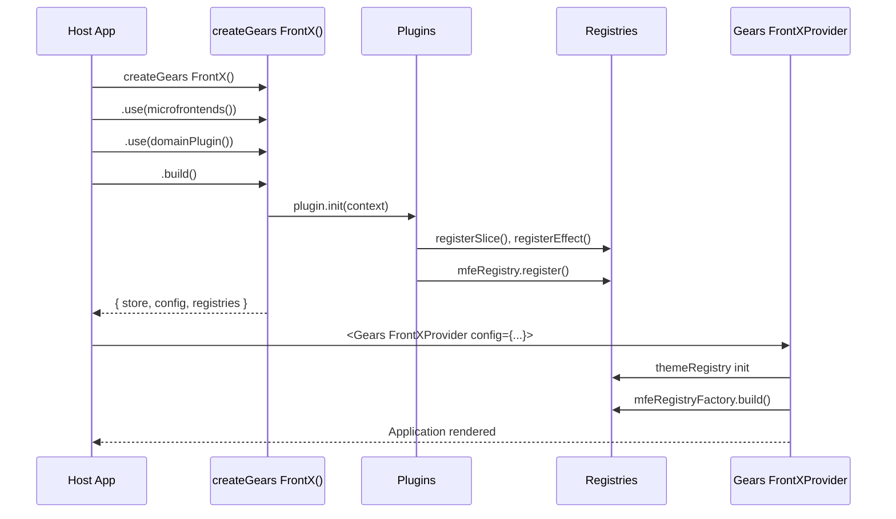
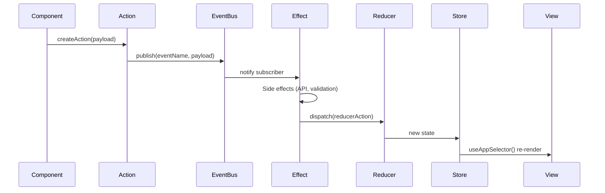
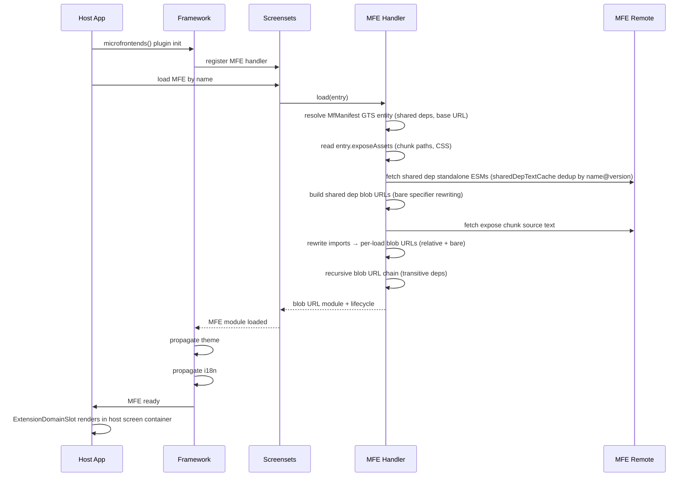
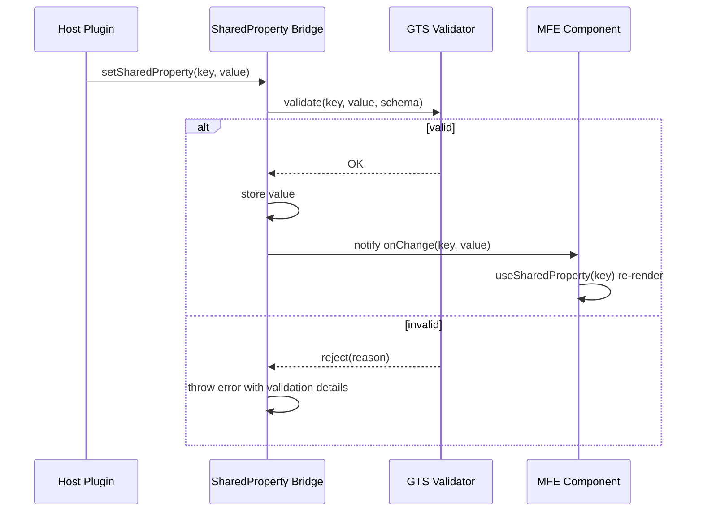
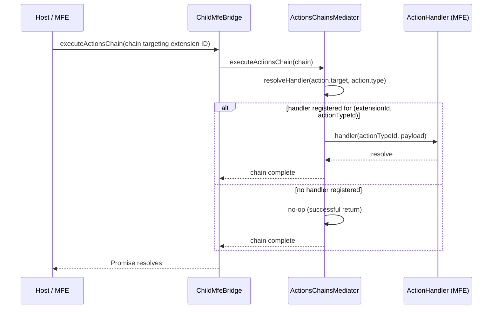
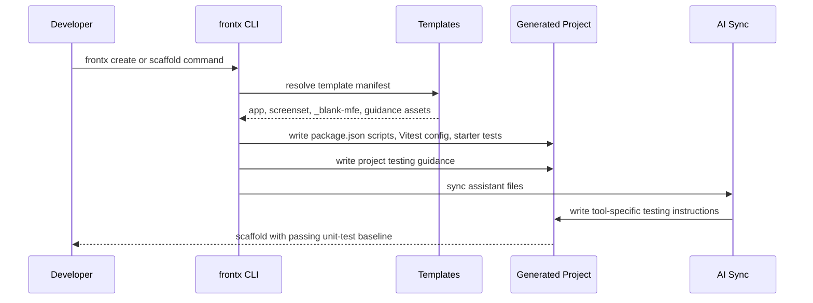
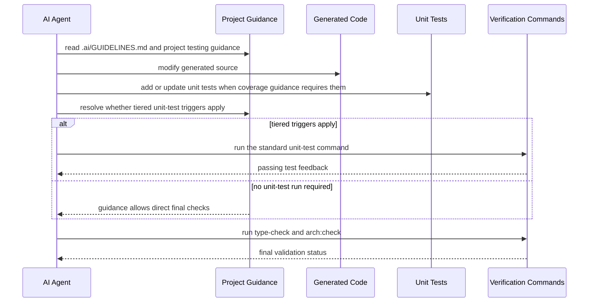
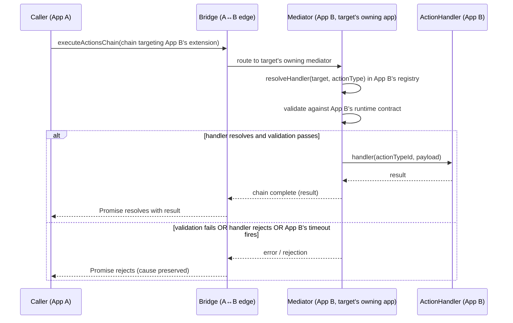
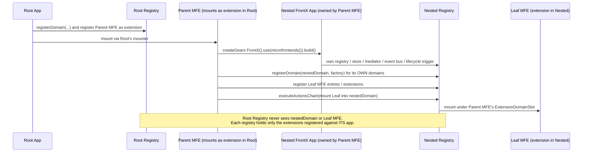

# Technical Design — FrontX Dev Kit

<!-- artifact-version: 1.5 -->

<!-- toc -->

- [1. Architecture Overview](#1-architecture-overview)
  - [1.1 Architectural Vision](#11-architectural-vision)
  - [1.2 Architecture Drivers](#12-architecture-drivers)
  - [1.3 Architecture Layers](#13-architecture-layers)
- [2. Principles & Constraints](#2-principles--constraints)
  - [2.1 Design Principles](#21-design-principles)
  - [2.2 Constraints](#22-constraints)
- [3. Technical Architecture](#3-technical-architecture)
  - [3.1 Domain Model](#31-domain-model)
  - [3.2 Component Model](#32-component-model)
  - [3.3 API Contracts](#33-api-contracts)
  - [3.4 Internal Dependencies](#34-internal-dependencies)
  - [3.5 External Dependencies](#35-external-dependencies)
  - [3.6 Interactions & Sequences](#36-interactions--sequences)
  - [3.7 Database schemas & tables](#37-database-schemas--tables)
- [3.8 Publishing Pipeline Architecture](#38-publishing-pipeline-architecture)
- [4. Additional context](#4-additional-context)
  - [4.5 Security Considerations](#45-security-considerations)
  - [4.6 Error Handling Strategy](#46-error-handling-strategy)
  - [4.7 API Evolution](#47-api-evolution)
  - [4.7b Documentation Strategy](#47b-documentation-strategy)
  - [4.8 Known Limitations](#48-known-limitations)
  - [4.9 Non-Applicable Domains](#49-non-applicable-domains)
- [5. Traceability](#5-traceability)

<!-- /toc -->

## 1. Architecture Overview

### 1.1 Architectural Vision

FrontX is a four-layer monorepo architecture that separates concerns vertically by abstraction level and horizontally by domain. The lowest layer (L1 SDK) provides framework-agnostic primitives for state, API communication, localization, and screen-set contracts. The middle layer (L2 Framework) composes these primitives through a plugin system. The upper layer (L3 React) binds the framework to React 19. Standalone packages (`@gears-frontx/studio`, `@gears-frontx/cli`) operate outside the layer hierarchy with minimal coupling, while UI implementation remains app-owned.

This layering enforces a strict dependency direction: higher layers depend on lower layers, never the reverse. L1 packages have zero cross-dependencies, meaning any SDK package can be used in isolation — in a Node.js CLI, a web worker, or a non-React rendering engine. The plugin architecture at L2 means the framework never needs modification to add capabilities; all extensions compose through `createGears FrontX().use(plugin).build()`.

The architecture is event-driven throughout. Components communicate exclusively through a typed event bus. The data flow follows a fixed sequence — Action → Event → Effect → Reducer → Store — enforced by convention and tooling. This eliminates ad-hoc state mutations, makes the system traceable, and enables microfrontend isolation where each MFE has its own internal data flow that connects to the host only through declared shared properties and events.

### 1.2 Architecture Drivers

Requirements that significantly influence architecture decisions.

**ADRs**:
`cpt-frontx-adr-four-layer-sdk-architecture`,
`cpt-frontx-adr-event-driven-flux-dataflow`,
`cpt-frontx-adr-plugin-based-framework-composition`,
`cpt-frontx-adr-blob-url-mfe-isolation`,
`cpt-frontx-adr-esm-first-module-format`,
`cpt-frontx-adr-screenset-vertical-slice-isolation`,
`cpt-frontx-adr-mandatory-screen-lazy-loading`,
`cpt-frontx-adr-hybrid-namespace-localization`,
`cpt-frontx-adr-standalone-studio-dev-conditional`,
`cpt-frontx-adr-protocol-separated-api-architecture`,
`cpt-frontx-adr-react-19-ref-as-prop`,
`cpt-frontx-adr-automated-layer-ordered-publishing`,
`cpt-frontx-adr-symbol-based-mock-plugin-identification`,
`cpt-frontx-adr-global-shared-property-broadcast`,
`cpt-frontx-adr-cli-template-based-code-generation`,
`cpt-frontx-adr-two-tier-cli-e2e-verification`,
`cpt-frontx-adr-channel-aware-version-locking`,
`cpt-frontx-adr-per-action-type-handler-routing`,
`cpt-frontx-adr-tanstack-query-data-management`,
`cpt-frontx-adr-mf2-manifest-discovery`,
`cpt-frontx-adr-mfe-state-lifecycle-boundary`,
`cpt-frontx-adr-domain-implementation-mount-strategies`,
`cpt-frontx-adr-lazy-import-abi`

#### Functional Drivers

| Requirement | Design Response |
|-------------|------------------|
| `cpt-frontx-fr-sdk-flat-packages` | Four separate L1 packages with independent `package.json`; npm workspaces for monorepo orchestration |
| `cpt-frontx-fr-sdk-layer-deps` | Strict layer dependency graph enforced by `dependency-cruiser` rules: L3→L2→L1 only |
| `cpt-frontx-fr-sdk-plugin-arch` | `createGears FrontX()` builder at L2 with `use()` chaining; each plugin receives `Gears FrontXPluginContext` |
| `cpt-frontx-fr-sdk-action-pattern` | All mutations flow through `createAction()` → eventBus dispatch → effect handler → Redux reducer |
| `cpt-frontx-fr-mfe-dynamic-registration` | Runtime MFE registration via `mfeRegistryFactory.build()` with handler injection |
| `cpt-frontx-fr-blob-fresh-eval` | Blob URL isolation: each MFE bundle fetched, rewritten, and evaluated in a fresh blob context |
| `cpt-frontx-fr-blob-import-rewriting` | Import specifiers in MFE bundles rewritten to blob URLs via `importRewriter` before evaluation; `import.meta.url` references rewritten to the real base URL |
| `cpt-frontx-fr-dataflow-no-redux` | MFEs use internal `useReducer`/`useState`; no access to host Redux store |
| `cpt-frontx-fr-broadcast-write-api` | Shared properties bridge host↔MFE via `setSharedProperty()`/`useSharedProperty()` |
| `cpt-frontx-fr-appconfig-event-api` | Application-level config changes propagated via `app/*` events, not direct store mutations |
| `cpt-frontx-fr-sse-protocol` | `@gears-frontx/api` abstracts REST and SSE behind `createApiService()` with protocol-specific adapters |
| `cpt-frontx-fr-i18n-lazy-chunks` | Namespace-based lazy loading: translation chunks loaded on demand per screen-set |
| `cpt-frontx-fr-externalize-transform` | `@module-federation/vite` configured with `shared:{}` and `rollupOptions.external` to externalize all declared shared dependencies (both `@gears-frontx/*` and third-party packages like `react`, `react-dom`); `frontx-mf-gts` plugin builds standalone ESM modules for each shared dep via esbuild and writes the enriched manifest to `{outDir}/mfe-manifest.json` with per-dep `chunkPath`/`version`/`unwrapKey`; handler constructs per-load shared dep blob URLs with bare specifier rewriting at runtime |
| `cpt-frontx-fr-mfe-plugin` | `microfrontends()` plugin integrates MFE lifecycle, theme propagation, i18n, and shared property bridging into framework |
| `cpt-frontx-fr-mock-toggle` | `mock()` plugin with `toggleMockMode` action enabling runtime switch between real and mock API responses |
| `cpt-frontx-fr-sdk-state-interface` | `@gears-frontx/state` exports EventBus, `createStore`, slice management APIs, and all associated types |
| `cpt-frontx-fr-sdk-flux-terminology` | FrontX Flux terms (Action, Event, Effect, Reducer, Slice) used consistently; Redux terms excluded from public API |
| `cpt-frontx-fr-sdk-screensets-package` | `@gears-frontx/screensets` exports full MFE type system, registry, handler, bridge, and constants with zero `@gears-frontx/*` deps |
| `cpt-frontx-fr-sdk-api-package` | `@gears-frontx/api` exports `BaseApiService`, REST/SSE protocols, mock plugins, `apiRegistry`, and type guards; only `axios` as peer dep |
| `cpt-frontx-fr-sdk-i18n-package` | `@gears-frontx/i18n` exports I18nRegistry, Language enum, formatters, and metadata utilities with zero dependencies |
| `cpt-frontx-fr-sdk-framework-layer` | `@gears-frontx/framework` wires SDK capabilities; depends only on SDK packages, provides `createGears FrontX()` and `createGears FrontXApp()` |
| `cpt-frontx-fr-sdk-react-layer` | `@gears-frontx/react` depends only on `@gears-frontx/framework`; provides `Gears FrontXProvider` and typed hooks; no layout components |
| `cpt-frontx-fr-sdk-module-augmentation` | TypeScript module augmentation for `EventPayloadMap` and `RootState` extensibility; custom events type-safe |
| `cpt-frontx-fr-appconfig-tenant` | `Tenant` type with `{ id: string }`; tenant change events via event bus (`app/tenant/changed`, `app/tenant/cleared`) |
| `cpt-frontx-fr-appconfig-router-config` | `Gears FrontXConfig.routerMode` supporting `'browser'`, `'hash'`, `'memory'` routing strategies |
| `cpt-frontx-fr-appconfig-layout-visibility` | Imperative actions (`setFooterVisible`, `setMenuVisible`, `setSidebarVisible`) control layout region visibility |
| `cpt-frontx-fr-sse-mock-mode` | `SseMockPlugin` short-circuits `EventSource` creation; returns `MockEventSource` for dev/test environments |
| `cpt-frontx-fr-sse-protocol-registry` | `BaseApiService` uses protocol registry; protocols registered by constructor name via type-safe `protocol<T>()` |
| `cpt-frontx-fr-sse-type-safe-events` | SSE events typed via `EventPayloadMap` module augmentation for compile-time safety |
| `cpt-frontx-fr-sse-stream-descriptors` | `SseStreamProtocol.stream<TEvent>()` returns `StreamDescriptor` with `connect`/`disconnect`; `useApiStream` hook manages lifecycle |
| `cpt-frontx-fr-mfe-entry-types` | `MfeEntry`, `MfeEntryMF`, `Extension`, `ScreenExtension` types define MFE communication contracts |
| `cpt-frontx-fr-mfe-ext-domain` | `ExtensionDomain` type defines id, sharedProperties, actions, extensionsActions, defaultActionTimeout, lifecycleStages, extensionsLifecycleStages, and optional extensionsTypeId |
| `cpt-frontx-fr-mfe-shared-property` | `SharedProperty` type with `id: string` and `value: unknown`; constants are GTS type IDs |
| `cpt-frontx-fr-mfe-action-types` | `Action` and `ActionsChain` types enable chain-based MFE action execution with fallback support; action `type` values are GTS schema type IDs (trailing `~`); extension references in payloads use `subject` field |
| `cpt-frontx-fr-mfe-theme-propagation` | `themes()` plugin propagates theme changes to all MFE extensions via `mfeRegistry.updateSharedProperty()` |
| `cpt-frontx-fr-mfe-i18n-propagation` | `i18n()` plugin propagates language changes to all MFE extensions via `mfeRegistry.updateSharedProperty()` |
| `cpt-frontx-fr-blob-no-revoke` | Blob URLs kept alive for page lifetime; `URL.revokeObjectURL()` never called after `import()` resolves — top-level-await correctness invariant of the loader |
| `cpt-frontx-fr-mfe-author-state-lifecycle` | MFE entry constructs per-mount state in `mount()` and disposes it in `unmount()`; module-scope state survives across mount cycles within a single load (host owns module-scope lifetime, author owns instance-scope lifetime) |
| `cpt-frontx-fr-blob-source-cache` | In-memory cache of fetched source text keyed by chunk URL; at most one network fetch per chunk across all loads |
| `cpt-frontx-fr-blob-recursive-chain` | MFE handler recursively creates blob URLs for chunk and all static dependencies |
| `cpt-frontx-fr-blob-per-load-map` | Blob URL mapping scoped per MFE load; different loads have independent instances preventing cross-load reuse |
| `cpt-frontx-fr-externalize-filenames` | Shared dependency standalone ESM files use deterministic filenames without content hashes for stable MFE manifests |
| `cpt-frontx-fr-externalize-build-only` | `rollupOptions.external` externalizes shared dependencies at `vite build` only; during `vite dev`, imports resolve through standard Vite dev server resolution; `frontx-mf-gts` plugin builds standalone ESMs only in the `closeBundle` production hook |
| `cpt-frontx-fr-dataflow-internal-app` | Each MFE creates isolated `Gears FrontXApp` via `createGears FrontX().use(effects()).use(queryCacheShared()).use(mock()).build()` with `Gears FrontXProvider` (shared QueryClient owned by host) |
| `cpt-frontx-fr-sharescope-construction` | `MfeHandlerMF` fetches standalone ESM source text for each shared dep (deduplicated via `sharedDepTextCache` keyed by `name@version` across all runtimes), rewrites bare specifiers between shared deps to blob URLs, and creates per-load blob URLs for isolation; no `createInstance()`, no `FederationHost`, no `__mf_init__` globals, no `globalThis.__federation_shared__` |
| `cpt-frontx-fr-sharescope-concurrent` | Each load creates independent shared dep blob URLs captured by its own `LoadBlobState`; `sharedDepTextCache` deduplicates source text (keyed by `name@version`); per-load blob URLs ensure concurrent loads get isolated module evaluations with no cross-load reuse |
| `cpt-frontx-fr-broadcast-matching` | `updateSharedProperty()` propagates only to domains declaring the property in their `sharedProperties` array |
| `cpt-frontx-fr-broadcast-validate` | GTS validation occurs before propagation; invalid values never stored or broadcast to any domain |
| `cpt-frontx-fr-validation-gts` | `typeSystem.register()` validates shared property values against their GTS schema in a single call and throws with a rich diagnostic (instance JSON, resolved schema JSON, failure reason) on non-conformance |
| `cpt-frontx-fr-validation-reject` | `updateSharedProperty()` throws with validation details on failure; value not stored or propagated |
| `cpt-frontx-fr-i18n-formatters` | Locale-aware formatters (`formatDate`, `formatNumber`, `formatCurrency`, etc.) using `Intl.*` APIs |
| `cpt-frontx-fr-i18n-formatter-exports` | Formatters exported from `@gears-frontx/i18n`, re-exported from `@gears-frontx/framework`, accessible via `useFormatters()` |
| `cpt-frontx-fr-i18n-graceful-invalid` | All formatters return `''` for null, undefined, or invalid inputs; never throw |
| `cpt-frontx-fr-i18n-hybrid-namespace` | Two-tier namespaces: `screenset.<id>` for shared content, `screen.<setId>.<screenId>` for screen-specific |
| `cpt-frontx-fr-studio-panel` | `StudioPanel` floating overlay: draggable, resizable, collapsible; visible only in dev mode; state in localStorage |
| `cpt-frontx-fr-studio-controls` | StudioPanel provides: theme selector, language selector, mock/real API toggle |
| `cpt-frontx-fr-studio-persistence` | Theme, language, mock API state persisted to localStorage; restored on Studio mount |
| `cpt-frontx-fr-studio-viewport` | Studio button and panel clamped to viewport (20px margin) on load and window resize |
| `cpt-frontx-fr-studio-independence` | `@gears-frontx/studio` standalone package; `"sideEffects": false`; excluded from production via `import.meta.env.DEV` |
| `cpt-frontx-fr-cli-package` | `@gears-frontx/cli` workspace package with binary `frontx`; ESM (Node 18+) and programmatic API |
| `cpt-frontx-fr-cli-commands` | CLI commands: create, update, scaffold layout/screenset, validate components, ai sync, migrate. `frontx validate components` is structural only and does not run the unit-test suite by default. `frontx create` scaffolds the standard Vitest workflow by default, and code-generation commands emit starter unit tests when a stable template exists |
| `cpt-frontx-fr-cli-templates` | Template system with `copy-templates.ts` build script, `manifest.json`; templates are user-owned and include test assets plus editable project-level testing guidance for generated apps and screensets |
| `cpt-frontx-fr-cli-skills` | CLI build generates IDE guidance files and command adapters for Claude, Cursor, Windsurf, and GitHub Copilot. Generated AI guidance routes agents to project testing guidance and the standard unit-test workflow under tiered triggers, and clarifies that `frontx validate components` does not run unit tests by default |
| `cpt-frontx-fr-cli-e2e-verification` | Two-tier CI verification: required PR workflow (`cli-pr-e2e`) validates the critical scaffold path, including install, build, type-check, and the standard unit-test workflow; nightly workflow covers broader scenarios; shared scripted harness with artifact upload |
| `cpt-frontx-fr-ai-agent-integration` | Generated project AI context carries machine-readable FrontX guidance plus project-level testing guidance so agents know when to add or update unit tests, run the standard unit-test command as a separate step from `frontx validate components` when tiered triggers apply, and run `type-check` and `arch:check` after applicable tests |
| `cpt-frontx-fr-pub-metadata` | All `@gears-frontx/*` packages include complete NPM metadata: author, license, repository, engines, exports |
| `cpt-frontx-fr-pub-versions` | All `@gears-frontx/*` packages use aligned (same) version numbers |
| `cpt-frontx-fr-pub-esm` | ESM-first module format: `"type": "module"`, dual exports (ESM + CJS), TypeScript declarations |
| `cpt-frontx-fr-pub-ci` | CI auto-publishes affected packages to NPM in layer order on version change merge; stops on first failure |
| `cpt-frontx-fr-api-request-cancellation` | `RestProtocol` HTTP methods accept optional `AbortSignal` via `RestRequestOptions`; aborted requests bypass `onError` plugin chain |
| `cpt-frontx-fr-api-endpoint-descriptors` | `BaseApiService` exposes registered protocols via `protocol()`. `RestEndpointProtocol` provides `query()`, `queryWith()`, `mutation()`, and `SseStreamProtocol` provides `stream()` returning descriptor objects; cache keys derive from `[baseURL, 'GET', path]` for static reads, `[baseURL, 'GET', resolvedPath, params]` for parameterized reads, `[baseURL, method, path]` for writes, and `[baseURL, 'SSE', path]` for streams |
| `cpt-frontx-fr-framework-query-cache-plugin` | `queryCache(config?)` owns the host shared `QueryClient`; `queryCacheShared()` joins it for child apps; cache clears on mock toggle, handles `cache/invalidate`/`cache/set`/`cache/remove`, and keeps `sharedFetchCache` in sync |
| `cpt-frontx-fr-react-query-hooks` | `useApiQuery`, `useApiMutation`, `useApiStream`, `useQueryCache` hooks consume descriptors; Gears FrontX-owned result types; no `queryOptions` re-export |
| `cpt-frontx-fr-react-query-client-sharing` | `Gears FrontXProvider` resolves the shared `QueryClient` from the app instance; separately mounted MFEs receive the same host client through `queryCache()` / `queryCacheShared()` shared-client reuse rather than L1 token plumbing, and expose only the restricted `QueryCache` interface |
| `cpt-frontx-fr-manifest-generation-script` | Generation script is a temporary static aggregator that writes the aggregated `generated-mfe-manifests.json` to a public asset path at build time; it reads each MFE's `{outDir}/mfe-manifest.json` (produced by the `frontx-mf-gts` plugin) with `--base-url` for environment-specific `publicPath`; the aggregator passes the optional `domains[]` array through verbatim (transport-only — no enrichment, no validation, no shape derivation) so MFE-declared `ExtensionDomain` instances reach the host bootstrap unchanged; the host bootstrap (and any nested FrontX app instance) fetches the aggregated manifest at runtime from that public-asset URL — script builds json, json is read at runtime; the public-asset URL is a temporary substitute for an eventual backend API, and replacing it is a one-line URL change in the host bootstrap fetch — same enriched manifest shape, different transport |

#### NFR Allocation

| NFR ID | NFR Summary | Allocated To | Design Response | Verification Approach |
|--------|-------------|--------------|-----------------|----------------------|
| `cpt-frontx-nfr-perf-lazy-loading` | Screensets and MFE code loaded on demand | `cpt-frontx-component-screensets`, `cpt-frontx-component-framework` | Dynamic `import()` per screen-set; MFE bundles fetched at registration time | Bundle analysis; network waterfall in DevTools |
| `cpt-frontx-nfr-perf-treeshake` | Unused SDK exports eliminated at build | `cpt-frontx-component-state`, all L1 packages | ESM-only output via tsup; no side-effect barrel files | `knip` unused-export detection in CI |
| `cpt-frontx-nfr-perf-blob-overhead` | Blob URL creation < 50ms for typical MFE | `cpt-frontx-component-screensets` | Source text cached after first fetch; import rewriting operates on string, not AST | Performance benchmark in test suite |
| `cpt-frontx-nfr-perf-action-timeout` | Actions complete or timeout within defined bounds | `cpt-frontx-component-state` | Effect handlers responsible for timeout; framework does not enforce global timeout | Unit tests with async action scenarios |
| `cpt-frontx-nfr-rel-error-handling` | Plugin/MFE errors do not crash host | `cpt-frontx-component-framework`, `cpt-frontx-component-react` | React error boundaries per MFE; plugin `init()` failures logged, not thrown | Integration tests with failing plugins |
| `cpt-frontx-nfr-rel-api-retry` | API calls support retry with backoff | `cpt-frontx-component-api` | Axios interceptor layer; retry configuration per service instance | Unit tests with mock server |
| `cpt-frontx-nfr-rel-serialization` | State serializable for persistence/debugging | `cpt-frontx-component-state` | Redux Toolkit enforces serializable state by default; custom middleware logs violations | Redux DevTools inspection |
| `cpt-frontx-nfr-sec-shadow-dom` | MFE CSS isolated from host | `cpt-frontx-component-react` | Shadow DOM wrapper for MFE render containers | Visual regression tests |
| `cpt-frontx-nfr-sec-csp-blob` | Blob URLs compatible with CSP policies | `cpt-frontx-component-screensets` | `blob:` scheme added to `script-src`; no `eval()` or `new Function()` used | CSP violation reporting in staging |
| `cpt-frontx-nfr-sec-type-validation` | Shared properties and actions validated at boundary | `cpt-frontx-component-framework` | GTS plugin validates shared property values against declared schemas; actions validated as anonymous instances (no `id`, schema resolved from `type` field) | Unit tests with invalid payloads and malformed actions |
| `cpt-frontx-nfr-compat-node` | Packages installable on Node ≥ 18 | All packages | `engines` field in each `package.json`; CI matrix tests Node 18/20/22 | CI build matrix |
| `cpt-frontx-nfr-compat-typescript` | TypeScript ≥ 5.5 | All packages | `tsconfig.json` targets ES2022; strict mode enabled | CI type-check step |
| `cpt-frontx-nfr-compat-esm` | ESM-first output | All packages | tsup configured with `format: ['esm']`; `"type": "module"` in `package.json` | Import resolution tests |
| `cpt-frontx-nfr-compat-react` | Compatible with React 19 | `cpt-frontx-component-react` | React 19 as peer dependency; `ref` as prop (no `forwardRef`) | CI tests against React 19 |
| `cpt-frontx-nfr-maint-zero-crossdeps` | L1 packages have zero cross-dependencies | All L1 packages | Each L1 `package.json` lists no `@gears-frontx/*` dependencies; `dependency-cruiser` rule blocks violations | CI dependency-cruiser check |
| `cpt-frontx-nfr-maint-event-driven` | Cross-domain communication via events only | `cpt-frontx-component-state`, `cpt-frontx-component-framework` | `eventBus` is the sole cross-domain channel; no direct store imports across domains | Architecture lint rules |
| `cpt-frontx-nfr-maint-arch-enforcement` | Layer violations detected automatically | Build system, `cpt-frontx-component-cli` | `dependency-cruiser` config with forbidden dependency rules and `knip` for unused exports remain the hard architecture gates; generated AI guidance keeps `arch:check` in the default verification loop after applicable standard unit-test runs pass | CI gate on lint failure; scaffolded workflow verification in CLI CI |

### 1.3 Architecture Layers

- [x] `p1` - **ID**: `cpt-frontx-tech-layer-architecture`

```
┌─────────────────────────────────────────────────────┐
│                    Application                       │
│          (Host app using @gears-frontx/* packages)           │
├─────────────────────────────────────────────────────┤
│ L3  @gears-frontx/react                                      │
│     Gears FrontXProvider · hooks · MFE components            │
├─────────────────────────────────────────────────────┤
│ L2  @gears-frontx/framework                                  │
│     createGears FrontX() · plugins · layout slices           │
├────────┬────────┬──────────┬────────────────────────┤
│ L1     │ L1     │ L1       │ L1                      │
│ state  │ screen │ api      │ i18n                    │
│        │ sets   │          │                         │
├────────┴────────┴──────────┴────────────────────────┤
│ Standalone: @gears-frontx/studio · @gears-frontx/cli                            │
└─────────────────────────────────────────────────────┘
```

| Layer | Responsibility | Technology |
|-------|---------------|------------|
| L1 SDK | Framework-agnostic primitives: state management, screen-set contracts, API protocols, i18n infrastructure | TypeScript, Redux Toolkit, Axios, i18next |
| L2 Framework | Plugin composition, layout orchestration, configuration management, re-exports SDK surface | TypeScript, Redux Toolkit (slices) |
| L3 React | React bindings, provider tree, hooks, MFE rendering components | React 19, Shadow DOM |
| Standalone — Studio | Development overlay for theme/i18n/state inspection | React 19, localStorage |
| Tooling — CLI | Scaffolding, code generation, AI skill integration | Node.js, Commander |

**Build order**: SDK (L1) → Framework (L2) → React (L3) → Studio → CLI (`npm run build:packages`)

**MFE package build pipeline**: `vite build` with `@module-federation/vite` (`shared: {}`, `rollupOptions.external`; produces chunks + `mf-manifest.json`) → `frontx-mf-gts` plugin `closeBundle` (reads `mf-manifest.json` and source `mfe.json`; builds standalone ESM modules for shared deps into `{outDir}/shared/`; writes the enriched manifest to `{outDir}/mfe-manifest.json` with `manifest.metaData`, `manifest.shared[]` with per-dep `chunkPath`/`version`/`unwrapKey`, and `entries[].exposeAssets`) → generation script with `--base-url` (reads `{outDir}/mfe-manifest.json` from each MFE, writes aggregated `generated-mfe-manifests.json`) → host dev server / deployment. The generation script is a temporary aggregator — it will be replaced by a backend API returning the same enriched manifest content. `mf-manifest.json` does not leave the build stage; `{outDir}/mfe-manifest.json` is the complete self-contained build-output contract per MFE; source `mfe.json` remains human-authored and environment-independent.

## 2. Principles & Constraints

### 2.1 Design Principles

#### Event-Driven Architecture

- [x] `p1` - **ID**: `cpt-frontx-principle-event-driven-architecture`

**ADRs**: `cpt-frontx-adr-event-driven-flux-dataflow`

All cross-domain communication flows through a typed event bus (`eventBus` in `@gears-frontx/state`). No component may directly call methods on or import internal state from another domain. This ensures loose coupling, enables replay/debugging of all system interactions, and allows MFE extensions to participate in host events without tight integration.

The event bus uses a publish/subscribe model with typed event names and payloads. Framework plugins subscribe to events during initialization. Effects listen for specific events and dispatch state changes through reducers.

#### Layer Isolation

- [x] `p1` - **ID**: `cpt-frontx-principle-layer-isolation`

**ADRs**: `cpt-frontx-adr-four-layer-sdk-architecture`

Dependencies flow strictly downward: L3 → L2 → L1. No upward or lateral dependencies are permitted within the layer hierarchy. L1 packages have zero `@gears-frontx/*` dependencies. L2 depends only on L1 packages. L3 depends only on L2 (which re-exports L1 surface). This enables each layer to be tested, built, and versioned independently.

Standalone packages (`@gears-frontx/studio`, `@gears-frontx/cli`) exist outside the layer hierarchy and do not depend on framework or SDK packages, ensuring they can evolve independently. UI components are generated into or authored within application code rather than shipped as a shared workspace package.

#### Plugin-First Composition

- [x] `p1` - **ID**: `cpt-frontx-principle-plugin-first-composition`

**ADRs**: `cpt-frontx-adr-plugin-based-framework-composition`

All framework capabilities are delivered through plugins. The framework core (`createGears FrontX()`) is a minimal builder that assembles a plugin chain. Each plugin implements the `Gears FrontXPlugin` interface with an `init(context: Gears FrontXPluginContext)` method. Plugins register slices, effects, event listeners, and UI extensions through the context object.

The host application composes its feature set by chaining `.use()` calls: `createGears FrontX().use(microfrontends()).use(myDomainPlugin()).build()`. No framework source code needs modification to add capabilities.

#### Self-Registering Registries

- [x] `p2` - **ID**: `cpt-frontx-principle-self-registering-registries`

Registries (screensets, themes, API services, routes, i18n namespaces) populate themselves at import time through side-effect registrations. Consumers never edit a central registry file to add entries. Each screen-set, component, or service registers itself in its own module. The registry root file only provides the registry factory/accessor — it never contains an item list.

This eliminates merge conflicts on registry files and enables tree-shaking of unused registrations.

#### Action → Event → Effect → Reducer Flux

- [x] `p1` - **ID**: `cpt-frontx-principle-action-event-effect-reducer-flux`

**ADRs**: `cpt-frontx-adr-event-driven-flux-dataflow`

All state mutations follow a fixed sequence: (1) Component calls `createAction()`, (2) action dispatches an event via `eventBus`, (3) registered effects handle the event (API calls, validation, side effects), (4) effects dispatch Redux actions, (5) reducers produce new state. Components never dispatch Redux actions directly. This ensures every state change is traceable and debuggable.

The terminology follows Redux Toolkit conventions: slices, reducers, selectors, thunks — but wrapped in FrontX's action/event abstraction to enforce the data flow pattern.

#### MFE Isolation

- [x] `p1` - **ID**: `cpt-frontx-principle-mfe-isolation`

**ADRs**: `cpt-frontx-adr-blob-url-mfe-isolation`, `cpt-frontx-adr-mf2-manifest-discovery`

Microfrontend extensions execute in an isolated context. JavaScript isolation is achieved through blob URL evaluation: each MFE bundle is fetched, its import specifiers are rewritten to point to blob URLs of shared dependencies, and the rewritten bundle is evaluated in a new module scope. CSS isolation uses Shadow DOM containers. MFEs have no access to the host Redux store; they communicate with the host exclusively through shared properties and the event bus.

### 2.2 Constraints

#### No React Below L3

- [x] `p1` - **ID**: `cpt-frontx-constraint-no-react-below-l3`

**ADRs**: `cpt-frontx-adr-four-layer-sdk-architecture`

L1 SDK and L2 Framework packages SHALL NOT import React or any React-specific APIs. This ensures the SDK and framework are usable in non-React environments (Node.js scripts, web workers, alternative renderers). React appears only in L3 (`@gears-frontx/react`) and standalone packages (`@gears-frontx/studio`).

**Enforcement**: `dependency-cruiser` rules flag any `react` import in `packages/state/`, `packages/screensets/`, `packages/api/`, `packages/i18n/`, or `packages/framework/`.

#### Zero Cross-Dependencies at L1

- [x] `p1` - **ID**: `cpt-frontx-constraint-zero-cross-deps-at-l1`

**ADRs**: `cpt-frontx-adr-four-layer-sdk-architecture`

No L1 SDK package may depend on another L1 SDK package. `@gears-frontx/state` SHALL NOT import from `@gears-frontx/api`, `@gears-frontx/i18n`, or `@gears-frontx/screensets`, and vice versa. This keeps each SDK package independently deployable and prevents coupling between orthogonal concerns.

**Enforcement**: Each L1 `package.json` is verified in CI to contain zero `@gears-frontx/*` entries in `dependencies` or `devDependencies`.

#### No Package Internals Imports

- [x] `p2` - **ID**: `cpt-frontx-constraint-no-package-internals-imports`

Consumers SHALL NOT import from sub-paths of workspace packages (e.g., `@gears-frontx/state/src/eventBus`). All public API is exported through the package entry point. Internal module structure is an implementation detail that may change without notice.

**Enforcement**: ESLint rule + `dependency-cruiser` forbidden path pattern `@gears-frontx/*/src/*`.

#### No Barrel Exports for Registries

- [x] `p2` - **ID**: `cpt-frontx-constraint-no-barrel-exports-for-registries`

Registry root files SHALL NOT re-export individual registry items. Each registered item (screen-set, component, service) self-registers via side-effect import. The registry file provides only the factory, accessor, or type — never the item list. This prevents barrel files from defeating tree-shaking and eliminates merge conflicts on central export lists.

#### TypeScript Strict Mode

- [x] `p1` - **ID**: `cpt-frontx-constraint-typescript-strict-mode`

All packages compile with `"strict": true` in `tsconfig.json`. Use of `any`, `as unknown as`, or `@ts-ignore` is forbidden. Type safety is enforced at compile time across all layers. Module augmentation (`declare module`) is the approved mechanism for extending framework types from plugins.

**Enforcement**: CI type-check step with `tsc --noEmit`; ESLint `@typescript-eslint/no-explicit-any` rule.

#### ESM-First Module Format

- [x] `p1` - **ID**: `cpt-frontx-constraint-esm-first-module-format`

**ADRs**: `cpt-frontx-adr-esm-first-module-format`

All packages output ESM as the primary module format. `package.json` files include `"type": "module"` and `"exports"` field with ESM entry points. CJS is not supported. This ensures compatibility with modern bundlers, enables tree-shaking, and aligns with the platform direction of Node.js and browsers.

**Enforcement**: tsup build configuration with `format: ['esm']`; `package.json` validation in CI.

#### Dependency Licensing

- [x] `p2` - **ID**: `cpt-frontx-constraint-oss-licensing`

All direct runtime dependencies MUST use MIT, Apache-2.0, or BSD-compatible licenses. Copyleft licenses (GPL, AGPL) are prohibited for runtime dependencies.

## 3. Technical Architecture

### 3.1 Domain Model

**Technology**: TypeScript interfaces and types

**Core Entities**:

| Entity | Description | Location |
|--------|-------------|----------|
| ScreenSet | A named collection of screens registered at runtime; the primary unit of UI composition | `packages/screensets/src/types.ts` |
| Screen | A single view within a screen-set; may contain components and MFE slots | `packages/screensets/src/types.ts` |
| Component | A React UI element authored in app-owned UI folders such as `components/ui/` | Per-MFE/screenset or generated app source |
| Microfrontend | An externally-built UI bundle loaded at runtime via blob URL isolation | `packages/screensets/src/mfe/` |
| ExtensionDomain | GTS-validated declaration of a domain (id, sharedProperties, actions, lifecycleStages, etc.); behavior-free | `packages/screensets/src/types.ts` |
| ExtensionDomainImplementation | Abstract behavior class for a registered domain | `packages/screensets/src/mfe/runtime/` |
| ExtensionDomainImplementationFactory | Abstract factory class that constructs an ExtensionDomainImplementation | `packages/screensets/src/mfe/runtime/` |
| ExtensionMounter | Per-domain abstract mount facade owned by the registry | `packages/screensets/src/mfe/runtime/` |
| DomainContext | Per-registration bundle of framework primitives passed to the implementation factory | `packages/screensets/src/mfe/runtime/` |
| ContainerHooks | Implementation-supplied per-extension element factory | `packages/screensets/src/mfe/runtime/` |
| MountStrategy | Abstract base class for domain mount-cardinality strategies | `packages/screensets/src/mfe/runtime/` |
| DomainLifecycleTrigger | Per-domain abstract facade for implementation-driven lifecycle transitions | `packages/screensets/src/mfe/runtime/` |
| ConcurrentMountStrategy | Strategy class for multi-mount cardinality domains | `packages/screensets/src/mfe/runtime/` |
| OptionalMountStrategy | Strategy class for 0-or-1 cardinality domains with explicit unmount | `packages/screensets/src/mfe/runtime/` |
| ExclusiveMountStrategy | Strategy class for pre-emptive single-mount cardinality domains | `packages/screensets/src/mfe/runtime/` |
| State (Store) | Redux Toolkit store composed from plugin-registered slices | `packages/state/src/store.ts` |
| Event | A typed message on the event bus; carries a name and payload | `packages/state/src/eventBus.ts` |
| Action | A domain operation that dispatches events; created via `createAction()` | `packages/state/src/actions.ts` |
| Effect | An event handler that performs side effects and dispatches reducers | `packages/state/src/effects.ts` |
| Plugin | A framework extension implementing `Gears FrontXPlugin` interface | `packages/framework/src/plugin.ts` |
| SharedProperty | A typed value bridging host and MFE state; validated at boundaries | `packages/framework/src/sharedProperty.ts` |
| ProjectTestingConvention | Generated project contract that defines the canonical unit-test command and baseline Vitest scaffold expectations | Generated `package.json`, Vitest config, and CLI template metadata |
| ProjectTestingGuidance | Editable project AI guidance describing when generated code needs unit tests and how the standard workflow is executed | Generated `.ai/project/GUIDELINES.md` and `.ai/project/targets/UNIT_TESTING.md` |

**Relationships**:
- ScreenSet → Screen: contains one or more
- Screen → Component: renders zero or more
- Screen → Microfrontend: hosts zero or more as extension slots
- Plugin → State: registers slices and effects during init
- Plugin → Event: subscribes to and publishes events
- Microfrontend → SharedProperty: reads/writes declared shared values
- ProjectTestingConvention → ProjectTestingGuidance: standard test command and scaffold expectations are referenced by generated AI instructions
- Action → Event → Effect → State: fixed data flow sequence

### 3.2 Component Model

```
┌───────────────────────────────────────────────────────────┐
│                      Host Application                      │
│                                                           │
│  ┌─────────┐  ┌──────────────┐  ┌──────────────────────┐ │
│  │ @gears-frontx/  │  │  @gears-frontx/react │  │  app-owned UI        │ │
│  │ studio  │  │  Gears FrontXProvider │  │  components          │ │
│  └─────────┘  │  hooks        │  └──────────────────────┘ │
│               │  ExtensionDomainSlot │                   │
│               └──────┬───────┘                            │
│                      │ depends on                         │
│               ┌──────▼───────┐                            │
│               │ @gears-frontx/       │                            │
│               │ framework    │                            │
│               │ createGears FrontX() │                            │
│               │ plugins      │                            │
│               └──┬──┬──┬──┬─┘                            │
│           depends│  │  │  │on                             │
│     ┌────────┬──┘  │  │  └──┬────────┐                   │
│     ▼        ▼     ▼  ▼     ▼        │                   │
│  ┌──────┐ ┌──────┐ ┌────┐ ┌─────┐   │                   │
│  │state │ │screen│ │api │ │i18n │   │                   │
│  │      │ │sets  │ │    │ │     │   │                   │
│  └──────┘ └──────┘ └────┘ └─────┘   │                   │
│    L1       L1       L1     L1       │                   │
│  (no cross-dependencies)      ┌──────▼─┐                 │
│                               │@gears-frontx/  │                 │
│                               │cli     │                 │
│                               └────────┘                 │
└───────────────────────────────────────────────────────────┘
```

#### @gears-frontx/state (L1)

- [x] `p1` - **ID**: `cpt-frontx-component-state`

##### Why this component exists

Provides the foundational state management and event infrastructure that all other packages build upon. Without a shared event bus and store abstraction, each package would implement its own state patterns, leading to fragmented debugging and untraceable data flow.

##### Responsibility scope

- **Event bus**: Typed publish/subscribe messaging (`eventBus.publish()`, `eventBus.subscribe()`) for all cross-domain communication
- **Store factory**: Creates and configures Redux Toolkit store with dynamically registered slices
- **Action factory**: `createAction()` produces typed action creators that dispatch events
- **Effect system**: Registers effect handlers that respond to events and produce state changes
- **Flux terminology**: Enforces Action → Event → Effect → Reducer naming and flow conventions
- **Module augmentation**: Supports `declare module '@gears-frontx/state'` for type-safe slice extensions

##### Responsibility boundaries

- Does NOT provide UI bindings (React hooks, components) — delegated to `cpt-frontx-component-react`
- Does NOT define domain-specific slices — each plugin registers its own slices
- Does NOT depend on any other `@gears-frontx/*` package
- Does NOT implement persistence or devtools — relies on Redux Toolkit's built-in middleware

##### Related components (by ID)

- `cpt-frontx-component-framework` — depends on: framework registers slices and effects via plugin context
- `cpt-frontx-component-react` — depends on: provides hooks (`useAppSelector`, `useAppDispatch`) over this store

#### @gears-frontx/screensets (L1)

- [x] `p1` - **ID**: `cpt-frontx-component-screensets`

##### Why this component exists

Defines the contract between the host application and microfrontend extensions. Manages the screen-set registry, MFE lifecycle, and blob URL isolation mechanism. Separating this from `@gears-frontx/state` keeps MFE concerns (loading, isolation, source caching) orthogonal to state management.

##### Responsibility scope

- **Screen-set registry**: `mfeRegistryFactory` for registering/querying screen-sets with handler injection
- **MFE type contracts**: Entry types (component, screen, extension), domain declarations, shared property schemas, action schema type definitions (GTS schema type IDs with trailing `~`; payloads use `subject` for extension references)
- **Domain implementation contract**: domain authors plug behavior into a registered domain by supplying an implementation factory; the framework owns the construction lifetime and provides per-registration primitives. Method-level surface is in `cpt-frontx-feature-mfe-registry`.
- **Per-domain mount facade**: the registry exposes a per-domain mount facade to the implementation for root attachment and per-extension mount/unmount; the registry retains canonical mount-set state.
- **Per-domain lifecycle trigger**: the registry exposes a per-domain facade for implementation-driven lifecycle transitions.
- **Mount strategies**: the framework ships an abstract base plus three concrete cardinality strategies (concurrent / optional / exclusive). Cardinality is the domain author's choice via the strategy class; the framework infers nothing from action declarations. A registration-time cross-validation matrix enforces strategy/action consistency.
- **Mount-set query**: the registry's per-domain mount-set is the canonical source of currently-mounted extension IDs within its owning app.
- **Blob URL isolation**: Fetches MFE bundles, rewrites import specifiers to blob URLs, caches source text, manages per-load import maps
- **Import rewriting**: Transforms bare import specifiers for all declared shared dependencies (both `@gears-frontx/*` and third-party) in MFE bundles to blob URL references for runtime resolution
- **Recursive chain loading**: Resolves transitive dependencies by recursively blob-loading imported modules

**Per-app boundary.** `ScreensetsRegistry` is per FrontX app instance. Every FrontX app — the root host application AND any nested app created by an MFE that needs to own its own extension domains — uses the same `createGears FrontX()` primitive and owns its own registry, store, mediator, event bus, and lifecycle trigger. There is no shared registry across the app tree. An app's registry holds only the domains and extensions registered against THAT app; a parent app's registry never sees a nested app's mount state. Cross-app chain delivery between apps is an internal routing concern (described in §3.6 Extension Action Delivery), not a registry-sharing concern.

**Layout taxonomy is opt-in.** The framework does NOT enforce a layout taxonomy. Projects MAY use the shipped `LayoutDomain` / `Gears FrontX_*_DOMAIN` convenience constants, MAY define entirely custom domains, MAY mix the two. Domain registration is an L4 (application) concern: the framework provides the `ExtensionDomain` mechanism and ships a set of conventional domain IDs; choosing which domains to register, with which mount strategies, is the application's call.

##### Responsibility boundaries

- Does NOT render MFE content (React mounting) — delegated to `cpt-frontx-component-react`
- Does NOT manage theme or i18n propagation into MFEs — delegated to `cpt-frontx-component-framework`
- Does NOT depend on any other `@gears-frontx/*` package
- Does NOT handle CSS isolation (Shadow DOM) — delegated to rendering layer
- Does NOT know how containers are created, positioned, or styled — container lifecycle lives on the implementation side; the framework receives opaque `Element` references through the mounter and uses them as host elements only
- Does NOT enforce a layout-domain taxonomy — the shipped `LayoutDomain` enum / `Gears FrontX_*_DOMAIN` constants are conveniences, and projects MAY register entirely custom domains or mix custom and shipped
- Mount handlers are the cardinality strategy classes; the per-domain mounter is the only public mount facade

##### Related components (by ID)

- `cpt-frontx-component-framework` — depends on: framework's `microfrontends()` plugin orchestrates MFE lifecycle using screensets API
- `cpt-frontx-component-react` — depends on: `ExtensionDomainSlot` provides a per-domain host element; mounted extensions render under it via the per-domain mounter

#### @gears-frontx/api (L1)

- [x] `p1` - **ID**: `cpt-frontx-component-api`

##### Why this component exists

Provides a unified API service layer that abstracts protocol differences (REST, SSE) behind a consistent interface. Developers create services without coupling to a specific transport; the protocol adapter handles serialization, connection management, and error recovery.

##### Responsibility scope

- **Service factory**: `createApiService()` produces typed API service instances
- **Protocol registry**: Registers protocol adapters (REST via Axios, SSE via EventSource) that can be switched at runtime
- **REST adapter**: Standard HTTP operations with Axios; interceptors for auth, retry, error mapping
- **SSE adapter**: Server-Sent Events connection management with typed event streams
- **Stream descriptors**: `this.protocol(SseStreamProtocol).stream<TEvent>(path)` returns `StreamDescriptor` routing through `SseProtocol` plugin chain; consumed by `useApiStream` at L3
- **Mock mode**: `RestMockPlugin` and `SseMockPlugin` provide mock responses; `toggleMockMode` action switches at runtime
- **Type-safe events**: SSE event types are generic-parameterized for compile-time safety

##### Responsibility boundaries

- Does NOT define business-domain API endpoints — each domain plugin defines its own services
- Does NOT manage authentication tokens — relies on interceptors configured by the consumer
- Does NOT depend on any other `@gears-frontx/*` package
- Axios is a peer dependency, not bundled

##### Related components (by ID)

- `cpt-frontx-component-framework` — depends on: framework plugins use `createApiService()` to register domain APIs
- `cpt-frontx-component-state` — publishes to: API effects dispatch events on the event bus for state updates

#### @gears-frontx/i18n (L1)

- [x] `p1` - **ID**: `cpt-frontx-component-i18n`

##### Why this component exists

Provides internationalization infrastructure with support for 36 languages, locale-aware formatting, and namespace-based lazy loading. Centralizes i18n concerns so that screen-sets, MFEs, and host app share consistent translation patterns without monolithic language bundles.

##### Responsibility scope

- **Language support**: 36 built-in language configurations with locale metadata
- **Formatter exports**: Date, number, currency, relative-time formatters exported individually for tree-shaking
- **Namespace management**: Hybrid namespace model — global keys for shared translations, screen-set-scoped keys for domain-specific content
- **Lazy chunk loading**: Translation files loaded on demand per namespace; reduces initial bundle size
- **Graceful fallback**: Invalid format inputs return fallback strings rather than throwing

##### Responsibility boundaries

- Does NOT provide React hooks for translation — delegated to `cpt-frontx-component-react` (which wraps i18next React bindings)
- Does NOT contain translation content — only infrastructure; content provided by consuming applications
- Does NOT depend on any other `@gears-frontx/*` package

##### Related components (by ID)

- `cpt-frontx-component-framework` — depends on: framework initializes i18n and propagates language changes to MFEs
- `cpt-frontx-component-react` — depends on: provides `useTranslation()` hook wrapping i18n infrastructure

#### @gears-frontx/framework (L2)

- [x] `p1` - **ID**: `cpt-frontx-component-framework`

##### Why this component exists

Composes L1 SDK packages into a cohesive application framework through a plugin architecture. Without this layer, each application would need to manually wire state, API, i18n, and screensets together — a complex, error-prone process that would lead to inconsistent patterns across projects.

##### Responsibility scope

- **Builder API**: `createGears FrontX()` returns a builder with `.use(plugin)` chaining and `.build()` finalization
- **Plugin system**: `Gears FrontXPlugin` interface with `init(context: Gears FrontXPluginContext)`; context provides access to store, event bus, registries
- **Layout orchestration**: Layout slices (menu, header, footer, sidebars, overlay, popups) managed as Redux state
- **Configuration management**: `AppConfig` with tenant settings, router config, layout visibility, theme — propagated via `app/*` events
- **MFE lifecycle plugin**: `microfrontends()` plugin handles MFE registration, theme propagation, i18n forwarding, shared property bridge, and per-domain mount-state mirroring within its app. The plugin's MFE slice tracks the per-domain set of currently mounted extensions for THIS app and exposes a typed selector for it. The plugin's chain-completion sync wrapper reconciles the slice against the registry's mount-set after each lifecycle action chain by emitting per-extension state events. There is no scalar mount slot. Cross-runtime extension discovery — including nested-app discovery — is content-addressed by the extension's `domain` GTS instance ID: every FrontX app's `microfrontends()` plugin reads `MfManifest` entities from the GTS runtime store and filters them by its own app's registered-domain-IDs view, so an MFE's source-tree location is independent of which runtime owns its target domain
- **Shared property system**: `setSharedProperty()` / `getSharedProperty()` with validation via GTS plugin
- **SDK re-exports**: Re-exports L1 public API so consumers can import from `@gears-frontx/framework` as a convenience

**Per-app boundary.** `createGears FrontX()` is the same primitive at every level of the app tree. The root host is the root FrontX app; any nested app created by an MFE that needs its own extension domains uses the SAME `createGears FrontX()` builder and ends up with its OWN store, event bus, MFE slice, mediator, and lifecycle trigger. Each app's `microfrontends()` plugin tracks only the extensions mounted in THAT app's registry. Architecturally there is no privileged "host" app — the root is just the outermost app, and nested apps are identical in shape and capability.

##### Responsibility boundaries

- Does NOT provide React components or hooks — delegated to `cpt-frontx-component-react`
- Does NOT define UI components — delegated to application/screenset local UI
- Does NOT implement blob URL isolation — uses `cpt-frontx-component-screensets` API
- Does NOT bundle L1 packages — re-exports only; each L1 remains independently installable

##### Related components (by ID)

- `cpt-frontx-component-state` — depends on: uses store, event bus, action/effect system
- `cpt-frontx-component-screensets` — depends on: uses registry factory and MFE contracts
- `cpt-frontx-component-api` — depends on: initializes API services and protocol adapters
- `cpt-frontx-component-i18n` — depends on: initializes i18n and manages language lifecycle
- `cpt-frontx-component-react` — depended on by: React layer consumes framework's builder output

#### @gears-frontx/react (L3)

- [x] `p1` - **ID**: `cpt-frontx-component-react`

##### Why this component exists

Bridges the framework layer to React 19, providing the provider tree, hooks, and MFE rendering components that application developers use directly. Separating React bindings into L3 allows the framework and SDK to remain framework-agnostic.

##### Responsibility scope

- **Gears FrontXProvider**: Root provider component that wraps the application with Redux store, i18n context, theme, framework context, and an internal `QueryClientProvider` bridge. `Gears FrontXProvider` does not create a TanStack client; `queryCache()` is the sole owner of the host shared `QueryClient`, while `queryCacheShared()` lets child apps join that client. The provider resolves the client from the app instance so every root reuses the plugin-owned cache, while `sharedFetchCache` deduplicates overlapping descriptor fetches across roots before React observers attach.
- **Hooks**: `useGears FrontX()` for the app instance; `useAppSelector()` / `useAppDispatch()` for typed Redux bindings; `useTranslation()`, `useScreenTranslations()`, `useFormatters()`, `useTheme()` for i18n and presentation; MFE hooks including `useMfeBridge`, `useSharedProperty`, `useHostAction`, `useDomainExtensions`, `useRegisteredPackages` (passive enumeration of GTS packages discovered at runtime), and `useMountedExtensions` (per-domain mount-state subscription; for the screen domain it surfaces every mounted screen extension across all discovered packages) — typed wrappers over framework primitives
- **Query hooks**: `useApiQuery()` for single-page declarative reads, `useApiSuspenseQuery()` for Suspense-driven single-page reads, `useApiInfiniteQuery()` for descriptor-driven paginated reads, `useApiSuspenseInfiniteQuery()` for Suspense-driven paginated reads, `useApiMutation()` for writes with optimistic updates via `QueryCache`, and `useQueryCache()` as the sanctioned imperative cache API. `QueryCache` exposes `get`, `getState`, `set`, `cancel`, `invalidate`, `invalidateMany`, and `remove`. The raw `QueryClient` stays internal, `useQueryClient` is NOT exported from `@gears-frontx/react`, and app/MFE code uses `QueryCache` rather than raw TanStack APIs.
- **Service descriptors**: Service descriptors are the only sanctioned source of query keys and cache metadata. `BaseApiService` descriptors feed `useApiQuery()`, `useApiMutation()`, and `QueryCache` directly.
- **MFE rendering**: `ExtensionDomainSlot` is per-domain — it provides a single host element for the domain's mounted extensions. The slot does not dispatch mount/unmount actions; the host owns those dispatches through the registry. Multi-mount layouts are placed under the host element by the domain's mounter (specified in `cpt-frontx-feature-react-bindings`). Host bootstrap registers domains, extensions, and shared properties and returns screen extensions for route selection; MFE roots join the host's shared `QueryClient` via the shared-cache plugin without leaking cache metadata into L1 contracts. MFEs render inside Shadow DOM and do not inherit host React context directly.
- **Error boundaries**: Per-MFE error boundaries preventing extension failures from crashing the host
- **Initialization sequence**: Orchestrates `themeRegistry → mfeRegistryFactory.build() → domain registration → Gears FrontXProvider`

##### Responsibility boundaries

- Does NOT define the store, event bus, or action system — uses `cpt-frontx-component-framework`
- Does NOT define UI component implementations — uses application/screenset local UI
- Does NOT manage MFE loading or blob URL creation — uses `cpt-frontx-component-screensets` via framework
- Does NOT own the caching library — declarative API contracts at L1 carry endpoint descriptors with transport metadata and cache hints; the `queryCache()` plugin (L2) owns the `QueryClient`; `@gears-frontx/react` (L3) maps descriptors to library-specific hooks.

##### Related components (by ID)

- `cpt-frontx-component-framework` — depends on: consumes builder output and plugin registrations
- `cpt-frontx-component-studio` — used by: studio panel renders inside the provider tree


##### Related components (by ID)

- `cpt-frontx-component-react` — used by: application renders UI within Gears FrontXProvider
- `cpt-frontx-component-studio` — uses: studio panel uses local UI primitives for its controls

#### @gears-frontx/studio (Standalone)

- [x] `p1` - **ID**: `cpt-frontx-component-studio`

##### Why this component exists

Provides a development-time overlay for inspecting and tweaking theme, i18n, viewport, and state without leaving the running application. Accelerates the design iteration loop for screen-set authors.

##### Responsibility scope

- **Dev panel**: Toggleable overlay with sections for theme, i18n, state, and viewport inspection
- **Controls**: Theme switching, language selection, viewport size simulation
- **Persistence**: Panel state (open/closed, section visibility, preferences) stored in `localStorage`
- **Viewport simulation**: Responsive preview at configurable breakpoints
- **Build independence**: Excluded from production builds; no impact on production bundle

##### Responsibility boundaries

- Does NOT modify framework state directly — dispatches actions through the standard event flow
- Does NOT affect production builds — tree-shaken out when `process.env.NODE_ENV === 'production'`
- Minimal coupling: reads from store selectors, does not import framework internals

##### Related components (by ID)

- `cpt-frontx-component-react` — used by: renders inside Gears FrontXProvider context

#### @gears-frontx/cli (Tooling)

- [x] `p2` - **ID**: `cpt-frontx-component-cli`

##### Why this component exists

Reduces boilerplate and enforces conventions by generating screen-sets, MFE packages, components, configuration, and testing baseline assets through interactive scaffolding commands. Integrates AI skills for assisted code generation and keeps the generated verification workflow consistent across projects.

##### Responsibility scope

- **Package**: Standalone npm package with `frontx` binary entry point
- **Commands**: `create` (project), `generate` (screen-set, MFE, component), `dev` (development server), `ai sync`, `update`, and validation/migration flows
- **Templates**: EJS-based templates for projects, screen-sets, MFE packages, components, `_blank-mfe`, and related guidance assets — each follows FrontX conventions
- **Test scaffolding**: `frontx create` emits Vitest config, `test`/`test:unit`/`test:unit:watch` scripts, starter tests, and `_blank-mfe` baseline tests; code generators add companion tests when a stable pattern exists
- **AI skills**: Embedded skill definitions and generated assistant guidance route agents to project testing guidance and require the standard unit-test workflow during development for touched generated code

##### Responsibility boundaries

- Does NOT depend on runtime `@gears-frontx/*` packages — generates code that imports them
- Does NOT run at application runtime — CLI tool only
- Does NOT execute app business logic — it generates project assets and verification contracts, then delegates runtime execution to scaffolded package-manager scripts, Vitest, and CI
- Does NOT manage build or deployment — delegates to Vite, package-manager scripts, and GitHub Actions

##### Related components (by ID)

- All packages — generates for: CLI templates produce code that imports from L1/L2/L3 packages

### 3.3 API Contracts

FrontX is a frontend framework; all API contracts are TypeScript interfaces consumed at build time. There are no REST/GraphQL server endpoints defined by FrontX itself.

> **Note**: Interface signatures below are structural summaries for architecture reference. The canonical source is the TypeScript source file listed in each `Location` field.

- [x] `p1` - **ID**: `cpt-frontx-interface-plugin`
- **Contract**: cpt-frontx-contract-frontx-plugin
- **Technology**: TypeScript interface
- **Location**: `packages/framework/src/plugin.ts`

`Gears FrontXPlugin` is the framework's plugin contract: each plugin carries a `name` and an `init(context)` method (synchronous or asynchronous). `Gears FrontXPluginContext` is the construction-time bundle the framework supplies to every plugin; it exposes the shared Redux store, the event bus, and registration entry points for slices and effects. Method-level shapes are specified in `cpt-frontx-feature-framework-composition` (DoD `cpt-frontx-dod-framework-composition-builder`).

- [x] `p1` - **ID**: `cpt-frontx-interface-event-bus`
- **Contract**: cpt-frontx-contract-event-bus
- **Technology**: TypeScript interface
- **Location**: `packages/state/src/eventBus.ts`

`EventBus` is the typed publish/subscribe channel that backs all cross-domain communication. It exposes a `publish` operation for typed event emission and a `subscribe` operation that returns an unsubscribe handle. Event names and payload types are defined via module augmentation against the `EventPayloadMap` (see `cpt-frontx-fr-sdk-module-augmentation`).

- [x] `p1` - **ID**: `cpt-frontx-interface-mfe-registry`
- **Contract**: cpt-frontx-contract-mfe-registry
- **Technology**: TypeScript abstract class
- **Location**: `packages/screensets/src/mfe/runtime/MfeRegistry.ts`

`MfeRegistry` is each FrontX app's runtime authority for MFE registration, lifecycle, action chains, and shared property broadcast. Every FrontX app instance owns its own `MfeRegistry` (root host and any nested app are architecturally identical). The registry owns canonical per-domain mount-set state for its owning app, serializes concurrent operations per entity, and mediates action-chain execution against the targets registered in its app. The full method-level surface lives in `cpt-frontx-feature-mfe-registry` under DoD `cpt-frontx-dod-mfe-registry-registry-contract`.

- [x] `p1` - **ID**: `cpt-frontx-interface-api-service`
- **Contract**: cpt-frontx-contract-api-service
- **Technology**: TypeScript abstract class (`BaseApiService`) plus protocol descriptor interfaces
- **Location**: `packages/api/src/service.ts`

`BaseApiService` is the protocol-agnostic API surface. It exposes a typed protocol registry through which consumers obtain endpoint-shaped descriptors: REST endpoint descriptors (`query`, `queryWith`, `mutation`) for HTTP operations and SSE stream descriptors (`stream`) for Server-Sent Events. Cache-key derivation rules and descriptor-method semantics are enumerated against `cpt-frontx-fr-api-endpoint-descriptors`.

Stream descriptors extend the service to SSE: each `StreamDescriptor` carries a stable cache key `[baseURL, 'SSE', path]` plus `connect`/`disconnect` operations whose lifecycle is managed by `useApiStream` at L3.

- [x] `p1` - **ID**: `cpt-frontx-interface-shared-property`
- **Contract**: cpt-frontx-contract-shared-property
- **Technology**: TypeScript interface
- **Location**: `packages/framework/src/sharedProperty.ts`

`SharedPropertyBridge` is the host↔MFE bridge for typed shared properties. It supports synchronous read and write of values keyed by GTS property type IDs and exposes a subscription handle that fires on each broadcast. Validation, propagation rules, and the single canonical write path (`updateSharedProperty`) are enumerated in `cpt-frontx-feature-framework-composition` (DoD `cpt-frontx-dod-framework-composition-shared-property`).

- [ ] `p1` - **ID**: `cpt-frontx-interface-child-mfe-bridge`
- **Contract**: `cpt-frontx-interface-child-mfe-bridge`
- **Technology**: TypeScript abstract class
- **Location**: `packages/screensets/src/mfe/handler/types.ts`

`ChildMfeBridge` is the abstract MFE-side bridge handed to each mounted extension. It exposes the readonly `domainId` and `instanceId` of the bridge holder, delegates action-chain execution to the parent app's mediator (and the framework routes the chain from there to the target's owning app, when the target lives in a different app), lets the extension subscribe to and read shared property values across the parent-child edge, and accepts per-action-type `ActionHandler` registrations. Per-method behavior, including the per-action-type registration semantics, is specified in `cpt-frontx-dod-mfe-registry-mediator-contract` and the flow `cpt-frontx-flow-mfe-registry-register-extension-handler`.

- [ ] `p1` - **ID**: `cpt-frontx-interface-parent-mfe-bridge`
- **Contract**: `cpt-frontx-interface-parent-mfe-bridge`
- **Technology**: TypeScript abstract class
- **Location**: `packages/screensets/src/mfe/handler/types.ts`

`ParentMfeBridge` is the abstract counterpart held by the parent app's runtime for each extension it has mounted. It exposes the readonly `instanceId` of the extension instance and a `dispose` operation that the parent app's runtime calls on extension unmount or unregister. The dispose semantics — including unregistration of all per-action-type handlers in the parent app's mediator — are specified by the mediator contract DoD (`cpt-frontx-dod-mfe-registry-mediator-contract`).

- [ ] `p1` - **ID**: `cpt-frontx-interface-action-handler`
- **Contract**: `cpt-frontx-interface-action-handler`
- **Technology**: TypeScript abstract class
- **Location**: `packages/screensets/src/mfe/mediator/types.ts`

`ActionHandler` is the single public handler contract for both domain-side and extension-side action routing. It is an abstract class — not a function type — consistent with every other public component in `@gears-frontx/screensets` (`MfeHandler`, `MfeBridgeFactory`, `RuntimeCoordinator`, `ChildMfeBridge`). Consumers extend it and implement a single asynchronous `handleAction` operation that receives the action type identifier and an optional payload. No `CustomActionHandler` callback type or `ActionHandlerFn` alias exists in the public API. The signature shape is enumerated under `cpt-frontx-dod-mfe-registry-mediator-contract`.

- [ ] `p1` - **ID**: `cpt-frontx-interface-actions-chains-mediator`
- **Contract**: `cpt-frontx-interface-actions-chains-mediator`
- **Technology**: TypeScript abstract class
- **Location**: `packages/screensets/src/mfe/mediator/actions-chains-mediator.ts`

`ActionsChainsMediator` is the abstract per-registry mediator that resolves action chains, dispatches them to per-target handlers, and stages handler registration. The mediator exposes asynchronous chain execution, a unified per-action-type registration entry point, and a bulk-unregistration entry point keyed by target identifier. Handler storage is a unified two-level map (target identifier → action type identifier → `ActionHandler`); a single registration entry point covers both domain-side and extension-side cases, and the bulk unregistration entry point removes the entire inner map entry, covering bridge dispose and domain unregister alike. There is no separate `registerDomainHandler`, `registerExtensionHandler`, or `unregisterDomainHandler` on the abstract class — see `cpt-frontx-dod-mfe-registry-mediator-contract` for the full method shape.

Domain registration semantics — including the per-registration context, the implementation factory contract, the cross-validation matrix at registration, and the rollback policy on factory failure — are enumerated in `cpt-frontx-feature-mfe-registry` (per ADR `cpt-frontx-adr-domain-implementation-mount-strategies`). Container handling lives entirely on the implementation side: the registry receives only opaque `Element` references at mount time and never models container construction or layout. Mount-set state is owned by the registry and is the single source of truth within an app; the per-domain mount facade and the React slot read through that source.

- [ ] `p1` - **ID**: `cpt-frontx-interface-mfe-json-schemas`
- **Contract**: `cpt-frontx-interface-mfe-json-schemas`
- **Technology**: JSON / TypeScript interface
- **Location**: `mfe.json` (MFE package root), bootstrap loader (`src/app/mfe/bootstrap.ts`)

`mfe.json` carries an optional top-level `schemas` array of inline GTS JSON Schema objects. Each element is a standard JSON Schema with a GTS `$id` (e.g., `gts://gts.frontx.mfes.comm.action.v1~vendor.action.refresh.v1~`). The parent registers all schemas with the type system before registering any entries or extensions, ensuring GTS validation is available for all action types declared in `actions`. The contract is a single envelope with three peer arrays — `schemas`, `entries`, `extensions` — at the top level. The full registration sequence is enumerated under `cpt-frontx-dod-mfe-registry-mfe-schema-registration`.

**GTS identifier conventions used in the manifest and at runtime.** Schema `$id` fields in JSON Schema definitions use the `gts://...~` URL form — the `gts://` prefix is mandatory there. Runtime IDs (the `Action.type` field, instance IDs, target identifiers, `domainId` and `instanceId` arguments to bridge operations) use the same canonical identifier WITHOUT the `gts://` prefix. Schema identifiers always end with a trailing `~`; instance identifiers do not. Each `~`-separated segment denotes a chain link (inheritance for schemas, anchoring for instances).

`mfe.json` is human-authored and environment-independent: it contains a minimal `manifest` section (`manifest.id` and `manifest.remoteEntry`), entries (without `exposeAssets`), extensions, schemas, and an optional `domains[]` array of MFE-declared `ExtensionDomain` instances. Source `mfe.json` does not contain `manifest.metaData`, `manifest.shared[]`, or chunk paths. The `frontx-mf-gts` plugin derives shared dependencies automatically from `rollupOptions.external` in the resolved Vite config, matches them against `mf-manifest.json` shared entries, and errors if an external is not found. The plugin writes the enriched manifest to `{outDir}/mfe-manifest.json` with `manifest.metaData`, `manifest.shared[]` (with `chunkPath`/`version`/`unwrapKey` per dep), and `entries[].exposeAssets`; `domains[]` is preserved unchanged through enrichment. Source `mfe.json` is never modified by the build. `{outDir}/mfe-manifest.json` is the complete self-contained build-output contract per MFE. The generation script (see `cpt-frontx-fr-manifest-generation-script`) is a temporary aggregator that reads `{outDir}/mfe-manifest.json` from each MFE with environment-specific `--base-url` and writes the aggregated `generated-mfe-manifests.json` to a public asset path at build time; the host bootstrap (and any nested FrontX app instance) fetches the aggregated manifest at runtime from the public-asset URL — script builds json, json is read at runtime; the public-asset URL is a temporary substitute for an eventual backend API, and replacing it is a one-line URL change in the host bootstrap fetch — same enriched manifest shape, different transport. `mf-manifest.json` is consumed by the plugin only and never reaches runtime.

**Host bootstrap registration order** (per `MfManifest` in the aggregated manifest): schemas → `MfManifest` entity → MFE-declared `domains[]` → entries → extensions. The `domains[]` step registers each declared `ExtensionDomain` instance opaquely into the GTS runtime store between the `MfManifest` entity and entries so that subsequent entry/extension registrations — and content-addressed extension discovery (see `cpt-frontx-algo-framework-composition-content-addressed-discovery`) — can resolve their target domain by GTS instance ID against entities already present in the store. `domains[]` is optional per MFE; MFEs that do not declare their own `ExtensionDomain` instances omit the field. The registration sequence is codified by `cpt-frontx-dod-framework-composition-mfe-plugin` and `cpt-frontx-dod-mfe-registry-mfe-schema-registration`.

**Registration flow** (parent side):
1. Fetch the aggregated `generated-mfe-manifests.json` at runtime from its public-asset URL (produced by the generation script with environment-specific `--base-url`).
2. FOR EACH schema in `mfe.json.schemas` (present in the fetched config if authored in `mfe.json`): call `typeSystem.registerSchema(schema)`. Deduplication is automatic — GTS overwrites any existing entry with the same `$id`.
3. Register the `MfManifest` GTS entity from the fetched config.
4. FOR EACH `ExtensionDomain` instance in `mfe.json.domains` (when the optional field is authored): register the instance opaquely into the GTS runtime store. The field is optional per MFE; MFEs that do not own `ExtensionDomain` instances omit it.
5. Register entries (with `exposeAssets` populated from the fetched config) and extensions as normal.

The CLI package exposes a command-and-generated-files contract to scaffolded projects. `frontx create` and code-generation commands leave behind a canonical test contract (`test`, `test:unit`, `test:unit:watch`), Vitest configuration, starter tests, and project testing guidance that AI tools can consume without inspecting CLI internals. `frontx ai sync` extends that contract by projecting the same testing convention into generated assistant files and project-level guidance targets.

**Public Package Interfaces**

| Interface | Package | Description |
|-----------|---------|-------------|
| `cpt-frontx-interface-state` | `@gears-frontx/state` | Event-driven state management with EventBus, Redux-backed store, dynamic slice registration, and type-safe module augmentation |
| `cpt-frontx-interface-screensets` | `@gears-frontx/screensets` | MFE type system, MfeRegistry, MfeHandler, MfeBridge, ExtensionDomainImplementation / ExtensionDomainImplementationFactory / DomainContext / ExtensionMounter / ContainerHooks / DomainLifecycleTrigger, MountStrategy abstract base + ConcurrentMountStrategy / OptionalMountStrategy / ExclusiveMountStrategy, Shadow DOM utilities, GTS validation plugin, action/property constants |
| `cpt-frontx-interface-api` | `@gears-frontx/api` | Protocol-agnostic API layer with REST and SSE protocols, plugin chain, mock mode, type guards, endpoint/stream descriptors |
| `cpt-frontx-interface-i18n` | `@gears-frontx/i18n` | 36-language i18n registry, locale-aware formatters, RTL support, language metadata |
| `cpt-frontx-interface-framework` | `@gears-frontx/framework` | Plugin architecture with `createGears FrontX()` builder, presets, layout domain slices, effect coordination, re-exports all L1 APIs |
| `cpt-frontx-interface-react` | `@gears-frontx/react` | Gears FrontXProvider, typed hooks, MFE hooks (`useMfeBridge`, `useSharedProperty`, `useHostAction`, `useDomainExtensions`, `useRegisteredPackages`, `useMountedExtensions`), per-domain `ExtensionDomainSlot` (renders one root and calls `registry.getMounter(domainId).attach`/`detach`), re-exports all L2 APIs |
| `cpt-frontx-interface-studio` | `@gears-frontx/studio` | Dev-only floating overlay with theme/language/mock controls, persistence, viewport clamping |
| `cpt-frontx-interface-cli` | `@gears-frontx/cli` | Project scaffolding, code generation, migration runners, AI tool configuration sync, unit-test scaffold contract, and generated testing guidance |

**External Integration Contracts**

| Contract | Description |
|----------|-------------|
| `cpt-frontx-contract-mfe-manifest` | MFE packages provide `mfe.json` (human-authored source: minimal `manifest.id` / `manifest.remoteEntry`, entries, extensions, schemas, and an optional `domains[]` array of MFE-declared `ExtensionDomain` instances) and the `frontx-mf-gts` plugin produces `{outDir}/mfe-manifest.json` at build time — the enriched build-output contract with manifest metadata, shared dep info (`chunkPath`/`version`/`unwrapKey`), and `exposeAssets`. `domains[]` is preserved unchanged through enrichment — each element is an `ExtensionDomain` instance authored by the MFE that owns the domain (most MFEs omit the field; only MFEs that own `ExtensionDomain` instances declare them). The plugin derives shared dependencies from build externals (`rollupOptions.external`). `{outDir}/mfe-manifest.json` is the complete self-contained build-output contract per MFE; source `mfe.json` is never modified by the build. `mf-manifest.json` is a build-time intermediate consumed by the plugin only and never reaches runtime. A temporary generation script reads `{outDir}/mfe-manifest.json` from each MFE into a public-asset `generated-mfe-manifests.json` that the host bootstrap (and any nested FrontX app instance) fetches at runtime; the host bootstrap registers each `MfManifest`'s `domains[]` into the GTS runtime store between the `MfManifest` entity and entries per `cpt-frontx-dod-framework-composition-mfe-plugin`. ADR: `cpt-frontx-adr-mf2-manifest-discovery` |
| `cpt-frontx-contract-federation-runtime` | The handler resolves the `MfManifest` GTS entity for package-level metadata (shared deps with `chunkPath`/`version`/`unwrapKey`, base URL) and reads per-module chunk paths from `entry.exposeAssets`. The handler builds shared dep blob URLs by fetching standalone ESM source text (deduplicated via `sharedDepTextCache` keyed by `name@version`), rewriting bare specifiers between deps, and creating per-load blob URLs. The expose blob URL chain rewrites both relative and bare specifiers. No `createInstance()`, no `FederationHost`, no `__mf_init__` — no MF 2.0 runtime interaction. ADR: `cpt-frontx-adr-mf2-manifest-discovery` |

### 3.4 Internal Dependencies

| Source Package | Target Package | Interface Used | Purpose |
|----------------|----------------|----------------|----------|
| `@gears-frontx/framework` | `@gears-frontx/state` | Store, EventBus, Action, Effect APIs | State management and event-driven communication |
| `@gears-frontx/framework` | `@gears-frontx/screensets` | MfeRegistry, MFE contracts | MFE registration and lifecycle management |
| `@gears-frontx/framework` | `@gears-frontx/api` | ApiService factory, protocol registry | API service initialization and protocol adapter setup |
| `@gears-frontx/framework` | `@gears-frontx/i18n` | i18n init, namespace loader, formatters | Internationalization setup and language management |
| `@gears-frontx/react` | `@gears-frontx/framework` | Builder output, plugin context, layout slices | Provider tree construction and hook bindings |

**Dependency Rules**:
- No circular dependencies (enforced by `dependency-cruiser`)
- L1 packages have zero `@gears-frontx/*` dependencies
- L2 depends only on L1; L3 depends only on L2
- Standalone packages (`@gears-frontx/studio`, `@gears-frontx/cli`) sit outside the L1/L2/L3 dependency chain
- Cross-package imports use workspace names (`@gears-frontx/…`), never `../packages/*/src/*`

### 3.5 External Dependencies

#### React Ecosystem

| Dependency | Version | Used By | Purpose |
|-----------|---------|---------|---------|
| `react` | ^19.0.0 | `@gears-frontx/react`, `@gears-frontx/studio` | UI rendering, hooks, concurrent features |
| `react-dom` | ^19.0.0 | `@gears-frontx/react` | DOM mounting, Shadow DOM for MFE isolation |

#### State Management

| Dependency | Version | Used By | Purpose |
|-----------|---------|---------|---------|
| `@reduxjs/toolkit` | ^2.x | `@gears-frontx/state`, `@gears-frontx/framework` | Store creation, slice management, middleware |
| `react-redux` | ^9.x | `@gears-frontx/react` | React bindings for Redux store |

#### Build Toolchain

| Dependency | Version | Used By | Purpose |
|-----------|---------|---------|---------|
| `vite` | ^6.x | Build system | Development server, production bundling |
| `@module-federation/vite` | ^0.x | MFE packages (build) | Expose compilation and `mf-manifest.json` generation (`shared:{}`, build-only) |
| `tsup` | ^8.x | All packages | TypeScript compilation to ESM |
| `typescript` | ^5.5 | All packages | Type checking, declaration generation |
| `tailwindcss` | ^3.x | Local MFE/screenset | Utility-first CSS |

#### UI Foundation

| Dependency | Version | Used By | Purpose |
|-----------|---------|---------|---------|
| `@radix-ui/*` | various | Local UI | Accessible headless UI primitives |
| `lucide-react` | ^0.x | Local UI | Icon system |
| `recharts` | ^2.x | Local UI | Chart components |
| `i18next` | ^23.x | `@gears-frontx/i18n` | Translation runtime |

#### HTTP & Networking

| Dependency | Version | Used By | Purpose |
|-----------|---------|---------|---------|
| `axios` | ^1.x | `@gears-frontx/api` (peer) | HTTP client for REST protocol adapter |

### 3.6 Interactions & Sequences

#### Application Bootstrap

**ID**: `cpt-frontx-seq-app-bootstrap`

**Use cases**: `cpt-frontx-usecase-mfe-load`

**Actors**: `cpt-frontx-actor-host-app`, `cpt-frontx-actor-runtime`



**Description**: The host application creates a framework instance via the builder, chains plugins, and calls `.build()`. Each plugin initializes by registering its slices, effects, and registry entries through the context. The built configuration is passed to `Gears FrontXProvider`, which orchestrates the initialization sequence: theme registry → screen-sets registry (with MFE handlers) → domain registration → render.

#### Screen-Set Data Flow

**ID**: `cpt-frontx-seq-screenset-data-flow`

**Use cases**: `cpt-frontx-usecase-mfe-load`

**Actors**: `cpt-frontx-actor-developer`, `cpt-frontx-actor-runtime`



**Description**: A component triggers an action via `createAction()`. The action publishes a typed event on the event bus. Registered effects handle the event, perform side effects (API calls, validation), and dispatch Redux actions. Reducers produce new state, which triggers re-renders in subscribed components via `useAppSelector()`.

#### MFE Extension Loading

**ID**: `cpt-frontx-seq-mfe-loading`

**Use cases**: `cpt-frontx-usecase-mfe-load`

**Actors**: `cpt-frontx-actor-host-app`, `cpt-frontx-actor-microfrontend`



**Description**: The `microfrontends()` plugin registers an MFE handler with the screen-sets registry. When a screen-set requests an MFE, the handler resolves the `MfManifest` GTS entity for package-level metadata (shared dependencies with `chunkPath`/`version`/`unwrapKey`, base URL) and reads per-module chunk paths and CSS assets from `entry.exposeAssets` (ADR: `cpt-frontx-adr-mf2-manifest-discovery`). The `MfManifest` GTS entity is pre-registered at bootstrap time — it is not fetched at runtime. The handler then builds shared dep blob URLs: it fetches standalone ESM source text for each shared dep (deduplicated via `sharedDepTextCache` keyed by `name@version` across all runtimes), rewrites bare specifiers between shared deps to per-load blob URLs, and creates a blob URL per shared dep per load for isolation. Next, the handler fetches the expose chunk source text, rewrites both relative and bare import specifiers to per-load blob URLs (ADR: `cpt-frontx-adr-blob-url-mfe-isolation`), recursively resolves transitive dependencies through the blob URL chain, and returns the loaded module with its lifecycle. No MF 2.0 runtime interaction — no `FederationHost`, no `__loadShare__`, no `__mf_init__`. The framework propagates theme and i18n settings. Mount/unmount semantics are owned by the registered domain implementation through one of the shipped cardinality strategies (ADR: `cpt-frontx-adr-domain-implementation-mount-strategies`); the framework receives only opaque host elements at mount time. The React layer's `ExtensionDomainSlot` is per-domain and renders a single host element for the domain inside a Shadow DOM container for CSS isolation. CDN hosting for MFE bundles with appropriate cache headers is a deployment concern owned by the consuming application.

#### Shared Property Broadcast

**ID**: `cpt-frontx-seq-shared-property-broadcast`

**Use cases**: `cpt-frontx-usecase-mfe-load`

**Actors**: `cpt-frontx-actor-host-app`, `cpt-frontx-actor-microfrontend`, `cpt-frontx-actor-gts-plugin`



**Description**: When a host plugin sets a shared property, the value passes through GTS validation against the declared schema. Valid values are stored and broadcast to all subscribed MFE components via change notifications. Invalid values cause a synchronous throw with validation failure details. MFE components read shared properties through `useSharedProperty()` which re-renders on changes.

#### Extension Action Delivery

**ID**: `cpt-frontx-seq-extension-action-delivery`

**Use cases**: `cpt-frontx-usecase-mfe-load`

**Actors**: `cpt-frontx-actor-host-app`, `cpt-frontx-actor-microfrontend`, `cpt-frontx-actor-runtime`



**Description**: When a host or MFE calls `executeActionsChain` with an action whose `target` is an extension ID (rather than a domain ID), the mediator resolves the handler registered for the `(extensionId, actionTypeId)` pair. Handlers are `ActionHandler` abstract class instances — one small class per action type, consistent with the class-based architecture of the entire package. A handler is registered per action type via `ChildMfeBridge.registerActionHandler(actionTypeId, handler)`, which wires it to `mediator.registerHandler(extensionId, actionTypeId, handler)`. Domain-side lifecycle handlers are also small `ActionHandler` subclasses registered per action type during `registerDomain()` — the mediator stores all handlers in a unified `Map<targetId, Map<actionTypeId, ActionHandler>>`. On bridge dispose, all handlers for the extension are unregistered. This allows child MFEs to receive typed actions from the host or peer MFEs without any direct coupling, and eliminates the need for a monolithic switch in any handler class.

#### CLI Project Scaffold with Unit Test Baseline

**ID**: `cpt-frontx-seq-cli-project-scaffold`

**Use cases**: `cpt-frontx-usecase-scaffold`

**Actors**: `cpt-frontx-actor-developer`, `cpt-frontx-actor-cli`, `cpt-frontx-actor-ai-agent`



**Description**: Project and screenset scaffolding begin with the CLI resolving the template manifest for application files, `_blank-mfe` baseline tests, and guidance assets. The generated project receives the canonical `test`, `test:unit`, and `test:unit:watch` scripts, Vitest configuration, starter tests, and editable project testing guidance. That guidance carries only the compact Vitest subset FrontX agents need constantly: scaffold command usage, focused test-structure primitives, mocking, environment selection, and targeted filtering. `frontx ai sync` then projects the same testing convention into generated assistant files so later edits follow the scaffolded verification contract.

#### AI Agent Verification Workflow

**ID**: `cpt-frontx-seq-ai-agent-verification`

**Use cases**: `cpt-frontx-usecase-scaffold`

**Actors**: `cpt-frontx-actor-ai-agent`, `cpt-frontx-actor-developer`



**Description**: AI-assisted development starts by loading the generated project guidance, including the project-level testing instructions that describe when code changes require unit-test updates and when the standard unit-test command must run. Those instructions intentionally stay compact and avoid full Vitest reference coverage so agents load FrontX-specific testing rules instead of a broad upstream manual. The agent updates source and test files together, resolves whether the tiered triggers require the standard unit-test workflow, and runs the project-standard unit-test command against the scaffolded Vitest baseline only when those triggers apply. The agent advances to `type-check` and `arch:check` after applicable unit tests pass, or immediately when the guidance says no unit-test run is required. This keeps the generated-project verification loop aligned with the tiered test policy while preserving final architecture enforcement for every change.

#### Cross-App Chain Delivery

**ID**: `cpt-frontx-seq-cross-app-chain-delivery`

**Use cases**: `cpt-frontx-usecase-mfe-load`

**Actors**: `cpt-frontx-actor-host-app`, `cpt-frontx-actor-microfrontend`, `cpt-frontx-actor-runtime`



**Description**: Any caller can target any target via `executeActionsChain`, regardless of which FrontX app the caller and the target belong to. The user-visible API is `executeActionsChain` — the framework's bridge infrastructure routes the chain to the target's owning mediator, which is the mediator of the FrontX app that registered the target. Validation against the target's runtime contract (`entry.actions[]` entry-level, `domain.actions[]` domain-level, GTS schema validation) happens in the TARGET'S owning app, where the registry data needed to validate exists. The target's owning app applies its own `defaultActionTimeout`; the caller's app does not impose its own timeout on a cross-boundary chain. Errors, timeouts, and results propagate back through the same routing path to the originating caller as the rejected or resolved Promise from `executeActionsChain`, with cause information preserved. The routing is a runtime implementation detail: the user-visible API surface is `executeActionsChain` only.

#### Nested-App Bootstrap

**ID**: `cpt-frontx-seq-nested-app-bootstrap`

**Use cases**: `cpt-frontx-usecase-mfe-load`

**Actors**: `cpt-frontx-actor-host-app`, `cpt-frontx-actor-microfrontend`, `cpt-frontx-actor-runtime`



**Description**: A Parent MFE that needs to own its own extension domains creates its own FrontX app on mount via the SAME `createGears FrontX()` primitive the root host uses. The nested app gets its own registry, store, mediator, event bus, and lifecycle trigger — architecturally identical to the root. The Parent MFE registers its own domain schemas and domain instances, registers leaf MFE entries and extensions, and dispatches mount chains against its own registry. The root app's registry sees the Parent MFE only as one mounted extension; the nested app's domains and the leaf MFEs registered under them are invisible to the root. Mount machinery, mount-set state, slice mirroring, and chain validation are entirely per-app: each app independently runs its own diff dispatch and its own cross-validation pass at registration. Cross-app chain delivery between the root and the nested app (when needed) follows the routing described in `cpt-frontx-seq-cross-app-chain-delivery`.

### 3.7 Database schemas & tables

Not applicable — FrontX is a frontend framework with no server-side database.

## 3.8 Publishing Pipeline Architecture

**ADR**: `cpt-frontx-adr-automated-layer-ordered-publishing`, `cpt-frontx-adr-channel-aware-version-locking`

#### Gitflow Branching Model

The monorepo follows a gitflow branching strategy:
- `main` — stable releases, published with `latest` dist-tag
- `develop` — integration branch, published with `alpha` dist-tag
- `release/X.Y.Z` — short-lived release candidates, published with `next` dist-tag
- `release/vN` — long-lived maintenance lines for previous major versions, published with `vN` dist-tag
- `feature/*` — feature branches, no publishing
- `hotfix/*` — urgent fixes targeting `main` or `release/vN`

#### Branch-to-Dist-Tag Mapping

| Branch | Dist-Tag | Version Format |
|--------|----------|---------------|
| `develop` | `alpha` | `0.x.y-alpha.N` |
| `release/X.Y.Z` | `next` | `0.x.y-rc.N` |
| `main` | `latest` | `0.x.y` |
| `release/vN` | `vN` | `N.y.z` (maintenance patches) |

#### Version Injection Mechanism

The CLI scaffolds projects with exact dependency versions matching its publication channel. A build-time script (`packages/cli/scripts/generate-versions.ts`) reads all monorepo `packages/*/package.json` files, extracts `name` + `version`, and writes `src/generated/versions.ts` as a TypeScript constants file. CLI generators import these locked versions instead of hardcoded strings. Since develop builds carry alpha versions and main builds carry stable versions, the generated file naturally matches the channel.

#### Layer-Ordered Publishing

Packages are published in strict layer order to maintain registry consistency:
1. **L1 SDK**: `@gears-frontx/state`, `@gears-frontx/screensets`, `@gears-frontx/api`, `@gears-frontx/i18n`
2. **L2 Framework**: `@gears-frontx/framework`
3. **L3 React**: `@gears-frontx/react`
4. **Standalone**: `@gears-frontx/studio`, `@gears-frontx/cli`

This ensures consumers can always resolve lower-layer dependencies before higher-layer packages that depend on them.

#### Independent Versioning

Packages are versioned independently within the `0.x` major. Each package can be bumped and published independently, though coordinated bumps across layers are common for breaking changes.

## 4. Additional context

**Initialization Sequence Detail**: The initialization follows a strict order to ensure registries are populated before consumers access them:

1. `themeRegistry` — theme tokens resolved
2. `mfeRegistryFactory.build()` — screen-set definitions with MFE handlers wired
3. Domain registration — domain plugins register their domains with the registry; the registration semantics (factory contract, cardinality choice, cross-validation) are specified in `cpt-frontx-feature-mfe-registry`
4. Extension registration — MFE extensions registered and loaded
5. `Gears FrontXProvider` mounts — React tree renders with all contexts available

**Module Augmentation Pattern**: Plugins extend framework types without modifying source files. They issue a TypeScript `declare module '@gears-frontx/state'` augmentation that adds their domain-specific slice key to the framework-declared `StoreState` interface. This provides type-safe access to the augmented slice across the entire application while keeping the state package unaware of domain-specific slices. See `cpt-frontx-fr-sdk-module-augmentation` for the contract; the augmentation pattern is also referenced from the per-package L1 contract DoDs.

**Build Orchestration**: The monorepo uses npm workspaces. Build order matters because higher layers import from lower layers' built output: `npm run build:packages` executes SDK → Framework → React → Studio → CLI sequentially.

### 4.5 Security Considerations

MFE bundles are fetched from remote URLs and evaluated via blob URLs — the primary security surface.

**Trust boundary**: MFE remotes are configured by the host application. The host trusts the configured remote origins to serve legitimate bundles. Remote URLs MUST use HTTPS in production.

**Threat vectors and mitigations**:
- *Malicious MFE bundle*: mitigated by HTTPS-only fetch, CSP `blob:` in `script-src` (no `eval()` or `new Function()`), GTS schema validation of manifest structure
- *MITM on manifest/bundle fetch*: mitigated by HTTPS transport; no fallback to HTTP
- *Supply chain compromise of MFE remote*: mitigated by host-controlled remote URL configuration + GTS schema validation; the host decides which remotes to trust

**Consumer responsibilities**: configure trusted MFE remote origins, enforce HTTPS, review CSP policy, audit MFE packages before deployment.

### 4.6 Error Handling Strategy

Errors are classified by origin: **MFE loading** (`MfeLoadError` with typed causes — manifest fetch failure, JSON parse error, missing expose metadata, blob URL creation failure, lifecycle validation failure), **plugin initialization** (caught and logged per plugin; never crashes the host), **action chains** (timeout after configurable duration, fallback branch on failure), **shared property validation** (GTS validation rejects invalid values before propagation; error includes validation details). Each error class carries structured metadata for debugging. Unhandled errors in MFE extensions are caught by per-MFE error boundaries at the React layer.

### 4.7 API Evolution

All `@gears-frontx/*` packages follow semver within the 0.x major version. Breaking changes require a minor version bump with migration guidance.

### 4.7b Documentation Strategy

API documentation is generated from TypeScript source via the `docs/` VitePress package. CLI help text is inline. Architecture documentation lives in `architecture/`.

### 4.8 Known Limitations

- Blob URLs accumulate for the page lifetime (~30-40 per MFE load) and cannot be revoked due to top-level await module evaluation semantics. Memory grows proportionally with loaded MFEs.
- The `mf-manifest.json` schema is stable but not formally versioned by the Module Federation project. Schema changes may require `frontx-mf-gts` plugin updates (the handler does not consume `mf-manifest.json` directly — the plugin reads it at build time to extract expose chunk paths).

### 4.9 Non-Applicable Domains

The following architecture domains are not applicable to FrontX as a client-side npm library:

- **Server-side scalability** (PERF): FrontX runs in the browser. Concurrent users, throughput, and capacity planning are application/server concerns.
- **Operations** (OPS): FrontX is distributed via npm, not deployed as a service. Deployment, monitoring, alerting, SLOs, and infrastructure-as-code are consumer responsibilities.
- **Compliance** (COMPL): FrontX does not process PII, financial data, or healthcare data. Regulatory and privacy compliance are application-level concerns.
- **Authentication/Authorization ownership** (SEC): FrontX provides extension points for auth plugins but does not implement auth. Authentication and authorization are application-level concerns.
- **Data recovery/DR** (REL): No server-side state. Client-side state is ephemeral (Redux store, blob URLs) and does not require backup or disaster recovery.
- **Resource constraints and team capabilities**: Not explicitly scoped — FrontX is developed iteratively with priority-based phasing (p1/p2/p3). Technology choices (TypeScript, React, Redux Toolkit, Vite) reflect established team expertise.
- **Progressive enhancement / offline support** (UX): FrontX is an online-only framework library. Progressive enhancement and offline support are application-level concerns.
- **Contract testing** (TEST): TypeScript's strict type-checking across workspace packages serves as the contract testing mechanism — all packages are built and type-checked together in CI, catching interface drift at compile time.

## 5. Traceability

- **PRD**: [PRD.md](./PRD.md)
- **ADRs**: [ADR/](./ADR/)
- **Features**: [features/](./features/)
- **Unit-test feature**: [features/feature-unit-test-generation-and-agent-verification/FEATURE.md](./features/feature-unit-test-generation-and-agent-verification/FEATURE.md)
- **Allocated requirements in this DESIGN update**: `cpt-frontx-fr-cli-commands`, `cpt-frontx-fr-cli-templates`, `cpt-frontx-fr-cli-skills`, `cpt-frontx-fr-cli-e2e-verification`, `cpt-frontx-fr-ai-agent-integration`
- **Primary design owners for the test workflow contract**: `cpt-frontx-component-cli`, `cpt-frontx-interface-cli`, `cpt-frontx-seq-cli-project-scaffold`, `cpt-frontx-seq-ai-agent-verification`
