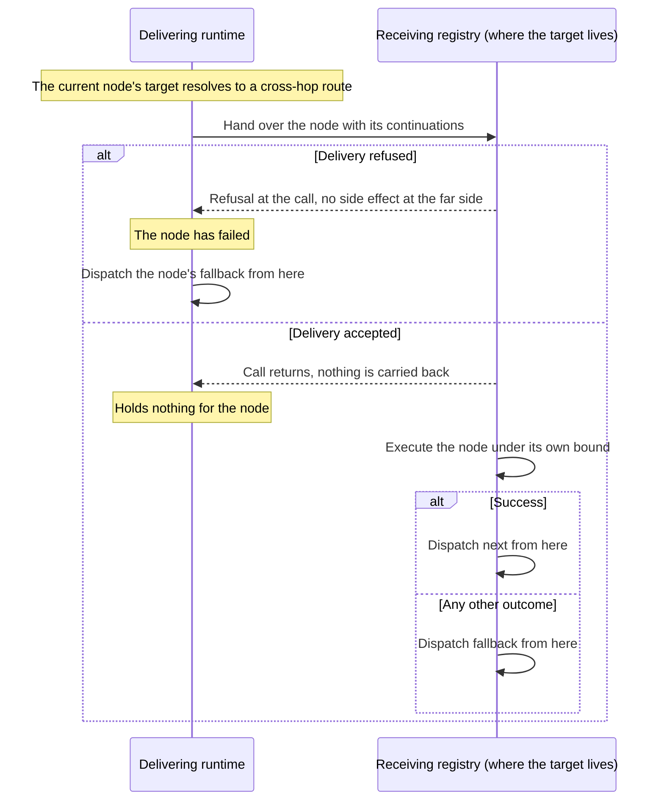

# Host–MFE Action Dispatch and Chaining

<!-- toc -->

- [Context and Problem Statement](#context-and-problem-statement)
- [Decision Drivers](#decision-drivers)
- [Considered Options](#considered-options)
- [Decision Outcome](#decision-outcome)
  - [Consequences](#consequences)
  - [Confirmation](#confirmation)
- [Pros and Cons of the Options](#pros-and-cons-of-the-options)
  - [Mediator keyed by (target, action type) with a catch-all forwarding tier and recursive chain execution](#mediator-keyed-by-target-action-type-with-a-catch-all-forwarding-tier-and-recursive-chain-execution)
  - [Mediator with call-and-return hops](#mediator-with-call-and-return-hops)
  - [Publish/subscribe event bus](#publishsubscribe-event-bus)
  - [Point-to-point handler references](#point-to-point-handler-references)
- [More Information](#more-information)
- [Traceability](#traceability)

<!-- /toc -->

**ID**: `cpt-frontx-adr-action-dispatch-and-chaining`
## Context and Problem Statement

Microfrontends and the host application coordinate by dispatching actions to targets. A target is an extension domain or an extension mounted in one. Sender and receiver are developed independently and hold no direct reference to one another. A single dispatched action often triggers a sequence with conditional follow-ups: continue on success, divert on failure. Each step must complete within a bounded time, while targets may be registered and torn down at any moment.

Nesting makes this harder. A microfrontend can itself host an extension domain and mount further microfrontends. A target may therefore sit any number of runtime boundaries away from the sender, in either direction. A deeply nested target must be reachable from the shell, and the shell, or any ancestor, must be reachable from a deeply nested target.

The same chain can also be triggered wherever coordination happens to begin: the shell, a mid-tree registry, a leaf microfrontend, or the framework itself alongside a runtime transition. So the mechanism must settle more than where a chain's actions land. It must also settle who observes their settlement, and where the time bound each action is held to is resolved. Those two answers decide whether the chain executes the same way from every one of those trigger sites.

Three further pressures bear on the same mechanism:

* Every bound it enforces must be one a platform timer can honour and the runtime can decide the validity of. Otherwise "bounded execution" is a claim with nothing behind it.
* Retiring a target must complete without waiting on the chains that accompany its own teardown. It must still honour what those chains were already promised.
* The copies of this mechanism on either side of a runtime boundary may be built from different releases. Whatever they exchange internally is therefore a contract between them, whether or not it is written as one.

Alongside all of that, the host composing the runtime keeps its own view of which extensions are placed where. That view must follow the runtime's committed state, without giving the host a path to a chain's settlement.

What dispatch mechanism has all of the following properties?

* It routes an action to the right handler.
* It supports compositional sequencing with branching and enforceable time bounds.
* It lets actions reach a target at any nesting depth.
* It executes a chain the same way wherever the chain was triggered.
* It survives teardown and mixed releases with defined outcomes.
* It does not couple senders to receivers.
* It lets a host follow committed placement state without having to observe a chain to get it.

## Decision Drivers

* Decoupled coordination — senders address a target by identifier, never by holding a reference to it (anchors `cpt-frontx-fr-mfe-host-communication`).
* Deterministic routing — a `(targetId, actionTypeId)` pair resolves to at most one handler, with a defined fallback tier when no specific handler exists.
* Cross-runtime forwarding — actions targeting a child runtime's domains must be forwardable even though the parent does not know the child's action vocabulary at registration time.
* Reachability across nesting depth without probing — a target nested arbitrarily many runtime boundaries away must be reachable in a single addressed hop-by-hop path, not through fan-out to every descendant; this reinforces the existing exclusion of the publish/subscribe alternative — so depth-spanning delivery must be achieved by carrying routing state along the mediator chain rather than by broadcasting.
* Compositional control flow — a dispatched unit may declare success and failure continuations that compose into chains.
* History-agnostic chain execution — an accepted chain runs as an execution of its own, living alongside whatever triggered it rather than inside it. It is owned at each step by the runtime executing its current action. It proceeds action by action. Whether the `next` or the `fallback` branch follows a node is determined by the binary outcome of that node's own execution and by nothing else. None of that is decided ahead of time, by what preceding nodes consumed, by anything outside the current action's execution, or by what becomes of the emitter. The two drivers that follow are the shapes this takes for bounds and for origins.
* Per-node bounded settlement and drain-safe teardown — every admitted node attempt must carry an enforceable timeout resolved at the registry authoritative for its target, and every reservation an accepted chain takes against a target must be released through that node attempt's own settlement, so a target's logical retirement never has to wait on one and its physical registrations are retained only while a reservation still stands against it.
* Trigger-site transparency — the branch sequence a chain selects and the settlement class each of its actions reaches must depend only on the chain as declared, on the reachable topology and handler behaviour at execution time, and on the bound each of its actions resolves at the target authoritative for it, never on which runtime, nesting depth, or lifecycle stage handed the chain to the runtime (anchors `cpt-frontx-constraint-mfes-origin-invariant-chain-execution`).
* Execution where the target lives, with nobody waiting — a node whose target sits in another runtime must execute in that runtime, and no runtime may wait on, bound, or hold state for a node another runtime executes, so what happens on one side of a boundary never depends on a wait held on the other.
* Decidable per-action bounds — every per-action timeout the mechanism enforces, whether declared on the action or inherited from the authoritative target domain's default, must have a stated valid form the runtime can decide and a platform timer can schedule as written, so an invalid declaration is refused rather than approximated.
* Teardown that neither blocks nor breaks its own guarantees — retiring a target must return without waiting on the chains its own teardown triggered, while still honouring the reservations those chains already hold against it.
* Defined behaviour between independently loaded copies — internal coordination crossing a runtime boundary between copies built from different releases must fail in a defined, diagnosable way rather than proceed on semantics neither side has established.
* Host-observable committed state — a host composing the runtime must be able to follow committed placement state without acquiring any path to a chain's settlement.
* Type-agnostic dispatch — action admission must run through the injected type-system provider, not embedded format knowledge (anchors `cpt-frontx-principle-agnostic-core`).

## Considered Options

* **Mediator keyed by (target, action type) with a catch-all forwarding tier and recursive chain execution** — a central mediator holds a `targetId → (actionTypeId → handler)` registry, falls back to a per-target catch-all handler when no specific pair matches, and executes chains recursively with success/fallback branching, time bounds, and pending-action tracking, handing a node together with its continuations across a runtime boundary to the runtime where its target lives.
* **Mediator with call-and-return hops** — the same keyed mediator and recursive chains, but a hop is a remote call: the delivering runtime sends one action across, waits for the far side to report its outcome, and selects the next branch itself.
* **Publish/subscribe event bus** — senders publish named events and any number of subscribers react; there is no single addressed handler per action.
* **Point-to-point handler references** — a sender obtains and holds a reference to its target and invokes it directly.

## Decision Outcome

Chosen option: **mediator keyed by (target, action type) with a catch-all forwarding tier and recursive chain execution**, because it is the only option that delivers addressed, decoupled, single-handler routing while also supporting compositional chains, time bounds, and cross-runtime forwarding, and that executes every action where its target lives without any runtime waiting on another. The mediator resolves a target by looking up the `(targetId, actionTypeId)` pair first and falling back to a per-target catch-all tier that matches any action type; that tier is what lets actions be forwarded to a child runtime's domains without the parent enumerating the child's action types in advance, and where the target it matches sits across a runtime boundary the tier resolves to a cross-hop route rather than to a local handler. Chains execute recursively, action by action: the runtime that executes a node follows `next` on success and `fallback` on any other outcome, dispatching that continuation itself, and every node is bounded by the timeout resolved for that node alone. Where a node's target sits across a runtime boundary, the node is handed over together with its continuations to the runtime where the target lives, which executes it and carries the chain on from there. The mediator tracks the actions it executes per target, so a target's handlers stay in place until the actions pending against it settle.

Handing a chain to the runtime is acceptance-only: the call accepts the chain or refuses it, and reports nothing whatever about what the chain then did. A refusal is raised synchronously at the call itself, never handed back as a value or as a rejected promise an emitter could await, because anything awaitable at the trigger site is a second path along which a chain's progress could be observed and acted upon — and a second such path is precisely what makes a chain's execution a function of where it was triggered rather than of the chain itself. Observing each action's settlement therefore stays inside the runtime executing that action: that observation is how the chain selects its own `next` or `fallback` branch, and it is exactly the thing that must not escape to an emitter. The corollary has to be stated plainly, because the whole model rests on it — a handler that hands a further chain to the runtime through that same acceptance surface starts a new root execution, whose effects are not a continuation of the dispatching chain unless the dispatching chain declared them as its own `next` or `fallback`. Without that corollary the claim that a chain is the complete description of what happens when it is dispatched would simply be false, and an emitter that genuinely needs to know a chain finished expresses that as a node inside the chain rather than by awaiting the call. What this decision settles is those dispatch semantics — acceptance or synchronous refusal, and settlement kept executor-internal; the concrete shape of the surfaces that carry them belongs to `cpt-frontx-adr-mfe-runtime-public-surface` and, for the child-facing bridge, to `cpt-frontx-adr-child-mfe-host-access`.

The model this rests on is worth stating as a model, because several of the rules below read as arbitrary without it and as obvious with it. An actions chain is a recursive type: each node carries one action and may carry a `next` and a `fallback`, each of which is itself an actions chain. Once accepted, a chain runs as an independent thread of execution alongside whatever triggered it, and from then on it lives by itself. It advances one action at a time, and the outcome of executing an action is binary: success selects `next`, and everything that is not success is failure and selects `fallback`. There is no third outcome: every executed action selects one of the two branches, and where the selected branch is absent the chain ends at that node. The runtime that has just executed the current action dispatches the selected continuation as a new execution request, from where it is. Nobody waits for anything — not the emitter, not the runtime that accepted the chain, and not any runtime the chain passed through. A chain is therefore history-agnostic. The branch that follows a node is decided by that node's own outcome and by nothing else, and that choice is never made ahead of the execution that decides it. The same holds for the handler a node reaches: it is resolved when the node's action executes, never earlier, so the node meets the topology as it stands at that moment. Two properties this decision states elsewhere are consequences of that model rather than rules standing on their own. Per-node bounds are never rewritten from what preceding nodes consumed, because a shared allowance drawn down as the chain proceeds would make the current node's outcome a function of the chain's history. And branch selection never depends on the trigger site, the emitter, the runtime, the nesting depth, or the hop count, because every one of those is something other than the current action's outcome.

Independence runs in both directions, and the second direction has to be stated because only the first is obvious from acceptance-only dispatch. A chain's outcome never reaches back to whatever triggered it — a stage trigger is acceptance-only and does not block the transition it accompanies, so nothing a chain does can succeed or fail that transition. The converse holds on the same grounds: a chain's life is bounded by the executor running its current action, never by the life of whatever emitted it. A chain lives in whichever runtime is executing its current action, and it ends only if that runtime's executor is torn down while holding it. That ending is legitimate, because the execution's owner is gone and nothing is left to run it. An extension being unmounted, destroyed, or permanently unregistered does not end a chain that extension emitted: the emitter was only the trigger and was never the thing running it, and this decision provides no such ending. A runtime that handed a chain across a hop holds nothing for it afterwards, so nothing strands there and its own teardown ends nothing.

Every node the executor reaches is bounded solely by the timeout resolved for that node: the action's own declared timeout, or the default of the domain authoritative for the node's target where the action declares none. Nothing outside the node contributes to that bound. The executor never rewrites it from what preceding nodes spent, from how many boundaries the chain crossed to reach the node, from how long transit took, or from how far into its continuations the chain already is. No bound anywhere in the dispatch path is supplied by the emitter or derived from where the dispatch began. The bound a node is held to is therefore a property of the node and of the target authoritative for it. It is not a property of the path the chain took or of the site it was triggered from, and that is the whole of what origin invariance asks of timing. How a per-action timeout is expressed in a chain and validated is specified by `cpt-frontx-feature-mfe-host-communication`.

No aggregate bound is placed on a chain as a whole, and that is a decision rather than a gap. An aggregate cap can only be enforced by drawing a shared allowance down as the chain proceeds. The bound enforced at a node would then be a function of the work done earlier along the path. The same node, declaring the same timeout, would be held to a different bound depending on what ran before it. A rule holding a node to the lesser of its own declaration and whatever remained of a shared allowance is exactly that dependence written out. It is the very context-dependence this decision removes between origins, reappearing inside a single chain, and it is refused on the same grounds. Where such a cap would have to be declared is the second reason. A cap supplied by whoever triggered the chain is origin-dependent by construction, so it is inadmissible here. The only other place to put it is the chain payload itself, which is a published contract every author writes against. This decision does not make timeout policy for an execution as a whole part of what an author must express in order to dispatch. Bounding is stated per action, where an author already states it, and nowhere else.

What per-node bounding guarantees is settlement, and it is worth being exact about how far that reaches. A chain whose `next`/`fallback` graph closes a cycle is refused before acceptance, so an accepted chain is a finite acyclic graph and every path through it is a finite sequence of individually bounded attempts. Every action therefore reaches a settlement at the runtime executing it, and that runtime dispatches the continuation its outcome selects instead of hanging. This holds under two preconditions together: timers work, and the executing runtime is not torn down while it holds the action. Teardown of that runtime is the lifetime boundary stated above, not an outcome of the action: the chain ends with that runtime, because nothing is left to run it. It does not follow, and this decision does not claim, that a chain has a ceiling on how long it may take. A chain's total duration can be the sum of many node bounds plus transport and executor overhead, and an author who needs a chain to finish inside a particular interval obtains that from the bounds its nodes declare and from how many nodes it declares, not from a limit the runtime enforces on the whole.

Crossing a runtime boundary follows from the same model, and it is the heart of how this decision treats a hop. When a node's target lives in another runtime, the current runtime hands the node over together with its continuations — the whole remaining sub-chain — and is then done with it. It holds no in-flight state for that node, applies no bound to it, and receives nothing back. The runtime where the target lives executes the node, selects `next` or `fallback` from its outcome, and dispatches that continuation from itself, as every executing runtime does. A chain that crosses several boundaries therefore moves with its execution: at each step it lives where its current action executes.

Delivery across a hop is synchronous and binary: it either refuses at the call or accepts, and never both. A refusal means the far side did not take the sub-chain — the bridge is inactive or disposed, no receiver is wired, the receiving copy does not recognize the internal transport protocol version, or the receiving registry is disposed. A refusal is the current action's failure, observed by the runtime that tried to deliver it. That runtime dispatches the node's `fallback` from itself, and the refusal has no side effect at the far side. An acceptance transfers the sub-chain. From that moment every failure belongs to the far side: a missing handler, an admission failure, a handler that throws (synchronously included), or a timeout. The far side dispatches the `fallback` itself. Nothing after acceptance may surface back through the delivery, because a failure reported on both sides would run `fallback` on both. Accepting runs no handler code on the delivering runtime's call stack: the receiving registry checks the transport protocol version, validates what it was handed, and takes what the node needs before the call returns, and the node executes only after that.

Every action executes at the registry authoritative for its target, under its own bound: the timeout it declares, or else that registry's domain default. That is exactly what a locally dispatched action gets. No side waits, so there is no second timer and no transit margin to add to the bound. Origin invariance therefore holds for execution across hops with no transport qualification. A node whose handler is slow but inside its own bound succeeds whether it was reached locally or across any number of hops, and a node that exceeds its bound fails in both cases.

A continuation is routed afresh from the runtime that executed the action, through that runtime's own resolution tiers. It does not retrace the path the chain took to get there, so a `next` whose target is in the shell legitimately travels back up the edge the chain arrived on. Loop containment — never re-selecting the arrival edge — governs re-routing of the same action, not its continuation, which is a new execution request with a route of its own.

Diagnostics are recorded by the runtime where a failure happens. A refused delivery is diagnosed at the delivering runtime, and a failure after acceptance is diagnosed at the far side. The correlation identity, the origin, and the path so far travel with a sub-chain handed across a hop, so a failure several hops away still attributes to the dispatch that started it.

Handing over is chosen over calling across the hop and waiting for the far side to report the outcome. A waiting runtime must bound its wait, or a far side that never replies leaves the waiting chain, and every reservation it holds, stranded. Yet any bound the waiting side picks can elapse while the outcome the authoritative registry produced is still on its way back. The two sides would then select different branches for one node, and a node reached across a hop would answer to a bound a local node never meets. Handing over removes the wait, and with it everything a delivering runtime could get wrong about a node it does not execute.

A declared per-action timeout is valid when it is a positive, finite, integer count of milliseconds not greater than 2147483647. That is the upper limit of the signed 32-bit millisecond range a platform timer schedules as written, and therefore the largest bound the executor can promise to enforce as declared. A value above that bound is refused rather than clamped to it. Clamping is indistinguishable from acceptance at the call, yet it produces the opposite of what was declared. A timer handed a delay outside its range does not wait longer than the range; it fires almost at once. The range itself runs to a little under twenty-five days, so an action declaring a bound of a month would in fact be held to a bound of about a millisecond. Refusing says the declaration is not expressible; clamping would quietly substitute a different action and then report a timeout for it. A non-integer or non-finite value is refused on the same footing: a fractional millisecond is not a bound any timer honours, and neither is an infinity. The default an authoritative domain supplies for an action that declares none is held to the same valid form, so a declared bound and an inherited one are enforced under one rule rather than two.

The line between a refusal and a chain failure is drawn on a single rule: a refusal means no valid execution was accepted, while a chain failure means a valid execution was accepted and a node in it could not execute successfully. Refused synchronously at the call are a structurally malformed chain — including one whose `next`/`fallback` graph closes a cycle along its own active path, and one carrying an invalid declared per-action timeout — and an emitter capability that is unusable at the moment of the call, such as a disposed registry, a disposed or deactivated bridge the emitter is dispatching through, or a dispatch callback that was never wired. Everything discoverable only while a valid chain is executing, at a node its executing runtime runs to an outcome, is a chain failure that selects the chain's declared `fallback`: no handler for a well-formed target, action admission failure at the execution target, an invalid action payload found during execution, a route that is inactive or retracted by the time a node is routed through it, a delivery the far side of a hop refuses, and handler failure or handler timeout. Executor teardown is not one of these failures, because it is a lifetime boundary rather than an outcome of an action. A chain whose executor is torn down while holding it ends with that runtime, because nothing is left to run it, as the paragraph on the two directions of independence states. The rule earns its place because the two classes have different addressees — a refusal tells the emitter that its call was not a dispatch at all, whereas a chain failure is the chain's own business and is answered by the branch the chain declared for it.

Within the chain-failure class, a refused delivery is a failure class of its own — the hop's unavailability — and never a handler failure. The two are answered identically — both are chain failures the declared `fallback` answers — but they are not the same event, and a diagnostic that names them alike loses the only thing that tells them apart. A handler failure says the registry authoritative for the target admitted the node, invoked the handler for it, and the handler did not succeed; a hop's unavailability says no handler was reached at all, because the far side did not take the node. An operator reading a diagnostic has to be able to tell "the far side ran your action and it failed" from "the far side could not take your action", because the two have different causes and call for different responses: the first points at the far side's own logic and is answered there, the second at the topology or at the pairing between independently loaded copies and is answered by restoring the route or by reconciling those releases. Every way a delivery is refused belongs to this class — an inactive bridge, a disposed bridge such as one released with a revoked link, no receiver wired, a transport protocol version the receiving copy does not recognize, and a disposed receiving registry — and the diagnostic records which of them occurred alongside the hop it names. A failure after acceptance does not belong to it: the far side took the node, so a missing handler, an admission failure, a handler failure, or a timeout there is diagnosed under its own class by the far side. Naming any refusal a handler failure would report the absence of a route in the shape of a handler that ran and failed, sending a reader to look for a defect in code that was never invoked.

A disposed registry therefore refuses dispatch synchronously, as an unusable dispatch capability rather than a routing outcome: disposal removes the capability, and an emitter dispatching through a disposed registry has not made a dispatch that failed, it has invoked an operation that no longer exists. Leaving disposal to be discovered by resolution instead — where a registry that has released its routing state answers every target with no handler — reports the absence of the entire capability in the shape of the absence of one target. The chain's declared `fallback` would then run on the strength of a condition that never obtained, a composition error at the emitter would arrive dressed as the routing miss that branch was written for, and the one signal that distinguishes them, the fact that nothing in this runtime could have answered anything, would be the one signal discarded. So a registry holds its disposal as a state that makes it unusable and refuses at the call, in the same class as the disposed or deactivated bridge this decision already refuses, and for the same reason. A disposed receiving registry refuses a delivery on the same grounds, and the delivering runtime meets that refusal as the hop's unavailability.

Action admission accordingly runs at the registry authoritative for the target rather than at the dispatching registry, and inside the failing node's boundary, and both halves of that are load-bearing. Each independently loaded copy of the runtime holds its own type-system provider state, so admitting an action wherever the dispatch happened to originate makes execution a function of that origin's provider instead of the target's. And admission that fails outside the node's failure boundary bypasses the chain's own declared fallback, turning a condition the chain has an answer for into a failure it never gets to answer. It follows that a target identifier the emitter's own provider knows nothing about must not be a refusal: forwarding advertisements deliberately carry opaque identifiers, precisely because type systems are per-registry and non-interchangeable, so an unrecognized identifier at the trigger site is the normal case for a deeply nested target rather than a malformed dispatch.

Acceptance is synchronous in what it establishes, not only in what it refuses: before the call returns, the executor validates the chain envelope, creates its own execution state, and reserves what the first executable node needs where that node executes locally, so a chain cannot lose its target between the call returning and the executor beginning to act. Nothing is reserved here for a first node bound for another runtime, because this runtime will hand that node over rather than execute it. This is load-bearing rather than defensive, because a chain triggered alongside a runtime transition is dispatched at the very moment the transition is happening, and the sharpest case is an entity's own `destroyed` stage — that chain races its own teardown unless the first node's target is reserved while the entity is still there to reserve it. Seen from the emitter's side, synchronous refusal and reservation-before-return are one property: by the time the call returns it has already decided everything it will ever tell the emitter, and everything it has not yet decided is the executor's.

Reachability across nesting depth is achieved by combining this catch-all tier with routing state that propagates along the same hierarchy it is later used to traverse, so a downward miss never has to fan out and probe descendants. Each mounted extension may evaluate against its own independently loaded copy of the runtime (`cpt-frontx-adr-mfe-load-isolation`), so propagation, escalation, and loop containment are built entirely on the two things that reliably cross that boundary: object references explicitly passed across it (the bridge itself), and, for the one handoff that has no argument path — a newly constructed registry adopting the inbound bridge of the extension that is mounting it — a realm-global, version-namespaced rendezvous point rather than shared module state, bracketing exactly the synchronous portion of the extension's own mount call so no concurrently-mounting extension's bridge can be misattributed. A reader that finds no entry, or an entry tagged with a rendezvous protocol version it does not recognize, treats the registry as holding no inbound bridge and logs a diagnostic rather than adopting the wrong one silently.

Whenever a registry admits a domain or extension and registers its handlers, it composes a forwarding advertisement — the target identifier and its declared action-type id set, treated as opaque identifiers since type systems are per-registry and non-interchangeable — and, if the registry holds an inbound bridge, propagates that advertisement upward through it to the immediate parent registry's mediator. The parent records a forwarding entry pointing back down through that bridge and re-propagates the advertisement to its own parent, and so on; adoption of the inbound bridge is automatic, requires no action from the microfrontend author, and the propagation this enables composes transitively so that every ancestor up to and including the shell ends up holding a forwarding entry for every descendant target in the tree, while any single hop only ever holds a reference to its immediate neighbor. If an ancestor receives an advertisement for a target identifier it already holds — whether locally registered or already advertised through a different child — it rejects the advertisement, does not propagate it further, and logs a diagnostic, preserving the single-handler-per-`(target, actionType)` determinism guarantee against a tree-global namespace collision; an advertisement re-stating an entry the ancestor already holds for the very edge it arrived on records nothing new and is therefore an idempotent no-op rather than a collision, since the guard's subject is a second owner claiming an identifier, not a repeated statement over one live link. Resolution at a mediator therefore proceeds through four tiers before falling back to a fifth: keyed exact match, hierarchy-derived match, local catch-all, and the downward forwarding entry from propagation. The hierarchy-derived match is consulted only when no handler is registered for the target under the dispatched action type itself. It compares the dispatched action type with each action type the target's handlers are registered under, using the injected type system's derivation check in either direction, so a handler registered under a base or a derived type still answers. It looks only at that one target's handlers and takes the first match in registration order, so a resolution still yields at most one handler. When none of these resolve and the registry itself has an inbound bridge (that is, it is not the shell), resolution adds a final upward-escalation tier, reached through that same bridge and minted once by the parent registry at the moment it first links that extension's bridge. That tier resolves to a route distinct in shape from a plain action handler, because the route carries the node together with its continuations and the chain's diagnostic context into the hop, where the far side admits, bounds, and executes the node and dispatches its continuation — none of which a handler invoked only with an action type and payload can express. The same distinct shape carries the downward forwarding entry from propagation. Minting the escalation route, and tagging an action with its arrival edge for loop containment, on the parent's own side — rather than having the child's registry test the bridge's concrete class identity — means correctness never depends on two independently loaded copies of the runtime agreeing on a shared class, only on the shared bridge object each already holds a reference to. Both the forwarding-entry and escalation tiers sit alongside the catch-all tier in the same resolution call, resolving to this distinct route shape instead of an `ActionHandler` — as does the catch-all tier itself wherever the target it matches sits across a runtime boundary — so the mediator's dispatch loop branches on which shape it received rather than special-casing depth. A forwarded or escalated node is bounded by the timeout resolved at the registry authoritative for its target, unchanged by the hops the chain crossed to reach it and substituted by none of them, so a chain that legitimately needs to cross several boundaries is held at each node to that node's own bound rather than to anything the crossing accumulated. An action that escalates upward through a given bridge is tagged with that bridge as the edge it arrived on, and forwarding-entry resolution at any hop must never re-select that same edge as the next hop for that same action. Loop containment governs re-routing of the action, not its continuation: a continuation is routed afresh from the runtime that executed the action, and a `next` whose target is in the shell legitimately travels back up the edge the chain arrived on. Containment is standard defensive insurance against the unavoidable race between an action crossing a boundary and a concurrent deactivation or unregistration whose retraction has not yet reached every ancestor (see below), not a sign that the propagation or retraction logic is itself incomplete.

Every hop that crosses a runtime boundary resolves to that cross-hop route shape and never to a plain handler — the downward forwarding entry, the upward escalation tier, and the parent-to-child-domain forwarding tier alike. The last of those is the tier a parent uses to reach the domains a mounted child registered inside its own registry, and it is the one hop the parent learns of directly from the child rather than through a propagated advertisement; that difference is in how the tier is populated, not in what crossing it costs, so it carries no licence to be shaped differently. Carrying it as an ordinary handler in the catch-all tier is not untidiness but a contradiction of three things this decision requires. A handler takes an action type and a payload, so it cannot carry the node's continuations into the hop, and the far side would have no chain to carry on. A handler is invoked by the dispatching mediator after that mediator has already admitted the action — so a hop wearing a handler's shape admits at the forwarding registry instead of the authoritative one, which is precisely the origin dependence admitting at the target exists to remove. And a handler runs under the bound the dispatching mediator resolved and reports its outcome back to that mediator, which then selects the branch: the forwarding registry's own domain default bounds a node it does not execute, where the action declares no timeout, and the delivering runtime waits on the far side — both of which this decision refuses. A handler is by construction indistinguishable from a local one, and that is exactly what makes it the wrong shape for something that is not local. Without this, origin invariance is false whatever else holds, because the same chain dispatched one boundary further out would be admitted by a different provider and bounded by a different domain's default for identical handler behaviour.

Because that route carries a node, its continuations, and the chain's diagnostic context into a hop, what crosses the bridge is an internal envelope rather than a bare delivery — and an envelope is a contract between the two copies of this package on either side, which this decision already establishes may be built from different releases and may nonetheless share one bridge. That contract therefore carries an explicit protocol version, and a copy that meets a version it does not recognise refuses the delivery, so the hop is unavailable. Without a version the failure is undefined in the worst available way: a copy handed an envelope shape it does not understand either ignores a part of it and executes something other than the sub-chain it was sent, or reads a field that is not there and treats the absence as a value, and in both cases a node executes on terms neither side established while both continue to believe the contract held. Versioning collapses that into an outcome this decision has already defined. An unrecognised version takes the same path as any other refused delivery — the delivering runtime fails the node and dispatches its declared `fallback` — and the copy that met the version records a diagnostic naming the version it met and the version it implements, so an incompatibility is attributable rather than merely visible as a target that stopped being reachable. This is the discipline this decision already applies to the version-namespaced rendezvous, for the identical reason and in the identical shape: a reader meeting a version it does not recognise declines to act on semantics it cannot establish and says so, rather than guessing at them. It rests on the same property there as here — the identity of the thing being read stays stable while its version varies, which is what lets a mismatch be met rather than missed. What the version buys is a bound on mixed-release behaviour: a defined, diagnosable failure of the one affected hop, answered by the chain's own fallback, in place of a node executing on terms neither copy agreed. What it costs is that a version bump makes an older copy unreachable across that hop rather than degraded, which is the right trade when the alternative is a chain branching on an outcome nobody established.

The link, not the registry, is what the parent owns, and it is scoped to the host extension's registration rather than to any one of its mounts: the parent mints one bridge pair and one link for an extension at its first mount and hands that same pair to every subsequent mount, so a nested registry that adopted the link keeps it across remounts by construction. Unmounting is therefore a change of state, not of structure — the parent deactivates the extension's bridge, keeping every forwarding entry recorded through it, and every dispatch that would travel through an inactive bridge fails explicitly rather than silently succeeding or silently doing nothing — as a synchronous refusal where the inactive bridge is the emitter's own dispatch capability, and as a refused delivery where it is a route a chain resolved, which fails that node so the runtime that tried to deliver it dispatches the node's `fallback`. A sub-chain the far side accepted before the deactivation is not touched by it and carries on there. Remounting reactivates the same bridge, and the routing established earlier is live again with nothing to re-establish; a target re-stated over that still-live link resolves against the entry the ancestor already holds for the very same edge, so a remount never trips the collision guard. Because the extension's handler registrations and property subscriptions hang off that persistent bridge, they too survive the unmount and are live again on the next mount, leaving it to the microfrontend's own `unmount()` hook to withdraw them where that is what the microfrontend wants.

Retraction is the parent registry's responsibility, not the disposing registry's, and it is reserved for the events that actually end the relationship: when a host extension is permanently unregistered, or the parent registry that minted its link is disposed, the parent revokes that link, deletes every forwarding entry keyed to that specific bridge, releases the bridge pair, and re-propagates the retraction to its own ancestors. A registry's own disposal retracts every advertisement it had propagated through its own inbound bridge, symmetrically. Because a revoked link is additionally made inert on the parent's side, refusing every further propagation, retraction, and escalation explicitly, a reference to it retained by any copy of the runtime can never resurrect routing to an extension that is no longer registered. A registry the author rebuilds inside a fresh `mount` call adopts the same still-live link and thereby supersedes the previous adopter, which the parent unlinks so it stops propagating on that edge; the adopting registry then advertises every target it holds — its own admissions and the forwarding entries it holds for its descendants alike. A registry the author reuses across a remount needs none of that, since it never lost its link. Both patterns are first-class and neither requires the microfrontend author to identify the registry explicitly.

Retiring a target — a domain or an extension whose registration is ending — takes effect logically and immediately, and physically only once the reservations already taken against it have drained. At the moment the transition retires it, the target stops resolving for any new dispatch and its advertisements are retracted from every ancestor, so nothing not already admitted can reach it; its handler registrations themselves survive until every reservation an accepted chain took against that target has settled, and are removed on that drain. The transition that retires the target completes and returns without waiting for the reservations or for the removal.

Deferring only the physical half is what lets two guarantees this decision already makes hold at the same time, which they otherwise cannot. An entity's own `destroyed` stage is triggered while the entity is still there, and the chains it triggers routinely target the very entity being retired; acceptance reserves each chain's first node before returning; and the transition does not wait for the chains it triggered. Removing the handlers at that moment would have to either wait for those reservations — which is exactly the blocking teardown acceptance-only dispatch exists to prevent, arriving at the one site that can least afford it — or delete handlers a reserved chain has already been promised, which breaks the guarantee that a target's handlers stay in place while its actions are pending. Refusing the retirement instead is worse than either, because the transition has no caller in a position to act on a refusal: an automatic teardown handed one can only fail or discard it, and discarding it leaks the very registrations the transition exists to release. Logical retraction with deferred physical removal declines all three: no new dispatch reaches a retired target, no reserved one loses the handler it was promised, and nothing outlives the drain.

What bounds that drain is the reservation, not the chain. Each reservation the runtime tracks is one node attempt against one of its own targets, executed by this runtime under the bound resolved for that node. A runtime reserves nothing for a node it hands across a hop, since it will never execute it. The set of reservations standing against a retired target is therefore finite, and every member settles under its own bound under the same two preconditions settlement rests on throughout this decision: timers work, and the runtime holding a reservation is not torn down while it holds it. That teardown is the lifetime boundary already stated, not an outcome of the reservation's node attempt: the reservation's own chain of execution ends with that runtime, because nothing is left to run it. Physical removal follows the drain rather than being merely hoped for, and retirement carries no deadline of its own — adding one would be a second bound on work already bounded where it is performed.

It is the reservation that settles, though, and not necessarily the work. The runtime bounds a node attempt; it does not cancel a handler. A handler whose bound elapses has its attempt settled as a failure and its reservation released, and may go on running afterwards — including after the registrations of the target it was invoked on have been removed. Deferred retirement is therefore a guarantee about what the runtime holds: no new dispatch reaches a retired target, and no reserved one loses the handler it was promised before its own attempt settles. It is not a guarantee that nothing a handler started is still in progress when those registrations go.

Retraction and deactivation act on routes, not on executions, and they act the same way on both sides of a hop. Each stops a route resolving for new deliveries. Nothing in flight at a delivering runtime exists to reject, because a delivering runtime holds nothing for a node it handed over. A sub-chain the far side accepted before the retraction keeps executing there, under that registry's own rules, and ends only if that registry's executor is torn down while holding it. Locally, retirement is deferred as described above: the target stops resolving at once, and its surviving registrations honour the reservations already taken. What remains outside the origin-invariance guarantee is concurrent mutation of the routing topology itself. Each node resolves against the topology at the moment it executes, and when that moment falls relative to a mutation depends on timing, which differs between trigger sites, depths, and hop counts. A retraction landing mid-chain can therefore change what a later node reaches, so concurrent mutation of the routing topology while a chain executes stays outside the origin-invariance guarantee this decision makes rather than folded into it.

Changes to a domain's mount set are observable through an observer the host supplies when it constructs the registry, notified whenever the runtime commits such a change and carrying the domain whose set changed together with what entered it and what left it. A host composing this runtime commonly keeps its own record of which extensions are placed where, and that record has to follow the runtime's rather than lead it or guess at it.

A lifecycle stage cannot serve that need, and the obstacle is ordering rather than convenience. The stage accompanying a mount is triggered while the mount transition is still in progress, and the runtime records the extension in the mount set only after the transition the stage was triggered inside of has returned; the stage accompanying an unmount is triggered before the corresponding removal. A chain that a stage triggers therefore reads the mount set as it stood before the change, at both edges, and a chain that tried to diff before against after would be comparing one state against itself. No scheduling repairs that either: stage triggers are acceptance-only and do not block the transition they accompany, so there is no point in a chain's execution that the runtime has promised to reach only after the commit, and a chain deferring its own observation would be relying on an ordering the runtime does not guarantee and is not free to guarantee without making the trigger block the transition it accompanies. Observation of committed state has to come from the commit.

This does not grow the public surface the cross-nesting reachability constraint protects, and that constraint's own terms are why. Its subject is how a nested composition reaches across a boundary, and reachability still composes entirely through pairwise propagation and escalation over the bridge between adjacent registries, with or without an observer — no part of reaching a nested target runs through one. Its measure is the capability method: what a nested composition must not do is give a consumer a new operation to invoke, or an import it must take up, in order to reach across nesting. An observer accepted at construction gives a consumer nothing to invoke; the host hands the runtime a notification channel while building it, the runtime calls it, and no member appears on the registry or on either bridge for anyone to call. It is the same class of surface as the injected type-system provider, which the runtime has always accepted at construction without that counting as a capability the runtime offers. A host that supplies an observer does take up the observer's own contract, and that contract is governed by the runtime's breaking-change policy exactly as every other published member is — but it is not an import taken up in order to reach across nesting, which is what the constraint is measuring.

The other half of this has to be stated just as explicitly, because it turns on the distinction the origin-invariance guarantee is built from. What this observer reports is committed runtime state — a mount set that has changed — and never a chain's settlement. Nothing it carries says whether a chain succeeded, which branch a chain selected, or that a chain has finished; all of that stays internal to the executor and unreachable from any emitter, as acceptance-only dispatch requires. An observer that reported chain outcomes would be a second, origin-specific path by which a chain's progress could be observed and acted on, which is exactly what makes an awaitable dispatch surface inadmissible, and it would breach the guarantee outright rather than at the margin. An observer reporting a state transition the runtime has already committed is not that path: a mount set changes because a transition completed, whether or not any chain was triggered alongside it, so what the host reads is the transition's own result and carries no information about the chain's branch selection and nothing an emitter could race the executor with.

### Consequences

* Good, because senders and receivers are fully decoupled — every interaction is addressed by identifier and resolved centrally.
* Good, because routing is deterministic: a `(target, action type)` pair maps to one handler, with an explicit catch-all fallback rather than ambiguous multi-delivery.
* Good, because the catch-all tier provides a clean seam for cross-runtime forwarding to child domains whose action vocabulary is unknown to the parent.
* Good, because success/fallback chain branching expresses coordinated multi-step behavior without bespoke orchestration in each unit.
* Good, because a bound resolved for each node at the target authoritative for it, together with per-target reservation tracking, prevents a node from running unbounded and prevents a target's registrations from being removed while a reservation still stands against it.
* Good, because acceptance-only dispatch makes a chain's execution a function of the chain and the topology rather than of the trigger site — no emitter can observe, race, or duplicate the branch selection the executor owns.
* Good, because a refusal reaches the emitter as a synchronous failure of its own call rather than as a rejected promise nobody is obliged to observe, so a composition error surfaces at the place that made it.
* Bad, because an emitter cannot learn a chain's outcome from the call that dispatched it and must declare any dependency on that outcome as a node inside the chain; relatedly, a handler that dispatches a further chain starts a new root execution instead of extending the one it is running in, which is a real constraint on how multi-step coordination has to be expressed.
* Good, because a node's bound comes from the node and its authoritative target and from nothing the chain accumulated on the way there, so depth changes how long a chain takes in wall-clock terms without changing which branch it selects.
* Good, because a declared per-action timeout has one stated valid form — positive, finite, integer milliseconds within the range a platform timer schedules as written — so "invalid timeout" is a decidable refusal rather than an unenforceable promise, and an authoritative domain's default is held to the same form.
* Bad, because a timeout beyond that range is refused outright rather than honoured approximately, so an author who wants an effectively unbounded node must declare the largest bound the range permits instead of a larger number.
* Bad, because nothing limits how long a chain may take as a whole: every action of an accepted chain settles at the runtime executing it because every path through the chain is a finite sequence of individually bounded attempts, but its wall-clock total can be the sum of those bounds plus transport and executor overhead, so an author who needs a chain to finish inside an interval must obtain that from the bounds and the number of nodes it declares rather than from a ceiling the runtime enforces.
* Good, because a runtime that hands a node and its continuations across a hop holds nothing for it afterwards — no pending state, no timer, nothing to receive — so a far side that fails, falls silent, or is torn down strands nothing at the delivering runtime, and a target retiring there drains without waiting on any hop.
* Good, because every action executes at the registry authoritative for its target under its own bound, exactly as a locally dispatched action does, so a node whose handler is slow but inside its bound succeeds across any number of hops as it does locally, and origin invariance holds for execution across hops with no transport qualification.
* Good, because delivery either refuses at the call or accepts, never both, so exactly one side answers each node its executing runtime runs to an outcome: a refusal is answered by the delivering runtime's `fallback`, every later failure by the far side's, and no node runs its `fallback` twice. Executor teardown is a lifetime boundary, not an outcome: the chain ends with the runtime that was running it, as the consequence on executor teardown below records.
* Bad, because a delivering runtime never learns what became of a node it handed over: the far side's diagnostics are the only record of how the chain went on there, and following a chain across hops depends on the correlation identity, origin, and path so far travelling with it.
* Bad, because a chain whose current executor is torn down while holding it ends there with no continuation, and no other runtime is told; only the diagnostics of the runtime it ended in record how far it got.
* Bad, because what crosses a hop is a whole remaining sub-chain with its diagnostic context rather than a single action, so the internal envelope is larger and its shape, which both copies must read identically, covers more.
* Good, because a continuation is routed afresh from the runtime that executed the action, so a `next` whose target is in the shell or elsewhere in the tree reaches it through that runtime's own tiers, including back up the edge the chain arrived on.
* Bad, because a chain whose nodes alternate between runtimes crosses a boundary at every alternation, since each continuation leaves from where its predecessor executed rather than from a fixed coordinator.
* Good, because a chain's life is bounded by the executor running its current action rather than by whatever emitted it, so an extension being unmounted, destroyed, or unregistered leaves the chains it emitted running exactly as they would have otherwise, and only teardown of the executor holding a chain ends it.
* Good, because the refusal/chain-failure rule keeps "this was not a dispatch" distinguishable from "a node of an accepted dispatch failed", so a malformed chain is not silently answered by a fallback branch that was written for something else.
* Good, because a hop's unavailability is named as its own failure class rather than as a handler failure, so a diagnostic distinguishes the far side having run the action and failed from the far side having been unable to take it — different causes, different responses — across every way a delivery is refused, while every one of them stays a chain failure answered by the chain's declared `fallback`.
* Good, because a disposed registry refuses dispatch synchronously, so dispatching into a torn-down runtime is reported as the absence of a capability instead of being answered by a fallback written for an unresolved target.
* Good, because admitting an action at the registry authoritative for its target keeps admission answerable by that target's own provider state and inside the failing node's boundary, so the chain's declared fallback covers admission failure as it covers any other node failure.
* Bad, because an emitter therefore gets no local confirmation that a target identifier it names is known anywhere — at the call, an identifier belonging to no target is indistinguishable from one belonging to a deeply nested target, and is only answered once the chain executes.
* Good, because reserving what the first executable node needs before the accepting call returns lets a chain triggered alongside a teardown transition, an entity's own `destroyed` stage above all, reach its target instead of racing it.
* Bad, because a central mediator is a single coordination point that every interaction passes through, concentrating responsibility.
* Bad, because deep recursive chains with branching are harder to trace than a single flat call, requiring path accumulation to remain debuggable.
* Good, because reachability across any nesting depth is automatic — admitting a domain or extension propagates its forwarding advertisement all the way to the shell without any explicit registration step by the microfrontend author.
* Good, because upward escalation and downward forwarding both reuse the existing catch-all-tier and chain-execution machinery, so per-node bounds and branching apply at every runtime that executes a node exactly as they do locally, reservation tracking applies at the runtime that executes each node and never at a runtime that only hands it across a hop, and the bound enforced at each node is the one its authoritative target resolved.
* Good, because resolving every runtime-crossing hop — parent-to-child-domain forwarding included — to the cross-hop route shape is what makes admission at the authoritative target, bound resolution at that same target, and hand-over of the node's continuations hold at every boundary instead of at some of them; a hop shaped as a plain handler could deliver none of them.
* Neutral, because that tier keeps its place in the resolution order and differs from a local handler only in the shape it resolves to, so the dispatch loop branches on the resolved shape there as it already does at the other cross-hop tiers.
* Good, because an explicitly versioned internal transport bounds mixed-release behaviour to a defined, diagnosable failure of the affected hop, answered by the chain's declared fallback, rather than a chain branching on a node outcome neither copy established.
* Bad, because a transport-version bump makes an older copy unreachable across that hop rather than degraded, so an incompatible pairing loses reachability into that subtree entirely until both sides speak one version.
* Bad, because propagated advertisements and forwarding entries are additional per-registry state that must be kept consistent with admission, deactivation, and disposal, including retraction of every propagated advertisement for an unregistered subtree.
* Bad, because the collision guard means a target identifier is only unique per tree, not partitioned by subtree — an identifier collision between independently developed subtrees is rejected rather than resolved, trading a small addressing risk for tree-global determinism.
* Good, because minting the escalation route and the arrival-edge tag on the parent's side, and coordinating inbound-bridge adoption through a realm-global rendezvous rather than shared module state, keeps the mechanism correct regardless of how many independently loaded copies of the runtime are involved — the only thing correctness depends on is the bridge object each side already holds.
* Bad, because a registry constructed asynchronously after its host extension's own `mount` call has already returned cannot be identified for automatic adoption — the runtime has no sound way to determine which extension's continuation is running without a browser async-context primitive this ecosystem does not depend on; such a registry holds no inbound bridge and logs a diagnostic rather than silently guessing.
* Good, because the link outlives every individual mount, so a registry an author reuses across remounts — rather than rebuilding it inside the new `mount` call — keeps routing with no act by the parent at all, on equal footing with a registry rebuilt inside each fresh mount call, and neither case needs the parent to re-establish anything a mount cycle tore down.
* Good, because a dispatch to an extension that is registered but not mounted fails as an explicit, distinguishable refused delivery that drives the chain's `fallback` branch, rather than as a silent success or a silent no-op the sender cannot tell apart from delivery.
* Bad, because the persistent bridge means an extension's handler registrations and property subscriptions outlive its unmount by default, so a microfrontend that wants a clean slate per mount must withdraw them from its own `unmount()` hook rather than relying on teardown to do it.
* Good, because deferred retirement lets an entity's own `destroyed` stage target the entity being retired without blocking the transition and without removing handlers a reserved chain was already promised, and each reservation settling under its own node's bound bounds the drain, so retirement needs no deadline of its own.
* Bad, because a retired target's handler registrations outlive the transition that retired it, so the runtime holds registrations for a target that already stopped resolving until its reservations drain, and releasing them is tied to that drain rather than to the transition.
* Bad, because a reservation settles when its node attempt settles and not when the handler stops: the runtime bounds an attempt but does not cancel a handler, so a handler may still be running after the registrations of the target it was invoked on have been removed, and the drain measures reservations rather than the work handlers actually finish.
* Bad, because each node resolves against the routing topology at the moment it executes, so a retraction landing mid-chain can change what a later node reaches, and when that moment falls relative to the retraction depends on timing that differs between trigger sites — which is why concurrent mutation of the routing topology is excluded from the origin-invariance guarantee rather than covered by it.
* Good, because mount-set changes are observable from the commit that makes them, which is the only place a host can read them: no lifecycle stage brackets the mount-set mutation, and acceptance-only stage triggers leave no ordering a chain could exploit to read it.
* Good, because that observation reports committed runtime state and never a chain's settlement, so it introduces no emitter-observable completion path and leaves acceptance-only dispatch and the origin-invariance guarantee intact.
* Bad, because the observer is construction-time surface: a host that did not supply one when it built the registry cannot begin observing afterwards, since nothing on the registry offers to start — the price of adding no capability method.

### Confirmation

Each group below states how its properties are confirmed. "Automated tests" means tests that run in continuous integration. Where a suite is named, it exists in the codebase and covers the part stated for it. Where no suite is named, the automated tests are the ones delivered with the code that conforms to this decision. "Architecture review" means review of the design and the code against this decision. Validation is continuous and gated by continuous integration on every change: the success criterion is that these tests pass, and there is no calendar timeframe.

* **Routing, branching, and admission** — confirmed by architecture review and automated tests.
  * All host–MFE dispatch flows through the mediator's `(target, actionType)` resolution, with the per-target catch-all as one of the fallback tiers.
  * The runtime executing a node follows `next` on success and `fallback` on any other outcome, and dispatches that continuation itself.
  * That runtime bounds every node it executes by the timeout resolved for it at the registry authoritative for its target.
  * Action admission is delegated to the injected type system rather than to embedded format checks.
  * Admission runs at the registry authoritative for the target and inside the failing node's boundary.
  * A target's handler registrations stay in place for as long as actions for that target remain pending.
* **Acceptance-only dispatch, refusal, and chain failure** — confirmed by automated tests. The property suite (`packages/mfes/__tests__/property-suite/action-dispatch-chain-properties.test.ts`) covers the non-awaitable dispatch surface and the synchronous refusal of an unusable emitter capability, a disposed registry included.
  * No emitter-facing dispatch point yields anything an emitter can await for chain execution.
  * A refusal is observable as a synchronous failure of the call, with no rejected promise left behind.
  * A structurally malformed chain is refused at the call.
  * A chain whose `next`/`fallback` graph closes a cycle along its own active path is refused at the call.
  * An invalid declared per-action timeout is refused at the call.
  * An unusable emitter capability is refused at the call.
  * Dispatch into a disposed registry is refused synchronously at the call, with no rejected promise left behind. It stays distinguishable from the chain failure an unresolved target produces.
  * Each of the following selects the chain's declared `fallback`: an unresolved target, an admission failure, an invalid payload found during execution, a retracted route, a refused delivery, a handler failure, and a handler timeout.
  * A chain accepted alongside a teardown transition has what its first executable node needs reserved before the accepting call returns, wherever that node executes locally.
* **Origin invariance and per-node bounds** — confirmed by automated tests. The property suite covers the equivalence of root, mid-tree, and leaf dispatch, and the same per-node bound reached locally and across one and several hops.
  * The same chain dispatched from the root, from a mid-tree registry, and from a leaf of one connected tree whose propagation has converged selects the same handler-and-fallback sequence.
  * That chain reaches the same settlement class at every node, for locally resolved, forwarded, and escalated targets alike.
  * Under identical handler durations, this equivalence survives differing hop counts and differing transport delays.
  * An action's declared timeout is enforced as declared. It is never rewritten from what preceding nodes spent, from hop count, from transit duration, or from how far into its continuations a chain has reached.
  * No bound applied anywhere in the dispatch path is derived from what preceding nodes consumed, from the emitter, or from the trigger site.
  * A node's handler is resolved when that node executes, and never earlier.
  * A forwarded or escalated node is bounded by the timeout resolved at the registry authoritative for its target, and no hop substitutes a bound of its own.
  * A node whose handler settles late but inside the bound its authoritative registry resolved succeeds across one and several hops exactly as it succeeds locally.
  * A node exceeding that bound fails across hops exactly as it fails locally.
  * A node declaring no timeout is bounded by the far target's own domain default.
  * A declared per-action timeout is accepted only when it is positive, finite, integral, and no greater than 2147483647 milliseconds.
  * A value beyond that bound is refused at the call rather than clamped to it.
* **Registration propagation, escalation, and loop containment** — confirmed by automated tests. `packages/mfes/__tests__/registration-propagation/cross-nesting-reachability.test.ts` covers propagation to the shell, escalation, the collision guard's rejection, and arrival-edge exclusion.
  * Admitting a domain or extension propagates a forwarding advertisement to every ancestor, up to and including the shell.
  * An ancestor holding a target identifier already registered locally, or already advertised through a different edge, rejects a colliding advertisement. It logs a diagnostic and does not propagate the advertisement further.
  * A chain unresolved by the keyed, hierarchy-derived, local catch-all, and forwarding-entry tiers escalates through the registry's inbound bridge rather than failing immediately. The exception is the shell, which has no further ancestor to escalate to.
  * An action is never re-routed onto the bridge edge it most recently arrived on.
  * A continuation whose target lies back across that edge is routed there and reaches it.
* **Re-advertisement over a still-live edge** — confirmed by the automated tests delivered with the code that conforms to this decision.
  * An ancestor accepts as an idempotent no-op — neither rejected nor logged — an advertisement re-stating the entry it already holds for the edge that advertisement arrived on.
* **Retraction, deactivation, and remount** — confirmed by automated tests. `cross-nesting-reachability.test.ts` covers retraction on a registry's disposal and on permanent unregistration, deactivation on unmount and on a failed mount, reactivation on remount, and supersession by a rebuilt registry.
  * Permanently unregistering the host of a nested registry's inbound bridge retracts every advertisement propagated through it, so later deliveries to its targets find no route.
  * Disposing the parent registry that minted that link retracts the same advertisements, and the same guarantee holds when a registry disposes itself.
  * Unmounting or failing to mount that host extension retracts nothing, and instead deactivates its bridge.
  * Every dispatch through an inactive bridge fails explicitly. Where that bridge is the emitter's own dispatch capability, the dispatch is refused at the call.
  * Where the inactive bridge is a route a chain resolved, the delivery is refused, and the delivering runtime dispatches that node's `fallback`.
  * Remounting reactivates the same bridge, with its escalation route, arrival-edge tagging, handler registrations, and property subscriptions intact.
  * A registry rebuilt inside a fresh `mount` call adopts that same link, supersedes and unlinks the previous adopter, and advertises the targets it holds.
* **Hand-over across a hop** — confirmed by automated tests.
  * A node whose target is across a hop is handed over together with its continuations.
  * The delivering runtime then holds no pending state for that node, runs no timer for it, and receives nothing back.
  * A refused delivery fails the node at the delivering runtime, which dispatches its `fallback`. Its causes are an inactive or disposed bridge, no receiver wired, an unrecognized internal transport protocol version, and a disposed receiving registry.
  * A refused delivery leaves no side effect at the far side.
  * A refused delivery is diagnosed as the hop's unavailability with its cause, not as a handler failure.
  * The diagnostic recorded for every way a delivery is refused classifies the failure as the hop's unavailability and never as a handler failure. Each of them still selects the chain's declared `fallback`.
  * After acceptance, every failure is answered by the far side's `fallback` and never also by the delivering runtime's. This covers a missing handler, an admission failure, a handler that throws synchronously or later, and a timeout.
  * Accepting runs no handler code on the delivering runtime's call stack.
  * The far side dispatches the continuation it selects from itself.
  * Retracting a route or deactivating its bridge leaves a sub-chain the far side accepted, and is executing there, unaffected. Later deliveries through that route are refused or find no route.
* **Chain lifetime and diagnostics** — confirmed by automated tests. `cross-nesting-reachability.test.ts` covers a chain that keeps running after the extension that emitted it is unmounted and then permanently unregistered.
  * A chain continues under whichever runtime is executing its current action when the extension that emitted it is unmounted, destroyed, or permanently unregistered. No part of that teardown ends it.
  * A runtime which handed a chain across a hop holds nothing for it.
  * Diagnostics are recorded by the runtime where a failure happens.
  * Those diagnostics carry the correlation identity, origin, and path so far of the dispatch that started the chain, including for a failure several hops from where it was triggered.
* **Cross-hop route shape** — confirmed by architecture review and automated tests. `packages/mfes/__tests__/bridge/cross-runtime-routing.test.ts` covers the parent-to-child-domain forwarding tier resolving to the cross-hop route shape.
  * Every hop crossing a runtime boundary resolves to the cross-hop route shape rather than to a plain handler: the downward forwarding entry, the upward escalation tier, and the parent-to-child-domain forwarding tier alike.
  * An action carried across such a hop is admitted at the registry authoritative for its target, not at the forwarding one.
  * The bound the node executes under is the one that authoritative registry resolved, not one the forwarding registry supplied.
* **Deferred retirement** — confirmed by automated tests.
  * Retiring a target — a domain or an extension whose registration ends — stops that target resolving for new dispatches before the retiring transition returns.
  * The target's advertisements are retracted before that transition returns.
  * The transition returns without waiting for reservations already taken against the target.
  * A chain the entity's own `destroyed` stage dispatches against that same entity reaches its reserved handler and settles.
  * Every reservation standing against the target settles under the bound resolved for its own node.
  * The target's handler registrations are removed once those reservations drain, and not before. Removal is keyed to those reservations settling, not to the handlers' own work finishing, which the runtime does not cancel.
* **Mount-set observer** — confirmed by architecture review and automated tests.
  * A mount-set observer supplied at registry construction is notified of every committed change to a domain's mount set.
  * Each notification carries that domain and the extensions that entered and left it.
  * The observer is notified from the commit, not from any lifecycle stage.
  * Nothing it receives reports a chain's branch selection, settlement class, or completion.
  * Supplying one adds no invocable member to `MfeRegistry` or to either bridge.
* **Two independently loaded copies of the runtime** — confirmed by a dedicated automated test suite that runs two independently loaded copies, not one shared module graph. `packages/mfes/__tests__/registration-propagation/cross-copy-boundary.test.ts` covers adoption, propagation, escalation, loop containment, deactivation, and retraction across that boundary.
  * Adoption, propagation, escalation, loop containment, and retraction all hold across that boundary, not only within a single module instance.
* **Cross-copy diagnostics for an unresolved inbound bridge and for version mismatches** — confirmed by the automated tests delivered with the code that conforms to this decision.
  * A registry constructed with no resolvable inbound bridge logs a diagnostic rather than misattributing another extension's bridge.
  * A rendezvous entry tagged with an unrecognized protocol version likewise leads to a diagnostic, not to misattribution.
  * A copy meeting an internal cross-hop transport protocol version it does not recognize refuses the delivery, so the delivering runtime's declared `fallback` answers the node.
  * That copy records a diagnostic naming both the version it met and the version it implements.

## Pros and Cons of the Options

### Mediator keyed by (target, action type) with a catch-all forwarding tier and recursive chain execution

A central registry maps targets and action types to handlers, with a catch-all fallback and recursive, branching chain execution in which each node is executed, under the bound its own authoritative target resolves, by the runtime where that target lives, which then dispatches the continuation itself.

* Good, because it gives addressed, decoupled, single-handler routing.
* Good, because the catch-all tier cleanly supports cross-runtime forwarding.
* Good, because chains with success/fallback branching and time bounds are first-class.
* Good, because keeping settlement observation inside the runtime executing each action, and resolving each node's bound at the target that executes it, makes a chain execute the same way wherever it is triggered.
* Bad, because an emitter cannot learn a chain's outcome from the call that dispatched it and must express any dependency on that outcome inside the chain.
* Good, because handing a node together with its continuations across a hop leaves no runtime waiting on, bounding, or holding state for a node it does not execute.
* Bad, because a delivering runtime never learns what became of a node it handed over, so following a chain across hops depends on the diagnostic context that travels with it.
* Neutral, because it requires explicit handler registration and unregistration lifecycle management.
* Bad, because the mediator is a central point all interactions traverse.

### Mediator with call-and-return hops

The same keyed mediator, catch-all tier, and recursive chains, but a hop is a remote call: the delivering runtime sends one action across, waits for the far side to report its outcome, and selects the next branch itself.

* Good, because a chain stays in the executor that accepted it, so one runtime selects every branch and holds the chain's whole diagnostic record.
* Good, because the delivering runtime learns each node's outcome, which a later step coordinating several targets could use.
* Bad, because the wait needs a bound held by the delivering runtime, and any such bound can elapse while the far side's real outcome is still on its way; the two sides can then select different branches for one node, and a node reached across a hop is held to a bound a local node is not, so origin invariance fails.
* Bad, because the delivering runtime holds pending state for every node it sent, which a far side that falls silent or is torn down strands, and which a retraction must clear while the node may still be running elsewhere.
* Bad, because a failure raised at the far side and a timeout at the delivering runtime can both claim one node, running its `fallback` twice unless a further exchange settles which side owns it.

### Publish/subscribe event bus

Senders publish events; subscribers react independently.

* Good, because publishers and subscribers are loosely coupled and many subscribers can react to one event.
* Bad, because there is no single addressed handler per action, so request/response semantics, deterministic routing, and per-target teardown guarantees are awkward to express.
* Bad, because compositional success/fallback chaining is not naturally supported by fire-and-forget broadcast.
* Neutral, because a broadcast is inherently not awaitable by its publisher, which serves trigger-site transparency, but with no executor owning a chain's current action there is also nothing to select a branch from that action's outcome or to hold a node to its bound.

### Point-to-point handler references

A sender holds a direct reference to its target and invokes it.

* Good, because invocation is direct and simple to follow.
* Bad, because it recouples independently-developed units, defeating the decoupling that composing third-party microfrontends requires.
* Bad, because lifecycle and isolation become the sender's problem, and cross-runtime targets cannot be reached without exposing references across the boundary.
* Bad, because invoking a target directly makes the caller the observer of that target's settlement by construction, so a sequence's control flow lives in whichever unit happened to start it and its outcome depends on which one that was.

## More Information

The present concrete instantiation is `DefaultActionsChainsMediator` (`packages/mfes/src/mediator/actions-chains-mediator.ts`). It holds a `actionHandlers` map of `targetId → (actionTypeId → handler)` and a `catchAllHandlers` map consulted as a fallback tier in `resolveHandler`. Its recursive `executeChainRecursive` follows `chain.next` on success and `chain.fallback` on failure, and `executeWithTimeout` is applied to each node's own resolved bound. A `pendingActions` map holds a retired target's handler registrations in place while actions against it are still in flight. It releases them on the drain rather than at the transition that retired the target.

Action admission is delegated to the injected type system (`typeSystem.register(action)`), so the mediator embeds no type-format knowledge. That admission must be reached at the registry authoritative for the target rather than at the one a dispatch came from. A whole chain is handed to the mediator, while the type system admits individual actions. The structural validation a refusal turns on is therefore the runtime's own responsibility and not the provider's.

Registration propagation and upward escalation extend the same `resolveHandler` tiering with a downward forwarding-entry tier and a final inbound-bridge escalation tier. Both are keyed off the registry's own inbound bridge — the bridge its host extension received when mounted, described in `cpt-frontx-adr-child-mfe-host-access`. Both tiers resolve to a distinct cross-hop route shape rather than a plain action handler. A route carries the node together with its continuations and the chain's diagnostic context into the hop, where the far side admits, bounds, and executes the node and dispatches its continuation. A handler invoked only with an action type and payload can express none of that. The route shape lives alongside `actionHandlers` and `catchAllHandlers` in the same mediator instance. A single resolution call therefore walks all tiers, and the dispatch loop branches on the resolved shape without special-casing depth.

The parent–child bridge also forwards actions to a child runtime's own domains. That one-hop tier has its registration site in `packages/mfes/src/bridge/ChildDomainForwardingHandler.ts` and is decided in `cpt-frontx-adr-child-mfe-host-access`. It resolves to the same route shape rather than to an `ActionHandler` in `catchAllHandlers`. A hop indistinguishable from a local handler would admit at the forwarding registry and execute under a bound the authoritative registry never resolved.

Inbound-bridge adoption is coordinated through a realm-global, version-namespaced rendezvous point rather than an ES-module-scoped variable, because each mounted extension may hold its own independently loaded copy of this package (`cpt-frontx-adr-mfe-load-isolation`). This repo already establishes the same pattern for the identical reason in `globalThis.__FRONTX_LAZY__` (`packages/mfes/src/lazy-loader/lazy-loader-registry.ts`). It is not in tension with that ADR's isolation guarantee: the rendezvous holds one transient object reference for the duration of a single synchronous call, never shared business or registry state.

The rendezvous handoff is bidirectional within that same window. The bridge travels down to whichever registry constructs itself during the mount. That registry's link callback travels back up and is retained by the mount manager (`DefaultMountManager`, `packages/mfes/src/runtime/default-mount-manager.ts`) against the host extension. There is one such retention per extension. It holds the callbacks published by the extension's most recent adopting mount, is superseded when a later mount produces its own adoption, and is released when that extension is unregistered. The parent can therefore unlink a superseded or released adopter without either side needing a second, separate identification mechanism.

The rendezvous entry carries the protocol version of the copy that wrote it: `2` for the two-way handoff. Independently loaded copies on one page may be built from different releases of this package. A reader belonging to a copy that implements only the one-way variant finds the entry, does not recognize its version, and degrades to treating the registry as root, per the unrecognized-version diagnostic. The rendezvous key itself is unchanged across both variants, which is what lets the mismatch be detected rather than silently misread.

The internal envelope a `CrossHopRoute` carries across a hop is versioned on the same footing and for the same reason, since it too is read by a copy that did not write it. Its version travels with it, and its identity does not change with its version. A copy meeting a version it does not recognize refuses the delivery, so the hop is unavailable. That copy records a diagnostic instead of acting on an envelope shape it cannot establish.

The construction contract that carries the injected type-system provider (`MfeRegistryConfig`, `packages/mfes/src/runtime/config.ts`) is also where a host's mount-set observer arrives. The runtime commits a mount-set change in exactly the two places where the per-domain mount facade records and un-records an extension (`DefaultExtensionMounter`, `packages/mfes/src/runtime/DefaultExtensionMounter.ts`). Both sit outside the transition whose lifecycle stage accompanies them, which is why the commit, and not the stage, is what notifies.

**Scope of impact.** Applies to how actions are routed and how chains execute between the host and microfrontends at any nesting depth, including forwarding to and escalating from child runtimes, and to the semantics of handing a chain to the runtime — acceptance or synchronous refusal, and settlement kept internal to the executor. It does not decide the shape of the runtime's public surface (decided in `cpt-frontx-adr-mfe-runtime-public-surface`), nor the shape of the child-facing bridge through which a nested microfrontend reaches those same semantics (decided in `cpt-frontx-adr-child-mfe-host-access`), nor how the type system validates an action's payload (decided in `cpt-frontx-adr-runtime-type-system-coupling`).

**Review trigger.** Revisit if a requirement emerges for an action to be delivered to multiple handlers concurrently, or for chain control flow richer than success/fallback branching (for example parallel fan-out or compensation across targets). Also revisit toward path-qualified, ancestor-relative addressing in place of a flat target-id namespace if target-identifier collisions across independently developed subtrees prove common in practice, since the collision guard currently rejects the colliding advertisement outright rather than resolving it, which would otherwise degrade shell-to-descendant reachability. Also revisit toward a DOM-ancestry-based fallback for inbound-bridge adoption if registries are commonly constructed asynchronously after their host extension's `mount` call has already returned, once the diagnostic this ADR requires shows that happening in practice — the synchronous rendezvous window does not cover that case by design, not by oversight. Also revisit if concurrent mutation of the routing topology while chains execute becomes common enough that the timing it introduces is observable to authors, since that timing is what keeps such mutation outside the origin-invariance guarantee. Also revisit the internal cross-hop transport's version policy toward capability negotiation rather than a single recognized version if copies built from several releases routinely coexist in one tree and losing a hop outright proves costlier than degrading it. Also revisit toward a limit on a chain's total duration if chains whose individual node bounds are each reasonable but whose totals are not prove to be a practical problem. Also revisit if a hop emerges on which delivery cannot decide refusal or acceptance at the call — for example one crossing into a worker or a separate browsing context through asynchronous messaging — since the rule that exactly one side answers each node rests on delivery being synchronous and binary. Also revisit if emitters or delivering runtimes routinely need the outcome of a node executed across a hop, since this decision gives them no channel for it and a chain must express that dependency as nodes of its own.

**Checklist applicability.**

* ARCH — applicable and addressed above (a coordination-pattern decision affecting every host–MFE interaction and difficult to reverse once units depend on the dispatch contract).
* ARCH-ADR-008 (supersession) — Not applicable because this is a new, standalone decision that supersedes no prior record.
* INT — applicable: the mediator defines the host↔MFE communication contract, including cross-runtime forwarding, the acceptance-only dispatch semantics an emitter may rely on, and the construction-time mount-set observation a host may supply; its breaking-change policy is governed by `cpt-frontx-interface-mfe-runtime`. The internal envelope crossing a hop, which carries a node together with its continuations and diagnostic context, is a contract between independently loaded copies rather than a published one, which is why it carries its own protocol version and why an unrecognized version is a defined hop failure instead of an interpretation.
* PERF — applicable and addressed above: the latency impact is analysed. A chain's wall-clock duration can reach the sum of its per-node bounds plus transport and executor overhead. Nesting depth changes that duration without changing which branch a chain selects, and a chain whose nodes alternate between runtimes crosses a boundary at every alternation. The decision deliberately sets no throughput or latency target and places no ceiling on a chain's total duration. The time bounds here are correctness and teardown-safety guarantees: a node's resolved bound governs which branch a chain selects, not how fast the chain completes.
* SEC — applicable and addressed here (SEC-ADR-001). The threat model is the one `cpt-frontx-adr-mfe-load-isolation` states: the runtime admits independently authored, potentially untrusted microfrontend code into the host. Under this decision that code is both the sender and the receiver of actions. This decision addresses a limited part of `cpt-frontx-nfr-security`. A sender reaches a receiver only through addressed dispatch and never holds a reference to it. Every action is admitted by the type-system provider of the registry authoritative for its target, inside the node's failure boundary, before its handler runs. Other decisions own the rest of the boundary. Which code runs in the host at all is decided in `cpt-frontx-adr-mfe-load-isolation`. Which extensions a domain admits is decided in `cpt-frontx-adr-domain-extension-compatibility` and `cpt-frontx-adr-extension-domain-occupancy`. The narrow capability surface a child receives is decided in `cpt-frontx-adr-child-mfe-host-access`. Among the options, point-to-point handler references would expose target references across the runtime boundary, and a publish/subscribe bus would deliver an event to any code that subscribes to it. The chosen mediator delivers each action to one addressed handler and hands no target reference to a sender. No secret, credential, or personal data is introduced by this decision. It does introduce three pieces of attack surface. For each, what it does and does not guarantee against deliberate misuse, not only accidental misuse, is as follows:
  * Addressability. Being able to address a target is enough to invoke its handler; addressability is treated as sufficient authority to invoke. Admission checks the action against the target's own contract, but nothing checks who sent it. A handler receives only the action type and payload, with no authenticated sender identity. No FrontX decision owns restricting which senders may invoke a handler, and the PRD places specific authorization implementations out of scope. This is an accepted limitation: an application that must restrict callers has to do so in its own handler logic, and this mechanism gives it nothing to do that with.
  * Rendezvous point. It is realm-global, under a well-known key, and the independently loaded copies it connects share that realm. `cpt-frontx-adr-mfe-load-isolation` isolates module instances, not the global object. Any code in the realm can therefore read or write the rendezvous point. The link a parent attaches to a child's bridge is also reachable by that child's code, because the child holds the bridge. The version tag and the synchronous mount window guard against accidental misattribution only. They give no defence against a script that writes a false entry or uses a link directly, and this is an accepted limitation.
  * Collision guard. It stops a later advertisement from displacing a target identifier an ancestor already holds, locally or through another edge. It gives no defence against squatting, where a subtree claims an identifier before its rightful owner does. Advertisements are not authenticated, so the first claim wins, and a rightful owner arriving later is rejected with only a diagnostic to show for it. This is an accepted limitation, alongside the addressing risk recorded under Consequences.
* REL — applicable in one narrow respect and addressed above: this decision classifies dispatch failure modes — refusal against chain failure, a disposed dispatch capability as a refusal, and a refused delivery across a hop (an inactive or disposed bridge, no receiver wired, an unrecognized internal transport version, a disposed receiving registry). Each of those is the current action's failure, answered by the delivering runtime's `fallback` and diagnosed as the hop's unavailability rather than as a handler failure. Every failure after acceptance belongs to the far side, answered there. So exactly one side answers each node that its executing runtime runs to an outcome. It leaves no runtime holding state for a node another runtime executes, so a far side that fails or disappears strands nothing at the delivering runtime. Executor teardown is a lifetime boundary, not an outcome of an action: a chain whose executor is torn down while holding it ends with that runtime, because nothing is left to run it, and no other runtime is told. It bounds every node attempt with a timeout whose valid form is stated rather than assumed, while placing no aggregate ceiling on a chain's total duration; broader availability and fault-tolerance posture for a deployed system remains outside a routing decision.
* DATA — Not applicable as persistent data, because no persistent data store or schema is involved. The one data shape this decision defines is the internal cross-hop envelope, whose shape, versioning, and size are addressed in the body and under INT.
* OPS — Not applicable because no deployed-service operational procedure is governed by this decision.
* MAINT — applicable: the per-registry state this decision introduces — propagated advertisements, forwarding entries, the persistent bridge pair per registered extension, and the mount manager's per-host-extension retention of adopter link callbacks — must stay consistent with admission, deactivation, and unregistration indefinitely, and each of those retentions is bounded by the extension's registration rather than accumulating over mount cycles. A retired target's handler registrations are additionally retained past the transition that retired it, bounded by the reservations standing against it and released on their drain, which each reservation's own settlement under its node's bound delivers, rather than tied to a transition that has already returned. A runtime holds no state for a node it handed across a hop, so hops add nothing a maintainer must keep consistent at the delivering runtime; the internal envelope, which carries the remaining sub-chain and its diagnostic context, is the one cross-copy shape that must evolve under its protocol version. The model has a real learning curve for a new maintainer: a chain moves with its execution, dispatch is acceptance-only, and a node is handed across a hop rather than called. It is documented in three places, and no further artifact is needed: the model paragraph of this ADR, `cpt-frontx-feature-mfe-host-communication` for the step-by-step behaviour, and the code comments at the resolution tiers in `resolveHandler`.
* TEST — applicable. Validation timeframe and success criterion are as stated under Confirmation. Coverage by cluster:
  * The fallback and escalation tiering, loop containment via arrival-edge tagging, deactivation on unmount, and retraction on unregistration are exercised by the registration-propagation regression tests. These are `packages/mfes/__tests__/registration-propagation/cross-nesting-reachability.test.ts` and `cross-copy-boundary.test.ts`.
  * `cross-copy-boundary.test.ts` is the dedicated suite spanning two independently loaded copies of the runtime, as the Confirmation section requires. It covers adoption, propagation, escalation, loop containment, deactivation, and retraction across that boundary.
  * Trigger-site equivalence needs one declared chain dispatched from a root, a mid-tree, and a leaf origin, with an identical handler-and-fallback sequence and settlement class asserted at each. This is a distinct exercise from the above, and `packages/mfes/__tests__/property-suite/action-dispatch-chain-properties.test.ts` covers it.
  * A node whose handler settles late but inside its own bound, succeeding identically locally and across one and several hops, is covered by the same property suite.
  * A chain outliving the teardown of the extension that emitted it is covered by `cross-nesting-reachability.test.ts`.
  * The cross-hop route shape at the parent-to-child-domain forwarding tier is covered by `packages/mfes/__tests__/bridge/cross-runtime-routing.test.ts`.
  * Each of the following is a further distinct exercise, and its coverage is provided with the code that conforms to this decision:
    * the valid form of a declared per-action timeout;
    * a node handed across a hop with its continuations, while the delivering runtime holds no pending state and runs no timer for it;
    * a refused delivery answered by the delivering runtime's `fallback`, with no side effect at the far side;
    * a failure after acceptance, a handler throwing synchronously included, answered by the far side's `fallback` alone;
    * a continuation routed from the executing runtime back up the edge the chain arrived on;
    * a retraction or deactivation leaving an execution already accepted at the far side unaffected;
    * deferred retirement exercised by an entity's own `destroyed` stage targeting that entity;
    * an unrecognized internal transport version;
    * a mount-set observer that reports committed state while reporting nothing about chain settlement.
* COMPL — Not applicable because this is an internal runtime action-routing mechanism between host and microfrontend code with no regulated data, personal data, or external audit surface.
* UX — applicable to a developer audience and addressed above; the decision has no end-user-facing behavior of its own. The people it affects are the extension and host developers who author chains. The developer-facing contract it defines is acceptance-only dispatch with synchronous refusal, a `next` or `fallback` branch chosen by each node's own outcome, per-action timeouts with one stated valid form, and diagnostics recorded where a failure happens. Authoring guidance lives in `cpt-frontx-feature-mfe-host-communication`.
* BIZ — Not applicable because this is an internal architecture decision about a coordination mechanism, not a business or product decision.

## Traceability

- **PRD**: [PRD.md](../PRD.md)
- **DESIGN**: [DESIGN.md](../DESIGN.md)

This decision directly addresses the following requirements or design elements:

* `cpt-frontx-fr-mfe-host-communication` — the mediator is how microfrontends communicate with the host and react to host state, through decoupled addressed dispatch; the requirement is unqualified as to how many hosting levels separate a microfrontend from the host, and its own assumptions already anticipate multiple registry instances coexisting, so the mediator's reachability guarantee holds regardless of nesting depth.
* `cpt-frontx-interface-mfe-runtime` — action dispatch is part of the runtime's public surface and is governed by its breaking-change policy.
* `cpt-frontx-component-mfe-runtime` — this decision shapes the communication-mediation mechanism of the MFE Runtime component.
* `cpt-frontx-constraint-mfes-origin-invariant-chain-execution` — this decision is the rationale for that boundary invariant, and decides the mechanisms it rests on: acceptance-only dispatch with synchronous refusal, settlement observation kept internal to the executor, a per-node bound resolved at the target authoritative for the node and whose valid form is decidable, each action executed where its target lives, with a node handed across a hop together with its continuations so no runtime waits on, bounds, or holds state for a node another runtime executes, one route shape for every hop that crosses a runtime boundary, an explicitly versioned internal transport between independently loaded copies, and deferred retirement bounded by the reservations a target holds.
* `cpt-frontx-constraint-mfes-cross-nesting-reachability` — the cross-hop route shape every runtime-crossing hop resolves to, and the mount-set observer a host supplies at construction, are both weighed against that constraint's own measure here: neither gives a consumer an operation to invoke on the registry or on either bridge, and neither is part of how a nested composition reaches across a boundary.
* `cpt-frontx-nfr-security` — within the part this decision addresses: a sender reaches a receiver only through addressed dispatch and never holds a reference to it, and every action is admitted by the provider of the registry authoritative for its target before its handler runs; the attack surface this decision introduces, and its accepted limitations, are recorded under SEC above.
* `cpt-frontx-principle-agnostic-core` — delegating action admission to the injected type system keeps dispatch free of type-format literals, and admitting at the registry authoritative for the target keeps that delegation independent of which copy of the runtime dispatched.
