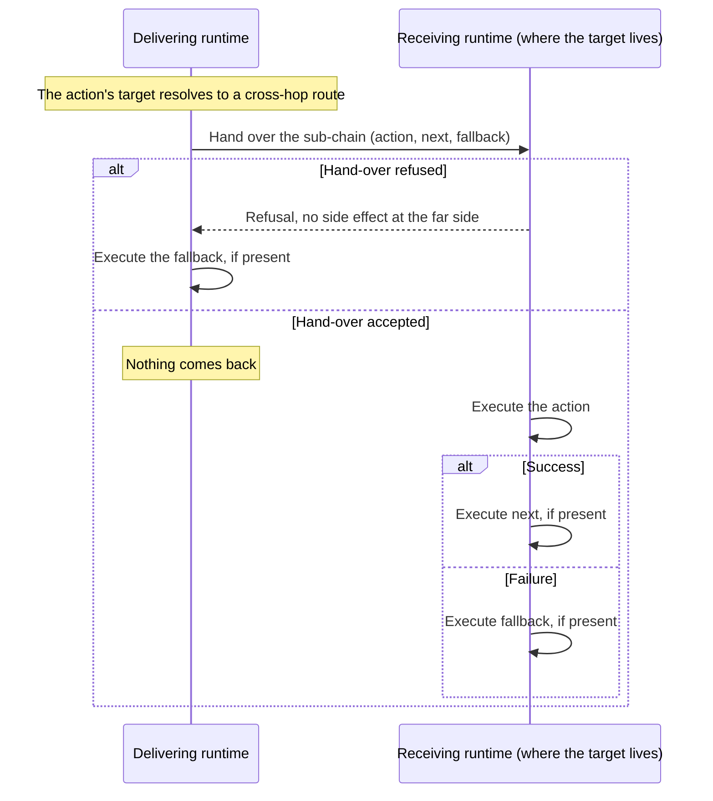

# Host–MFE Action Dispatch and Chaining

<!-- toc -->

- [Context and Problem Statement](#context-and-problem-statement)
- [Decision Drivers](#decision-drivers)
- [Considered Options](#considered-options)
- [Decision Outcome](#decision-outcome)
  - [Consequences](#consequences)
  - [Confirmation](#confirmation)
- [Pros and Cons of the Options](#pros-and-cons-of-the-options)
  - [Mediator keyed by (target, action type) with recursive chain execution](#mediator-keyed-by-target-action-type-with-recursive-chain-execution)
  - [Mediator with call-and-return hops](#mediator-with-call-and-return-hops)
  - [Publish/subscribe event bus](#publishsubscribe-event-bus)
  - [Point-to-point handler references](#point-to-point-handler-references)
- [More Information](#more-information)
- [Traceability](#traceability)

<!-- /toc -->

**ID**: `cpt-frontx-adr-action-dispatch-and-chaining`
## Context and Problem Statement

Microfrontends and the host application coordinate by dispatching actions to targets. A target is an extension domain or an extension mounted in one. Sender and receiver are developed independently and hold no reference to one another. A single action often triggers a sequence with conditional follow-ups: continue on success, divert on failure. Each action must complete within a bounded time, while targets may be registered and torn down at any moment.

Nesting makes this harder. A microfrontend can itself host an extension domain and mount further microfrontends. A target may therefore sit any number of runtime boundaries away from the sender, in either direction. A deeply nested target must be reachable from the shell, and the shell, or any ancestor, must be reachable from a deeply nested target.

Which dispatch mechanism routes an action to the right handler, supports sequencing with branching and per-action timeouts, lets actions reach a target at any nesting depth, and does not couple senders to receivers?

## Decision Drivers

* Decoupled coordination — senders address a target by identifier, never by holding a reference to it (anchors `cpt-frontx-fr-mfe-host-communication`).
* Deterministic routing — a `(targetId, actionTypeId)` pair resolves to at most one handler, matched on the exact action type; when no handler is registered for the pair, resolution continues through downward forwarding entries and upward escalation.
* Cross-runtime forwarding — actions targeting a nested runtime's domains and extensions must be deliverable across the runtime boundary.
* Reachability across nesting depth without probing — a target nested arbitrarily many runtime boundaries away must be reachable in a single addressed hop-by-hop path, not through fan-out to every descendant; this reinforces the existing exclusion of the publish/subscribe alternative — so depth-spanning delivery must be achieved by carrying routing state along the mediator chain rather than by broadcasting.
* Compositional control flow — a dispatched unit may declare success and failure continuations that compose into chains.
* Simple recursive execution — a chain is fully described by its type: the current action, the next chain, and the fallback chain. The runtime executes it recursively, with no ahead-of-time processing, no awaiting, and no status tracking.
* Per-action time bound — each action is bounded by its declared timeout, otherwise its domain's default.
* Execution where the target lives — a sub-chain whose target lives in another runtime is handed to that runtime, and nothing comes back.
* Type-agnostic dispatch — action admission must run through the injected type-system provider, not embedded format knowledge (anchors `cpt-frontx-principle-agnostic-core`).

## Considered Options

* **Mediator keyed by (target, action type) with recursive chain execution** — a central mediator holds a `targetId → (actionTypeId → handler)` registry, and executes chains recursively with `next`/`fallback` branching, handing a sub-chain across a runtime boundary to the runtime where its target lives.
* **Mediator with call-and-return hops** — the same keyed mediator and recursive chains, but a hop is a remote call: the delivering runtime sends one action across, waits for the far side to report its outcome, and selects the next branch itself.
* **Publish/subscribe event bus** — senders publish named events and any number of subscribers react; there is no single addressed handler per action.
* **Point-to-point handler references** — a sender obtains and holds a reference to its target and invokes it directly.

## Decision Outcome

Chosen option: **mediator keyed by (target, action type) with recursive chain execution**, because it is the only option that delivers addressed, decoupled, single-handler routing while also supporting compositional chains, per-action timeouts, and cross-runtime forwarding, without any runtime waiting on another. The mediator resolves a target by looking up the handler registered for exactly the `(targetId, actionTypeId)` pair; a handler matches only its exact action type. When no handler is registered for the pair, resolution continues through the downward forwarding entry for the target and then through upward escalation. Where the target sits across a runtime boundary, the route resolves to the cross-hop route shape rather than to a local handler.

An actions chain is fully described by its type: the current action, the next chain, and the fallback chain, each of which is itself an actions chain. `executeActionsChain(chain)` takes only the chain and returns nothing awaitable. The runtime executes `chain.action`. On success, it executes `chain.next` recursively, if present. On failure, it executes `chain.fallback` recursively, if present. If the selected branch is absent, the chain ends. Nothing is recorded or reported.

A failure means the action did not succeed. That covers a handler that throws or rejects, an expired timeout, no handler for the target, a hand-over across a hop that is refused, and an action that is not admitted. An action is not admitted when the type-system provider rejects it or when the target has not declared it among the actions it can receive. Admission runs at the registry that executes the action, which is the registry where its target lives. The handler is resolved when its action executes, so the action meets the topology as it stands at that moment. Each action is bounded by its declared timeout, otherwise by its domain's default, through the shared `ActionTimeoutResolver`. The occupancy queue uses the same rule (`cpt-frontx-adr-extension-domain-occupancy`). The runtime does no ahead-of-time processing — it does not validate or pre-parse a chain and does not check it for cycles — and it tracks no origin, status, or completion. An emitter that depends on a chain's outcome expresses that as the chain's own `next` or `fallback`.

When the target of `chain.action` lives in another runtime, the current runtime hands the sub-chain — the action with its `next` and `fallback` — to the runtime where the target lives. That runtime executes it the same way, and nothing comes back. The hand-over call either refuses or accepts. It refuses when the bridge it travels through is inactive or disposed, a revoked link included; when no receiver is wired on the far side; when the receiving copy does not recognize the envelope's version; or when the receiving registry is disposed. A refused hand-over is a failure of the action at the delivering runtime, which executes the chain's `fallback`, if present. The refusal leaves no side effect at the far side. After the far side accepts, every failure is handled there. The `next` or `fallback` that follows an action is executed by the runtime that executed the action, and is routed from there through that runtime's own resolution tiers. So a `next` whose target is in the shell travels back up the edge the chain arrived on.

```mermaid
sequenceDiagram
    participant D as Delivering runtime
    participant R as Receiving runtime (where the target lives)
    Note over D: The action's target resolves to a cross-hop route
    D->>R: Hand over the sub-chain (action, next, fallback)
    alt Hand-over refused
        R-->>D: Refusal, no side effect at the far side
        D->>D: Execute the fallback, if present
    else Hand-over accepted
        Note over D: Nothing comes back
        R->>R: Execute the action
        alt Success
            R->>R: Execute next, if present
        else Failure
            R->>R: Execute fallback, if present
        end
    end
```

Handing over is chosen over calling across the hop and waiting for the far side's outcome. A call-and-return hop makes the delivering runtime wait on the far side, and this model has no awaiting.

Reachability across nesting depth is achieved by routing state that propagates along the same hierarchy it is later used to traverse, so a downward miss never has to fan out and probe descendants. Each mounted extension may evaluate against its own independently loaded copy of the runtime (`cpt-frontx-adr-mfe-load-isolation`), so propagation, escalation, and loop containment are built entirely on the two things that reliably cross that boundary: object references explicitly passed across it (the bridge itself), and, for the one handoff that has no argument path — a newly constructed registry adopting the inbound bridge of the extension that is mounting it — a realm-global, version-namespaced rendezvous point rather than shared module state, bracketing exactly the synchronous portion of the extension's own mount call so no concurrently-mounting extension's bridge can be misattributed. The rendezvous serves first contact only: a registry adopting a link at its own construction inside a mount window, which for a runtime's single registry is that runtime's first. Every later contact is a re-offer of the parent's new link through the relink callback the parent retained, which needs no rendezvous. A reader that finds no entry treats the registry as a root and logs nothing. A reader that finds an entry tagged with a rendezvous protocol version it does not recognize, or an entry whose bridge carries no link, treats the registry as holding no inbound bridge and logs a diagnostic rather than adopting the wrong one silently.

Whenever a registry admits a domain or extension and registers its handlers, it composes a forwarding advertisement — the target identifier, treated as opaque since type systems are per-registry and non-interchangeable — and, if the registry holds an inbound bridge, propagates that advertisement upward through it to the immediate parent registry's mediator. The parent records a forwarding entry pointing back down through that bridge and re-propagates the advertisement to its own parent, and so on; adoption of the inbound bridge is automatic, requires no action from the microfrontend author, and the propagation this enables composes transitively so that every ancestor up to and including the shell ends up holding a forwarding entry for every descendant target in the tree, while any single hop only ever holds a reference to its immediate neighbor. If an ancestor receives an advertisement for a target identifier it already holds — whether locally registered or already advertised through a different child — it rejects the advertisement, does not propagate it further, and logs a diagnostic, preserving the single-handler-per-`(target, actionType)` determinism guarantee against a tree-global namespace collision. An advertisement re-stating an entry the ancestor already holds for the very edge it arrived on records nothing new, so it is accepted as a no-op rather than treated as a collision: the guard's subject is a second owner claiming an identifier, not a repeated statement over one live link. Resolution at a mediator therefore proceeds through the keyed exact match and then the downward forwarding entry from propagation; a handler matches only its exact action type, so a resolution yields at most one handler. When none of these resolve, the registry itself has an inbound bridge (that is, it is not the shell), and the action was not handed down from the parent, resolution adds a final upward-escalation tier, reached through that same bridge and minted by the parent registry for the extension's current registration, at the moment it first links that registration's bridge. An action handed down from the parent never escalates: when no earlier tier resolves it, it fails in the child runtime, which executes the chain's `fallback`, if present, and otherwise does nothing; the parent is not involved. That tier resolves to a route distinct in shape from a plain action handler, because the route carries the sub-chain into the hop, where the far side executes it, and a handler invoked only with an action type and payload cannot. The same distinct shape carries the downward forwarding entry from propagation. Minting the escalation route, and tagging an action with its arrival edge for loop containment, on the parent's own side — rather than having the child's registry test the bridge's concrete class identity — means correctness never depends on two independently loaded copies of the runtime agreeing on a shared class, only on the shared bridge object each already holds a reference to. Both the forwarding-entry and escalation tiers sit alongside the keyed lookup in the same resolution call, resolving to this distinct route shape instead of an `ActionHandler`, so the mediator's dispatch loop branches on which shape it received rather than special-casing depth. An action that escalates upward through a given bridge is tagged with that bridge as the edge it arrived on, and forwarding-entry resolution at any hop never re-routes that same action back onto that edge. The `next` or `fallback` executed after the action is routed from the runtime that executed it and is not subject to that exclusion. Containment is standard defensive insurance against the unavoidable race between an action crossing a boundary and a concurrent deactivation or unregistration whose retraction has not yet reached every ancestor (see below), not a sign that the propagation or retraction logic is itself incomplete.

Every runtime-crossing tier resolves to the cross-hop route shape and not to a plain `ActionHandler`, because a handler cannot carry the sub-chain across. The cross-hop envelope carries a version and the sub-chain, and a copy that does not recognize the version refuses the hand-over.

The link, not the registry, is what the parent owns, and it is scoped to the host extension's registration rather than to any one of its mounts: the parent mints one bridge pair and one link for an extension at its first mount and hands that same pair to every subsequent mount. A nested registry's lifetime tracks its runtime — the independently loaded copy the extension's code runs in — so the registry is built once, inside that runtime's first mount window, and keeps the link it adopted across remounts by construction. Unmounting is therefore a change of state, not of structure — the parent deactivates the extension's bridge, keeping every forwarding entry recorded through it, and every hand-over through an inactive bridge is refused, so the delivering runtime executes the chain's `fallback` rather than the action silently succeeding or silently doing nothing. Remounting reactivates the same bridge, and the routing established earlier is live again with nothing to re-establish; a target re-stated over that still-live link resolves against the entry the ancestor already holds for the very same edge, so a remount never trips the collision guard. Because the extension's handler registrations and property subscriptions hang off that persistent bridge, they too survive the unmount and are live again on the next mount, leaving it to the microfrontend's own `unmount()` hook to withdraw them where that is what the microfrontend wants.

Retraction is the parent registry's responsibility, not the disposing registry's, and it is reserved for the events that actually end the relationship: when a host extension is unregistered, or the parent registry that minted its link is disposed, the parent revokes that link, unlinks every adopter, deletes every forwarding entry keyed to that specific bridge, releases the bridge pair, and re-propagates the retraction to its own ancestors. The parent keeps the adopters' relink callbacks. A registry's own disposal retracts every advertisement it had propagated through its own inbound bridge, symmetrically. Because a revoked link is additionally made inert on the parent's side, refusing every further propagation and escalation explicitly, a reference to it retained by any copy of the runtime can never resurrect routing to an extension that is not registered. A retraction through a revoked link is a silent no-op instead, because the parent already performed that retraction when it revoked the link; a re-offer hands over the new link and never revives the revoked one.

When the extension is registered again and mounts, after the new link exists and before the mount window opens, the parent re-offers the new link to the kept adopters through their relink callbacks, and the registry advertises every target it holds — its own admissions and the forwarding entries it holds for its descendants alike — and receives downward delivery and its navigation supply again. A fresh adoption in a later mount window supersedes the previous adopter for that extension, which the parent unlinks so it stops propagating on that edge. Re-offer stays between a parent and its immediate child, adds no member to the registry or to either bridge, and, like adoption itself, needs no explicit identification of the registry by the microfrontend author.

### Consequences

* Good, because senders and receivers are fully decoupled — every interaction is addressed by identifier and resolved centrally.
* Good, because routing is deterministic: a `(target, action type)` pair maps to one handler, rather than ambiguous multi-delivery.
* Good, because success/fallback chain branching expresses coordinated multi-step behavior without bespoke orchestration in each unit.
* Good, because a chain is fully described by its type and executed recursively, with nothing to await or track.
* Bad, because an emitter cannot learn a chain's outcome from the call and must express a dependency on that outcome as the chain's own `next` or `fallback`.
* Good, because a runtime that hands a sub-chain across a hop holds nothing for it.
* Bad, because the delivering runtime never learns what happened at the far side.
* Bad, because a central mediator is a single coordination point that every interaction passes through, concentrating responsibility.
* Bad, because nothing about a chain's execution is recorded, so a chain that takes an unexpected branch is harder to trace.
* Good, because reachability across any nesting depth is automatic — admitting a domain or extension propagates its forwarding advertisement all the way to the shell without any explicit registration step by the microfrontend author.
* Good, because every runtime-crossing hop resolves to the cross-hop route shape, so the sub-chain crosses every boundary.
* Bad, because a version the receiving copy does not recognize makes that hop refuse every hand-over.
* Bad, because propagated advertisements and forwarding entries are additional per-registry state that must be kept consistent with admission, deactivation, and disposal, including retraction of every propagated advertisement for an unregistered subtree.
* Bad, because the collision guard means a target identifier is only unique per tree, not partitioned by subtree — an identifier collision between independently developed subtrees is rejected rather than resolved, trading a small addressing risk for tree-global determinism.
* Good, because minting the escalation route and the arrival-edge tag on the parent's side, and coordinating inbound-bridge adoption through a realm-global rendezvous rather than shared module state, keeps the mechanism correct regardless of how many independently loaded copies of the runtime are involved — the only thing correctness depends on is the bridge object each side already holds.
* Bad, because a registry constructed asynchronously after its host extension's own `mount` call has already returned cannot be identified for automatic adoption — the runtime has no sound way to determine which extension's continuation is running without a browser async-context primitive this ecosystem does not depend on; such a registry holds no inbound bridge and logs a diagnostic rather than silently guessing.
* Good, because the link outlives every individual mount, and the parent re-offers a re-registered extension's new link to the runtime's retained registry, so the runtime's single registry, built once, keeps routing across remounts and re-registrations with no act by the microfrontend author.
* Good, because a hand-over to an extension that is registered but not mounted is refused explicitly, which leads to the chain's `fallback`, rather than silently succeeding or silently doing nothing.
* Bad, because the persistent bridge means an extension's handler registrations and property subscriptions outlive its unmount by default, so a microfrontend that wants a clean slate per mount must withdraw them from its own `unmount()` hook rather than relying on teardown to do it.

### Confirmation

Each group below states how its properties are confirmed. "Automated tests" means tests that run in continuous integration. Where a suite is named, it exists in the codebase and covers the part stated for it. Where no suite is named, the automated tests are the ones delivered with the code that conforms to this decision. "Architecture review" means review of the design and the code against this decision. Validation is continuous and gated by continuous integration on every change: the success criterion is that these tests pass, and there is no calendar timeframe.

* **Routing and admission** — confirmed by architecture review and automated tests.
  * All host–MFE dispatch flows through the mediator's `(target, actionType)` resolution, with downward forwarding entries and upward escalation as the tiers after the exact-match handler.
  * Action admission is delegated to the injected type system rather than to embedded format checks.
  * Admission runs at the registry that executes the action.
  * An action's handler is resolved when that action executes.
* **Recursive execution** — confirmed by automated tests delivered with the code that conforms to this decision.
  * `executeActionsChain` takes only the chain and returns nothing awaitable.
  * The runtime executes `chain.next` on success and `chain.fallback` on failure, and the chain ends when the selected branch is absent.
  * Each failure case leads to the `fallback`: a handler that throws or rejects, an expired timeout, no handler for the target, an action that is not admitted, and a refused hand-over.
  * Each action runs under the timeout `ActionTimeoutResolver` resolves: its declared timeout, otherwise its domain's default.
  * A chain is executed without prior validation or cycle check.
  * Nothing about a chain's execution is recorded or reported.
* **Hand-over across a hop** — confirmed by automated tests.
  * An action whose target lives across a hop is handed over together with its `next` and `fallback`, and nothing comes back.
  * A refused hand-over leads the delivering runtime to execute the `fallback`, with no side effect at the far side.
  * After the far side accepts, only the far side's `fallback` runs for a failure of that action.
  * A `next` is routed from the runtime that executed the action, so a `next` whose target lies back across the arrival edge travels back across it.
* **Registration propagation, escalation, and loop containment** — confirmed by automated tests. `packages/mfes/__tests__/registration-propagation/cross-nesting-reachability.test.ts` covers propagation to the shell, escalation, the collision guard's rejection, and arrival-edge exclusion.
  * Admitting a domain or extension propagates a forwarding advertisement to every ancestor, up to and including the shell.
  * An ancestor holding a target identifier already registered locally, or already advertised through a different edge, rejects a colliding advertisement. It logs a diagnostic and does not propagate the advertisement further.
  * An action not handed down from the parent and unresolved by the keyed and forwarding-entry tiers escalates through the registry's inbound bridge rather than failing immediately. The exception is the shell, which has no further ancestor to escalate to.
  * An action handed down from the parent is never escalated. Unresolved in the child runtime, it fails there: the child executes the chain's `fallback`, if present, and otherwise does nothing, and the parent is not involved.
  * An action is never re-routed onto the bridge edge it most recently arrived on.
  * A `next` or `fallback` whose target lies back across that edge is routed there and reaches it.
* **Re-advertisement over a still-live edge** — confirmed by the automated tests delivered with the code that conforms to this decision.
  * An ancestor accepts as a no-op — neither rejected nor logged — an advertisement re-stating the entry it already holds for the edge that advertisement arrived on.
* **Retraction, deactivation, and remount** — confirmed by automated tests. `cross-nesting-reachability.test.ts` covers retraction on a registry's disposal and on unregistration, deactivation on unmount and on a failed mount, reactivation on remount, and supersession by a later adoption.
  * Unregistering the host of a nested registry's inbound bridge retracts every advertisement propagated through it, so later hand-overs to its targets find no route.
  * Disposing the parent registry that minted that link retracts the same advertisements, and the same guarantee holds when a registry disposes itself.
  * Unmounting or failing to mount that host extension retracts nothing, and instead deactivates its bridge.
  * Every hand-over through an inactive bridge is refused, and the delivering runtime executes the chain's `fallback`.
  * A link revoked at unregistration or disposal refuses every further propagation and escalation explicitly, while a retraction through it is a silent no-op.
  * Remounting reactivates the same bridge, with its escalation route, arrival-edge tagging, handler registrations, and property subscriptions intact.
  * A fresh adoption in a later mount window supersedes and unlinks the previous adopter, and the adopting registry advertises the targets it holds.
* **Re-offer after re-registration** — confirmed by the automated tests delivered with the code that conforms to this decision.
  * Unregistering an extension, registering it again, and mounting it re-offers the new link to the same retained registry, which advertises every target it holds and is reachable again.
  * Adopters claimed during a mount call that throws synchronously are still recorded.
* **Cross-hop route shape** — confirmed by architecture review and automated tests. `packages/mfes/__tests__/registration-propagation/cross-nesting-reachability.test.ts` covers the downward forwarding entry and the upward escalation tier resolving to the cross-hop route shape.
  * Every hop crossing a runtime boundary resolves to the cross-hop route shape rather than to a plain handler: the downward forwarding entry and the upward escalation tier alike.
  * The route carries the sub-chain across the hop, and the far side executes it.
* **Two independently loaded copies of the runtime** — confirmed by a dedicated automated test suite that runs two independently loaded copies, not one shared module graph. `packages/mfes/__tests__/registration-propagation/cross-copy-boundary.test.ts` covers adoption, propagation, escalation, loop containment, deactivation, and retraction across that boundary.
  * Adoption, propagation, escalation, loop containment, and retraction all hold across that boundary, not only within a single module instance.
* **Unresolved inbound bridge and version mismatches** — confirmed by the automated tests delivered with the code that conforms to this decision.
  * A registry constructed outside every mount window behaves as a root registry and logs nothing.
  * A rendezvous entry tagged with an unrecognized protocol version leads to a diagnostic, not to misattribution.
  * A bridge carrying no link leads to a diagnostic, not to silent misattribution.
  * A copy meeting a cross-hop envelope version it does not recognize refuses the hand-over, so the delivering runtime executes the chain's `fallback`.

## Pros and Cons of the Options

### Mediator keyed by (target, action type) with recursive chain execution

A central registry maps targets and action types to handlers, with recursive, branching chain execution. A sub-chain whose target lives in another runtime is handed over to that runtime, which executes it.

* Good, because it gives addressed, decoupled, single-handler routing.
* Good, because chains with `next`/`fallback` branching and per-action timeouts are first-class.
* Good, because handing a sub-chain across a hop leaves no runtime waiting on another.
* Bad, because an emitter cannot learn a chain's outcome from the call and must express any dependency on that outcome as the chain's own `next` or `fallback`.
* Bad, because a delivering runtime never learns what happened at the far side.
* Neutral, because it requires explicit handler registration and unregistration lifecycle management.
* Bad, because the mediator is a central point all interactions traverse.

### Mediator with call-and-return hops

The same keyed mediator and recursive chains, but a hop is a remote call: the delivering runtime sends one action across, waits for the far side to report its outcome, and selects the next branch itself.

* Good, because one runtime selects every branch of a chain.
* Good, because the delivering runtime learns each action's outcome.
* Bad, because the delivering runtime waits on the far side and must bound that wait.
* Bad, because the delivering runtime holds pending state for every action it sent.
* Bad, because a failure at the far side and a timeout at the delivering side can both claim one action.

### Publish/subscribe event bus

Senders publish events; subscribers react independently.

* Good, because publishers and subscribers are loosely coupled and many subscribers can react to one event.
* Bad, because there is no single addressed handler per action, so request/response semantics, deterministic routing, and per-target teardown guarantees are awkward to express.
* Bad, because compositional success/fallback chaining is not naturally supported by fire-and-forget broadcast.

### Point-to-point handler references

A sender holds a direct reference to its target and invokes it.

* Good, because invocation is direct and simple to follow.
* Bad, because it recouples independently-developed units, defeating the decoupling that composing third-party microfrontends requires.
* Bad, because lifecycle and isolation become the sender's problem, and cross-runtime targets cannot be reached without exposing references across the boundary.

## More Information

The present concrete instantiation is `DefaultActionsChainsMediator` (`packages/mfes/src/mediator/DefaultActionsChainsMediator.ts`). It holds an `actionHandlers` map of `targetId → (actionTypeId → handler)`. Its recursive `executeChain` executes `chain.next` on success and `chain.fallback` on failure. Each action runs under the timeout that `ActionTimeoutResolver` (`packages/mfes/src/mediator/ActionTimeoutResolver.ts`) resolves. Action admission is delegated to the injected type system (`typeSystem.register(action)`), so the mediator embeds no type-format knowledge.

Registration propagation and upward escalation extend the same `resolveHandler` tiering with a downward forwarding-entry tier and a final inbound-bridge escalation tier. Both are keyed off the registry's own inbound bridge — the bridge its host extension received when mounted, described in `cpt-frontx-adr-child-mfe-host-access`. Both tiers resolve to a distinct cross-hop route shape, `CrossHopRoute` (`packages/mfes/src/mediator/CrossHopRoute.ts`), rather than a plain `ActionHandler`, because the route carries the sub-chain across the hop and a handler invoked only with an action type and payload cannot. The route shape lives alongside `actionHandlers` in the same mediator instance. A single resolution call therefore walks all tiers, and the dispatch loop branches on the resolved shape without special-casing depth.

Inbound-bridge adoption is coordinated through a realm-global, version-namespaced rendezvous point rather than an ES-module-scoped variable, because each mounted extension may hold its own independently loaded copy of this package (`cpt-frontx-adr-mfe-load-isolation`). This repo already establishes the same pattern for the identical reason in `globalThis.__FRONTX_LAZY__` (`packages/mfes/src/lazy-loader/LazyLoaderRegistry.ts`). It is not in tension with that ADR's isolation guarantee: the rendezvous holds one transient object reference for the duration of a single synchronous call, never shared business or registry state.

The rendezvous handoff is bidirectional within that same window. The bridge travels down to whichever registry constructs itself during the mount. That registry's relink callback travels back up and is retained by the mount manager (`DefaultMountManager`, `packages/mfes/src/runtime/DefaultMountManager.ts`) against the host extension. There is one such retention record per extension. It holds the relink callbacks of its adopters. It is superseded when a later mount produces its own adoption, and it is recorded even when the mount call throws synchronously. When the extension is unregistered, its adopters are unlinked and the record is kept, so the parent can re-offer the extension's next link to the retained registry. The parent can therefore unlink a superseded or revoked adopter, and re-offer to a retained one, without either side needing a second, separate identification mechanism.

The rendezvous entry carries the protocol version of the copy that wrote it: `3`. At that version, the link attached to the handed-down bridge escalates under a synchronous accept-or-throw contract: it accepts the hand-over or throws to refuse it, and never returns a pending result. Independently loaded copies on one page may be built from different releases of this package, and a copy whose escalation call sites assume a different contract cannot rely on such a link. A reader that finds the entry but does not recognize its version therefore treats the rendezvous as empty, and the registry as holding no inbound bridge, per the unrecognized-version diagnostic, rather than binding a link whose contract it cannot rely on. The rendezvous key is the same at every version, which is what lets the mismatch be detected rather than silently misread.

The envelope a `CrossHopRoute` carries across a hop holds a version and the sub-chain, and a copy that does not recognize the version refuses the hand-over.

**Scope of impact.** Applies to how actions are routed and how chains execute between the host and microfrontends at any nesting depth, including forwarding to and escalating from child runtimes. It does not decide the shape of the runtime's public surface (decided in `cpt-frontx-adr-mfe-runtime-public-surface`), nor the shape of the child-facing bridge (decided in `cpt-frontx-adr-child-mfe-host-access`), nor how the type system validates an action's payload (decided in `cpt-frontx-adr-runtime-type-system-coupling`).

**Review trigger.** Revisit if a requirement emerges for an action to be delivered to multiple handlers concurrently, or for chain control flow richer than success/fallback branching (for example parallel fan-out or compensation across targets). Also revisit toward path-qualified, ancestor-relative addressing in place of a flat target-id namespace if target-identifier collisions across independently developed subtrees prove common in practice, since the collision guard currently rejects the colliding advertisement outright rather than resolving it, which would otherwise degrade shell-to-descendant reachability. Also revisit toward a DOM-ancestry-based fallback for inbound-bridge adoption if registries are commonly constructed asynchronously after their host extension's `mount` call has already returned, once the rendezvous diagnostic shows that happening in practice — the synchronous rendezvous window does not cover that case by design, not by oversight.

**Checklist applicability.**

* ARCH — applicable and addressed above (a coordination-pattern decision affecting every host–MFE interaction and difficult to reverse once units depend on the dispatch contract).
* ARCH-ADR-008 (supersession) — Not applicable because this is a new, standalone decision that supersedes no prior record.
* INT — applicable: the mediator defines the host↔MFE communication contract, including cross-runtime forwarding and `executeActionsChain` returning nothing awaitable; its breaking-change policy is governed by `cpt-frontx-interface-mfe-runtime`. The cross-hop envelope, which carries a version and the sub-chain, is an internal contract between independently loaded copies.
* PERF — Not applicable because the per-action time bounds are correctness bounds, not a throughput or latency target.
* SEC — applicable and addressed here (SEC-ADR-001). The threat model is the one `cpt-frontx-adr-mfe-load-isolation` states: the runtime admits independently authored, potentially untrusted microfrontend code into the host. Under this decision that code is both the sender and the receiver of actions. This decision addresses a limited part of `cpt-frontx-nfr-security`. A sender reaches a receiver only through addressed dispatch and never holds a reference to it. Every action is admitted by the type-system provider of the registry that executes it, before its handler runs. Other decisions own the rest of the boundary. Which code runs in the host at all is decided in `cpt-frontx-adr-mfe-load-isolation`. Which extensions a domain admits is decided in `cpt-frontx-adr-domain-extension-compatibility` and `cpt-frontx-adr-extension-domain-occupancy`. The narrow capability surface a child receives is decided in `cpt-frontx-adr-child-mfe-host-access`. Among the options, point-to-point handler references would expose target references across the runtime boundary, and a publish/subscribe bus would deliver an event to any code that subscribes to it. The chosen mediator delivers each action to one addressed handler and hands no target reference to a sender. No secret, credential, or personal data is introduced by this decision. It does introduce three pieces of attack surface. For each, what it does and does not guarantee against deliberate misuse, not only accidental misuse, is as follows:
  * Addressability. Being able to address a target is enough to invoke its handler; addressability is treated as sufficient authority to invoke. Admission checks the action against the target's own contract, but nothing checks who sent it. A handler receives only the action type and payload, with no authenticated sender identity. No FrontX decision owns restricting which senders may invoke a handler, and the PRD places specific authorization implementations out of scope. This is an accepted limitation: an application that must restrict callers has to do so in its own handler logic, and this mechanism gives it nothing to do that with.
  * Rendezvous point. It is realm-global, under a well-known key, and the independently loaded copies it connects share that realm. `cpt-frontx-adr-mfe-load-isolation` isolates module instances, not the global object. Any code in the realm can therefore read or write the rendezvous point. The link a parent attaches to a child's bridge is also reachable by that child's code, because the child holds the bridge. The version tag and the synchronous mount window guard against accidental misattribution only. They give no defence against a script that writes a false entry or uses a link directly, and this is an accepted limitation. Re-offer adds no surface of its own: the parent hands the new link only to the relink callback it retained from that registry's own adoption, and the link is reachable from the bridge object exactly as at adoption.
  * Collision guard. It stops a later advertisement from displacing a target identifier an ancestor already holds, locally or through another edge. It gives no defence against squatting, where a subtree claims an identifier before its rightful owner does. Advertisements are not authenticated, so the first claim wins, and a rightful owner arriving later is rejected with only a diagnostic to show for it. This is an accepted limitation, alongside the addressing risk recorded under Consequences.
* REL — Not applicable because availability and fault-tolerance posture are outside this routing decision, though each action is bounded by its own timeout.
* DATA — Not applicable because no persistent data store or schema is involved.
* OPS — Not applicable because no deployed-service operational procedure is governed by this decision.
* MAINT — applicable: the per-registry state this decision introduces — propagated advertisements, forwarding entries, the persistent bridge pair per registered extension, and the mount manager's per-host-extension retention of adopter relink callbacks — must stay consistent with admission, deactivation, and unregistration indefinitely, and each of those retentions is one record per extension the parent has hosted, kept across unregistration until a later adoption replaces it, and held for at most the parent registry's lifetime, rather than accumulating over mount cycles.
* TEST — applicable: the fallback and escalation tiering, loop containment via arrival-edge tagging, deactivation-on-unmount, and retraction-on-unregistration semantics this ADR decides are exercised by a dedicated cross-realm test suite spanning two independently loaded copies of the runtime, as the Confirmation section requires, and by the registration-propagation regression tests already in the codebase (`packages/mfes/__tests__/registration-propagation/cross-nesting-reachability.test.ts` and `cross-copy-boundary.test.ts`), which specifically cover adoption, propagation, escalation, deactivation, and retraction across that boundary. Recursive execution and the hand-over across a hop are covered by the tests delivered with the code that conforms to this decision.
* COMPL — Not applicable because this is an internal runtime action-routing mechanism between host and microfrontend code with no regulated data, personal data, or external audit surface.
* UX — Not applicable because this decision governs dispatch and routing internal to the runtime between registries; it has no end-user-facing behavior of its own.
* BIZ — Not applicable because this is an internal architecture decision about a coordination mechanism, not a business or product decision.

## Traceability

- **PRD**: [PRD.md](../PRD.md)
- **DESIGN**: [DESIGN.md](../DESIGN.md)

This decision directly addresses the following requirements or design elements:

* `cpt-frontx-fr-mfe-host-communication` — the mediator is how microfrontends communicate with the host and react to host state, through decoupled addressed dispatch; the requirement is unqualified as to how many hosting levels separate a microfrontend from the host, and its own assumptions already anticipate multiple registry instances coexisting, so the mediator's reachability guarantee holds regardless of nesting depth.
* `cpt-frontx-interface-mfe-runtime` — action dispatch is part of the runtime's public surface and is governed by its breaking-change policy.
* `cpt-frontx-component-mfe-runtime` — this decision shapes the communication-mediation mechanism of the MFE Runtime component.
* `cpt-frontx-constraint-mfes-recursive-chain-execution` — this decision is the rationale for that constraint: recursive execution with no awaiting, no status tracking and no ahead-of-time processing, a per-action timeout, and hand-over of a sub-chain to the runtime where its target lives.
* `cpt-frontx-constraint-mfes-cross-nesting-reachability` — the cross-hop route shape every runtime-crossing hop resolves to adds no operation to the registry or to either bridge.
* `cpt-frontx-nfr-security` — within the part this decision addresses: a sender reaches a receiver only through addressed dispatch and never holds a reference to it, and every action is admitted by the type-system provider of the registry that executes it before its handler runs; the attack surface this decision introduces, and its accepted limitations, are recorded under SEC above.
* `cpt-frontx-principle-agnostic-core` — delegating action admission to the injected type system keeps dispatch free of type-format literals.
