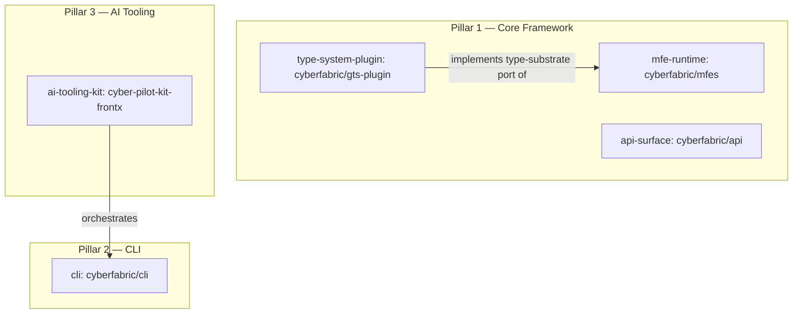

# Technical Design — FrontX Ecosystem

<!-- toc -->

- [1. Architecture Overview](#1-architecture-overview)
  - [1.1 Architectural Vision](#11-architectural-vision)
  - [1.2 Architecture Drivers](#12-architecture-drivers)
  - [1.3 Architecture Layers](#13-architecture-layers)
- [2. Principles & Constraints](#2-principles--constraints)
  - [2.1 Design Principles](#21-design-principles)
  - [2.2 Constraints](#22-constraints)
- [3. Technical Architecture](#3-technical-architecture)
  - [3.1 Domain Model](#31-domain-model)
  - [3.2 Component Model](#32-component-model)
  - [3.3 API Contracts](#33-api-contracts)
  - [3.4 Internal Dependencies](#34-internal-dependencies)
  - [3.5 External Dependencies](#35-external-dependencies)
  - [3.6 Interactions & Sequences](#36-interactions--sequences)
  - [3.7 Database schemas & tables](#37-database-schemas--tables)
  - [3.8 Deployment Topology](#38-deployment-topology)
- [4. Additional context](#4-additional-context)
- [5. Traceability](#5-traceability)

<!-- /toc -->

- [ ] `p3` - **ID**: `cpt-frontx-design-ecosystem`

> **status: DRAFT.** This document is authored across a multi-phase plan. Phase 1 locks the component IDs (§3.2), the boundary-rule constraints (§2.2), and a single design principle (§2.1). Every other section is intentionally a stub marked `INCOMPLETE:` and is filled in later phases; full `cpt validate` is expected only once all required sections exist.
## 1. Architecture Overview

### 1.1 Architectural Vision

INCOMPLETE: deferred to Phase 12 — the ecosystem's technical approach (independently versioned per-concern artifacts across three co-equal pillars) and how the architecture satisfies the PRD.

### 1.2 Architecture Drivers

INCOMPLETE: deferred to Phase 12 — Functional Drivers table (all 24 `cpt-frontx-fr-*`) and NFR Allocation table (all 4 `cpt-frontx-nfr-*`). The Architecture Decision Records subsection below is seeded with all 27 forward references.

#### Functional Drivers

INCOMPLETE: deferred to Phase 12.

#### NFR Allocation

INCOMPLETE: deferred to Phase 12.

#### Architecture Decision Records

The ecosystem's architecture is shaped by the following decision records. They are authored across Phases 2–11; forward references to records not yet authored are expected at this stage.

Foundational:

* `cpt-frontx-adr-matched-version-artifact-distribution` — Distributes the ecosystem as independently published, per-concern, independently versioned artifacts.
* `cpt-frontx-adr-core-package-boundaries` — Partitions the Core Framework into boundary-governed concerns (runtime, type-system provider, protocol surface).

Pillar 1 — Core Framework:

* `cpt-frontx-adr-mfe-registry-facade` — Exposes microfrontend registration and loading through an abstract registry facade.
* `cpt-frontx-adr-type-system-plugin-opaque-schema` — Keeps the runtime's schema surface opaque, with format-specific shape behind the type-system plugin.
* `cpt-frontx-adr-gts-default-type-system` — Supplies the ecosystem's default type system as an injectable provider of the runtime's type-substrate port.
* `cpt-frontx-adr-handler-abstraction-registry-resolution` — Abstracts the microfrontend handler and resolves it through the registry.
* `cpt-frontx-adr-actions-chains-mediator` — Routes host–microfrontend communication through an actions-chains mediator.
* `cpt-frontx-adr-parent-child-bridge` — Defines a narrow parent–child capability bridge between host and microfrontend.
* `cpt-frontx-adr-mount-strategies-cardinality` — Governs extension-domain occupancy through mount strategies and cardinality rules.
* `cpt-frontx-adr-domain-extension-contract-matching` — Admits extensions into domains by contract matching.
* `cpt-frontx-adr-blob-url-mfe-isolation` — Isolates loaded microfrontends at runtime.
* `cpt-frontx-adr-lazy-import-abi` — Separates the runtime ABI from the template-bound build through lazy import.
* `cpt-frontx-adr-mf-manifest-discovery` — Discovers microfrontends through their manifest contract.
* `cpt-frontx-adr-protocol-separated-api` — Separates request/response and streaming behind a common protocol surface.
* `cpt-frontx-adr-short-circuit-and-shared-fetch-cache` — Provides a plugin short-circuit and a realm-shared fetch cache.

Pillar 2 — CLI:

* `cpt-frontx-adr-template-externalization-resolution` — Externalizes templates and resolves them by source-spec at runtime.
* `cpt-frontx-adr-source-spec-syntax` — Defines the versioned source-spec syntax for template acquisition.
* `cpt-frontx-adr-template-manifest-contract` — Defines the template manifest publication contract.
* `cpt-frontx-adr-project-provenance-record` — Records project provenance for scaffolded projects.
* `cpt-frontx-adr-composed-template-resolution` — Resolves composed templates with a defined collision rule.
* `cpt-frontx-adr-upgrade-changeset-engine` — Applies project upgrades as reviewable, non-destructive change sets.
* `cpt-frontx-adr-two-namespace-architecture` — Organizes the command surface into project-level and microfrontend-level namespaces.

Pillar 3 — AI Tooling:

* `cpt-frontx-adr-kit-packaging-cyber-pilot-kit-frontx` — Packages base AI capabilities as a Cypilot kit with prefixed resource identifiers.
* `cpt-frontx-adr-template-ai-extension-contract` — Defines the extension contract a template's AI bundle conforms to.
* `cpt-frontx-adr-extension-discovery-activation` — Discovers and activates installed-template AI extensions without manual wiring.
* `cpt-frontx-adr-base-solution-ai-content-split` — Separates base ecosystem AI content from solution-specific content.
* `cpt-frontx-adr-ai-driven-upgrade-orchestration` — Orchestrates AI-driven template upgrades over the CLI change-set engine.

### 1.3 Architecture Layers

INCOMPLETE: deferred to Phase 12 — the npm-package layering plus the Cypilot-kit artifact, with technologies.

## 2. Principles & Constraints

### 2.1 Design Principles

#### Agnostic core substrate

- [ ] `p2` - **ID**: `cpt-frontx-principle-agnostic-core`

The Core Framework stays agnostic to UI-framework choice, type-system format, and solution-specific vocabulary. The runtime depends on injected, narrowly contracted ports rather than concrete formats or domain values, so the substrate an application composes against is stable regardless of the UI stack, type-definition specification, or layout vocabulary that application adopts. This agnosticism is what lets independently developed units integrate against a fixed, narrow surface.

**ADRs**: `cpt-frontx-adr-core-package-boundaries`

INCOMPLETE: additional principles (opaque-type substrate, template-agnostic tooling, default-deny admission) deferred to Phase 13.

### 2.2 Constraints

The boundary rules below are forward-looking target-governance constraints on the ecosystem's components. Each is a CI-enforceable invariant and each links the ADR that decides it on intrinsic separation-of-concerns grounds.

#### MFES-1 — No type-format literals in the MFE Runtime

- [ ] `p2` - **ID**: `cpt-frontx-constraint-mfes-no-type-format-literals`

The MFE Runtime (`@cyberfabric/mfes`) contains no type-system-format string literals. Type identifiers are opaque strings to the runtime; any concrete type-format vocabulary belongs to the type-system plugin or to consumers. This keeps the runtime independent of any single type-definition specification.

**ADRs**: `cpt-frontx-adr-core-package-boundaries`

#### MFES-2 — No solution-specific shared-property identifiers in the MFE Runtime

- [ ] `p2` - **ID**: `cpt-frontx-constraint-mfes-no-solution-shared-properties`

The MFE Runtime defines no solution-specific shared-property identifiers (such as theme or language vocabulary). Shared-property identity is supplied by the application or its templates, so the runtime's communication substrate carries no domain assumptions.

**ADRs**: `cpt-frontx-adr-core-package-boundaries`

#### MFES-3 — No specific extension-domain values in the MFE Runtime

- [ ] `p2` - **ID**: `cpt-frontx-constraint-mfes-no-layout-domain-values`

The MFE Runtime defines no specific extension-domain (layout-domain) values. Which domains exist, what they are named, and what may occupy them are defined by the application, keeping placement vocabulary out of the platform.

**ADRs**: `cpt-frontx-adr-core-package-boundaries`

#### MFES-4 — No concrete type-format dependency in the MFE Runtime

- [ ] `p2` - **ID**: `cpt-frontx-constraint-mfes-no-type-format-dependency`

The MFE Runtime declares no dependency on any concrete type-system-format implementation. The format provider is injected through the type-substrate port, so the runtime can be composed with any conforming type system.

**ADRs**: `cpt-frontx-adr-core-package-boundaries`

#### MFES-5 — Opaque schema surface in the MFE Runtime

- [ ] `p2` - **ID**: `cpt-frontx-constraint-mfes-opaque-schema-surface`

The runtime's schema surface is opaque, exposing only a stable identifier. Format-specific schema shape and validation live in the type-system plugin, so the runtime reasons about types solely by identity.

**ADRs**: `cpt-frontx-adr-type-system-plugin-opaque-schema`

#### GTS-PLUGIN-1 — Type-system plugin owns infrastructure schemas

- [ ] `p2` - **ID**: `cpt-frontx-constraint-gts-plugin-owns-infra-schemas`

The type-system plugin (`@cyberfabric/gts-plugin`) owns the ecosystem's infrastructure schemas and the default lifecycle instances, registering them as the concrete provider behind the runtime's opaque type-substrate port.

**ADRs**: `cpt-frontx-adr-gts-default-type-system`

#### GTS-PLUGIN-2 — Type-system plugin excludes solution schemas

- [ ] `p2` - **ID**: `cpt-frontx-constraint-gts-plugin-excludes-solution-schemas`

The type-system plugin owns no solution-specific schemas. Application- and template-specific type definitions are registered by their owners at runtime, keeping the plugin scoped to infrastructure concerns.

**ADRs**: `cpt-frontx-adr-gts-default-type-system`

#### API-1 — No solution-specific content in the API surface

- [ ] `p2` - **ID**: `cpt-frontx-constraint-api-no-solution-content`

The API Protocol Surface (`@cyberfabric/api`) contains no solution-specific content, including any built-in mock concept. The surface provides protocol-separated request and stream primitives and a generic plugin extension point; solution behavior is supplied by consumers through that extension point.

**ADRs**: `cpt-frontx-adr-protocol-separated-api`

#### CLI-1 — Template independence of the CLI

- [ ] `p2` - **ID**: `cpt-frontx-constraint-cli-template-independence`

The CLI (`@cyberfabric/cli`) has zero dependency on any template. It resolves templates by source-spec at runtime and bundles none, so the command surface is fully decoupled from the content it scaffolds.

**ADRs**: `cpt-frontx-adr-template-externalization-resolution`

#### KIT-1 — Prefixed resource identifiers in the AI Tooling kit

- [ ] `p2` - **ID**: `cpt-frontx-constraint-kit-prefixed-resource-ids`

Every resource identifier in the AI Tooling kit (`cyber-pilot-kit-frontx`) carries the `frontx_` prefix, so the kit's contributed skills, workflows, and reference artifacts are unambiguously namespaced within a consuming project's Cypilot environment.

**ADRs**: `cpt-frontx-adr-kit-packaging-cyber-pilot-kit-frontx`

## 3. Technical Architecture

### 3.1 Domain Model

INCOMPLETE: deferred to Phase 13 — core entities (MfeEntry, Extension, ExtensionDomain, Action, ActionsChain, LifecycleStage, Schema, ApiService, Template, TemplateManifest, ProjectProvenance, Kit, AiExtension) and their relationships.

### 3.2 Component Model

The ecosystem is composed of independently published, independently versioned artifacts, grouped into three co-equal pillars: a Core Framework (the MFE Runtime, the Type System plugin, and the API Protocol Surface), a CLI, and an AI Tooling Framework. Each component owns a single concern and integrates with the others only through narrow, explicit contracts.

#### MFE Runtime

- [ ] `p2` - **ID**: `cpt-frontx-component-mfe-runtime`

Concrete artifact: `@cyberfabric/mfes`.

##### Why this component exists

Applications need to gain user-facing functionality from independently developed units at runtime, without rebuilding or redeploying the host. The MFE Runtime is the substrate that registers those units, loads them on demand, places them into governed extension domains, mediates their communication with the host, and admits them only after type validation.

##### Responsibility scope

- Owns microfrontend registration and on-demand loading, exposed through an abstract registry facade (`MfeRegistry`, built via `mfeRegistryFactory`).
- Owns extension-domain governance, mount-strategy selection (concurrent / optional / exclusive), and the cardinality rules that admit or reject occupants.
- Owns the actions-chains mediator that routes communication between microfrontends and the host, and the narrow parent–child capability bridge.
- Owns the opaque type-substrate port: it reasons about type identifiers as opaque strings and delegates all schema, validation, and hierarchy operations to an injected type-system provider, reading only a schema's identifier.
- Owns runtime isolation of loaded units.

##### Responsibility boundaries

- Defines no concrete type-system format, declares no dependency on one, and contains no type-format string literals — the format provider is injected (MFES-1, MFES-4, MFES-5).
- Defines no solution-specific shared-property identifiers and no specific extension-domain values — those are supplied by the application or its templates (MFES-2, MFES-3).
- Does not own UI rendering technology; applications and microfrontends choose their own UI framework.
- Does not own template resolution, project lifecycle, or AI tooling — those belong to the CLI and the AI Tooling kit.

##### Related components (by ID)

- `cpt-frontx-component-type-system-plugin` — depends on (consumes the injected provider of the opaque type-substrate port this component defines).

#### Type System Plugin

- [ ] `p2` - **ID**: `cpt-frontx-component-type-system-plugin`

Concrete artifact: `@cyberfabric/gts-plugin`.

##### Why this component exists

The MFE Runtime treats types opaquely and needs a concrete provider to give type identifiers meaning — to validate microfrontends and extensions against type definitions and to resolve type hierarchy. This component is that provider, supplying the ecosystem's default type system as an injectable implementation of the runtime's type-substrate port.

##### Responsibility scope

- Implements the runtime's type-substrate port (`TypeSystemPlugin`) over a concrete type-definition specification.
- Owns the ecosystem infrastructure schemas and the default lifecycle instances, registering them at construction.
- Provides schema validation, type-of resolution, and the format-specific schema shape the runtime never sees directly.

##### Responsibility boundaries

- Owns infrastructure schemas only; it owns no solution-specific schemas, which their owners register at runtime (GTS-PLUGIN-1, GTS-PLUGIN-2).
- Does not own the runtime registry, loading, or communication mechanisms — it is invoked by the runtime exclusively through the type-substrate port.
- Is the only Core Framework component permitted to depend on a concrete type-definition specification.

##### Related components (by ID)

- `cpt-frontx-component-mfe-runtime` — implements the opaque type-substrate port defined by (injected at registry construction).

#### API Protocol Surface

- [ ] `p2` - **ID**: `cpt-frontx-component-api-surface`

Concrete artifact: `@cyberfabric/api`.

##### Why this component exists

Composed applications and their microfrontends issue request/response and streaming calls to back-end services and benefit from sharing fetch results across independently bundled units running in the same realm. The API Protocol Surface provides a protocol-separated, dependency-light surface for this, with a generic plugin extension point and a realm-shared fetch cache.

##### Responsibility scope

- Owns protocol-separated communication: a request/response protocol and a streaming protocol behind a common abstract `ApiProtocol`, with descriptor-based endpoints and auto-derived cache keys.
- Owns a generic plugin short-circuit mechanism and a realm-scoped, retainer-counted, library-agnostic shared fetch cache that lets independently bundled instances reuse in-flight and cached results.

##### Responsibility boundaries

- Contains no solution-specific content, including any built-in mock concept; solution behavior arrives only through the generic plugin extension point (API-1).
- Carries no runtime dependency on any specific data-fetching or state library; its transport dependency is a peer dependency.
- Is intentionally below PRD interface altitude — it maps to no PRD §7.1 public interface and is an internal Core Framework dependency rather than a PRD-level capability.

##### Related components (by ID)

- No intra-ecosystem package dependencies. The surface is consumed directly by applications and microfrontends.

#### CLI

- [ ] `p2` - **ID**: `cpt-frontx-component-cli`

Concrete artifact: `@cyberfabric/cli`.

##### Why this component exists

Project Developers and the AI agents acting for them need to drive the full template and project lifecycle — acquiring templates, scaffolding projects and microfrontends, resolving composed templates, recording provenance, and upgrading projects — from a single, predictable command surface that is decoupled from the templates it operates on.

##### Responsibility scope

- Owns template install (by versioned source-spec), local listing, and local update of installed templates without touching scaffolded projects.
- Owns pre-publish template-structure validation against the publication contract.
- Owns project and microfrontend scaffolding, composed-template resolution in a single operation, and project-provenance recording.
- Owns the change-set engine that applies a project upgrade as a reviewable, approvable, non-destructive change set.
- Organizes its command surface into project-level and microfrontend-level namespaces.

##### Responsibility boundaries

- Has zero dependency on any template; templates are resolved by source-spec at runtime and none are bundled (CLI-1).
- Does not own the runtime mechanisms a scaffolded application uses (registration, type validation, communication) — those belong to the Core Framework.
- Owns the change-set engine itself; AI-driven orchestration of upgrades is layered above it by the AI Tooling kit, not duplicated here.

##### Related components (by ID)

- No intra-ecosystem package dependency. It operates on external templates that target the Core Framework, with no compile-time coupling to any of them.

#### AI Tooling Framework

- [ ] `p2` - **ID**: `cpt-frontx-component-ai-tooling-kit`

Concrete artifact: `cyber-pilot-kit-frontx` (a Cypilot kit).

##### Why this component exists

AI agents working in a FrontX project need ecosystem fluency from session start and the ability to gain template-specific expertise automatically when a template is installed. This component delivers those capabilities as a Cypilot kit — the framework's delivered public surface — installed through the Cypilot CLI.

##### Responsibility scope

- Owns the base ecosystem AI capabilities (skills, workflows, guidelines, reference artifacts) available to agents at session start.
- Owns the extension contract that a template's AI bundle conforms to, and the discovery-and-activation mechanism that turns installed-template extensions into agent-visible capabilities with no manual wiring.
- Owns the AI workflow surface for template upgrades (review gates, change-impact analysis, downstream effect assessment) that coordinates with the CLI change-set engine.

##### Responsibility boundaries

- Ships zero solution-specific AI content; solution capabilities arrive exclusively through template bundles (parallels CLI-1).
- Every contributed resource identifier carries the `frontx_` prefix (KIT-1).
- Does not own the upgrade change-set engine; it orchestrates and enriches the engine owned by the CLI rather than reimplementing it.

##### Related components (by ID)

- `cpt-frontx-component-cli` — coordinates with (orchestrates the CLI's change-set engine for AI-driven upgrades).

### 3.3 API Contracts

INCOMPLETE: deferred to Phase 13 — must cover all 4 `cpt-frontx-interface-*` and all 5 `cpt-frontx-contract-*` from the PRD.

### 3.4 Internal Dependencies

INCOMPLETE: deferred to Phase 14 — the inter-package dependency graph (the type-system plugin implements the runtime's port; the API surface, CLI, and AI Tooling kit are standalone; no cycles).

### 3.5 External Dependencies

INCOMPLETE: deferred to Phase 14 — the concrete type-definition specification (plugin only), the module-federation runtime, the transport peer dependency of the API surface, the GitHub source registry, the package registry, and the Cypilot CLI / kit system.

### 3.6 Interactions & Sequences

INCOMPLETE: deferred to Phase 14 — sequences (each citing a PRD usecase + actor) for runtime register/validate/mount, composed-project scaffold, AI-driven template upgrade, and template-AI-extension discovery/activation.

### 3.7 Database schemas & tables

INCOMPLETE: deferred to Phase 14 — Not applicable is expected here because the ecosystem persists no databases (provenance and manifests are files); the explicit N/A statement is authored in Phase 14.

### 3.8 Deployment Topology

INCOMPLETE: optional; deferred to Phase 14 — package-registry and GitHub-tarball distribution may be summarized.

## 4. Additional context

INCOMPLETE: deferred to Phase 14 — technology-stack alignment and capacity notes (the NFR thresholds), with explicit N/A for non-applicable checklist categories.

## 5. Traceability

INCOMPLETE: deferred to Phase 14.

- **PRD**: [PRD.md](./PRD.md)
- **ADRs**: [ADR/](./ADR/)
