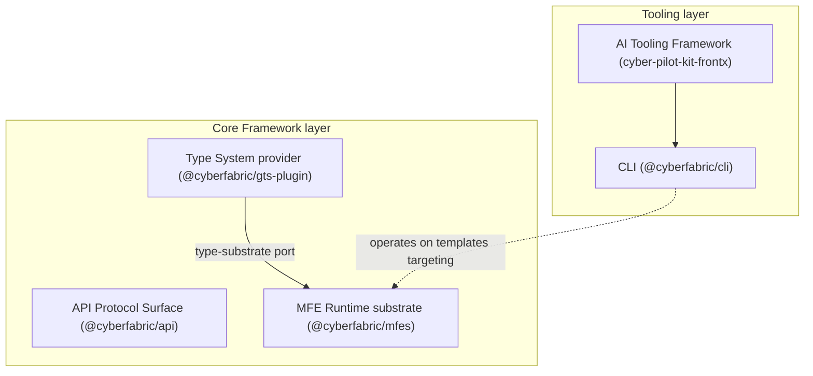
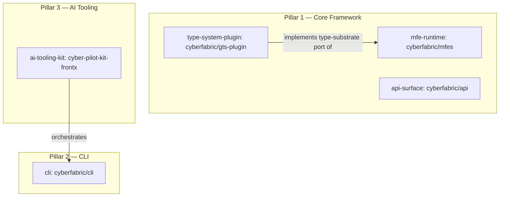

# Technical Design — FrontX Ecosystem


<!-- toc -->

- [1. Architecture Overview](#1-architecture-overview)
  - [1.1 Architectural Vision](#11-architectural-vision)
  - [1.2 Architecture Drivers](#12-architecture-drivers)
  - [1.3 Architecture Layers](#13-architecture-layers)
- [2. Principles & Constraints](#2-principles--constraints)
  - [2.1 Design Principles](#21-design-principles)
  - [2.2 Constraints](#22-constraints)
- [3. Technical Architecture](#3-technical-architecture)
  - [3.1 Domain Model](#31-domain-model)
  - [3.2 Component Model](#32-component-model)
  - [3.3 API Contracts](#33-api-contracts)
  - [3.4 Internal Dependencies](#34-internal-dependencies)
  - [3.5 External Dependencies](#35-external-dependencies)
  - [3.6 Interactions & Sequences](#36-interactions--sequences)
  - [3.7 Database schemas & tables](#37-database-schemas--tables)
  - [3.8 Deployment Topology](#38-deployment-topology)
- [4. Additional context](#4-additional-context)
  - [Technology stack alignment](#technology-stack-alignment)
  - [Capacity and NFR thresholds](#capacity-and-nfr-thresholds)
  - [Non-applicable checklist categories](#non-applicable-checklist-categories)
- [5. Traceability](#5-traceability)

<!-- /toc -->

- [ ] `p3` - **ID**: `cpt-frontx-design-ecosystem`

## 1. Architecture Overview

### 1.1 Architectural Vision

The FrontX ecosystem is delivered as a set of independently published, independently versioned artifacts, each owning a single concern and integrating with the others only through narrow, explicit contracts. These artifacts are organized into three co-equal pillars: a **Core Framework** of npm packages (the MFE Runtime `@cyberfabric/mfes`, the Type System plugin `@cyberfabric/gts-plugin`, and the API Protocol Surface `@cyberfabric/api`), a **CLI** (`@cyberfabric/cli`) that drives the template and project lifecycle, and an **AI Tooling Framework** (`cyber-pilot-kit-frontx`) that delivers ecosystem fluency to AI agents. Per-concern independent versioning, governed by a matched major/minor distribution policy, lets each artifact evolve on its own cadence while consuming applications upgrade on theirs rather than in lockstep (`cpt-frontx-fr-versioned-platform-evolution`, `cpt-frontx-nfr-evolvability`).

The technical approach centers on an agnostic, narrowly contracted substrate. The Core Framework reasons about microfrontends, type identifiers, and extension domains through injected ports and opaque identifiers rather than concrete formats or solution vocabulary, so an application composes against a stable surface regardless of its UI stack, type-definition specification, or layout vocabulary (`cpt-frontx-fr-ui-framework-agnostic`, `cpt-frontx-fr-mfe-runtime-registration`). The runtime admits units only after type validation, places them into governed extension domains under explicit cardinality and admission rules, mediates host-microfrontend communication through a narrow capability bridge, and isolates loaded units - realizing a default-deny security posture (`cpt-frontx-fr-mfe-type-validation`, `cpt-frontx-nfr-security`). The CLI resolves templates by versioned source-spec at runtime and bundles none, keeping the command surface fully decoupled from the content it scaffolds and applying project upgrades as reviewable, non-destructive change sets (`cpt-frontx-fr-cli-template-install`, `cpt-frontx-fr-cli-project-upgrade-changeset`). The AI Tooling Framework ships only base ecosystem capabilities and gains template-specific expertise through bundled extensions discovered and activated automatically (`cpt-frontx-fr-ai-frontx-skills`, `cpt-frontx-fr-ai-extension-discovery-activation`).

The system context is a composed FrontX application running in the browser, whose host loads independently developed microfrontends at runtime. External boundaries are: the consuming application and its microfrontends (which depend on the Core Framework packages and choose their own UI framework), a GitHub-hosted source registry and an npm package registry that distribute templates and packages, the back-end services that microfrontends call through the API Protocol Surface, and the Cypilot CLI environment that installs and activates the AI Tooling kit. Within these boundaries the architecture satisfies the PRD by allocating each capability to exactly one owning artifact and placing no architectural ceiling on the microfrontends or type definitions an application integrates (`cpt-frontx-fr-no-architectural-ceiling`, `cpt-frontx-nfr-scalability-ceiling`).

### 1.2 Architecture Drivers

Requirements that significantly influence architecture decisions. Each driver below maps a PRD requirement to the design response that addresses it, citing the requirement by ID; requirement text is owned by the PRD and is not restated here. The Architecture Decision Records subsection records the decisions these drivers rest on.

#### Functional Drivers

| Requirement | Design Response |
|-------------|-----------------|
| `cpt-frontx-fr-mfe-runtime-registration` | MFE Runtime registers units through the abstract `MfeRegistry` facade and loads them on demand via the resolved handler, decided in `cpt-frontx-adr-mfe-registry-facade` and `cpt-frontx-adr-handler-abstraction-registry-resolution`; manifest-based discovery (`cpt-frontx-adr-mf-manifest-discovery`) and lazy-import ABI separation (`cpt-frontx-adr-lazy-import-abi`) support on-demand loading. |
| `cpt-frontx-fr-mfe-multi-occupant-domain` | Extension-domain occupancy is governed by mount strategies and cardinality rules (`cpt-frontx-adr-mount-strategies-cardinality`) that admit multiple occupants where a domain permits, with admission gated by contract matching (`cpt-frontx-adr-domain-extension-contract-matching`). |
| `cpt-frontx-fr-mfe-host-communication` | Host-microfrontend communication is routed through the actions-chains mediator (`cpt-frontx-adr-actions-chains-mediator`) over a narrow parent-child capability bridge (`cpt-frontx-adr-parent-child-bridge`). |
| `cpt-frontx-fr-mfe-type-validation` | Units and extensions are validated against type definitions at registration through the opaque type-substrate port (`cpt-frontx-adr-type-system-plugin-opaque-schema`), its default provider (`cpt-frontx-adr-gts-default-type-system`), and contract matching (`cpt-frontx-adr-domain-extension-contract-matching`). |
| `cpt-frontx-fr-application-type-definitions` | Applications register their own and additional runtime type definitions through the type-substrate port the runtime exposes opaquely (`cpt-frontx-adr-type-system-plugin-opaque-schema`). |
| `cpt-frontx-fr-ui-framework-agnostic` | Core-package boundaries keep the runtime free of UI-framework coupling, leaving UI-stack choice to applications and microfrontends (`cpt-frontx-adr-core-package-boundaries`). |
| `cpt-frontx-fr-versioned-platform-evolution` | The matched-version artifact-distribution policy isolates breaking changes behind semantic versioning across the published artifacts (`cpt-frontx-adr-matched-version-artifact-distribution`). |
| `cpt-frontx-fr-no-architectural-ceiling` | The same distribution and boundary policy imposes no architectural cap on integrated units, governing growth by performance thresholds rather than structure (`cpt-frontx-adr-matched-version-artifact-distribution`). |
| `cpt-frontx-fr-cli-template-install` | The CLI resolves and installs templates by versioned source-spec at runtime (`cpt-frontx-adr-template-externalization-resolution`, `cpt-frontx-adr-source-spec-syntax`). |
| `cpt-frontx-fr-cli-template-list` | Template inventory and versions are reported from the externalized, source-spec-resolved template store (`cpt-frontx-adr-template-externalization-resolution`). |
| `cpt-frontx-fr-cli-template-update-local` | Local template updates operate on the externalized template store without touching scaffolded projects (`cpt-frontx-adr-template-externalization-resolution`). |
| `cpt-frontx-fr-cli-template-validate-prepublish` | Pre-publish structure validation runs against the template manifest publication contract (`cpt-frontx-adr-template-manifest-contract`). |
| `cpt-frontx-fr-cli-project-scaffold` | Project scaffolding is driven from the project-level command namespace (`cpt-frontx-adr-two-namespace-architecture`). |
| `cpt-frontx-fr-cli-microfrontend-scaffold` | Microfrontend scaffolding is driven from the microfrontend-level command namespace sharing one resolver (`cpt-frontx-adr-two-namespace-architecture`). |
| `cpt-frontx-fr-cli-composed-template-resolution` | Referenced microfrontend templates are resolved recursively in one operation under a defined collision rule (`cpt-frontx-adr-composed-template-resolution`). |
| `cpt-frontx-fr-cli-project-upgrade-changeset` | Upgrades apply as reviewable, non-destructive change sets recorded against project provenance (`cpt-frontx-adr-upgrade-changeset-engine`, `cpt-frontx-adr-project-provenance-record`). |
| `cpt-frontx-fr-cli-upgrade-review-approval` | The change-set engine gates application of changes behind explicit review and approval (`cpt-frontx-adr-upgrade-changeset-engine`). |
| `cpt-frontx-fr-cli-two-namespace-commands` | The command surface is organized into project-level and microfrontend-level namespaces (`cpt-frontx-adr-two-namespace-architecture`). |
| `cpt-frontx-fr-ai-frontx-skills` | Base FrontX skills are delivered by the AI Tooling kit, with base content kept solution-agnostic (`cpt-frontx-adr-base-solution-ai-content-split`). |
| `cpt-frontx-fr-ai-template-bundle-extensions` | Templates carry AI bundles conforming to the template AI extension contract (`cpt-frontx-adr-template-ai-extension-contract`). |
| `cpt-frontx-fr-ai-extension-discovery-activation` | Installed-template extensions are discovered and activated without manual wiring (`cpt-frontx-adr-extension-discovery-activation`). |
| `cpt-frontx-fr-ai-upgrade-orchestration` | AI-driven upgrade workflows orchestrate and enrich the CLI change-set engine (`cpt-frontx-adr-ai-driven-upgrade-orchestration`). |
| `cpt-frontx-fr-ai-session-start-knowledge` | Ecosystem-knowledge artifacts are packaged as a Cypilot kit available at session start (`cpt-frontx-adr-kit-packaging-cyber-pilot-kit-frontx`). |
| `cpt-frontx-fr-ai-tooling-template-agnostic` | The framework ships no solution-specific AI content; such content arrives only via template bundles (`cpt-frontx-adr-base-solution-ai-content-split`). |

#### NFR Allocation

This table maps non-functional requirements from the PRD to specific design/architecture responses, demonstrating how quality attributes are realized.

| NFR ID | NFR Summary | Allocated To | Design Response | Verification Approach |
|--------|-------------|--------------|-----------------|-----------------------|
| `cpt-frontx-nfr-runtime-performance` | Runtime response-time and throughput targets | MFE Runtime; API Protocol Surface | Lazy-import ABI separation defers template-bound build cost from the runtime ABI (`cpt-frontx-adr-lazy-import-abi`); the realm-shared, retainer-counted fetch cache and plugin short-circuit reuse in-flight and cached results across independently bundled units (`cpt-frontx-adr-short-circuit-and-shared-fetch-cache`). | Performance benchmarks asserting the PRD p95 registration, on-demand-load, and registration-throughput thresholds. |
| `cpt-frontx-nfr-evolvability` | Versioned releases without lockstep upgrades | Matched-version distribution policy across all artifacts | Independently published, per-concern versioned artifacts whose major/minor versions are kept matched while patch/pre-release may diverge, isolating breaking changes behind versioning and a deprecation cycle (`cpt-frontx-adr-matched-version-artifact-distribution`). | CI version-policy check asserting matched major/minor across published artifacts and a deprecation cycle before any removal. |
| `cpt-frontx-nfr-scalability-ceiling` | No architectural cap on integrated units | Matched-version distribution policy; runtime boundaries | The distribution and boundary architecture imposes no structural ceiling, so integration scales to the PRD operational floors governed only by performance thresholds (`cpt-frontx-adr-matched-version-artifact-distribution`). | Load test registering the PRD operational floors of microfrontends and type definitions against one application without architectural failure. |
| `cpt-frontx-nfr-security` | Default-deny posture; validated admission | MFE Runtime isolation, contract matching, type validation | Loaded units are isolated at runtime (`cpt-frontx-adr-blob-url-mfe-isolation`); every unit and extension passes contract matching and type validation before admission (`cpt-frontx-adr-domain-extension-contract-matching`, `cpt-frontx-adr-type-system-plugin-opaque-schema`), granting no access beyond a domain's declared grants. | Admission audit asserting 100% of admitted units validated and zero access paths outside an extension domain's declared grants. |

#### Architecture Decision Records

The ecosystem's architecture is shaped by the following decision records, grouped by the pillar each one governs. Each record documents one decision in full; this subsection lists the inventory by ID and one-line intent.

Foundational:

* `cpt-frontx-adr-matched-version-artifact-distribution` — Distributes the ecosystem as independently published, per-concern, independently versioned artifacts.
* `cpt-frontx-adr-core-package-boundaries` — Partitions the Core Framework into boundary-governed concerns (runtime, type-system provider, protocol surface).

Pillar 1 — Core Framework:

* `cpt-frontx-adr-mfe-registry-facade` — Exposes microfrontend registration and loading through an abstract registry facade.
* `cpt-frontx-adr-type-system-plugin-opaque-schema` — Keeps the runtime's schema surface opaque, with format-specific shape behind the type-system plugin.
* `cpt-frontx-adr-gts-default-type-system` — Supplies the ecosystem's default type system as an injectable provider of the runtime's type-substrate port.
* `cpt-frontx-adr-handler-abstraction-registry-resolution` — Abstracts the microfrontend handler and resolves it through the registry.
* `cpt-frontx-adr-actions-chains-mediator` — Routes host–microfrontend communication through an actions-chains mediator.
* `cpt-frontx-adr-parent-child-bridge` — Defines a narrow parent–child capability bridge between host and microfrontend.
* `cpt-frontx-adr-mount-strategies-cardinality` — Governs extension-domain occupancy through mount strategies and cardinality rules.
* `cpt-frontx-adr-domain-extension-contract-matching` — Admits extensions into domains by contract matching.
* `cpt-frontx-adr-blob-url-mfe-isolation` — Isolates loaded microfrontends at runtime.
* `cpt-frontx-adr-lazy-import-abi` — Separates the runtime ABI from the template-bound build through lazy import.
* `cpt-frontx-adr-mf-manifest-discovery` — Discovers microfrontends through their manifest contract.
* `cpt-frontx-adr-protocol-separated-api` — Separates request/response and streaming behind a common protocol surface.
* `cpt-frontx-adr-short-circuit-and-shared-fetch-cache` — Provides a plugin short-circuit and a realm-shared fetch cache.

Pillar 2 — CLI:

* `cpt-frontx-adr-template-externalization-resolution` — Externalizes templates and resolves them by source-spec at runtime.
* `cpt-frontx-adr-source-spec-syntax` — Defines the versioned source-spec syntax for template acquisition.
* `cpt-frontx-adr-template-manifest-contract` — Defines the template manifest publication contract.
* `cpt-frontx-adr-project-provenance-record` — Records project provenance for scaffolded projects.
* `cpt-frontx-adr-composed-template-resolution` — Resolves composed templates with a defined collision rule.
* `cpt-frontx-adr-upgrade-changeset-engine` — Applies project upgrades as reviewable, non-destructive change sets.
* `cpt-frontx-adr-two-namespace-architecture` — Organizes the command surface into project-level and microfrontend-level namespaces.

Pillar 3 — AI Tooling:

* `cpt-frontx-adr-kit-packaging-cyber-pilot-kit-frontx` — Packages base AI capabilities as a Cypilot kit with prefixed resource identifiers.
* `cpt-frontx-adr-template-ai-extension-contract` — Defines the extension contract a template's AI bundle conforms to.
* `cpt-frontx-adr-extension-discovery-activation` — Discovers and activates installed-template AI extensions without manual wiring.
* `cpt-frontx-adr-base-solution-ai-content-split` — Separates base ecosystem AI content from solution-specific content.
* `cpt-frontx-adr-ai-driven-upgrade-orchestration` — Orchestrates AI-driven template upgrades over the CLI change-set engine.

### 1.3 Architecture Layers

The ecosystem layers run from the agnostic runtime substrate up to the tooling that drives the lifecycle around it. The present instance of the delivered set is four npm packages plus one Cypilot kit (non-binding; the durable architecture is the per-concern layering, not this count). Each layer's technology choices align with the §2.2 boundary constraints and the NFRs: the runtime substrate stays UI-framework- and type-format-agnostic (MFES-1..MFES-5) so it supports any UI stack, and the type-system layer is the only Core Framework layer permitted a concrete type-definition specification (GTS-PLUGIN-1, GTS-PLUGIN-2).



- [ ] `p3` - **ID**: `cpt-frontx-tech-ecosystem-stack`

| Layer | Responsibility | Technology |
|-------|---------------|------------|
| Presentation | Application and microfrontend UI; chosen freely per unit, not constrained by the platform | Any UI framework (React, Vue, Svelte, vanilla JavaScript); TypeScript |
| Application (Tooling) | Template and project lifecycle (install, scaffold, compose, upgrade) and AI-agent orchestration over it | Node.js CLI (`@cyberfabric/cli`); Cypilot kit (`cyber-pilot-kit-frontx`); GitHub source registry; npm package registry |
| Domain (Type System) | Concrete type-definition provider behind the runtime's opaque type-substrate port; infrastructure schemas and validation | TypeScript type-system plugin (`@cyberfabric/gts-plugin`) over a concrete type-definition specification |
| Infrastructure (Runtime substrate) | Agnostic registration, on-demand loading, extension-domain governance, mediation, isolation, and protocol-separated service access | TypeScript runtime (`@cyberfabric/mfes`) with module-federation runtime and lazy import; API Protocol Surface (`@cyberfabric/api`) with a transport peer dependency |

## 2. Principles & Constraints

### 2.1 Design Principles

#### Agnostic core substrate

- [ ] `p2` - **ID**: `cpt-frontx-principle-agnostic-core`

The Core Framework stays agnostic to UI-framework choice, type-system format, and solution-specific vocabulary. The runtime depends on injected, narrowly contracted ports rather than concrete formats or domain values, so the substrate an application composes against is stable regardless of the UI stack, type-definition specification, or layout vocabulary that application adopts. This agnosticism is what lets independently developed units integrate against a fixed, narrow surface.

**ADRs**: `cpt-frontx-adr-core-package-boundaries`

#### Opaque type substrate

- [ ] `p2` - **ID**: `cpt-frontx-principle-opaque-type-substrate`

The runtime reasons about types solely by identity. It holds a type only as an opaque identifier and delegates every schema operation — shape, validation, and hierarchy resolution — to an injected type-system provider, never reading the concrete schema shape itself. Keeping the substrate opaque confines all format-specific knowledge to a single replaceable provider, so the runtime stays independent of any one type-definition specification and a different provider can be composed in without touching the runtime.

**ADRs**: `cpt-frontx-adr-type-system-plugin-opaque-schema`, `cpt-frontx-adr-gts-default-type-system`

#### Template-agnostic tooling

- [ ] `p2` - **ID**: `cpt-frontx-principle-template-agnostic-tooling`

The lifecycle tooling carries no bundled template or solution content. The CLI resolves the templates it operates on by versioned source-spec at runtime and bundles none, and the AI Tooling Framework ships only base ecosystem capabilities, gaining solution-specific expertise exclusively through extensions bundled with installed templates. Decoupling the tooling from the content it acts on lets templates and tooling evolve and release independently, and keeps a single tool able to serve any conforming template.

**ADRs**: `cpt-frontx-adr-template-externalization-resolution`, `cpt-frontx-adr-base-solution-ai-content-split`

#### Default-deny admission

- [ ] `p2` - **ID**: `cpt-frontx-principle-default-deny-admission`

A unit gains nothing until it earns it. Microfrontends and their extensions are admitted into the runtime only after passing type validation and extension-domain contract matching, are placed under the explicit mount-strategy and cardinality rules of the domain they enter, are isolated once loaded, and are granted no access beyond a domain's declared grants. Denying by default and admitting only on an explicit, validated match bounds the blast radius of any independently developed unit running inside a host.

**ADRs**: `cpt-frontx-adr-domain-extension-contract-matching`, `cpt-frontx-adr-type-system-plugin-opaque-schema`, `cpt-frontx-adr-blob-url-mfe-isolation`

#### Per-concern independent versioning

- [ ] `p2` - **ID**: `cpt-frontx-principle-per-concern-versioning`

Each concern is published as its own artifact and versioned on its own cadence, with major and minor versions kept matched across the artifacts while patch and pre-release may diverge. Consuming applications adopt new versions on their own schedule rather than in lockstep, breaking changes are isolated behind semantic versioning and a deprecation cycle, and no single artifact's release pace constrains another's. This is what lets the ecosystem evolve continuously without forcing a coordinated platform-wide upgrade.

**ADRs**: `cpt-frontx-adr-matched-version-artifact-distribution`, `cpt-frontx-adr-core-package-boundaries`

### 2.2 Constraints

The boundary rules below are forward-looking target-governance constraints on the ecosystem's components. Each is a CI-enforceable invariant and each links the ADR that decides it on intrinsic separation-of-concerns grounds.

#### MFES-1 — No type-format literals in the MFE Runtime

- [ ] `p2` - **ID**: `cpt-frontx-constraint-mfes-no-type-format-literals`

The MFE Runtime (`@cyberfabric/mfes`) contains no type-system-format string literals. Type identifiers are opaque strings to the runtime; any concrete type-format vocabulary belongs to the type-system plugin or to consumers. This keeps the runtime independent of any single type-definition specification.

**ADRs**: `cpt-frontx-adr-core-package-boundaries`

#### MFES-2 — No solution-specific shared-property identifiers in the MFE Runtime

- [ ] `p2` - **ID**: `cpt-frontx-constraint-mfes-no-solution-shared-properties`

The MFE Runtime defines no solution-specific shared-property identifiers (such as theme or language vocabulary). Shared-property identity is supplied by the application or its templates, so the runtime's communication substrate carries no domain assumptions.

**ADRs**: `cpt-frontx-adr-core-package-boundaries`

#### MFES-3 — No specific extension-domain values in the MFE Runtime

- [ ] `p2` - **ID**: `cpt-frontx-constraint-mfes-no-layout-domain-values`

The MFE Runtime defines no specific extension-domain (layout-domain) values. Which domains exist, what they are named, and what may occupy them are defined by the application, keeping placement vocabulary out of the platform.

**ADRs**: `cpt-frontx-adr-core-package-boundaries`

#### MFES-4 — No concrete type-format dependency in the MFE Runtime

- [ ] `p2` - **ID**: `cpt-frontx-constraint-mfes-no-type-format-dependency`

The MFE Runtime declares no dependency on any concrete type-system-format implementation. The format provider is injected through the type-substrate port, so the runtime can be composed with any conforming type system.

**ADRs**: `cpt-frontx-adr-core-package-boundaries`

#### MFES-5 — Opaque schema surface in the MFE Runtime

- [ ] `p2` - **ID**: `cpt-frontx-constraint-mfes-opaque-schema-surface`

The runtime's schema surface is opaque, exposing only a stable identifier. Format-specific schema shape and validation live in the type-system plugin, so the runtime reasons about types solely by identity.

**ADRs**: `cpt-frontx-adr-type-system-plugin-opaque-schema`

#### GTS-PLUGIN-1 — Type-system plugin owns infrastructure schemas

- [ ] `p2` - **ID**: `cpt-frontx-constraint-gts-plugin-owns-infra-schemas`

The type-system plugin (`@cyberfabric/gts-plugin`) owns the ecosystem's infrastructure schemas and the default lifecycle instances, registering them as the concrete provider behind the runtime's opaque type-substrate port.

**ADRs**: `cpt-frontx-adr-gts-default-type-system`

#### GTS-PLUGIN-2 — Type-system plugin excludes solution schemas

- [ ] `p2` - **ID**: `cpt-frontx-constraint-gts-plugin-excludes-solution-schemas`

The type-system plugin owns no solution-specific schemas. Application- and template-specific type definitions are registered by their owners at runtime, keeping the plugin scoped to infrastructure concerns.

**ADRs**: `cpt-frontx-adr-gts-default-type-system`

#### API-1 — No solution-specific content in the API surface

- [ ] `p2` - **ID**: `cpt-frontx-constraint-api-no-solution-content`

The API Protocol Surface (`@cyberfabric/api`) contains no solution-specific content, including any built-in mock concept. The surface provides protocol-separated request and stream primitives and a generic plugin extension point; solution behavior is supplied by consumers through that extension point.

**ADRs**: `cpt-frontx-adr-protocol-separated-api`

#### CLI-1 — Template independence of the CLI

- [ ] `p2` - **ID**: `cpt-frontx-constraint-cli-template-independence`

The CLI (`@cyberfabric/cli`) has zero dependency on any template. It resolves templates by source-spec at runtime and bundles none, so the command surface is fully decoupled from the content it scaffolds.

**ADRs**: `cpt-frontx-adr-template-externalization-resolution`

#### KIT-1 — Prefixed resource identifiers in the AI Tooling kit

- [ ] `p2` - **ID**: `cpt-frontx-constraint-kit-prefixed-resource-ids`

Every resource identifier in the AI Tooling kit (`cyber-pilot-kit-frontx`) carries the `frontx_` prefix, so the kit's contributed skills, workflows, and reference artifacts are unambiguously namespaced within a consuming project's Cypilot environment.

**ADRs**: `cpt-frontx-adr-kit-packaging-cyber-pilot-kit-frontx`

## 3. Technical Architecture

### 3.1 Domain Model

The ecosystem's core entities span the three pillars: the runtime substrate's registration and governance concepts, the type substrate, the protocol surface, and the lifecycle entities the CLI and AI Tooling Framework operate on. Entities are described at architecture altitude; the **Schema** column points to the owning artifact and format where each entity's concrete shape lives (or, for forward-looking lifecycle entities, the owning decision record and the format it will take), never an inline schema (DATA-DESIGN-NO-001).

**Core Entities**:

| Entity | Description | Schema |
|--------|-------------|--------|
| MfeEntry | A registered microfrontend's record in the runtime registry — its identity, resolved handler, and the metadata needed to load and mount it on demand. | TypeScript — `@cyberfabric/mfes` |
| Extension | A unit a microfrontend contributes for placement into an extension domain, admitted only on a matched contract. | TypeScript — `@cyberfabric/mfes` |
| ExtensionDomain | A named, application-defined placement region governed by a mount strategy and a cardinality rule that decide which and how many occupants it admits. | TypeScript — `@cyberfabric/mfes` |
| Action | A single mediated capability invocation exchanged between a microfrontend and the host. | TypeScript — `@cyberfabric/mfes` |
| ActionsChain | An ordered composition of Actions executed as one mediated unit. | TypeScript — `@cyberfabric/mfes` |
| LifecycleStage | A defined stage in a unit's runtime lifecycle, modelled by the type substrate as one of the default infrastructure instances. | TypeScript/GTS — `@cyberfabric/gts-plugin` |
| Schema | A type-definition identity the runtime carries opaquely; its concrete shape and validation are owned by the type-system provider. | Opaque identity in `@cyberfabric/mfes`; concrete shape in `@cyberfabric/gts-plugin` (GTS) |
| ApiService | A protocol-separated service surface a unit calls for request/response or streaming, with auto-derived cache keys over a realm-shared fetch cache. | TypeScript — `@cyberfabric/api` |
| Template | An externally hosted, versioned scaffolding unit resolved by source-spec at runtime and bundled into no tool; a project template may compose microfrontend templates by reference. | Target — template repository content; format owned by `cpt-frontx-adr-source-spec-syntax` |
| TemplateManifest | The descriptor every publishable template exposes in a defined shape, produced at pre-publish validation and consumed at install and scaffold. | Target — manifest file; shape owned by `cpt-frontx-adr-template-manifest-contract` |
| ProjectProvenance | The record written into a scaffolded project capturing the originating template and template version, so a later upgrade can determine what to apply. | Target — provenance record; shape owned by `cpt-frontx-adr-project-provenance-record` |
| Kit | The AI Tooling delivery unit — a Cypilot kit carrying base ecosystem capabilities, every resource identifier prefixed for unambiguous namespacing. | Target — Cypilot kit resources; shape owned by `cpt-frontx-adr-kit-packaging-cyber-pilot-kit-frontx` |
| AiExtension | A template-bundled AI capability conforming to the extension contract, discovered and activated in a consuming project without manual wiring. | Target — extension bundle; shape owned by `cpt-frontx-adr-template-ai-extension-contract` |

**Relationships**:

- MfeEntry → Extension: a registered microfrontend contributes one or more Extensions.
- Extension → ExtensionDomain: binds into a domain, admitted by contract matching and bounded by the domain's mount strategy and cardinality.
- ActionsChain → Action: composes an ordered sequence of Actions.
- MfeEntry ↔ host: exchanges Actions and ActionsChains through the mediator over the parent–child bridge.
- Extension / MfeEntry → Schema: validated against type definitions at registration.
- Schema → LifecycleStage: a Schema's concrete shape and the default lifecycle instances are resolved by the type-system provider.
- Template → TemplateManifest: declares its published shape through a manifest.
- Template → Template: a project template composes microfrontend templates by reference.
- ProjectProvenance → Template: records the originating template and version.
- Template → AiExtension: a template bundles its AI extension.
- Kit → AiExtension: discovers and activates the AiExtensions of installed templates.

**Core invariants** (architecture altitude): a unit is admitted to an ExtensionDomain only after type validation and contract matching both succeed, and admission never exceeds the domain's declared cardinality; the runtime holds a Schema only by opaque identity, so concrete shape and validation belong exclusively to the type-system provider; every publishable Template has exactly one TemplateManifest; every scaffolded project carries exactly one ProjectProvenance naming a single originating Template version; the base Kit carries no solution-specific content, so an AiExtension becomes agent-visible only after discovery and activation.

### 3.2 Component Model

The ecosystem is composed of independently published, independently versioned artifacts, grouped into three co-equal pillars: a Core Framework (the MFE Runtime, the Type System plugin, and the API Protocol Surface), a CLI, and an AI Tooling Framework. Each component owns a single concern and integrates with the others only through narrow, explicit contracts.



#### MFE Runtime

- [ ] `p2` - **ID**: `cpt-frontx-component-mfe-runtime`

Concrete artifact: `@cyberfabric/mfes`.

##### Why this component exists

Applications need to gain user-facing functionality from independently developed units at runtime, without rebuilding or redeploying the host. The MFE Runtime is the substrate that registers those units, loads them on demand, places them into governed extension domains, mediates their communication with the host, and admits them only after type validation.

##### Responsibility scope

- Owns microfrontend registration and on-demand loading, exposed through an abstract registry facade (`MfeRegistry`, built via `mfeRegistryFactory`).
- Owns extension-domain governance, mount-strategy selection (concurrent / optional / exclusive), and the cardinality rules that admit or reject occupants.
- Owns the actions-chains mediator that routes communication between microfrontends and the host, and the narrow parent–child capability bridge.
- Owns the opaque type-substrate port: it reasons about type identifiers as opaque strings and delegates all schema, validation, and hierarchy operations to an injected type-system provider, reading only a schema's identifier.
- Owns runtime isolation of loaded units.

##### Responsibility boundaries

- Defines no concrete type-system format, declares no dependency on one, and contains no type-format string literals — the format provider is injected (MFES-1, MFES-4, MFES-5).
- Defines no solution-specific shared-property identifiers and no specific extension-domain values — those are supplied by the application or its templates (MFES-2, MFES-3).
- Does not own UI rendering technology; applications and microfrontends choose their own UI framework.
- Does not own template resolution, project lifecycle, or AI tooling — those belong to the CLI and the AI Tooling kit.

##### Related components (by ID)

- `cpt-frontx-component-type-system-plugin` — depends on (consumes the injected provider of the opaque type-substrate port this component defines).

#### Type System Plugin

- [ ] `p2` - **ID**: `cpt-frontx-component-type-system-plugin`

Concrete artifact: `@cyberfabric/gts-plugin`.

##### Why this component exists

The MFE Runtime treats types opaquely and needs a concrete provider to give type identifiers meaning — to validate microfrontends and extensions against type definitions and to resolve type hierarchy. This component is that provider, supplying the ecosystem's default type system as an injectable implementation of the runtime's type-substrate port.

##### Responsibility scope

- Implements the runtime's type-substrate port (`TypeSystemPlugin`) over a concrete type-definition specification.
- Owns the ecosystem infrastructure schemas and the default lifecycle instances, registering them at construction.
- Provides schema validation, type-of resolution, and the format-specific schema shape the runtime never sees directly.

##### Responsibility boundaries

- Owns infrastructure schemas only; it owns no solution-specific schemas, which their owners register at runtime (GTS-PLUGIN-1, GTS-PLUGIN-2).
- Does not own the runtime registry, loading, or communication mechanisms — it is invoked by the runtime exclusively through the type-substrate port.
- Is the only Core Framework component permitted to depend on a concrete type-definition specification.

##### Related components (by ID)

- `cpt-frontx-component-mfe-runtime` — implements the opaque type-substrate port defined by (injected at registry construction).

#### API Protocol Surface

- [ ] `p2` - **ID**: `cpt-frontx-component-api-surface`

Concrete artifact: `@cyberfabric/api`.

##### Why this component exists

Composed applications and their microfrontends issue request/response and streaming calls to back-end services and benefit from sharing fetch results across independently bundled units running in the same realm. The API Protocol Surface provides a protocol-separated, dependency-light surface for this, with a generic plugin extension point and a realm-shared fetch cache.

##### Responsibility scope

- Owns protocol-separated communication: a request/response protocol and a streaming protocol behind a common abstract `ApiProtocol`, with descriptor-based endpoints and auto-derived cache keys.
- Owns a generic plugin short-circuit mechanism and a realm-scoped, retainer-counted, library-agnostic shared fetch cache that lets independently bundled instances reuse in-flight and cached results.

##### Responsibility boundaries

- Contains no solution-specific content, including any built-in mock concept; solution behavior arrives only through the generic plugin extension point (API-1).
- Carries no runtime dependency on any specific data-fetching or state library; its transport dependency is a peer dependency.
- Is intentionally below PRD interface altitude — it maps to no PRD §7.1 public interface and is an internal Core Framework dependency rather than a PRD-level capability.

##### Related components (by ID)

- No intra-ecosystem package dependencies. The surface is consumed directly by applications and microfrontends.

#### CLI

- [ ] `p2` - **ID**: `cpt-frontx-component-cli`

Concrete artifact: `@cyberfabric/cli`.

##### Why this component exists

Project Developers and the AI agents acting for them need to drive the full template and project lifecycle — acquiring templates, scaffolding projects and microfrontends, resolving composed templates, recording provenance, and upgrading projects — from a single, predictable command surface that is decoupled from the templates it operates on.

##### Responsibility scope

- Owns template install (by versioned source-spec), local listing, and local update of installed templates without touching scaffolded projects.
- Owns pre-publish template-structure validation against the publication contract.
- Owns project and microfrontend scaffolding, composed-template resolution in a single operation, and project-provenance recording.
- Owns the change-set engine that applies a project upgrade as a reviewable, approvable, non-destructive change set.
- Organizes its command surface into project-level and microfrontend-level namespaces.

##### Responsibility boundaries

- Has zero dependency on any template; templates are resolved by source-spec at runtime and none are bundled (CLI-1).
- Does not own the runtime mechanisms a scaffolded application uses (registration, type validation, communication) — those belong to the Core Framework.
- Owns the change-set engine itself; AI-driven orchestration of upgrades is layered above it by the AI Tooling kit, not duplicated here.

##### Related components (by ID)

- No intra-ecosystem package dependency. It operates on external templates that target the Core Framework, with no compile-time coupling to any of them.

#### AI Tooling Framework

- [ ] `p2` - **ID**: `cpt-frontx-component-ai-tooling-kit`

Concrete artifact: `cyber-pilot-kit-frontx` (a Cypilot kit).

##### Why this component exists

AI agents working in a FrontX project need ecosystem fluency from session start and the ability to gain template-specific expertise automatically when a template is installed. This component delivers those capabilities as a Cypilot kit — the framework's delivered public surface — installed through the Cypilot CLI.

##### Responsibility scope

- Owns the base ecosystem AI capabilities (skills, workflows, guidelines, reference artifacts) available to agents at session start.
- Owns the extension contract that a template's AI bundle conforms to, and the discovery-and-activation mechanism that turns installed-template extensions into agent-visible capabilities with no manual wiring.
- Owns the AI workflow surface for template upgrades (review gates, change-impact analysis, downstream effect assessment) that coordinates with the CLI change-set engine.

##### Responsibility boundaries

- Ships zero solution-specific AI content; solution capabilities arrive exclusively through template bundles (parallels CLI-1).
- Every contributed resource identifier carries the `frontx_` prefix (KIT-1).
- Does not own the upgrade change-set engine; it orchestrates and enriches the engine owned by the CLI rather than reimplementing it.

##### Related components (by ID)

- `cpt-frontx-component-cli` — coordinates with (orchestrates the CLI's change-set engine for AI-driven upgrades).

### 3.3 API Contracts

This section documents the ecosystem's public interfaces and external integration contracts by shape, stability, and owning decision record. Full request/response specifications and endpoint enumerations are owned by downstream FEATURE specs and the interfaces' own declarations, not inlined here (INT-DESIGN-NO-001). The API Protocol Surface (`@cyberfabric/api`) is intentionally below this altitude — it maps to no public interface and is anchored only by `cpt-frontx-adr-protocol-separated-api` and `cpt-frontx-adr-short-circuit-and-shared-fetch-cache`; no `interface` ID is introduced for it.

#### MFE Runtime interface

Covers `cpt-frontx-interface-mfe-runtime` (PRD §7.1).

- **Technology**: TypeScript library API — `@cyberfabric/mfes`
- **Location**: public entry of `@cyberfabric/mfes` (TypeScript declarations)
- **Shape**: the registry facade for microfrontend registration and on-demand loading, extension-domain governance under mount-strategy and cardinality rules, and the mediated host–microfrontend communication surface — exposed while reasoning about types only by opaque identity.
- **Stability**: unstable; incompatible changes to the public surface require a major version bump under the matched-version distribution policy, with minor and patch preserving compatibility.
- **ADRs**: `cpt-frontx-adr-core-package-boundaries`, `cpt-frontx-adr-mfe-registry-facade`

#### Type System interface

Covers `cpt-frontx-interface-type-system` (PRD §7.1).

- **Technology**: TypeScript library API — `@cyberfabric/gts-plugin` implementing the runtime's type-substrate port
- **Location**: public entry of `@cyberfabric/gts-plugin` (TypeScript declarations)
- **Shape**: the injectable provider of the runtime's opaque type-substrate port — schema validation, type-of resolution, and the infrastructure schemas and default lifecycle instances — letting an application register additional type definitions at runtime.
- **Stability**: unstable; incompatible changes to the public surface require a major version bump under the matched-version distribution policy.
- **ADRs**: `cpt-frontx-adr-core-package-boundaries`, `cpt-frontx-adr-type-system-plugin-opaque-schema`, `cpt-frontx-adr-gts-default-type-system`

#### CLI interface

Covers `cpt-frontx-interface-cli` (PRD §7.1).

- **Technology**: command-line interface — `@cyberfabric/cli`
- **Location**: command surface of `@cyberfabric/cli`
- **Shape**: the command surface that drives the template and project lifecycle — install, list, update, and pre-publish validation of templates; project and microfrontend scaffolding with composed-template resolution; provenance recording; and reviewable change-set upgrades — organized into project-level and microfrontend-level namespaces sharing one resolver.
- **Stability**: unstable; incompatible changes to the command surface require a major version bump under the matched-version distribution policy.
- **ADRs**: `cpt-frontx-adr-matched-version-artifact-distribution`, `cpt-frontx-adr-two-namespace-architecture`

#### AI Tooling Framework interface

Covers `cpt-frontx-interface-ai-tooling-framework` (PRD §7.1).

- **Technology**: Cypilot kit — `cyber-pilot-kit-frontx`
- **Location**: kit resources of `cyber-pilot-kit-frontx`, installed through the Cypilot CLI integration
- **Shape**: the base ecosystem capabilities available to agents at session start, the discovery-and-activation surface for template-bundled AI extensions, and the AI workflow surface that orchestrates and enriches the CLI change-set engine — shipping no solution-specific content of its own.
- **Stability**: unstable; incompatible changes to the public surface require a major version bump under the matched-version distribution policy.
- **ADRs**: `cpt-frontx-adr-matched-version-artifact-distribution`, `cpt-frontx-adr-kit-packaging-cyber-pilot-kit-frontx`

#### External integration contracts

The integration contracts below complement the interfaces above. Each is referenced by its PRD ID with its shape, stability, and owning decision record; the concrete contract shapes are owned by those ADRs and the §3.1 entities, not specified inline here (INT-DESIGN-NO-001).

- **Source-spec** (`cpt-frontx-contract-source-spec`): a versioned reference that identifies a template on the source registry, resolved generically by the CLI without prescribing a fixed syntax at requirement altitude. Stability: compatible across minor and patch versions; breaking changes follow `cpt-frontx-nfr-evolvability`. **ADRs**: `cpt-frontx-adr-template-externalization-resolution`, `cpt-frontx-adr-source-spec-syntax`.
- **Template manifest** (`cpt-frontx-contract-template-manifest`): the descriptor every template publishes in a defined shape, produced when a template is validated for publication and consumed when it is installed or scaffolded. Stability: versioned with the platform; non-backward-compatible changes follow `cpt-frontx-nfr-evolvability`. **ADRs**: `cpt-frontx-adr-mf-manifest-discovery`, `cpt-frontx-adr-template-manifest-contract`.
- **Project provenance** (`cpt-frontx-contract-project-provenance`): the record written into each scaffolded project capturing the originating template and version so a later upgrade can determine what to apply. Stability: readable across versions; non-backward-compatible changes follow `cpt-frontx-nfr-evolvability`. **ADRs**: `cpt-frontx-adr-project-provenance-record`.
- **Kit-installation** (`cpt-frontx-contract-kit-installation`): the path by which the AI Tooling Framework is installed into a consuming project through the Cypilot CLI integration, making its skills and activated template extensions available to agents. Stability: compatible across minor and patch versions; breaking changes follow `cpt-frontx-nfr-evolvability`. **ADRs**: `cpt-frontx-adr-kit-packaging-cyber-pilot-kit-frontx`.
- **Package-registry distribution** (`cpt-frontx-contract-package-registry-distribution`): the publish-and-install path for the ecosystem's packages on the package registry, consumed by applications through their chosen package manager. Stability: semantic versioning under the matched-version distribution policy. **ADRs**: `cpt-frontx-adr-matched-version-artifact-distribution`.

### 3.4 Internal Dependencies

The ecosystem's artifacts integrate only through narrow, explicit contracts; the inter-package dependency graph is intentionally minimal. The single intra-ecosystem package dependency is the MFE Runtime's consumption of the Type System plugin as the injected concrete provider of its opaque type-substrate port — and even that flows through a port boundary rather than a concrete-type coupling. The API Protocol Surface, the CLI, and the AI Tooling Framework hold no intra-ecosystem package dependencies. Coordination between the AI Tooling Framework and the CLI is an orchestration relationship over the CLI's command surface, not a compile-time package dependency.

| Dependency Module | Interface Used | Purpose |
|-------------------|----------------|---------|
| `@cyberfabric/mfes` → `@cyberfabric/gts-plugin` | type-substrate port (plugin interface, injected at registry construction) | The runtime reasons about types only by opaque identity and delegates all schema, validation, and hierarchy resolution to the injected provider (`cpt-frontx-adr-type-system-plugin-opaque-schema`, `cpt-frontx-adr-gts-default-type-system`). |
| `@cyberfabric/api` | none (intra-ecosystem) | Standalone Core Framework surface consumed directly by applications and microfrontends; holds no dependency on any other ecosystem package. |
| `@cyberfabric/cli` | none (intra-ecosystem) | Standalone; operates on externally resolved templates that target the Core Framework, with no compile-time coupling to any ecosystem package (`cpt-frontx-adr-template-externalization-resolution`). |
| `cyber-pilot-kit-frontx` | CLI command surface (orchestration, not a package dependency) | Standalone delivery unit; orchestrates and enriches the CLI's change-set engine through its command surface rather than linking to it (`cpt-frontx-adr-ai-driven-upgrade-orchestration`). |

**Dependency Rules**:
- No circular dependencies. The graph is acyclic: the only package edge is `@cyberfabric/mfes` → `@cyberfabric/gts-plugin` through the type-substrate port; every other artifact is standalone.
- Inter-component integration goes through the type-substrate port, the published interfaces of §3.3, or the CLI command surface — never through internal types of another package.
- Only the Type System plugin is permitted to bind a concrete type-definition specification; the runtime stays format-agnostic behind the port (MFES-4, MFES-5).
- The AI Tooling Framework coordinates with the CLI by orchestrating its public command surface, not by linking its engine (`cpt-frontx-adr-ai-driven-upgrade-orchestration`).

### 3.5 External Dependencies

The ecosystem depends on a small set of external systems and third-party libraries, each owned by exactly one component so external coupling stays localized. The concrete type-definition specification is confined to the Type System plugin; the module-federation runtime to the MFE Runtime; the transport library to the API Protocol Surface as a peer dependency; and the source registry, package registry, and Cypilot integration to the lifecycle and tooling components.

#### GTS specification

| Dependency Module | Interface Used | Purpose | Owning Component |
|-------------------|----------------|---------|------------------|
| `@globaltypesystem/gts-ts` | concrete type-definition specification API | Supplies the concrete type system the plugin registers behind the runtime's opaque type-substrate port; confined to the plugin so the runtime stays format-agnostic. | `@cyberfabric/gts-plugin` |

#### Module Federation runtime

| Dependency Module | Interface Used | Purpose | Owning Component |
|-------------------|----------------|---------|------------------|
| Module Federation runtime | module-federation load/share API | Loads independently built microfrontends on demand and shares runtime singletons, behind the lazy-import ABI separation that keeps the runtime ABI distinct from the template-bound build (`cpt-frontx-adr-lazy-import-abi`, `cpt-frontx-adr-mf-manifest-discovery`). | `@cyberfabric/mfes` |

#### Transport library (API peer)

| Dependency Module | Interface Used | Purpose | Owning Component |
|-------------------|----------------|---------|------------------|
| axios | HTTP transport client | Provides the request/response transport behind the protocol-separated surface; declared as a peer dependency so the surface carries no hard runtime coupling to a specific transport (`cpt-frontx-adr-protocol-separated-api`). | `@cyberfabric/api` |

#### GitHub source registry

| Dependency Module | Interface Used | Purpose | Owning Component |
|-------------------|----------------|---------|------------------|
| GitHub source registry (`cpt-frontx-actor-github`) | versioned source-spec fetch | Hosts the project and microfrontend templates and the AI Tooling Framework; the CLI resolves and fetches them by versioned source-spec at runtime (`cpt-frontx-adr-template-externalization-resolution`, `cpt-frontx-adr-source-spec-syntax`). | `@cyberfabric/cli` (and the Cypilot integration for the kit) |

#### npm package registry

| Dependency Module | Interface Used | Purpose | Owning Component |
|-------------------|----------------|---------|------------------|
| npm package registry (`cpt-frontx-actor-package-registry`) | package publish/install | Distributes the ecosystem's published packages under the matched-version distribution policy; applications install from it with their chosen package manager (`cpt-frontx-adr-matched-version-artifact-distribution`). | all published packages (distribution channel) |

#### Cypilot CLI / kit system

| Dependency Module | Interface Used | Purpose | Owning Component |
|-------------------|----------------|---------|------------------|
| Cypilot CLI / kit system (`cpt-frontx-actor-cypilot-cli`) | kit installation and resource discovery | Installs the AI Tooling Framework into a consuming project and surfaces its prefixed resources to agents at session start (`cpt-frontx-adr-kit-packaging-cyber-pilot-kit-frontx`). | `cyber-pilot-kit-frontx` |

**Dependency Rules**:
- No circular dependencies between components and external systems.
- Each external dependency is owned by exactly one component; cross-component access to an external system goes through the owning component's interface, never directly.
- The concrete type-definition specification is confined to the Type System plugin (MFES-4); the transport library is a peer dependency of the API Protocol Surface (API-1).
- Only the lifecycle and tooling components talk to the source and package registries; the Core Framework runtime carries no registry coupling.

### 3.6 Interactions & Sequences

The sequences below trace the ecosystem's critical interaction paths across the three pillars. Each cites the PRD use-case it realizes and the PRD actors it involves, and documents both the happy path and the principal error/alternative path at architecture altitude.

#### Microfrontend registration, validation, and mount

- [ ] `p1` - **ID**: `cpt-frontx-seq-mfe-register-validate-mount`

**Use cases**: `cpt-frontx-usecase-add-microfrontend-to-project`

**Actors**: `cpt-frontx-actor-project-developer`

```mermaid
sequenceDiagram
    participant App as Host application
    participant Reg as MfeRegistry (@cyberfabric/mfes)
    participant TS as Type System plugin (@cyberfabric/gts-plugin)
    participant Dom as Extension domain
    App->>Reg: register microfrontend (manifest-resolved entry)
    Reg->>TS: validate entry & extensions against type definitions
    alt validation succeeds
        TS-->>Reg: valid
        Reg->>Dom: match extension contract & check cardinality
        Dom-->>Reg: admitted
        App->>Reg: load on demand (lazy-import ABI)
        Reg->>Dom: mount isolated unit under mount strategy
        Dom-->>App: occupant active
    else validation fails
        TS-->>Reg: invalid
        Reg-->>App: reject; not placed into extension domain
    end
```

**Description**: A registered microfrontend is admitted only after type validation and extension-domain contract matching both succeed and the domain's cardinality permits the occupant; it is then loaded on demand and mounted in isolation under the domain's mount strategy (`cpt-frontx-adr-mfe-registry-facade`, `cpt-frontx-adr-handler-abstraction-registry-resolution`, `cpt-frontx-adr-type-system-plugin-opaque-schema`, `cpt-frontx-adr-domain-extension-contract-matching`, `cpt-frontx-adr-mount-strategies-cardinality`, `cpt-frontx-adr-blob-url-mfe-isolation`). On validation failure the runtime rejects the unit and it is not placed into its extension domain, realizing the default-deny admission posture.

#### Composed-project scaffold

- [ ] `p1` - **ID**: `cpt-frontx-seq-composed-project-scaffold`

**Use cases**: `cpt-frontx-usecase-scaffold-composed-project`

**Actors**: `cpt-frontx-actor-project-developer`, `cpt-frontx-actor-github`, `cpt-frontx-actor-cypilot-cli`

```mermaid
sequenceDiagram
    participant Dev as Project Developer
    participant CLI as CLI (@cyberfabric/cli)
    participant GH as GitHub source registry
    participant Proj as Scaffolded project
    participant Kit as AI Tooling Framework (cyber-pilot-kit-frontx)
    Dev->>CLI: install project template (versioned source-spec)
    CLI->>GH: resolve template + composed microfrontend templates by reference
    alt registry reachable and composition consistent
        GH-->>CLI: template content
        CLI->>CLI: resolve composition recursively (collision rule)
        CLI->>Proj: scaffold project + composed microfrontends; write provenance
        CLI->>Kit: activate base capabilities + bundled template extensions
        Kit-->>Dev: ecosystem and template-specific AI capabilities active
    else registry unreachable or composition collision
        GH-->>CLI: error / conflicting composition
        CLI-->>Dev: report failure; abort without writing files
    end
```

**Description**: The CLI installs a project template by versioned source-spec, resolves its composed microfrontend templates recursively in one operation under a defined collision rule, scaffolds the project and its microfrontends, records project provenance, and the AI Tooling Framework activates base and template-bundled capabilities (`cpt-frontx-adr-template-externalization-resolution`, `cpt-frontx-adr-source-spec-syntax`, `cpt-frontx-adr-composed-template-resolution`, `cpt-frontx-adr-two-namespace-architecture`, `cpt-frontx-adr-project-provenance-record`, `cpt-frontx-adr-extension-discovery-activation`). If the source registry is unreachable or a composition collision is detected, the CLI reports the failure and aborts before writing any files.

#### AI-driven template upgrade

- [ ] `p1` - **ID**: `cpt-frontx-seq-ai-driven-template-upgrade`

**Use cases**: `cpt-frontx-usecase-ai-driven-template-upgrade`

**Actors**: `cpt-frontx-actor-project-developer`

```mermaid
sequenceDiagram
    participant AI as AI agent (AI Tooling Framework)
    participant Prov as Project provenance
    participant Eng as Change-set engine (@cyberfabric/cli)
    participant Dev as Project Developer
    participant Proj as Project files
    AI->>Prov: read originating template + version
    AI->>Eng: orchestrate change analysis to newer version; enrich impact assessment
    Eng-->>AI: proposed reviewable change set
    AI->>Dev: present change set + downstream impact
    alt approved
        Dev->>Eng: approve
        Eng->>Proj: apply non-destructively
        Eng->>Prov: update provenance to newer version
    else rejected or incompatibilities flagged
        Dev-->>Eng: decline
        Eng-->>Proj: no files written; project unchanged
    end
```

**Description**: An AI agent reads project provenance, orchestrates and enriches the CLI's single change-set engine to analyze the version transition, and presents a reviewable change set with downstream-impact assessment; the engine applies the approved set non-destructively and updates provenance (`cpt-frontx-adr-ai-driven-upgrade-orchestration`, `cpt-frontx-adr-upgrade-changeset-engine`, `cpt-frontx-adr-project-provenance-record`). If the developer declines or impact assessment flags incompatibilities, no files are written and the project remains at its current version.

#### Template AI-extension discovery and activation

- [ ] `p1` - **ID**: `cpt-frontx-seq-template-ai-extension-discovery-activation`

**Use cases**: `cpt-frontx-usecase-bundle-template-ai-extensions`

**Actors**: `cpt-frontx-actor-template-developer`, `cpt-frontx-actor-project-developer`

```mermaid
sequenceDiagram
    participant TDev as Template Developer
    participant GH as GitHub source registry
    participant PDev as Project Developer
    participant CLI as CLI (@cyberfabric/cli)
    participant Kit as AI Tooling Framework (cyber-pilot-kit-frontx)
    participant Agent as AI agent
    TDev->>GH: publish template with bundled AI extension (extension contract)
    PDev->>CLI: install template into project
    CLI->>Kit: signal installed template present
    Kit->>Kit: discover bundled extension conforming to contract
    alt extension conforms to contract
        Kit->>Agent: activate extension capabilities (no manual wiring)
        Agent-->>PDev: template-specific AI capabilities available
    else extension malformed
        Kit-->>PDev: report structural error; extension not activated
    end
```

**Description**: A Template Developer bundles an AI extension conforming to the extension contract and publishes the template; on install, the AI Tooling Framework discovers the bundled extension and activates its capabilities for agents without manual wiring (`cpt-frontx-adr-template-ai-extension-contract`, `cpt-frontx-adr-extension-discovery-activation`, `cpt-frontx-adr-base-solution-ai-content-split`). A malformed extension is reported as a structural error and is not activated, keeping the agent surface to conforming extensions only.

### 3.7 Database schemas & tables

Not applicable because the ecosystem persists no databases; provenance and manifests are files. The only durable artifacts are the file-based project-provenance record and the template manifest, whose shapes are owned by `cpt-frontx-adr-project-provenance-record` and `cpt-frontx-adr-template-manifest-contract` and described as §3.1 entities. There are no data stores, and therefore no partitioning, replication, sharding, hot/warm/cold-tier, or archival strategy to document (DATA-DESIGN-001 satisfied by this explicit justification).

### 3.8 Deployment Topology

The ecosystem has no server-side runtime to deploy; its artifacts are distributed as published units and consumed within the consuming application's own build and runtime. Two distribution channels carry the artifacts:

- **Package registry (npm-compatible)** — the Core Framework packages and the CLI are published to the npm package registry (`cpt-frontx-actor-package-registry`) under the matched-version distribution policy and installed by applications with their chosen package manager (`cpt-frontx-adr-matched-version-artifact-distribution`).
- **GitHub source registry (tarball/source)** — templates, composed microfrontend templates, and the AI Tooling Framework are hosted on the GitHub source registry (`cpt-frontx-actor-github`) and acquired by versioned source-spec at install and upgrade time; the AI Tooling Framework is additionally installed into a consuming project through the Cypilot CLI integration (`cpt-frontx-actor-cypilot-cli`) (`cpt-frontx-adr-template-externalization-resolution`, `cpt-frontx-adr-kit-packaging-cyber-pilot-kit-frontx`).

The runtime topology is therefore wholly in-browser within the composed application: the host loads independently published microfrontends on demand, and there is no separate server tier owned by the ecosystem.

## 4. Additional context

### Technology stack alignment

The technology choices recorded in §1.3 align with the §2.2 boundary constraints, the design principles of §2.1, and the NFRs:

- **Language and type discipline** — TypeScript across the Core Framework and CLI supports the opaque type-substrate boundary (the runtime carries only type identity; format-specific shape lives in the plugin) and gives applications a typed integration surface, aligning with the agnostic-core and opaque-type-substrate principles (MFES-1, MFES-5).
- **UI-framework freedom** — the runtime mandates no UI framework, so applications and microfrontends choose React, Vue, Svelte, or vanilla JavaScript; this aligns with `cpt-frontx-fr-ui-framework-agnostic` and keeps the Presentation layer outside the platform's constraints.
- **Module Federation + lazy import** — on-demand microfrontend loading and ABI separation align with the runtime-performance NFR by deferring template-bound build cost from the runtime ABI (`cpt-frontx-adr-lazy-import-abi`, `cpt-frontx-nfr-runtime-performance`).
- **Transport as a peer dependency** — keeping axios a peer dependency of the API Protocol Surface aligns with API-1 (no hard runtime transport coupling) and lets applications control their transport version.
- **Concrete type system confined to one provider** — the GTS specification lives only in the Type System plugin, aligning with MFES-4 and the per-concern-versioning principle so the runtime can be composed with any conforming provider.
- **Distribution via npm + GitHub source registry** — aligns with the matched-version distribution policy and the template-agnostic-tooling principle (`cpt-frontx-adr-matched-version-artifact-distribution`, `cpt-frontx-adr-template-externalization-resolution`).

**Technology risks**: dependence on the Module Federation runtime and the GTS specification concentrates external-evolution risk in two components; both are isolated behind a single owning component (the runtime and the plugin respectively) and a port/manifest boundary, so an upgrade or replacement is contained to that component rather than rippling across the ecosystem. These choices are maintainable long-term because each external coupling is owned by exactly one component and crossed only through a narrow contract (§3.4, §3.5).

### Capacity and NFR thresholds

Capacity is governed by performance thresholds rather than a structural ceiling: the architecture places no architectural cap on the number of microfrontends or type definitions an application integrates (`cpt-frontx-fr-no-architectural-ceiling`, `cpt-frontx-nfr-scalability-ceiling`), and growth is bounded only by the runtime-performance targets in `cpt-frontx-nfr-runtime-performance`. The capacity-planning approach is to validate the PRD operational floors (microfrontends and type definitions registered against a single application) under load, asserting the p95 registration, on-demand-load, and registration-throughput thresholds the PRD specifies; the realm-shared, retainer-counted fetch cache and plugin short-circuit bound redundant fetch cost across independently bundled units (`cpt-frontx-adr-short-circuit-and-shared-fetch-cache`). The evolvability budget is the matched major/minor distribution policy with a deprecation cycle before any removal (`cpt-frontx-nfr-evolvability`).

**Cost and budgets — Not applicable**: the ecosystem operates no hosted server infrastructure of its own (§3.8), so there is no per-component infrastructure cost budget, capacity reservation, or cost-optimization strategy to allocate; runtime cost is borne within the consuming application's own infrastructure and is out of scope for this architecture.

### Non-applicable checklist categories

- **Data architecture (DATA)** — Not applicable: no databases or data stores; the only durable artifacts are file-based provenance records and manifests (§3.7).
- **Infrastructure / operations (OPS)** — Not applicable: the ecosystem deploys no server-side runtime and ships no infrastructure code; distribution is via the package and source registries (§3.8).
- **Security (SEC)** — addressed at architecture altitude by the default-deny admission posture, runtime isolation, and validated admission (`cpt-frontx-nfr-security`, §2.1); no secrets appear in this document (SEC-DESIGN-NO-001).
- **Reliability (REL)** — addressed for the lifecycle path by the non-destructive, reviewable, recoverable change-set engine (`cpt-frontx-adr-upgrade-changeset-engine`); the in-browser runtime owns no separate availability tier.

## 5. Traceability

- **PRD**: [PRD.md](./PRD.md)
- **ADRs**: [ADR/](./ADR/)
