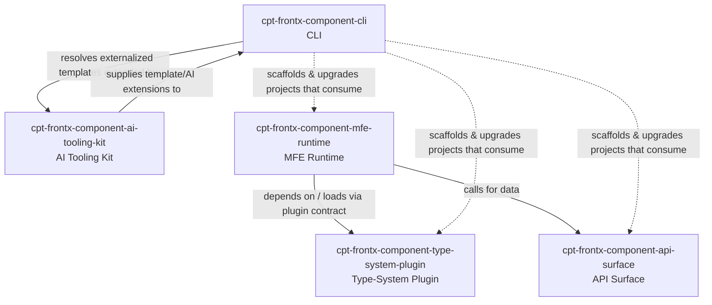

# Technical Design — FrontX Ecosystem

<!-- toc -->

- [1. Architecture Overview](#1-architecture-overview)
- [2. Principles & Constraints](#2-principles--constraints)
  - [2.1 Design Principles](#21-design-principles)
  - [2.2 Constraints](#22-constraints)
- [3. Technical Architecture](#3-technical-architecture)
  - [3.1 Domain Model](#31-domain-model)
  - [3.2 Component Model](#32-component-model)
  - [3.3 API Contracts](#33-api-contracts)
  - [3.4 Internal Dependencies](#34-internal-dependencies)
  - [3.5 External Dependencies](#35-external-dependencies)
  - [3.6 Interactions & Sequences](#36-interactions--sequences)
  - [3.7 Database schemas & tables](#37-database-schemas--tables)
  - [3.8 Deployment Topology](#38-deployment-topology)
- [4. Additional context](#4-additional-context)
- [5. Traceability](#5-traceability)

<!-- /toc -->

- [ ] `p3` - **ID**: `cpt-frontx-design-ecosystem`

> **DRAFT (partial).** This phase authors only §3.2 Component Model and §2.2 Constraints.
> All other sections are present as headings carrying an `INCOMPLETE:` marker and are
> authored in later phases (§1 + §2.1 in Phase 16; §3.1, §3.3–§3.8, §4, §5 in Phase 17).

## 1. Architecture Overview

INCOMPLETE: authored in Phase 16 (DESIGN Body 1 — Architecture Overview + Principles).

## 2. Principles & Constraints

### 2.1 Design Principles

INCOMPLETE: authored in Phase 16 (DESIGN Body 1 — Principles 2.1).

### 2.2 Constraints

The following nine constraints are the hard architecture boundaries of the FrontX
ecosystem. Each is a boundary rule that the design must satisfy and each links the
single ADR that establishes and justifies it. Constraint identifiers are defined here
under the Constraints heading; the anchor ADR files are authored in Phases 3–15.

#### MFE code carries no GTS schema literals

- [ ] `p2` - **ID**: `cpt-frontx-constraint-mfes-no-gts-literals`

MFE runtime and screenset code MUST NOT embed GTS schema literals. Schema knowledge
stays behind the type-system plugin's opaque-schema boundary, so the runtime never
encodes a concrete schema shape. (Boundary rule MFES-1.)

**ADRs**: `cpt-frontx-adr-core-package-boundaries`

#### MFE runtime exposes no solution-shared props

- [ ] `p2` - **ID**: `cpt-frontx-constraint-mfes-no-solution-shared-props`

The MFE runtime MUST NOT define or thread solution-specific shared props through its
core API. Solution coupling is kept out of the framework package; cross-MFE data flows
through contracts, not shared prop bags. (Boundary rule MFES-2.)

**ADRs**: `cpt-frontx-adr-core-package-boundaries`

#### Layout primitives hold no domain values

- [ ] `p2` - **ID**: `cpt-frontx-constraint-mfes-no-layout-domain-values`

MFE layout primitives MUST NOT hard-code domain values. Layout describes structure
only; domain data reaches the layout through contracts and the type-system plugin,
never as literals baked into layout code. (Boundary rule MFES-3.)

**ADRs**: `cpt-frontx-adr-core-package-boundaries`

#### MFE runtime does not depend on type formats

- [ ] `p2` - **ID**: `cpt-frontx-constraint-mfes-no-type-format-dep`

The MFE runtime MUST NOT depend on the concrete format of any type system. It interacts
with types only through the type-system plugin contract, which keeps the runtime
format-agnostic and the type system swappable. (Boundary rule MFES-4.)

**ADRs**: `cpt-frontx-adr-type-system-plugin-opaque-schema`

#### Schemas are opaque to the runtime

- [ ] `p2` - **ID**: `cpt-frontx-constraint-mfes-opaque-schema`

Schemas crossing the runtime boundary MUST remain opaque. The runtime treats a schema
as a handle to be validated and interpreted by the type-system plugin, never inspecting
or branching on its internal structure. (Boundary rule MFES-5.)

**ADRs**: `cpt-frontx-adr-type-system-plugin-opaque-schema`

#### GTS plugin owns infrastructure schemas

- [ ] `p2` - **ID**: `cpt-frontx-constraint-gts-plugin-owns-infra-schemas`

Infrastructure-level schemas MUST be owned by the GTS type-system plugin and MUST NOT be
duplicated in the runtime or in solution code. The plugin is the single source of truth
for these schemas. (Boundary rules GTS-PLUGIN-1 and GTS-PLUGIN-2.)

**ADRs**: `cpt-frontx-adr-gts-default-type-system`

#### API surface carries no solution content

- [ ] `p2` - **ID**: `cpt-frontx-constraint-api-no-solution-content`

The API surface MUST expose only protocol-level transport concerns. It MUST NOT embed
solution-specific content or domain logic; solution behaviour lives above the API
surface, never inside it. (Boundary rule API-1.)

**ADRs**: `cpt-frontx-adr-protocol-separated-api`

#### CLI has no compiled-in template dependency

- [ ] `p2` - **ID**: `cpt-frontx-constraint-cli-no-template-dep`

The CLI MUST NOT carry a build-time or runtime dependency on templates. Templates are
externalized and resolved dynamically, so the CLI binary stays independent of any
specific template set. (Boundary rule CLI-1.)

**ADRs**: `cpt-frontx-adr-template-externalization-resolution`

#### AI tooling kit uses the frontx namespace prefix

- [ ] `p2` - **ID**: `cpt-frontx-constraint-kit-frontx-prefix`

The AI tooling kit MUST be packaged as `cyber-pilot-kit-frontx` and its identifiers MUST
carry the `frontx` namespace prefix, keeping kit-provided resources unambiguously scoped
to this ecosystem. (Boundary rule KIT-1.)

**ADRs**: `cpt-frontx-adr-kit-packaging-cyber-pilot-kit-frontx`

## 3. Technical Architecture

### 3.1 Domain Model

INCOMPLETE: authored in Phase 17 (DESIGN Body 2 — Domain/Contracts/Deps/Sequences).

### 3.2 Component Model

The FrontX ecosystem is five components spanning three pillars: the Pillar-1 core
framework (MFE Runtime, Type-System Plugin, API Surface), the Pillar-2 CLI, and the
Pillar-3 AI Tooling Kit. Four components realize a PRD §7.1 interface; the API Surface
intentionally maps to no PRD interface (its rationale is below PRD altitude — see the
protocol-separated-API and shared-fetch-cache ADRs).

#### MFE Runtime

- [ ] `p2` - **ID**: `cpt-frontx-component-mfe-runtime`

##### Why this component exists

It is the runtime host of the micro-frontend system — the framework package
(`@cyberfabric/mfes`) that loads, isolates, and orchestrates MFEs and screensets so that
solutions are composed from independently deliverable units. It realizes the PRD
interface `cpt-frontx-interface-mfe-runtime`.

##### Responsibility scope

- Owns MFE/screenset loading, registration, mounting, and lifecycle orchestration.
- Hosts the type-system plugin and consumes type information only through the plugin
  contract.
- Coordinates inter-MFE communication and data access through contracts and the API
  Surface.

##### Responsibility boundaries

- Does NOT embed GTS schema literals or interpret schema internals; schemas remain
  opaque (`cpt-frontx-constraint-mfes-opaque-schema`,
  `cpt-frontx-constraint-mfes-no-gts-literals`).
- Does NOT depend on any concrete type-system format
  (`cpt-frontx-constraint-mfes-no-type-format-dep`).
- Does NOT expose solution-shared props or hard-code domain values in layout
  (`cpt-frontx-constraint-mfes-no-solution-shared-props`,
  `cpt-frontx-constraint-mfes-no-layout-domain-values`).
- Does NOT own type-system definitions (delegated to the Type-System Plugin) or
  transport protocols (delegated to the API Surface).

##### Related components (by ID)

- `cpt-frontx-component-type-system-plugin` — depends on (loads and delegates to it via the type-system plugin contract)
- `cpt-frontx-component-api-surface` — calls (fetches solution data through the protocol-separated API surface)

#### Type-System Plugin

- [ ] `p2` - **ID**: `cpt-frontx-component-type-system-plugin`

##### Why this component exists

It supplies the type system to the runtime as a swappable plugin (`@cyberfabric/gts-plugin`,
the default GTS implementation), so the runtime stays format-agnostic while a single
component owns schema validation and interpretation. It realizes the PRD interface
`cpt-frontx-interface-type-system`.

##### Responsibility scope

- Implements the type-system plugin contract consumed by the MFE Runtime.
- Owns infrastructure-level schemas and the validation/interpretation of opaque schema
  handles.
- Provides GTS as the default type system of the ecosystem.

##### Responsibility boundaries

- Does NOT reach into MFE Runtime internals; it is reached only through the plugin
  contract.
- Does NOT leak concrete schema formats across the runtime boundary
  (`cpt-frontx-constraint-mfes-opaque-schema`).
- Infrastructure schemas it owns MUST NOT be duplicated elsewhere
  (`cpt-frontx-constraint-gts-plugin-owns-infra-schemas`).

##### Related components (by ID)

- `cpt-frontx-component-mfe-runtime` — plugs into (registered with and invoked by the runtime through the type-system plugin contract)

#### API Surface

- [ ] `p2` - **ID**: `cpt-frontx-component-api-surface`

##### Why this component exists

It is the framework's data-access surface (`@cyberfabric/api`): a protocol-separated API
layer that gives the runtime and solutions a uniform way to fetch data while transport
concerns (REST, SSE, shared-fetch caching) stay encapsulated. It intentionally maps to
NO PRD §7.1 interface — its rationale sits below PRD altitude.

##### Responsibility scope

- Owns protocol-level transport (e.g. REST and SSE protocols) and the shared-fetch cache.
- Presents a stable data-access surface that callers use without knowing the underlying
  protocol.

##### Responsibility boundaries

- Does NOT embed solution-specific content or domain logic
  (`cpt-frontx-constraint-api-no-solution-content`).
- Does NOT own UI, MFE lifecycle, or type-system concerns; those belong to the MFE
  Runtime and the Type-System Plugin.

##### Related components (by ID)

- `cpt-frontx-component-mfe-runtime` — serves (provides protocol-separated data-fetching to the runtime)

#### CLI

- [ ] `p2` - **ID**: `cpt-frontx-component-cli`

##### Why this component exists

It is the developer entry point (`@cyberfabric/cli`, greenfield) that scaffolds and
upgrades projects built on the FrontX framework, resolving externalized templates so
teams start and evolve solutions consistently. It realizes the PRD interface
`cpt-frontx-interface-cli`.

##### Responsibility scope

- Scaffolds new projects and applies upgrades for solutions that consume the framework
  components.
- Resolves externalized templates dynamically, including template/AI extensions provided
  by the AI Tooling Kit.

##### Responsibility boundaries

- Does NOT carry a compiled-in template dependency; templates are externalized and
  resolved at runtime (`cpt-frontx-constraint-cli-no-template-dep`).
- Does NOT participate in the MFE runtime, type system, or API transport at solution
  runtime; it operates at scaffold/upgrade time.

##### Related components (by ID)

- `cpt-frontx-component-mfe-runtime` — scaffolds for (generates and upgrades projects that consume the runtime)
- `cpt-frontx-component-type-system-plugin` — scaffolds for (generates and upgrades projects that consume the type system)
- `cpt-frontx-component-api-surface` — scaffolds for (generates and upgrades projects that consume the API surface)
- `cpt-frontx-component-ai-tooling-kit` — consumes (resolves externalized templates and AI extensions supplied by the kit)

#### AI Tooling Kit

- [ ] `p2` - **ID**: `cpt-frontx-component-ai-tooling-kit`

##### Why this component exists

It packages the AI authoring tooling for the ecosystem as `cyber-pilot-kit-frontx`
(greenfield), guiding AI-assisted creation and upgrade of FrontX artifacts and supplying
template/AI extensions the CLI resolves. It realizes the PRD interface
`cpt-frontx-interface-ai-tooling-framework`.

##### Responsibility scope

- Provides AI tooling content (templates, extension contracts, guidance) for authoring
  artifacts that target the framework and CLI.
- Delivers template/AI extensions that the CLI discovers and activates.

##### Responsibility boundaries

- Does NOT execute as part of the solution runtime; it is authoring-/scaffold-time
  tooling consumed through the CLI.
- MUST be packaged under the `frontx` namespace prefix
  (`cpt-frontx-constraint-kit-frontx-prefix`).

##### Related components (by ID)

- `cpt-frontx-component-cli` — extends (supplies template and AI extensions the CLI resolves and activates)

### 3.3 API Contracts

INCOMPLETE: authored in Phase 17 (DESIGN Body 2 — Domain/Contracts/Deps/Sequences).

### 3.4 Internal Dependencies

INCOMPLETE: authored in Phase 17 (DESIGN Body 2 — Domain/Contracts/Deps/Sequences).

### 3.5 External Dependencies

INCOMPLETE: authored in Phase 17 (DESIGN Body 2 — Domain/Contracts/Deps/Sequences).

### 3.6 Interactions & Sequences

INCOMPLETE: authored in Phase 17 (DESIGN Body 2 — Domain/Contracts/Deps/Sequences).

### 3.7 Database schemas & tables

INCOMPLETE: authored in Phase 17 (DESIGN Body 2 — Domain/Contracts/Deps/Sequences).

### 3.8 Deployment Topology

INCOMPLETE: authored in Phase 17 (DESIGN Body 2 — Domain/Contracts/Deps/Sequences).

## 4. Additional context

INCOMPLETE: authored in Phase 17 (DESIGN Body 2).

## 5. Traceability

INCOMPLETE: authored in Phase 17 (DESIGN Body 2).
