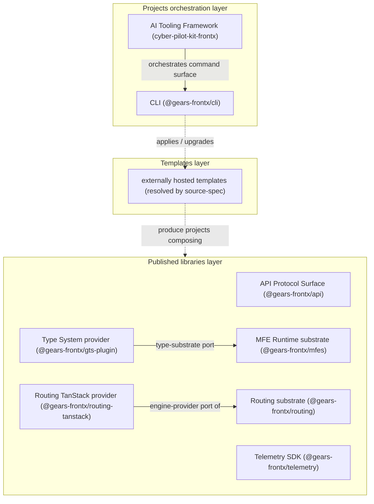
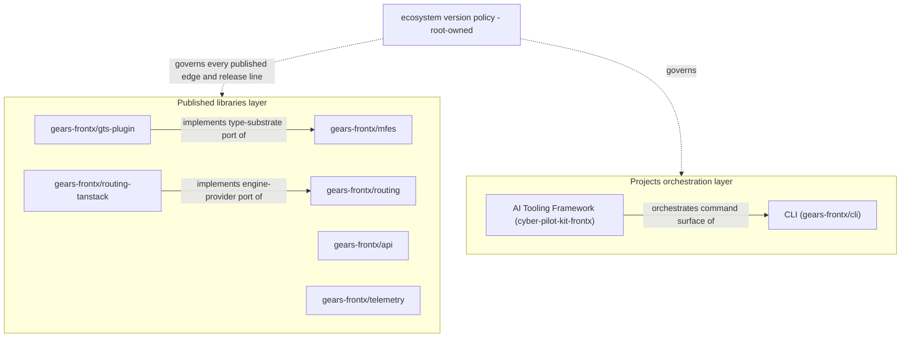
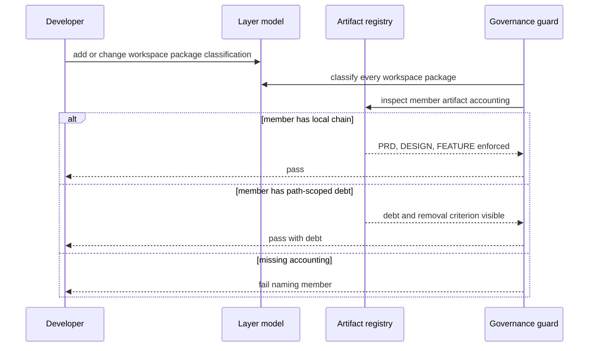

# Technical Design - FrontX Ecosystem

<!-- toc -->

- [1. Architecture Overview](#1-architecture-overview)
  - [1.1 Architectural Vision](#11-architectural-vision)
  - [1.2 Architecture Drivers](#12-architecture-drivers)
  - [1.3 Architecture Layers](#13-architecture-layers)
  - [1.4 Ownership Matrix](#14-ownership-matrix)
  - [1.5 Artifact Chain Policy](#15-artifact-chain-policy)
- [2. Principles & Constraints](#2-principles--constraints)
  - [2.1 Design Principles](#21-design-principles)
  - [2.2 Constraints](#22-constraints)
- [3. Technical Architecture](#3-technical-architecture)
  - [3.1 Domain Model](#31-domain-model)
  - [3.2 Component Model](#32-component-model)
  - [3.3 API Contracts](#33-api-contracts)
  - [3.4 Internal Dependencies](#34-internal-dependencies)
  - [3.5 External Dependencies](#35-external-dependencies)
  - [3.6 Interactions & Sequences](#36-interactions--sequences)
  - [3.7 Database schemas & tables](#37-database-schemas--tables)
  - [3.8 Deployment Topology](#38-deployment-topology)
- [4. Additional context](#4-additional-context)
  - [Technology stack alignment](#technology-stack-alignment)
  - [Capacity and NFR thresholds](#capacity-and-nfr-thresholds)
  - [Non-applicable checklist categories](#non-applicable-checklist-categories)
  - [Member Pointers](#member-pointers)
- [5. Traceability](#5-traceability)

<!-- /toc -->

- [ ] `p3` - **ID**: `cpt-frontx-design-ecosystem`

## 1. Architecture Overview

### 1.1 Architectural Vision

The FrontX ecosystem is delivered as a set of independently published, independently versioned artifacts, each owning a single concern and integrating with the others only through narrow, explicit contracts. These artifacts are partitioned into three **layers**, each defined by the role its members fill rather than by which packages currently fill it: **published libraries** — units consumed as versioned dependencies; **templates** — units applied to produce or extend a project, delivering content the receiving project then owns, hosted outside this repository and resolved by versioned source-spec; and **projects orchestration** — units that act on a project's lifecycle across the other two layers, from first scaffold through upgrade, including the AI tooling that delivers ecosystem fluency to agents. The partition, each layer's membership property, and the federated ownership of the artifacts describing members are defined in §1.3; the current members are located through the member pointers in §4. Per-concern independent versioning lets each artifact evolve on its own semver line and cadence while consuming applications upgrade on theirs rather than in lockstep; the one compile-time coupling edge inside the published-libraries layer — the runtime's dependency on its default type-system provider — is bounded by a satisfiable semver range rather than a matched version number (`cpt-frontx-fr-versioned-platform-evolution`, `cpt-frontx-nfr-evolvability`).

The technical approach keeps the core agnostic. The runtime works with microfrontends, type identifiers, and extension domains only through injected ports and opaque identifiers; it never depends on a concrete format or solution vocabulary. An application therefore composes against the same stable surface no matter which UI framework, type-definition specification, or layout vocabulary it chooses (`cpt-frontx-fr-ui-framework-agnostic`; registration and admission are owned by the [runtime's PRD and DESIGN](../packages/mfes/architecture/DESIGN.md)). The runtime admits units only after type validation, places them into governed extension domains, mediates host-microfrontend communication through a narrow capability bridge, and isolates loaded units — a default-deny posture whose requirements the runtime's own PRD states. The CLI resolves templates by versioned source-spec at runtime and bundles none, keeping the command surface fully decoupled from the content it scaffolds and applying project upgrades as reviewable, non-destructive change sets ([CLI's PRD and DESIGN](../packages/cli/architecture/DESIGN.md)). The AI Tooling Framework ships only base ecosystem capabilities and gains template-specific expertise through bundled extensions discovered and activated automatically ([kit's PRD and DESIGN](../packages/cyber-pilot-kit-frontx/architecture/DESIGN.md)).

The system context is a composed FrontX application running in the browser, whose host loads independently developed microfrontends at runtime. External boundaries are: the consuming application and any microfrontends it composes (both depend on the published libraries; the UI framework is decided by the applied template, and a template may deliver a project with no microfrontends), a GitHub-hosted source registry and an npm package registry that distribute templates and packages, the back-end services that microfrontends call through the API Protocol Surface, and the AI Tooling CLI environment that installs and activates the AI Tooling kit. Within these boundaries the architecture satisfies the PRD by allocating each capability to exactly one owning artifact and placing no architectural ceiling on the microfrontends or type definitions an application integrates (`cpt-frontx-fr-no-architectural-ceiling`, `cpt-frontx-nfr-scalability-ceiling`).

### 1.2 Architecture Drivers

Requirements that significantly influence architecture decisions. Each driver below maps a PRD requirement to the design response that addresses it, citing the requirement by ID; requirement text is owned by the PRD and is not restated here. The Architecture Decision Records subsection records the decisions these drivers rest on.

#### Functional Drivers

Only the layer-level requirements drive this document. Each member's functional drivers are mapped in that member's DESIGN §1.2, against the requirements its own PRD owns.

| Requirement | Design Response |
|-------------|-----------------|
| `cpt-frontx-fr-ui-framework-agnostic` | Core-package boundaries keep the runtime free of UI-framework coupling, leaving UI-stack choice to applications and microfrontends (`cpt-frontx-adr-core-package-boundaries`). |
| `cpt-frontx-fr-versioned-platform-evolution` | The per-concern independent artifact-distribution policy isolates breaking changes behind semantic versioning, bounding each breaking change to a single artifact's own major-version line (`cpt-frontx-adr-artifact-versioning-and-distribution`). |
| `cpt-frontx-fr-no-architectural-ceiling` | The same distribution and boundary policy imposes no architectural cap on integrated units, governing growth by performance thresholds rather than structure (`cpt-frontx-adr-artifact-versioning-and-distribution`). |
| `cpt-frontx-fr-layer-member-governance` | Root governance machinery classifies workspace packages into the layer model and gates each member's artifact-chain registration (root FEATURE [ecosystem-governance](./features/ecosystem-governance/FEATURE.md)). |

#### NFR Allocation

This table maps non-functional requirements from the PRD to specific design/architecture responses, demonstrating how quality attributes are realized.

| NFR ID | NFR Summary | Allocated To | Design Response | Verification Approach |
|--------|-------------|--------------|-----------------|-----------------------|
| `cpt-frontx-nfr-evolvability` | Versioned releases without lockstep upgrades | Per-concern independent versioning across all artifacts | Independently published, per-concern versioned artifacts, each on its own semver line and cadence; a breaking change is bounded to that artifact's own major version, and cross-artifact compatibility on the single coupled edge (`mfes → gts-plugin`) is expressed as a satisfiable semver range rather than a matched version number (`cpt-frontx-adr-artifact-versioning-and-distribution`). | Per-artifact semver discipline; a compatibility check asserting the `mfes → gts-plugin` range is satisfiable and not exact-pinned (no duplicate-runtime skew); a registry-side deprecation cycle (published notice + minimum window) before any removal. |
| `cpt-frontx-nfr-scalability-ceiling` | No architectural cap on integrated units | Per-concern independent versioning; runtime boundaries | The distribution and boundary architecture imposes no structural ceiling, so integration scales to the PRD operational floors governed only by performance thresholds (`cpt-frontx-adr-artifact-versioning-and-distribution`). | Load test registering the PRD operational floors of microfrontends and type definitions against one application without architectural failure. |
| `cpt-frontx-nfr-evolvability` | Versioned releases without lockstep upgrades | The CLI's change-set & upgrade engine, owned by the [CLI's member DESIGN](../packages/cli/architecture/DESIGN.md) | The single authoritative change-set engine applies a template-version transition as a reviewed, approvable, non-destructive and reversible change set computed against that applied template's own provenance record, so each applied template in a repository adopts a newer version on its own cadence without a forced, destructive rewrite; the reviewed change equals the applied change (`cpt-frontx-adr-project-upgrade-mechanism`, `cpt-frontx-adr-cli-internal-decomposition`). | End-to-end upgrade test asserting the applied file set equals the approved change set, that a declined upgrade writes nothing, and that an applied upgrade is reversible. |
| `cpt-frontx-nfr-evolvability` | Versioned releases without lockstep upgrades | The AI Tooling Framework's base kit and extension host, owned by the [kit's member DESIGN](../packages/cyber-pilot-kit-frontx/architecture/DESIGN.md) | Template-sourced expertise plus automatic discovery-and-activation lets each template's AI capabilities evolve and ship on the template's own line while the base kit stays solution-agnostic, so agent capability tracks installed-template versions rather than a lockstep framework release (`cpt-frontx-adr-solution-ai-content-placement`, `cpt-frontx-adr-extension-discovery-activation`, `cpt-frontx-adr-ai-tooling-internal-decomposition`). | Discovery test asserting a newly installed template version activates its bundled extension without a base-kit release, and that removing the template deactivates only its extension. |

#### Architecture Decision Records

The ecosystem's architecture is shaped by the following decision records, grouped by the concern each one governs. Each record documents one decision in full; this subsection lists the inventory by ID and one-line intent.

Foundational:

* `cpt-frontx-adr-artifact-versioning-and-distribution` — Distributes the ecosystem as independently published, per-concern, independently versioned artifacts.
* `cpt-frontx-adr-core-package-boundaries` — Partitions the published libraries into boundary-governed concerns (runtime, type-system provider, protocol surface).
* `cpt-frontx-adr-contract-schema-ownership` — Ends the circular DESIGN↔ADR schema deferral by assigning each owned contract's role to DESIGN, its decision rationale to the ADR, and its concrete field-level schema to the owning FEATURE.
* `cpt-frontx-adr-template-territory-traceability` — Fixes this artifact tree's subject as the ecosystem's own artifacts, leaves template payload unspecified by it, and declares the `@cpt-` markers surviving in template territory to be non-authoritative residue removed as files are touched.

Published libraries:

* `cpt-frontx-adr-mfe-runtime-public-surface` — Exposes microfrontend registration and loading through an abstract registry facade.
* `cpt-frontx-adr-runtime-type-system-coupling` — Keeps the runtime's schema surface opaque, with format-specific shape behind the type-system plugin.
* `cpt-frontx-adr-default-type-substrate-provider` — Supplies the ecosystem's default type system as an injectable provider of the runtime's type-substrate port.
* `cpt-frontx-adr-mfe-handler-resolution` — Abstracts the microfrontend handler and resolves it through the registry.
* `cpt-frontx-adr-action-dispatch-and-chaining` — Routes host–microfrontend communication through an actions-chains mediator.
* `cpt-frontx-adr-child-mfe-host-access` — Defines a narrow parent–child capability bridge between host and microfrontend.
* `cpt-frontx-adr-extension-domain-occupancy` — Governs extension-domain occupancy through mount strategies and cardinality rules.
* `cpt-frontx-adr-domain-extension-compatibility` — Admits extensions into domains by contract matching.
* `cpt-frontx-adr-mfe-load-isolation` — Isolates loaded microfrontends at runtime.
* `cpt-frontx-adr-lazy-import-resolution` — Separates the runtime ABI from the template-bound build through lazy import.
* `cpt-frontx-adr-mfe-asset-discovery` — Discovers microfrontends through their manifest contract.
* `cpt-frontx-adr-api-surface-organization` — Separates request/response and streaming behind a common protocol surface.
* `cpt-frontx-adr-api-transport-bypass-and-fetch-sharing` — Provides a plugin short-circuit and a realm-shared fetch cache.

CLI (projects orchestration):

* `cpt-frontx-adr-template-acquisition-and-location` — Externalizes templates and resolves them by source-spec at runtime.
* `cpt-frontx-adr-source-spec-syntax` — Defines the versioned source-spec syntax for template acquisition, including the optional subtree segment that lets one repository publish several addressable templates.
* `cpt-frontx-adr-uniform-template-mechanism` — Establishes one uniform mechanism that operates over any template, each template declaring what it produces.
* `cpt-frontx-adr-template-manifest-contract` — Defines the template manifest publication contract declaring identity, version, ownership boundaries, and referenced templates.
* `cpt-frontx-adr-template-ownership-boundary-declaration` — Defines the two-tier ownership-boundary declaration (exclusive subtrees plus shared-file region ownership with a declared merge) - owned by the CLI member tree, `packages/cli/architecture/ADR/`.
* `cpt-frontx-adr-assembly-conflict-prevention` — Detects and refuses conflicting assembly before any write via a pre-flight intersection check and a post-materialization boundary-honesty guard.
* `cpt-frontx-adr-composed-template-resolution` — Assembles a repository from one or more templates and resolves a preset's referenced templates transitively in one operation.
* `cpt-frontx-adr-project-provenance-record` — Records provenance per applied template, one record per applied template with no single whole-repository origin.
* `cpt-frontx-adr-project-upgrade-mechanism` — Upgrades each applied template independently as a reviewable, non-destructive change set.
* `cpt-frontx-adr-cli-internal-decomposition` — Decomposes the single `@gears-frontx/cli` package into internal template-resolver, pre-publish-validator, assembler, conflict-checker, provenance-recorder, and change-set-&-upgrade-engine components.

AI Tooling (projects orchestration):

* `cpt-frontx-adr-ai-tooling-framework-packaging` — Packages base AI capabilities as a Constructor Studio kit with prefixed resource identifiers; the same kit mechanism is independently adopted by `@gears-frontx/ui-kit` for its own package-scoped skill and rule resources.
* `cpt-frontx-adr-template-ai-extension-contract` — Defines the extension contract a template's AI bundle conforms to.
* `cpt-frontx-adr-extension-discovery-activation` — Discovers and activates installed-template AI extensions without manual wiring.
* `cpt-frontx-adr-solution-ai-content-placement` — Separates base ecosystem AI content from solution-specific content.
* `cpt-frontx-adr-ai-driven-upgrade-orchestration` — Orchestrates AI-driven template upgrades over the CLI change-set engine.
* `cpt-frontx-adr-ai-tooling-internal-decomposition` — Decomposes the single `cyber-pilot-kit-frontx` package into internal base-kit, extension-host, and upgrade-orchestration components.

### 1.3 Architecture Layers

The ecosystem is partitioned into three layers — **published libraries**, **templates**, and **projects orchestration** — and the word *layer* names this partition and no other grouping of the same system. Ordinary technical usage that names no partition of this system — a transport layer, a persistence layer, a layer of indirection — is unaffected by that reservation. The delivered set at any moment is a repository-derived fact, not an architectural statement: the durable architecture is the layer partition and its membership properties, not a member count or roster. The current members are located through the member pointers in §4.

**Membership is a property, not a list.** A candidate belongs to a layer if it satisfies that layer's stated property; where a mechanical check derives a concrete list of current members, that list is a derived artifact of the check and never the authoritative statement of membership. This is what admits members this repository does not own: the architecture states the role and the contract, and does not hold the member's artifacts. The three properties:

* **Published libraries** — a unit is a member if it is published for independent consumption under its own version, and its consumers integrate it by declaring a dependency on it. A member of this layer is consumed as a dependency; it is not copied, and it does not drive a project's lifecycle.
* **Templates** — a unit is a member if it is applied to produce or extend a project, delivering content the receiving project then owns. A member of this layer is copied rather than depended upon, and what it claims is declared in its manifest (`cpt-frontx-adr-template-manifest-contract`).
* **Projects orchestration** — a unit is a member if it acts on a project's lifecycle across the other two layers: creating, assembling, upgrading, or reasoning about a project rather than being part of the artifact a project ships.

A candidate satisfying more than one of these is a defect in the candidate, not an ambiguity in the partition: the three roles are how a unit reaches a consumer, and a unit that both ships as a dependency and is copied as content should be split.

**Within published libraries, two independent properties.** A library is **core** if it must remain UI-framework-agnostic; a library is **standalone** if it declares no intra-ecosystem package dependency, with the single exception of the type-substrate port. A library may hold either, both, or neither. Keeping them separate lets the agnostic-substrate guarantee (`cpt-frontx-principle-agnostic-core`, `cpt-frontx-fr-ui-framework-agnostic`) apply to a library that legitimately depends on another library, and permits a member bound to a concrete UI framework or engine to still be a full layer member that is simply not core.

These are general properties every member is checked against; which current members hold them is illustration, not part of either definition. The `mfes` runtime depends on `@gears-frontx/gts-plugin` through the type-substrate port — the one edge the standalone definition's stated exception covers (`cpt-frontx-adr-runtime-type-system-coupling`) — so it holds both properties. The navigation substrate (`@gears-frontx/routing`) is core and standalone at once: it declares no intra-ecosystem package dependency, and it carries no dependency on any UI framework or router engine — every such dependency is confined to a separate published member. That member, `@gears-frontx/routing-tanstack`, is the one that is not core, and also not standalone: it is bound to a concrete UI framework and a concrete routing engine, so it fails the core property, and it depends on `@gears-frontx/routing`, so it fails the standalone property too — a member can fail both properties at once, which is exactly why the two are kept independent rather than collapsed into a single "not core" label.

**Two categories outside the layers, both stated positively.** **Build internals** are packages that exist only to configure the build, are never published, and belong to no layer; they remain subject to the dependency-edge guard and are exempt from the member artifact chain and the publication gate. **Non-package code** — repository scripts and in-package demonstrations — has no package identity to carry layer membership; it remains scanned for traceability and holds no layer membership. Both are exemptions with a stated scope, not ignores.

**Federated artifact ownership.** The root artifacts own the orchestration of the ecosystem and the contracts between layers — this document, the [PRD](./PRD.md), and the [DECOMPOSITION](./DECOMPOSITION.md) hold layer-level content only. The root also owns the FEATUREs for ecosystem-level behaviour no member may own — the distribution policy and the partition's own governance machinery — in its `architecture/features/` tree. Each member owns the artifacts describing itself, in its package's `architecture/` tree: a PRD explaining its own requirements, a DESIGN, and at least one FEATURE — always all three; never a DECOMPOSITION. The root PRD describes the 3-layer approach and keeps only the requirements that bind every member equally. The feature-entry identifier kind belongs to a DECOMPOSITION, so a member's FEATURE gets its identity from its feature-status identifier alone. A FEATURE authored after the federation defines no feature-entry identifier; the FEATUREs that moved during it still cite their root DECOMPOSITION entries, an upward citation that is allowed. A member's artifacts may cite root requirement and design identifiers; the root PRD and DESIGN do not cite a member's `cpt-` identifiers, which would recouple the root to its members (see LAYER-3 in §2.2 for the one recorded exception, the DECOMPOSITION's work-package index). Admission of a member the architecture does not own is deliberately not decided here: an external candidate must be classifiable and its layer's contract checkable against it, but the mechanism is a separate decision, so total classification binds only members inside this repository and an external member's compliance rests on review.

**Identifier namespace.** FrontX is a top-level system in the artifacts registry and its identifiers carry the *cpt-frontx-* prefix with no parent segment. Reparenting under a Constructor Fabric parent tree would rewrite every identifier occurrence — thousands of them, most being traceability markers in source — and the validator makes a partial rename fail, so the rename is all-or-nothing; nothing today needs it, and the cost is accepted as a one-time full rename if a parent tree ever appears and must resolve FrontX identifiers. The cost grows with every member tree added in the meantime, which is recorded here so the position does not silently become "reparent later". Moved member identifiers likewise never rename: the elements that moved from this document into member DESIGNs kept their identifiers, so citations and code markers resolve unchanged.

```mermaid
graph TD
    subgraph Orch[Projects orchestration layer]
        KIT["AI Tooling Framework (cyber-pilot-kit-frontx)"]
        CLI["CLI (@gears-frontx/cli)"]
    end
    subgraph Libs[Published libraries layer]
        API["API Protocol Surface (@gears-frontx/api)"]
        GTS["Type System provider (@gears-frontx/gts-plugin)"]
        MFES["MFE Runtime substrate (@gears-frontx/mfes)"]
        TEL["Telemetry SDK (@gears-frontx/telemetry)"]
        ROUTING["Routing substrate (@gears-frontx/routing)"]
        ROUTINGTS["Routing TanStack provider (@gears-frontx/routing-tanstack)"]
    end
    subgraph Tmpl[Templates layer]
        T["externally hosted templates (resolved by source-spec)"]
    end
    KIT -- "orchestrates command surface" --> CLI
    GTS -- "type-substrate port" --> MFES
    ROUTINGTS -- "engine-provider port of" --> ROUTING
    CLI -. "applies / upgrades" .-> T
    T -. "produce projects composing" .-> Libs
```

- [ ] `p3` - **ID**: `cpt-frontx-tech-ecosystem-stack`

| Layer | Responsibility | Technology |
|-------|---------------|------------|
| Published libraries | Runtime substrate, type-system provider, protocol surface, telemetry, a navigation substrate with a pluggable routing-engine-provider port, and its default routing-engine provider — consumed as versioned dependencies; the core subset stays UI-framework- and type-format-agnostic | TypeScript npm packages; module-federation runtime with lazy import (`@gears-frontx/mfes`); concrete type-definition specification confined to `@gears-frontx/gts-plugin`; transport as a peer dependency of `@gears-frontx/api`; navigation substrate declaring an engine-provider port with no concrete engine dependency of its own (`@gears-frontx/routing`); concrete routing-engine dependency confined to its default provider (`@gears-frontx/routing-tanstack`) |
| Templates | Producing and extending project content the receiving project owns | Externally hosted template repositories resolved by versioned source-spec; manifest publication contract |
| Projects orchestration | Template and repository lifecycle (install, apply, assemble, upgrade) and AI-agent orchestration over it | Node.js CLI (`@gears-frontx/cli`); Constructor Studio kit (`cyber-pilot-kit-frontx`); GitHub source registry; npm package registry |
| Outside the layers | Build internals (never published) and non-package repository code | Private `@gears-frontx/*` configuration packages; `scripts/` tooling |

Applications and microfrontends composed on top of the published libraries choose their UI technology freely — any UI framework (React, Vue, Svelte, vanilla JavaScript) over TypeScript; the platform constrains none of that choice. Each layer's technology choices align with the boundary constraints owned by the member DESIGNs and the NFRs: the runtime substrate stays UI-framework- and type-format-agnostic (MFES-1..MFES-5, owned by the [runtime's member DESIGN](../packages/mfes/architecture/DESIGN.md)) so it supports any UI stack, and the type-system provider is the only core library permitted a concrete type-definition specification (GTS-PLUGIN-1 and GTS-PLUGIN-2, owned by the [plugin's member DESIGN](../packages/gts-plugin/architecture/DESIGN.md)).

### 1.4 Ownership Matrix

| Artifact location | Owns | Does not own |
|-------------------|------|--------------|
| Root PRD | Layer intent, shared actors, universal requirements, package-registry distribution, governance intent. | Member requirements, member APIs, member behavior, member algorithms. |
| Root DESIGN | Layer structure, membership rules, cross-layer contracts, root governance, root-owned policy components. | Member component models, internal flows, package-specific dependency rules. |
| Root DECOMPOSITION | Root-owned work packages and temporary compatibility anchors required by the installed SDLC kit. | Member feature detail, member requirements, member flows or member acceptance evidence. |
| Root FEATUREs | Ecosystem distribution and layer-partition governance. | Member implementation behavior. |
| Member artifacts | The member's PRD, DESIGN and FEATURE behavior. | Root layer model and ecosystem-wide governance. |

### 1.5 Artifact Chain Policy

Each FrontX-owned member must own a local PRD, DESIGN and at least one FEATURE. Members do not own a DECOMPOSITION in the approved federation model.

The installed SDLC kit currently requires member feature identifiers to remain visible as root DECOMPOSITION compatibility anchors. Those anchors are limited to ID and owner pointer; member behavior remains owned by member FEATURE files.

## 2. Principles & Constraints

### 2.1 Design Principles

#### Federated ownership

- [ ] `p2` - **ID**: `cpt-frontx-principle-federated-artifacts`

Each member owns the artifacts that describe its own behavior. Root artifacts stay at layer altitude and avoid becoming a central index of member requirements or feature work.

#### Per-concern independent versioning

- [x] `p2` - **ID**: `cpt-frontx-principle-per-concern-versioning`

Each published concern evolves on its own version line. Compatibility is expressed through semantic-versioning commitments and explicit dependency ranges, not by forcing all members to release together.

#### Property-based membership

- [ ] `p2` - **ID**: `cpt-frontx-principle-property-based-membership`

Layer membership follows the role a unit plays. A member is not omitted from the architecture just because its artifact chain is deferred.

### 2.2 Constraints

#### LAYER-1 - Total classification of ecosystem candidates

- [x] `p2` - **ID**: `cpt-frontx-constraint-layer-total-classification`

Every FrontX-owned workspace package resolves to exactly one layer or to an explicit non-layer category. An unclassified workspace package fails governance instead of being skipped.

The template-manifest half of total classification remains review-held because this repository does not own external template artifacts. Packages inside the content a template delivers are not candidates: on application they become content the receiving project owns, and the template delivering them is the candidate that answers for them.

#### LAYER-2 - Member artifact chain

- [x] `p2` - **ID**: `cpt-frontx-constraint-member-artifact-chain`

Every FrontX-owned layer member owns a local artifact chain: PRD, DESIGN and at least one FEATURE. A missing chain must be recorded as path-scoped architecture debt with a removal criterion.

The current `ui-kit` ignore is accepted only as recorded debt. It is not proof that `ui-kit` has a complete artifact chain.

#### LAYER-3 - Root-to-member citation direction

- [x] `p2` - **ID**: `cpt-frontx-constraint-root-cites-no-member`

Root PRD and DESIGN point readers to member artifact files by path and package name, but they do not use member-owned `cpt-` identifiers as trace targets. Member artifacts may cite root requirements and constraints when they implement cross-layer contracts. Human-readable labels such as MFES-1 or CLI-7 are not identifiers under this constraint: the root may name them to point a reader at a member-owned rule, and must name the owning member DESIGN next to them.

This constraint is review-held. The validator cannot fully scope citation direction across registered systems.

#### LAYER-4 - Temporary feature-entry compatibility anchors

- [ ] `p2` - **ID**: `cpt-frontx-constraint-validator-warning-debt`

The installed SDLC kit requires feature-entry definitions in root DECOMPOSITION and routes DESIGN coverage through DECOMPOSITION. Root DECOMPOSITION may therefore carry compatibility anchors limited to feature IDs, owner pointers and compact ID-only component/constraint/principle coverage references, with no member purpose, scope, prose, flows, dependencies, algorithms, acceptance criteria or design decisions. Removal criterion: upstream or project-installed SDLC kit supports member-scoped DECOMPOSITION coverage and member-owned FEATURE identity.

## 3. Technical Architecture

### 3.1 Domain Model

| Entity | Description | Owner |
|--------|-------------|-------|
| Layer | A role in the ecosystem: published library, template, or projects orchestration. | Root |
| Member | A FrontX-owned unit classified into one layer. | Root for classification; member for behavior |
| Artifact chain | A member PRD, DESIGN and FEATURE set. | Member |
| Package registry publication | A versioned package release consumed by projects. | Root contract; member release |
| Template | A source-hosted generator of project content. | External template artifacts; CLI contract |
| Project | A receiving repository assembled and maintained by developers. | Consuming project |

### 3.2 Component Model

The ecosystem is composed of independently published, independently versioned artifacts partitioned into the three layers of §1.3. Under federated artifact ownership each member's component model is owned by its member DESIGN: the [MFE Runtime](../packages/mfes/architecture/DESIGN.md), the [Type System plugin](../packages/gts-plugin/architecture/DESIGN.md), the [API Protocol Surface](../packages/api/architecture/DESIGN.md), the [Telemetry SDK](../packages/telemetry/architecture/DESIGN.md), the [Routing substrate](../packages/routing/architecture/DESIGN.md), and the [Routing TanStack provider](../packages/routing-tanstack/architecture/DESIGN.md) in the published-libraries layer; the [CLI](../packages/cli/architecture/DESIGN.md) and the [AI Tooling Framework](../packages/cyber-pilot-kit-frontx/architecture/DESIGN.md) in the projects-orchestration layer. Templates are hosted outside this repository and own their artifacts there. What this section holds are the two components the root itself owns — the cross-member distribution and version policy, and the ecosystem governance guard — which belong to no single member because they bind the edges and the membership rules between members.

```mermaid
graph TD
    subgraph Orch[Projects orchestration layer]
        CLI["CLI (gears-frontx/cli)"]
        KIT["AI Tooling Framework (cyber-pilot-kit-frontx)"]
    end
    subgraph Libs[Published libraries layer]
        MFES[gears-frontx/mfes]
        GTS[gears-frontx/gts-plugin]
        API[gears-frontx/api]
        TEL[gears-frontx/telemetry]
        ROUTING[gears-frontx/routing]
        ROUTINGTS[gears-frontx/routing-tanstack]
    end
    POL[ecosystem version policy - root-owned]
    GTS -- "implements type-substrate port of" --> MFES
    ROUTINGTS -- "implements engine-provider port of" --> ROUTING
    KIT -- "orchestrates command surface of" --> CLI
    POL -. "governs every published edge and release line" .-> Libs
    POL -. "governs" .-> Orch
```

#### Ecosystem Version Policy

- [x] `p2` - **ID**: `cpt-frontx-component-ecosystem-version-policy`

##### Why this component exists

Owns versioning and compatibility rules that bind published members. It governs release-line independence, allowed dependency edges and deprecation discipline.

##### Responsibility scope

- Define release-line and compatibility expectations for published members.
- Keep cross-member dependency policy explicit.
- Support deprecation discipline before removals.

##### Responsibility boundaries

- Does not define member APIs or member internals.
- Does not own template resolution or project mutation behavior.

##### Related components (by ID)

- None.

#### Ecosystem Governance Guard

- [x] `p2` - **ID**: `cpt-frontx-component-ecosystem-governance-guard`

##### Why this component exists

Owns checks that classify workspace packages and account for member artifact chains. The guard may accept a path-scoped ignore as debt, but only when the debt and its removal criterion are visible to owners.

##### Responsibility scope

- Classify every FrontX-owned workspace package.
- Check member artifact registration or path-scoped debt.
- Fail CI-visible checks when classification or artifact accounting is missing.

##### Responsibility boundaries

- Does not validate member behavior.
- Does not enforce cross-system citation direction beyond the review-held constraint.

##### Related components (by ID)

- `cpt-frontx-component-ecosystem-version-policy` - sibling root component; it owns release policy, not member accounting.

### 3.3 API Contracts

#### Package-registry distribution

- [ ] `p2` - **ID**: `cpt-frontx-interface-package-registry-distribution`

FrontX packages are published to and installed from an npm-compatible package registry. Compatibility follows the root versioned-evolution requirement and member release policy.

Member public APIs are not repeated here. They are owned by each member's PRD and DESIGN.

### 3.4 Internal Dependencies

The root design records only cross-member dependency policy:

- Members integrate through public contracts, not through sibling internals.
- Compile-time package edges must be explicitly allowed by the boundary model.
- Projects orchestration may operate on project files or command surfaces without creating a package dependency.
- Build internals are allowed only for build-time support and remain outside the member artifact chain.

### 3.5 External Dependencies

| Dependency | Purpose | Root responsibility |
|------------|---------|---------------------|
| Package registry | Publishes and installs versioned packages. | Distribution contract and compatibility expectations. |
| GitHub source registry | Hosts source references used by templates and tooling. | Layer-level dependency statement only. |
| AI agent host | Runs agents that consume project-visible resources. | Actor and boundary statement only. |

### 3.6 Interactions & Sequences

#### Member admission and artifact accounting

- [ ] `p2` - **ID**: `cpt-frontx-seq-member-admission-accounting`

**Use cases**: `cpt-frontx-usecase-classify-new-member`

**Actors**: `cpt-frontx-actor-project-developer`

```mermaid
sequenceDiagram
    participant Dev as Developer
    participant Model as Layer model
    participant Registry as Artifact registry
    participant Guard as Governance guard
    Dev->>Model: add or change workspace package classification
    Guard->>Model: classify every workspace package
    Guard->>Registry: inspect member artifact accounting
    alt member has local chain
        Registry-->>Guard: PRD, DESIGN, FEATURE enforced
        Guard-->>Dev: pass
    else member has path-scoped debt
        Registry-->>Guard: debt and removal criterion visible
        Guard-->>Dev: pass with debt
    else missing accounting
        Guard-->>Dev: fail naming member
    end
```

**Description**: A new or changed workspace package must be classified and accounted for. A debt ignore may keep the repository moving, but it remains visible and removable.

### 3.7 Database schemas & tables

Not applicable. The root ecosystem design owns no runtime database or data store.

### 3.8 Deployment Topology

The root ecosystem owns no server topology. Published packages are distributed through a package registry, templates are hosted through source references, and projects run in their own deployment environments.

## 4. Additional context

### Technology stack alignment

The technology stack per layer is recorded in §1.3 (`cpt-frontx-tech-ecosystem-stack`). Finer technology decisions are owned by the member DESIGN files listed under Member Pointers below.

### Capacity and NFR thresholds

Root capacity is expressed as an absence of structural caps. Concrete runtime or SDK thresholds belong to the member PRD that owns the behavior.

### Non-applicable checklist categories

- Database and data architecture are not applicable at root altitude.
- Hosted infrastructure operations are not applicable at root altitude.
- Security and privacy behavior are owned by members and consuming applications unless a root contract explicitly states otherwise.

### Member Pointers

| Member | Layer | Artifact pointer |
|--------|-------|------------------|
| `@gears-frontx/mfes` | Published libraries | [packages/mfes/architecture/DESIGN.md](../packages/mfes/architecture/DESIGN.md) |
| `@gears-frontx/gts-plugin` | Published libraries | [packages/gts-plugin/architecture/DESIGN.md](../packages/gts-plugin/architecture/DESIGN.md) |
| `@gears-frontx/api` | Published libraries | [packages/api/architecture/DESIGN.md](../packages/api/architecture/DESIGN.md) |
| `@gears-frontx/telemetry` | Published libraries | [packages/telemetry/architecture/DESIGN.md](../packages/telemetry/architecture/DESIGN.md) |
| `@gears-frontx/routing` | Published libraries | [packages/routing/architecture/DESIGN.md](../packages/routing/architecture/DESIGN.md) |
| `@gears-frontx/routing-tanstack` | Published libraries | [packages/routing-tanstack/architecture/DESIGN.md](../packages/routing-tanstack/architecture/DESIGN.md) |
| `@gears-frontx/ui-kit` | Published libraries | Artifact chain pending; registry ignore records debt. |
| `@gears-frontx/cli` | Projects orchestration | [packages/cli/architecture/DESIGN.md](../packages/cli/architecture/DESIGN.md) |
| `cyber-pilot-kit-frontx` | Projects orchestration | [packages/cyber-pilot-kit-frontx/architecture/DESIGN.md](../packages/cyber-pilot-kit-frontx/architecture/DESIGN.md) |

## 5. Traceability

- **PRD**: [PRD.md](./PRD.md)
- **ADRs**: [ADR/](./ADR/)
- **Root decomposition**: [DECOMPOSITION.md](./DECOMPOSITION.md)
- **Root features**: [features/](./features/)
