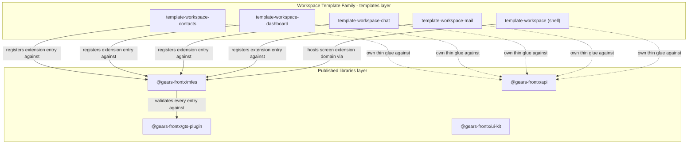
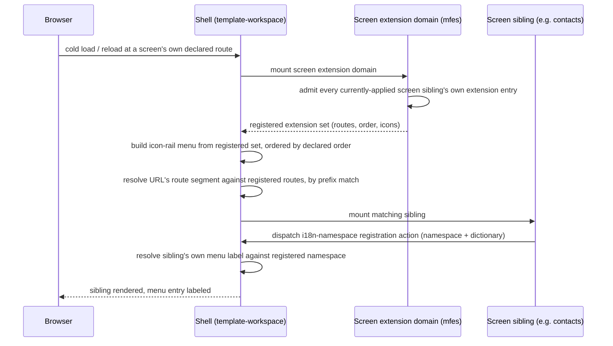

# Technical Design - Workspace Template Family

- [ ] `p3` - **ID**: `cpt-frontx-workspace-templates-design-workspace-templates`

<!-- toc -->

- [1. Architecture Overview](#1-architecture-overview)
  - [1.1 Architectural Vision](#11-architectural-vision)
  - [1.2 Architecture Drivers](#12-architecture-drivers)
  - [1.3 Architecture Layers](#13-architecture-layers)
- [2. Principles & Constraints](#2-principles--constraints)
  - [2.1 Design Principles](#21-design-principles)
  - [2.2 Constraints](#22-constraints)
  - [2.3 Obligations On The Consuming Level](#23-obligations-on-the-consuming-level)
- [3. Technical Architecture](#3-technical-architecture)
  - [3.1 Domain Model](#31-domain-model)
  - [3.2 Component Model](#32-component-model)
  - [3.3 API Contracts](#33-api-contracts)
  - [3.4 Internal Dependencies](#34-internal-dependencies)
  - [3.5 External Dependencies](#35-external-dependencies)
  - [3.6 Interactions & Sequences](#36-interactions--sequences)
  - [3.7 Database schemas & tables](#37-database-schemas--tables)
- [4. Additional context](#4-additional-context)
  - [Worked Example: The Family's GTS Surface](#worked-example-the-familys-gts-surface)
- [5. Traceability](#5-traceability)

<!-- /toc -->

## 1. Architecture Overview

### 1.1 Architectural Vision

The Workspace Template Family composes five independently-versioned template-territory directories - one shell, `template-workspace`, and four screens, `template-workspace-contacts`, `template-workspace-dashboard`, `template-workspace-chat`, `template-workspace-mail` - into one application, reusing the runtime's existing screen extension domain rather than declaring a family-specific one. The design problem this document owns is narrow and specific: what ecosystem-visible contract keeps five siblings, built and released on independent schedules by potentially different Template Developers, composing correctly without any one of them reading another's source. What is not this document's problem is restated from `cpt-frontx-adr-template-territory-traceability`: none of the five siblings' own internal file contents, build configuration, or component code is specified here or anywhere in the ecosystem artifact tree; the domain-model mapping this design is generated from carries that detail at file-level altitude and is referenced rather than duplicated ([mapping](../explorations/2026-09-02-workspace-template-domain-mapping.md)).

This document is root-owned nested content, not a templates-layer member's own artifact chain. `cpt-frontx-adr-template-territory-traceability` forecloses giving template territory an artifact tree of its own until template ownership has settled, and this document does not reopen that question: the five family directories stay excluded from the artifact registry's traceability scan exactly as `template-shell` and `template-mfe` already are, and no `@cpt-` marker is expected or authoritative inside any of the five. What this document specifies instead is the contract boundary around that excluded territory - the shape a sibling's manifest and mount-time behavior must present to the rest of the family and to the runtime, never the sibling's own implementation of that shape.

Three existing ecosystem mechanisms carry the weight of this design, and this document adds no fourth: the runtime's screen extension domain and its existing admission and cardinality rules (`cpt-frontx-adr-extension-domain-occupancy`, `cpt-frontx-adr-domain-extension-compatibility`), already exercised today by `demo-mfe`'s own screen extensions; the runtime's existing actions-chains communication channel (`cpt-frontx-adr-action-dispatch-and-chaining`), which this family's own i18n-namespace registration rides as a new, named usage rather than a new channel; and the CLI's generic template mechanism (`cpt-frontx-adr-uniform-template-mechanism`, `cpt-frontx-adr-source-spec-syntax` as amended for a co-authored, independently-releasing family), which resolves, applies, and versions each of the five siblings uniformly, branching on none of them by kind.

### 1.2 Architecture Drivers

#### Functional Drivers

The requirements this document responds to are owned by its own [PRD](./PRD.md).

| Requirement | Design Response |
|-------------|------------------|
| `cpt-frontx-workspace-templates-fr-independent-sibling-release` | Each of the five siblings is its own template-territory directory with its own manifest and source-spec ref; the CLI's existing uniform template mechanism resolves and applies each independently, branching on none of them by kind (§1.1, §3.2). |
| `cpt-frontx-workspace-templates-fr-registry-parity` | Restated verbatim from `cpt-frontx-adr-template-territory-traceability`'s own authoring obligation: each family directory's creation, rename, or relocation carries the matching artifact-registry exclusion-pattern change in the same commit (§2.3, O1). |
| `cpt-frontx-workspace-templates-fr-screen-domain-registration` | Every screen sibling registers one extension entry against the existing screen extension domain identifier, following the shape `demo-mfe`'s own screen extensions already use (§3.2, Screen Registration; §4, Worked Example). |
| `cpt-frontx-workspace-templates-fr-hash-routing` | The shell resolves `presentation.route` by prefix match against the registered extension set at mount time, never against a closed union of known screen identifiers (§3.2, Hash-Based Route Resolution; §3.6). |
| `cpt-frontx-workspace-templates-fr-i18n-namespace-registration` | A new, named addressed-action usage over the existing actions-chains channel: a screen hands the shell a namespace-and-dictionary pair on mount; the shell resolves the screen's own menu label against that namespace rather than importing the screen's translations (§3.2, i18n Namespace Registration; §3.3). |
| `cpt-frontx-workspace-templates-fr-internal-copy-i18n` | A screen's own internal UI copy resolves from a bundle-local namespace driven only by the existing `language` shared property, following the working precedent already exercised in `_blank-mfe` (§3.2, i18n Namespace Registration). |

#### NFR Allocation

| NFR ID | NFR Summary | Allocated To | Design Response | Verification Approach |
|--------|-------------|--------------|------------------|------------------------|
| `cpt-frontx-workspace-templates-nfr-no-kind-taxonomy` | No manifest field classifies a template by kind | Every one of the five siblings' own manifests | The order-band, route-prefix, and screen/shell distinction are stated entirely in this document's own prose and in each template's own description; no new manifest field is proposed anywhere in this design (§1.1, §4, Worked Example). | Manual review of each of the five manifests at authoring time; no new field in the manifest contract's own schema. |
| `cpt-frontx-workspace-templates-nfr-territory-exclusion` | All five directories stay outside the traceability scan | The artifact registry's exclusion pattern list | Each family directory's own creation commit adds its pattern to the registry's exclusion list, per the registry-parity obligation (§2.3, O1). | Mechanical: `scripts/template-discovery.mjs`'s manifest-presence scan compared against the registry's own exclusion pattern list. |

#### Architecture Decision Records

This document records no decision of its own. Every mechanism it specifies is a family-scoped usage of a decision already recorded elsewhere:

* `cpt-frontx-adr-source-spec-syntax` - as amended, fixes that a co-authored template family publishes per-sibling refs; this design's independent-release requirement follows directly from that amendment.
* `cpt-frontx-adr-template-manifest-contract` - as amended, records that no manifest field declares a sibling requirement; this design's order-band and route-prefix conventions are consequences of that absence, carried as documented obligations rather than manifest-declared ones (§2.3).
* `cpt-frontx-adr-template-territory-traceability` - as amended, fixes both that template territory is unspecified by the ecosystem artifact tree and that the registry's exclusion enumeration must move in the same change as a template directory's own creation, rename, or relocation; this design's registry-parity requirement restates that obligation at the family's own scope (§2.3, O1).
* `cpt-frontx-adr-extension-domain-occupancy`, `cpt-frontx-adr-domain-extension-compatibility` - own the screen extension domain's admission rules and cardinality matrix this family reuses without modification.
* `cpt-frontx-adr-action-dispatch-and-chaining` - owns the actions-chains mediator the i18n-namespace registration action rides as a new, named usage.
* `cpt-frontx-adr-contract-schema-ownership` - fixes that a contract's role belongs to DESIGN, its rationale to an ADR, and its field-level schema to the owning FEATURE; this document states the i18n-namespace registration action's role only (§3.3), leaving its field-level schema to the FEATURE this PRD and DESIGN's own follow-up defers (PRD §4.2).

### 1.3 Architecture Layers



| Layer | Responsibility | Technology |
|-------|-----------------|------------|
| Workspace Template Family (templates layer) | Five independently-versioned template-territory directories composing into one application; internal contents unspecified by the ecosystem artifact tree. | Template-territory directories, each carrying its own `frontx-template.json`; resolved by the CLI's generic source-spec mechanism. |
| Screen extension domain (published libraries layer, reused) | Admits each screen sibling's extension entry, mediates the i18n-namespace registration action over the existing actions-chains channel. | `@gears-frontx/mfes`, unmodified by this design. |
| Type validation (published libraries layer, reused) | Validates every extension entry, shared property, and addressed-action payload the family's manifests declare. | `@gears-frontx/gts-plugin`, unmodified by this design. |

## 2. Principles & Constraints

### 2.1 Design Principles

#### Reuse the existing screen extension domain

- [ ] `p2` - **ID**: `cpt-frontx-workspace-templates-principle-reuse-existing-domain`

The family declares no extension domain of its own. Every screen sibling registers against the runtime's existing screen extension domain, the same one `demo-mfe`'s own screen extensions already target, so the family adds no new admission surface the runtime must learn.

#### Convention over enforcement where no manifest field exists

- [ ] `p2` - **ID**: `cpt-frontx-workspace-templates-principle-convention-over-enforcement`

Where the manifest contract carries no field for a cross-sibling invariant - order-band uniqueness, route-prefix uniqueness - this design states the invariant as a documented, review-enforced convention rather than inventing a manifest field to enforce it mechanically. Adding an enforcement field the manifest contract does not otherwise need would widen the manifest's own surface for a single family's benefit, which the manifest-contract decision's own reasoning already declines to do generally.

### 2.2 Constraints

#### WORKSPACE-1 - No new extension domain

- [ ] `p2` - **ID**: `cpt-frontx-constraint-workspace-templates-no-new-domain`

No screen sibling's own manifest declares an extension domain other than the runtime's existing screen extension domain (`gts.frontx.mfes.ext.domain.v1~frontx.screensets.layout.screen.v1`).

**ADRs**: `cpt-frontx-adr-extension-domain-occupancy` - cited for the domain-governance context this constraint operates inside; that record does not own this constraint, which this design defines and owns directly for this family.

#### WORKSPACE-2 - No manifest-readable template-kind field

- [ ] `p2` - **ID**: `cpt-frontx-constraint-workspace-templates-no-kind-field`

No manifest belonging to any of the five family directories carries a field whose value classifies that template as a shell or a screen, or by any other kind. The distinction is prose-only, in each template's own description.

**ADRs**: `cpt-frontx-adr-template-manifest-contract` - cited for the manifest contract this constraint operates inside; the rule against a template-kind taxonomy is a repository-wide convention this design does not originate and must not violate for this family.

### 2.3 Obligations On The Consuming Level

This design specifies the contract, not an enforcement mechanism for every part of it: some of what the family depends on is a fact this design states and a runtime or guard checks mechanically, and some is an obligation on whichever human role - Shell Template Developer or Screen Template Developer - authors the sibling that must honor it, because no manifest field or runtime check exists to hold it at rest. They are collected here as one normative list, the same shape `@gears-frontx/routing`'s own DESIGN uses for the identical kind of gap (its own §2.3).

- **O1 - Registry-parity on every family-directory change.** Whoever creates, renames, or relocates any of the five family directories **MUST** carry the matching artifact-registry exclusion-pattern change in the same commit (`cpt-frontx-adr-template-territory-traceability`'s own authoring obligation, restated at this family's scope by `cpt-frontx-workspace-templates-fr-registry-parity`). This is a review-time obligation; no mechanical guard blocks a commit that omits it before that commit merges.
- **O2 - Order-band uniqueness across independently-versioned siblings.** A Screen Template Developer **MUST** keep their own sibling's `presentation.order` value inside the band the family's own convention reserves for it - contacts 100, dashboard 200, chat 300, mail 400, with a step of 100 left for a future fifth screen (§4, Worked Example) - and **MUST NOT** assume the runtime arbitrates a collision: `presentation.order` is a flat number across the whole domain, and nothing in the runtime's own admission or cardinality checks compares one sibling's declared order against another's.
- **O3 - Route-prefix uniqueness across independently-versioned siblings.** A Screen Template Developer **MUST** keep their own sibling's `presentation.route` prefix distinct from every other applied sibling's own prefix, for the same reason as O2: the shell's own hash-based resolution matches by prefix against whatever set is registered, and nothing in the runtime checks two siblings' declared routes against each other before both are applied to the same project.
- **O4 - i18n-namespace registration timing.** A Screen Template Developer whose sibling renders a shell-facing menu label **MUST** dispatch the namespace-and-dictionary registration action on mount, before the shell next renders that sibling's own menu entry; a sibling that never dispatches it renders with no shell-resolved label rather than a build-time-imported fallback, because the shell holds none of the sibling's translations to fall back to.
- **O5 - No cross-sibling build-time import.** No sibling's own code **MUST** import another sibling's or the shell's own application code at build time. Two siblings that share data - contacts records read by both contacts and dashboard, for instance - reach it through the shell's own REST surface at runtime, never through a shared module graph, because each sibling is bundled and versioned independently and no build-time import can cross that boundary safely.

## 3. Technical Architecture

### 3.1 Domain Model

| Entity | Definition | Representation |
|--------|------------|-----------------|
| Family | The five co-authored, independently-versioned template-territory directories this design specifies the contract for. | Structural concept; not a package or a manifest-declared entity. |
| Sibling | Any one of the family's five templates, named by its position in the family (shell or screen) in prose only. | Template-territory directory, each carrying its own `frontx-template.json`. |
| Shell | The family's sole non-screen sibling: `template-workspace`. Hosts the screen extension domain, the icon-rail menu, the shared i18n core, and the hash-based router. | Template-territory directory. |
| Screen | Any of the family's four occupant siblings: `template-workspace-contacts`, `-dashboard`, `-chat`, `-mail`. Registers exactly one extension entry against the shell's screen extension domain. | Template-territory directory; one `mfe.json`-shaped manifest per sibling, following the `demo-mfe` package shape. |
| Order band | The 100-wide range of `presentation.order` values this design reserves per screen sibling, so independently-versioned siblings avoid an exact-value collision without coordinating on one. | Documented convention (§2.3, O2), not a manifest-declared or runtime-enforced value. |
| i18n namespace registration | The addressed action a screen sibling dispatches on mount, over the runtime's existing actions-chains channel, handing the shell a namespace-and-dictionary pair for that sibling's own menu-chrome label. | New, named usage of the runtime's existing communication channel; field-level schema owned by a later FEATURE (§3.3). |

### 3.2 Component Model

#### Screen Registration

- [ ] `p2` - **ID**: `cpt-frontx-component-workspace-templates-screen-registration`

##### Why this component exists

Every screen sibling needs a single, uniform way to become an occupant of the shell's own menu and routing surface, without the shell knowing about any specific sibling in advance. This is the family's own concrete application of the runtime's existing extension-registration mechanism, not a new mechanism.

##### Responsibility scope

- Each screen sibling's own manifest declares exactly one extension entry against the runtime's existing screen extension domain identifier.
- Each entry carries a `presentation.route`, a `presentation.order` inside that sibling's own reserved band, an icon, and a menu-label i18n key resolved against that sibling's own namespace (§4, Worked Example).

##### Responsibility boundaries

- Does not declare a new extension domain, and does not add a field to the manifest contract's own schema.
- Does not enforce order-band or route-prefix uniqueness against a sibling built independently; that is a documented obligation on the authoring Screen Template Developer (§2.3, O2, O3), not a mechanism this component implements.

##### Related components (by ID)

- `cpt-frontx-component-workspace-templates-hash-routing` - consumes the same registered extension set's own declared routes.

#### Hash-Based Route Resolution

- [ ] `p2` - **ID**: `cpt-frontx-component-workspace-templates-hash-routing`

##### Why this component exists

`presentation.route` is schema-required on every extension entry today but has had no real consumer in this ecosystem; the shell is the first template to read and act on it, resolving a URL to whichever sibling is currently registered rather than to a fixed, closed set the shell was built knowing about.

##### Responsibility scope

- Resolves the URL's hash segment against every currently-registered extension's own declared `presentation.route`, by prefix match.
- Mounts the matching sibling; a sibling applied to a project after the shell was built is reachable the moment its own extension entry is registered, without a shell rebuild.

##### Responsibility boundaries

- Implemented entirely inside the shell's own template-territory code; this design specifies only that this resolution happens and against what, not the shell's own routing implementation, which is unspecified template payload.
- Does not use `@gears-frontx/routing`'s compound-key, concurrent-occupancy addressing: the screen extension domain this family reuses is a single-occupant domain (one screen mounted at a time), so this design does not require, and does not preclude, that package's own machinery. Whether the shell's own hash router is built on it or hand-rolled is unspecified template payload, not an ecosystem decision this design makes.

##### Related components (by ID)

- `cpt-frontx-component-workspace-templates-screen-registration` - supplies the registered extension set this component resolves against.

#### i18n Namespace Registration

- [ ] `p2` - **ID**: `cpt-frontx-component-workspace-templates-i18n-registration`

##### Why this component exists

The shell cannot read a translation key out of a bundle it does not import; a screen sibling's own menu-chrome label needs a way to reach the shell that does not require the shell to import that sibling's translations at build time, symmetric to the two existing chrome-facing conventions the split plan already carries forward (theme, menu-collapsed state).

##### Responsibility scope

- A screen sibling dispatches an addressed action, over the runtime's existing actions-chains channel, on mount, carrying its own namespace identifier and its own menu-label dictionary.
- The shell resolves that sibling's own menu-chrome label against the registered namespace, in the shell's own currently-selected language.
- A screen sibling's own internal UI copy - everything the sibling itself renders inside its own zone - resolves independently, from a namespace local to that sibling's own bundle, driven only by the existing `language` shared property, following the working `import.meta.glob('./i18n/*.json')` precedent already exercised in `_blank-mfe`. This half needs no registration with the shell at all.

##### Responsibility boundaries

- Carries no field-level schema in this document: the concrete shape of the namespace-and-dictionary payload is new authoring, not migration, and its field-level form is owned by whichever FEATURE eventually specifies it (`cpt-frontx-adr-contract-schema-ownership`), deferred by this PRD and DESIGN's own scope (PRD §4.2).
- Does not prop-drill a translation function through the mount call as a substitute: doing so ties every sibling's internal strings to the exact shape of a function value crossing the Module Federation boundary, and gives a sibling's own namespace nowhere to register independently of the shell's dictionary (PRD §5.3).
- Does not touch a screen sibling's own internal-copy resolution path; that path is self-contained and requires no shell-side registration (§3.2, above).

##### Related components (by ID)

- `cpt-frontx-component-workspace-templates-screen-registration` - the mount event this component's registration action follows.

### 3.3 API Contracts

#### i18n Namespace Registration Action - role only

- [ ] `p2` - **ID**: `cpt-frontx-interface-workspace-templates-i18n-namespace-action`

- **Contract**: An addressed action, dispatched by a mounted screen sibling to the shell over the runtime's existing actions-chains channel, carrying at minimum a namespace identifier scoped to the dispatching sibling and a dictionary of menu-label keys to localized strings for the shell's own currently-selected language. The shell resolves that sibling's own menu-chrome label against the registered namespace from that point until the sibling unmounts.
- **Technology**: An addressed-action payload validated by `@gears-frontx/gts-plugin` against a JSON schema authored under the shell's own `gts/` tree, following the schema-file convention every GTS schema in this ecosystem already follows (one schema per `.json` file, spelling the schema's own id in its path).
- **Location**: Not authored yet. This document states the contract's role only; its field-level schema - property names, types, required-ness - is owned by whichever FEATURE eventually specifies it, per the contract-schema-ownership decision's own division of role (DESIGN), rationale (ADR), and field-level schema (FEATURE). No FEATURE currently exists for this family (§5, Traceability); authoring one is explicitly deferred by this document's own scope, not decided here.

| Public surface | Purpose |
|-----------------|---------|
| Namespace identifier | Scopes the dictionary that follows to the dispatching sibling, so two siblings' own menu-label keys never collide inside the shell's own resolution. Field-level form fixed at implementation time. |
| Menu-label dictionary | The localized strings the shell resolves the sibling's own `presentation.label` key against, for the shell's own currently-selected language. Field-level form fixed at implementation time. |

### 3.4 Internal Dependencies

This document owns no package and no source of its own; the family's five siblings are template-territory directories, not packages this dependency-edge model governs. The dependency this design does specify is behavioral, not a package edge:

- Every screen sibling depends on the shell having already mounted the screen extension domain the sibling registers against; a screen sibling applied without the shell present has nothing to register against, which the runtime's own admission path already handles as an ordinary unmatched-domain case.
- No sibling depends on another sibling's own build output. A cross-sibling data need (dashboard reading contacts, for instance) is a runtime dependency on the shell's own REST surface, never a compile-time package or module dependency between two siblings.

### 3.5 External Dependencies

None owned here beyond what the runtime, the type-system provider, and the CLI's own template mechanism already declare externally. Each sibling's own third-party dependency list (the API client library, the icon set, the chart library dashboard alone needs) is template payload, unspecified by this document and carried at file-level detail by the domain-model mapping this design is generated from.

### 3.6 Interactions & Sequences

#### A screen sibling applied after the shell mounts and resolves a deep link

- [ ] `p2` - **ID**: `cpt-frontx-workspace-templates-seq-deep-link-screen-sibling`

**Use cases**: `cpt-frontx-workspace-templates-usecase-deep-link-to-screen-sibling`

**Actors**: `cpt-frontx-workspace-templates-actor-shell-developer`, `cpt-frontx-workspace-templates-actor-screen-developer`



**Description**: The primary flow this design specifies. No step here is new runtime mechanism: domain admission, menu construction, and route resolution are the shell's own concrete use of capability the runtime already provides generically; only the i18n-namespace registration action is new, and it rides the runtime's existing actions-chains channel rather than a new one. A screen sibling applied to the project after the shell's own release still resolves correctly, because the shell's menu and routing are both built from whatever is currently registered, never from a set fixed at the shell's own build time.

### 3.7 Database schemas & tables

Not applicable. This design owns no database and no durable persistence; the family's own runtime data (contacts, conversations, dashboard metrics) is owned by whichever sibling's own REST surface serves it, unspecified template payload this document does not carry.

## 4. Additional context

### Worked Example: The Family's GTS Surface

Requested as a concrete check for `cpt-frontx-workspace-templates-fr-screen-domain-registration` and the order-band and route-prefix obligations of §2.3: the shape one screen sibling's own manifest takes, following the working pattern `demo-mfe`'s own manifest already uses in this repository today.

```json
{
  "manifest": { "id": "...", "remoteEntry": "http://localhost:<port>/assets/remoteEntry.js" },
  "entries": [
    {
      "id": "gts.frontx.mfes.mfe.entry.v1~...~frontx.workspace.mfe.contacts.v1",
      "requiredProperties": [
        "gts.frontx.mfes.comm.shared_property.v1~frontx.mfes.comm.theme.v1~",
        "gts.frontx.mfes.comm.shared_property.v1~frontx.mfes.comm.language.v1~"
      ],
      "domainActions": [],
      "manifest": "...",
      "exposedModule": "./lifecycle-contacts"
    }
  ],
  "extensions": [
    {
      "id": "gts.frontx.mfes.ext.extension.v1~frontx.screensets.layout.screen.v1~frontx.workspace.screens.contacts.v1",
      "domain": "gts.frontx.mfes.ext.domain.v1~frontx.screensets.layout.screen.v1",
      "entry": "gts.frontx.mfes.mfe.entry.v1~...~frontx.workspace.mfe.contacts.v1",
      "presentation": {
        "label": "workspace.contacts.menu.label",
        "icon": "lucide:users",
        "route": "/contacts",
        "order": 100
      }
    }
  ]
}
```

No field in this shape is new: `domain` is the runtime's existing screen extension domain identifier, unchanged from `demo-mfe`'s own; `requiredProperties` names the same two shared properties (`theme`, `language`) every screen entry in this ecosystem already declares; `presentation.label`, `.icon`, `.route`, `.order` are the same four fields `demo-mfe`'s own extensions already carry. What is new is only the convention layered on top, stated as obligations rather than schema (§2.3):

| Sibling | Reserved order band | Declared route prefix |
|---|---|---|
| contacts | 100 | `/contacts` |
| dashboard | 200 | `/dashboard` |
| chat | 300 | `/chat` |
| mail | 400 | `/mail` |
| *(reserved for a future fifth screen)* | 500 | *(none yet)* |

`presentation.label` is an i18n key, resolved against the registering sibling's own namespace (§3.2, i18n Namespace Registration) - not a raw string, so the menu localizes without the shell importing the sibling's own translations. The Iconify-string convention (`icon: "lucide:users"`) is the shell's own existing consumption contract for menu icons; it diverges deliberately from how each sibling renders its own internal icons (`lucide-react` components imported directly inside that sibling's own zone) - the menu icon and a sibling's internal icons are two different, coexisting conventions, not an inconsistency this design resolves.

**What this worked example does not show**: how a screen sibling declares a runtime dependency on a shell-provided endpoint (contacts needs `/api/workspace/contacts` to exist, for instance). No field in the shape above carries that declaration, and no schema read for the domain-model mapping this design is generated from carries one either. This stays Open Question 2 (PRD §11); today an incompatible pairing surfaces as a runtime 404 rather than a refused mount, and this design does not add a field to close that gap.

**Recorded risks this design does not resolve**, carried forward from the domain-model mapping's own risk framing rather than restated in full (PRD §12 states these as family-scoped risks; the mechanisms themselves are the mapping's own):

- Kit CSS reaching a Shadow DOM root is de-risked, with working evidence already in the tree; whether **component** CSS (as opposed to token CSS) reaches a shadow root through an actual Module-Federation build has not been traced and is the one genuinely open technical question in that story, to be closed before the first screen sibling (contacts) is split.
- The registry-parity obligation (§2.3, O1) has a real precedent of failing once already: `template-inbox` itself was missing from the registry's exclusion list for a period despite carrying a manifest.
- If the shell's MF-host build layer depends on `template-shell`'s own published build export (Open Question 1's leaning for the first iteration), that dependency sits outside the pin-drift guard's own comparison scope, which walks every manifest-carrying directory's pins against `packages/*` only.

## 5. Traceability

- **Features**: No FEATURE currently exists for this family. DECOMPOSITION and FEATURE authoring are explicitly deferred by team agreement until this PRD and DESIGN reach a settled state (PRD §4.2; root DESIGN's own member artifact chain rule, `cpt-frontx-constraint-member-artifact-chain`, does not apply here because this is root-owned nested scope, not a layer member's own artifact chain).
- **Root chain**: [PRD](../PRD.md), [DESIGN](../DESIGN.md)
- **Domain-model mapping**: [2026-09-02-workspace-template-domain-mapping.md](../explorations/2026-09-02-workspace-template-domain-mapping.md) - file-level detail for the split, referenced rather than duplicated throughout this document.
- **CLI**: [CLI PRD](../../packages/cli/architecture/PRD.md), [CLI DESIGN](../../packages/cli/architecture/DESIGN.md) - owns the generic template mechanism every one of the five siblings resolves through.
- **MFE Runtime**: [mfes PRD](../../packages/mfes/architecture/PRD.md), [mfes DESIGN](../../packages/mfes/architecture/DESIGN.md) - owns the screen extension domain and the actions-chains channel this family reuses without modification.

This document's requirements are owned by its own [PRD](./PRD.md), per the same federated-ownership shape the layer model uses for a package member: each artifact set explains its own requirements, and the root PRD and DESIGN describe the layers and the requirements binding every member equally ([root DESIGN §1.3](../DESIGN.md#13-architecture-layers)).
