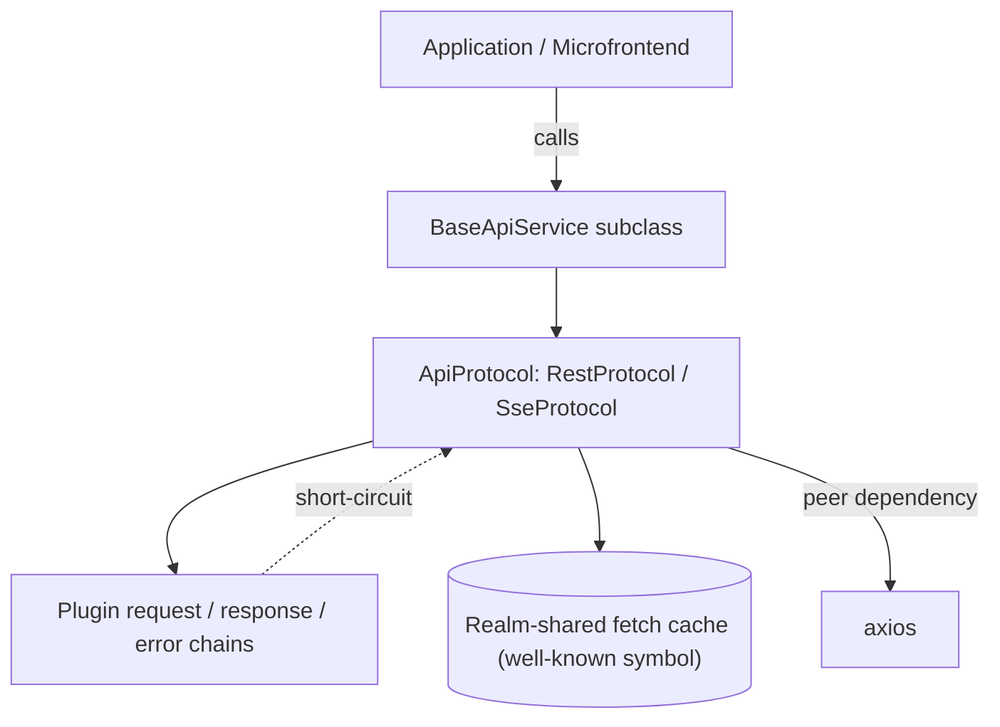
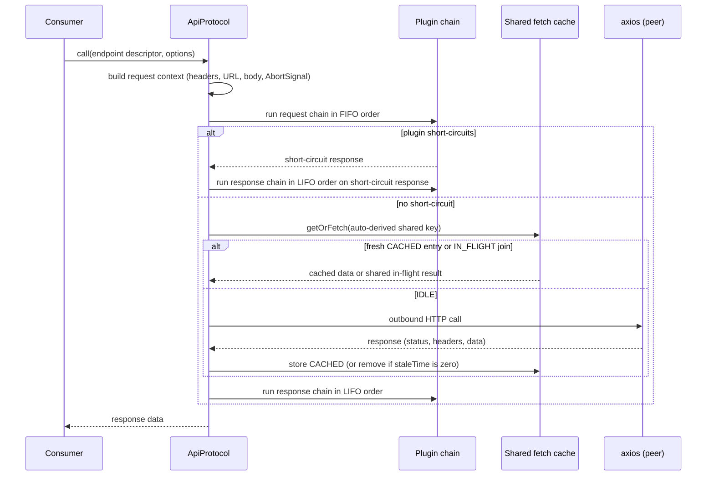

# Technical Design — API Protocol Surface

- [x] `p3` - **ID**: `cpt-frontx-api-design-api-protocol-surface`

<!-- toc -->

- [1. Architecture Overview](#1-architecture-overview)
  - [1.1 Architectural Vision](#11-architectural-vision)
  - [1.2 Architecture Drivers](#12-architecture-drivers)
  - [1.3 Architecture Layers](#13-architecture-layers)
- [2. Principles & Constraints](#2-principles--constraints)
  - [2.1 Design Principles](#21-design-principles)
  - [2.2 Constraints](#22-constraints)
- [3. Technical Architecture](#3-technical-architecture)
  - [3.1 Domain Model](#31-domain-model)
  - [3.2 Component Model](#32-component-model)
  - [3.3 API Contracts](#33-api-contracts)
  - [3.4 Internal Dependencies](#34-internal-dependencies)
  - [3.5 External Dependencies](#35-external-dependencies)
  - [3.6 Interactions & Sequences](#36-interactions--sequences)
  - [3.7 Database schemas & tables](#37-database-schemas--tables)
- [4. Additional context](#4-additional-context)
- [5. Traceability](#5-traceability)

<!-- /toc -->

## 1. Architecture Overview

### 1.1 Architectural Vision

The package gives composed applications and their microfrontends one protocol-separated surface for talking to back-end services, without ever becoming the place solution behavior lives. Two concrete protocols — request/response and streaming — implement a common abstract `ApiProtocol`, each running its own plugin chains (FIFO for requests, LIFO for responses and errors) over descriptor-based endpoints with auto-derived cache keys. Nothing about a concrete endpoint, an auth scheme, or a mock stand-in is baked into either protocol; every one of those concerns is solution behavior, and solution behavior enters only through the generic plugin extension point.

The plugin contract carries a second capability beyond enrichment: a plugin may short-circuit the chain and hand back a response before any transport call is made. This is what lets a consumer substitute a mock, an offline fallback, or a cached stand-in without the protocol knowing that happened — the short-circuit path and the transport path converge on the same response chain and return the same shape to the caller.

Because independently bundled units in the same realm often fetch the same data, the surface also owns a realm-shared, retainer-counted fetch cache reached through a well-known global symbol. It is completely bypassed when nothing retains it, deduplicates concurrent callers of the same derived key onto one in-flight promise, and tears itself down when the last retainer releases it — so sharing costs nothing when no one is sharing, and costs no coordination between the independently bundled units that are.

### 1.2 Architecture Drivers

#### Functional Drivers

The package's requirements are owned by its own [PRD](./PRD.md). The surface stays intentionally below interface altitude — it maps to no `interface` ID — and is anchored by `cpt-frontx-adr-api-surface-organization` and `cpt-frontx-adr-api-transport-bypass-and-fetch-sharing`.

| Requirement | Design Response |
|-------------|------------------|
| `cpt-frontx-api-fr-protocol-separated-services` | `BaseApiService` subclasses front each back-end service; each service binds protocol-appropriate surfaces (`RestProtocol` for request/response, `SseProtocol` for streaming), so a caller's convention is decided by the declared protocol, not improvised per unit. |
| `cpt-frontx-api-fr-shared-service-registry` | The service registry (`apiRegistry`) holds the application's declared services under stable keys; independently bundled units resolve the same instances from it rather than importing each other. |
| `cpt-frontx-api-fr-shared-fetch-cache` | The realm-shared, retainer-counted fetch cache is reached through a well-known global symbol with auto-derived cache keys, deduplicating concurrent callers of the same key onto one in-flight promise across independently bundled units (`cpt-frontx-adr-api-transport-bypass-and-fetch-sharing`). |

#### NFR Allocation

| NFR ID | NFR Summary | Allocated To | Design Response | Verification Approach |
|--------|-------------|--------------|-----------------|----------------------|
| `cpt-frontx-nfr-runtime-performance` | Runtime response-time and throughput targets | The API Protocol Surface | The realm-shared, retainer-counted fetch cache deduplicates concurrent callers of the same auto-derived key onto one in-flight promise, and the generic plugin short-circuit lets a consumer bypass the transport call entirely, so independently bundled units reuse in-flight and cached results instead of issuing redundant network work (`cpt-frontx-adr-api-transport-bypass-and-fetch-sharing`). | Performance benchmarks asserting the runtime-performance thresholds (mfes PRD §6.1) under concurrent callers of the same derived cache key. |
| `cpt-frontx-api-nfr-standalone` | No intra-ecosystem or UI-framework imports; transport as peer only | The published package | The package's manifest declares no intra-ecosystem dependency and lists the HTTP transport under `peerDependencies`; the import graph carries no ecosystem or UI-framework edge. | The boundary guards (`arch:edges`, `arch:deps`) hold both the manifest and the import graph to the declared standalone property. |

### 1.3 Architecture Layers

- [x] `p3` - **ID**: `cpt-frontx-api-tech-api-stack`

| Layer | Responsibility | Technology |
|-------|---------------|------------|
| Public surface | Protocol and plugin base classes, the service registry, descriptor factories, and the shared-cache functions and symbols | TypeScript, single entry point with declarations |
| Protocol layer | `ApiProtocol` and its `RestProtocol` / `SseProtocol` subclasses: request/connection context building, FIFO/LIFO plugin chain execution, short-circuit detection | TypeScript over the peer transport and the browser `EventSource` API |
| Plugin & cache layer | The generic plugin extension point and short-circuit contract; the realm-scoped, retainer-counted shared fetch cache reached through a well-known global symbol | TypeScript closures over a realm global |

## 2. Principles & Constraints

### 2.1 Design Principles

#### Solution Behavior Enters Only Through The Plugin Extension Point

- [x] `p2` - **ID**: `cpt-frontx-api-principle-solution-behavior-via-plugins`

Neither protocol class knows about a concrete endpoint, an auth scheme, or a mock stand-in. Every one of those is solution behavior, and the only way solution behavior reaches the request, response, error, or SSE-connect path is by registering a plugin against the same generic hook surface the protocol itself runs — there is no second, privileged path. A plugin's short-circuit return is not a special case bolted onto this surface; it is an ordinary hook return that the protocol treats identically to a transport response once it reaches the response chain.

This matters because a protocol-separated surface that let solution content leak into the protocol classes themselves would stop being reusable across solutions the moment it did. Keeping every consumer-specific concern behind the plugin hook is what lets `@gears-frontx/api` ship with no application-specific plugin of its own (API-1) while still supporting mocking, auth, retries, and offline fallback as ordinary consumer-authored plugins.

### 2.2 Constraints

#### API-1 — No solution-specific content in the API surface

- [x] `p2` - **ID**: `cpt-frontx-constraint-api-no-solution-content`

The API Protocol Surface (`@gears-frontx/api`) contains no solution-specific content — such as concrete endpoints, auth wiring, request stand-ins, or any other application-specific plugin — and ships no application-specific plugin of its own. The surface provides protocol-separated request and stream primitives, a generic plugin extension point, and a short-circuit capability; solution behavior is supplied by consumers through that extension point.

**ADRs**: `cpt-frontx-adr-api-surface-organization`

## 3. Technical Architecture

### 3.1 Domain Model

| Entity | Definition | Representation |
|--------|------------|----------------|
| ApiService | A protocol-separated service surface a unit calls for request/response or streaming, with auto-derived cache keys over a realm-shared fetch cache. | `BaseApiService` subclass; TypeScript — `@gears-frontx/api` |
| Endpoint / Stream Descriptor | A declarative descriptor carrying an auto-derived cache key and a fetch (or connect/disconnect) closure that routes execution through the imperative protocol; built from the service base URL, method or SSE marker, and endpoint options. | `EndpointDescriptor`, `ParameterizedEndpointDescriptor`, `MutationDescriptor`, `StreamDescriptor` (`src/types.ts`) |
| Fetch-Cache Entry | A realm-shared cache record keyed by auto-derived request identity, cycling through IDLE, IN_FLIGHT, CACHED, SHORT_CIRCUITED and RELEASED states as consumers attach to, resolve, or release it. | `SharedFetchCache` entry (`src/sharedFetchCache.ts`) |
| Short-Circuit Response | A discriminated value a plugin returns to exit the request, response, or SSE-connect plugin chain before any transport call is made, carrying the `shortCircuit` discriminant. | `ShortCircuitResponse`, `RestShortCircuitResponse`, `SseShortCircuitResponse` (`src/types.ts`) |

### 3.2 Component Model

#### API Protocol Surface

- [x] `p2` - **ID**: `cpt-frontx-component-api-surface`

Concrete artifact: `@gears-frontx/api`.

##### Why this component exists

Composed applications and their microfrontends issue request/response and streaming calls to back-end services and benefit from sharing fetch results across independently bundled units running in the same realm. The API Protocol Surface provides a protocol-separated, dependency-light surface for this, with a generic plugin extension point and a realm-shared fetch cache.

##### Responsibility scope

- Owns protocol-separated communication: a request/response protocol and a streaming protocol behind a common abstract `ApiProtocol`, with descriptor-based endpoints and auto-derived cache keys.
- Owns a generic plugin short-circuit mechanism and a realm-scoped, retainer-counted, library-agnostic shared fetch cache that lets independently bundled instances reuse in-flight and cached results.

##### Responsibility boundaries

- Contains no solution-specific content and ships no application-specific plugin of its own; solution behavior arrives only through the generic plugin extension point and its short-circuit capability (API-1).
- Carries no runtime dependency on any specific data-fetching or state library; its transport dependency is a peer dependency.
- Is intentionally below PRD interface altitude — it maps to no PRD §7.1 public interface and is an internal published-libraries dependency rather than a PRD-level capability.

##### Related components (by ID)

- No intra-ecosystem package dependencies. The surface is consumed directly by applications and microfrontends.

### 3.3 API Contracts

- [x] `p2` - **ID**: `cpt-frontx-api-interface-package-entry`

- **Contracts**: None — the surface is intentionally below PRD interface altitude and introduces no `interface` ID; it is anchored only by `cpt-frontx-adr-api-surface-organization` and `cpt-frontx-adr-api-transport-bypass-and-fetch-sharing` (root DESIGN §3.3).
- **Technology**: TypeScript library API, single entry point with declarations
- **Location**: [src/index.ts](../src/index.ts)

| Public surface | Purpose |
|----------------|---------|
| `ApiProtocol`, `RestProtocol`, `SseProtocol` | The abstract protocol base and its request/response and streaming subclasses — the object a service registers to gain protocol-separated dispatch. |
| `RestEndpointProtocol`, `SseStreamProtocol` | Descriptor-based endpoint layers over `RestProtocol` / `SseProtocol` that auto-derive cache keys and route through the imperative protocol. |
| `ApiPluginBase`, `ApiPlugin`, `RestPlugin`, `RestPluginWithConfig`, `SsePlugin`, `SsePluginWithConfig` | The plugin base classes a consumer extends to contribute request, response, error, or SSE-connect behavior. |
| `isShortCircuit`, `isRestShortCircuit`, `isSseShortCircuit` | Type guards that detect a plugin's short-circuit return for the general and protocol-specific cases. |
| `MOCK_PLUGIN`, `isMockPlugin` | Identification markers for mock plugins, used by framework code that toggles mock activation without owning any mock content itself. |
| `BaseApiService` | The abstract base a consumer's service extends to register protocols and manage service-level plugins. |
| `apiRegistry` | The central registry that instantiates and holds a consumer's registered `BaseApiService` subclasses. |
| `SHARED_FETCH_CACHE_SYMBOL`, `SHARED_FETCH_CACHE_RETAINERS_SYMBOL`, `createSharedFetchCache`, `getSharedFetchCache`, `peekSharedFetchCache`, `retainSharedFetchCache`, `releaseSharedFetchCache`, `resetSharedFetchCache` | The realm-shared fetch cache's well-known symbols and lifecycle functions — retain, release, peek, and reset. |
| `JsonPrimitive`, `JsonValue`, `JsonObject`, `JsonCompatible`, `MockResponseFactory`, `MockMap`, `ApiServiceConfig`, `ApiServicesConfig`, `RestProtocolConfig`, `SseProtocolConfig`, `HttpMethod`, `MutationMethod`, `ApiRequestContext`, `ApiResponseContext`, `ShortCircuitResponse`, `ServiceConstructor`, `ApiRegistry`, `PluginClass`, `ProtocolClass`, `ProtocolPluginType`, `BasePluginHooks`, `RestPluginHooks`, `SsePluginHooks`, `RestRequestContext`, `RestResponseContext`, `RestRequestOptions`, `ApiPluginErrorContext`, `SseConnectContext`, `EventSourceLike`, `RestShortCircuitResponse`, `SseShortCircuitResponse`, `EndpointDescriptor`, `ParameterizedEndpointDescriptor`, `MutationDescriptor`, `EndpointOptions`, `StreamDescriptor`, `StreamStatus`, `SharedFetchCache`, `SharedFetchCacheFetchOptions`, `SharedFetchCacheInvalidateFilters` | The type declarations for every entity and contract shape on the surface above. |

### 3.4 Internal Dependencies

None. The package imports no other package in this ecosystem — the property root DESIGN §3.4 records for the API Protocol Surface. It is consumed directly by applications and microfrontends, not by any other intra-ecosystem package.

**Dependency Rules** (per project conventions):
- No circular dependencies at the design level: no other ecosystem package depends on this surface, and this surface depends on none
- No import of template territory
- No UI-framework import

### 3.5 External Dependencies

#### Transport library (API peer)

| Dependency Module | Interface Used | Purpose |
|-------------------|----------------|---------|
| axios | HTTP transport client | Provides the request/response transport behind the protocol-separated surface; declared as a peer dependency so the surface carries no hard runtime coupling to a specific transport (`cpt-frontx-adr-api-surface-organization`). |

**Dependency Rules** (per project conventions):
- `axios` is a peer dependency (`>=1.0.0 <1.14.1`), not a runtime dependency — the package carries no runtime `dependencies` on any data-fetching or state-management library
- The streaming protocol reaches the browser's native `EventSource` API directly rather than through any bundled dependency

### 3.6 Interactions & Sequences

#### Protocol Dispatch With Plugin Short-Circuit And Shared Cache

- [x] `p3` - **ID**: `cpt-frontx-api-seq-protocol-dispatch-short-circuit`

**Use cases**: None — this surface is consumer-invoked and covers no PRD usecase (FEATURE §2).

**Actors**: None — the surface sits below actor altitude; §2 of the FEATURE models the consumer service-call interaction rather than an actor-facing journey (FEATURE §1.3).

**Description**: The path every non-streaming call takes. A plugin may exit the request chain early with a short-circuit response, in which case the response chain still runs on it and the transport call is skipped entirely. Otherwise the request is routed through the realm-shared fetch cache: a fresh cache hit or an in-flight join returns without a new transport call, and only a cache miss reaches the peer transport. Either path converges on the same LIFO response chain and returns the same response shape to the consumer, which is what lets a short-circuiting mock plugin and a real transport call be indistinguishable from the caller's side.

### 3.7 Database schemas & tables

Not applicable. The package holds no database and no durable persistence; the realm-shared fetch cache lives entirely in memory on the realm global and is torn down when its retainer count reaches zero.

## 4. Additional context

The package's central design tension is staying below PRD interface altitude while still being load-bearing for runtime performance: it introduces no `interface` ID and maps to no PRD §7.1 capability, yet the NFR allocation in §1.2 makes it one of two components (with the MFE Runtime) carrying the ecosystem's runtime-performance commitment. The transport peer-dependency choice resolves a second tension the same way the type-substrate port does in `@gears-frontx/gts-plugin` — by keeping a concrete, replaceable dependency out of the package's own runtime footprint so a consumer's pinned transport version, not this package's, governs compatibility.

## 5. Traceability

- **Features**: [features/](./features/)
- **Root chain**: [PRD](../../../architecture/PRD.md), [DESIGN](../../../architecture/DESIGN.md), [DECOMPOSITION](../../../architecture/DECOMPOSITION.md)

This package's requirements are owned by its own [PRD](./PRD.md), per the 3-layer model: each member explains its own reqs, and the root PRD describes the layers and the requirements binding every member equally. The design elements that moved here from the root DESIGN under the artifact-federation refactoring keep their identifiers unchanged, so citations from the root DECOMPOSITION and this package's FEATUREs resolve as before.
