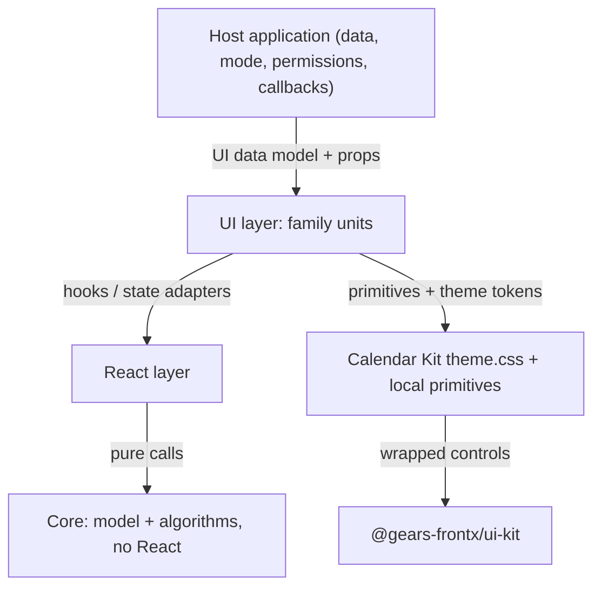
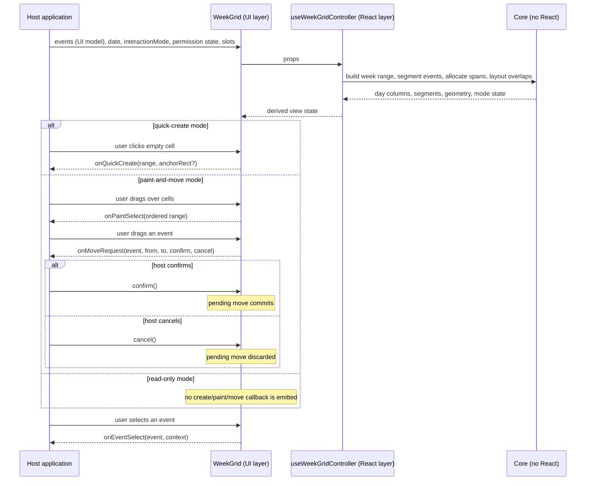

# Technical Design — Calendar Kit

- [ ] `p3` - **ID**: `cpt-frontx-calendar-kit-design-calendar-kit`

<!-- toc -->

- [1. Architecture Overview](#1-architecture-overview)
  - [1.1 Architectural Vision](#11-architectural-vision)
  - [1.2 Architecture Drivers](#12-architecture-drivers)
  - [1.3 Architecture Layers](#13-architecture-layers)
- [2. Principles & Constraints](#2-principles--constraints)
  - [2.1 Design Principles](#21-design-principles)
  - [2.2 Constraints](#22-constraints)
- [3. Technical Architecture](#3-technical-architecture)
  - [3.1 Domain Model](#31-domain-model)
  - [3.2 Component Model](#32-component-model)
  - [3.3 API Contracts](#33-api-contracts)
  - [3.4 Internal Dependencies](#34-internal-dependencies)
  - [3.5 External Dependencies](#35-external-dependencies)
  - [3.6 Interactions & Sequences](#36-interactions--sequences)
  - [3.7 Database schemas & tables](#37-database-schemas--tables)
- [4. Additional context](#4-additional-context)
- [5. Traceability](#5-traceability)

<!-- /toc -->

## 1. Architecture Overview

### 1.1 Architectural Vision

The package delivers the calendar surface as a layered composition in which the host application stays in control end to end. A React-free core owns the neutral UI data model and every pure calculation — temporal validation and conversion, range and day segmentation, all-day span allocation, overlap layout, interaction transitions, format-input helpers. A React layer adapts that core into hooks and controlled/uncontrolled state machines without touching presentation. A UI layer renders the family units — grids, event card, detail panel, toolbar, create-event shell, availability grid, sidebar widgets — composing package-local primitives that wrap the exact-pinned `@gears-frontx/ui-kit` controls under the documented `--cal-*` theme contract. The application layer never enters the package: the host maps its backend data into the UI model, selects the interaction mode and permission state, and receives every consumer-visible action as a typed callback or through a render slot.

The packaging shape is fixed by `cpt-frontx-calendar-kit-adr-calendar-kit-packaging`: one installable artifact (`@gears-frontx/calendar-kit`), the exact-pinned `@gears-frontx/ui-kit` edge behind the package-local primitives, a React-free core enforced as a directory boundary inside the package, and flat subpath entries discovered from `src/**/public.ts` at build time so adding a family unit never edits the manifest.

### 1.2 Architecture Drivers

#### Functional Drivers

The package's requirements are owned by its own [PRD](./PRD.md). The surface sits intentionally below interface altitude — it maps to no root `interface` ID — and is anchored by `cpt-frontx-calendar-kit-adr-calendar-kit-packaging`.

| Requirement | Design Response |
| --- | --- |
| `cpt-frontx-calendar-kit-fr-installable-artifact` | One workspace package publishes one artifact; build-time discovery of `src/**/public.ts` entries keeps the export surface stable while families land incrementally behind the same identity. |
| `cpt-frontx-calendar-kit-fr-neutral-ui-data-model` | `src/core` owns branded temporal types and the event/cell/range/conflict shapes; hosts map backend responses into them before rendering, and no component reads a backend shape. |
| `cpt-frontx-calendar-kit-fr-host-owned-interaction-modes` | The interaction mode is a host-supplied prop with controlled/uncontrolled variants; mode-appropriate callbacks (`onQuickCreate`, `onPaintSelect`, `onMoveRequest`) are the only action paths, and read-only disables all of them. |
| `cpt-frontx-calendar-kit-fr-product-render-slots` | Every host-specific section is a render slot receiving a typed context; the library renders host-supplied structure and behaviour, not host content. |
| `cpt-frontx-calendar-kit-fr-conflict-dimension-rendering` | Conflicts carry a dimension plus a host-supplied label in the UI model; the conflict indicator renders them without inventing host vocabulary. |
| `cpt-frontx-calendar-kit-fr-theme-contract` | A single stylesheet export declares semantic `--cal-*` tokens with host-token fallbacks plus the enumerated calendar-owned tokens; component CSS reads only these properties. |
| `cpt-frontx-calendar-kit-fr-controlled-uncontrolled-apis` | Stateful props pair a value with a change callback and a `default*` uncontrolled variant, implemented by the React-layer state adapters. |
| `cpt-frontx-calendar-kit-fr-intentional-public-exports` | Flat subpath entries per family unit, null blocks for internals, and a full-barrel root index re-exporting the core, react and shipped-family public surfaces; resolution verified under both `bundler` and `nodenext`. |
| `cpt-frontx-calendar-kit-fr-accessibility` | Semantic roles, roving focus, keyboard activation and live announcements live in the UI-layer components and their controller hooks, tested per component. |

#### NFR Allocation

| NFR ID | NFR Summary | Allocated To | Design Response | Verification Approach |
| --- | --- | --- | --- | --- |
| `cpt-frontx-calendar-kit-nfr-react-free-core` | No React/ui-kit/backend/browser imports in the core | The `src/core` directory boundary | The core is type-checked separately (`type-check:core`, no `.tsx` under `src/core`), and the root dependency-cruiser rules hold every `src/**` import to the single allowed ecosystem edge. | The named gates fail on any forbidden import from `src/core/**`. |
| `cpt-frontx-calendar-kit-nfr-independent-versioning` | Calendar-only changes bump only this package | The published package | The package owns its version line and changelog. `@gears-frontx/ui-kit` is an exact-pinned dependency consumed only inside `src/ui/primitives/`, so a ui-kit upgrade is a calendar-kit change, never the reverse. | The bump-on-change gate and the version-policy enumeration name the package; a calendar-only diff requires no UI-kit change. |
| `cpt-frontx-calendar-kit-nfr-tree-shakeable-units` | Unimported families contribute no JS/CSS | The build entry model | Each family unit is an explicit flat entry with injected component CSS and CSS-only side effects. | The consumer-bundle gate asserts an unimported family's JS and CSS are absent. |

### 1.3 Architecture Layers

- [ ] `p3` - **ID**: `cpt-frontx-calendar-kit-tech-stack`

| Layer | Responsibility | Technology |
| --- | --- | --- |
| Core | Branded temporal types, model validation, range/day segmentation, all-day span allocation, overlap layout, interaction transitions, pure format-input helpers | Framework-free TypeScript; no JSX, no browser globals |
| React | Hooks, context providers, controlled/uncontrolled state adapters, interaction-mode state machines | React 19 (peer) plus `src/core` only |
| UI | Visual/interactive family units: grids, event card, detail panel, toolbar, create-event shell, availability grid, sidebar widgets | React, package-local primitives (some wrapping `@gears-frontx/ui-kit` controls), CSS Modules over the `--cal-*` theme contract |
| Application (outside the package) | Backend mapping, solution/version state, permissions, planning, solver, creation workflow | Host-owned; receives typed callbacks and slots |

## 2. Principles & Constraints

### 2.1 Design Principles

#### Host Owns Data, Mode and Permission

- [ ] `p2` - **ID**: `cpt-frontx-calendar-kit-principle-host-owned-control`

The library computes and presents; it never decides. Data arrives mapped into the UI model, the interaction mode and read-only state arrive as host state, and every consumer-visible action leaves through a typed callback. Version switching, hidden-calendar filtering, permission policy and backend mutation are host concerns that choose the mode outside the kit; a component that reaches for any of them has crossed the boundary this principle exists to keep.

This is what makes one library serve hosts with different backends and permission models: the variance lives entirely in the host, and the library's contract is the same for each of them.

#### Host Behavior Enters Only Through Callbacks and Slots

- [ ] `p2` - **ID**: `cpt-frontx-calendar-kit-principle-solution-behavior-via-callbacks-slots`

Neither the core nor the UI layer knows a concrete host: no host-scheduling identifier or host-domain field appears in library source. Host-specific rendering enters exclusively through render slots with typed contexts, and host-specific actions enter exclusively through callbacks with domain-level payloads. There is no second, privileged path — a prop that smuggles host content is a defect against this principle, not an extension point.

### 2.2 Constraints

#### CKIT-1 — No solution-specific content in the package

- [ ] `p2` - **ID**: `cpt-frontx-constraint-calendar-kit-no-solution-content`

The package contains no solution-specific content — no backend schema, no planning or solver logic, no host vocabulary, no persistence and no scheduling business rules — and ships no application-specific behaviour of its own. Event creation ships as generic UI: `CreateEventPopover` renders the form and reports the values the host asked for, while persistence, backend calls and business rules stay with the host. It provides the neutral UI data model, pure calendar calculations, visual units, slots, modes and read-only semantics; host behavior is supplied by hosts through callbacks and slots.

**ADRs**: `cpt-frontx-calendar-kit-adr-calendar-kit-packaging`

#### CKIT-2 — React-free core, mechanically enforced

- [ ] `p2` - **ID**: `cpt-frontx-constraint-calendar-kit-react-free-core`

Every file under `src/core` carries no import of `react`, `react-dom`, `@gears-frontx/ui-kit`, any backend package, bridge, Redux slice, translation registry, or browser global, and no JSX. The property is enforced by the separate core type-check configuration (no `.tsx` under `src/core`) and the root dependency-cruiser rules bounding the package to its single allowed ecosystem edge — not by folder convention.

**ADRs**: `cpt-frontx-calendar-kit-adr-calendar-kit-packaging`

#### CKIT-3 — UI-kit only behind the primitives

- [ ] `p2` - **ID**: `cpt-frontx-constraint-calendar-kit-single-peer-edge`

`@gears-frontx/ui-kit` is the package's only intra-ecosystem UI edge, and only `src/ui/primitives/` imports it. Family units, the React layer and the core never do, so the ui-kit surface the package depends on is the set of wrapped primitives listed in `docs/primitives.md`. No template-territory or unrelated ecosystem edge is permitted.

**ADRs**: `cpt-frontx-calendar-kit-adr-calendar-kit-packaging`

## 3. Technical Architecture

### 3.1 Domain Model

| Entity | Definition | Representation |
| --- | --- | --- |
| CalendarEvent | A neutral event in the UI data model: branded temporal fields (`CalendarDate`, `LocalTime`, `UtcInstant`, `IanaTimeZone`), an all-day/timed discriminated shape with exclusive end dates, calendar reference, colour family, access/availability, RSVP, attendees, conflicts, and an opaque host `metadata` payload the core never inspects. | `CalendarEvent`, `CalendarEventBase` (`src/core/model.ts`) |
| CalendarCell / SelectionRange | One addressable grid cell (date plus start/end times and instants) and an ordered, serializable range of cells produced by paint selection. | `CalendarCell`, `CalendarSelectionRange` (`src/core/model.ts`) |
| EventSegment / Geometry | A per-day segment of a multi-day event with start/middle/end flags, and the deterministic overlap-layout geometry (top, height, inline position/size, z-index) computed from valid timed intervals. | `CalendarEventSegment`, `CalendarEventGeometry` (`src/core/grid.ts`, `src/core/layout.ts`) |
| MoveRequest | A pending event move carrying the event, source and target cells, and the host's confirm/cancel functions; only confirm commits. | `CalendarMoveRequest` (`src/core/interactions.ts`) |
| CreateEventDraft / Result | The neutral create payload (timed or all-day variant, nullable end date) and the host's typed result with field/form/denied/transport error kinds. | `CreateEventDraft`, `CreateEventResult` (`src/core/model.ts`) |
| Conflict | A conflict dimension plus host-supplied display label, optional message and severity; the library displays, never invents. | `CalendarConflict` (`src/core/model.ts`) |
| Interaction mode | The host-selected grid behaviour — quick-create, paint-and-move, read-only — modelled as pure transitions in the core and adapted to React state. | `WeekGridInteractionMode` (`src/core/interactions.ts`) |

### 3.2 Component Model

#### Neutral UI Data Model

- [ ] `p2` - **ID**: `cpt-frontx-calendar-kit-component-ui-data-model`

Concrete artifact: `@gears-frontx/calendar-kit` root export and `./core` entry.

##### Why this component exists

Hosts have different backend shapes and the UI must not depend on any of them; the data model is the seam that keeps backend contracts out of components.

##### Responsibility scope

- Owns the branded temporal types and their validation/conversion helpers.
- Owns the event, cell, range, segment, move-request, draft, conflict and colour-family shapes.
- Keeps host-specific data in an opaque `metadata` payload that no library code inspects.

##### Responsibility boundaries

- Contains no React, no ui-kit, no backend identifier (CKIT-2, CKIT-1).
- Does not own rendering, state, or interaction behaviour.

##### Related components (by ID)

- `cpt-frontx-calendar-kit-component-react-free-core` — consumes these shapes in its algorithms.

#### React-Free Core Algorithms

- [ ] `p2` - **ID**: `cpt-frontx-calendar-kit-component-react-free-core`

Concrete artifact: `@gears-frontx/calendar-kit` `./core` entry.

##### Why this component exists

Date/time/grid calculations must be deterministic, testable without a DOM, and reusable by any future non-React consumer if the extraction trigger fires.

##### Responsibility scope

- Temporal validation and conversion over branded types, including DST-aware viewer-day handling.
- Range building and day/week/month segmentation; all-day span allocation with continuation flags.
- Deterministic timed-overlap layout that skips malformed, duplicate, all-day, or non-positive inputs.
- Pure interaction-mode transitions and the move-request handshake state.
- Pure format-input helpers taking injected locale/timeZone inputs.

##### Responsibility boundaries

- No JSX, no browser globals, no translation registry (CKIT-2); enforcement is mechanical, not conventional.
- Does not own presentation state or DOM anchors; the browser-only quick-create anchor stays in the React layer.

##### Related components (by ID)

- `cpt-frontx-calendar-kit-component-ui-data-model` — the shapes it operates on.
- `cpt-frontx-calendar-kit-component-react-adapters` — the only consumer inside the package.

#### React Adapters

- [ ] `p2` - **ID**: `cpt-frontx-calendar-kit-component-react-adapters`

Concrete artifact: `@gears-frontx/calendar-kit` `./react` entry.

##### Why this component exists

Components need controlled/uncontrolled state, refs, effects and current-instant tracking; isolating that in hooks keeps the UI layer declarative and the core untouched.

##### Responsibility scope

- Controlled/uncontrolled state adapters for selection, interaction mode, and open/expanded state.
- Interaction-mode state machines wired to React, delegating transitions to the core.
- Current-instant and resize observation for now-line and layout recalculation.
- `src/react/public.ts` is the sole React-layer barrel; family controllers live in `src/react/controllers/`, shared hooks in `src/react/hooks/`, and `slots.ts` remains at the layer root without subfolder barrels.

##### Responsibility boundaries

- Imports only React and `src/core`; never ui-kit (only the primitives do).
- Does not render elements.

##### Related components (by ID)

- `cpt-frontx-calendar-kit-component-react-free-core` — delegates all pure logic here.
- `cpt-frontx-calendar-kit-component-ui-family-units` — consumes the hooks.

#### UI Family Units

- [ ] `p2` - **ID**: `cpt-frontx-calendar-kit-component-ui-family-units`

Concrete artifact: one flat subpath entry per family (`./grid`, `./week-grid`, `./day-grid`, `./month-grid`, `./agenda-view`, `./calendar-toolbar`, `./event-card`, `./conflict-indicator`, `./event-detail-panel`, `./create-event`, `./availability-grid`, `./month-navigator`, `./time-zone-list`, `./world-clocks`, `./calendar-list`, `./search-results`, `./calendar-side-panel`).

##### Why this component exists

Each family unit is an independently installable, independently testable surface with its own CSS, so hosts pay only for what they mount.

##### Responsibility scope

- Renders the visual/interactive units composing package-local primitives under the theme contract.
- Implements semantic roles, roving focus, keyboard activation, live announcements and slot rendering per unit.
- Emits the typed callbacks of its props; renders host-supplied slots with typed contexts.

##### Responsibility boundaries

- Imports core, react-layer public hooks, and package-local primitives only; `@gears-frontx/ui-kit` is reached through a primitive, never directly (CKIT-3).
- Carries no host content (CKIT-1); fixed implementation geometry lives in CSS Modules, not in the theme contract.

##### Related components (by ID)

- `cpt-frontx-calendar-kit-component-react-adapters` — state and interaction wiring.
- `cpt-frontx-calendar-kit-component-theme-contract` — the token surface every unit styles against.

#### Theme Contract

- [ ] `p2` - **ID**: `cpt-frontx-calendar-kit-component-theme-contract`

Concrete artifact: `@gears-frontx/calendar-kit/theme.css` (plus optional scoped `reset.css`).

##### Why this component exists

Branding overrides must be predictable: one documented token surface instead of scattered custom properties.

##### Responsibility scope

- Declares every semantic `--cal-*` token with host-token fallbacks, the four enumerated calendar-owned tokens with literal defaults, the light/explicit-dark/media/forced-colors blocks, and the reduced-motion override.
- Is imported exactly once by the consumer; it also defines the seams the wrapped ui-kit controls read, so no `@gears-frontx/ui-kit/theme.css` import is required or permitted.

##### Responsibility boundaries

- No raw palette values, no fixed implementation geometry, no token outside the documented tables.
- Does not style components directly; component CSS reads the tokens.

##### Related components (by ID)

- `cpt-frontx-calendar-kit-component-ui-family-units` — the consumers of the token surface.

### 3.3 API Contracts

- [ ] `p2` - **ID**: `cpt-frontx-calendar-kit-interface-package-entry`

- **Contracts**: None — the surface is intentionally below root interface altitude and introduces no root `interface` ID; it is anchored by `cpt-frontx-calendar-kit-adr-calendar-kit-packaging` (root DESIGN §3.3).
- **Technology**: TypeScript library API; flat subpath entries with declarations resolvable under `bundler` and `nodenext`
- **Location**: [src/index.ts](../src/index.ts) (full barrel: core, react and shipped UI family public surfaces), family `public.ts` entries

| Public surface | Purpose |
| --- | --- |
| Core model types | `CalendarDate`, `LocalTime`, `UtcInstant`, `IanaTimeZone`, `CalendarTranslate`, `CalendarDirection`, `CalendarView`, `CalendarColorFamily`, `CalendarAttendee`, `CalendarRsvp`, `CalendarConflictDimension`, `CalendarConflict`, `CalendarEvent`, `CalendarRef`, `CalendarTimeZoneOption`, `CalendarWorldClock`, `CalendarCell`, `CalendarSelectionRange`, `CalendarEventSegment`, `CalendarEventGeometry`, `CalendarMoveRequest`, `WeekGridInteractionMode`, `CalendarQuickCreatePayload`, `CalendarAvailabilityCell`, `CalendarCellContext`, `CalendarGridColumn`, `CalendarGridRow`, `CalendarEventRenderContext`, `CalendarDetailRenderContext`, `CalendarEventRenderer`, `CalendarConflictRenderer`, `CalendarDetailRenderer`, `CalendarInteractionCallbacks`, `CreateEventDraftBase`, `TimedCreateEventDraft`, `AllDayCreateEventDraft`, `CreateEventDraft`, `CreateEventResult` |
| Family-unit props | `CalendarLocalizedProps`, `CalendarTemporalProps`, `CalendarGridProps`, `WeekGridProps`, `DayGridProps`, `MonthGridData`, `MonthGridProps`, `AgendaViewProps`, `CalendarToolbarProps`, `EventCardProps`, `ConflictIndicatorProps`, `CalendarResourceOption`, `CreateEventPopoverProps`, `EventDetailPanelProps`, `MonthNavigatorProps`, `TimeZoneListProps`, `WorldClocksProps`, `CalendarListProps`, `SearchResultContext`, `SearchResultsProps`, `CalendarSidePanelSlots`, `CalendarSidePanelProps`, `AvailabilityGridProps` |
| Theme contract | The `--cal-*` alias table and the four calendar-owned tokens (`--cal-radius-pill`, `--cal-motion-duration-short`, `--cal-motion-duration-medium`, `--cal-motion-duration-long`) declared in `theme.css` |

Every component accepts `t` (the translation function, `CalendarTranslate`), `direction` and `className` through the named base interface; temporal components also accept `locale` and `timeZone`. No public component imports application types or services, and no slot receives a backend response.

### 3.4 Internal Dependencies

The package's internal edges follow the layer order and nothing else:

- `src/core` imports nothing inside the package except itself.
- `src/react` imports `src/core` and React only.
- `src/ui` imports `src/core`, the react-layer public hooks, and package-local primitives; only `src/ui/primitives/` imports `@gears-frontx/ui-kit`.
- The root `src/index.ts` is a full barrel: it re-exports the core public surface, the react public surface and every shipped UI family's `public.ts` (values and types); tree-shaking stays intact because only CSS is side-effectful.

**Dependency Rules** (per project conventions):

- No circular dependencies at any layer
- No import of template territory
- No import of a sibling package's internals; ui-kit is imported from its public entries, only by primitives (CKIT-3)

### 3.5 External Dependencies

| Dependency Module | Interface Used | Purpose |
| --- | --- | --- |
| react / react-dom (peers, `^19.0.0`) | Component and hook APIs | The UI framework the host supplies; the package carries no hard runtime coupling. |
| @gears-frontx/ui-kit (exact pin) | Button, Checkbox, Combobox, Calendar, Field, Input, RadioGroup, Select, Textarea, Switch | Wrapped by the package-local primitives, which add the calendar API, tokens and shadow-root behaviour (CKIT-3). |
| lucide-react (exact pin) | Icon set | Direct icon imports in the visual units; exact-pinned per the repository dependency-pinning rule. |

**Dependency Rules** (per project conventions):

- Third-party runtime dependencies are exact-pinned; peers use satisfiable ranges
- A dependency is declared only when the package imports it directly; nothing is inherited transitively as a contract

### 3.6 Interactions & Sequences

#### Host Embeds the Week Grid and Receives Typed Callbacks

- [ ] `p3` - **ID**: `cpt-frontx-calendar-kit-seq-week-grid-host-embedding`

**Use cases**: `cpt-frontx-calendar-kit-usecase-embed-week-grid`

**Actors**: `cpt-frontx-calendar-kit-actor-consumer-developer`, `cpt-frontx-calendar-kit-actor-host-application`

**Description**: The path every embedded week grid takes. The host supplies mapped data, mode and permission state; the controller derives view state through pure core calls; and each mode exposes exactly its own action path — quick-create emits the range payload, paint-and-move emits ordered ranges and the confirm/cancel move handshake, read-only emits none of them. Host-specific card and detail content renders through the host's slots at every step.

### 3.7 Database schemas & tables

Not applicable. The package holds no database and no durable persistence; all state is either host-owned or transient view state.

## 4. Additional context

The package's central design tension is rich interaction against total host control: the grids implement pointer painting, drag moves with confirmation, roving focus and live announcements, yet hold no authority over what any of those gestures mean. The resolution mirrors the API member's plugin principle — host behavior enters only through the typed callback/slot surface (CKIT-1, `cpt-frontx-calendar-kit-principle-solution-behavior-via-callbacks-slots`) — and the primitive layer resolves the second tension: design-system controls come from ui-kit, but only behind package-local wrappers, and host token fallbacks in `theme.css` keep embedding control with the host.

## 5. Traceability

- **Features**: [features/](./features/)
- **Root chain**: [PRD](../../../architecture/PRD.md), [DESIGN](../../../architecture/DESIGN.md), [DECOMPOSITION](../../../architecture/DECOMPOSITION.md)

This package's requirements are owned by its own [PRD](./PRD.md), per the 3-layer model: each member explains its own reqs, and the root PRD describes the layers and the requirements binding every member equally. The packaging decision anchoring this design is recorded in [ADR 0001](./ADR/0001-calendar-kit-packaging.md).
