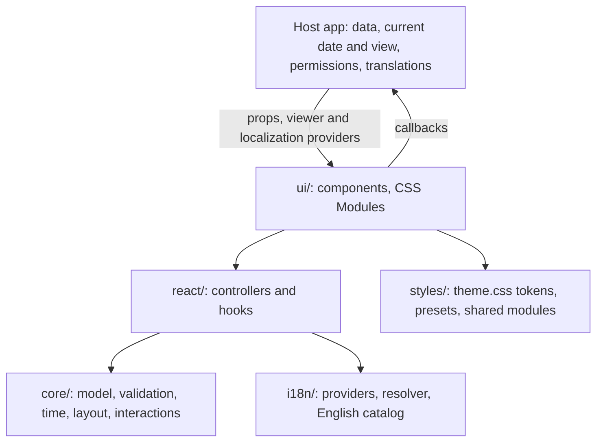
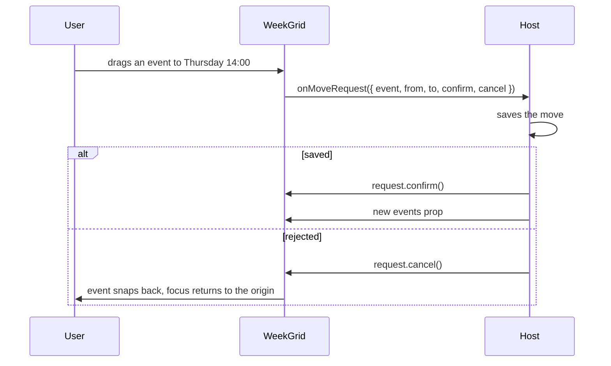

# Architecture and data flow

## Layers

| Folder | What lives there | Rule |
| --- | --- | --- |
| `src/core` | Branded types and their parsers, time-zone math, week and month ranges, event segmentation, overlap layout, all-day lane allocation, interaction state machine, formatters, the shared `Intl` cache | No React, no DOM, no browser globals. Pure functions, safe on a server |
| `src/i18n` | `CalendarProvider` (the viewer zone) and `CalendarLocalizationProvider` (locale, direction, translator, catalogues), the message resolver, the English message definitions and their descriptions | Knows messages, not components |
| `src/react` | One controller hook per component (`use-*-controller.ts`), shared hooks (controlled values, the current instant, date-range selection, the pointer/keyboard interaction controller) and the slot types | State and behaviour, no markup |
| `src/ui` | One folder per component: the `.tsx`, its `.module.css`, its `.md` reference, its `public.ts` entry and its tests. `ui/primitives` holds the private building blocks (button, popover, dialog, select, fields…) | Markup and styling; logic delegated to the controller |
| `src/styles` | `theme.css` (the `--cal-*` tokens), `themes/onecloud.css`, the opt-in `reset.css`, and `modules/` with the CSS shared between components | Components read tokens only; no raw colours |

A component file is thin on purpose. `WeekGrid` asks `useWeekGridController` for its state and handlers, lays out cards and slots, and calls your callbacks. The same controller is exported, so you can render your own markup on top of it; see [Headless controllers](headless.md).

## A render, from props to pixels

1. **Resolve localization.** Each component reads the nearest localization and viewer providers and lets its own `locale`, `timeZone`, `direction`, `t` and `translations` props win. Without a provider it uses `en-US`, `UTC`, the locale's direction and English.
2. **Build the range.** The controller computes the visible days in the viewer's zone (the Monday-first week, the month's full weeks, the thirty-day agenda) and the slots inside the visible hours.
3. **Segment events.** Each event is split into one segment per viewer day it touches. All-day events use their exclusive `endDate`; timed events use their `start`/`end` instants.
4. **Lay out.** Timed segments that overlap share their day column in lanes (`CalendarEventGeometry`); all-day segments are packed into rows; the month grid measures its cells and moves extra events into the overflow chip.
5. **Render.** Each segment renders through `renderEvent` or the default `EventCard`, with a `CalendarEventRenderContext` that says whether it is selected, past, available or read-only.

Everything in steps 2–4 is memoized on the inputs that change it, so a parent re-render with the same `events` array does not re-lay-out the week. Keep `events` referentially stable (from state or `useMemo`) to benefit.

## An interaction, from input to host

The same shape holds everywhere: the kit turns pointer and keyboard input into a typed, serializable payload, hands it to a callback, and waits. `onQuickCreate`, `onPaintSelect`, `onEventSelect`, `onSubmit`, `onNext` and `onViewChange` all work this way.

## Controlled and uncontrolled state

Stateful props come in threes: `value`, `defaultValue`, `onValueChange` (for example `selectedEventId`, `defaultSelectedEventId`, `onSelectedEventIdChange`).

- Pass `value` to **control** it. The component shows exactly that and reports changes through the callback.
- Omit `value` and optionally pass `defaultValue` to let the component keep it. The callback still fires.
- `undefined` means uncontrolled; `null` means controlled with nothing selected. `selectedEventId={null}` keeps the grid from ever selecting an event on its own.

## Why it is built this way

- **The host owns data and decisions** so one kit can serve hosts with different back ends, permission models and scheduling rules. Nothing host-specific lives in the kit; hosts reach in through slots, `metadata` and callbacks.
- **Branded values** make the most common calendar bugs (a local time treated as UTC, a date string in the wrong format) type errors at the boundary instead of wrong pixels later.
- **A React-free core** keeps the time and layout math testable without a DOM and reusable outside React.
- **Moves wait for `confirm`** because only the host knows whether a move is allowed or saved. The grid never shows a state the server rejected.
- **CSS Modules over tokens** keep kit class names private, so you style through tokens, `className` and the documented part classes rather than selectors that break on the next release.
- **Stable message ids with English defaults** let the kit ship complete text without choosing your i18n library.

## Performance notes

- `Intl` formatters are cached per locale and options in `core/intl-cache.ts`; rendering thousands of labels does not construct thousands of formatters.
- Layout work is memoized on `date`, `events`, the time zone and the slot settings. A new `events` array identity triggers a re-layout even if the contents are equal.
- Components with a clock (`now` omitted) re-render on a timer, at most every 30 seconds; pass `now` to stop that where it is not needed.
