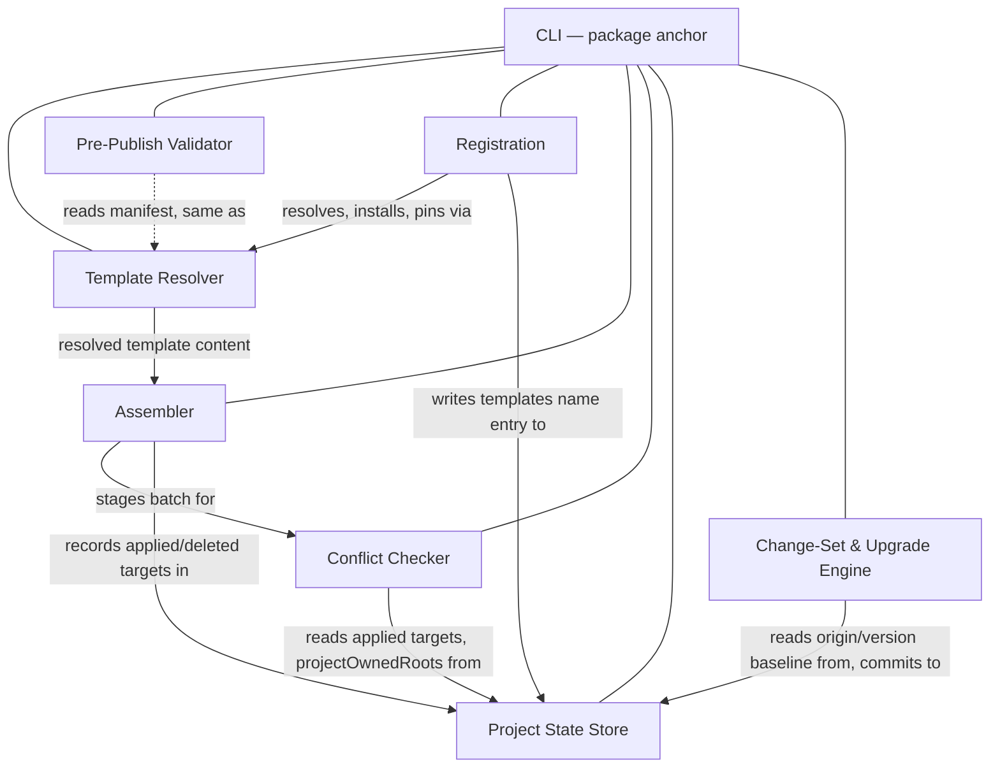

# Technical Design — Template Lifecycle CLI

- [ ] `p3` - **ID**: `cpt-frontx-cli-design-template-lifecycle-cli`

<!-- toc -->

- [1. Architecture Overview](#1-architecture-overview)
  - [1.1 Architectural Vision](#11-architectural-vision)
  - [1.2 Architecture Drivers](#12-architecture-drivers)
  - [1.3 Architecture Layers](#13-architecture-layers)
- [2. Principles & Constraints](#2-principles--constraints)
  - [2.1 Design Principles](#21-design-principles)
  - [2.2 Constraints](#22-constraints)
- [3. Technical Architecture](#3-technical-architecture)
  - [3.1 Domain Model](#31-domain-model)
  - [3.2 Component Model](#32-component-model)
  - [3.3 API Contracts](#33-api-contracts)
  - [3.4 Internal Dependencies](#34-internal-dependencies)
  - [3.5 External Dependencies](#35-external-dependencies)
  - [3.6 Interactions & Sequences](#36-interactions--sequences)
  - [3.7 Database schemas & tables](#37-database-schemas--tables)
- [4. Additional context](#4-additional-context)
- [5. Traceability](#5-traceability)

<!-- /toc -->

## 1. Architecture Overview

### 1.1 Architectural Vision

The CLI (`@gears-frontx/cli`) is the ecosystem's only place where a template's lifecycle happens, and it is deliberately built to know nothing about any specific template. It bundles zero template content: every template it installs, registers, applies, or upgrades is resolved at runtime from an external source or a local `path:` origin by a versioned reference, through exactly one shared resolver that every command reuses rather than reimplements — the same resolver that pins a remote origin to the immutable commit or version a project depends on the moment it is registered. What a template is and what it owns is mostly computed, not declared: a template's manifest states only its identity, its required description, and the handful of subtrees within its own target it excludes from its own ownership; everything else in that target belongs to the template by default, and the CLI derives the rest algorithmically rather than reading a separately maintained boundary record.

Because independently authored templates, and a project's own reserved paths, all describe claims over one repository tree, the CLI treats every batch application as something that must be checked before it is trusted. A pre-flight conflict check canonicalizes every target, compares the whole batch against everything a project has already applied, and refuses a colliding batch before a single file is written — coincidence, undeclared containment, and reserved ground are all conflicts, never silently merged and never overridable. The same discipline governs change over time: a registered template's upgrade is validated against every target that template occupies and committed atomically to the project's single state document — every target moves together, or none do — never a silent rewrite of some targets while others are left behind, and never a whole-repository operation forced on templates that were not asked to move. Every command's machine-readable result, including a destructive delete's confirmation, is reported through one JSON envelope an AI agent can parse without learning a bespoke shape per command. The result is a command surface that stays decoupled from the content it scaffolds while making every mutation to a repository — and to the one document that records it — something a developer or an agent acting for one can see, approve, and inspect before it happens.

### 1.2 Architecture Drivers

#### Functional Drivers

| Requirement | Design Response |
|-------------|------------------|
| `cpt-frontx-fr-cli-template-install` | `cpt-frontx-component-cli-template-resolver` resolves a versioned source-spec, or a local `path:` origin, against the source registry and materializes the fetched template as tracked, addressable local inventory content, with zero template content bundled in the CLI distribution, and without registering it to any project. |
| `cpt-frontx-fr-cli-template-list` | The template resolver's catalog surface reports the platform's default templates, the templates the project has registered (read from the project state store), and the templates installed locally but not yet registered — each with its version and its manifest `description` — so a caller composes an explicit batch against full visibility. |
| `cpt-frontx-fr-cli-template-update-local` | The template resolver re-fetches a named entry by its recorded source-spec and replaces its materialized content in the local inventory only, leaving every project's registered origin and every scaffolded target untouched. |
| `cpt-frontx-fr-cli-template-validate-prepublish` | `cpt-frontx-component-cli-prepublish-validator` checks a candidate template's manifest against the thin, four-field manifest contract — `name`, `version`, a required non-empty `description`, and well-formed `ownership.excludedSubtrees` — before publication. |
| `cpt-frontx-fr-cli-template-registration` | `cpt-frontx-component-cli-registration` resolves and pins a remote origin to the immutable version it resolved to (or records a local `path:` origin as given), validates the manifest, and writes or confirms `templates[name]` in the project state store; it refuses `unregister` while `targets` is non-empty, listing every dependent target. |
| `cpt-frontx-fr-cli-project-state` | `cpt-frontx-component-cli-provenance-recorder` (the project state store) reads and atomically writes the single `.frontx/project.json` document — every registered template's origin, version, and applied targets, and the project's own `projectOwnedRoots` — as the one document every register, unregister, apply, delete, upgrade, and ownership command shares. |
| `cpt-frontx-fr-cli-seed-repository` | `cpt-frontx-component-cli-assembler`'s `seed` command wraps `apply` for a new or empty project only: it creates `.frontx/project.json`, auto-registers the batch's selected official default templates against the CLI's own built-in list of official origins (pinned on registration, as any other origin is), and then materializes the explicit, target-keyed batch into the empty repository in one operation, recording every applied target in the project state store. |
| `cpt-frontx-fr-cli-add-template-to-repository` | The assembler drives the same `apply` path against a repository that already holds applied templates, re-deriving and re-checking the batch's effective ownership against what is already applied before writing, and reporting `identicalFiles`/`contentConflicts`/`additionalPaths` for any target that already carries foreign content. |
| `cpt-frontx-fr-cli-template-boundary-declaration` | A template's effective ownership is computed algorithmically as its whole target minus the manifest's declared `ownership.excludedSubtrees` minus the project's `projectOwnedRoots` minus its own local origin folder minus `.frontx`; the assembler and the conflict checker both read this from the manifest and the project state store rather than from a separately declared boundary record. |
| `cpt-frontx-fr-cli-assembly-conflict-prevention` | `cpt-frontx-component-cli-conflict-checker` runs a nesting-aware, fail-closed intersection check over canonicalized targets — comparing the whole batch plus everything already applied — and refuses the whole batch before any write on same-target/different-template collision, undeclared ancestor/descendant containment, or a target landing on reserved project ground. |
| `cpt-frontx-fr-cli-ownership-management` | The CLI anchor dispatches `ownership add\|remove\|list` to mutate `projectOwnedRoots` in the project state store, gated by the conflict checker's geometry check against every applied target, without creating, moving, or deleting any file. |
| `cpt-frontx-fr-cli-project-upgrade-changeset` | `cpt-frontx-component-cli-change-set-engine` validates a registered template's new origin against every target it has been applied to and, on success, atomically updates that template's `origin`/`version` entry in the project state store — every target moves together, or none do. |
| `cpt-frontx-fr-cli-upgrade-review-approval` | The change-set engine presents the validated upgrade for explicit developer review and writes nothing to the repository or the project state store until it is approved. |
| `cpt-frontx-fr-cli-upgrade-restore` | An applied upgrade's commit is a standing requirement to remain reversible to the prior applied state; the concrete restore mechanism is intentionally left open by `cpt-frontx-adr-atomic-all-targets-upgrade` for a dedicated future decision (§4). |
| `cpt-frontx-fr-cli-template-delete` | The assembler's `delete` path computes the deletion plan — target minus `excludedSubtrees` minus any nested target minus `projectOwnedRoots` — through the conflict checker's geometry, requires explicit confirmation defaulting to no, supports a non-destructive `--dry-run` preview, and removes the target from the project state store on success. |
| `cpt-frontx-fr-cli-machine-envelope` | Every command's `--json` mode reports one discriminated-union envelope (`{ok:true,data}` / `{ok:false,error:{code,message,details}}`) drawn from one stable code vocabulary, never blocks on interactive input, and represents a destructive confirmation as the `CONFIRMATION_REQUIRED` code rather than a prompt (§3.3, CLI-9). |
| `cpt-frontx-fr-versioned-platform-evolution` | The CLI publishes on its own semver line under the ecosystem's per-concern independent versioning policy, so a breaking change to its command surface is bounded to its own major version rather than forcing a lockstep release of any other artifact. |
| `cpt-frontx-fr-no-architectural-ceiling` | The CLI imposes no structural cap on how many templates a repository registers, applies, or how many are tracked in the local inventory; growth is governed by performance thresholds, not by the resolver, assembler, project state store, or change-set engine. |

#### NFR Allocation

| NFR ID | NFR Summary | Allocated To | Design Response | Verification Approach |
|--------|-------------|--------------|-----------------|-----------------------|
| `cpt-frontx-nfr-evolvability` | Versioned releases without lockstep upgrades | `cpt-frontx-component-cli-change-set-engine` | The single authoritative change-set engine treats a registered template's name — all of its targets together — as the unit of upgrade, validating a new origin against every one of that name's targets and atomically committing the origin/version transition to the project state store only on success, so a repository's registered templates adopt a newer version on their own cadence without a forced, destructive rewrite; the reviewed transition equals the applied transition. | End-to-end upgrade test asserting the committed `origin`/`version` equals the approved transition, that a declined upgrade writes nothing to any target or to the project state store, and that a validation failure on any one target leaves every target of that name unchanged. |
| `cpt-frontx-cli-nfr-no-ecosystem-coupling` | No intra-ecosystem edges; no bundled templates | The published package | The CLI's manifest declares no intra-ecosystem dependency, and every template is resolved from the source registry or a local `path:` origin by versioned reference at runtime rather than bundled into the tool. | The boundary guards (`arch:edges`, `arch:deps`) hold the manifest and import graph to the orchestration layer's rules; template externalization is asserted by the resolution FEATURE's tests. |

**ADR coverage references:**

- `cpt-frontx-adr-artifact-versioning-and-distribution`
- `cpt-frontx-adr-template-acquisition-and-location`
- `cpt-frontx-adr-template-registration-and-origin-pinning`
- `cpt-frontx-adr-thin-template-manifest`
- `cpt-frontx-adr-single-project-state-file`
- `cpt-frontx-adr-explicit-batch-application`
- `cpt-frontx-adr-atomic-all-targets-upgrade`
- `cpt-frontx-adr-contract-schema-ownership`
- `cpt-frontx-adr-cli-internal-decomposition`
- `cpt-frontx-adr-uniform-template-mechanism`
- `cpt-frontx-adr-whole-target-ownership`
- `cpt-frontx-adr-nesting-aware-conflict-prevention`
- `cpt-frontx-adr-uniform-cli-json-envelope`

### 1.3 Architecture Layers

- [x] `p3` - **ID**: `cpt-frontx-cli-tech-cli-stack`



| Layer | Responsibility | Technology |
|-------|---------------|------------|
| Public surface | The library entry point and the `frontx` executable bin, dispatching every command to the internal component that owns its behavior | TypeScript, single entry point + declared `bin` |
| Command surface | Argv parsing, command dispatch, usage/help output, exit-code mapping, and the uniform `--json` result envelope | TypeScript, one dispatch path over the uniform template mechanism |
| Lifecycle components | Resolution, pre-publish validation, registration, assembly (including delete), conflict checking, project state, and change-set & upgrade | TypeScript modules, each a single-responsibility internal component |
| Local persistence | Tracked template inventory and the single in-repository project-state document | Filesystem — inventory store and `.frontx/project.json` |

## 2. Principles & Constraints

### 2.1 Design Principles

#### Every Mutation Is Computed, Reviewed, and Reversible

- [x] `p2` - **ID**: `cpt-frontx-cli-principle-reviewed-reversible-mutation`

No component in this package writes a repository file before its gate has passed. The assembler stages a batch's resolution, effective ownership, and the conflict checker's pass/refuse verdict as values, and stops short of any write until that verdict clears the whole batch — so materialization writes only behind a passed pre-flight check, and a `delete` plan is computed and shown before anything is removed. The change-set-and-upgrade engine is held to the same discipline as a design requirement: it validates a template's new origin against every target that template has been applied to as one atomic unit, and this principle requires that it commit the new origin and version to the project state store only after the developer reviews and approves that validated transition — never partially, and never before approval. The concrete review-and-approval mechanism that carries out this requirement for `upgrade` is part of the dedicated changeset decision `cpt-frontx-adr-atomic-all-targets-upgrade` defers to a future ADR (§4): it is a guarantee this principle fixes as something the system must hold to, not yet a delivered property of the upgrade path.

This matters because independently authored templates and independently timed upgrades are both operations a developer cannot fully predict from the command line alone. Making "compute, review, then mutate" structural rather than a convention is what lets a refused batch leave zero files written — for the assembler and the conflict checker, that guarantee already holds today because there is no code path that skips the check, not because every caller remembers to check first. For `upgrade`, the same "review before mutate" discipline is this principle's requirement rather than an already-implemented guarantee: `cpt-frontx-adr-atomic-all-targets-upgrade` tracks the review-and-approval step, and a declined upgrade's zero-write guarantee, as standing requirements on the future changeset decision, not as consequences the current mechanism already delivers. The concrete mechanism by which an applied upgrade is made reversible (`cpt-frontx-fr-cli-upgrade-restore`) is likewise a standing requirement this principle does not itself fix — see §4's open question.

#### Template-agnostic tooling

- [x] `p2` - **ID**: `cpt-frontx-principle-template-agnostic-tooling`

The CLI carries no bundled template or solution content. It resolves templates by versioned source-spec or local `path:` origin at runtime and applies every conforming template through the same lifecycle path.

#### Reviewable, non-destructive lifecycle

- [ ] `p2` - **ID**: `cpt-frontx-principle-reviewable-lifecycle`

CLI repository mutations are computed before they are applied. Assembly is gated by conflict checks, and an upgrade is represented as a reviewable, all-or-nothing transition before files or the project state document are written.

#### Ownership-bounded composition

- [ ] `p2` - **ID**: `cpt-frontx-principle-ownership-bounded-composition`

Every template owns its whole applied target by default, narrowed only by the extension points it declares and the exceptions a project reserves. The CLI computes and compares that effective ownership before materialization so independently authored templates, and a project's own files, can coexist without silent multi-writer conflict.

A sanctioned composition built entirely from this mechanism is **host pre-wires, guest nests into exclusion**: a host template that already occupies shared ground it expects to co-host others declares the *directory* a guest's target will occupy — a literal target-relative path, for example `packages` — as `ownership.excludedSubtrees` in its own manifest, ahead of any guest being chosen. A guest template is then registered and applied *into* that declared exclusion; nothing here rewrites the host's own files or the project's `projectOwnedRoots` to make room for it after the fact. A shared configuration file the host owns for that same ground — a `package.json` carrying a `workspaces` array, say — is not itself an `excludedSubtrees` entry and stays host-owned; the host instead keeps that file's own discovery mechanism glob-open at the content level (`"workspaces": ["packages/*"]`), an npm-level convention internal to the file's content that the CLI knows nothing about, so a guest applied under the excluded directory is picked up without any file being rewritten to name it. If a shared configuration instead needs a named, per-guest entry, that write sits outside this mechanism entirely: a developer or the AI-scaffolding step (`cpt-frontx-feature-ai-project-scaffolding`) makes it, never the CLI. This is not a carve-out the conflict checker special-cases — it is the ordinary whole-target-minus-`excludedSubtrees` computation (CLI-5) exercised deliberately: a host template's author reserves in advance, through the same declaration every template makes for itself, where a co-resident guest is expected to land. Ownership computed this way is an accounting the CLI keeps for conflict detection and as the upgrade baseline, not a write-lock on the developer: post-install edits to any content file, including one a template owns, remain the developer's or an AI-scaffolding step's to make, and what an upgrade does with such an edit is left to a future changeset decision (§4).

### 2.2 Constraints

#### CLI-1 — Template independence of the CLI

- [x] `p2` - **ID**: `cpt-frontx-constraint-cli-template-independence`

The CLI (`@gears-frontx/cli`) has zero dependency on any template. It resolves templates by source-spec or local `path:` origin at runtime and bundles none, so the command surface is fully decoupled from the content it scaffolds.

**ADRs**: [Template Acquisition and Location](../../../architecture/ADR/0016-template-acquisition-and-location.md)

#### CLI-2 — One authoritative shared resolver

- [x] `p2` - **ID**: `cpt-frontx-constraint-cli-shared-resolver`

The CLI resolves templates through exactly one resolver, shared across every install, register, apply, and upgrade; no command carries its own divergent resolution path. Acquisition by source-spec or local `path:` origin, and pinning a remote origin to its immutable resolved form, are owned by the single template-resolver component, so resolution and pinning behavior cannot drift by command. CI-enforceable invariant: every install, register, apply, and upgrade routes acquisition and pinning through the one resolver component and no second resolution implementation exists.

**ADRs**: [Template Acquisition and Location](../../../architecture/ADR/0016-template-acquisition-and-location.md), [Manifest-Keyed Template Registration with Immutable Origin Pinning](../../../architecture/ADR/0040-template-registration-and-origin-pinning.md), [One Monolithic CLI Component Fuses Six Distinct Lifecycle Responsibilities](../../../architecture/ADR/0028-cli-internal-decomposition.md)

#### CLI-3 — Single authoritative change-set engine

- [ ] `p2` - **ID**: `cpt-frontx-constraint-cli-authoritative-change-set`

Every registered template's upgrade — atomically across all of that template's targets — is computed and applied by exactly one change-set engine; there is no second path that mutates a repository or the project state document. The transition a developer reviews and approves is identical to the transition the engine commits — the reviewed transition equals the applied transition. CI-enforceable invariant: an upgrade test asserts the committed `origin`/`version` equals the approved transition, with no mutation reaching the repository or the project state document outside the engine.

**ADRs**: [Atomic All-Targets Upgrade as the Unit of the Upgrade Operation](../../../architecture/ADR/0041-atomic-all-targets-upgrade.md), [One Monolithic CLI Component Fuses Six Distinct Lifecycle Responsibilities](../../../architecture/ADR/0028-cli-internal-decomposition.md)

#### CLI-4 — Non-destructive, atomic, reversible upgrade

- [ ] `p2` - **ID**: `cpt-frontx-constraint-cli-non-destructive-upgrade`

An approved upgrade updates every target of the upgraded template's name atomically — all of them, or none — and a declined upgrade writes nothing to any target and leaves the project state document unchanged. The engine never leaves a template name's targets at inconsistent versions, and never performs a partial, in-place rewrite a developer cannot undo. CI-enforceable invariant: an end-to-end test asserts a declined upgrade produces no file or project-state changes, that a validation failure on any one target leaves every target of that name unchanged, and that an applied upgrade remains reversible to the pre-upgrade state.

**ADRs**: [Atomic All-Targets Upgrade as the Unit of the Upgrade Operation](../../../architecture/ADR/0041-atomic-all-targets-upgrade.md)

#### CLI-5 — Algorithmic, whole-target ownership boundaries

- [ ] `p2` - **ID**: `cpt-frontx-constraint-cli-boundary-declaration`

A template owns its entire applied target by default. Its manifest may declare only `ownership.excludedSubtrees` — strict descendants of its own target where the author intends another template to nest; it declares no other boundary category. A template's effective ownership is computed as its target minus its declared `excludedSubtrees`, minus the project's `projectOwnedRoots`, minus the template's own local origin folder (when installed by local path), minus `.frontx`, minus the environment-owned entries (`.git`, `.DS_Store`, `Thumbs.db`) at any depth within the target. The environment-owned subtraction is unconditional and restores the old manifest-contract validator's rule, silently dropped when this decision superseded ADR 0031 rather than carried forward explicitly. `projectOwnedRoots` are managed only through `ownership add | remove | list`: `add` accepts only an existing path and is refused when that path coincides with or is an ancestor of any applied target; neither `add` nor `remove` creates, moves, or deletes any file. Pre-publish validation checks that a template's declared `excludedSubtrees` are well-formed. CI-enforceable invariant: pre-publish validation rejects a template whose `excludedSubtrees` declaration is malformed or escapes its own target, `apply` refuses a template's own payload writing inside its own declared exclusion, and `ownership add` is refused when the target path conflicts with an applied target's geometry.

**ADRs**: [Whole-Target Ownership Minus Declared and Project-Specific Exclusions](../../../architecture/ADR/0037-whole-target-ownership.md), [A Thin Manifest Where Description Carries All Selection and Usage Semantics](../../../architecture/ADR/0035-thin-template-manifest.md)

#### CLI-6 — Nesting-aware, fail-closed conflict prevention

- [ ] `p2` - **ID**: `cpt-frontx-constraint-cli-assembly-conflict-prevention`

Before any file is written, every target in a batch is first canonicalized to a project-relative path — a symlink or a `..` segment can never resolve outside the project root, and a target the check cannot prove stays inside the root is refused. The check then compares the whole batch against everything already recorded in the project state store: the same target claimed by two different templates is a conflict; the same target claimed twice by the same template is an idempotent no-op; an ancestor/descendant relationship between two targets is a conflict unless the inner target lies strictly inside the outer template's declared `excludedSubtrees`; and a target landing inside a `projectOwnedRoot`, `.frontx`, a local origin folder, or an environment-owned entry (`.git`, `.DS_Store`, `Thumbs.db`) is always a conflict. There is no `compatible declared merge` exception and no post-materialization honesty guard as a separate stage — the check that a template's own payload never writes inside its own declared exclusion runs pre-flight, before any file is written, as part of the same pass. `assemble` and `apply` both run this identical check over the full batch, and `delete` and `ownership add|remove` read the same geometry; there is no `--force` override. CI-enforceable invariant: a batch with two boundary-intersecting templates — including undeclared containment — is refused with zero files written, and no code path bypasses the check.

**ADRs**: [Nesting-Aware, Fail-Closed Conflict Prevention Over Canonicalized Targets](../../../architecture/ADR/0039-nesting-aware-conflict-prevention.md), [Whole-Target Ownership Minus Declared and Project-Specific Exclusions](../../../architecture/ADR/0037-whole-target-ownership.md)

#### CLI-7 — One project state document

- [ ] `p2` - **ID**: `cpt-frontx-constraint-cli-per-template-provenance`

A repository carries exactly one CLI-managed state document, `.frontx/project.json`, holding `formatVersion`, a `templates` map keyed by manifest name (each entry's `origin`, `version`, and `targets` array), and `projectOwnedRoots`. There is no per-applied-template provenance record and no second registry, provenance, or ownership file anywhere in the repository. `register`, `unregister`, `apply`, `delete`, `upgrade`, and `ownership add|remove|list` are the only commands that mutate it, and each reads and writes it atomically via a temp-file-plus-rename — a mutation never leaves the repository with a partially-written or a second, conflicting document. CI-enforceable invariant: assembling from N registered templates and applying M targets across them produces exactly one `.frontx/project.json` with one `templates` entry per registered name and every applied target under its name's `targets` array; a simulated interrupted write leaves the prior valid document, never a partially-merged one; and no second state file is ever written. (The constraint's identifier, `cpt-frontx-constraint-cli-per-template-provenance`, predates this content: it is kept for citation stability, and its literal name describes the superseded per-record model this constraint replaces, not the single-document rule it now fixes.)

**ADRs**: [One Git-Tracked File for a Repository's CLI-Managed Template State](../../../architecture/ADR/0036-single-project-state-file.md)

#### CLI-8 — Registration and origin-pinning invariants

- [ ] `p2` - **ID**: `cpt-frontx-constraint-cli-registration-origin-pinning`

A template's identity in `.frontx/project.json` is its own manifest `name`, never a caller-chosen alias. `register` pins a remote origin to the exact immutable commit or package version its resolution settled on — never the typed, possibly-moving ref — and records a local `path:` origin exactly as given. Registering the same resolved origin twice is a no-op; registering a different origin for an already-registered name is refused unless `--replace` is given, and `--replace` itself is refused unless that name's `targets` array is empty. `unregister` is refused while `targets` is non-empty, listing every target that still depends on the name. CI-enforceable invariant: a fixture registering a remote origin whose `@ref` names a branch asserts the recorded origin is a commit SHA or exact package version, that re-resolving it later returns byte-identical content even after new commits land on that branch, and that `--replace` with a non-empty `targets` array is refused.

**ADRs**: [Manifest-Keyed Template Registration with Immutable Origin Pinning](../../../architecture/ADR/0040-template-registration-and-origin-pinning.md)

#### CLI-9 — Uniform machine-readable envelope

- [ ] `p2` - **ID**: `cpt-frontx-constraint-cli-machine-envelope`

In `--json` mode, every command emits exactly one JSON object on stdout as its last and only output: `{"ok": true, "data": {...}}` on success, or `{"ok": false, "error": {"code", "message", "details"}}` on failure or whenever a decision the command cannot make on the caller's behalf would otherwise require a prompt. `ok: false` always pairs with a non-zero process exit code, and `--json` mode never reads from stdin or blocks on a TTY. `error.code` is drawn from one stable, finite vocabulary of sixteen codes shared across every command — the original nine:

- `INVALID_MANIFEST`
- `VERSION_MISMATCH`
- `TEMPLATE_NOT_REGISTERED`
- `TARGET_CONFLICT`
- `CONTENT_CONFLICT`
- `EXISTING_PATHS_REQUIRE_DECISION`
- `CONFIRMATION_REQUIRED`
- `ORIGIN_UNAVAILABLE`
- `PROJECT_INVALID`

plus seven added to cover registration, restore, and input/path failures the original nine left unnamed:

- `REGISTRATION_CONFLICT` (`register` against a different origin without `--replace`, or an identity mismatch at register/upgrade)
- `TARGETS_EXIST` (`unregister`, or `register --replace`, attempted while `targets` is non-empty)
- `TARGET_NOT_APPLIED` (`delete`/`upgrade` by target or name with no applied instance)
- `INVALID_PATH` (a nonexistent path passed to `ownership add`, a canonicalization escape past the project root, or any other fail-closed path refusal)
- `NOTHING_TO_RESTORE`
- `INVALID_INPUT` (a malformed batch JSON or command usage)
- `INTERNAL` (an unexpected I/O failure)

`VERSION_MISMATCH` is reserved for `validate --project`'s check that a project's recorded manifest version has drifted from the registered template's — the composed-provenance FEATURE, as owner of `.frontx/project.json`, owns that flow — and for the equivalent version discrepancy an `upgrade` validation surfaces. Every `RETURN`-path refusal in every FEATURE names one of these sixteen codes; none returns an unlabelled failure. A destructive `delete` in `--json` mode never prompts: it returns `ok: false` with `error.code: "CONFIRMATION_REQUIRED"` and `details` listing what would be removed and preserved, and only proceeds on a re-issued call carrying explicit confirmation. CI-enforceable invariant: for every `--json`-capable command, a fixture asserts stdout parses as exactly one envelope value with no other output, that every `ok: false` fixture exits non-zero, that every refusal's `error.code` is drawn from the sixteen-code vocabulary, and that a `--json` delete never reads stdin and never blocks.

**ADRs**: [One Discriminated-Union JSON Envelope for Every CLI Command's Machine-Readable Output](../../../architecture/ADR/0042-uniform-cli-json-envelope.md)

## 3. Technical Architecture

### 3.1 Domain Model

| Entity | Definition | Representation |
|--------|------------|----------------|
| Template | An externally hosted, versioned unit resolved by source-spec or a local `path:` origin at runtime and bundled into no tool; it defines what it produces, and once registered resolves to exactly one immutable origin — a pinned remote commit or package version, or a project-local path — that a project depends on until an explicit upgrade changes it. A template owns its entire applied target by default, narrowed only by the extension points it declares. | Target — template repository content; reference and pinning owned by [Manifest-Keyed Template Registration with Immutable Origin Pinning](../../../architecture/ADR/0040-template-registration-and-origin-pinning.md), identity and declared shape by [A Thin Manifest Where Description Carries All Selection and Usage Semantics](../../../architecture/ADR/0035-thin-template-manifest.md) |
| TemplateManifest | The descriptor every publishable template exposes in a defined shape — exactly its `name`, `version`, a required non-empty `description`, and `ownership.excludedSubtrees` — produced at pre-publish validation and consumed at install, register, apply, and assembly. | Manifest file (`frontx-template.json`) — role owned by this DESIGN, decision by [A Thin Manifest Where Description Carries All Selection and Usage Semantics](../../../architecture/ADR/0035-thin-template-manifest.md), concrete schema owned by [features/template-manifest/FEATURE.md](features/template-manifest/FEATURE.md) |
| OwnershipBoundary | A template's effective claim over its own target: the whole target minus its manifest-declared `excludedSubtrees`, minus the project's `projectOwnedRoots`, minus its own local origin folder, minus `.frontx`, minus the environment-owned entries (`.git`, `.DS_Store`, `Thumbs.db`) — computed algorithmically rather than separately declared, and compared across the whole batch plus already-applied state to detect a conflicting assembly. | Computed at check time from the manifest and the project state document — role owned by this DESIGN, decision by [Whole-Target Ownership Minus Declared and Project-Specific Exclusions](../../../architecture/ADR/0037-whole-target-ownership.md), concrete schema owned by [features/template-manifest/FEATURE.md](features/template-manifest/FEATURE.md) |
| Assembly | A repository extended by one CLI-driven operation — previewed statelessly by `assemble` and materialized by `apply` — from an explicit, caller-supplied, target-keyed batch naming each template and the target(s) it is applied to; the batch's effective ownership claims are checked for conflict, over canonicalized targets, before any files are written. | Materialized repository content; batch shape and no-saved-plan discipline fixed by [Explicit Target-Keyed Batch Application Replaces Manifest-Composed Presets and Saved Execution Plans](../../../architecture/ADR/0038-explicit-batch-application.md), conflict geometry fixed by [Nesting-Aware, Fail-Closed Conflict Prevention Over Canonicalized Targets](../../../architecture/ADR/0039-nesting-aware-conflict-prevention.md) |
| ProjectProvenance | The single project state document, `.frontx/project.json`, recording every registered template's `origin`, `version`, and applied `targets`, plus the project's own `projectOwnedRoots`, so a later upgrade, delete, or ownership check reads one authoritative document instead of reconciling several. | In-repository document at `.frontx/project.json` — role owned by this DESIGN, decision by [One Git-Tracked File for a Repository's CLI-Managed Template State](../../../architecture/ADR/0036-single-project-state-file.md), concrete schema owned by [features/composed-provenance/FEATURE.md](features/composed-provenance/FEATURE.md), whose scope matches this single-document model; renaming that FEATURE's identifier and folder to match is a pending follow-up |

**Relationships**:

- Template → TemplateManifest: declares its published identity and its ownership exclusion points through a manifest.
- TemplateManifest → OwnershipBoundary: the manifest's declared `ownership.excludedSubtrees` is the one input to a template's effective ownership boundary that the algorithm cannot derive on its own.
- Assembly → Template: an assembly applies one or more registered templates, named explicitly in the caller's batch, to their targets — never a template's own manifest-declared reference to another template.
- Assembly → OwnershipBoundary: the batch's templates' effective ownership is compared — against each other and against the project's already-applied state — before any write.
- ProjectProvenance → Template: each registered template's entry in the project state document names its origin, its version, and every target it has been applied to.

### 3.2 Component Model

#### CLI

- [ ] `p2` - **ID**: `cpt-frontx-component-cli`

Concrete artifact: `@gears-frontx/cli`.

##### Why this component exists

Project Developers and the AI agents acting for them need to drive the full template and repository lifecycle — acquiring templates, registering a resolved origin under a project, applying a registered template to seed or extend a repository as an explicit batch, checking that batch for conflicts, keeping a project's entire registered-and-applied state in one document, managing project-owned ownership exceptions, upgrading every target of a registered template atomically, and deleting an applied target under explicit confirmation — from a single, predictable command surface that is decoupled from the templates it operates on. This component is the package-level anchor for `@gears-frontx/cli`: it owns the command surface, organized by lifecycle capability, and delegates each concern to one internal component, so the package reads as a set of single-responsibility parts rather than one fused unit ([One Monolithic CLI Component Fuses Six Distinct Lifecycle Responsibilities](../../../architecture/ADR/0028-cli-internal-decomposition.md)).

##### Responsibility scope

- Owns the command surface, organized by lifecycle capability — `install` / `register` / `unregister` / `list` / `validate` a template; `assemble` (stateless preview) and `apply` (materialize) an explicit batch to seed or extend a repository; `seed`; `delete` a target under confirmation; `upgrade` a registered template atomically across all its targets; `ownership add|remove|list` — dispatching each command to the owning internal component through one uniform mechanism that operates over any template ([Whether the Platform Classifies Templates or Applies Any Template Uniformly](../../../architecture/ADR/0030-uniform-template-mechanism.md)).
- Composes the internal components — template resolver, pre-publish validator, registration, assembler, conflict checker, project state store, and change-set-&-upgrade engine — into the lifecycle the command surface exposes.
- Holds the package's template-independence guarantee: it resolves templates by versioned source-spec or local `path:` origin at runtime and bundles none (CLI-1).
- Holds every command's `--json` mode to the one uniform result envelope — `{ok:true,data}` on success, `{ok:false,error:{code,message,details}}` on failure or a decision the caller must make — drawn from one stable, finite code vocabulary, with no interactive prompt reachable in that mode (CLI-9, [One Discriminated-Union JSON Envelope for Every CLI Command's Machine-Readable Output](../../../architecture/ADR/0042-uniform-cli-json-envelope.md)).

##### Responsibility boundaries

- Owns no lifecycle mechanism directly; acquisition, pre-publish validation, registration, assembly, conflict checking, project state, and upgrade are each owned by the corresponding internal component below. `ownership add|remove|list` is dispatched here but delegates its geometry check to the conflict checker and its persistence to the project state store, without a dedicated internal component of its own.
- The command surface operates identically over any template through one uniform mechanism ([Whether the Platform Classifies Templates or Applies Any Template Uniformly](../../../architecture/ADR/0030-uniform-template-mechanism.md)).
- Does not own the runtime mechanisms an assembled application uses (registration, type validation, communication) — those belong to the published libraries.
- Does not own AI-driven orchestration of upgrades; that is layered above the change-set engine by the AI Tooling kit and not duplicated here.

##### Related components (by ID)

- `cpt-frontx-component-cli-template-resolver` — composes (delegates template acquisition and pinning to).
- `cpt-frontx-component-cli-prepublish-validator` — composes (delegates pre-publish structure validation to).
- `cpt-frontx-component-cli-registration` — composes (delegates register/unregister to).
- `cpt-frontx-component-cli-assembler` — composes (delegates batch assembly, materialization, and delete to).
- `cpt-frontx-component-cli-conflict-checker` — composes (delegates pre-flight conflict checking and ownership geometry to).
- `cpt-frontx-component-cli-provenance-recorder` — composes (delegates project state read/write to).
- `cpt-frontx-component-cli-change-set-engine` — composes (delegates per-template atomic upgrade computation and application to).
- No intra-ecosystem package dependency. It operates on external templates that target the published libraries, with no compile-time coupling to any of them.

#### CLI Template Resolver

- [x] `p2` - **ID**: `cpt-frontx-component-cli-template-resolver`

Internal component of `@gears-frontx/cli`.

##### Why this component exists

The CLI owns no template, so a single component must turn a versioned source-spec or a local `path:` reference into resolved template content, and must be the one place that pins a remote origin to the immutable value a project depends on. Concentrating all resolution and pinning in one component is what lets every install, register, apply, and upgrade share one authoritative path rather than each command carrying its own (CLI-2).

##### Responsibility scope

- Owns template acquisition by versioned source-spec or local `path:` origin (install), local listing of installed templates, and local update of the installed template store without touching any repository ([Template Acquisition and Location](../../../architecture/ADR/0016-template-acquisition-and-location.md)).
- Owns pinning a remote origin to the exact immutable commit or package version a fetch settles on, consumed by `register` when it writes `templates[name].origin`, and by `apply`'s and `upgrade`'s auto-install of a registered name whose content is not yet locally available ([Manifest-Keyed Template Registration with Immutable Origin Pinning](../../../architecture/ADR/0040-template-registration-and-origin-pinning.md)).
- Reads the template manifest role to learn a template's identity (`name`, `version`, `description`) and its declared `ownership.excludedSubtrees`.

##### Responsibility boundaries

- Bundles no template (CLI-1); is the one shared resolver across every install, register, apply, and upgrade (CLI-2).
- Resolves any template through the same path regardless of its shape ([Whether the Platform Classifies Templates or Applies Any Template Uniformly](../../../architecture/ADR/0030-uniform-template-mechanism.md)).
- Does not decide what a project depends on by name (registration), materialize files into a repository (assembler), check boundaries for conflict (conflict checker), read or write project state (project state store), validate a candidate template for publication (pre-publish validator), or apply upgrades (change-set engine).

##### Related components (by ID)

- `cpt-frontx-component-cli` — internal component of (composed by).
- `cpt-frontx-component-cli-registration` — resolves, installs, and pins the origin for.
- `cpt-frontx-component-cli-assembler` — provides the resolved template content to.
- `cpt-frontx-component-cli-change-set-engine` — resolves an upgrade's new origin for.
- `cpt-frontx-component-cli-prepublish-validator` — shares template-manifest reading with.

#### CLI Pre-Publish Validator

- [x] `p2` - **ID**: `cpt-frontx-component-cli-prepublish-validator`

Internal component of `@gears-frontx/cli`.

##### Why this component exists

A template must be checked against the manifest publication contract before it is published, so a structurally malformed template is caught by its author rather than by a consumer. This component is that pre-publish conformance check.

##### Responsibility scope

- Owns pre-publish validation of a candidate template's manifest against the thin, four-field contract (`cpt-frontx-contract-template-manifest`): a present `name`, a present `version`, a required non-empty `description`, and well-formed `ownership.excludedSubtrees` — each a strict descendant of the template's own target, with no `..` segment — producing a structural pass/fail conformance result ([A Thin Manifest Where Description Carries All Selection and Usage Semantics](../../../architecture/ADR/0035-thin-template-manifest.md)).

##### Responsibility boundaries

- Reads the manifest contract role only; the concrete manifest schema it checks against is owned by `cpt-frontx-feature-template-manifest`, per [Concrete Contract Schemas Left Unowned by Circular DESIGN-ADR Deferral](../../../architecture/ADR/0027-contract-schema-ownership.md).
- Does not check whether a manifest's `description` accurately states the template's usage discipline — only that it is present and non-empty; semantic accuracy remains outside this component per `cpt-frontx-adr-thin-template-manifest`.
- Does not acquire, register, assemble, or upgrade.

##### Related components (by ID)

- `cpt-frontx-component-cli` — internal component of (composed by).
- `cpt-frontx-component-cli-template-resolver` — shares template-manifest reading with.

#### CLI Registration

- [ ] `p2` - **ID**: `cpt-frontx-component-cli-registration`

Internal component of `@gears-frontx/cli`.

##### Why this component exists

A project must depend on a template by exactly one name, resolving to exactly one immutable origin, before that template can be applied — and that dependency must be removable only once nothing still occupies the ground it named. This component owns registering and unregistering a template's origin under a project, keyed by the template's own manifest name rather than a caller-chosen alias, so every later command reads one authoritative name-to-origin mapping instead of reconciling a second, independently-chosen identity ([Manifest-Keyed Template Registration with Immutable Origin Pinning](../../../architecture/ADR/0040-template-registration-and-origin-pinning.md)).

##### Responsibility scope

- Owns `register <origin>`: resolves the origin through the one shared template resolver — installing it into the local inventory first if not already available — reads its manifest's `name`, `version`, and required non-empty `description`, and writes or confirms `templates[name]` in the project state store. A remote origin is pinned to the exact immutable commit or package version the resolver's fetch settled on, never the typed ref; a local `path:` origin is recorded as given, because it has nothing external to pin against.
- Owns `unregister <name>`: removes a `templates[name]` entry only while its `targets` array is empty, and refuses otherwise, listing every target that still depends on it.
- Owns idempotency and the `--replace` invariant: re-registering the same resolved origin is a no-op; registering a different origin for a name that already has an entry is refused unless `--replace` is given, and `--replace` itself is refused unless that name's `targets` array is empty.

##### Responsibility boundaries

- Does not itself fetch or install template content beyond delegating to the template resolver (CLI-2); does not materialize files into a repository (assembler) or check ownership geometry (conflict checker).
- Does not change a name's origin once it has at least one applied target — that is the change-set engine's exclusive path (`upgrade`), never `register --replace`.
- Reads and writes only the `templates[name]` entry of the single project state document; it does not own that document's `projectOwnedRoots` section (ownership dispatch, via the CLI anchor) or the file-level effects of an applied target (assembler).

##### Related components (by ID)

- `cpt-frontx-component-cli` — internal component of (composed by).
- `cpt-frontx-component-cli-template-resolver` — resolves, installs, and pins the origin through.
- `cpt-frontx-component-cli-provenance-recorder` — reads and writes the `templates[name]` entry of the project state store through.

#### CLI Assembler

- [ ] `p2` - **ID**: `cpt-frontx-component-cli-assembler`

Internal component of `@gears-frontx/cli`.

##### Why this component exists

An explicit, caller-supplied batch of templates and targets must be turned into repository content — whether seeding an empty repository or extending one that already carries applied templates — and a repository must be able to shrink deliberately, under the same ownership geometry that governs assembly, without destroying another template's nested content or a project's own files.

##### Responsibility scope

- Owns `assemble`: a stateless preview of an explicit, target-keyed batch (`{"templates": {"<name>": ["<target>", ...]}}`) that runs the same resolution, effective-ownership, and conflict checks `apply` runs, and writes nothing ([Explicit Target-Keyed Batch Application Replaces Manifest-Composed Presets and Saved Execution Plans](../../../architecture/ADR/0038-explicit-batch-application.md)).
- Owns `apply`: independently re-resolves and re-validates the same batch shape — never trusting a prior `assemble` run — and materializes it, seeding a new repository (`cpt-frontx-fr-cli-seed-repository`) or extending an existing one (`cpt-frontx-fr-cli-add-template-to-repository`). Re-applying the same template to a target already recorded under that template's `targets[]` in the project state store is an idempotent no-op determined solely by that recorded entry — by record, never by reading the target's on-disk content — so an edited-but-recorded target never blocks a batch retry.
- Owns the existing-content protocol, scoped to a target not yet recorded under any template's `targets[]`: when such a target already carries content `apply` did not itself place, it reports `identicalFiles`, `contentConflicts`, and `additionalPaths` separately, blocks on `additionalPaths` until the caller passes `--adopt-existing` or reserves the paths via `ownership add`, and never silently overwrites differing content. A target already recorded never enters this reconciliation — the no-op above resolves it first, without touching disk.
- Owns the CLI-owned materialization of a template name's `.frontx/ai/<manifest-name>/` bundle — a step the assembler performs itself, never through any template's own ownership, because `.frontx` stays unconditionally subtracted from every template's effective ownership (CLI-5): the bundle is copied from the applying template's payload once, at the `apply` that gives that name its first target across the project; it is refreshed on `upgrade` when the new origin's payload carries a different bundle; and it is removed only when `delete` removes that name's last remaining target. The bundle is keyed per template name (per-identity), not per-target, so a second or later target added under an already-applied name never re-copies it.
- Owns `seed <dir> --input <batch>`: a thin wrapper around `apply`, valid only against a new or empty project. It creates `.frontx/project.json`, auto-registers the batch's selected official default templates — resolving, pinning, and writing each one's origin exactly as `register` would — from the CLI's own built-in list of official origins (links to templates, never bundled content, so this does not weaken CLI-1), and then applies the batch into the empty repository in one operation. That same built-in list is the source of the `defaults` section `list --json` reports.
- Owns `delete`: computes a target's deletion plan as that target's ground minus its declared `excludedSubtrees` minus any nested target minus `projectOwnedRoots`, through the conflict checker's canonicalized geometry, and executes it only under explicit confirmation (defaulting to no) or the JSON envelope's `CONFIRMATION_REQUIRED` protocol, with a non-destructive `--dry-run` preview of exactly what would be removed and preserved.
- Triggers a write into the project state store as the final step of a successful `apply` (recording every newly applied target, and — when `seed` performed one — the registrations it made) or `delete` (removing the deleted target, and — when it was the name's last — the `.frontx/ai/<manifest-name>/` bundle).

**Three behaviors for foreign content.** Content the assembler did not itself place is handled differently depending on where, not what, it is: (1) payload that would land inside a `projectOwnedRoots` entry is skipped at write time and reported — that ground's protection is a matter of geometry the conflict checker already cleared, not a content question; (2) a target not yet recorded under any template's `targets[]` that already carries foreign content is reconciled through the existing-content protocol above (`identicalFiles`/`contentConflicts`/`additionalPaths`), because there its content, not its geometry, is what is contested; (3) a target that lands on reserved ground — `.frontx`, a local origin folder, an environment-owned entry, or another template's target — is a `TARGET_CONFLICT` refusal outright, decided before any write and never negotiated. `--adopt-existing` resolves case (2) only; because the conflict checker already refuses case (3) pre-flight, `--adopt-existing` can never cross reserved ground into a write.

##### Responsibility boundaries

- Does not acquire or resolve templates (template resolver) and does not itself own registration's origin-resolution and pinning logic (registration); `seed`'s auto-registration step drives that same registration component rather than reimplementing it.
- Does not decide whether a batch or a delete plan conflicts (conflict checker); it writes nothing until the pre-flight check passes, and computes a delete plan from the checker's geometry rather than its own.
- Does not apply upgrades to an already-registered template's origin (change-set engine); a deliberate overwrite of applied content is available only through `upgrade`, never through a repeated `apply`.
- Does not let a template claim `.frontx/ai/<manifest-name>/` through its own declared ownership; that path stays subtracted from every template's ownership (CLI-5), and the assembler's own materialization step above is the only writer of it.

##### Related components (by ID)

- `cpt-frontx-component-cli` — internal component of (composed by).
- `cpt-frontx-component-cli-template-resolver` — consumes the resolved template set from.
- `cpt-frontx-component-cli-registration` — drives, for `seed`'s auto-registration of official default templates.
- `cpt-frontx-component-cli-conflict-checker` — submits the staged batch and every delete plan to before writing.
- `cpt-frontx-component-cli-provenance-recorder` — records every applied or deleted target in, at apply and delete time.

#### CLI Conflict Checker

- [ ] `p2` - **ID**: `cpt-frontx-component-cli-conflict-checker`

Internal component of `@gears-frontx/cli`.

##### Why this component exists

Independently-authored templates, and the project's own reserved ground, all describe claims over the same repository tree, so two claims can coincide or one can contain another without either declaring the other. This component detects that before any file is written and prevents it, so a repository is never corrupted or silently clobbered by two conflicting claims.

##### Responsibility scope

- Owns fail-closed canonicalization of every target to a project-relative path before any comparison runs: a symlink or a `..` segment can never resolve outside the project root, and a path the check cannot prove stays inside the root is refused rather than passed through ([Nesting-Aware, Fail-Closed Conflict Prevention Over Canonicalized Targets](../../../architecture/ADR/0039-nesting-aware-conflict-prevention.md)).
- Owns the nesting-aware intersection check over the whole batch plus everything already recorded in the project state store: the same target claimed by two different templates is a conflict; the same target claimed twice by the same template is an idempotent no-op; an ancestor/descendant relationship between two targets is a conflict unless the inner target lies strictly inside the outer template's declared `ownership.excludedSubtrees`; and a target landing inside a `projectOwnedRoot`, `.frontx`, a local origin folder, or an environment-owned entry (`.git`, `.DS_Store`, `Thumbs.db`) is always a conflict.
- Owns the pre-flight check that a template's own payload does not write inside its own declared `excludedSubtrees` — a template cannot declare a hole and then fill it.
- Owns the identical geometry check `ownership add` runs against every applied target (refusing a `projectOwnedRoots` entry that coincides with or is an ancestor of an applied target) and the geometry `delete` reads to compute what a deletion plan must preserve.
- Reports every refusal as the stable `TARGET_CONFLICT` code, naming the contesting templates and the contested ground, never silently merging.

##### Responsibility boundaries

- Reads the declared `ownership.excludedSubtrees` from the manifest role and `projectOwnedRoots`/`targets` from the project state store; the concrete field layout of both remains owned by their respective FEATUREs, per [Concrete Contract Schemas Left Unowned by Circular DESIGN-ADR Deferral](../../../architecture/ADR/0027-contract-schema-ownership.md).
- Does not resolve or acquire templates (template resolver) and does not itself write or delete files (assembler); it renders a pass/refuse verdict and a geometry answer, run identically by `assemble`, `apply`, `delete`, and `ownership add|remove`.
- Offers no override: an ownership conflict has no `--force`, and neither a template's `description` nor an AI layer choosing targets can bypass the check.

##### Related components (by ID)

- `cpt-frontx-component-cli` — internal component of (composed by).
- `cpt-frontx-component-cli-assembler` — checks every staged batch and delete plan for, and gates the write of.
- `cpt-frontx-component-cli-provenance-recorder` — reads already-applied targets and `projectOwnedRoots` from.

#### CLI Project State Store

- [ ] `p2` - **ID**: `cpt-frontx-component-cli-provenance-recorder`

Internal component of `@gears-frontx/cli`.

##### Why this component exists

Registration, applied targets, and the project's own ownership exceptions all key off the same template identity, and every lifecycle command needs to read and mutate that shared state atomically rather than reconciling it across separate documents. This component evolved from what was originally conceived as a per-applied-template provenance writer into the single authoritative store for a repository's entire CLI-managed footprint: where `apply` was once the only writer of a provenance record, at the moment it materialized a template, the project state store is now read and written by `register`, `unregister`, `apply`, `delete`, `upgrade`, and `ownership add|remove|list` alike, all sharing the one document ([One Git-Tracked File for a Repository's CLI-Managed Template State](../../../architecture/ADR/0036-single-project-state-file.md)).

##### Responsibility scope

- Owns atomic read and write of the single `.frontx/project.json` document: `formatVersion`, the `templates` map (each entry's `origin`, `version`, and `targets` array), and `projectOwnedRoots`.
- Owns the presence/emptiness semantics that distinguish "registered" (an entry exists) from "applied" (its `targets` array is non-empty), which `register`, `unregister`, and `upgrade` all depend on.
- Is the one document every register, unregister, apply, delete, upgrade, and ownership command reads from and writes to; no second state file exists anywhere in the repository (CLI-7).

##### Responsibility boundaries

- Owns the document's role and its top-level shape and semantics; the concrete field-level JSON Schema is owned by `cpt-frontx-feature-composed-provenance`, per [Concrete Contract Schemas Left Unowned by Circular DESIGN-ADR Deferral](../../../architecture/ADR/0027-contract-schema-ownership.md) — renaming that FEATURE's identifier and folder to match its current scope is a pending follow-up.
- Does not compute or apply an upgrade's validation or the atomic origin/version transition (change-set engine), does not compute ownership geometry (conflict checker), and does not resolve or materialize templates.

##### Related components (by ID)

- `cpt-frontx-component-cli` — internal component of (composed by).
- `cpt-frontx-component-cli-registration` — writes and confirms each `templates[name]` entry through, at register and unregister time.
- `cpt-frontx-component-cli-assembler` — invoked by, to record or remove an applied target at apply and delete time.
- `cpt-frontx-component-cli-conflict-checker` — supplies already-applied targets and `projectOwnedRoots` to.
- `cpt-frontx-component-cli-change-set-engine` — supplies the `origin`/`version` baseline to, and receives the atomic post-upgrade commit from.

#### CLI Change-Set & Upgrade Engine

- [ ] `p2` - **ID**: `cpt-frontx-component-cli-change-set-engine`

Internal component of `@gears-frontx/cli`.

##### Why this component exists

Moving a registered template onto a newer origin must be reviewable and safe rather than a silent rewrite, and — because the project state store records exactly one `origin`/`version` pair per template name — it can never leave that name's targets at inconsistent versions. This component is the single authoritative engine that validates a new origin against every target a template name has been applied to and, only on a developer's explicit approval, commits the transition atomically across all of them ([Atomic All-Targets Upgrade as the Unit of the Upgrade Operation](../../../architecture/ADR/0041-atomic-all-targets-upgrade.md)).

##### Responsibility scope

- Owns `upgrade <templateName> <new-origin>`: reads the name's current `{origin, version}` entry from the project state store as its baseline, resolves the new origin through the template resolver, and validates it against every target currently listed under that name.
- Owns the all-or-nothing commit: on successful validation and explicit developer approval, it updates the name's `origin` and `version` in the project state store and applies the change within each target's effective ownership atomically — every target moves together, or the project state store is left exactly as it was for every target of that name.
- Is the one authoritative change-set engine in the ecosystem (CLI-3); the reviewed transition equals the applied transition (CLI-3, CLI-4).

##### Responsibility boundaries

- Reads the origin/version baseline from the project state store; does not itself resolve or acquire templates (template resolver) and does not compute ownership geometry (conflict checker).
- Does not define a file-level diff or three-way-merge algorithm, per-file conflict detection within an upgrade, or a mechanism for reconciling targets that have diverged from one another under the same name — `cpt-frontx-adr-atomic-all-targets-upgrade` deliberately leaves that to a dedicated future decision (§4), and this component does not invent one in its place.
- Cannot move one target of a multi-target template forward while leaving a sibling target behind; that is a state the project state store's one-`origin`-per-name structure does not allow this engine to produce.
- Contains no AI workflow logic; AI-driven review, change-impact, and downstream-effect analysis are layered above it by the AI Tooling kit's upgrade-orchestration component, which orchestrates and does not reimplement this engine ([AI-Driven Upgrade Orchestration over a Single CLI Change-Set Engine](../../../architecture/ADR/0026-ai-driven-upgrade-orchestration.md)).

##### Related components (by ID)

- `cpt-frontx-component-cli` — internal component of (composed by).
- `cpt-frontx-component-cli-provenance-recorder` — reads the `origin`/`version` baseline from, and commits the atomic post-upgrade update to.
- `cpt-frontx-component-cli-template-resolver` — resolves the new origin through.
- `cpt-frontx-component-ai-upgrade-orchestration` — orchestrated by (for AI-driven upgrades).

### 3.3 API Contracts

- [x] `p2` - **ID**: `cpt-frontx-cli-interface-package-entry`

- **Contracts**: `cpt-frontx-interface-cli` (the executable command surface this package publishes), `cpt-frontx-contract-source-spec`, `cpt-frontx-contract-template-manifest`, `cpt-frontx-contract-project-provenance`, `cpt-frontx-contract-package-registry-distribution`
- **Technology**: TypeScript library API with declarations, plus a declared `bin` executable entry point built to run standalone
- **Location**: [src/index.ts](../src/index.ts) (library surface); `dist/cli.js` (the `frontx` executable named in `package.json`'s `bin`)

| Public surface | Purpose |
|----------------|---------|
| `installCommand`, `listCommand`, `updateLocalCommand`, `parseSourceSpec`, `resolveToInventory`, `TemplateInventory`, `InventoryIndex`, `InventoryStore` | Template acquisition by versioned source-spec or local `path:` origin, local inventory listing, and bounded local update through the one shared resolver; the same resolver performs the immutable pinning `register` and `apply`'s auto-install rely on. |
| `validateCommand`, `validateManifestContract`, `readManifestFromContent` | Pre-publish structure validation against the thin, four-field manifest contract (`name`, `version`, `description`, `ownership.excludedSubtrees`). |
| `registerCommand`, `unregisterCommand` | Registers a resolved origin under a project's manifest name, pinning a remote origin to the immutable version it resolved to and recording a local origin as given; unregisters a name only while its `targets` array is empty. |
| `listCommand` (catalog mode) | Reports the platform's default templates, the project's registered templates, and the templates installed locally but not yet registered — each with its `description` — for a caller composing an explicit batch. |
| `assembleCommand`, `applyCommand`, `seedRepository`, `addTemplate`, `uniformApply` | The one uniform batch path: `assemble` previews resolution, effective ownership, and conflicts statelessly; `apply` independently re-derives and materializes the same batch — seeding an empty repository or extending an existing one — including the existing-content protocol (`identicalFiles`/`contentConflicts`/`additionalPaths`, `--adopt-existing`) and idempotent re-apply. |
| `checkTargetConflicts` (replacing `checkAssemblyConflicts`) | The nesting-aware, fail-closed pre-flight check over canonicalized targets, run identically by `assemble`, `apply`, `delete`, and `ownership add|remove`. |
| `deleteCommand` | Computes and executes a target's deletion plan — target minus `excludedSubtrees` minus any nested target minus `projectOwnedRoots` — under explicit confirmation or the `CONFIRMATION_REQUIRED` JSON protocol, with a `--dry-run` preview. |
| `ownershipAddCommand`, `ownershipRemoveCommand`, `ownershipListCommand` | Manage `projectOwnedRoots` directly against the project state store, without creating, moving, or deleting any file. |
| `readProjectState`, `writeProjectState`, `PROJECT_STATE_RELATIVE_PATH` | Atomic read/write of the single `.frontx/project.json` document — the one state every register, unregister, apply, delete, upgrade, and ownership command reads and mutates. |
| `upgradeCommand`, `computeUpgradeValidation`, `applyUpgrade` | The single change-set engine: validate a template's new origin against every target it has been applied to, gate the atomic all-targets update behind explicit review and approval, and commit `origin`/`version` to the project state store on success. |
| `frontx` (declared `bin`) | The executable entrypoint that parses `frontx <command> [args]` and dispatches to the library surface above through one uniform mechanism, rendering every command's `--json` mode as the single result envelope (`{ok:true,data}` / `{ok:false,error}`). |
| *(retired)* `writeProvenance`, `PROVENANCE_RELATIVE_PATH`, `provenancePath`, `resolveComposition`, `composeSharedFiles`, `scaffoldComposedProject` | Superseded by `register`/`unregister`/`assemble`/`apply`/`delete`/`ownership add\|remove\|list` and the single project-state store API above; no longer part of the current public surface. |

**The contract to templates.** This package's artifacts own the ecosystem's contract to templates; the three contracts moved here from the root DESIGN with roles unchanged. Per [Concrete Contract Schemas Left Unowned by Circular DESIGN-ADR Deferral](../../../architecture/ADR/0027-contract-schema-ownership.md), DESIGN owns each contract's role, the named ADR owns the decision rationale, and — where the contract carries a concrete field-level schema — the named FEATURE owns that schema.

- **Source-spec** (`cpt-frontx-contract-source-spec`): a versioned reference that identifies a template on the source registry, or a local `path:` reference naming a folder inside the project's own tree, resolved generically without prescribing a fixed syntax at requirement altitude. A remote reference is pinned to the exact, immutable commit or package version it resolves to at the moment a project registers it, so every later resolution of that project's registered origin returns the same content regardless of any later change to the reference's moving parts (such as a branch); a local origin has no external publication to pin against and is recorded as given. Stability: compatible across minor and patch versions; breaking changes follow `cpt-frontx-nfr-evolvability`. **ADRs**: [Template Acquisition and Location](../../../architecture/ADR/0016-template-acquisition-and-location.md), [Manifest-Keyed Template Registration with Immutable Origin Pinning](../../../architecture/ADR/0040-template-registration-and-origin-pinning.md).
- **Template manifest** (`cpt-frontx-contract-template-manifest`): the descriptor every template publishes in a defined shape — exactly four fields: `name`, `version`, a required non-empty `description` carrying both selection and usage semantics, and `ownership.excludedSubtrees` naming the strict descendants of its own target where a nested template may be applied. The CLI checks a candidate template against this shape when it is validated for publication (pre-publish validator) and consumes it when a template is installed, registered, applied, or checked for conflicts with others (template resolver, registration, assembler, conflict checker). Stability: versioned with the platform; non-backward-compatible changes follow `cpt-frontx-nfr-evolvability`. Concrete schema owned by `cpt-frontx-feature-template-manifest`. **ADRs**: [A Thin Manifest Where Description Carries All Selection and Usage Semantics](../../../architecture/ADR/0035-thin-template-manifest.md), [Concrete Contract Schemas Left Unowned by Circular DESIGN-ADR Deferral](../../../architecture/ADR/0027-contract-schema-ownership.md).
- **Project state (provenance) contract** (`cpt-frontx-contract-project-provenance`): the product records a project's entire CLI-managed template state — every registered template's name, origin, and version, every target it has been applied to, and the project's own ownership exceptions — in one project state file, `.frontx/project.json`, inside the repository (project state store), so a later upgrade, delete, or ownership check reads one authoritative document rather than reconciling several; current state is authoritative for the repository's registered and applied templates, and the document is mutated only by the product's own commands. Stability: the document's own structural shape is versioned independently of any one template's version and remains readable across product versions; non-backward-compatible changes follow `cpt-frontx-nfr-evolvability`. Concrete schema owned today by `cpt-frontx-feature-composed-provenance`, expected to be reassigned when the FEATURE layer covering registration, provenance, and ownership is reworked to match this model (§4). **ADRs**: [One Git-Tracked File for a Repository's CLI-Managed Template State](../../../architecture/ADR/0036-single-project-state-file.md), [Whole-Target Ownership Minus Declared and Project-Specific Exclusions](../../../architecture/ADR/0037-whole-target-ownership.md), [Concrete Contract Schemas Left Unowned by Circular DESIGN-ADR Deferral](../../../architecture/ADR/0027-contract-schema-ownership.md).

### 3.4 Internal Dependencies

None. The package declares no runtime dependency in its manifest and imports no other package in this ecosystem — it operates on externally resolved template content that targets the published libraries, with no compile-time coupling to them ([Template Acquisition and Location](../../../architecture/ADR/0016-template-acquisition-and-location.md)).

**Dependency Rules** (per project conventions):
- No circular dependencies at the design level
- No intra-ecosystem package import from this package's source
- No import of any specific template's content

### 3.5 External Dependencies

#### GitHub source registry

| Dependency Module | Interface Used | Purpose |
|-------------------|----------------|---------|
| GitHub source registry (`cpt-frontx-actor-github`) | versioned source-spec fetch | Hosts the templates this package resolves and fetches by versioned source-spec at runtime, pinning a remote fetch to the exact immutable commit a project registers ([Template Acquisition and Location](../../../architecture/ADR/0016-template-acquisition-and-location.md), [Manifest-Keyed Template Registration with Immutable Origin Pinning](../../../architecture/ADR/0040-template-registration-and-origin-pinning.md)). |

This dependency is shared with the AI Tooling Framework, which resolves its own kit content from the same registry through the AI tooling CLI integration rather than through this package's source-spec mechanism; this package's ownership of the registry is limited to template resolution.

#### npm package registry

| Dependency Module | Interface Used | Purpose |
|-------------------|----------------|---------|
| npm package registry (`cpt-frontx-actor-package-registry`) | package publish/install | Distributes this package under the ecosystem's per-concern independent versioning policy; consumers install it with their chosen package manager ([Artifact Versioning and Distribution Across the Ecosystem](../../../architecture/ADR/0001-artifact-versioning-and-distribution.md)). A package-registry-hosted origin is pinned to the exact package version a fetch resolves to, the same immutable-pinning discipline applied to a git-hosted origin. |

This dependency is not specific to the CLI: every published ecosystem package is distributed through it as the same channel.

**Dependency Rules** (per project conventions):
- No circular dependencies between components and external systems
- Only the template resolver talks to the source registry; no other internal component fetches from it directly

### 3.6 Interactions & Sequences

#### Upgrade validation, review, and atomic all-targets commit

- [x] `p3` - **ID**: `cpt-frontx-cli-seq-upgrade-review-apply`

**Use cases**: `cpt-frontx-usecase-upgrade-applied-template`

**Actors**: `cpt-frontx-actor-project-developer`

```mermaid
sequenceDiagram
    participant Dev as Project Developer
    participant Eng as Change-Set & Upgrade Engine
    participant State as Project State Store
    participant Res as Template Resolver
    Dev->>Eng: upgrade <templateName> <new-origin>
    Eng->>State: read templates[name] (origin, version, targets[])
    State-->>Eng: current entry
    Eng->>Res: resolve new-origin (install + pin if remote)
    Res-->>Eng: new origin's manifest + content
    Eng->>Eng: validate new origin against every target in targets[]
    alt validation passes for every target
        Eng-->>Dev: present the validated transition for review
        alt developer approves
            Dev->>Eng: approve
            Eng->>Eng: apply within each target's effective ownership, atomically across all targets
            Eng->>State: commit templates[name].origin/version (all-or-nothing)
            Eng-->>Dev: applied to every target
        else developer declines
            Dev->>Eng: decline
            Eng-->>Dev: no files written; templates[name] unchanged
        end
    else validation fails for any target
        Eng-->>Dev: refuse the entire upgrade (e.g. VERSION_MISMATCH); templates[name] unchanged
    end
```

**Description**: The engine treats a registered template's name — every target listed under it — as one atomic unit. It reads that name's current `{origin, version}` entry from the project state store as its only baseline (there is no per-instance provenance record to read), resolves the requested new origin through the same shared resolver the rest of the package uses, and validates that new origin against every target the name has been applied to. Only if every target validates does it present the transition for the developer's explicit review and approval; approving commits the new `origin`/`version` to the project state store and applies the change within each target's effective ownership atomically — every target moves together, or the store is left exactly as it was for every target of that name. A decline, or a validation failure on any single target, leaves the repository and the project state document byte-for-byte unchanged for the whole name, never partially upgraded. `cpt-frontx-adr-atomic-all-targets-upgrade` deliberately does not fix a file-level diff, three-way-merge, or per-file reconciliation mechanism for this validation and application step, so this sequence describes it only at the level of detail that ADR fixes; the concrete restore mechanism behind `cpt-frontx-fr-cli-upgrade-restore`'s reversibility requirement is a known open question carried forward in §4, not invented here. Other registered templates' entries in the project state store are never read or touched by this path.

#### Explicit-batch assembly with pre-flight, nesting-aware conflict check

- [ ] `p1` - **ID**: `cpt-frontx-seq-composed-project-scaffold`

**Use cases**: `cpt-frontx-usecase-scaffold-composed-project`

**Actors**: `cpt-frontx-actor-project-developer`, `cpt-frontx-actor-github` (the FrontX CLI, `@gears-frontx/cli`, is the executing system)

```mermaid
sequenceDiagram
    participant Dev as Project Developer (or AI agent)
    participant CLI as CLI (@gears-frontx/cli)
    participant GH as Source registry
    participant Chk as Conflict Checker
    participant State as Project State Store
    participant Repo as Repository
    Dev->>CLI: list --json (defaults + registered + installed, with descriptions)
    CLI-->>Dev: catalog
    Dev->>Dev: compose explicit batch {"templates": {"<name>": ["<target>", ...]}}
    opt optional, stateless preview
        Dev->>CLI: assemble (batch)
        CLI->>Chk: canonicalize targets; check batch against already-applied state
        Chk-->>CLI: resolution, effective ownership, conflicts
        CLI-->>Dev: preview report; nothing written
    end
    Dev->>CLI: apply (same batch)
    alt a named template is registered but not yet installed locally
        CLI->>GH: auto-install the registered, pinned origin
        GH-->>CLI: template content
    end
    CLI->>Chk: canonicalize batch targets; re-check against batch + already-applied state
    alt no conflict
        Chk-->>CLI: no conflict
        CLI->>Repo: materialize batch (existing-content protocol: identicalFiles / contentConflicts / additionalPaths)
        CLI->>State: record every applied target under its template's entry
        CLI-->>Dev: {"ok": true, "data": {...}}
    else conflict detected
        Chk-->>CLI: TARGET_CONFLICT (contesting templates + contested ground)
        CLI-->>Dev: {"ok": false, "error": {"code": "TARGET_CONFLICT", "details": {...}}}; nothing written
    end
```

**Description**: A Project Developer or an AI agent acting for one reads `list --json` — the platform's default templates, the project's registered templates, and the templates installed but not yet registered, each with its description — and composes an explicit, target-keyed batch naming exactly the templates and targets to apply; no manifest-declared reference between templates is ever resolved into that set ([Explicit Target-Keyed Batch Application Replaces Manifest-Composed Presets and Saved Execution Plans](../../../architecture/ADR/0038-explicit-batch-application.md)). `assemble` is an optional, stateless preview of that same batch and writes nothing. `apply` never trusts a prior `assemble` run: it independently auto-installs a named template's registered, pinned origin if not yet locally available (through the one shared resolver, [Manifest-Keyed Template Registration with Immutable Origin Pinning](../../../architecture/ADR/0040-template-registration-and-origin-pinning.md)), canonicalizes every target in the batch, and re-runs the nesting-aware, fail-closed conflict check against the whole batch plus everything the project has already applied ([Nesting-Aware, Fail-Closed Conflict Prevention Over Canonicalized Targets](../../../architecture/ADR/0039-nesting-aware-conflict-prevention.md)). Only if no conflict is found does it materialize the batch — applying the existing-content protocol (`identicalFiles`/`contentConflicts`/`additionalPaths`) to any target that already carries foreign content — and record every applied target under its template's entry in the project state store. A detected conflict, or an unreachable registry, is reported through the uniform JSON envelope (`TARGET_CONFLICT` and other stable codes, [One Discriminated-Union JSON Envelope for Every CLI Command's Machine-Readable Output](../../../architecture/ADR/0042-uniform-cli-json-envelope.md)) and refuses the whole batch before writing anything.

This flow also performs the CLI-owned materialization decided for `.frontx/ai/<manifest-name>/`: [Whole-Target Ownership Minus Declared and Project-Specific Exclusions](../../../architecture/ADR/0037-whole-target-ownership.md) unconditionally subtracts `.frontx` from every template's effective ownership, so no template may write that path through its own ownership, and this sequence's `apply` step is the mechanism that fills the gap. After materializing the batch, `apply` checks — for each template name the batch gave a target to — whether that name had no target recorded before this call; for a name crossing from zero to one target, it copies that template's `.frontx/ai/<manifest-name>/` convention folder out of its payload as a step the CLI performs itself, never as part of the template's own ownership. The bundle is written once per name (per-identity), not once per target, so a second target added later under an already-applied name does not re-copy it; `delete` performs the mirror step, removing `.frontx/ai/<manifest-name>/` only when it removes that name's last remaining target.

#### AI-driven delete under the confirmation-required protocol

- [ ] `p2` - **ID**: `cpt-frontx-cli-seq-ai-driven-delete`

**Use cases**: `cpt-frontx-usecase-ai-driven-template-delete`

**Actors**: `cpt-frontx-actor-project-developer`

```mermaid
sequenceDiagram
    participant AI as AI agent (--json)
    participant CLI as CLI (@gears-frontx/cli)
    participant Chk as Conflict Checker
    participant Repo as Repository
    participant State as Project State Store
    AI->>CLI: delete <target> --json
    CLI->>Chk: compute deletion plan geometry (target − excludedSubtrees − nested targets − projectOwnedRoots)
    Chk-->>CLI: delete/preserve lists
    CLI-->>AI: {"ok": false, "error": {"code": "CONFIRMATION_REQUIRED", "details": {"delete": [...], "preserve": [...]}}}
    AI->>AI: inspect result; obtain Project Developer's authorization
    AI->>CLI: delete <target> --json --yes
    CLI->>Chk: recompute the identical geometry
    Chk-->>CLI: delete/preserve lists
    CLI->>Repo: remove the target's owned ground only
    CLI->>State: remove the target from its template's entry
    CLI-->>AI: {"ok": true, "data": {"deleted": [...], "preserved": [...]}}
```

**Description**: Delete is destructive, so `--json` mode never prompts and never blocks on stdin: a first call without explicit confirmation returns `ok: false` with `error.code: "CONFIRMATION_REQUIRED"` and `details` naming exactly what the deletion plan would remove and what it would preserve — the target's declared `excludedSubtrees`, any nested target belonging to another template, and any `projectOwnedRoots` entry beneath it — computed by the same canonicalized geometry the conflict checker uses for `assemble`/`apply` ([One Discriminated-Union JSON Envelope for Every CLI Command's Machine-Readable Output](../../../architecture/ADR/0042-uniform-cli-json-envelope.md)). Having obtained the Project Developer's authorization out of band, the AI agent re-issues the identical command with `--yes`; the CLI recomputes the same geometry — never trusting the first call's result as a cached plan — and only then removes the target's owned ground and removes the target from its template's entry in the project state store. Withholding confirmation leaves the repository and the project state document unchanged; `--dry-run` produces the same delete/preserve lists without ever requiring confirmation, because nothing is at stake to confirm.

### 3.7 Database schemas & tables

Not applicable. The package holds no database. Its persistence is entirely file-based: the tracked local template inventory the resolver materializes on disk, and the single in-repository project-state document, `.frontx/project.json` — holding `formatVersion`, the `templates` map (`origin`, `version`, `targets` per registered name), and `projectOwnedRoots` — that every register, unregister, apply, delete, upgrade, and ownership command reads and writes atomically. Both are documented as entities in §3.1 and given their concrete field-level schemas by the template-resolution FEATURE and by `cpt-frontx-feature-composed-provenance` respectively (per [Concrete Contract Schemas Left Unowned by Circular DESIGN-ADR Deferral](../../../architecture/ADR/0027-contract-schema-ownership.md)).

## 4. Additional context

This package is the second member registered under the ecosystem's artifact-federation refactoring, and the largest by component count: its eight internal components — the anchor plus seven single-responsibility internals — are all cited here under stable, unchanged identifiers, so every existing citation from the root DECOMPOSITION and this package's own FEATUREs continues to resolve. The sequence authored first in this member stays entirely inside this package's own components; the restored assembly sequence records the CLI-owned portion of the cross-package flow while leaving AI extension activation to the kit member.

The component model reflects the template-registration redesign decided in `cpt-frontx-adr-thin-template-manifest`, `cpt-frontx-adr-single-project-state-file`, `cpt-frontx-adr-whole-target-ownership`, `cpt-frontx-adr-explicit-batch-application`, `cpt-frontx-adr-nesting-aware-conflict-prevention`, `cpt-frontx-adr-template-registration-and-origin-pinning`, `cpt-frontx-adr-atomic-all-targets-upgrade`, and `cpt-frontx-adr-uniform-cli-json-envelope`, evolving rather than being replaced: `cpt-frontx-component-cli-provenance-recorder` keeps its identifier but is renamed in prose to "CLI Project State Store," reflecting that it moved from writing one provenance record per applied template instance to owning the single `.frontx/project.json` document every lifecycle command shares; and one new component, `cpt-frontx-component-cli-registration`, is introduced to own `register`/`unregister` and the origin-pinning discipline those commands enforce, composed by the CLI anchor alongside the six components carried forward unchanged in identity.

One question is deliberately left open by the accepted ADRs, rather than answered by invention in this DESIGN:

- **Upgrade file-level mechanics.** `cpt-frontx-adr-atomic-all-targets-upgrade` fixes the unit of an upgrade (a template name, atomically across all its targets) and the baseline it reads (the project state store's `origin`/`version` entry), but deliberately does not fix a changeset representation, a diff or three-way-merge algorithm, or per-file conflict detection within an upgrade — that mechanism, and the concrete means by which an applied upgrade is made reversible (`cpt-frontx-fr-cli-upgrade-restore`), are left to a dedicated future decision. That future decision inherits one more constraint: a registered local `path:` origin has no external publication to pin against, so its pre-upgrade baseline cannot be reconstructed from the origin alone once the local source has moved on — whether a snapshot of that content, captured into inventory at the moment of `apply`, is a mandatory input to reversibility for a local origin is itself a question for that dedicated future decision, not settled here.

Two architectural facts follow from the accepted contracts, stated here independently of any implementation order. The ecosystem's existing templates (`template-shell`, `template-mfe`) predate the current contract and require direct conversion before they are registrable under it: the four-field manifest (`cpt-frontx-adr-thin-template-manifest`), the pure-payload layout — the template directory holds only deliverable content plus the manifest and the conventional `.frontx/ai/<manifest-name>/` bundle, with authoring/dev-harness machinery extracted out of the template directory entirely — and a `description` meeting the authoring checklist. This is a direct conversion, not a compatibility layer: consistently with `cpt-frontx-adr-single-project-state-file`'s treatment of a legacy `.frontx/provenance.json` (detected and refused, never migrated), no dual-shape support is built for these templates either. Separately, every content-evolution path (`upgrade`, `register --replace` on applied names, re-applying changed content) funnels into the file-level changeset mechanism `cpt-frontx-adr-atomic-all-targets-upgrade` leaves to the dedicated future decision named above; that decision is an open constraint on all three paths, not a delivered mechanism any of them can rely on yet.

The materialization of `.frontx/ai/<manifest-name>/` — a path no template may own, since `cpt-frontx-adr-whole-target-ownership` unconditionally subtracts `.frontx` from every template's own ownership — is decided, not open: the CLI itself is the mechanism. §3.2 (CLI Assembler) and §3.6 (`cpt-frontx-seq-composed-project-scaffold`) describe the step — the assembler materializes a template name's `.frontx/ai/<manifest-name>/` bundle once, at the `apply` giving that name its first target, refreshes it on `upgrade` when the new origin's payload carries a different bundle, and removes it on `delete` of that name's last remaining target. The bundle is per-identity (one copy per manifest `name`), never per-target; the template itself still never owns the path, so ADR 0037's unconditional subtraction is not weakened by this mechanism.

**Testability seams.** This package defines no separate Testability Architecture section because its test seams follow directly from the component model already fixed in §3.2: the project state store's filesystem boundary (`.frontx/project.json` read/write, `readProjectState`/`writeProjectState` in §3.3) is the seam for injecting a test filesystem adapter instead of the real one; the template resolver's network fetch layer (the source registry and npm package registry lookups it alone performs, per CLI-2) is the seam mocked at the resolver's boundary so `install`, `register`, `apply`'s auto-install, and `upgrade` are tested without a live network; and the command surface's dispatch layer exposes each lifecycle operation as an injectable function — `installCommand`, `registerCommand`, `applyCommand`, `upgradeCommand`, `deleteCommand`, and their siblings in §3.3's public surface table — so a unit test drives a command directly without spawning the `frontx` process. No seam beyond what §3.2 and §3.3 already name is introduced here.

**Applicability of the remaining checklist categories.** **PERF** — addressed by reference: the concrete performance floors (inventory listing, batch assembly and conflict reporting, upgrade preparation) are owned by the PRD's `cpt-frontx-cli-nfr-template-scale`; the conflict checker and assembler (§3.2) are the components those thresholds bind. **SEC** — Not applicable as an authentication/authorization concern: the CLI is local developer tooling with no login surface, and `.frontx/project.json` (§3.7) holds only template identity, origin, version, and target paths, never secret material. **REL** — addressed: CLI-4 and CLI-7 (§2.2) fix the all-or-nothing upgrade guarantee and the atomic temp-file-plus-rename write of the single project state document as this package's reliability properties. **DATA** — addressed by reference for role and shape, not a complete schema: the project state document's role and top-level fields are fixed in §3.1/§3.7, and its concrete field-level schema is owned by `cpt-frontx-feature-composed-provenance` per ADR 0027 (§3.3). **OPS** — Not applicable: the CLI has no hosted deployment or runbook of its own; distribution is a package publish (§3.5, npm package registry) governed by the ecosystem's independent-versioning policy. **MAINT** — addressed: CLI-2 and CLI-3 (one shared resolver, one change-set engine) and the single-responsibility component model (§3.2) are this package's maintainability discipline, with `cpt-frontx-cli-nfr-discoverability` (PRD) as the developer-facing counterpart. **COMPL** — Not applicable: the CLI processes no regulated data category; `.frontx/project.json` records only template provenance. **UX** — addressed implicitly: CLI-9's uniform JSON envelope and the discoverability NFR (`cpt-frontx-cli-nfr-discoverability`) are this package's developer-experience contract. **BIZ** — Not applicable at DESIGN altitude: product requirements are owned by the PRD and cited here only by ID.

## 5. Traceability

- **Features**: [features/](./features/)
- **Root chain**: [PRD](../../../architecture/PRD.md), [DESIGN](../../../architecture/DESIGN.md), [DECOMPOSITION](../../../architecture/DECOMPOSITION.md)

This package's requirements are owned by its own [PRD](./PRD.md), per the 3-layer model: each member explains its own reqs, and the root PRD describes the layers and the requirements binding every member equally. The design elements that moved here from the root DESIGN under the artifact-federation refactoring keep their identifiers unchanged, so citations from the root DECOMPOSITION and this package's FEATUREs resolve as before.
