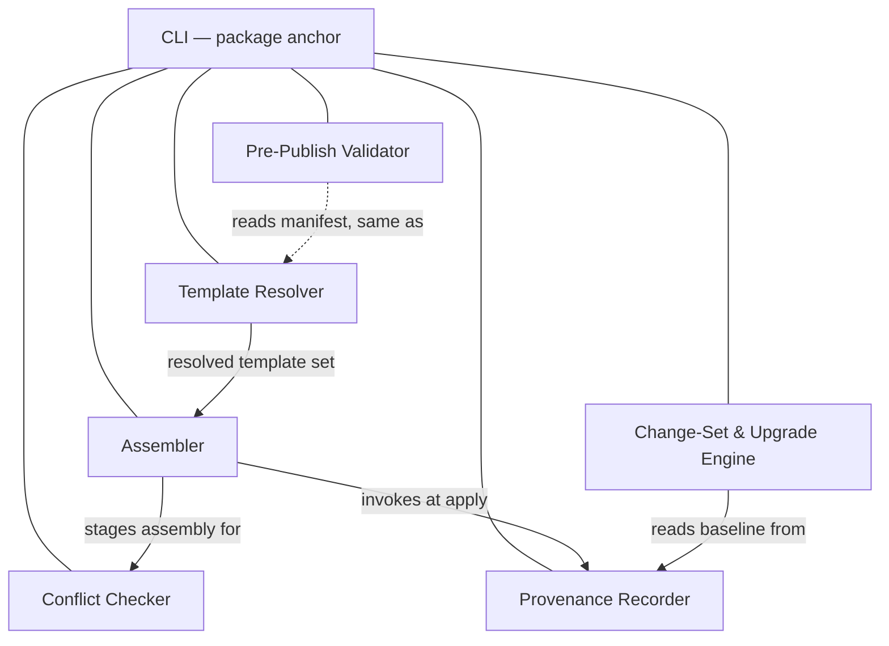

# Technical Design — Template Lifecycle CLI

- [ ] `p3` - **ID**: `cpt-frontx-cli-design-template-lifecycle-cli`

<!-- toc -->

- [1. Architecture Overview](#1-architecture-overview)
  - [1.1 Architectural Vision](#11-architectural-vision)
  - [1.2 Architecture Drivers](#12-architecture-drivers)
  - [1.3 Architecture Layers](#13-architecture-layers)
- [2. Principles & Constraints](#2-principles--constraints)
  - [2.1 Design Principles](#21-design-principles)
  - [2.2 Constraints](#22-constraints)
- [3. Technical Architecture](#3-technical-architecture)
  - [3.1 Domain Model](#31-domain-model)
  - [3.2 Component Model](#32-component-model)
  - [3.3 API Contracts](#33-api-contracts)
  - [3.4 Internal Dependencies](#34-internal-dependencies)
  - [3.5 External Dependencies](#35-external-dependencies)
  - [3.6 Interactions & Sequences](#36-interactions--sequences)
  - [3.7 Database schemas & tables](#37-database-schemas--tables)
- [4. Additional context](#4-additional-context)
- [5. Traceability](#5-traceability)

<!-- /toc -->

## 1. Architecture Overview

### 1.1 Architectural Vision

The CLI (`@gears-frontx/cli`) is the ecosystem's only place where a template's lifecycle happens, and it is deliberately built to know nothing about any specific template. It bundles zero template content: every template it installs, applies, or upgrades is resolved at runtime from an external source by a versioned reference, through exactly one shared resolver that every command reuses rather than reimplements. What a template is, allowed to be, and permitted to own is entirely declared — a template's manifest states its identity, its version, and the ownership boundaries it claims, and the CLI reads those declarations generically instead of special-casing any template's shape.

Because independently authored templates share one repository, the CLI treats every multi-template operation as something that must be checked before it is trusted. A pre-flight conflict check compares declared boundaries and refuses a colliding assembly before a single file is written, never silently merging two templates' claims. The same discipline governs change over time: an applied template's upgrade is computed as a reviewable, approvable change set against that template's own provenance record, applied non-destructively, and left reversible — never a silent, destructive rewrite, and never a whole-repository operation forced on templates that were not asked to move. The result is a command surface that stays decoupled from the content it scaffolds while making every mutation to a repository something a developer can see, approve, and undo.

### 1.2 Architecture Drivers

#### Functional Drivers

| Requirement | Design Response |
|-------------|------------------|
| `cpt-frontx-fr-cli-template-install` | `cpt-frontx-component-cli-template-resolver` resolves a versioned source-spec against the source registry and materializes the fetched template as tracked, addressable content in the local inventory, with zero template content bundled in the CLI distribution. |
| `cpt-frontx-fr-cli-template-list` | The template resolver reads the tracked inventory index and reports each installed template's identity and pinned version without touching the source registry. |
| `cpt-frontx-fr-cli-template-update-local` | The template resolver re-fetches a named entry by its recorded source-spec and replaces its materialized content in the inventory store only, leaving every scaffolded project untouched. |
| `cpt-frontx-fr-cli-template-validate-prepublish` | `cpt-frontx-component-cli-prepublish-validator` checks a candidate template's manifest and content against the manifest contract before publication, including that declared ownership boundaries are well-formed and self-contained. |
| `cpt-frontx-fr-cli-seed-repository` | `cpt-frontx-component-cli-assembler` applies a resolved template set to an empty target through the one uniform apply path, staging content before any write. |
| `cpt-frontx-fr-cli-add-template-to-repository` | The assembler drives the same uniform apply path against a repository that already holds applied templates, checking the new template's declared boundaries against those already occupied before writing its contribution. |
| `cpt-frontx-fr-cli-template-boundary-declaration` | The assembler and the conflict checker read a template's declared ownership boundaries — exclusive subtrees and shared-file regions with their merge strategy — from the manifest the resolver and the validator already read generically. |
| `cpt-frontx-fr-cli-assembly-conflict-prevention` | `cpt-frontx-component-cli-conflict-checker` runs a pre-flight intersection check over the staged assembly and refuses the whole assembly before any write when two templates claim the same ground, reporting the contesting templates and the contested ground. |
| `cpt-frontx-fr-cli-composed-template-resolution` | The assembler resolves a preset's referenced templates transitively into the set to apply in one operation, and `cpt-frontx-component-cli-provenance-recorder` writes one provenance record per applied template rather than a single whole-repository origin. |
| `cpt-frontx-fr-cli-project-upgrade-changeset` | `cpt-frontx-component-cli-change-set-engine` computes a version-transition diff for one applied template against that template's own provenance record, scoped to its occupied boundary, and applies it non-destructively and reversibly without touching the other applied templates. |
| `cpt-frontx-fr-cli-upgrade-review-approval` | The change-set engine presents the computed change set for explicit developer review and writes nothing to the repository until it is approved. |
| `cpt-frontx-fr-versioned-platform-evolution` | The CLI publishes on its own semver line under the ecosystem's per-concern independent versioning policy, so a breaking change to its command surface is bounded to its own major version rather than forcing a lockstep release of any other artifact. |
| `cpt-frontx-fr-no-architectural-ceiling` | The CLI imposes no structural cap on how many templates a repository composes or how many are tracked in the local inventory; growth is governed by performance thresholds, not by the resolver, assembler, or provenance mechanisms. |

#### NFR Allocation

| NFR ID | NFR Summary | Allocated To | Design Response | Verification Approach |
|--------|-------------|--------------|-----------------|-----------------------|
| `cpt-frontx-nfr-evolvability` | Versioned releases without lockstep upgrades | `cpt-frontx-component-cli-change-set-engine` | The single authoritative change-set engine applies a template-version transition as a reviewed, approvable, non-destructive and reversible change set computed against that applied template's own provenance record, so each applied template in a repository adopts a newer version on its own cadence without a forced, destructive rewrite; the reviewed change equals the applied change. | End-to-end upgrade test asserting the applied file set equals the approved change set, that a declined upgrade writes nothing, and that an applied upgrade is reversible. |
| `cpt-frontx-cli-nfr-no-ecosystem-coupling` | No intra-ecosystem edges; no bundled templates | The published package | The CLI's manifest declares no intra-ecosystem dependency, and every template is resolved from the source registry by versioned source-spec at runtime rather than bundled into the tool. | The boundary guards (`arch:edges`, `arch:deps`) hold the manifest and import graph to the orchestration layer's rules; template externalization is asserted by the resolution FEATURE's tests. |

**ADR coverage references:**

- `cpt-frontx-adr-artifact-versioning-and-distribution`
- `cpt-frontx-adr-template-acquisition-and-location`
- `cpt-frontx-adr-source-spec-syntax`
- `cpt-frontx-adr-template-manifest-contract`
- `cpt-frontx-adr-project-provenance-record`
- `cpt-frontx-adr-composed-template-resolution`
- `cpt-frontx-adr-project-upgrade-mechanism`
- `cpt-frontx-adr-contract-schema-ownership`
- `cpt-frontx-adr-cli-internal-decomposition`
- `cpt-frontx-adr-uniform-template-mechanism`
- `cpt-frontx-adr-template-ownership-boundary-declaration`
- `cpt-frontx-adr-assembly-conflict-prevention`

### 1.3 Architecture Layers

- [x] `p3` - **ID**: `cpt-frontx-cli-tech-cli-stack`



| Layer | Responsibility | Technology |
|-------|---------------|------------|
| Public surface | The library entry point and the `frontx` executable bin, dispatching every command to the internal component that owns its behavior | TypeScript, single entry point + declared `bin` |
| Command surface | Argv parsing, command dispatch, usage/help output, exit-code mapping | TypeScript, one dispatch path over the uniform template mechanism |
| Lifecycle components | Resolution, pre-publish validation, assembly, conflict checking, provenance, change-set & upgrade | TypeScript modules, each a single-responsibility internal component |
| Local persistence | Tracked template inventory and in-repository provenance records | Filesystem — inventory store and `.frontx/provenance.json` |

## 2. Principles & Constraints

### 2.1 Design Principles

#### Every Mutation Is Computed, Reviewed, and Reversible

- [x] `p2` - **ID**: `cpt-frontx-cli-principle-reviewed-reversible-mutation`

No component in this package writes a repository file before its gate has passed. The assembler stages every template's contribution and the conflict checker's pass/refuse verdict as values, and stops short of any write until that verdict clears the staged assembly — so scaffolding writes only behind a passed pre-flight check. The change-set engine computes a diff as a value, presents it for explicit approval, and only then applies it — retaining a pre-upgrade snapshot so the mutation can be undone.

This matters because independently authored templates and independently timed upgrades are both operations a developer cannot fully predict from the command line alone. Making "compute, review, then mutate" structural rather than a convention is what lets a refused assembly leave zero files written and a declined upgrade leave the repository byte-for-byte unchanged — the guarantee holds because there is no code path that skips the review step, not because every caller remembers to check first.

#### Template-agnostic tooling

- [x] `p2` - **ID**: `cpt-frontx-principle-template-agnostic-tooling`

The CLI carries no bundled template or solution content. It resolves templates by versioned source-spec at runtime and applies every conforming template through the same lifecycle path.

#### Reviewable, non-destructive lifecycle

- [ ] `p2` - **ID**: `cpt-frontx-principle-reviewable-lifecycle`

CLI repository mutations are computed before they are applied. Scaffolding is gated by conflict checks, and upgrades are represented as reviewable change sets before files are written.

#### Ownership-bounded composition

- [ ] `p2` - **ID**: `cpt-frontx-principle-ownership-bounded-composition`

Every template declares the repository ground it owns. The CLI compares those declarations before materialization so independently authored templates can compose without silent multi-writer conflict.

### 2.2 Constraints

#### CLI-1 — Template independence of the CLI

- [x] `p2` - **ID**: `cpt-frontx-constraint-cli-template-independence`

The CLI (`@gears-frontx/cli`) has zero dependency on any template. It resolves templates by source-spec at runtime and bundles none, so the command surface is fully decoupled from the content it scaffolds.

**ADRs**: [Template Acquisition and Location](../../../architecture/ADR/0016-template-acquisition-and-location.md)

#### CLI-2 — One authoritative shared resolver

- [x] `p2` - **ID**: `cpt-frontx-constraint-cli-shared-resolver`

The CLI resolves templates through exactly one resolver, shared across every template application and assembly; no command carries its own divergent resolution path. Acquisition by source-spec and transitive preset reference resolution are owned by the single template-resolver component, so resolution behavior cannot drift by command. CI-enforceable invariant: every application and assembly routes acquisition and preset resolution through the one resolver component and no second resolution implementation exists.

**ADRs**: [Template Acquisition and Location](../../../architecture/ADR/0016-template-acquisition-and-location.md), [One Monolithic CLI Component Fuses Six Distinct Lifecycle Responsibilities](../../../architecture/ADR/0028-cli-internal-decomposition.md)

#### CLI-3 — Single authoritative change-set engine

- [ ] `p2` - **ID**: `cpt-frontx-constraint-cli-authoritative-change-set`

Every applied-template upgrade is computed and applied by exactly one change-set engine; there is no second path that mutates a repository. The set of changes a developer reviews and approves is identical to the set the engine applies — the reviewed change equals the applied change. CI-enforceable invariant: an upgrade test asserts the applied file set equals the approved change set, with no mutation reaching the repository outside the engine.

**ADRs**: [The Per-Applied-Template Upgrade Mechanism](../../../architecture/ADR/0021-project-upgrade-mechanism.md), [One Monolithic CLI Component Fuses Six Distinct Lifecycle Responsibilities](../../../architecture/ADR/0028-cli-internal-decomposition.md)

#### CLI-4 — Non-destructive, reversible upgrade

- [ ] `p2` - **ID**: `cpt-frontx-constraint-cli-non-destructive-upgrade`

An approved upgrade is applied non-destructively and can be reversed; a declined upgrade writes nothing and leaves the repository unchanged. The engine never performs an in-place destructive rewrite that a developer cannot undo. CI-enforceable invariant: an end-to-end test asserts a declined upgrade produces no file changes and an applied upgrade is reversible to the pre-upgrade state.

**ADRs**: [The Per-Applied-Template Upgrade Mechanism](../../../architecture/ADR/0021-project-upgrade-mechanism.md)

#### CLI-5 — Declared template ownership boundaries

- [ ] `p2` - **ID**: `cpt-frontx-constraint-cli-boundary-declaration`

Every template declares the boundaries of what it owns in its manifest — the exclusive subtrees it alone creates or modifies, and, for each shared file it writes into, the keys or regions it owns together with the merge by which its contribution combines with others'. Pre-publish validation checks the declaration is well-formed. CI-enforceable invariant: pre-publish validation rejects a template whose ownership-boundary declaration is malformed, and no template writes shared-file content it did not declare a region for.

**ADRs**: [How a Template Declares the Boundaries of What It Owns](../../../architecture/ADR/0031-template-ownership-boundary-declaration.md), [Template Manifest as the Published Conformance Contract](../../../architecture/ADR/0018-template-manifest-contract.md)

#### CLI-6 — Pre-flight assembly-conflict prevention

- [ ] `p2` - **ID**: `cpt-frontx-constraint-cli-assembly-conflict-prevention`

When one or more templates are applied to a repository, a pre-flight intersection check compares the applied templates' declared ownership boundaries over the staged assembly and refuses the whole assembly before any file is written if two templates claim the same exclusive subtree or the same shared-file region; conflicting claims are never silently merged. A post-materialization guard verifies each template wrote only within its declared boundary. CI-enforceable invariant: an assembly of two boundary-intersecting templates is refused with zero files written, and a template writing outside its declared boundary is caught by the honesty guard.

**ADRs**: [Detecting and Preventing Conflicting Assembly Before Any Files Are Written](../../../architecture/ADR/0032-assembly-conflict-prevention.md), [How a Template Declares the Boundaries of What It Owns](../../../architecture/ADR/0031-template-ownership-boundary-declaration.md)

#### CLI-7 — Per-applied-template provenance

- [ ] `p2` - **ID**: `cpt-frontx-constraint-cli-per-template-provenance`

A repository carries one provenance record per applied template, each capturing that template's identity, applied-from version, source-spec, and occupied boundary; there is no single whole-repository origin record. A per-template upgrade reads and updates only the record of the template it upgrades. CI-enforceable invariant: assembling from N templates writes N provenance records, and upgrading one applied template updates only its own record while the others are unchanged.

**ADRs**: [Per-Applied-Template Provenance for Independently Upgradeable Assembly](../../../architecture/ADR/0019-project-provenance-record.md)

## 3. Technical Architecture

### 3.1 Domain Model

| Entity | Definition | Representation |
|--------|------------|----------------|
| Template | An externally hosted, versioned unit resolved by source-spec at runtime and bundled into no tool; it defines what it produces and declares the boundaries of what it owns, and may reference other templates to be applied together as a preset. | Target — template repository content; reference format owned by [Source-Spec Syntax for Versioned Template References](../../../architecture/ADR/0017-source-spec-syntax.md), identity by [Template Manifest as the Published Conformance Contract](../../../architecture/ADR/0018-template-manifest-contract.md) |
| TemplateManifest | The descriptor every publishable template exposes in a defined shape — its identity, version, declared ownership boundaries, and referenced templates — produced at pre-publish validation and consumed at install, apply, and assembly. | Manifest file (`frontx-template.json`) — role owned by this DESIGN, decision by [Template Manifest as the Published Conformance Contract](../../../architecture/ADR/0018-template-manifest-contract.md), concrete schema owned by [features/template-manifest/FEATURE.md](features/template-manifest/FEATURE.md) |
| OwnershipBoundary | A template's declaration of the ground it owns: the exclusive subtrees it alone writes and, per shared file, the keys or regions it owns with a declared merge; compared across applied templates to detect a conflicting assembly. | Declared in the manifest — role owned by this DESIGN, decision by [How a Template Declares the Boundaries of What It Owns](../../../architecture/ADR/0031-template-ownership-boundary-declaration.md), concrete schema owned by [features/template-manifest/FEATURE.md](features/template-manifest/FEATURE.md) |
| Assembly | A repository composed from one or more independently-applied templates, including a preset's transitively-referenced templates, whose declared boundaries are checked for intersection before any files are written. | Materialized repository content; assembled per [Multi-Template Assembly and Preset Reference Resolution](../../../architecture/ADR/0020-composed-template-resolution.md) and [Detecting and Preventing Conflicting Assembly Before Any Files Are Written](../../../architecture/ADR/0032-assembly-conflict-prevention.md) |
| ProjectProvenance | The set of records written into a repository — one per applied template — each capturing that template's identity, applied-from version, source-spec, and occupied boundary, so a later per-template upgrade can determine what to apply. | In-repository provenance records, one per applied template, at `.frontx/provenance.json` — role owned by this DESIGN, decision by [Per-Applied-Template Provenance for Independently Upgradeable Assembly](../../../architecture/ADR/0019-project-provenance-record.md), concrete schema owned by [features/composed-provenance/FEATURE.md](features/composed-provenance/FEATURE.md) |

**Relationships**:

- Template → TemplateManifest: declares its published shape, ownership boundaries, and referenced templates through a manifest.
- TemplateManifest → OwnershipBoundary: the manifest carries the template's ownership-boundary declaration.
- Template → Template: a preset references other templates to be applied together, resolved transitively.
- Assembly → Template: a repository is assembled from one or more applied templates, including a preset's referenced templates.
- Assembly → OwnershipBoundary: the applied templates' declared boundaries are compared pairwise before any write.
- ProjectProvenance → Template: each provenance record names the template and applied-from version of one applied template.

### 3.2 Component Model

#### CLI

- [ ] `p2` - **ID**: `cpt-frontx-component-cli`

Concrete artifact: `@gears-frontx/cli`.

##### Why this component exists

Project Developers and the AI agents acting for them need to drive the full template and repository lifecycle — acquiring templates, applying them to seed or extend a repository, resolving presets, checking assembly for conflicts, recording per-applied-template provenance, and upgrading each applied template — from a single, predictable command surface that is decoupled from the templates it operates on. This component is the package-level anchor for `@gears-frontx/cli`: it owns the command surface, organized by lifecycle capability, and delegates each concern to one internal component, so the package reads as a set of single-responsibility parts rather than one fused unit ([One Monolithic CLI Component Fuses Six Distinct Lifecycle Responsibilities](../../../architecture/ADR/0028-cli-internal-decomposition.md)).

##### Responsibility scope

- Owns the command surface, organized by lifecycle capability — install / list / update / validate a template; apply a template to seed a repository; add a template into an existing repository; assemble with a pre-flight conflict check; upgrade an applied template — dispatching each command to the owning internal component through one uniform mechanism that operates over any template ([Whether the Platform Classifies Templates or Applies Any Template Uniformly](../../../architecture/ADR/0030-uniform-template-mechanism.md)).
- Composes the internal components — template resolver, pre-publish validator, assembler, conflict checker, provenance recorder, and change-set-&-upgrade engine — into the lifecycle the command surface exposes.
- Holds the package's template-independence guarantee: it resolves templates by versioned source-spec at runtime and bundles none (CLI-1).

##### Responsibility boundaries

- Owns no lifecycle mechanism directly; acquisition, validation, assembly, conflict checking, provenance, and upgrade are each owned by the corresponding internal component below.
- The command surface operates identically over any template through one uniform mechanism ([Whether the Platform Classifies Templates or Applies Any Template Uniformly](../../../architecture/ADR/0030-uniform-template-mechanism.md)).
- Does not own the runtime mechanisms an assembled application uses (registration, type validation, communication) — those belong to the published libraries.
- Does not own AI-driven orchestration of upgrades; that is layered above the change-set engine by the AI Tooling kit and not duplicated here.

##### Related components (by ID)

- `cpt-frontx-component-cli-template-resolver` — composes (delegates template acquisition and preset resolution to).
- `cpt-frontx-component-cli-prepublish-validator` — composes (delegates pre-publish structure and boundary validation to).
- `cpt-frontx-component-cli-assembler` — composes (delegates multi-template assembly and materialization to).
- `cpt-frontx-component-cli-conflict-checker` — composes (delegates pre-flight conflict checking and the boundary-honesty guard to).
- `cpt-frontx-component-cli-provenance-recorder` — composes (delegates per-applied-template provenance write/read to).
- `cpt-frontx-component-cli-change-set-engine` — composes (delegates per-applied-template upgrade computation and application to).
- No intra-ecosystem package dependency. It operates on external templates that target the published libraries, with no compile-time coupling to any of them.

#### CLI Template Resolver

- [x] `p2` - **ID**: `cpt-frontx-component-cli-template-resolver`

Internal component of `@gears-frontx/cli`.

##### Why this component exists

The CLI owns no template, so a single component must turn a versioned source-spec into resolved template content and resolve a preset's referenced templates transitively. Concentrating all resolution in one component is what lets every template application and assembly share one authoritative resolution path rather than each command carrying its own (CLI-2).

##### Responsibility scope

- Owns template acquisition by versioned source-spec (install), local listing of installed templates, and local update of the installed template store without touching any repository ([Template Acquisition and Location](../../../architecture/ADR/0016-template-acquisition-and-location.md), [Source-Spec Syntax for Versioned Template References](../../../architecture/ADR/0017-source-spec-syntax.md)).
- Owns transitive preset reference resolution, resolving the referenced templates a preset declares into the set to apply in one operation, with cycle detection ([Multi-Template Assembly and Preset Reference Resolution](../../../architecture/ADR/0020-composed-template-resolution.md)).
- Reads the template manifest role to learn a template's identity, declared ownership boundaries, and referenced templates.

##### Responsibility boundaries

- Bundles no template (CLI-1); is the one shared resolver across every application and assembly (CLI-2).
- Resolves any template through the same path ([Whether the Platform Classifies Templates or Applies Any Template Uniformly](../../../architecture/ADR/0030-uniform-template-mechanism.md)).
- Does not materialize files into a repository (assembler), check boundaries for conflict (conflict checker), record provenance (provenance recorder), validate a candidate template for publication (pre-publish validator), or apply upgrades (change-set engine).

##### Related components (by ID)

- `cpt-frontx-component-cli` — internal component of (composed by).
- `cpt-frontx-component-cli-assembler` — provides the resolved set of templates to.
- `cpt-frontx-component-cli-prepublish-validator` — shares template-manifest reading with.

#### CLI Pre-Publish Validator

- [x] `p2` - **ID**: `cpt-frontx-component-cli-prepublish-validator`

Internal component of `@gears-frontx/cli`.

##### Why this component exists

A template must be checked against the manifest publication contract before it is published, so a structurally malformed template is caught by its author rather than by a consumer. This component is that pre-publish conformance check.

##### Responsibility scope

- Owns pre-publish template-structure validation against the template-manifest contract (`cpt-frontx-contract-template-manifest`), including that the template's declared ownership boundaries are well-formed and that the content those boundaries own is self-contained (no detected reference in registered, structurally parsed carriers resolving outside the template root), producing a structural pass/fail conformance result ([Template Manifest as the Published Conformance Contract](../../../architecture/ADR/0018-template-manifest-contract.md), [How a Template Declares the Boundaries of What It Owns](../../../architecture/ADR/0031-template-ownership-boundary-declaration.md)).

##### Responsibility boundaries

- Reads the manifest contract role only; the concrete manifest schema it checks against is owned by `cpt-frontx-feature-template-manifest`, per [Concrete Contract Schemas Left Unowned by Circular DESIGN-ADR Deferral](../../../architecture/ADR/0027-contract-schema-ownership.md).
- Does not acquire, resolve, assemble, or upgrade.

##### Related components (by ID)

- `cpt-frontx-component-cli` — internal component of (composed by).
- `cpt-frontx-component-cli-template-resolver` — shares template-manifest reading with.

#### CLI Assembler

- [ ] `p2` - **ID**: `cpt-frontx-component-cli-assembler`

Internal component of `@gears-frontx/cli`.

##### Why this component exists

The resolved set of templates must be materialized into a repository on disk — whether seeding a new repository or extending an existing one — assembling one or more templates, including a preset's referenced templates, in a single operation.

##### Responsibility scope

- Owns assembly and materialization of the resolved template set into a repository, seeding a new repository (`cpt-frontx-fr-cli-seed-repository`) or adding into an existing one (`cpt-frontx-fr-cli-add-template-to-repository`), composing a preset's referenced templates in one operation ([Multi-Template Assembly and Preset Reference Resolution](../../../architecture/ADR/0020-composed-template-resolution.md), [Whether the Platform Classifies Templates or Applies Any Template Uniformly](../../../architecture/ADR/0030-uniform-template-mechanism.md)).
- Stages the assembly's intended writes for the conflict checker and, only after the check passes, materializes them and composes any shared files per their declared merges.
- Triggers per-applied-template provenance recording as the final step of an apply.

##### Responsibility boundaries

- Does not acquire or resolve templates (template resolver) and does not own the provenance records' shape or write logic (provenance recorder).
- Does not decide whether an assembly conflicts (conflict checker); it writes nothing until the pre-flight check passes.
- Does not apply upgrades to an already-applied template (change-set engine).

##### Related components (by ID)

- `cpt-frontx-component-cli` — internal component of (composed by).
- `cpt-frontx-component-cli-template-resolver` — consumes the resolved template set from.
- `cpt-frontx-component-cli-conflict-checker` — submits the staged assembly to before writing.
- `cpt-frontx-component-cli-provenance-recorder` — invokes to record each applied template's origin at apply time.

#### CLI Conflict Checker

- [ ] `p2` - **ID**: `cpt-frontx-component-cli-conflict-checker`

Internal component of `@gears-frontx/cli`.

##### Why this component exists

Independently-authored templates write into one repository, so two can claim the same ground. This component detects a conflicting assembly before any file is written and prevents it, so a repository is never corrupted or silently clobbered by two templates fighting over the same ground.

##### Responsibility scope

- Owns the pre-flight intersection check over the staged assembly: it compares the declared ownership boundaries of every pair of applied templates and refuses the whole assembly before any write if two claim the same exclusive subtree or the same shared-file region without a compatible declared merge, reporting the contesting templates and the contested ground and never silently merging ([Detecting and Preventing Conflicting Assembly Before Any Files Are Written](../../../architecture/ADR/0032-assembly-conflict-prevention.md), [How a Template Declares the Boundaries of What It Owns](../../../architecture/ADR/0031-template-ownership-boundary-declaration.md)).
- Owns the post-materialization boundary-honesty guard that verifies each template wrote only within its declared boundary (CLI-6).

##### Responsibility boundaries

- Reads the declared ownership boundaries from the manifest role only; the concrete boundary schema is owned by `cpt-frontx-feature-template-manifest`, per [Concrete Contract Schemas Left Unowned by Circular DESIGN-ADR Deferral](../../../architecture/ADR/0027-contract-schema-ownership.md).
- Does not resolve or acquire templates (template resolver) and does not itself write files (assembler); it renders a pass/refuse verdict.

##### Related components (by ID)

- `cpt-frontx-component-cli` — internal component of (composed by).
- `cpt-frontx-component-cli-assembler` — checks the staged assembly for, and gates the write of.

#### CLI Provenance Recorder

- [ ] `p2` - **ID**: `cpt-frontx-component-cli-provenance-recorder`

Internal component of `@gears-frontx/cli`.

##### Why this component exists

A per-template upgrade needs a self-contained origin baseline that travels with the repository; each applied template must record which template and version it was applied from, and its upgrade must read that record to establish its diff baseline.

##### Responsibility scope

- Owns writing one in-repository provenance record per applied template (`cpt-frontx-contract-project-provenance`) at apply time and reading and updating the matching record at that template's upgrade time as the diff baseline ([Per-Applied-Template Provenance for Independently Upgradeable Assembly](../../../architecture/ADR/0019-project-provenance-record.md)).

##### Responsibility boundaries

- Owns the provenance records' role and their write-at-apply / read-and-update-at-upgrade lifecycle placement, one record per applied template with no single whole-repository origin (CLI-7); the concrete record schema and storage are owned by `cpt-frontx-feature-composed-provenance`, per [Concrete Contract Schemas Left Unowned by Circular DESIGN-ADR Deferral](../../../architecture/ADR/0027-contract-schema-ownership.md).
- Does not compute or apply the upgrade diff (change-set engine) and does not resolve or assemble templates.

##### Related components (by ID)

- `cpt-frontx-component-cli` — internal component of (composed by).
- `cpt-frontx-component-cli-assembler` — invoked by at apply time to record each applied template's origin.
- `cpt-frontx-component-cli-change-set-engine` — supplies the matching origin baseline to.

#### CLI Change-Set & Upgrade Engine

- [ ] `p2` - **ID**: `cpt-frontx-component-cli-change-set-engine`

Internal component of `@gears-frontx/cli`.

##### Why this component exists

Upgrading an applied template to a newer version must be reviewable and safe rather than a silent, destructive rewrite, and must leave the other applied templates untouched. This component is the single authoritative engine that, for one applied template, computes a change set against that template's provenance record, gates it behind explicit review and approval, and applies it non-destructively — the mechanism the AI Tooling Framework orchestrates rather than reimplements.

##### Responsibility scope

- Owns computing the change set for one applied template's version transition against that template's recorded provenance baseline, gating application behind explicit review and approval, and applying the approved set non-destructively and reversibly within that template's boundary, leaving the other applied templates unchanged ([The Per-Applied-Template Upgrade Mechanism](../../../architecture/ADR/0021-project-upgrade-mechanism.md)).
- Is the one authoritative change-set engine in the ecosystem; the reviewed change equals the applied change (CLI-3, CLI-4).

##### Responsibility boundaries

- Reads the provenance baseline from the provenance recorder; does not itself resolve or acquire templates (template resolver).
- Contains no AI workflow logic; AI-driven review, change-impact, and downstream-effect analysis are layered above it by the AI Tooling kit's upgrade-orchestration component, which orchestrates and does not reimplement this engine (KIT-3).

##### Related components (by ID)

- `cpt-frontx-component-cli` — internal component of (composed by).
- `cpt-frontx-component-cli-provenance-recorder` — reads the origin baseline from.
- `cpt-frontx-component-ai-upgrade-orchestration` — orchestrated by (for AI-driven upgrades).

### 3.3 API Contracts

- [x] `p2` - **ID**: `cpt-frontx-cli-interface-package-entry`

- **Contracts**: `cpt-frontx-interface-cli` (the executable command surface this package publishes), `cpt-frontx-contract-source-spec`, `cpt-frontx-contract-template-manifest`, `cpt-frontx-contract-project-provenance`, `cpt-frontx-contract-package-registry-distribution`
- **Technology**: TypeScript library API with declarations, plus a declared `bin` executable entry point built to run standalone
- **Location**: [src/index.ts](../src/index.ts) (library surface); `dist/cli.js` (the `frontx` executable named in `package.json`'s `bin`)

| Public surface | Purpose |
|----------------|---------|
| `installCommand`, `listCommand`, `updateLocalCommand`, `parseSourceSpec`, `resolveToInventory`, `TemplateInventory`, `InventoryIndex`, `InventoryStore` | Template acquisition by versioned source-spec, local inventory listing, and bounded local update through the one shared resolver. |
| `validateCommand`, `validateManifestContract`, `readManifestFromContent`, `validateContentSelfContainment` | Pre-publish structure validation against the manifest contract, including ownership-boundary well-formedness and content self-containment. |
| `seedRepository`, `addTemplate`, `scaffoldComposedProject`, `uniformApply`, `runAssemblyOp`, `materializeAssembly`, `composeSharedFiles` | The one uniform apply path — seeding a repository or adding a template into an existing one — including shared-file region composition from owned regions. |
| `checkAssemblyConflicts`, `resolveComposition` | The pre-flight boundary-intersection check over a staged assembly, and preset (referenced-template) resolution. |
| `writeProvenance`, `PROVENANCE_RELATIVE_PATH`, `provenancePath` | Per-applied-template provenance record write and the record's fixed repository location. |
| `upgradeCommand`, `upgradeChangeSetReviewApproval`, `computeChangeSet`, `applyChangeSet`, `rollbackChangeSet` | The single change-set engine: compute a version-transition diff, gate it behind review and approval, apply it non-destructively, and roll it back. |
| `frontx` (declared `bin`) | The executable entrypoint that parses `frontx <command> [args]` and dispatches to the library surface above through one uniform mechanism. |

**The contract to templates.** This package's artifacts own the ecosystem's contract to templates; the three contracts moved here from the root DESIGN with roles unchanged. Per [Concrete Contract Schemas Left Unowned by Circular DESIGN-ADR Deferral](../../../architecture/ADR/0027-contract-schema-ownership.md), DESIGN owns each contract's role, the named ADR owns the decision rationale, and — where the contract carries a concrete field-level schema — the named FEATURE owns that schema.

- **Source-spec** (`cpt-frontx-contract-source-spec`): a versioned reference that identifies a template on the source registry, resolved generically without prescribing a fixed syntax at requirement altitude. Stability: compatible across minor and patch versions; breaking changes follow `cpt-frontx-nfr-evolvability`. **ADRs**: [Template Acquisition and Location](../../../architecture/ADR/0016-template-acquisition-and-location.md), [Source-Spec Syntax for Versioned Template References](../../../architecture/ADR/0017-source-spec-syntax.md).
- **Template manifest** (`cpt-frontx-contract-template-manifest`): the descriptor every template publishes in a defined shape — its identity, version, declared ownership boundaries, and referenced templates — produced when a template is validated for publication (pre-publish validator) and consumed when it is installed, applied, or assembled (template resolver, assembler, conflict checker). Stability: versioned with the platform; non-backward-compatible changes follow `cpt-frontx-nfr-evolvability`. Concrete schema owned by `cpt-frontx-feature-template-manifest`. **ADRs**: [Template Manifest as the Published Conformance Contract](../../../architecture/ADR/0018-template-manifest-contract.md), [How a Template Declares the Boundaries of What It Owns](../../../architecture/ADR/0031-template-ownership-boundary-declaration.md), [Concrete Contract Schemas Left Unowned by Circular DESIGN-ADR Deferral](../../../architecture/ADR/0027-contract-schema-ownership.md).
- **Project provenance** (`cpt-frontx-contract-project-provenance`): the set of records written into a repository (provenance recorder), one per applied template, each capturing that template's identity, applied-from version, source-spec, and occupied boundary so a later per-template upgrade (change-set engine) can determine what to apply; there is no single whole-repository origin. Stability: readable across versions; non-backward-compatible changes follow `cpt-frontx-nfr-evolvability`. Concrete schema owned by `cpt-frontx-feature-composed-provenance`. **ADRs**: [Per-Applied-Template Provenance for Independently Upgradeable Assembly](../../../architecture/ADR/0019-project-provenance-record.md), [Concrete Contract Schemas Left Unowned by Circular DESIGN-ADR Deferral](../../../architecture/ADR/0027-contract-schema-ownership.md).

### 3.4 Internal Dependencies

None. The package declares no runtime dependency in its manifest and imports no other package in this ecosystem — it operates on externally resolved template content that targets the published libraries, with no compile-time coupling to them ([Template Acquisition and Location](../../../architecture/ADR/0016-template-acquisition-and-location.md)).

**Dependency Rules** (per project conventions):
- No circular dependencies at the design level
- No intra-ecosystem package import from this package's source
- No import of any specific template's content

### 3.5 External Dependencies

#### GitHub source registry

| Dependency Module | Interface Used | Purpose |
|-------------------|----------------|---------|
| GitHub source registry (`cpt-frontx-actor-github`) | versioned source-spec fetch | Hosts the templates this package resolves and fetches by versioned source-spec at runtime ([Template Acquisition and Location](../../../architecture/ADR/0016-template-acquisition-and-location.md), [Source-Spec Syntax for Versioned Template References](../../../architecture/ADR/0017-source-spec-syntax.md)). |

This dependency is shared with the AI Tooling Framework, which resolves its own kit content from the same registry through the AI tooling CLI integration rather than through this package's source-spec mechanism; this package's ownership of the registry is limited to template resolution.

#### npm package registry

| Dependency Module | Interface Used | Purpose |
|-------------------|----------------|---------|
| npm package registry (`cpt-frontx-actor-package-registry`) | package publish/install | Distributes this package under the ecosystem's per-concern independent versioning policy; consumers install it with their chosen package manager ([Artifact Versioning and Distribution Across the Ecosystem](../../../architecture/ADR/0001-artifact-versioning-and-distribution.md)). |

This dependency is not specific to the CLI: every published ecosystem package is distributed through it as the same channel.

**Dependency Rules** (per project conventions):
- No circular dependencies between components and external systems
- Only the template resolver talks to the source registry; no other internal component fetches from it directly

### 3.6 Interactions & Sequences

#### Upgrade change-set compute, review, and apply

- [x] `p3` - **ID**: `cpt-frontx-cli-seq-upgrade-review-apply`

**Use cases**: `cpt-frontx-usecase-ai-driven-template-upgrade`

**Actors**: `cpt-frontx-actor-project-developer`

```mermaid
sequenceDiagram
    participant Dev as Project Developer
    participant Eng as Change-Set & Upgrade Engine
    participant Prov as Provenance Recorder
    participant Res as Template Resolver
    Dev->>Eng: upgrade <applied template> [--to <version>]
    Eng->>Prov: read provenance record (identity, baseline version, source-spec, boundary)
    Prov-->>Eng: provenance record
    Eng->>Res: resolve baseline version via recorded source-spec
    Res-->>Eng: baseline content
    Eng->>Res: resolve target version via same source-spec
    Res-->>Eng: target content
    Eng->>Eng: diff within occupied boundary; flag local-modification conflicts
    Eng-->>Dev: present reviewable change set
    alt developer approves
        Dev->>Eng: approve
        Eng->>Eng: snapshot pre-upgrade state; apply entries within boundary
        Eng->>Prov: update record to new version
        Eng-->>Dev: applied; rollback retained
    else developer declines
        Dev->>Eng: decline
        Eng-->>Dev: no files written; version unchanged
    end
```

**Description**: The engine never mutates a repository as a side effect of being invoked. It first re-resolves both the recorded baseline and the requested target version through the same shared resolver the rest of the package uses — never from the local inventory, which retains only one version per entry — and computes a diff scoped to the selected template's own occupied boundary, flagging any file the developer has locally modified as a conflict rather than silently overwriting it. Only after the developer approves does it snapshot the pre-upgrade state, apply the approved entries, and update that template's provenance record; a decline leaves the repository byte-for-byte unchanged, and an applied upgrade remains reversible from the retained snapshot. The other applied templates in the repository are never read or touched by this path.

#### Multi-template assembly with pre-flight conflict check

- [ ] `p1` - **ID**: `cpt-frontx-seq-composed-project-scaffold`

**Use cases**: `cpt-frontx-usecase-scaffold-composed-project`

**Actors**: `cpt-frontx-actor-project-developer`, `cpt-frontx-actor-github` (the FrontX CLI, `@gears-frontx/cli`, is the executing system)

```mermaid
sequenceDiagram
    participant Dev as Project Developer
    participant CLI as CLI (@gears-frontx/cli)
    participant GH as GitHub source registry
    participant Chk as Conflict checker
    participant Repo as Repository
    Dev->>CLI: install + apply template(s) / preset (versioned source-spec)
    CLI->>GH: resolve template(s) + a preset's referenced templates by reference
    alt registry reachable and references resolvable
        GH-->>CLI: template content
        CLI->>CLI: resolve preset references transitively (cycle-detected)
        CLI->>Chk: stage assembly; pre-flight intersection check over declared boundaries
        alt boundaries do not intersect
            Chk-->>CLI: no conflict
            CLI->>Repo: materialize assembly (composing co-owned shared files from owned regions), incl. .frontx/ai/ bundles; write one provenance record per applied template
            CLI-->>Dev: assembled repository (AI bundles discovered later by the Kit on its own invocation)
        else two templates claim the same ground
            Chk-->>CLI: conflict (contesting templates + contested ground)
            CLI-->>Dev: report and refuse assembly; abort without writing files
        end
    else registry unreachable or reference unresolvable
        GH-->>CLI: error
        CLI-->>Dev: report failure; abort without writing files
    end
```

**Description**: The CLI installs and applies one or more templates by versioned source-spec, resolving a preset's referenced templates transitively in one operation with cycle detection; it stages the whole assembly and runs a pre-flight intersection check comparing the applied templates' declared ownership boundaries before writing anything. Only if no two templates claim the same ground does it materialize the assembly — composing any shared file co-owned by more than one template from each template's disjoint owned regions, located by identity-scoped region markers — write one provenance record per applied template, and write each template's `.frontx/ai/<template-identity>/` extension bundle into the project as owned content ([Template Acquisition and Location](../../../architecture/ADR/0016-template-acquisition-and-location.md), [Source-Spec Syntax for Versioned Template References](../../../architecture/ADR/0017-source-spec-syntax.md), [Multi-Template Assembly and Preset Reference Resolution](../../../architecture/ADR/0020-composed-template-resolution.md), [Detecting and Preventing Conflicting Assembly Before Any Files Are Written](../../../architecture/ADR/0032-assembly-conflict-prevention.md), [Per-Applied-Template Provenance for Independently Upgradeable Assembly](../../../architecture/ADR/0019-project-provenance-record.md), [How a Template Declares the Boundaries of What It Owns](../../../architecture/ADR/0031-template-ownership-boundary-declaration.md)). Activation is out of band: the AI Tooling Framework discovers and activates those bundles on its own invocation by scanning `.frontx/ai/` (§3.4, [Discovery and Activation of Installed-Template AI Extensions](../../../architecture/ADR/0024-extension-discovery-activation.md)), so the CLI sends it no signal. The concrete region-addressing and merge-strategy schema is owned by the CLI FEATUREs, not by DESIGN. If the source registry is unreachable, a reference is unresolvable, or the conflict check detects an intersection, the CLI reports the failure and refuses the assembly before writing any files, never silently merging.

### 3.7 Database schemas & tables

Not applicable. The package holds no database. Its persistence is entirely file-based: the tracked local template inventory the resolver materializes on disk, and the per-applied-template provenance records at `.frontx/provenance.json` in a scaffolded repository — both documented as entities in §3.1 and given their concrete field-level schemas by the template-resolution and composed-provenance FEATUREs respectively.

## 4. Additional context

This package is the second member registered under the ecosystem's artifact-federation refactoring, and the largest by component count: its seven internal components — the anchor plus six single-responsibility internals — are all moved here verbatim from the root DESIGN, so their identifiers are unchanged and every existing citation from the root DECOMPOSITION and this package's own FEATUREs continues to resolve. The sequence authored first in this member stays entirely inside this package's own components; the restored assembly sequence records the CLI-owned portion of the cross-package flow while leaving AI extension activation to the kit member.

## 5. Traceability

- **Features**: [features/](./features/)
- **Root chain**: [PRD](../../../architecture/PRD.md), [DESIGN](../../../architecture/DESIGN.md), [DECOMPOSITION](../../../architecture/DECOMPOSITION.md)

This package's requirements are owned by its own [PRD](./PRD.md), per the 3-layer model: each member explains its own reqs, and the root PRD describes the layers and the requirements binding every member equally. The design elements that moved here from the root DESIGN under the artifact-federation refactoring keep their identifiers unchanged, so citations from the root DECOMPOSITION and this package's FEATUREs resolve as before.
