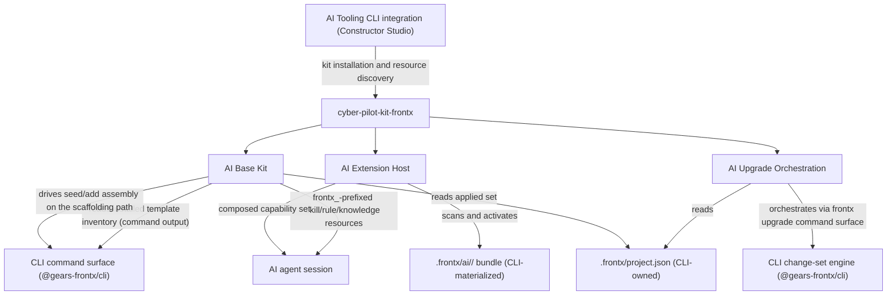
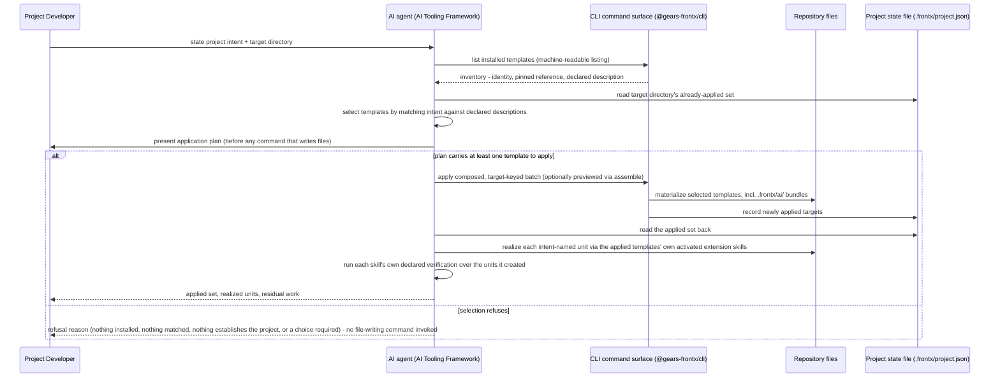

# Technical Design — AI Tooling Kit

- [ ] `p3` - **ID**: `cpt-frontx-cyber-pilot-kit-frontx-design-ai-tooling-kit`

<!-- toc -->

- [1. Architecture Overview](#1-architecture-overview)
  - [1.1 Architectural Vision](#11-architectural-vision)
  - [1.2 Architecture Drivers](#12-architecture-drivers)
  - [1.3 Architecture Layers](#13-architecture-layers)
- [2. Principles & Constraints](#2-principles--constraints)
  - [2.1 Design Principles](#21-design-principles)
  - [2.2 Constraints](#22-constraints)
- [3. Technical Architecture](#3-technical-architecture)
  - [3.1 Domain Model](#31-domain-model)
  - [3.2 Component Model](#32-component-model)
  - [3.3 API Contracts](#33-api-contracts)
  - [3.4 Internal Dependencies](#34-internal-dependencies)
  - [3.5 External Dependencies](#35-external-dependencies)
  - [3.6 Interactions & Sequences](#36-interactions--sequences)
  - [3.7 Database schemas & tables](#37-database-schemas--tables)
  - [3.8 Testability Architecture](#38-testability-architecture)
- [4. Additional context](#4-additional-context)
  - [Applicability of the remaining checklist categories](#applicability-of-the-remaining-checklist-categories)
- [5. Traceability](#5-traceability)

<!-- /toc -->

## 1. Architecture Overview

### 1.1 Architectural Vision

An AI agent working in a FrontX project should not have to rediscover the ecosystem's shape every session, and it should not stay ignorant of a template's own conventions just because that template arrived after the agent's tooling was packaged. This package is the ecosystem's answer to both problems at once: it is a Constructor Studio kit that ships ecosystem fluency as a base, and a host inside the project that lets template-sourced expertise attach itself without anyone wiring it in.

The base is deliberately thin and deliberately generic. It carries the skills, navigation rules, and reference knowledge every FrontX project needs regardless of which templates it has applied, and nothing that only one solution needs. Everything solution-specific — a template's own skills, workflows, guidelines, reference artifacts — travels with that template as a bundle and becomes agent-visible only because this package discovers and activates it, not because the base was extended to know about it. Discovery-and-activation is therefore the load-bearing mechanism of the whole design: it is what lets the base stay solution-agnostic while a project's actual capability surface grows with every template it installs.

The same posture governs how this package touches the rest of the ecosystem. It has a workflow for AI-driven template upgrades, but it holds no upgrade logic of its own — it orchestrates and enriches the CLI's single change-set engine, adding review gating and impact assessment on top of a mechanism it neither owns nor duplicates. Orchestration over reimplementation is the rule everywhere this package meets another component: it reads what another component wrote, or it drives what another component computes, and it never grows a second copy of either.

### 1.2 Architecture Drivers

#### Functional Drivers

| Requirement | Design Response |
|-------------|------------------|
| `cpt-frontx-fr-ai-session-start-knowledge` | `cpt-frontx-component-ai-base-kit` packages ecosystem-knowledge artifacts as a Constructor Studio kit resource set, made available to an agent as soon as its session starts in a project with the kit installed. |
| `cpt-frontx-fr-ai-frontx-skills` | `cpt-frontx-component-ai-base-kit` delivers the base FrontX skills, kept solution-agnostic so the same skill set applies regardless of which templates a project has installed. |
| `cpt-frontx-fr-ai-tooling-template-agnostic` | `cpt-frontx-component-ai-tooling-kit` ships zero solution-specific AI content of its own (KIT-2); solution-specific capability arrives exclusively through the extension host from installed-template bundles. |
| `cpt-frontx-fr-ai-agent-skill-resources` | The kit manifest declares every public agent entry point as a resource of kind `skill` or `rule`, ships supporting knowledge content as declared non-public resources, and carries each capability's applicability metadata in the resource document itself, surfaced to any conforming agent host at install (KIT-4). |
| `cpt-frontx-fr-ai-template-bundle-extensions` | `cpt-frontx-component-ai-extension-host` recognizes the closed-set template AI-extension contract a template's bundled AI content conforms to. |
| `cpt-frontx-fr-ai-extension-discovery-activation` | `cpt-frontx-component-ai-extension-host` scans an installed template's bundle on the kit's own invocation and activates conforming entries into the agent-visible capability set with no manual wiring. |
| `cpt-frontx-fr-ai-upgrade-orchestration` | `cpt-frontx-component-ai-upgrade-orchestration` reads project provenance, drives the CLI's single change-set engine through its command surface, and enriches the result with change-impact analysis and downstream-effect assessment before a developer review gate (KIT-3). |

#### NFR Allocation

| NFR ID | NFR Summary | Allocated To | Design Response | Verification Approach |
|--------|-------------|--------------|-----------------|----------------------|
| `cpt-frontx-nfr-evolvability` | Versioned releases without lockstep upgrades | `cpt-frontx-component-ai-base-kit`, `cpt-frontx-component-ai-extension-host` | Template-sourced expertise plus automatic discovery-and-activation lets each template's AI capabilities evolve and ship on the template's own line while the base kit stays solution-agnostic, so agent capability tracks installed-template versions rather than a lockstep framework release. | Discovery test asserting a newly installed template version activates its bundled extension without a base-kit release, and that removing the template deactivates only its extension. |
| `cpt-frontx-cyber-pilot-kit-frontx-nfr-surface-only-integration` | No intra-ecosystem edges; CLI reached only over its command surface | The published package | The kit's manifest declares no intra-ecosystem dependency; upgrade orchestration invokes the `frontx` CLI as a process, and template content and provenance are read from the consuming project's filesystem after the CLI has written them (`cpt-frontx-cyber-pilot-kit-frontx-principle-surface-only-integration`). | The boundary guards (`arch:edges`, `arch:deps`) hold the manifest and import graph to the orchestration layer's rules; the depcruise single-edge rule keeps the kit standalone. |

**ADR coverage references:**

- `cpt-frontx-adr-ai-tooling-framework-packaging`
- `cpt-frontx-adr-template-ai-extension-contract`
- `cpt-frontx-adr-extension-discovery-activation`
- `cpt-frontx-adr-solution-ai-content-placement`
- `cpt-frontx-adr-ai-driven-upgrade-orchestration`
- `cpt-frontx-adr-contract-schema-ownership`
- `cpt-frontx-adr-ai-tooling-internal-decomposition`
- `cpt-frontx-adr-single-project-state-file`
- `cpt-frontx-adr-atomic-all-targets-upgrade`

**Cross-package ADR dependencies.** The FEATUREs of this package (A, C) cite the following CLI-package ADRs directly; this DESIGN does not own their decisions, but the kit's own contracts depend on what they fix:

- `cpt-frontx-adr-template-manifest-contract` — owns the manifest shape and the `name`/description fields the kit's scaffolding-selection and extension-discovery paths read (CLI DESIGN §3.1 `Template`).
- `cpt-frontx-adr-explicit-batch-application` — owns the target-keyed batch shape the kit composes and hands to `assemble`/`apply` on the scaffolding path (CLI DESIGN §3.1 `Assembly`).
- `cpt-frontx-adr-uniform-template-mechanism` — owns the CLI's guarantee that every conforming template resolves through the same lifecycle path, which is why the kit's selection entry point classifies no template kind of its own.
- `cpt-frontx-adr-whole-target-ownership` — owns the unconditional subtraction of `.frontx` from every template's effective ownership, which is what makes the AI-extension bundle a CLI-owned write rather than part of any template's own content (CLI DESIGN §3.1 `OwnershipBoundary`).

### 1.3 Architecture Layers

- [x] `p3` - **ID**: `cpt-frontx-cyber-pilot-kit-frontx-tech-kit-stack`



| Layer | Responsibility | Technology |
|-------|---------------|------------|
| Kit manifest surface | The declarative resource manifest and the installation unit Constructor Studio installs | `.cf-studio-kit.toml`, TOML |
| Base capability content | Solution-agnostic skills, navigation rules, and reference knowledge available at session start | `SKILL.md`, `AGENTS.md`, `guidelines/` (Markdown) |
| Package logic | Manifest validation, session/lifecycle resolution, extension discovery and activation, upgrade enrichment | TypeScript library, single entry point |
| Filesystem handoffs | Reading CLI-materialized content the kit does not own | `.frontx/ai/`, `.frontx/project.json` on disk |

## 2. Principles & Constraints

### 2.1 Design Principles

#### Integration Through Public Surfaces And Filesystem Handoffs Only

- [x] `p2` - **ID**: `cpt-frontx-cyber-pilot-kit-frontx-principle-surface-only-integration`

This package has no compile-time dependency on any other ecosystem package and calls no internal API of another component. It interacts with the rest of the ecosystem in two ways only: it runs public commands, and it reads files another component has already written. The CLI has a single change-set engine; this package reaches it only by running `frontx upgrade` (KIT-3) and does not import the engine's functions or types. Its own types for the change set and the project state it reads are defined locally and mirror the command's JSON output — they are not imports of the CLI package. It reads template-bundled AI content from `.frontx/ai/` and the project's applied-template state from the project's single state document, `.frontx/project.json`, after the CLI has written it — on the upgrade path to select the registered template name to upgrade and every target listed under it, and on the scaffolding path to establish which templates a target directory already holds before planning an application and to report the applied set back to the developer afterwards; the CLI never calls or notifies this package. Everything this package learns about the CLI's own state — the installed template inventory included — reaches it as the output of an invoked command, never as a read of CLI-internal storage.

Two checks enforce this. The package manifest declares no runtime dependency on another ecosystem package, and a source-string guard plus a dependency-cruiser rule fail the build if any import names the CLI package. A component that needs this package's cooperation has two options: write to a file this package reads, or expose a command this package can run.

### 2.2 Constraints

#### KIT-1 — Prefixed resource identifiers in the AI Tooling kit

- [x] `p2` - **ID**: `cpt-frontx-constraint-kit-prefixed-resource-ids`

Every resource identifier in the AI Tooling kit (`cyber-pilot-kit-frontx`) carries the `frontx_` prefix, so the kit's contributed skills, workflows, and reference artifacts are unambiguously namespaced within a consuming project's Constructor Studio environment.

**ADRs**: [AI Tooling Framework Packaging](../../../architecture/ADR/0022-ai-tooling-framework-packaging.md)

#### KIT-2 — Zero solution-specific AI content in the framework

- [x] `p2` - **ID**: `cpt-frontx-constraint-kit-zero-solution-content`

The AI Tooling Framework (`cyber-pilot-kit-frontx`) ships no solution-specific AI content of its own; its base kit carries only solution-agnostic ecosystem capabilities. Solution-specific skills, workflows, guidelines, and reference artifacts enter a project exclusively as extensions bundled with installed templates, discovered and activated by the extension host. CI-enforceable invariant: the packaged base kit contains no template- or solution-named resource, and every solution-specific capability present in a project traces to an installed-template bundle.

**ADRs**: [Placement of Solution-Specific AI Content](../../../architecture/ADR/0025-solution-ai-content-placement.md), [One Monolithic AI-Tooling Component Fuses Base Kit, Extension Host, and Upgrade Orchestration](../../../architecture/ADR/0029-ai-tooling-internal-decomposition.md)

#### KIT-3 — Orchestrates, does not reimplement, the CLI's engines

- [x] `p2` - **ID**: `cpt-frontx-constraint-kit-orchestrates-not-reimplements`

The AI Tooling Framework's workflows orchestrate and enrich the CLI's engines; they contain no independent change-set, assembly, or project-mutation logic of their own. On the upgrade path the framework drives the single change-set engine and adds only review gating, change-impact analysis, and downstream-effect assessment on top of it; change computation and application remain owned by the CLI engine (cli DESIGN CLI-3). On the scaffolding path the framework chooses which templates to apply and drives the assembler to apply them; resolution, assembly, conflict checking, and provenance writing remain owned by the CLI (cli DESIGN CLI-2, CLI-5, CLI-6, CLI-7). Both paths reach the CLI over its command surface rather than by linking it. CI-enforceable invariant: the framework holds no code path that computes or applies project changes, or that materializes or modifies a project file, independently of the CLI engine that owns it.

**What the invariant binds, and the one delegation it admits.** The invariant is about the framework's **code paths**: no module the framework ships computes, applies, materializes, or modifies project content. It is not a claim that no byte ever reaches a project while an agent follows a framework document. Inside ground an applied template already owns, an agent following that template's own shipped conventions may create and fill the units a stated intent names — that is the **template's** delegated authority, exercised through the capabilities it materialized into the project, not the framework acting on its own. The framework contributes only the sequencing (which unit, in what order, how many) and the intent-stated content that nothing but the stated intent can supply; the structure, naming, identifiers, and registration all come from the template's own instructions. Applying a template remains the CLI's alone. So the invariant is enforceable exactly as written — a scan of framework code finds no writer — and the delegation is bounded by the ground the owning template declared, by that template's own conventions, and by the fact that no template is applied a second time.

**ADRs**: [AI-Driven Upgrade Orchestration over a Single CLI Change-Set Engine](../../../architecture/ADR/0026-ai-driven-upgrade-orchestration.md), [One Monolithic AI-Tooling Component Fuses Base Kit, Extension Host, and Upgrade Orchestration](../../../architecture/ADR/0029-ai-tooling-internal-decomposition.md)

#### KIT-4 — Declared skill and rule resources in the AI Tooling kit

- [x] `p2` - **ID**: `cpt-frontx-constraint-kit-declared-skill-rule-resources`

Every capability the AI Tooling kit (`cyber-pilot-kit-frontx`) exposes as a public agent entry point is declared in the kit manifest as a resource of kind `skill` (invocable agent entry points) or kind `rule` (always-loaded agent navigation rules). Supporting knowledge content — the guidelines directory, for example — ships as declared non-public resources of the kind that fits it, installed and readable in the project but not surfaced as an entry point of its own. Nothing agent-facing enters a consuming project undeclared. The applicability metadata that states when a capability applies lives in each resource document itself, in its frontmatter or description (for example the `description` field of `SKILL.md`), and is surfaced to agent hosts by the `generate-agents` step — not in manifest fields, which carry identity, kind, and install location. The kit contributes no `agent`-kind personas; introducing one requires revisiting KIT-4. This realizes `cpt-frontx-fr-ai-agent-skill-resources` and supports `cpt-frontx-fr-ai-session-start-knowledge`, since rule resources are what an agent host loads at session start. CI-enforceable invariant: every public agent entry point in the packaged kit traces to a manifest resource of kind `skill` or `rule`, and every such resource document carries non-empty applicability metadata. The kind-plus-metadata assertion is automated in the kit's own test suite (`validateKitManifest`'s public-kind-restricted and applicability-metadata checks, asserted against the real shipped manifest and resource files in `kit-self-validation.test.ts`), per [AI Tooling Framework Packaging](../../../architecture/ADR/0022-ai-tooling-framework-packaging.md) Confirmation.

**ADRs**: [AI Tooling Framework Packaging](../../../architecture/ADR/0022-ai-tooling-framework-packaging.md)

## 3. Technical Architecture

### 3.1 Domain Model

| Entity | Definition | Representation |
|--------|------------|----------------|
| Kit | The AI Tooling delivery unit — the Constructor Studio kit installed into a consuming project, carrying declared resources under `frontx_`-prefixed identifiers. | `KitManifest` / `KitDefinition` / `KitResourceEntry` in [src/types.ts](../src/types.ts); the shipped manifest at [.cf-studio-kit.toml](../.cf-studio-kit.toml) |
| KitCapability | A single resource exposed to an agent session once the manifest has been validated and the resource resolved — a skill, rule, or supporting knowledge resource made available under its `frontx_`-prefixed id. | `KitCapability` / `KitSessionResult` in [src/types.ts](../src/types.ts) |
| AiExtension | A template-bundled AI capability entry (skill, workflow, guideline, or reference artifact) conforming to the closed-set extension contract, discovered from an installed template's `.frontx/ai/<template-identity>/` bundle and composed into the agent-visible capability set under explicit precedence. `<template-identity>` is the value of the applying template's own manifest `name` field — called `<manifest-name>` in the CLI package's own documentation ([Manifest-Keyed Template Registration with Immutable Origin Pinning](../../../architecture/ADR/0040-template-registration-and-origin-pinning.md)). | `AiExtensionEntry` / `AiExtensionBundle` / `ComposedCapabilitySet` in [src/extensions/types.ts](../src/extensions/types.ts) |
| ProjectProvenance (read-only view) | The project's single state document, `.frontx/project.json` — its `templates` map keyed by registered name, each entry's `origin`, `version`, and applied `targets` — that this package reads to select an upgrade target and its current version; the CLI writes and owns the authoritative document — this package never writes it. | A structural mirror of the CLI's `.frontx/project.json` shape (not an import of it) in [src/upgrade-orchestration/types.ts](../src/upgrade-orchestration/types.ts) |
| Template (cross-reference) | The externally hosted, versioned unit this package selects by declared description (scaffolding) and reads AI-extension bundles from (extension host); role owned by [CLI DESIGN §3.1](../../cli/architecture/DESIGN.md#31-domain-model), referenced here as a dependency this package never writes. | Owned by the CLI package; this package holds no local type for it. |
| Assembly (cross-reference) | The target-keyed batch operation this package composes and drives through `assemble`/`apply` on the scaffolding path; role owned by [CLI DESIGN §3.1](../../cli/architecture/DESIGN.md#31-domain-model), referenced here as a dependency this package never writes. | Owned by the CLI package; this package holds no local type for it. |
| OwnershipBoundary (cross-reference) | A template's effective claim over its own target, computed by the CLI's conflict checker before every write this package's scaffolding path triggers; role owned by [CLI DESIGN §3.1](../../cli/architecture/DESIGN.md#31-domain-model), referenced here as a dependency this package never writes. | Owned by the CLI package; this package holds no local type for it. |

### 3.2 Component Model

#### AI Tooling Framework

- [x] `p2` - **ID**: `cpt-frontx-component-ai-tooling-kit`

Concrete artifact: `cyber-pilot-kit-frontx` (a Constructor Studio kit). Unscoped `cyber-pilot-kit-frontx` names the kit/system identity — the member of the ecosystem and Constructor Studio kit this DESIGN describes; `@gears-frontx/cyber-pilot-kit-frontx` is the npm name of the published package that ships it (see `package.json`).

##### Why this component exists

AI agents working in a FrontX project need ecosystem fluency from session start and the ability to gain template-specific expertise automatically when a template is installed. This component delivers those capabilities as a Constructor Studio kit — the framework's delivered public surface — installed through the AI Tooling CLI.

This component is the package-level anchor for `cyber-pilot-kit-frontx`: it is the kit that Constructor Studio installs, and it delegates its concerns to three internal components — base kit, extension host, and upgrade orchestration — so the framework reads as single-responsibility parts rather than one fused unit ([One Monolithic AI-Tooling Component Fuses Base Kit, Extension Host, and Upgrade Orchestration](../../../architecture/ADR/0029-ai-tooling-internal-decomposition.md)).

##### Responsibility scope

- Is the delivered Constructor Studio kit and installation unit; every contributed resource identifier carries the `frontx_` prefix (KIT-1, [AI Tooling Framework Packaging](../../../architecture/ADR/0022-ai-tooling-framework-packaging.md)).
- Declares every public agent entry point it exposes as a manifest resource of kind `skill` (invocable agent entry points) or kind `rule` (always-loaded agent navigation rules), ships supporting knowledge content as declared non-public resources, and carries each entry point's applicability metadata in the resource document itself, so any host honouring the kit-installation contract discovers and invokes them without bespoke wiring (KIT-4, `cpt-frontx-fr-ai-agent-skill-resources`).
- Composes the internal components — base kit, extension host, and upgrade orchestration — into the framework's public surface.

##### Responsibility boundaries

- Owns no capability directly; base capabilities, extension discovery/activation, and upgrade orchestration are each owned by the corresponding internal component below.
- Ships zero solution-specific AI content; solution capabilities arrive exclusively through template bundles (KIT-2).
- Does not own the upgrade change-set engine; the upgrade-orchestration component orchestrates and enriches the CLI's engine rather than reimplementing it (KIT-3).

##### Related components (by ID)

- `cpt-frontx-component-ai-base-kit` — composes (delegates base ecosystem capabilities to).
- `cpt-frontx-component-ai-extension-host` — composes (delegates extension discovery and activation to).
- `cpt-frontx-component-ai-upgrade-orchestration` — composes (delegates AI-driven upgrade workflows to).

#### AI Base Kit

- [x] `p2` - **ID**: `cpt-frontx-component-ai-base-kit`

Internal component of `cyber-pilot-kit-frontx`.

##### Why this component exists

AI agents working in a FrontX project need ecosystem fluency from session start, independent of any installed template. This component is the base set of ecosystem capabilities always available to agents.

##### Responsibility scope

- Owns the base ecosystem AI capabilities — skills, workflows, guidelines, and reference artifacts — available to agents at session start, every resource identifier `frontx_`-prefixed (KIT-1).

##### Responsibility boundaries

- Ships zero solution-specific AI content (KIT-2); solution-specific capabilities arrive only through the extension host from installed-template bundles.
- Does not discover or activate template extensions (extension host) and does not orchestrate upgrades (upgrade orchestration).

##### Related components (by ID)

- `cpt-frontx-component-ai-tooling-kit` — internal component of (composed by).
- `cpt-frontx-component-ai-extension-host` — base capability set is extended by.

#### AI Extension Host

- [x] `p2` - **ID**: `cpt-frontx-component-ai-extension-host`

Internal component of `cyber-pilot-kit-frontx`.

##### Why this component exists

Template-specific expertise must become agent-visible automatically when a template is installed, with no manual wiring, so that expertise travels with the template rather than being recreated per project.

##### Responsibility scope

- Owns recognition of the template AI-extension contract (`cpt-frontx-contract-template-ai-extension`) and the discovery-and-activation mechanism that turns an installed template's bundled extension into agent-visible capabilities with no manual wiring ([Discovery and Activation of Installed-Template AI Extensions](../../../architecture/ADR/0024-extension-discovery-activation.md), [Template AI-Extension Bundle Contract](../../../architecture/ADR/0023-template-ai-extension-contract.md)).
- Reports a malformed bundle as a structural error and does not activate it.

##### Responsibility boundaries

- Recognizes the extension contract role only; the concrete extension schema is owned by `cpt-frontx-feature-template-ai-extensions`, per [Concrete Contract Schemas Left Unowned by Circular DESIGN-ADR Deferral](../../../architecture/ADR/0027-contract-schema-ownership.md).
- Does not author extensions (Template Developers do) and does not package the base kit (base kit).

##### Related components (by ID)

- `cpt-frontx-component-ai-tooling-kit` — internal component of (composed by).
- `cpt-frontx-component-ai-base-kit` — activates discovered extensions into the base capability set of.

#### AI Upgrade Orchestration

- [x] `p2` - **ID**: `cpt-frontx-component-ai-upgrade-orchestration`

Internal component of `cyber-pilot-kit-frontx`.

##### Why this component exists

AI-driven upgrade workflows must add review gating, change-impact analysis, and downstream-effect assessment on top of the CLI's change-set engine — enriching the developer's decision without owning a second, divergent upgrade mechanism.

##### Responsibility scope

- Owns the AI workflow surface for template upgrades that orchestrates and enriches the CLI change-set engine ([AI-Driven Upgrade Orchestration over a Single CLI Change-Set Engine](../../../architecture/ADR/0026-ai-driven-upgrade-orchestration.md)).

##### Responsibility boundaries

- Orchestrates, and does not reimplement, the CLI change-set engine; it holds no independent change computation or project-mutation logic (KIT-3).
- Owns no change-set engine of its own; change computation and application remain owned by `cpt-frontx-component-cli-change-set-engine`.

##### Related components (by ID)

- `cpt-frontx-component-ai-tooling-kit` — internal component of (composed by).
- `cpt-frontx-component-cli-change-set-engine` — orchestrates and enriches (for AI-driven upgrades).

### 3.3 API Contracts

- [x] `p2` - **ID**: `cpt-frontx-cyber-pilot-kit-frontx-interface-package-entry`

- **Contracts**: `cpt-frontx-interface-ai-tooling-framework` (the ecosystem-level AI Tooling Framework interface this package realizes), `cpt-frontx-contract-kit-installation` (the installation path through the AI Tooling CLI integration)
- **Technology**: Dual surface — declarative kit resources (skills, rules, and supporting knowledge content installed and read by Constructor Studio) plus a TypeScript library entry point (manifest validation, session/lifecycle resolution, extension discovery and activation, upgrade enrichment)
- **Location**: [.cf-studio-kit.toml](../.cf-studio-kit.toml) (kit manifest), [SKILL.md](../SKILL.md), [AGENTS.md](../AGENTS.md), [src/index.ts](../src/index.ts) (TypeScript entry point)

| Public surface | Purpose |
|----------------|---------|
| `frontx_skill` (`SKILL.md`) | The declared `skill` resource — the ecosystem skill surface discoverable by an agent host at session start. |
| `frontx_agents` (`AGENTS.md`) | The declared `rule` resource — always-loaded agent navigation and package-boundary rules. |
| `frontx_guidelines` (`guidelines/`) | A declared non-public `directory` resource carrying supporting ecosystem knowledge, installed and readable but not surfaced as its own entry point. |
| `validateKitManifest`, `loadKitSession`, `createFsResourceBodyReader` | Manifest validation and the session-lifecycle resolver that exposes a project's installed kit resources to an agent session (KIT-4 self-validation). |
| `scanAndComposeExtensions`, `discoverExtensionBundlesFromFs`, `discoverAndActivateFromScaffoldedProject`, `runExtensionLifecycle` | The extension host's discovery scan, precedence composition, and BUNDLED→DISCOVERED→VALIDATED→ACTIVATED/REJECTED lifecycle over an installed template's `.frontx/ai/<template-identity>/` bundle. |
| `orchestrateAiDrivenUpgrade`, `createInvokeUpgradeCommand`, `enrichUpgradeChangeSet`, `selectProvenanceRecord` | The upgrade-orchestration workflow: reads provenance, drives the CLI's engine through the `frontx upgrade` command surface, and enriches the result with change-impact and downstream-effect assessment ahead of the developer review gate. |

**The AI-tooling contracts.** This package's artifacts own the two AI-tooling contracts; both moved here from the root DESIGN with roles unchanged. Per [Concrete Contract Schemas Left Unowned by Circular DESIGN-ADR Deferral](../../../architecture/ADR/0027-contract-schema-ownership.md), DESIGN owns each contract's role, the named ADR owns the decision rationale, and the named FEATURE owns the concrete schema where one exists.

- **Kit-installation** (`cpt-frontx-contract-kit-installation`): the path by which the framework is installed into a consuming project through the AI Tooling CLI integration, making its skills and activated template extensions available to agents. Stability: compatible across minor and patch versions; breaking changes follow `cpt-frontx-nfr-evolvability`. **ADRs**: [AI Tooling Framework Packaging](../../../architecture/ADR/0022-ai-tooling-framework-packaging.md).
- **Template AI-extension** (`cpt-frontx-contract-template-ai-extension`): the conformance shape a template's bundled AI extension declares — the closed set of extension categories (skills, workflows, guidelines, reference artifacts) — produced by the Template Developer at authoring and consumed by the AI extension host at discovery and activation. Stability: additive changes within the contract preserve conforming templates; admitting or removing a category is a breaking change following `cpt-frontx-nfr-evolvability`. Concrete schema owned by `cpt-frontx-feature-template-ai-extensions`. **ADRs**: [Template AI-Extension Bundle Contract](../../../architecture/ADR/0023-template-ai-extension-contract.md), [Discovery and Activation of Installed-Template AI Extensions](../../../architecture/ADR/0024-extension-discovery-activation.md), [Concrete Contract Schemas Left Unowned by Circular DESIGN-ADR Deferral](../../../architecture/ADR/0027-contract-schema-ownership.md).

### 3.4 Internal Dependencies

None. `package.json` declares no intra-ecosystem package dependency — its only runtime dependency is `smol-toml`, an external TOML parser, and its `devDependencies` are build and test tooling (`tsup`, `typescript`, `vitest`). Coordination with the CLI is an orchestration relationship over the CLI's command surface, not a compile-time package dependency: this package reaches the CLI's single change-set engine only through the `frontx upgrade` command/invocation surface, and it reaches template-bundled AI content and the project's applied-template state only by reading `.frontx/ai/` and `.frontx/project.json` after the CLI has already written them into the scaffolded project — a filesystem handoff in the Kit-reads-project direction, never a CLI-to-Kit call (`cpt-frontx-cyber-pilot-kit-frontx-principle-surface-only-integration`).

**Dependency Rules** (per project conventions):
- No circular dependencies at the design level: the CLI never imports this package, and this package never imports the CLI
- No import of template territory
- No UI-framework import
- No import specifier naming `@gears-frontx/cli` anywhere in this package's source, enforced by a package-local source-string guard (`no-cli-package-edge.test.ts`) and by the dependency-cruiser rule `frontx-single-intra-ecosystem-edge-kit-standalone`

### 3.5 External Dependencies

#### Constructor Studio kit installer / agent host

| Dependency Module | Interface Used | Purpose |
|-------------------|----------------|---------|
| AI Tooling CLI / kit system (`cpt-frontx-actor-ai-tooling-cli`) | kit installation and resource discovery | Installs `cyber-pilot-kit-frontx` into a consuming project and surfaces its `frontx_`-prefixed resources to agents at session start ([AI Tooling Framework Packaging](../../../architecture/ADR/0022-ai-tooling-framework-packaging.md)). |

**Dependency Rules** (per project conventions):
- This package is the sole owner of the AI Tooling CLI / kit system dependency; no other component reaches it directly
- The CLI command surface this package orchestrates for upgrades (`frontx upgrade`) is reached only through the injected invocation adapter (`InvokeUpgradeCommandFn`), never by importing the CLI package's exported engine

### 3.6 Interactions & Sequences

#### Extension Contract Scan And Activation

- [x] `p3` - **ID**: `cpt-frontx-cyber-pilot-kit-frontx-seq-extension-scan-and-activate`

**Use cases**: `cpt-frontx-usecase-bundle-template-ai-extensions`

**Actors**: `cpt-frontx-actor-project-developer`, `cpt-frontx-actor-ai-agent-host`

```mermaid
sequenceDiagram
    participant PDev as Project Developer
    participant Kit as AI Tooling Framework (cyber-pilot-kit-frontx)
    participant Repo as Scaffolded project (.frontx/ai/)
    participant Base as AI Base Kit
    participant Agent as AI agent host
    PDev->>Kit: run AI tooling in the project
    Kit->>Repo: scan each .frontx/ai/<template-identity>/ bundle
    loop each named typed slot (skills, workflows, guidelines, reference_artifacts)
        Kit->>Kit: identify entries targeting the current slot
        alt entry conforms to slot's required shape
            Kit->>Kit: add to discovered set for the slot
        else entry malformed or category outside closed set
            Kit->>Kit: record structural error; mark REJECTED
        end
    end
    Kit->>Base: read base kit's capability set
    Kit->>Kit: compose discovered entries with base set under explicit precedence
    Kit-->>PDev: report structural errors, if any
    Kit->>Agent: activate composed capability set
    Agent-->>PDev: template-specific AI capabilities available alongside base capabilities
```

**Description**: The portion of extension discovery and activation that runs entirely inside this package, on its own invocation, after the CLI has already materialized a template's bundle into the scaffolded project. The scan is parameterized by the closed-set extension contract rather than by any template's identity, so the same code path discovers any conforming template. A malformed entry is recorded as a structural error and excluded from composition without affecting its bundle's other, conforming entries. Composition resolves precedence explicitly — a template-contributed entry supersedes a base-kit entry for the same named slot, and installation order breaks ties across multiple installed templates — so the result is deterministic. Nothing in this walk is a CLI call: the CLI's own materialization of the bundle, and the Template Developer's authoring and publication of it, are the cross-package legs of the full flow and are traced at ecosystem altitude in the root DESIGN's `cpt-frontx-seq-template-ai-extension-discovery-activation`.

#### AI-driven project scaffolding from a stated intent

- [ ] `p1` - **ID**: `cpt-frontx-seq-ai-project-scaffolding-from-intent`

**Use cases**: `cpt-frontx-usecase-ai-driven-project-scaffolding`

**Actors**: `cpt-frontx-actor-project-developer`, `cpt-frontx-actor-ai-agent-host`



**Description**: An AI agent reads the installed-template inventory over the CLI's command surface and the target directory's already-applied set from the project state file, selects templates by matching the developer's stated intent against each candidate's declared manifest description, and presents the application plan before invoking any command that writes files. On acceptance, the agent composes one explicit, target-keyed batch and drives it through the CLI's `apply` command (optionally previewed by the stateless `assemble` command) — the same assembler the direct CLI path uses, never a second one — reads the applied set back from the project state file, and then realizes each unit the intent names inside the applied templates' own ground by following that template's own activated extension skill, verifying what it created before reporting completion ([Template Manifest as the Published Conformance Contract](../../../architecture/ADR/0018-template-manifest-contract.md), [Explicit Target-Keyed Batch Application Replaces Manifest-Composed Presets and Saved Execution Plans](../../../architecture/ADR/0038-explicit-batch-application.md), [Whether the Platform Classifies Templates or Applies Any Template Uniformly](../../../architecture/ADR/0030-uniform-template-mechanism.md), [One Git-Tracked File for a Repository's CLI-Managed Template State](../../../architecture/ADR/0036-single-project-state-file.md)). If selection refuses, or the CLI's `apply` command exits non-zero, no file-writing command is invoked past the point of failure and the CLI's own reported reason is relayed unreinterpreted.

#### AI-driven template upgrade

- [ ] `p1` - **ID**: `cpt-frontx-seq-ai-driven-template-upgrade`

**Use cases**: `cpt-frontx-usecase-ai-driven-template-upgrade`

**Actors**: `cpt-frontx-actor-project-developer`

```mermaid
sequenceDiagram
    participant AI as AI agent (AI Tooling Framework)
    participant Prov as Project's single state document (.frontx/project.json)
    participant Eng as Change-set engine (@gears-frontx/cli)
    participant Dev as Project Developer
    participant Repo as Repository files
    AI->>Prov: read the chosen registered template's templates[name] entry (origin, version, every target under it)
    AI->>Eng: orchestrate change analysis to newer version; enrich impact assessment
    Eng-->>AI: proposed reviewable change set (bounded to that name's targets)
    AI->>Dev: present change set + downstream impact
    alt approved
        Dev->>Eng: approve
        Eng->>Repo: apply non-destructively within each target's ownership, atomically across every target of that name
        Eng->>Prov: update that name's origin/version entry, atomically
    else rejected or incompatibilities flagged
        Dev-->>Eng: decline
        Eng-->>Repo: no files written; repository unchanged
    end
```

**Description**: An AI agent reads the chosen registered template's `templates[name]` entry from the project's single state document, orchestrates and enriches the CLI's single change-set engine to analyze that name's version transition, and presents a reviewable change set bounded to every target listed under that name with downstream-impact assessment; the engine applies the approved set non-destructively within each target's ownership, atomically across every target of that name, and updates that name's `origin`/`version` entry in the same atomic commit, leaving every other registered template untouched ([AI-Driven Upgrade Orchestration over a Single CLI Change-Set Engine](../../../architecture/ADR/0026-ai-driven-upgrade-orchestration.md), [Atomic All-Targets Upgrade as the Unit of the Upgrade Operation](../../../architecture/ADR/0041-atomic-all-targets-upgrade.md), [One Git-Tracked File for a Repository's CLI-Managed Template State](../../../architecture/ADR/0036-single-project-state-file.md); superseded history: [The Per-Applied-Template Upgrade Mechanism](../../../architecture/ADR/0021-project-upgrade-mechanism.md), [Per-Applied-Template Provenance for Independently Upgradeable Assembly](../../../architecture/ADR/0019-project-provenance-record.md)). If the developer declines or impact assessment flags incompatibilities, no files are written and every target of that name remains at its current version.

#### Template AI-extension discovery and activation

- [ ] `p1` - **ID**: `cpt-frontx-seq-template-ai-extension-discovery-activation`

**Use cases**: `cpt-frontx-usecase-bundle-template-ai-extensions`

**Actors**: `cpt-frontx-actor-template-developer`, `cpt-frontx-actor-project-developer` (the use case declares the Template Developer for the bundle-and-publish leg; the install-and-activate leg is exercised by the Project Developer per the use case postcondition).

```mermaid
sequenceDiagram
    participant TDev as Template Developer
    participant GH as GitHub source registry
    participant PDev as Project Developer
    participant CLI as CLI (@gears-frontx/cli)
    participant Repo as Scaffolded project
    participant Kit as AI Tooling Framework (cyber-pilot-kit-frontx)
    participant Agent as AI agent
    TDev->>GH: publish template with bundled AI extension (extension contract)
    PDev->>CLI: apply template into project
    CLI->>Repo: materialize template incl. .frontx/ai/ bundle (no CLI→Kit signal)
    PDev->>Kit: run AI tooling in the project
    Kit->>Repo: scan .frontx/ai/ for bundled extension(s)
    Kit->>Kit: validate discovered extension against contract
    alt extension conforms to contract
        Kit->>Agent: activate extension capabilities (no manual wiring)
        Agent-->>PDev: template-specific AI capabilities available
    else extension malformed
        Kit-->>PDev: report structural error; extension not activated
    end
```

**Description**: A Template Developer bundles an AI extension conforming to the extension contract and publishes the template; on apply, the FrontX CLI materializes the bundle into the scaffolded project under its identity-scoped `.frontx/ai/<template-identity>/` subtree. On its own next invocation inside that project the AI Tooling Framework scans `.frontx/ai/`, discovers the bundled extension, and activates its capabilities for agents without manual wiring — the CLI sends it no signal, consistent with §3.4 ([Template AI-Extension Bundle Contract](../../../architecture/ADR/0023-template-ai-extension-contract.md), [Discovery and Activation of Installed-Template AI Extensions](../../../architecture/ADR/0024-extension-discovery-activation.md), [Placement of Solution-Specific AI Content](../../../architecture/ADR/0025-solution-ai-content-placement.md)). A malformed extension is reported as a structural error and is not activated, keeping the agent surface to conforming extensions only.

### 3.7 Database schemas & tables

Not applicable. This package holds no database; its only persistence-adjacent state is the filesystem content it reads (an installed template's `.frontx/ai/` bundle and the CLI's `.frontx/project.json`) and the kit manifest it validates, none of which it owns or writes.

### 3.8 Testability Architecture

This package's test seams sit at the same two boundaries §3.4 and §3.5 already name as its only integration points with the rest of the ecosystem — testability needs no seam beyond what the decoupling already created:

- **CLI invocation seam**: the upgrade-orchestration workflow never spawns `frontx` inline; it calls through the injected `InvokeUpgradeCommandFn` adapter (§3.5), so a test substitutes a fake invocation function that returns a scripted change set without spawning a real process or requiring a real CLI install.
- **Filesystem handoff seam**: reads of `.frontx/ai/` and `.frontx/project.json` go through the same reader functions the runtime uses (`createFsResourceBodyReader` and the provenance reader, §3.3), so a test substitutes an in-memory or fixture filesystem at that boundary rather than exercising the real filesystem.
- **Kit-manifest self-validation**: `kit-self-validation.test.ts` asserts `validateKitManifest`'s public-kind-restricted and applicability-metadata checks directly against the real shipped manifest and resource files (KIT-4, §2.2), anchoring the declared-resource contract to an executable check rather than to documentation alone.

No database, network client, or external service boundary exists for this package beyond the two seams named above; there is nothing further to mock.

## 4. Additional context

### Applicability of the remaining checklist categories

- **PERF** — Addressed: `cpt-frontx-cyber-pilot-kit-frontx-nfr-resource-scale` (§1.2 NFR Allocation) sets the discovery-scale and latency thresholds for agent-resource discovery, verified by the discovery-test approach named there.
- **SEC** — Not applicable as an independent security surface: the package holds no secret material of its own; it reads only project-visible template identity, origin, version, and target metadata the CLI already writes, and the project's own trust policy for template AI extensions gates which discovered capabilities activate (`cpt-frontx-fr-ai-extension-discovery-activation`).
- **REL** — Not applicable as an independent reliability property: the package runs synchronously inside a developer's or agent's own invocation with no service of its own to keep available; the atomicity and recovery guarantees of the change set it orchestrates are owned by the CLI engine it drives (CLI DESIGN CLI-3, CLI-7), not reimplemented here.
- **DATA** — Not applicable as a schema owner: this package holds no persistent store of its own; the only data-adjacent structures it reads — `ProjectProvenance` and the AI-extension bundle — are written and owned by the CLI (§3.1).
- **OPS** — Not applicable: the package ships as a versioned npm package and Constructor Studio kit installed into a project rather than a deployed or hosted service; no operational procedure attaches to it beyond publishing a version.
- **MAINT** — Addressed: the closed-set extension contract and the CLI's own command surface are this package's only two integration points (§3.4, `cpt-frontx-cyber-pilot-kit-frontx-principle-surface-only-integration`), so this package's maintenance line stays independent of the CLI's release line (`cpt-frontx-nfr-evolvability`).
- **COMPL** — Not applicable: developer tooling that processes no regulated data, for the same reasons the PRD's §6.2 exclusions state.
- **UX** — Addressed: KIT-4's declared-resource applicability metadata and the discovery/activation failure-surfacing rule (`cpt-frontx-contract-kit-installation`) make capabilities inspectable to developers and predictable for agent hosts, per the Usability NFR in §1.2.
- **BIZ** — Not applicable as independent business rationale: product requirements live in the kit PRD and are cited here by ID; this DESIGN adds no business rationale of its own.

The kit manifest was migrated from the legacy Cypilot `manifest.toml` format; Constructor Studio still accepts that format, so the migration this package ships is a forward-compatibility path rather than a compliance fix, and the manifest carries a code comment recording the tool and version used to normalize it.

This package is dual-natured in a way most ecosystem packages are not: it is simultaneously a TypeScript library (manifest validation, session resolution, extension discovery, upgrade enrichment) and a content bundle (`SKILL.md`, `AGENTS.md`, `guidelines/`) installed by Constructor Studio as declared kit resources. The `files` array in `package.json` ships both halves from the same npm artifact, and `cfs kit install` treats the extracted package directory as a complete, valid kit source.

The package's most consequential architectural property may be what it does not do: it holds no intra-ecosystem package dependency at all, verified both by manifest inspection and by a package-local guard test that fails the build if any source file names the CLI package in an import specifier. Every relationship this package has with the rest of the ecosystem is either a public command surface it invokes or a filesystem location another component has already written.

## 5. Traceability

- **Features**: [features/](./features/)
- **Root chain**: [PRD](../../../architecture/PRD.md), [DESIGN](../../../architecture/DESIGN.md), [DECOMPOSITION](../../../architecture/DECOMPOSITION.md)

This package's requirements are owned by its own [PRD](./PRD.md), per the 3-layer model: each member explains its own reqs, and the root PRD describes the layers and the requirements binding every member equally. The design elements that moved here from the root DESIGN under the artifact-federation refactoring keep their identifiers unchanged, so citations from the root DECOMPOSITION and this package's FEATUREs resolve as before.
