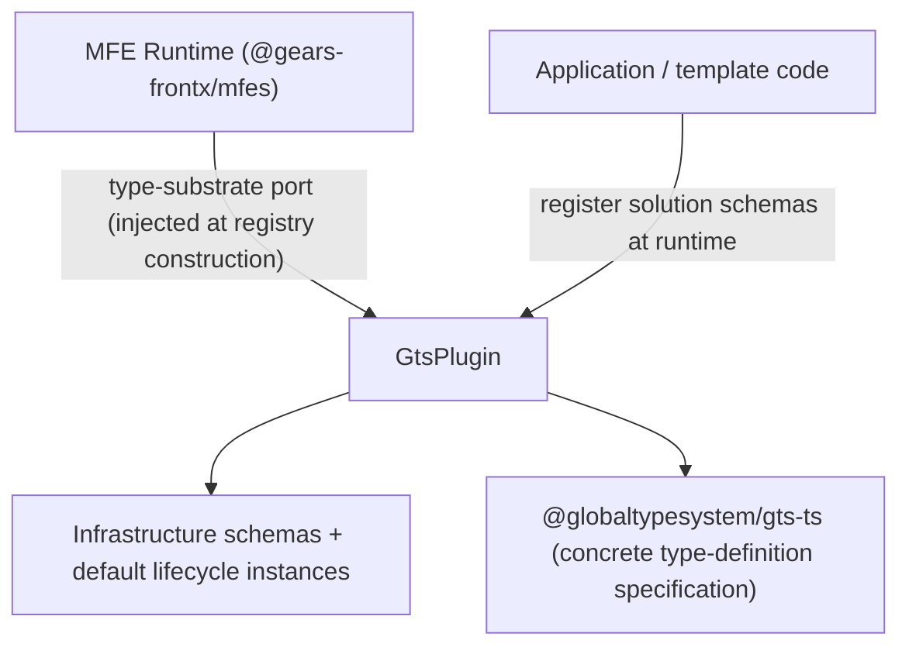
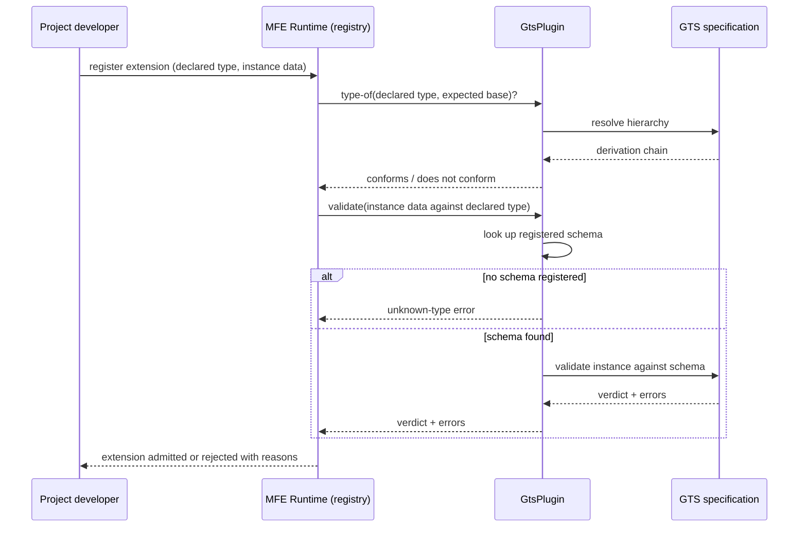

# Technical Design — GTS Type-System Plugin

- [ ] `p3` - **ID**: `cpt-frontx-gts-plugin-design-type-system-provider`

<!-- toc -->

- [1. Architecture Overview](#1-architecture-overview)
  - [1.1 Architectural Vision](#11-architectural-vision)
  - [1.2 Architecture Drivers](#12-architecture-drivers)
  - [1.3 Architecture Layers](#13-architecture-layers)
- [2. Principles & Constraints](#2-principles--constraints)
  - [2.1 Design Principles](#21-design-principles)
  - [2.2 Constraints](#22-constraints)
- [3. Technical Architecture](#3-technical-architecture)
  - [3.1 Domain Model](#31-domain-model)
  - [3.2 Component Model](#32-component-model)
  - [3.3 API Contracts](#33-api-contracts)
  - [3.4 Internal Dependencies](#34-internal-dependencies)
  - [3.5 External Dependencies](#35-external-dependencies)
  - [3.6 Interactions & Sequences](#36-interactions--sequences)
  - [3.7 Database schemas & tables](#37-database-schemas--tables)
- [4. Additional context](#4-additional-context)
- [5. Traceability](#5-traceability)

<!-- /toc -->

## 1. Architecture Overview

### 1.1 Architectural Vision

The package is the ecosystem's default answer to a question the MFE Runtime deliberately refuses to answer: what a type identifier *means*. The runtime carries type identifiers opaquely and delegates all schema shape, validation and hierarchy resolution to whatever provider is injected at registry construction. This package is that provider — an implementation of the runtime's type-substrate port over the Global Type System (GTS) specification, ready to use immediately after construction.

Everything the package does follows from being on the concrete side of an opaque boundary. It owns the ecosystem's infrastructure schemas and the default lifecycle instances and registers them at construction, so a consumer gets a working type system without authoring one. It owns no solution-specific schemas — those are registered by their owners at runtime through the same port. And it is the only place in the published-libraries layer where a concrete type-definition specification may appear, which is what keeps every other concern format-agnostic and lets a conforming alternative provider replace this one without touching the runtime.

### 1.2 Architecture Drivers

#### Functional Drivers

| Requirement | Design Response |
|-------------|------------------|
| `cpt-frontx-fr-mfe-type-validation` | `cpt-frontx-component-type-system-plugin` supplies schema validation and type-of hierarchy resolution behind the runtime's port, so the runtime can validate microfrontends and extensions against type definitions while reasoning about types only by identity. |
| `cpt-frontx-fr-application-type-definitions` | The port surface the plugin implements accepts type definitions registered at runtime, so applications and templates add their own schemas through the same registration path the plugin uses for its infrastructure schemas — without the plugin owning them. |

#### NFR Allocation

| NFR ID | NFR Summary | Allocated To | Design Response | Verification Approach |
|--------|-------------|--------------|-----------------|----------------------|
| `cpt-frontx-nfr-evolvability` | Versioned releases without lockstep upgrades | The published package | The plugin publishes on its own semver line; the runtime's compatibility with it is expressed as a satisfiable peer range on the `mfes → gts-plugin` edge rather than a matched version number, so either side can release without forcing the other. | The ecosystem version-policy check asserts the edge is a satisfiable range and not exact-pinned (no duplicate-runtime skew). |
| `cpt-frontx-gts-plugin-nfr-standalone` | One port import, nothing else intra-ecosystem | The published package | The package imports `@gears-frontx/mfes` for the port contract it implements and nothing else from the ecosystem; no UI-framework or template-territory import exists in the published source. | The boundary guards (`arch:edges`, `arch:deps`) hold the manifest and import graph to the declared standalone property, with the port edge as the one recorded exception. |

**ADR coverage references:**

- `cpt-frontx-adr-default-type-substrate-provider`

### 1.3 Architecture Layers

- [x] `p3` - **ID**: `cpt-frontx-gts-plugin-tech-plugin-stack`

| Layer | Responsibility | Technology |
|-------|---------------|------------|
| Public surface | The provider class, its default instance, the schema/lifecycle loaders and the schema type | TypeScript, single entry point |
| Port implementation | Schema registration, validation, type-of resolution behind the runtime's opaque port | TypeScript over the GTS specification API |
| Schema ownership | Infrastructure schemas and default lifecycle instances, registered at construction | Bundled definitions, loaded by the package's own loaders |

## 2. Principles & Constraints

### 2.1 Design Principles

#### Concrete Type-Format Confinement

- [x] `p2` - **ID**: `cpt-frontx-gts-plugin-principle-format-confinement`

The concrete type-definition specification lives only in this package. The plugin is the single component permitted to depend on it, and the format-specific schema shape never crosses the port — the runtime sees identities and verdicts, not schemas. This confinement is why the rest of the ecosystem stays format-agnostic and why the plugin can be replaced by any conforming provider without a runtime change.

### 2.2 Constraints

#### GTS-PLUGIN-1 — Type-system plugin owns infrastructure schemas

- [ ] `p2` - **ID**: `cpt-frontx-constraint-gts-plugin-owns-infra-schemas`

The type-system plugin (`@gears-frontx/gts-plugin`) owns the ecosystem's infrastructure schemas and the default lifecycle instances, registering them as the concrete provider behind the runtime's opaque type-substrate port.

**ADRs**: [The Default Type-Substrate Provider](../../../architecture/ADR/0005-default-type-substrate-provider.md)

#### GTS-PLUGIN-2 — Type-system plugin excludes solution schemas

- [ ] `p2` - **ID**: `cpt-frontx-constraint-gts-plugin-excludes-solution-schemas`

The type-system plugin owns no solution-specific schemas. Application- and template-specific type definitions are registered by their owners at runtime, keeping the plugin scoped to infrastructure concerns.

**ADRs**: [The Default Type-Substrate Provider](../../../architecture/ADR/0005-default-type-substrate-provider.md)

## 3. Technical Architecture

### 3.1 Domain Model

| Entity | Definition | Representation |
|--------|------------|----------------|
| Schema | A type-definition identity the runtime carries opaquely; its concrete, format-specific shape and validation are owned here. | GTS schema behind the port; `JSONSchema` type on the public surface |
| LifecycleStage | A defined stage in a unit's runtime lifecycle, modelled by the type substrate as one of the default infrastructure instances registered at construction. | Bundled GTS instances, loaded by `loadLifecycleStages` |
| Type-of relation | The derivation of one type identifier from another, used to answer whether a declared type conforms to an expected base. | Hierarchy resolution inside the provider, exposed as a port verdict |

### 3.2 Component Model

#### Type System Plugin

- [ ] `p2` - **ID**: `cpt-frontx-component-type-system-plugin`

Concrete artifact: `@gears-frontx/gts-plugin`.

##### Why this component exists

The MFE Runtime treats types opaquely and needs a concrete provider to give type identifiers meaning — to validate microfrontends and extensions against type definitions and to resolve type hierarchy. This component is that provider, supplying the ecosystem's default type system as an injectable implementation of the runtime's type-substrate port.

##### Responsibility scope

- Implements the runtime's type-substrate port (`TypeSystemPlugin`) over a concrete type-definition specification.
- Owns the ecosystem infrastructure schemas and the default lifecycle instances, registering them at construction.
- Provides schema validation, type-of resolution, and the format-specific schema shape the runtime never sees directly.

##### Responsibility boundaries

- Owns infrastructure schemas only; it owns no solution-specific schemas, which their owners register at runtime (GTS-PLUGIN-1, GTS-PLUGIN-2).
- Does not own the runtime registry, loading, or communication mechanisms — it is invoked by the runtime exclusively through the type-substrate port.
- Is the only published-libraries component permitted to depend on a concrete type-definition specification.

##### Related components (by ID)

- `cpt-frontx-component-mfe-runtime` — defines the opaque type-substrate port this component implements; the provider is injected into the runtime at registry construction.

### 3.3 API Contracts

- [x] `p2` - **ID**: `cpt-frontx-gts-plugin-interface-package-entry`

- **Contracts**: `cpt-frontx-interface-type-system` (the runtime's type-substrate port contract, which this package implements)
- **Technology**: TypeScript library API, single entry point with declarations
- **Location**: [src/index.ts](../src/index.ts)

| Public surface | Purpose |
|----------------|---------|
| `GtsPlugin` / `gtsPlugin` | The provider class and its ready-made default instance — the object injected at registry construction to satisfy the port. |
| `loadSchemas`, `loadLifecycleStages` | Loaders for the bundled infrastructure schemas and default lifecycle instances the plugin registers at construction. |
| `JSONSchema` | The schema type the provider accepts at registration; the one place the concrete format appears on a public surface. |

The port methods themselves (validation, type-of resolution, schema registration) are the runtime's contract, not this package's: their shape is declared by `@gears-frontx/mfes` and this package conforms to it.

### 3.4 Internal Dependencies

One ecosystem import: `@gears-frontx/mfes`, from which the package takes the type-substrate port contract it implements. The dependency is exact-pinned and governed by the ecosystem pin-drift policy, while the runtime's own compatibility with the plugin is a satisfiable peer range — the pairing that keeps one resolved provider per application without lockstep releases.

**Dependency Rules** (per project conventions):
- No circular dependencies at the design level: the runtime never imports the plugin; it consumes it only as an injected port implementation
- No import of template territory
- No UI-framework import

### 3.5 External Dependencies

#### GTS specification

| Dependency Module | Interface Used | Purpose |
|-------------------|----------------|---------|
| `@globaltypesystem/gts-ts` | concrete type-definition specification API | Supplies the concrete type system the plugin registers behind the runtime's opaque type-substrate port; confined to this package so the runtime stays format-agnostic. |

**Dependency Rules** (per project conventions):
- The GTS specification API is reached only from this package; no other ecosystem package may import it

### 3.6 Interactions & Sequences

#### Schema validation through the type-substrate port

- [x] `p3` - **ID**: `cpt-frontx-gts-plugin-seq-validation-port-delegation`

**Use cases**: `cpt-frontx-usecase-add-microfrontend-to-project`

**Actors**: `cpt-frontx-actor-project-developer`

**Description**: The path every admission decision takes through the plugin. The runtime asks two questions — does the declared type derive from the expected base, and does the instance satisfy the registered schema — and receives verdicts, never schemas. Both error paths (unknown type, failing instance) surface to the caller as rejection reasons; the happy path admits the extension with no format detail crossing the port.

### 3.7 Database schemas & tables

Not applicable. The package holds no database and no persistence; its schemas are in-memory type definitions registered at construction or at runtime.

## 4. Additional context

The provider was extracted out of `packages/screensets` when the type-substrate port was formalized, which is why its component boundary matches the port exactly rather than carrying any runtime responsibility. The one deliberate asymmetry in its coupling — an exact pin on the runtime whose peer range points back at it — exists to guarantee a single resolved provider inside an application while both packages keep independent release lines.

## 5. Traceability

- **Features**: [features/](./features/)
- **Root chain**: [PRD](../../../architecture/PRD.md), [DESIGN](../../../architecture/DESIGN.md), [DECOMPOSITION](../../../architecture/DECOMPOSITION.md)

This package's requirements are owned by its own [PRD](./PRD.md), per the 3-layer model: each member explains its own reqs, and the root PRD describes the layers and the requirements binding every member equally. Every design element this package owns is cited under the identifier the root DECOMPOSITION and this package's FEATUREs use, so those citations resolve here.
