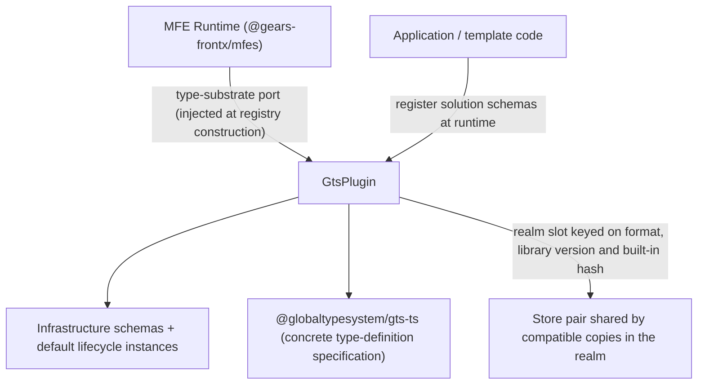
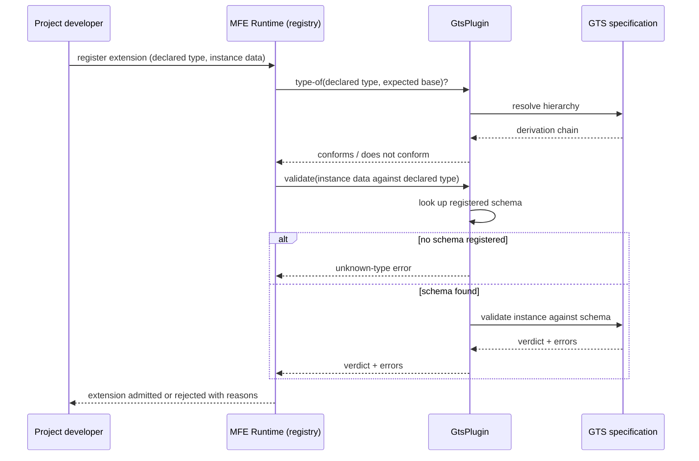
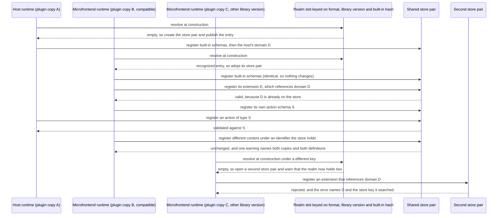

# Technical Design — GTS Type-System Plugin

- [ ] `p3` - **ID**: `cpt-frontx-gts-plugin-design-type-system-provider`

<!-- toc -->

- [1. Architecture Overview](#1-architecture-overview)
  - [1.1 Architectural Vision](#11-architectural-vision)
  - [1.2 Architecture Drivers](#12-architecture-drivers)
  - [1.3 Architecture Layers](#13-architecture-layers)
- [2. Principles & Constraints](#2-principles--constraints)
  - [2.1 Design Principles](#21-design-principles)
  - [2.2 Constraints](#22-constraints)
- [3. Technical Architecture](#3-technical-architecture)
  - [3.1 Domain Model](#31-domain-model)
  - [3.2 Component Model](#32-component-model)
  - [3.3 API Contracts](#33-api-contracts)
  - [3.4 Internal Dependencies](#34-internal-dependencies)
  - [3.5 External Dependencies](#35-external-dependencies)
  - [3.6 Interactions & Sequences](#36-interactions--sequences)
  - [3.7 Database schemas & tables](#37-database-schemas--tables)
- [4. Additional context](#4-additional-context)
- [5. Traceability](#5-traceability)

<!-- /toc -->

## 1. Architecture Overview

### 1.1 Architectural Vision

The package is the ecosystem's default answer to a question the MFE Runtime deliberately refuses to answer: what a type identifier *means*. The runtime carries type identifiers opaquely and delegates all schema shape, validation and hierarchy resolution to whatever provider is injected at registry construction. This package is that provider — an implementation of the runtime's type-substrate port over the Global Type System (GTS) specification, ready to use immediately after construction.

Everything the package does follows from being on the concrete side of an opaque boundary. It owns the ecosystem's infrastructure schemas and the default lifecycle instances and registers them at construction, so a consumer gets a working type system without authoring one. It owns no solution-specific schemas — those are registered by their owners at runtime through the same port. And it is the only place in the published-libraries layer where a concrete type-definition specification may appear, which is what keeps every other concern format-agnostic and lets a conforming alternative provider replace this one without touching the runtime.

The provider keeps what it knows in a store, and compatible copies in a JavaScript realm share that store. A composed application evaluates several copies of the provider, one in each runtime that imports it. Copies with the same store format, the same GTS library version and the same built-in schemas converge on one store pair through a realm slot keyed on those three. A definition registered in one runtime is then known in all of them, and a runtime may rely on it. Copies that differ in any of the three never meet, because they might give one type identifier different meaning. The first definition registered under a type identifier stands, so no runtime can change a type that another runtime already relies on. An instance constructed with the isolation option keeps a private store pair.

### 1.2 Architecture Drivers

#### Functional Drivers

| Requirement | Design Response |
|-------------|------------------|
| `cpt-frontx-fr-mfe-type-validation` | `cpt-frontx-component-type-system-plugin` supplies schema validation and type-of hierarchy resolution behind the runtime's port, so the runtime can validate microfrontends and extensions against type definitions while reasoning about types only by identity. |
| `cpt-frontx-fr-application-type-definitions` | The port surface the plugin implements accepts type definitions registered at runtime, so applications and templates add their own schemas through the same registration path the plugin uses for its infrastructure schemas — without the plugin owning them. |
| `cpt-frontx-fr-gts-realm-shared-type-store` | `cpt-frontx-component-type-system-plugin` reaches its store pair through a realm slot keyed on the store format, the GTS library version and a hash of its built-in schemas (GTS-PLUGIN-3). Every compatible plugin instance in the realm reads and writes the same store, a runtime may rely on what another registered there, and a type identifier keeps the first definition registered under it. A missing definition is reported with the store searched, and the opening of a second store in the realm is reported when it happens. |

#### NFR Allocation

| NFR ID | NFR Summary | Allocated To | Design Response | Verification Approach |
|--------|-------------|--------------|-----------------|----------------------|
| `cpt-frontx-nfr-evolvability` | Versioned releases without lockstep upgrades | The published package | The plugin publishes on its own semver line; the runtime's compatibility with it is expressed as a satisfiable peer range on the `mfes → gts-plugin` edge rather than a matched version number, so either side can release without forcing the other. | The ecosystem version-policy check asserts the edge is a satisfiable range and not exact-pinned (no duplicate-runtime skew). |
| `cpt-frontx-gts-plugin-nfr-standalone` | One port import, nothing else intra-ecosystem | The published package | The package imports `@gears-frontx/mfes` for the port contract it implements and nothing else from the ecosystem; no UI-framework or template-territory import exists in the published source. | The boundary guards (`arch:edges`, `arch:deps`) hold the manifest and import graph to the declared standalone property, with the port edge as the one recorded exception. |

**ADR coverage references:**

- `cpt-frontx-adr-default-type-substrate-provider`
- `cpt-frontx-adr-realm-shared-gts-store`

### 1.3 Architecture Layers

- [x] `p3` - **ID**: `cpt-frontx-gts-plugin-tech-plugin-stack`

```mermaid
graph TD
    Runtime["MFE Runtime (@gears-frontx/mfes)"] -- "type-substrate port (injected at registry construction)" --> Plugin[GtsPlugin]
    Plugin --> Schemas[Infrastructure schemas + default lifecycle instances]
    Plugin --> GTS["@globaltypesystem/gts-ts (concrete type-definition specification)"]
    Plugin -- "realm slot keyed on format, library version and built-in hash" --> Store["Store pair shared by compatible copies in the realm"]
    Owners[Application / template code] -- "register solution schemas at runtime" --> Plugin
```

| Layer | Responsibility | Technology |
|-------|---------------|------------|
| Public surface | The provider class, its default instance, the schema/lifecycle loaders and the schema type | TypeScript, single entry point |
| Port implementation | Schema registration, validation, type-of resolution behind the runtime's opaque port | TypeScript over the GTS specification API |
| Schema ownership | Infrastructure schemas and default lifecycle instances, registered at construction | Bundled definitions, loaded by the package's own loaders |
| Type store | One GTS store and its scratch mirror per compatible copy group per realm, reached through a realm slot keyed on what decides meaning; or a private pair for an isolated instance | GTS library stores; a `Symbol.for` slot on the realm's global object |

## 2. Principles & Constraints

### 2.1 Design Principles

#### Concrete Type-Format Confinement

- [x] `p2` - **ID**: `cpt-frontx-gts-plugin-principle-format-confinement`

The concrete type-definition specification lives only in this package. The plugin is the single component permitted to depend on it, and the format-specific schema shape never crosses the port — the runtime sees identities and verdicts, not schemas. This confinement is why the rest of the ecosystem stays format-agnostic and why the plugin can be replaced by any conforming provider without a runtime change.

### 2.2 Constraints

#### GTS-PLUGIN-1 — Type-system plugin owns infrastructure schemas

- [ ] `p2` - **ID**: `cpt-frontx-constraint-gts-plugin-owns-infra-schemas`

The type-system plugin (`@gears-frontx/gts-plugin`) owns the ecosystem's infrastructure schemas and the default lifecycle instances, registering them as the concrete provider behind the runtime's opaque type-substrate port.

**ADRs**: [The Default Type-Substrate Provider](../../../architecture/ADR/0005-default-type-substrate-provider.md)

#### GTS-PLUGIN-2 — Type-system plugin excludes solution schemas

- [ ] `p2` - **ID**: `cpt-frontx-constraint-gts-plugin-excludes-solution-schemas`

The type-system plugin owns no solution-specific schemas. Application- and template-specific type definitions are registered by their owners at runtime, keeping the plugin scoped to infrastructure concerns.

**ADRs**: [The Default Type-Substrate Provider](../../../architecture/ADR/0005-default-type-substrate-provider.md)

#### GTS-PLUGIN-3 — One store per compatible copy per realm

- [ ] `p2` - **ID**: `cpt-frontx-constraint-gts-plugin-realm-shared-store`

Every non-isolated plugin instance in a JavaScript realm reads and writes one GTS store and one scratch store that mirrors it. The plugin reaches the pair through a realm slot of its own. The slot's key names a store format number, the GTS library version the copy was built against, and a hash of the copy's built-in schemas and lifecycle instances. The package's own version is not in the key. Copies that differ in any part of the key never share a store. The store format is bumped whenever the entry's shape or the meaning of the stored data changes. Every store in a pair is created by the copy that published it, so all validation on a pair runs on one copy of the GTS library and its validator.

A runtime may rely on what another runtime registered on the same store. A copy that opens a key while the realm holds other keys logs a warning naming them. A missing definition is reported with the store key. A copy that finds a malformed or unrecognized entry leaves it untouched, logs a warning and works from a store pair local to its own evaluated copy.

The first definition registered under a type identifier stands, whichever method delivers a later one. Identical canonical content changes nothing and reports nothing. Different content changes nothing and is reported once as a console warning naming the identifier, the copies involved and both contents. A definition that is not a schema or not representable as JSON is refused. An instance is validated against the store's current state and then replaces what the store held under its identifier. Replacing different content that another copy wrote is reported once, except for action payloads and shared-property values. Both stores hold the same entities between any two calls, and every call does all its store work synchronously.

An instance constructed with `isolated: true` keeps a private store pair and never touches the realm slot. That option is the plugin's one public addition. Sharing adds no port method. The slot is trusted same-realm coordination state, not an authenticity boundary. The stores live as long as the realm.

**ADRs**: [How Far Should the Default Type Provider's Store Reach?](../../../architecture/ADR/0037-realm-shared-gts-store.md)

## 3. Technical Architecture

### 3.1 Domain Model

| Entity | Definition | Representation |
|--------|------------|----------------|
| Schema | A type-definition identity the runtime carries opaquely; its concrete, format-specific shape and validation are owned here. | GTS schema behind the port; `JSONSchema` type on the public surface |
| LifecycleStage | A defined stage in a unit's runtime lifecycle, modelled by the type substrate as one of the default infrastructure instances registered at construction. | Bundled GTS instances, loaded by `loadLifecycleStages` |
| Type-of relation | The derivation of one type identifier from another, used to answer whether a declared type conforms to an expected base. | Hierarchy resolution inside the provider, exposed as a port verdict |
| Type store | The registry of every schema and instance the provider knows, with a scratch mirror against which a candidate instance is validated before it is written. | Two GTS library stores, shared by compatible plugin copies in a realm, or private to an isolated instance (GTS-PLUGIN-3) |

### 3.2 Component Model

#### Type System Plugin

- [ ] `p2` - **ID**: `cpt-frontx-component-type-system-plugin`

Concrete artifact: `@gears-frontx/gts-plugin`.

##### Why this component exists

The MFE Runtime treats types opaquely and needs a concrete provider to give type identifiers meaning — to validate microfrontends and extensions against type definitions and to resolve type hierarchy. This component is that provider, supplying the ecosystem's default type system as an injectable implementation of the runtime's type-substrate port.

##### Responsibility scope

- Implements the runtime's type-substrate port (`TypeSystemPlugin`) over a concrete type-definition specification.
- Owns the ecosystem infrastructure schemas and the default lifecycle instances, registering them at construction.
- Provides schema validation, type-of resolution, and the format-specific schema shape the runtime never sees directly.
- Keeps its schemas and instances in a store pair that compatible copies in the realm share, lets runtimes rely on one another's registrations, and keeps the first definition registered under each type identifier (GTS-PLUGIN-3).

##### Responsibility boundaries

- Owns infrastructure schemas only; it owns no solution-specific schemas, which their owners register at runtime (GTS-PLUGIN-1, GTS-PLUGIN-2).
- Does not own the runtime registry, loading, or communication mechanisms — it is invoked by the runtime exclusively through the type-substrate port.
- Is the only published-libraries component permitted to depend on a concrete type-definition specification.
- Shares its store only with copies that match its key. It never shares through the bridge or an export, and an isolated instance shares with nothing.

##### Related components (by ID)

- `cpt-frontx-component-mfe-runtime` — defines the opaque type-substrate port this component implements; the provider is injected into the runtime at registry construction.

### 3.3 API Contracts

- [x] `p2` - **ID**: `cpt-frontx-gts-plugin-interface-package-entry`

- **Contracts**: `cpt-frontx-interface-type-system` (the runtime's type-substrate port contract, which this package implements)
- **Technology**: TypeScript library API, single entry point with declarations
- **Location**: [src/index.ts](../src/index.ts)

| Public surface | Purpose |
|----------------|---------|
| `GtsPlugin` / `gtsPlugin` | The provider class and its ready-made default instance — the object injected at registry construction to satisfy the port. The default instance uses the realm-shared store pair. |
| `GtsPluginOptions` | The construction options. `isolated: true` gives an instance a private store pair, as every instance had before realm sharing. Tests that need a fresh store per test, in this package and in consumers, construct the provider this way. Added in version 0.3.1. |
| `loadSchemas`, `loadLifecycleStages` | Loaders for the bundled infrastructure schemas and default lifecycle instances the plugin registers at construction. |
| `JSONSchema` | The schema type the provider accepts at registration; the one place the concrete format appears on a public surface. |

The port methods themselves (validation, type-of resolution, schema registration) are the runtime's contract, not this package's: their shape is declared by `@gears-frontx/mfes` and this package conforms to it.

### 3.4 Internal Dependencies

One ecosystem import: `@gears-frontx/mfes`, from which the package takes the type-substrate port contract it implements. The dependency is exact-pinned and governed by the ecosystem pin-drift policy, while the runtime's own compatibility with the plugin is a satisfiable peer range — the pairing that keeps one resolved provider per application without lockstep releases.

**Dependency Rules** (per project conventions):
- No circular dependencies at the design level: the runtime never imports the plugin; it consumes it only as an injected port implementation
- No import of template territory
- No UI-framework import

### 3.5 External Dependencies

#### GTS specification

| Dependency Module | Interface Used | Purpose |
|-------------------|----------------|---------|
| `@globaltypesystem/gts-ts` | concrete type-definition specification API | Supplies the concrete type system the plugin registers behind the runtime's opaque type-substrate port; confined to this package so the runtime stays format-agnostic. |

**Dependency Rules** (per project conventions):
- The GTS specification API is reached only from this package; no other ecosystem package may import it
- The GTS library is pinned to an exact version, because the store key names the library version this package was built against (GTS-PLUGIN-3)
- A store that another copy of the library created is used through its operations only, never by class identity

### 3.6 Interactions & Sequences

#### Schema validation through the type-substrate port

- [x] `p3` - **ID**: `cpt-frontx-gts-plugin-seq-validation-port-delegation`

**Use cases**: `cpt-frontx-usecase-add-microfrontend-to-project`

**Actors**: `cpt-frontx-actor-project-developer`

```mermaid
sequenceDiagram
    participant Dev as Project developer
    participant RT as MFE Runtime (registry)
    participant PL as GtsPlugin
    participant GTS as GTS specification
    Dev->>RT: register extension (declared type, instance data)
    RT->>PL: type-of(declared type, expected base)?
    PL->>GTS: resolve hierarchy
    GTS-->>PL: derivation chain
    PL-->>RT: conforms / does not conform
    RT->>PL: validate(instance data against declared type)
    PL->>PL: look up registered schema
    alt no schema registered
        PL-->>RT: unknown-type error
    else schema found
        PL->>GTS: validate instance against schema
        GTS-->>PL: verdict + errors
        PL-->>RT: verdict + errors
    end
    RT-->>Dev: extension admitted or rejected with reasons
```

**Description**: The path every admission decision takes through the plugin. The runtime asks two questions — does the declared type derive from the expected base, and does the instance satisfy the registered schema — and receives verdicts, never schemas. Both error paths (unknown type, failing instance) surface to the caller as rejection reasons; the happy path admits the extension with no format detail crossing the port.

#### Registration into the realm-shared store

- [x] `p3` - **ID**: `cpt-frontx-gts-plugin-seq-realm-shared-registration`

**Use cases**: `cpt-frontx-gts-plugin-usecase-register-application-types`

**Actors**: `cpt-frontx-gts-plugin-actor-application-developer`

```mermaid
sequenceDiagram
    participant H as Host runtime (plugin copy A)
    participant M as Microfrontend runtime (plugin copy B, compatible)
    participant X as Microfrontend runtime (plugin copy C, other library version)
    participant SL as Realm slot keyed on format, library version and built-in hash
    participant ST as Shared store pair
    participant XS as Second store pair
    H->>SL: resolve at construction
    SL-->>H: empty, so create the store pair and publish the entry
    H->>ST: register built-in schemas, then the host's domain D
    M->>SL: resolve at construction
    SL-->>M: recognized entry, so adopt its store pair
    M->>ST: register built-in schemas (identical, so nothing changes)
    M->>ST: register its extension E, which references domain D
    ST-->>M: valid, because D is already on the store
    M->>ST: register its own action schema S
    H->>ST: register an action of type S
    ST-->>H: validated against S
    M->>ST: register different content under an identifier the store holds
    ST-->>M: unchanged, and one warning names both copies and both definitions
    X->>SL: resolve at construction under a different key
    SL-->>X: empty, so open a second store pair and warn that the realm now holds two
    X->>XS: register an extension that references domain D
    XS-->>X: rejected, and the error names D and the store key it searched
```

**Description**: Compatible copies meet at one realm slot. The host's copy creates the store pair and registers the built-in set and its domain. The microfrontend's copy adopts the same pair, so its extension can reference the host's domain without registering it again. A schema the microfrontend registers is known to the host, so the host admits that microfrontend's actions. A later definition with different content under a type identifier the store already holds is refused with one warning, so the definition every runtime relies on does not change. A copy built against another library version opens a store of its own and warns that the realm now holds two. Its reliance on the host's domain then fails with an error that names the domain and the store it searched.

### 3.7 Database schemas & tables

Not applicable. The package holds no database and no persistence. Its schemas and instances are in-memory entries of a store pair that lives as long as the realm and is shared by compatible plugin copies in it, or of a private pair that lives as long as an isolated instance.

## 4. Additional context

The provider implements the type-substrate port and nothing else, so its component boundary matches the port exactly and carries no runtime responsibility. Its one piece of shared state, the realm store pair, is reached through a slot the provider owns, and the runtime never reads or writes it. The one deliberate asymmetry in its coupling — an exact pin on the runtime whose peer range points back at it — exists to guarantee a single resolved provider inside an application while both packages keep independent release lines.

## 5. Traceability

- **Features**: [features/](./features/)
- **Root chain**: [PRD](../../../architecture/PRD.md), [DESIGN](../../../architecture/DESIGN.md), [DECOMPOSITION](../../../architecture/DECOMPOSITION.md)

This package's requirements are owned by its own [PRD](./PRD.md), per the 3-layer model: each member explains its own reqs, and the root PRD describes the layers and the requirements binding every member equally. The design elements that moved here from the root DESIGN under the artifact-federation refactoring keep their identifiers unchanged, so citations from the root DECOMPOSITION and this package's FEATUREs resolve as before.
