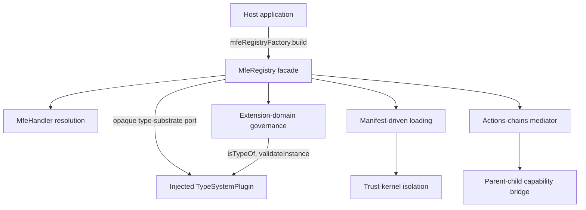
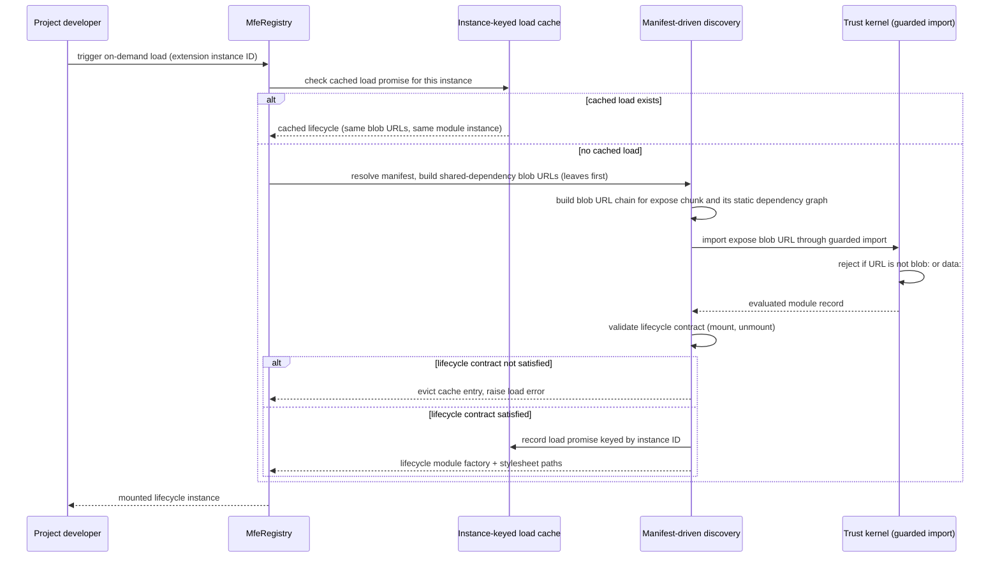

# Technical Design — MFE Runtime

- [ ] `p3` - **ID**: `cpt-frontx-mfes-design-mfe-runtime`

<!-- toc -->

- [1. Architecture Overview](#1-architecture-overview)
  - [1.1 Architectural Vision](#11-architectural-vision)
  - [1.2 Architecture Drivers](#12-architecture-drivers)
  - [1.3 Architecture Layers](#13-architecture-layers)
- [2. Principles & Constraints](#2-principles--constraints)
  - [2.1 Design Principles](#21-design-principles)
  - [2.2 Constraints](#22-constraints)
- [3. Technical Architecture](#3-technical-architecture)
  - [3.1 Domain Model](#31-domain-model)
  - [3.2 Component Model](#32-component-model)
  - [3.3 API Contracts](#33-api-contracts)
  - [3.4 Internal Dependencies](#34-internal-dependencies)
  - [3.5 External Dependencies](#35-external-dependencies)
  - [3.6 Interactions & Sequences](#36-interactions--sequences)
  - [3.7 Database schemas & tables](#37-database-schemas--tables)
- [4. Additional context](#4-additional-context)
- [5. Traceability](#5-traceability)

<!-- /toc -->

## 1. Architecture Overview

### 1.1 Architectural Vision

The MFE Runtime is the substrate a FrontX application loads independently developed units against, without knowing anything about what those units mean. It registers microfrontends and their extensions through an abstract registry facade, discovers and loads them on demand from a published manifest, admits them into governed extension domains only after they pass validation, mediates their communication with the host through a narrow capability bridge, and isolates every loaded unit in its own module graph. None of these five responsibilities requires the runtime to understand a type format, a solution's shared-property vocabulary, or a domain's placement semantics — it reasons about all of them as opaque identifiers and delegates meaning to whoever is injected at the boundary.

The one boundary that makes this possible is the type-substrate port. The runtime carries a declared type identifier as a string, asks an injected provider whether an instance validates and whether one type derives from another, and acts on the verdict — never on the schema itself. This is what lets `@gears-frontx/gts-plugin` be the default provider today and any conforming provider replace it tomorrow without a runtime change, and it is why the runtime's own package holds no dependency on a concrete type-definition specification.

Everything downstream of that boundary follows the same discipline. Extension-domain governance admits an occupant by subset-rule contract matching and a cardinality matrix, never by a domain name the runtime recognizes. The actions-chains mediator routes a chain to a handler keyed by target and action type, never by a shared-property vocabulary the runtime defines. On-demand loading reads locating facts from manifest fields the runtime never parses into a remote-entry format, and isolation confines every dynamic-code primitive isolation requires to one audited trust-kernel file so the arbitrary-code-admission surface stays provably bounded. The runtime is, deliberately, a substrate that knows how to admit, load, mediate, and isolate — and nothing about what it is admitting.

### 1.2 Architecture Drivers

#### Functional Drivers

| Requirement | Design Response |
|-------------|------------------|
| `cpt-frontx-fr-mfe-runtime-registration` | `cpt-frontx-component-mfe-runtime` exposes the abstract `MfeRegistry` facade built via `mfeRegistryFactory`, owning the register → type-validate → handler-resolve → domain-admit → load-on-demand → mount sequence; on-demand loading reads locating facts exclusively from the published manifest's declared fields, and every loaded unit evaluates as its own isolated module instance behind the audited trust kernel. |
| `cpt-frontx-fr-ui-framework-agnostic` | Handler resolution matches an entry's declared base type through the injected type-system provider rather than a UI-framework-specific self-selection predicate, so the registry carries no assumption about which rendering technology a resolved handler wraps. |
| `cpt-frontx-fr-mfe-type-validation` | Extension admission runs subset-rule contract matching against a domain's declared shared properties and supported actions, and handler resolution runs `typeSystem.isTypeOf` against the injected provider — both before an extension is placed into an extension domain, realizing default-deny admission. |
| `cpt-frontx-fr-application-type-definitions` | The runtime exposes the `TypeSystemPlugin` port opaquely; application and template code registers its own schemas through the same injected provider the runtime calls for its own well-known infrastructure lifecycle actions, so the runtime never owns a schema of its own. |
| `cpt-frontx-fr-mfe-host-communication` | The actions-chains mediator dispatches by a `(targetId, actionTypeId)` keyed registry with a per-target catch-all tier, recursive success/fallback chain execution, and in-flight tracking; a narrow parent–child capability bridge exposes exactly the participation methods a child needs, each delegating to the registry or mediator without duplicating coordination logic. |
| `cpt-frontx-fr-mfe-multi-occupant-domain` | Extension-domain occupancy is governed by three composable named mount strategies (Concurrent, Optional, Exclusive) validated against a cardinality matrix at domain registration, so a domain accepts side-by-side, displacing, or exclusive occupants according to the strategy its declared lifecycle actions satisfy. |

#### NFR Allocation

| NFR ID | NFR Summary | Allocated To | Design Response | Verification Approach |
|--------|-------------|--------------|-----------------|-----------------------|
| `cpt-frontx-nfr-runtime-performance` | Runtime response-time and throughput targets | `cpt-frontx-component-mfe-runtime` | The lazy-import ABI resolver defers a chunk's fetch and evaluation until it is first exercised rather than eagerly at parent-load time, and shared-dependency source text is deduplicated across MFE loads through a cross-MFE LRU cache keyed by `name@version`, keeping the eager working set small without duplicating a singleton dependency. | Load-time benchmarks asserting the runtime's share of the PRD's p95 registration and on-demand-load thresholds, and that a lazy chunk is fetched only on first exercise. |
| `cpt-frontx-nfr-security` | Default-deny posture; validated admission | `cpt-frontx-component-mfe-runtime` | Every extension is denied admission until subset-rule contract matching and cardinality validation both succeed; every loaded unit evaluates inside its own module graph behind an audited trust-kernel file whose dynamic-import primitive rejects any URL that is not `blob:` or `data:`, confined there by a custom lint rule. | Admission audit asserting no extension is mounted without passing the full admission sequence, and a CI boundary check confirming dynamic-code primitives appear only in the trust-kernel file. |

**ADR coverage references:**

- `cpt-frontx-adr-core-package-boundaries`
- `cpt-frontx-adr-mfe-runtime-public-surface`
- `cpt-frontx-adr-runtime-type-system-coupling`
- `cpt-frontx-adr-mfe-handler-resolution`
- `cpt-frontx-adr-action-dispatch-and-chaining`
- `cpt-frontx-adr-child-mfe-host-access`
- `cpt-frontx-adr-extension-domain-occupancy`
- `cpt-frontx-adr-domain-extension-compatibility`
- `cpt-frontx-adr-mfe-load-isolation`
- `cpt-frontx-adr-lazy-import-resolution`
- `cpt-frontx-adr-mfe-asset-discovery`

### 1.3 Architecture Layers

- [x] `p3` - **ID**: `cpt-frontx-mfes-tech-runtime-stack`



| Layer | Responsibility | Technology |
|-------|---------------|------------|
| Public surface | Registry facade and factory, handler and bridge type contracts, port types, error classes, one entry point | TypeScript, single entry point with declarations |
| Registration & admission | Handler resolution, subset-rule contract matching, cardinality validation, extension and domain lifecycle state | TypeScript over the injected `TypeSystemPlugin` |
| Loading & isolation | Manifest-driven discovery, lazy-import ABI resolution, blob-URL chain construction, the audited trust kernel | Browser `fetch`, `Blob`, dynamic `import()`, module-federation shared singletons |
| Mediation | Actions-chains mediator, parent–child capability bridge | TypeScript, keyed handler registry |

## 2. Principles & Constraints

### 2.1 Design Principles

#### Opaque Substrate, No Owned Vocabulary

- [x] `p2` - **ID**: `cpt-frontx-mfes-principle-opaque-substrate-vocabulary`

The runtime owns no type format, no shared-property vocabulary, and no extension-domain naming of its own. Every identifier that crosses a runtime boundary — a declared type, a shared property, a domain, an action type — is a string the runtime carries and compares, never a value whose meaning the runtime interprets. Where meaning is required, it is obtained by delegation: to the injected `TypeSystemPlugin` for type validation and hierarchy, to the application for shared-property and domain identity, to the handler for what an admitted entry actually renders.

This matters because the alternative — the runtime recognizing even one concrete vocabulary as a convenience — creates a second path with different capabilities than the one plugins and applications get, and ties the runtime's own evolution to that vocabulary's. Keeping the runtime's admission, mediation, and loading paths free of owned vocabulary is what lets a conforming type-system provider, an arbitrary set of application-defined domains, and an arbitrary shared-property channel all compose against the same runtime without a runtime release.

#### Agnostic core substrate

- [ ] `p2` - **ID**: `cpt-frontx-principle-agnostic-core`

The MFE Runtime stays free of UI-framework choice, concrete type-format knowledge and solution vocabulary. Applications and microfrontends supply those choices through narrow runtime contracts.

#### Opaque type substrate

- [ ] `p2` - **ID**: `cpt-frontx-principle-opaque-type-substrate`

The runtime carries type identifiers opaquely and delegates schema shape, validation and hierarchy resolution to an injected provider. It does not inspect a concrete type-definition format.

#### Default-deny admission

- [x] `p2` - **ID**: `cpt-frontx-principle-default-deny-admission`

A microfrontend gains placement only after type validation and extension-domain contract checks pass. Loaded units receive only the capabilities granted by their admitted domain.

### 2.2 Constraints

#### MFES-1 — No type-format literals in the MFE Runtime

- [ ] `p2` - **ID**: `cpt-frontx-constraint-mfes-no-type-format-literals`

The MFE Runtime (`@gears-frontx/mfes`) contains no type-system-format string literals. Type identifiers are opaque strings to the runtime; any concrete type-format vocabulary belongs to the type-system plugin or to consumers. This keeps the runtime independent of any single type-definition specification.

**ADRs**: [Partition the Core Framework into Boundary-Governed Concerns](../../../architecture/ADR/0002-core-package-boundaries.md)

#### MFES-2 — No solution-specific shared-property identifiers in the MFE Runtime

- [ ] `p2` - **ID**: `cpt-frontx-constraint-mfes-no-solution-shared-properties`

The MFE Runtime defines no solution-specific shared-property identifiers (such as theme or language vocabulary). Shared-property identity is supplied by the application or its templates, so the runtime's communication substrate carries no domain assumptions.

**ADRs**: [Partition the Core Framework into Boundary-Governed Concerns](../../../architecture/ADR/0002-core-package-boundaries.md)

#### MFES-3 — No specific extension-domain values in the MFE Runtime

- [x] `p2` - **ID**: `cpt-frontx-constraint-mfes-no-layout-domain-values`

The MFE Runtime defines no specific extension-domain (layout-domain) values. Which domains exist, what they are named, and what may occupy them are defined by the application, keeping placement vocabulary out of the platform.

**ADRs**: [Partition the Core Framework into Boundary-Governed Concerns](../../../architecture/ADR/0002-core-package-boundaries.md)

#### MFES-4 — No concrete type-format dependency in the MFE Runtime

- [ ] `p2` - **ID**: `cpt-frontx-constraint-mfes-no-type-format-dependency`

The MFE Runtime declares no dependency on any concrete type-system-format implementation. The format provider is injected through the type-substrate port, so the runtime can be composed with any conforming type system.

**ADRs**: [Partition the Core Framework into Boundary-Governed Concerns](../../../architecture/ADR/0002-core-package-boundaries.md)

#### MFES-5 — Opaque schema surface in the MFE Runtime

- [ ] `p2` - **ID**: `cpt-frontx-constraint-mfes-opaque-schema-surface`

The runtime's schema surface is opaque, exposing only a stable identifier. Format-specific schema shape and validation live in the type-system plugin, so the runtime reasons about types solely by identity.

**ADRs**: [The Runtime's Coupling to the Type System](../../../architecture/ADR/0004-runtime-type-system-coupling.md)

## 3. Technical Architecture

### 3.1 Domain Model

| Entity | Definition | Representation |
|--------|------------|----------------|
| Schema | A type-definition identity the runtime carries opaquely; the runtime holds only its string identifier and never its structural shape. | Opaque `string` identifier on the runtime's public surface; concrete shape lives behind the injected `TypeSystemPlugin`. |
| MfeEntry | A registrable microfrontend's declared identity: its type identifier, manifest reference, and (for the module-federation handler) the entry-specific fields the handler needs to load it. | `MfeEntry` / `MfeEntryMF` types. Lifecycle: the mfe-registry FEATURE specifies a formal state machine (UNREGISTERED → REGISTERED → HANDLER_RESOLVED → ADMITTED → MOUNTED / REJECTED, `cpt-frontx-state-mfe-registry-entry-lifecycle`), not yet honored by the runtime beyond the unregister transition; the current implementation tracks `loadState` and `mountState` per extension instance instead of one reified entry state. |
| Extension | A registered occupant carrying an `MfeEntry`, its declared required properties, supported capabilities, and required domain capabilities, evaluated against a target `ExtensionDomain`'s contract. | `Extension` type; instance-keyed so two extensions sharing one entry definition produce distinct isolated loads. |
| ExtensionDomain | A governed placement composed with one named mount strategy (Concurrent, Optional, or Exclusive) and a declared set of lifecycle actions, validated against a cardinality matrix at registration. | `ExtensionDomain` type plus `ExtensionDomainImplementation` / `ExtensionDomainImplementationFactory`. |
| Action / ActionsChain | A typed message dispatched to a `(targetId, actionTypeId)` pair, optionally chained with `next` and `fallback` continuations for recursive success/failure routing. | `Action`, `ActionsChain` types, admitted through the injected type-system provider before dispatch. |

### 3.2 Component Model

#### MFE Runtime

- [ ] `p2` - **ID**: `cpt-frontx-component-mfe-runtime`

Concrete artifact: `@gears-frontx/mfes`.

##### Why this component exists

Applications need to gain user-facing functionality from independently developed units at runtime, without rebuilding or redeploying the host. The MFE Runtime is the substrate that registers those units, loads them on demand, places them into governed extension domains, mediates their communication with the host, and admits them only after type validation.

##### Responsibility scope

- Owns microfrontend registration and on-demand loading, exposed through an abstract registry facade (`MfeRegistry`, built via `mfeRegistryFactory`).
- Owns extension-domain governance, mount-strategy selection (concurrent / optional / exclusive), and the cardinality rules that admit or reject occupants.
- Owns the actions-chains mediator that routes communication between microfrontends and the host, and the narrow parent–child capability bridge.
- Owns the opaque type-substrate port: it reasons about type identifiers as opaque strings and delegates all schema, validation, and hierarchy operations to an injected type-system provider, reading only a schema's identifier.
- Owns runtime isolation of loaded units.

##### Responsibility boundaries

- Defines no concrete type-system format, declares no dependency on one, and contains no type-format string literals — the format provider is injected (MFES-1, MFES-4, MFES-5).
- Defines no solution-specific shared-property identifiers and no specific extension-domain values — those are supplied by the application or its templates (MFES-2, MFES-3).
- Does not own UI rendering technology; applications and microfrontends choose their own UI framework.
- Does not own template resolution, project lifecycle, or AI tooling — those belong to the CLI and the AI Tooling kit.

##### Related components (by ID)

- `cpt-frontx-component-type-system-plugin` — the default provider of the opaque type-substrate port this component defines; the runtime consumes it as an implementation injected at registry construction.

### 3.3 API Contracts

- [x] `p2` - **ID**: `cpt-frontx-mfes-interface-package-entry`

- **Contracts**: `cpt-frontx-interface-mfe-runtime` (the registry facade contract that is the sole public runtime surface)
- **Technology**: TypeScript library API, single entry point with declarations
- **Location**: [src/index.ts](../src/index.ts)

| Public surface | Purpose |
|----------------|---------|
| `MfeRegistry`, `MfeRegistryFactory`, `mfeRegistryFactory`-produced `DefaultMfeRegistry` / `DefaultMfeRegistryFactory` | The abstract registry facade and its factory-with-cache builder — the sole way a consumer obtains a registry instance bound to an injected `TypeSystemPlugin`. |
| `TypeSystemPlugin`, `ValidationResult`, `ValidationErrorItem`, `isInfrastructureLifecycleAction` | The opaque type-substrate port contract a provider implements, and the shared helper for recognizing the well-known infrastructure lifecycle actions (`load_ext`, `mount_ext`, `unmount_ext`). |
| `MfeEntry`, `Extension`, `ExtensionDomain`, `SharedProperty`, `Action`, `ActionsChain`, `LifecycleStage`, `LifecycleHook` | Domain types shared across registration, admission, and mediation. |
| `MfeHandler`, `MfeHandlerMF`, `MfeBridgeFactory`, `MfeBridgeFactoryDefault`, `ChildMfeBridge`, `ParentMfeBridge`, `ChildMfeBridgeImpl`, `ParentMfeBridgeImpl` | The handler abstraction resolved by declared base type, its default module-federation implementation, and the narrow parent/child capability bridge pair. |
| `MountStrategy`, `ConcurrentMountStrategy`, `OptionalMountStrategy`, `ExclusiveMountStrategy`, `ExtensionDomainImplementation`, `ExtensionDomainImplementationFactory`, `ExtensionMounter`, `DefaultExtensionMounter` | The three named mount strategies and the domain-implementation machinery that enforces the cardinality matrix and executes occupancy behavior. |
| `ActionHandler`, `ActionsChainsMediator`, `DefaultActionsChainsMediator`, `ChainResult`, `ChainExecutionOptions` | The actions-chains mediator contract and its default keyed-dispatch implementation. |
| `validateContract`, `formatContractErrors`, `validateDomainLifecycleHooks`, `validateExtensionLifecycleHooks`, `validateExtensionType` | The subset-rule contract-matching and lifecycle-hook validation functions used at admission. |
| `MfManifest` and related manifest types, `LazyLoaderRegistry`, `LazyResolver` | The published-manifest shape the loading path reads, and the lazy-import ABI's host-side resolver registry. |
| `MfeError`, `DomainValidationError`, `MfeLoadError`, `ExtensionTypeError`, `ChainExecutionError`, `MfeTypeConformanceError`, `UnsupportedDomainActionError`, `UnsupportedLifecycleStageError`, `EntryTypeNotHandledError` | The error hierarchy surfaced by rejection and load-failure paths. |
| `createShadowRoot`, `injectCssVariables`, `injectStylesheet` | Shadow-DOM mount utilities used by handlers to isolate rendered output. |
| `ExtensionManager`, `DefaultExtensionManager`, `MountManager`, `DefaultMountManager`, `LifecycleManager`, `DefaultLifecycleManager`, `RuntimeBridgeFactory`, `DefaultRuntimeBridgeFactory`, `OperationSerializer`, `WeakMapRuntimeCoordinator`, `MfeStateContainer`, `DefaultMfeStateContainer` | The internal coordination machinery behind the facade — governance, mounting, lifecycle orchestration, bridge construction, and state, exported for handler and extension authors. |
| `extractGtsPackage` | A string-parsing utility over a GTS-shaped entity identifier. It imports no type-definition specification, but its segment rules encode the GTS identifier grammar — a known tension with the format-agnosticism MFES-1/MFES-4 intend, and a candidate for relocation to the type-system provider. |

### 3.4 Internal Dependencies

The package declares zero runtime dependencies. Its one ecosystem edge is a peer dependency on `@gears-frontx/gts-plugin` (`^0.3.0-alpha.0`, declared optional in `peerDependenciesMeta`) — a satisfiable semver range rather than an exact pin, which is the half of the `mfes → gts-plugin` edge this package owns (the plugin's exact pin on the runtime is the other half, recorded in the plugin's own DESIGN). The runtime's source imports nothing from `@gears-frontx/gts-plugin`; the package name appears only in JSDoc usage examples showing how a consumer wires a concrete provider into `mfeRegistryFactory.build`. The provider is a runtime value supplied by the caller, never a compile-time import, which is what the peer range without a hard dependency is verifying.

**Dependency Rules** (per project conventions):
- No circular dependencies at the design level: the runtime never imports the plugin; it consumes it only as an injected port implementation
- No import of template territory
- No UI-framework import

### 3.5 External Dependencies

#### Module Federation runtime

| Dependency Module | Interface Used | Purpose |
|-------------------|----------------|---------|
| Module Federation runtime | module-federation load/share API | Loads independently built microfrontends on demand and shares runtime singletons, behind the lazy-import ABI separation that keeps the runtime ABI distinct from the template-bound build ([Lazy Dynamic Import Resolution](../../../architecture/ADR/0012-lazy-import-resolution.md), [MFE Asset Discovery](../../../architecture/ADR/0013-mfe-asset-discovery.md)). |

**Dependency Rules** (per project conventions):
- The module-federation load/share API is reached only through the manifest-driven discovery and blob-URL chain construction paths; no other component of this package talks to it directly
- No polyfills are bundled for the browser primitives (`fetch`, `Blob`, dynamic `import()`) the loading and isolation paths depend on

### 3.6 Interactions & Sequences

#### On-demand MFE load through manifest discovery and isolated evaluation

- [x] `p3` - **ID**: `cpt-frontx-mfes-seq-on-demand-load-isolated-evaluation`

**Use cases**: `cpt-frontx-usecase-add-microfrontend-to-project`

**Actors**: `cpt-frontx-actor-project-developer`



**Description**: The path a registered extension takes from trigger to isolated evaluation, confined entirely to this package's boundary. A cache hit short-circuits to the same module instance an earlier load produced; a cache miss resolves the manifest's declared fields, builds the shared-dependency and expose-chunk blob URL chain in dependency order, and imports the result exclusively through the trust kernel's guarded import — which accepts only `blob:` or `data:` URLs, so no other primitive in the runtime can trigger a dynamic import. A failed load evicts its cache entry so a subsequent attempt starts fresh; a successful one is retained for the page lifetime because the module may keep evaluating after the import promise settles.

#### Microfrontend registration, validation, and mount

- [ ] `p1` - **ID**: `cpt-frontx-seq-mfe-register-validate-mount`

**Use cases**: `cpt-frontx-usecase-add-microfrontend-to-project`

**Actors**: `cpt-frontx-actor-project-developer`

```mermaid
sequenceDiagram
    participant App as Host application
    participant Reg as MfeRegistry (@gears-frontx/mfes)
    participant TS as Type System plugin (@gears-frontx/gts-plugin)
    participant Dom as Extension domain
    App->>Reg: register microfrontend (manifest-resolved entry)
    Reg->>TS: validate entry & extensions against type definitions
    alt validation succeeds
        TS-->>Reg: valid
        Reg->>Dom: match extension contract & check cardinality
        Dom-->>Reg: admitted
        App->>Reg: load on demand (lazy-import ABI)
        Reg->>Dom: mount isolated unit under mount strategy
        Dom-->>App: occupant active
    else validation fails
        TS-->>Reg: invalid
        Reg-->>App: reject; not placed into extension domain
    end
```

**Description**: A registered microfrontend is admitted only after type validation and extension-domain contract matching both succeed and the domain's cardinality permits the occupant; it is then loaded on demand and mounted in isolation under the domain's mount strategy ([The MFE Runtime's Public Access Surface](../../../architecture/ADR/0003-mfe-runtime-public-surface.md), [MFE Handler Resolution](../../../architecture/ADR/0006-mfe-handler-resolution.md), [The Runtime's Coupling to the Type System](../../../architecture/ADR/0004-runtime-type-system-coupling.md), [Domain–Extension Compatibility](../../../architecture/ADR/0010-domain-extension-compatibility.md), [Extension-Domain Occupancy](../../../architecture/ADR/0009-extension-domain-occupancy.md), [MFE Load Isolation](../../../architecture/ADR/0011-mfe-load-isolation.md)). On validation failure the runtime rejects the unit and it is not placed into its extension domain, realizing the default-deny admission posture.

### 3.7 Database schemas & tables

Not applicable. The package holds no database and no persistence; its state is in-memory registry, mediator, and load-cache maps scoped to the page lifetime.

## 4. Additional context

The type-substrate port (`TypeSystemPlugin`) was extracted into `@gears-frontx/mfes` out of `packages/screensets/src/mfe/plugins/types.ts`, which is why the port contract is the sole published surface a concrete provider implements rather than a runtime-owned abstraction layered on top of one. The peer range this package declares on `@gears-frontx/gts-plugin` is deliberately the looser half of an asymmetric pairing: the plugin exact-pins the runtime it implements a port for, while the runtime accepts any provider satisfying its peer range, which is what lets a single resolved provider serve an application without forcing the two packages into lockstep releases. The audited trust-kernel file is the one place in the package where this discipline is enforced mechanically rather than by review: a custom lint rule keeps every dynamic-code primitive confined there, regardless of how many other files call into it.

## 5. Traceability

- **Features**: [features/](./features/)
- **Root chain**: [PRD](../../../architecture/PRD.md), [DESIGN](../../../architecture/DESIGN.md), [DECOMPOSITION](../../../architecture/DECOMPOSITION.md)

This package's requirements are owned by its own [PRD](./PRD.md), per the 3-layer model: each member explains its own reqs, and the root PRD describes the layers and the requirements binding every member equally. The design elements that moved here from the root DESIGN under the artifact-federation refactoring keep their identifiers unchanged, so citations from the root DECOMPOSITION and this package's FEATUREs resolve as before.
