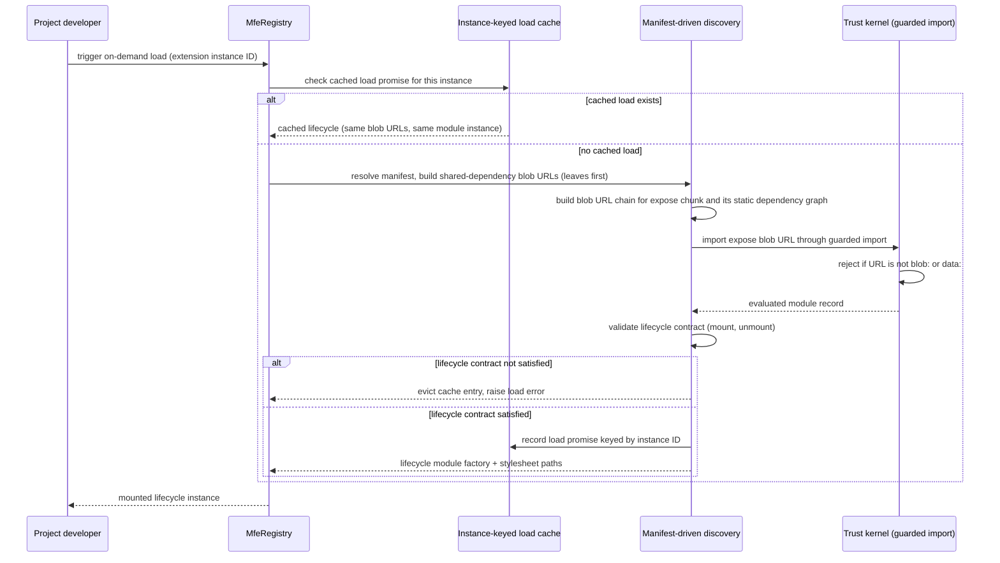
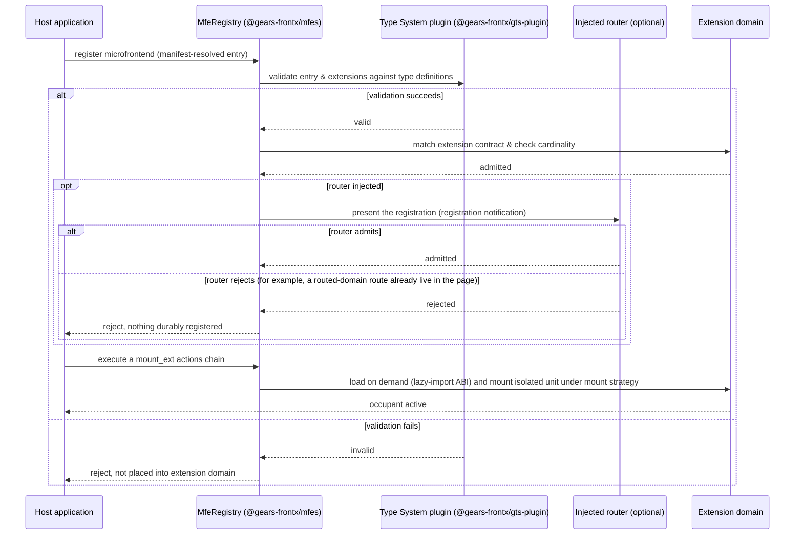
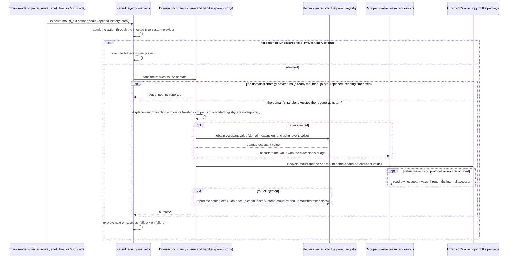
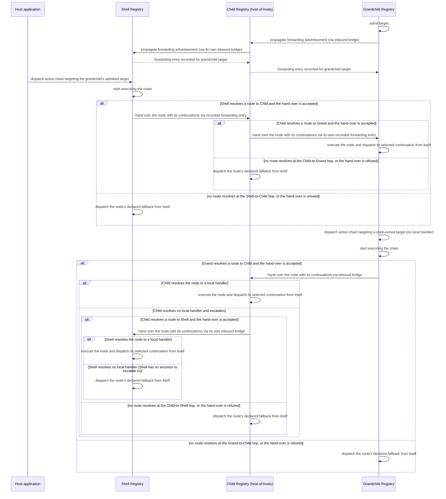

# Technical Design — MFE Runtime

- [ ] `p3` - **ID**: `cpt-frontx-mfes-design-mfe-runtime`

<!-- toc -->

- [1. Architecture Overview](#1-architecture-overview)
  - [1.1 Architectural Vision](#11-architectural-vision)
  - [1.2 Architecture Drivers](#12-architecture-drivers)
  - [1.3 Architecture Layers](#13-architecture-layers)
- [2. Principles & Constraints](#2-principles--constraints)
  - [2.1 Design Principles](#21-design-principles)
  - [2.2 Constraints](#22-constraints)
- [3. Technical Architecture](#3-technical-architecture)
  - [3.1 Domain Model](#31-domain-model)
  - [3.2 Component Model](#32-component-model)
  - [3.3 API Contracts](#33-api-contracts)
  - [3.4 Internal Dependencies](#34-internal-dependencies)
  - [3.5 External Dependencies](#35-external-dependencies)
  - [3.6 Interactions & Sequences](#36-interactions--sequences)
  - [3.7 Database schemas & tables](#37-database-schemas--tables)
- [4. Additional context](#4-additional-context)
- [5. Traceability](#5-traceability)

<!-- /toc -->

## 1. Architecture Overview

### 1.1 Architectural Vision

The MFE Runtime is the substrate a FrontX application loads independently developed units against, without knowing anything about what those units mean. It registers microfrontends and their extensions through an abstract registry facade, discovers and loads them on demand from a published manifest, admits them into governed extension domains only after they pass validation, mediates their communication with the host through a narrow capability bridge, and isolates every loaded unit in its own module graph. None of these five responsibilities requires the runtime to understand a type format, a solution's shared-property vocabulary, or a domain's placement semantics — it reasons about all of them as opaque identifiers and delegates meaning to whoever is injected at the boundary.

The one boundary that makes this possible is the type-substrate port. The runtime carries a declared type identifier as a string, asks an injected provider whether an instance validates and whether one type derives from another, and acts on the verdict — never on the schema itself. This is what lets `@gears-frontx/gts-plugin` be the default provider today and any conforming provider replace it tomorrow without a runtime change, and it is why the runtime's own package holds no dependency on a concrete type-definition specification.

Everything downstream of that boundary follows the same discipline. Extension-domain governance admits an occupant by subset-rule contract matching and a cardinality matrix, never by a domain name the runtime recognizes. The actions-chains mediator routes a chain to a handler keyed by target and action type, never by a shared-property vocabulary the runtime defines. On-demand loading reads locating facts from manifest fields the runtime never parses into a remote-entry format, and isolation confines every dynamic-code primitive isolation requires to one audited trust-kernel file so the arbitrary-code-admission surface stays provably bounded. The runtime is, deliberately, a substrate that knows how to admit, load, mediate, and isolate — and nothing about what it is admitting. Routing follows the same discipline: an optional router injected at the registry factory owns routing identity and pursues agreement between the URL and the mounts, while the runtime only presents registrations to it, hands its opaque per-extension values to the extension's own copy of the package through a private rendezvous, and reports each settled occupancy action to it.

### 1.2 Architecture Drivers

#### Functional Drivers

| Requirement | Design Response |
|-------------|------------------|
| `cpt-frontx-fr-mfe-runtime-registration` | `cpt-frontx-component-mfe-runtime` exposes the abstract `MfeRegistry` facade built via `createMfeRegistryFactory()`, owning the register → type-validate → handler-resolve → domain-admit → load-on-demand → mount sequence; on-demand loading reads locating facts exclusively from the published manifest's declared fields, and every loaded unit evaluates as its own isolated module instance behind the audited trust kernel. Where a router is injected, a domain or extension registration is presented to it and admitted by it before the registration becomes durable, so a registration the router rejects leaves nothing partially admitted (`cpt-frontx-constraint-mfes-router-port`). |
| `cpt-frontx-fr-ui-framework-agnostic` | Handler resolution matches an entry's declared base type through the injected type-system provider rather than a UI-framework-specific self-selection predicate, so the registry carries no assumption about which rendering technology a resolved handler wraps. |
| `cpt-frontx-fr-mfe-type-validation` | Extension admission runs subset-rule contract matching against a domain's declared shared properties and supported actions; entry-handler resolution and the domain's `extensionsTypeId` check run `typeSystem.isTypeOf` against the injected provider, while action handlers match only the exact action type — all before an extension is placed into an extension domain, realizing default-deny admission. |
| `cpt-frontx-fr-application-type-definitions` | The runtime exposes the `TypeSystemPlugin` port opaquely; application and template code registers its own schemas through the same injected provider the runtime calls for its own well-known infrastructure lifecycle actions, so the runtime never owns a schema of its own. |
| `cpt-frontx-fr-mfe-host-communication` | The actions-chains mediator dispatches by a `(targetId, actionTypeId)` keyed registry and recursive success/fallback chain execution; a narrow parent–child capability bridge exposes exactly the participation methods a child needs, each delegating to the registry or mediator without duplicating coordination logic, alongside the identity of the extension and of the extension domain it occupies. One bridge pair exists per registered extension and is handed to every mount of it, so a child's registrations outlive an unmount and the runtime deactivates rather than destroys a bridge between mounts, refusing every hand-over through an inactive one. Where a mounted extension is itself a host of a further registry, dispatch composes transitively across the resulting nesting: reachability propagates and escalates hop by hop through the bridge connecting each pair of adjacent registries (`cpt-frontx-constraint-mfes-cross-nesting-reachability`), with no growth to the public bridge or registry surface. Mounting, restoration and opening included, is requested only through the `mount_ext` action sent as an actions chain; `mount_ext` and `unmount_ext` each carry one optional, strictly typed history intent (`none`, `replace`, or `push`, an absent intent meaning `push`) that the runtime passes to an injected router uninterpreted, and each `mount_ext` or `unmount_ext` execution that settles in a domain is reported once to that router, from the domain's own handler path, before the chain continues (its `next` on success, its `fallback` on failure) (`cpt-frontx-constraint-mfes-router-port`). |
| `cpt-frontx-fr-mfe-multi-occupant-domain` | Extension-domain occupancy is governed by three composable named mount strategies (Concurrent, Optional, Exclusive) validated against a cardinality matrix at domain registration, so a domain accepts side-by-side, displacing, or exclusive occupants according to the strategy its declared lifecycle actions satisfy. |

#### NFR Allocation

| NFR ID | NFR Summary | Allocated To | Design Response | Verification Approach |
|--------|-------------|--------------|-----------------|-----------------------|
| `cpt-frontx-nfr-runtime-performance` | Runtime response-time and throughput targets | `cpt-frontx-component-mfe-runtime` | The lazy-import ABI resolver defers a chunk's fetch and evaluation until it is first exercised rather than eagerly at parent-load time, and shared-dependency source text is deduplicated across MFE loads through a cross-MFE LRU cache keyed by an identifier for the producing build — a declared content hash of the emitted chunk when available, otherwise the resolved absolute chunk URL, which confines reuse to loads of the same microfrontend — in one bounded cache per realm that compatible independently loaded copies of the package converge on (`cpt-frontx-constraint-mfes-realm-shared-dep-cache`), so an already-loaded build is not refetched by any copy, keeping the eager working set small without duplicating a singleton dependency. | Load-time benchmarks asserting the runtime's share of the PRD's p95 registration and on-demand-load thresholds, and that a lazy chunk is fetched only on first exercise. |
| `cpt-frontx-nfr-security` | Default-deny posture; validated admission | `cpt-frontx-component-mfe-runtime` | Every extension is denied admission until subset-rule contract matching and cardinality validation both succeed; every loaded unit evaluates inside its own module graph behind an audited trust-kernel file whose dynamic-import primitive rejects any URL that is not `blob:` or `data:`, confined there by a custom lint rule. No interface the runtime hands to extension or host code — the bridge, the registry, the mount context, lifecycle arguments, actions, or shared properties — exposes an occupant value, so one occupant cannot read or address another's entry; occupant values pass only between copies of the package, through a private realm rendezvous, and between the runtime and the injected router (`cpt-frontx-constraint-mfes-router-port`). That is an interface-level guarantee, not a confidentiality boundary against same-realm code that reads the realm's global object or the raw URL. | Admission audit asserting no extension is mounted without passing the full admission sequence, and a CI boundary check confirming dynamic-code primitives appear only in the trust-kernel file; tests asserting that no occupant value is observable on the bridge, the inbound bridge link, the mount context, lifecycle arguments, actions, or shared properties. |

**ADR coverage references:**

- `cpt-frontx-adr-core-package-boundaries`
- `cpt-frontx-adr-mfe-runtime-public-surface`
- `cpt-frontx-adr-runtime-type-system-coupling`
- `cpt-frontx-adr-mfe-handler-resolution`
- `cpt-frontx-adr-action-dispatch-and-chaining`
- `cpt-frontx-adr-child-mfe-host-access`
- `cpt-frontx-adr-extension-domain-occupancy`
- `cpt-frontx-adr-domain-extension-compatibility`
- `cpt-frontx-adr-mfe-load-isolation`
- `cpt-frontx-adr-lazy-import-resolution`
- `cpt-frontx-adr-mfe-asset-discovery`
- `cpt-frontx-adr-shared-dep-dedup-key`
- `cpt-frontx-adr-shared-dep-cache-reach`
- `cpt-frontx-adr-extension-routing-port`

### 1.3 Architecture Layers

- [x] `p3` - **ID**: `cpt-frontx-mfes-tech-runtime-stack`

```mermaid
graph TD
    App[Host application] -->|createMfeRegistryFactory().build| Registry[MfeRegistry facade]
    Registry --> Handler[MfeHandler resolution]
    Registry --> Domain[Extension-domain governance]
    Registry --> Loader[Manifest-driven loading]
    Loader --> Isolation[Trust-kernel isolation]
    Registry --> Mediator[Actions-chains mediator]
    Mediator --> Bridge[Parent-child capability bridge]
    Registry -- "opaque type-substrate port" --> TypeSystem["Injected TypeSystemPlugin"]
    Domain -- "isTypeOf, validateInstance" --> TypeSystem
    Registry -. "optional abstract router port" .-> Router["Injected router (optional, template framework)"]
    Domain -. "settled mount_ext / unmount_ext report" .-> Router
    Domain -- "occupant value, keyed by the extension's bridge" --> Rendezvous["Occupant-value realm rendezvous"]
```

| Layer | Responsibility | Technology |
|-------|---------------|------------|
| Public surface | Registry facade and factory, handler and bridge type contracts, port types (the type-substrate port and the optional router port), error classes, one entry point | TypeScript, single entry point with declarations |
| Registration & admission | Handler resolution, subset-rule contract matching, cardinality validation, extension and domain lifecycle state, presentation of registrations to an injected router and release notifications to it, occupant-value handover between copies of the package, settled-action reports to an injected router | TypeScript over the injected `TypeSystemPlugin` and the optional injected router, version-namespaced realm-global rendezvous |
| Loading & isolation | Manifest-driven discovery, lazy-import ABI resolution, blob-URL chain construction, the audited trust kernel | Browser `fetch`, `Blob`, dynamic `import()`, cross-MFE shared-dependency source-text deduplication (no shared module instances) |
| Mediation | Actions-chains mediator, parent–child capability bridge | TypeScript, keyed handler registry |

## 2. Principles & Constraints

### 2.1 Design Principles

#### Opaque Substrate, No Owned Vocabulary

- [x] `p2` - **ID**: `cpt-frontx-mfes-principle-opaque-substrate-vocabulary`

The runtime owns no type format, no shared-property vocabulary, and no extension-domain naming of its own. Every identifier that crosses a runtime boundary — a declared type, a shared property, a domain, an action type — is a string the runtime carries and compares, never a value whose meaning the runtime interprets. Where meaning is required, it is obtained by delegation: to the injected `TypeSystemPlugin` for type validation and hierarchy, to the application for shared-property and domain identity, to an injected router for routing identity and the URL, to the handler for what an admitted entry actually renders.

This matters because the alternative — the runtime recognizing even one concrete vocabulary as a convenience — creates a second path with different capabilities than the one plugins and applications get, and ties the runtime's own evolution to that vocabulary's. Keeping the runtime's admission, mediation, and loading paths free of owned vocabulary is what lets a conforming type-system provider, an arbitrary set of application-defined domains, and an arbitrary shared-property channel all compose against the same runtime without a runtime release.

#### Agnostic core substrate

- [ ] `p2` - **ID**: `cpt-frontx-principle-agnostic-core`

The MFE Runtime stays free of UI-framework choice, concrete type-format knowledge, solution vocabulary and routing grammar. Applications and microfrontends supply those choices through narrow runtime contracts; routing reaches the runtime only through the optional router port the runtime declares itself (`cpt-frontx-constraint-mfes-router-port`).

#### Opaque type substrate

- [ ] `p2` - **ID**: `cpt-frontx-principle-opaque-type-substrate`

The runtime carries type identifiers opaquely and delegates schema shape, validation and hierarchy resolution to an injected provider. It does not inspect a concrete type-definition format.

#### Default-deny admission

- [x] `p2` - **ID**: `cpt-frontx-principle-default-deny-admission`

A microfrontend gains placement only after type validation and extension-domain contract checks pass. Loaded units receive only the capabilities granted by their admitted domain.

### 2.2 Constraints

#### MFES-1 — No type-format literals in the MFE Runtime

- [ ] `p2` - **ID**: `cpt-frontx-constraint-mfes-no-type-format-literals`

The MFE Runtime (`@gears-frontx/mfes`) contains no type-system-format string literals. Type identifiers are opaque strings to the runtime; any concrete type-format vocabulary belongs to the type-system plugin or to consumers. This keeps the runtime independent of any single type-definition specification.

**ADRs**: [Partition the Core Framework into Boundary-Governed Concerns](../../../architecture/ADR/0002-core-package-boundaries.md)

#### MFES-2 — No solution-specific shared-property identifiers in the MFE Runtime

- [ ] `p2` - **ID**: `cpt-frontx-constraint-mfes-no-solution-shared-properties`

The MFE Runtime defines no solution-specific shared-property identifiers (such as theme or language vocabulary). Shared-property identity is supplied by the application or its templates, so the runtime's communication substrate carries no domain assumptions.

**ADRs**: [Partition the Core Framework into Boundary-Governed Concerns](../../../architecture/ADR/0002-core-package-boundaries.md)

#### MFES-3 — No specific extension-domain values in the MFE Runtime

- [x] `p2` - **ID**: `cpt-frontx-constraint-mfes-no-layout-domain-values`

The MFE Runtime defines no specific extension-domain (layout-domain) values. Which domains exist, what they are named, and what may occupy them are defined by the application, keeping placement vocabulary out of the platform.

**ADRs**: [Partition the Core Framework into Boundary-Governed Concerns](../../../architecture/ADR/0002-core-package-boundaries.md)

#### MFES-4 — No concrete type-format dependency in the MFE Runtime

- [ ] `p2` - **ID**: `cpt-frontx-constraint-mfes-no-type-format-dependency`

The MFE Runtime declares no dependency on any concrete type-system-format implementation. The format provider is injected through the type-substrate port, so the runtime can be composed with any conforming type system.

**ADRs**: [Partition the Core Framework into Boundary-Governed Concerns](../../../architecture/ADR/0002-core-package-boundaries.md)

#### MFES-5 — Opaque schema surface in the MFE Runtime

- [ ] `p2` - **ID**: `cpt-frontx-constraint-mfes-opaque-schema-surface`

The runtime's schema surface is opaque, exposing only a stable identifier. Format-specific schema shape and validation live in the type-system plugin, so the runtime reasons about types solely by identity.

**ADRs**: [The Runtime Coupling to the Type System](../../../architecture/ADR/0004-runtime-type-system-coupling.md)

#### MFES-6 — Cross-nesting reachability without public-surface growth

- [ ] `p2` - **ID**: `cpt-frontx-constraint-mfes-cross-nesting-reachability`

When a mounted extension is itself a host of a further `MfeRegistry`, dispatch and reachability across the resulting nesting depth compose entirely through pairwise, adjacent-registry propagation and escalation carried over the bridge connecting each pair — no registry ever holds a reference to a non-adjacent registry. This composition introduces zero growth to the package's public surface: no new capability method is added to `MfeRegistry`, `ChildMfeBridge`, `ParentMfeBridge`, or any other type declared in the §3.3 API Contracts table. The measure this constraint applies is the capability method, as the enumeration above already implies by naming types rather than members: what a nested composition must not do is give a consumer a new operation to invoke, or a new type to import, in order to reach across nesting. A readonly identity property on a type already on that list — a bridge stating which extension and which extension domain it belongs to, in the same opaque identifiers the runtime already routes by — is identity, not capability, and is therefore outside what this constraint counts, while remaining fully governed by `cpt-frontx-interface-mfe-runtime`'s breaking-change policy like every other member of a published contract. Because a nested composition may involve more than one independently loaded copy of this package (`cpt-frontx-adr-mfe-load-isolation`), the coordination this composition needs at a nested registry's first adoption is carried by a realm-global, version-namespaced rendezvous (the mount-context rendezvous) rather than an exported API — an implicit inter-copy protocol distinct from, and not counted against, the public-surface guarantee above, since it adds no importable symbol and holds, for the duration of one synchronous handoff, only the bridge being handed down and the callback each adopting registry hands back up, ordinarily exactly one — nothing remains at the rendezvous once that window closes. The occupant-value rendezvous MFES-9 describes is a separate realm-global slot, not this one: its entries are associated with an extension's bridge and released with that bridge rather than with one handoff window, and it likewise adds no capability method to `MfeRegistry` or to either bridge, no member to either bridge contract, and no exported symbol.

A nested runtime — the extension's loaded unit, with its own copy of this package — builds its registry once, inside the synchronous handoff of that runtime's first mount, and that registry adopts its host link there; a registry built outside every such handoff is a root. Building once is a contract of the nested runtime's own application, which this package does not enforce. The parent keeps, per extension, the relink callbacks of the registry's adopters as private state — not rendezvous state and not an exported symbol — across an unregistration, so the next mount re-offers the new link to the retained registry with no second build and no rendezvous; it is bounded by the set of extensions the parent has registered (`cpt-frontx-algo-mfe-host-communication-registration-propagation`).

**ADRs**: [Host–MFE Action Dispatch and Chaining](../../../architecture/ADR/0007-action-dispatch-and-chaining.md), [Child MFE Access to the Host](../../../architecture/ADR/0008-child-mfe-host-access.md), [Inject an Optional Router Port and Exchange Occupant Values Through a Private Rendezvous](../../../architecture/ADR/0036-extension-routing-port.md)

#### MFES-7 — Realm-shared dependency source-text reuse

- [x] `p2` - **ID**: `cpt-frontx-constraint-mfes-realm-shared-dep-cache`

Compatible independently loaded copies of this package coexisting in one JavaScript realm converge on a single versioned, bounded shared-dependency source-text cache, so that two loads whose deduplication key already establishes them as reusing the same emitted build (`cpt-frontx-adr-shared-dep-dedup-key`) fetch that build's source text once for the realm rather than once per copy (`cpt-frontx-adr-shared-dep-cache-reach`). What the copies share is inert source text and nothing else: no module record crosses the boundary, and every load continues to construct its own isolated module graph over that text, so the per-instance isolation `cpt-frontx-adr-mfe-load-isolation` guarantees holds unchanged and the load cache holding evaluated graphs stays scoped to one evaluated copy. Convergence introduces zero growth to the package's public surface — no exported symbol, no capability method on any type in the §3.3 API Contracts table, and no constructor argument — and it is carried neither by the package's two other realm-global rendezvous slots nor by the parent–child bridge: the mount-context rendezvous entry MFES-6 describes is scoped to one synchronous handoff window and retains nothing afterwards, the occupant-value rendezvous MFES-9 describes holds only values associated with a live extension bridge, and the bridge carries participation in dispatch, not loading. The cache is therefore reached only through a rendezvous of its own, the third of those slots, namespaced by an explicit protocol version so that a copy meeting a version it does not recognize leaves that state untouched and falls back to a bounded cache local to itself rather than operating on semantics it cannot establish. That rendezvous is trusted same-realm coordination state and authenticates no publisher: a structurally conforming protocol entry is adopted whichever same-realm code published it, and the version and structural checks guard against accidental incompatibility rather than against a same-realm publisher observing or substituting cached source text (`cpt-frontx-adr-shared-dep-cache-reach` records why that is accepted). Its capacity bounds the realm rather than each handler, and bounds the number of resident mappings rather than the bytes they retain — no byte ceiling is claimed, because a single source response is not itself size-limited here. Its lifetime is the realm's: a resident fulfilled value stays strongly reachable, no holder count governs it, and no handler, registry or extension teardown clears it.

**ADRs**: [How Far Should the Shared-Dependency Source-Text Cache Reach?](../../../architecture/ADR/0035-shared-dep-cache-reach.md), [What Identity Should the Cross-MFE Shared-Dependency Source-Text Cache Key On?](../../../architecture/ADR/0034-shared-dep-dedup-key.md)

#### MFES-8 — Recursive chain execution

- [ ] `p2` - **ID**: `cpt-frontx-constraint-mfes-recursive-chain-execution`

A chain is fully described by its type: the current action, an optional `next` chain, and an optional `fallback` chain. `executeActionsChain(chain)` takes only the chain and returns nothing awaitable. The runtime executes the action. On success it executes `next` recursively, and on failure it executes `fallback` recursively. Where the selected branch is absent, the chain ends. Chain execution records and reports nothing. The one report the runtime makes about an occupancy action is not made by chain execution: it comes from the domain's own `mount_ext` or `unmount_ext` handler path, before the chain continues (its `next` on success, its `fallback` on failure), and is the router port's concern (MFES-9).

An action fails when it does not succeed: it is not admitted (the injected type-system provider rejects it, or its target has not declared it), its handler throws or rejects, its per-action timeout expires (the action's declared timeout, otherwise the domain default), no handler exists for its target, or its hand-over across a hop is refused. The runtime does no ahead-of-time processing of a chain — no validation, no pre-parsing, and no cycle check — and it tracks no origin, status, or completion.

Where the action's target lives in another runtime, the current runtime hands the sub-chain — the action with its `next` and `fallback` — to that runtime, which executes it the same way. Nothing comes back.

**ADRs**: [The MFE Runtime's Public Access Surface](../../../architecture/ADR/0003-mfe-runtime-public-surface.md), [Host–MFE Action Dispatch and Chaining](../../../architecture/ADR/0007-action-dispatch-and-chaining.md), [Child MFE Access to the Host](../../../architecture/ADR/0008-child-mfe-host-access.md), [Inject an Optional Router Port and Exchange Occupant Values Through a Private Rendezvous](../../../architecture/ADR/0036-extension-routing-port.md)

#### MFES-9 — Optional router port and private occupant-value exchange

- [ ] `p2` - **ID**: `cpt-frontx-constraint-mfes-router-port`

The MFE Runtime declares an optional abstract router port of its own and accepts a router implementing it as an optional part of the registry factory's configuration, in the same way it accepts the type system (`cpt-frontx-adr-runtime-type-system-coupling`). The package depends on neither `@gears-frontx/routing` nor `@gears-frontx/routing-tanstack`, and neither depends on it, so the runtime holds no routing grammar: it neither derives nor validates a routing token, holds no route-uniqueness rule, and never interprets an occupant value. The concrete router implementing the port is provided by the template framework and is template territory. The factory snapshots the router alongside the type system on its first build, so the router is part of the factory's cache identity: a later build that supplies a different router, or changes the router's presence or absence, is rejected rather than handed the cached registry. A registry built with no router runs every extension standalone and reports nothing.

Registration and release notifications on the port are the router's private admission path. At domain and extension registration the runtime presents the declaration to the injected router, which derives and validates any routing identity it needs and rejects a routed-domain route that collides with another routed domain live in the page: routing identity and page-wide uniqueness of domain routes belong to the router, not to the runtime. Admission by the router precedes durable registration, so a registration the router rejects leaves nothing partially admitted. Unregistering an extension or a domain, and terminal disposal of a registry, send the release notifications that free what the router admitted. These notifications add no member to the registry or to either bridge.

At mount, the parent-side copy of the runtime obtains from the router an opaque per-extension occupant value, computed from the registered domain, the registered extension, and the value assigned to the level enclosing that domain, and hands it to the extension's own copy of the package through a realm-global rendezvous of its own. That rendezvous follows the protocol `cpt-frontx-adr-shared-dep-cache-reach` fixes: a version-namespaced slot reached behind an internal accessor, entries checked structurally rather than by class identity, and a copy that meets a malformed entry or a version it does not recognize treats the rendezvous as absent and neither reads, mutates, replaces nor deletes what it found. Each value is associated with the bridge the parent copy creates for that extension, is set before the extension's lifecycle mount runs, and is released with that bridge. Occupant values pass only between copies of the package and between the runtime and the injected router; they never travel on the bridge, the inbound bridge link, the mount context, lifecycle arguments, actions, or shared properties. No interface the runtime hands to extension or host code exposes an occupant value, and no code of this package passes one to extension or host code. That guarantee holds at the level of the package's own interfaces and is not a confidentiality boundary: the rendezvous slot and the URL are readable by any script running in the same realm, which is accepted on the same ground `cpt-frontx-adr-shared-dep-cache-reach` records for its own slot. A copy that backs away from an unrecognized version still mounts the extension, with no occupant value crossing.

The runtime reports each `mount_ext` or `unmount_ext` execution that settles in a domain once, to the router injected into the registry holding that domain, from the domain's own handler path and before the chain continues (its `next` on success, its `fallback` on failure), carrying the domain, the history intent, and the extensions physically mounted and unmounted during that execution. An Optional displacement and an Exclusive eviction are among the extensions unmounted in that one report; occupants nested inside a hosted extension's own registry, released when that extension departs, are not part of it. An execution is a request for which the domain's strategy ran; one that settles without changing any mount is reported once with nothing mounted or unmounted, and the router writes nothing for it. Of the action the router reads only the report: it never reads the action type and holds no cardinality knowledge, applies the mounted and unmounted extensions in one URL write with the action's history intent, and removes a departing host's nested entries itself in that same write. A request for which the domain's strategy never runs is not an execution and reports nothing: a mount of an extension that is already mounted, an unmount whose subject is absent at its turn, a request joining an entry already queued or running, a pending request replaced by a later one, a pending request whose timer fires before it starts, and a request refused while its domain is being unregistered (`cpt-frontx-adr-extension-domain-occupancy`). An Exclusive domain's `unmount_ext` is passed straight to the domain's handler, outside the occupancy queue and the report: its strategy's unmount changes nothing and fails, and nothing is reported. Mount or unmount events that occur outside an action — a slot detach, unregistration, terminal disposal — never reach the router as reports; only the release notifications do. Unregistration and terminal disposal are not occupancy actions: they release occupants directly as resource cleanup — unregistering a mounted extension unmounts it before destroying its container, and disposal releases the registry's resources.

Mounting happens only through the `mount_ext` action sent as an actions chain, restoration and opening included. Both `mount_ext` and `unmount_ext` carry one optional, strictly typed history intent whose values are `none`, `replace`, and `push`, an absent intent meaning `push`; the runtime passes it to the router uninterpreted on either action. Concrete action schemas are closed — an undeclared field on an action or on its payload fails admission — while the base action schema stays open so that concrete actions can derive from it. The schemas are owned by the type-system provider (GTS-PLUGIN-1, in the plugin's own DESIGN); the runtime's part is that every action is admitted through that provider before its handler runs, so an action that fails admission fails as MFES-8 describes. Every extension domain supports `unmount_ext`; the cardinality matrix requires both mount and unmount for every named strategy, and an Exclusive domain's own `unmount_ext` handler runs the Exclusive strategy's unmount, which changes nothing and fails.

**ADRs**: [Inject an Optional Router Port and Exchange Occupant Values Through a Private Rendezvous](../../../architecture/ADR/0036-extension-routing-port.md), [Partition the Core Framework into Boundary-Governed Concerns](../../../architecture/ADR/0002-core-package-boundaries.md), [Extension-Domain Occupancy](../../../architecture/ADR/0009-extension-domain-occupancy.md), [How Far Should the Shared-Dependency Source-Text Cache Reach?](../../../architecture/ADR/0035-shared-dep-cache-reach.md)

## 3. Technical Architecture

### 3.1 Domain Model

| Entity | Definition | Representation |
|--------|------------|----------------|
| Schema | A type-definition identity the runtime carries opaquely; the runtime holds only its string identifier and never its structural shape. | Opaque `string` identifier on the runtime's public surface; concrete shape lives behind the injected `TypeSystemPlugin`. |
| MfeEntry | A registrable microfrontend's declared identity: its type identifier, manifest reference, and (for the module-federation handler) the entry-specific fields the handler needs to load it. | `MfeEntry` / `MfeEntryMF` types. Lifecycle: the mfe-registry FEATURE specifies a formal state machine (UNREGISTERED → REGISTERED → HANDLER_RESOLVED → ADMITTED → MOUNTED / REJECTED, `cpt-frontx-state-mfe-registry-entry-lifecycle`); the runtime honors the unregister transition and tracks `loadState` and `mountState` per extension instance in place of one reified entry state. |
| Extension | A registered occupant carrying an `MfeEntry`, its declared required properties, supported capabilities, and required domain capabilities, evaluated against a target `ExtensionDomain`'s contract. Any route it declares is carried uninterpreted and presented, with the rest of the declaration, to an injected router at registration. | `Extension` type; instance-keyed so two extensions sharing one entry definition produce distinct isolated loads. |
| ExtensionDomain | A governed placement composed with one named mount strategy (Concurrent, Optional, or Exclusive) and a declared set of lifecycle actions, validated against a cardinality matrix at registration. Any route it declares is carried uninterpreted and presented to an injected router at registration, which owns its validity and its page-wide uniqueness among routed domains. | `ExtensionDomain` type plus `ExtensionDomainImplementation` / `ExtensionDomainImplementationFactory`. |
| Action / ActionsChain | A typed message dispatched to a `(targetId, actionTypeId)` pair, optionally chained with `next` and `fallback` continuations for recursive success/failure routing. Concrete action schemas are closed and the base action schema is open; `mount_ext` and `unmount_ext` each carry one optional history intent (`none`, `replace`, or `push`, absent meaning `push`). | `Action`, `ActionsChain` types, admitted through the injected type-system provider before dispatch. |
| Router port | The optional abstract router the runtime declares and accepts through the registry factory's configuration: the private channel through which an injected router admits and releases routed registrations, supplies occupant values at mount, and receives one report per settled `mount_ext` or `unmount_ext` execution (MFES-9). | Abstract contract declared by this package; its members belong to the FEATUREs owning registration and mounting; the concrete implementation is provided by the template framework. |
| Occupant value | An opaque per-extension value the injected router computes at mount from the registered domain, the registered extension, and the value assigned to the enclosing level; the runtime hands it over and never interprets it. | Held at a version-namespaced realm rendezvous, associated with the extension's bridge from before lifecycle mount until that bridge is released; absent from every interface handed to extension or host code. |
| LifecycleStage | An automatic trigger of an actions chain that accompanies a runtime transition — a notification that the transition is happening, not a phase the transition is composed of and not something the transition must complete before proceeding. | `LifecycleStage`, `LifecycleHook` types; dispatched alongside mount, unmount, initialization, and destruction transitions by `LifecycleManager` and `DomainLifecycleTrigger`. |

**Relationships**:
- Router port → Extension, ExtensionDomain: an injected router admits each routed registration before it becomes durable and is released from it at unregistration or disposal.
- Occupant value → Extension: one per extension, associated with that extension's bridge, set at each mount before the lifecycle mount runs, and released with the bridge.
- Action (`mount_ext`, `unmount_ext`) → Router port: each execution that settles in a domain produces one report.

### 3.2 Component Model

#### MFE Runtime

- [ ] `p2` - **ID**: `cpt-frontx-component-mfe-runtime`

Concrete artifact: `@gears-frontx/mfes`.

##### Why this component exists

Applications need to gain user-facing functionality from independently developed units at runtime, without rebuilding or redeploying the host. The MFE Runtime is the substrate that registers those units, loads them on demand, places them into governed extension domains, mediates their communication with the host, and admits them only after type validation.

##### Responsibility scope

- Owns microfrontend registration and on-demand loading, exposed through an abstract registry facade (`MfeRegistry`, built via `createMfeRegistryFactory()`).
- Owns extension-domain governance, mount-strategy selection (concurrent / optional / exclusive), and the cardinality rules that admit or reject occupants.
- Owns the actions-chains mediator that routes communication between microfrontends and the host, and the narrow parent–child capability bridge.
- Owns the opaque type-substrate port: it reasons about type identifiers as opaque strings and delegates all schema, validation, and hierarchy operations to an injected type-system provider, reading only a schema's identifier.
- Owns runtime isolation of loaded units.
- Owns realm-scoped deduplication of shared-dependency source text: compatible independently loaded copies of the package in one realm reuse one bounded source-text cache, while each load still evaluates its own isolated module graph (`cpt-frontx-constraint-mfes-realm-shared-dep-cache`).
- Supports recursive composition: a mounted extension may itself hold and host a further `MfeRegistry` instance, and the mediator and bridge mechanisms remain reachable transitively across any resulting nesting depth, with no change to the public surface (`cpt-frontx-constraint-mfes-cross-nesting-reachability`).
- Owns the optional router port it declares and its side of that contract: presenting domain and extension registrations to an injected router before they become durable and sending release notifications at unregistration and disposal; obtaining each extension's occupant value from the router at mount, handing it to the extension's own copy of the package through a private realm rendezvous before the lifecycle mount runs, and releasing it with the extension's bridge; and reporting each settled `mount_ext` or `unmount_ext` execution once, from the domain's handler path, before the chain continues (its `next` on success, its `fallback` on failure) (`cpt-frontx-constraint-mfes-router-port`).

##### Responsibility boundaries

- Defines no concrete type-system format, declares no dependency on one, and contains no type-format string literals — the format provider is injected (MFES-1, MFES-4, MFES-5).
- Defines no solution-specific shared-property identifiers and no specific extension-domain values — those are supplied by the application or its templates (MFES-2, MFES-3).
- Owns no URL and no routing grammar: it derives and validates no routing token, holds no page-wide route-uniqueness rule, never interprets an occupant value, and depends on no routing package in either direction. Routing identity, the uniqueness of domain routes, and the pursuit of agreement between the URL and the mounts belong to the injected router; the concrete router is provided by the template framework, which is template territory and has no component in this tree (MFES-9).
- Exposes no occupant value on any interface it hands to extension or host code (MFES-9).
- Does not own UI rendering technology; applications and microfrontends choose their own UI framework.
- Does not own template resolution, project lifecycle, or AI tooling — those belong to the CLI and the AI Tooling kit.

##### Related components (by ID)

- `cpt-frontx-component-type-system-plugin` — the default provider of the opaque type-substrate port this component defines; the runtime consumes it as an implementation injected at registry construction.

### 3.3 API Contracts

- [ ] `p2` - **ID**: `cpt-frontx-mfes-interface-package-entry`

- **Contracts**: `cpt-frontx-interface-mfe-runtime` (the registry facade contract that is the sole public runtime surface)
- **Technology**: TypeScript library API, single entry point with declarations
- **Location**: [src/index.ts](../src/index.ts)

| Public surface | Purpose |
|----------------|---------|
| `MfeRegistry`, `MfeRegistryFactory`, `createMfeRegistryFactory` | The abstract registry facade, its abstract factory contract, and the creation function — the sole way a consumer obtains a registry instance bound to an injected `TypeSystemPlugin` and, optionally, to an injected router; the factory's cache identity covers both (MFES-9). The concrete `DefaultMfeRegistry` / `DefaultMfeRegistryFactory` stay internal (ADR-0003, `scripts/mfes-import-boundary-check.mjs`). |
| `TypeSystemPlugin`, `ValidationResult`, `ValidationErrorItem`, `isInfrastructureLifecycleAction` | The opaque type-substrate port contract a provider implements, and the shared helper for recognizing the well-known infrastructure lifecycle actions (`load_ext`, `mount_ext`, `unmount_ext`). |
| Abstract router port | The optional router contract the runtime declares, accepted as an optional part of the registry factory's configuration alongside the type system; it covers registration and release notifications, occupant-value provision at mount, settled-action reports, and navigation supply, and adds no member to `MfeRegistry` or to either bridge (`cpt-frontx-mfes-interface-router-port`). |
| `MfeEntry`, `Extension`, `ExtensionDomain`, `SharedProperty`, `Action`, `ActionsChain`, `LifecycleStage`, `LifecycleHook`, `DomainContext`, `InvalidatableDomainContext` | Domain types shared across registration, admission, and mediation, and the abstract contract a domain's runtime context conforms to; the `mount_ext` and `unmount_ext` actions carry the optional history intent. `InvalidatableDomainContext`, the concrete implementation of `DomainContext` (constructed only by `DefaultMfeRegistry`), is recorded public-surface debt (see the debt register below the table). |
| `MfeHandler`, `MfeHandlerMF`, `MfeBridgeFactory`, `ChildMfeBridge`, `ParentMfeBridge`, `LruCache`, `RetryHandler` | The handler abstraction resolved by declared base type, its default module-federation implementation, and the narrow parent/child capability bridge pair — `ChildMfeBridge` carrying four capability methods plus the readonly identity properties `extDomainId` and `extensionId`, `ParentMfeBridge` carrying `instanceId` and `dispose()`, with both bridges' identity values and `dispose()` scoped to the extension's registration rather than to a single mount. `MfeHandlerMF` is sanctioned surface: hosts construct it and pass it to the registry, and it wires its own `MfeBridgeFactoryDefault` internally — the factory implementation is not exported. `LruCache` and `RetryHandler` are recorded public-surface debt (see the debt register below the table). |
| `MountStrategy`, `ConcurrentMountStrategy`, `OptionalMountStrategy`, `ExclusiveMountStrategy`, `ExtensionDomainImplementation`, `ExtensionDomainImplementationFactory`, `ExtensionMounter` | The three named mount strategies and the domain-implementation machinery that enforces the cardinality matrix and executes occupancy behavior. |
| `ActionHandler`, `ActionsChainsMediator` | The actions-chains mediator contract; `executeActionsChain` takes a chain and returns nothing awaitable. The default keyed-dispatch implementation stays internal (ADR-0003). |
| `validateContract`, `formatContractErrors`, `validateDomainLifecycleHooks`, `validateExtensionLifecycleHooks`, `validateExtensionType` | The subset-rule contract-matching and lifecycle-hook validation functions used at admission. |
| `MfManifest` and related manifest types, `LazyLoaderRegistry`, `LazyResolver` | The published-manifest shape the loading path reads, and the lazy-import ABI's host-side resolver registry. |
| `MfeError`, `DomainValidationError`, `MfeLoadError`, `ExtensionTypeError`, `MfeTypeConformanceError`, `UnsupportedLifecycleStageError`, `EntryTypeNotHandledError`, `DomainUnregisteringError` | The error hierarchy surfaced by rejection and load-failure paths. |
| `createShadowRoot`, `injectCssVariables`, `injectStylesheet` | Shadow-DOM mount utilities used by handlers to isolate rendered output. |
| `ExtensionManager`, `MountManager`, `LifecycleManager`, `RuntimeBridgeFactory`, `OperationSerializer`, `WeakMapRuntimeCoordinator`, `MfeStateContainer`, `LoadExtHandler` | The coordination contracts behind the facade — governance, mounting, lifecycle orchestration, bridge construction, and state, exported for handler and extension authors. Their `Default*` implementations stay internal (ADR-0003): the registry wires them itself and nothing outside the composition root may construct a rival set. `OperationSerializer`, `WeakMapRuntimeCoordinator`, and `LoadExtHandler` are concrete classes recorded as public-surface debt (see the debt register below the table). |
| `extractGtsPackage` | A string-parsing utility over a GTS-shaped entity identifier. It imports no type-definition specification, but its segment rules encode the GTS identifier grammar — a known tension with the format-agnosticism MFES-1/MFES-4 intend, and a candidate for relocation to the type-system provider. |

**Public-surface debt register**. The barrel still exports six concrete implementations that ADR-0003's encapsulation driver would keep internal but that the `Default*` naming rule enforced by `scripts/mfes-import-boundary-check.mjs` does not detect: `OperationSerializer`, `WeakMapRuntimeCoordinator` (registry coordination), `LoadExtHandler` (lifecycle action wiring), `InvalidatableDomainContext` (domain-context wiring — the concrete implementation of the exported `DomainContext` contract), and `LruCache`, `RetryHandler` (module-federation handler internals). Each is debt, not sanctioned surface. Owner: the mfes package maintainers. Removal criterion (objective, not "temporary"): drop an item from the barrel in the next pre-1.0 minor once a repo-wide consumer scan shows zero imports of it outside `packages/mfes`, and, in the same change, add its name to the `CONCRETE_EXPORT_DENYLIST` in `mfes-import-boundary-check.mjs` so it cannot return.

**How far the boundary check reaches.** The guard behind this surface has two halves and they do not reach equally far (ADR-0003). The **barrel half** — the `Default*` naming rule plus `CONCRETE_EXPORT_DENYLIST` — is structural: a name this package's barrel does not export cannot be imported from anywhere, so that half answers for every consumer of the runtime in any repository, and it is the half that must stay complete. The **consumer half** — no concrete-class import and no deep import past the barrel — walks a tree of consumers, so it answers only for the consumers in the tree it walks, which is this repository's. A repository that holds consumers of its own confirms that half by running the same rule over its own tree; a consumer in a repository that runs no such check is unchecked, and no run here will say so. Tightening one copy of the walking half does not tighten another, which is the standing cost of a rule whose subject is wider than any one tree.

#### Router port

- [ ] `p2` - **ID**: `cpt-frontx-mfes-interface-router-port`

- **Contracts**: `cpt-frontx-interface-mfe-runtime` (an optional, backward-compatible addition to that surface, governed by its breaking-change policy)
- **Technology**: TypeScript abstract contract declared by this package and implemented outside it, by the router the template framework provides
- **Location**: [src/index.ts](../src/index.ts)

| Obligation | Direction | Purpose |
|------------|-----------|---------|
| Registration and release notifications | Runtime to router | Present each domain and extension registration for admission before it becomes durable, and free what the router admitted at unregistration and terminal disposal; the router owns routing identity and the page-wide uniqueness of domain routes. |
| Occupant value | Router to runtime, at mount | Supply the opaque per-extension value computed from the registered domain, the registered extension, and the enclosing level's value; the runtime hands it to the extension's own copy of the package through the private rendezvous and never interprets it. |
| Settled-action report | Runtime to router | Report each `mount_ext` or `unmount_ext` execution that settles in a domain, once, before the chain continues (its `next` on success, its `fallback` on failure), with the domain, the history intent, and the extensions mounted and unmounted during it; an execution that changes no mount is still reported once, with nothing mounted or unmounted; events outside an action send no report. |
| Navigation supply | Runtime to router | Hand the router a reader of the latest occupant value the runtime has associated with a given extension, so the router can build or rebuild that extension's navigation from the value currently assigned to it; the runtime never resolves or interprets the value itself. |

The contract is a cross-package one between this package and the template framework, so its evolution is coordinated across both release lines. The members realizing each obligation, the shape of an occupant value, and the shape of a report are specified by the FEATUREs owning registration and mounting, not here (`cpt-frontx-adr-contract-schema-ownership`). A registry built without a router exercises none of these obligations (MFES-9).

### 3.4 Internal Dependencies

The package declares zero runtime dependencies. Its one ecosystem edge is a peer dependency on `@gears-frontx/gts-plugin` (`^0.3.0-alpha.0`, declared optional in `peerDependenciesMeta`) — a satisfiable semver range rather than an exact pin, which is the half of the `mfes → gts-plugin` edge this package owns (the plugin's exact pin on the runtime is the other half, recorded in the plugin's own DESIGN). The runtime's source imports nothing from `@gears-frontx/gts-plugin`; the package name appears only in JSDoc usage examples showing how a consumer wires a concrete provider into `createMfeRegistryFactory().build`. The provider is a runtime value supplied by the caller, never a compile-time import, which is what the peer range without a hard dependency is verifying.

The package has no edge to `@gears-frontx/routing` or `@gears-frontx/routing-tanstack` in either direction. An injected router reaches it the way the type-system provider does, as a runtime value the caller supplies through the optional router port this package declares, and the concrete router is provided by the template framework (`cpt-frontx-adr-extension-routing-port`).

**Dependency Rules** (per project conventions):
- No circular dependencies at the design level: the runtime never imports the plugin; it consumes it only as an injected port implementation
- No import of `@gears-frontx/routing` or `@gears-frontx/routing-tanstack`, and neither imports this package — confirmed by an import-graph guard in continuous integration (MFES-9)
- No import of template territory
- No UI-framework import

### 3.5 External Dependencies

#### Module Federation runtime

| Dependency Module | Interface Used | Purpose |
|-------------------|----------------|---------|
| Module Federation runtime | module-federation load/share API | Loads independently built microfrontends on demand, deduplicating shared-dependency source text (not module instances) across loads, behind the lazy-import ABI separation that keeps the runtime ABI distinct from the template-bound build ([Lazy Dynamic Import Resolution](../../../architecture/ADR/0012-lazy-import-resolution.md), [MFE Asset Discovery](../../../architecture/ADR/0013-mfe-asset-discovery.md)). Each microfrontend, including this package's own dependency on `@gears-frontx/mfes` itself where a nested MFE hosts further extensions, evaluates its own independently loaded module graph — no module instance, including this runtime's own, is shared between microfrontends (`cpt-frontx-adr-mfe-load-isolation`). |

**Dependency Rules** (per project conventions):
- The module-federation load/share API is reached only through the manifest-driven discovery and blob-URL chain construction paths; no other component of this package talks to it directly
- No polyfills are bundled for the browser primitives (`fetch`, `Blob`, dynamic `import()`) the loading and isolation paths depend on

### 3.6 Interactions & Sequences

#### On-demand MFE load through manifest discovery and isolated evaluation

- [x] `p3` - **ID**: `cpt-frontx-mfes-seq-on-demand-load-isolated-evaluation`

**Use cases**: `cpt-frontx-usecase-add-microfrontend-to-project`

**Actors**: `cpt-frontx-actor-project-developer`

```mermaid
sequenceDiagram
    participant Dev as Project developer
    participant Reg as MfeRegistry
    participant Cache as Instance-keyed load cache
    participant Disc as Manifest-driven discovery
    participant TK as Trust kernel (guarded import)
    Dev->>Reg: trigger on-demand load (extension instance ID)
    Reg->>Cache: check cached load promise for this instance
    alt cached load exists
        Cache-->>Reg: cached lifecycle (same blob URLs, same module instance)
    else no cached load
        Reg->>Disc: resolve manifest, build shared-dependency blob URLs (leaves first)
        Disc->>Disc: build blob URL chain for expose chunk and its static dependency graph
        Disc->>TK: import expose blob URL through guarded import
        TK->>TK: reject if URL is not blob: or data:
        TK-->>Disc: evaluated module record
        Disc->>Disc: validate lifecycle contract (mount, unmount)
        alt lifecycle contract not satisfied
            Disc-->>Reg: evict cache entry, raise load error
        else lifecycle contract satisfied
            Disc->>Cache: record load promise keyed by instance ID
            Disc-->>Reg: lifecycle module factory + stylesheet paths
        end
    end
    Reg-->>Dev: mounted lifecycle instance
```

**Description**: The path a registered extension takes from trigger to isolated evaluation, confined entirely to this package's boundary. A cache hit short-circuits to the same module instance an earlier load produced; a cache miss resolves the manifest's declared fields, builds the shared-dependency and expose-chunk blob URL chain in dependency order, and imports the result exclusively through the trust kernel's guarded import — which accepts only `blob:` or `data:` URLs, so no other primitive in the runtime can trigger a dynamic import. A failed load evicts its cache entry so a subsequent attempt starts fresh; a successful one is retained for the page lifetime because the module may keep evaluating after the import promise settles.

#### Microfrontend registration, validation, and mount

- [ ] `p1` - **ID**: `cpt-frontx-seq-mfe-register-validate-mount`

**Use cases**: `cpt-frontx-usecase-add-microfrontend-to-project`

**Actors**: `cpt-frontx-actor-project-developer`

```mermaid
sequenceDiagram
    participant App as Host application
    participant Reg as MfeRegistry (@gears-frontx/mfes)
    participant TS as Type System plugin (@gears-frontx/gts-plugin)
    participant Rt as Injected router (optional)
    participant Dom as Extension domain
    App->>Reg: register microfrontend (manifest-resolved entry)
    Reg->>TS: validate entry & extensions against type definitions
    alt validation succeeds
        TS-->>Reg: valid
        Reg->>Dom: match extension contract & check cardinality
        Dom-->>Reg: admitted
        opt router injected
            Reg->>Rt: present the registration (registration notification)
            alt router admits
                Rt-->>Reg: admitted
            else router rejects (for example, a routed-domain route already live in the page)
                Rt-->>Reg: rejected
                Reg-->>App: reject, nothing durably registered
            end
        end
        App->>Reg: execute a mount_ext actions chain
        Reg->>Dom: load on demand (lazy-import ABI) and mount isolated unit under mount strategy
        Dom-->>App: occupant active
    else validation fails
        TS-->>Reg: invalid
        Reg-->>App: reject, not placed into extension domain
    end
```

**Description**: A registered microfrontend is admitted only after type validation and extension-domain contract matching both succeed, the domain's cardinality permits the occupant, and — where a router is injected — that router admits the registration before it becomes durable; it is then loaded on demand and mounted in isolation under the domain's mount strategy, through a `mount_ext` actions chain, the only way a mount is requested ([The MFE Runtime Public Access Surface](../../../architecture/ADR/0003-mfe-runtime-public-surface.md), [MFE Handler Resolution](../../../architecture/ADR/0006-mfe-handler-resolution.md), [The Runtime Coupling to the Type System](../../../architecture/ADR/0004-runtime-type-system-coupling.md), [Domain-Extension Compatibility](../../../architecture/ADR/0010-domain-extension-compatibility.md), [Extension-Domain Occupancy](../../../architecture/ADR/0009-extension-domain-occupancy.md), [MFE Load Isolation](../../../architecture/ADR/0011-mfe-load-isolation.md), [Inject an Optional Router Port and Exchange Occupant Values Through a Private Rendezvous](../../../architecture/ADR/0036-extension-routing-port.md)). On validation failure, or on rejection by the injected router, the runtime rejects the unit and it is not placed into its extension domain, realizing the default-deny admission posture.

#### Routed mount: occupant-value handover and settled-action report

- [ ] `p2` - **ID**: `cpt-frontx-mfes-seq-routed-mount-occupant-value`

**Use cases**: `cpt-frontx-mfes-usecase-compose-runtime-screen`

**Actors**: `cpt-frontx-mfes-actor-application-developer`

```mermaid
sequenceDiagram
    participant Snd as Chain sender (injected router, shell, host or MFE code)
    participant Med as Parent registry mediator
    participant Dom as Domain occupancy queue and handler (parent copy)
    participant Rt as Router injected into the parent registry
    participant RV as Occupant-value realm rendezvous
    participant Child as Extension's own copy of the package
    Snd->>Med: execute mount_ext actions chain (optional history intent)
    Med->>Med: admit the action through the injected type-system provider
    alt not admitted (undeclared field, invalid history intent)
        Med->>Med: execute fallback, when present
    else admitted
        Med->>Dom: hand the request to the domain
        alt the domain's strategy never runs (already mounted, joined, replaced, pending timer fired)
            Dom-->>Med: settle, nothing reported
        else the domain's handler executes the request at its turn
            Dom->>Dom: displacement or eviction unmounts (nested occupants of a hosted registry are not reported)
            opt router injected
                Dom->>Rt: obtain occupant value (domain, extension, enclosing level's value)
                Rt-->>Dom: opaque occupant value
                Dom->>RV: associate the value with the extension's bridge
            end
            Dom->>Child: lifecycle mount (bridge and mount context carry no occupant value)
            opt value present and protocol version recognized
                Child->>RV: read own occupant value through the internal accessor
            end
            opt router injected
                Dom->>Rt: report the settled execution once (domain, history intent, mounted and unmounted extensions)
            end
            Dom-->>Med: outcome
        end
        Med->>Med: execute next on success, fallback on failure
    end
```

**Description**: Every mount, restoration and opening included, is a `mount_ext` actions chain; its history intent is admitted strictly through the closed concrete schema and passed to the router uninterpreted. At the request's turn, the parent-side copy obtains the extension's occupant value from the router injected into its own registry and associates it with the extension's bridge at the private realm rendezvous before the lifecycle mount runs, so the extension's own copy of the package — and the router injected there — reads it without the value appearing on the bridge, the mount context, lifecycle arguments, actions, or shared properties. Displacement and eviction are among the extensions the execution unmounts, reported in its one settled report before the chain continues (its `next` on success, its `fallback` on failure); occupants nested inside a hosted extension's own registry are not part of it, and an execution that changes no mount is reported once with nothing mounted or unmounted. A request absorbed before execution reports nothing, and a copy that does not recognize the rendezvous version backs away and mounts with no occupant value crossing. An `unmount_ext` execution settles and reports the same way; the occupant value stays associated with the extension's bridge and is released with it. With no router injected, the same chain mounts the extension standalone and nothing is reported (`cpt-frontx-constraint-mfes-router-port`, [Inject an Optional Router Port and Exchange Occupant Values Through a Private Rendezvous](../../../architecture/ADR/0036-extension-routing-port.md), [Extension-Domain Occupancy](../../../architecture/ADR/0009-extension-domain-occupancy.md)).

#### Cross-nesting dispatch through a host-of-hosts registry

- [ ] `p2` - **ID**: `cpt-frontx-mfes-seq-cross-nesting-forwarding-escalation`

**Use cases**: `cpt-frontx-usecase-add-microfrontend-to-project`

**Actors**: `cpt-frontx-actor-project-developer`

```mermaid
sequenceDiagram
    participant App as Host application
    participant Shell as Shell Registry
    participant Child as Child Registry (host-of-hosts)
    participant Grand as Grandchild Registry
    Grand->>Grand: admit target
    Grand->>Child: propagate forwarding advertisement (via inbound bridge)
    Child->>Shell: propagate forwarding advertisement (via its own inbound bridge)
    Shell-->>Child: forwarding entry recorded for grandchild target
    Child-->>Grand: forwarding entry recorded for grandchild target
    App->>Shell: dispatch action chain targeting the grandchild's admitted target
    Shell->>Shell: start executing the chain
    alt Shell resolves a route to Child and the hand-over is accepted
        Shell->>Child: hand over the node with its continuations via recorded forwarding entry
        alt Child resolves a route to Grand and the hand-over is accepted
            Child->>Grand: hand over the node with its continuations via its own recorded forwarding entry
            Grand->>Grand: execute the node and dispatch its selected continuation from itself
        else no route resolves at the Child-to-Grand hop, or the hand-over is refused
            Child->>Child: dispatch the node's declared fallback from itself
        end
    else no route resolves at the Shell-to-Child hop, or the hand-over is refused
        Shell->>Shell: dispatch the node's declared fallback from itself
    end
    Grand->>Grand: dispatch action chain targeting a shell-owned target (no local handler)
    Grand->>Grand: start executing the chain
    alt Grand resolves a route to Child and the hand-over is accepted
        Grand->>Child: hand over the node with its continuations via inbound bridge
        alt Child resolves the node to a local handler
            Child->>Child: execute the node and dispatch its selected continuation from itself
        else Child resolves no local handler and escalates
            alt Child resolves a route to Shell and the hand-over is accepted
                Child->>Shell: hand over the node with its continuations via its own inbound bridge
                alt Shell resolves the node to a local handler
                    Shell->>Shell: execute the node and dispatch its selected continuation from itself
                else Shell resolves no local handler (Shell has no ancestor to escalate to)
                    Shell->>Shell: dispatch the node's declared fallback from itself
                end
            else no route resolves at the Child-to-Shell hop, or the hand-over is refused
                Child->>Child: dispatch the node's declared fallback from itself
            end
        end
    else no route resolves at the Grand-to-Child hop, or the hand-over is refused
        Grand->>Grand: dispatch the node's declared fallback from itself
    end
```

**Description**: A registry that composes as a mounted extension inside another registry — a host of hosts — propagates admitted targets upward through the bridge connecting it to its own host. This propagation is transitive, so every ancestor up to the shell acquires the reachability it needs, without any registry holding a reference to a non-adjacent registry. A chain the application dispatches at the shell reaches the grandchild by that same pairwise, adjacent-hop path, forwarded downward. At each hop the delivering runtime hands the node together with its continuations across. A refused delivery is the current action's failure, answered from itself by the delivering runtime at that hop. An accepted node is executed by the receiving registry where its target lives, which dispatches the continuation its outcome selects from itself. A chain the grandchild dispatches with no local handler reaches the shell the same way, by a hand-over escalating upward through the same bridges in reverse. Where a continuation's target lies elsewhere again, that is a new hand-over from whichever registry just executed the action. Nothing comes back over a hop in either direction. A hop at which no route resolves, or at which a resolved route's hand-over is refused, is the delivering runtime's own failure. That runtime dispatches the node's declared fallback from itself, and none of that is surfaced back to the application that dispatched the chain. A nested registry adopts its link to its host at its runtime's first mount and keeps that link across mount cycles; when the extension is unregistered, registered again and mounted, the host re-offers the new link to the same registry, which re-advertises its reachability upward (`cpt-frontx-constraint-mfes-cross-nesting-reachability`). This composes to any nesting depth using only the existing `ChildMfeBridge` — four capability methods plus two readonly identity properties — and two-member `ParentMfeBridge` at each boundary ([Host–MFE Action Dispatch and Chaining](../../../architecture/ADR/0007-action-dispatch-and-chaining.md), [Child MFE Access to the Host](../../../architecture/ADR/0008-child-mfe-host-access.md)).

### 3.7 Database schemas & tables

Not applicable. The package holds no database and no persistence; its state is in-memory registry, mediator, and load-cache maps scoped to the page lifetime, including each parent's private per-extension adopter relink callbacks, kept across an unregistration (MFES-6), plus the mount-context rendezvous entry held only for one synchronous handoff, plus occupant values held at the realm rendezvous only for as long as the bridge each is associated with.

## 4. Additional context

The type-substrate port (`TypeSystemPlugin`) is defined in `@gears-frontx/mfes` (`packages/mfes/src/type-substrate/index.ts`) as the sole published surface a concrete provider implements, rather than as a runtime-owned abstraction layered on top of one. The peer range this package declares on `@gears-frontx/gts-plugin` is deliberately the looser half of an asymmetric pairing: the plugin exact-pins the runtime it implements a port for, while the runtime accepts any provider satisfying its peer range, which is what lets a single resolved provider serve an application without forcing the two packages into lockstep releases. The audited trust-kernel file is the one place in the package where this discipline is enforced mechanically rather than by review: a custom lint rule keeps every dynamic-code primitive confined there, regardless of how many other files call into it.

## 5. Traceability

- **Features**: [features/](./features/)
- **Root chain**: [PRD](../../../architecture/PRD.md), [DESIGN](../../../architecture/DESIGN.md), [DECOMPOSITION](../../../architecture/DECOMPOSITION.md)

This package's requirements are owned by its own [PRD](./PRD.md), per the 3-layer model: each member explains its own reqs, and the root PRD describes the layers and the requirements binding every member equally. This package's design elements carry identifiers independent of the root DESIGN's, so citations from the root DECOMPOSITION and this package's FEATUREs resolve against them directly.
