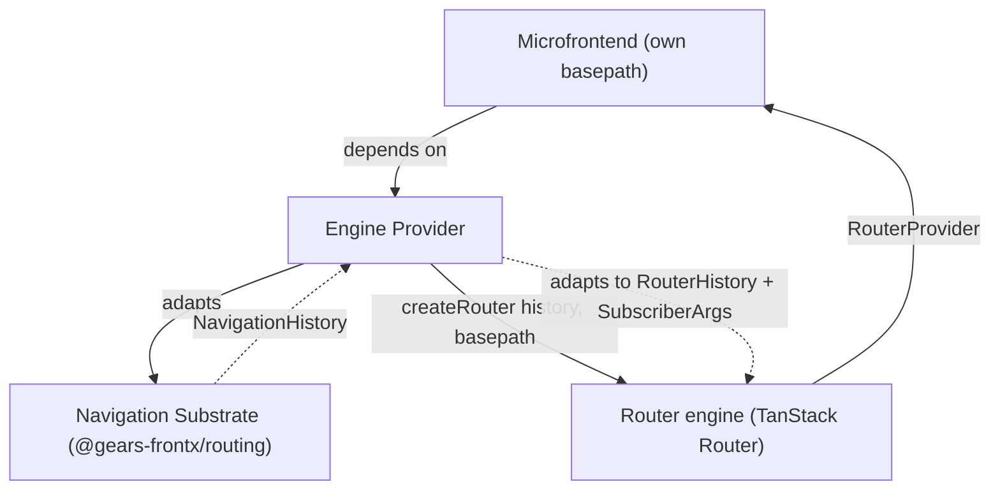
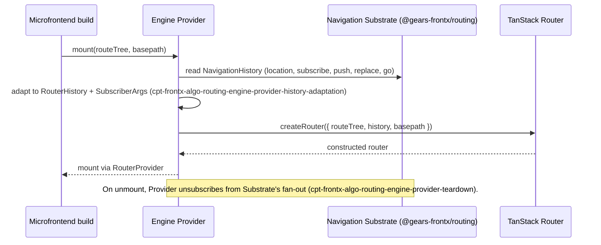

# Technical Design — Routing TanStack Provider

- [ ] `p3` - **ID**: `cpt-frontx-routing-tanstack-design-engine-provider`

<!-- toc -->

- [1. Architecture Overview](#1-architecture-overview)
  - [1.1 Architectural Vision](#11-architectural-vision)
  - [1.2 Architecture Drivers](#12-architecture-drivers)
  - [1.3 Architecture Layers](#13-architecture-layers)
- [2. Principles & Constraints](#2-principles--constraints)
  - [2.1 Design Principles](#21-design-principles)
  - [2.2 Constraints](#22-constraints)
- [3. Technical Architecture](#3-technical-architecture)
  - [3.1 Domain Model](#31-domain-model)
  - [3.2 Component Model](#32-component-model)
  - [3.3 API Contracts](#33-api-contracts)
  - [3.4 Internal Dependencies](#34-internal-dependencies)
  - [3.5 External Dependencies](#35-external-dependencies)
  - [3.6 Interactions & Sequences](#36-interactions--sequences)
  - [3.7 Database schemas & tables](#37-database-schemas--tables)
- [4. Additional context](#4-additional-context)
- [5. Traceability](#5-traceability)

<!-- /toc -->

## 1. Architecture Overview

### 1.1 Architectural Vision

`@gears-frontx/routing-tanstack` is the default implementation of the engine-provider port the navigation substrate declares (`cpt-frontx-routing-fr-engine-provider-port`, owned by [routing DESIGN](../../routing/architecture/DESIGN.md)). Where the substrate stays agnostic of any concrete router engine, this package is the deliberately concrete side of that boundary: it is the only place in the ecosystem a router engine's package is imported, and the only place the substrate's own `NavigationHistory` contract is translated into what a concrete engine expects.

The package holds exactly one component, the Engine Provider, moved here unchanged from the navigation substrate's own DESIGN under the package split recorded in `cpt-frontx-adr-core-package-boundaries`: the substrate needed to stay UI-framework- and engine-agnostic to remain a core member, and the only way to make that a package boundary rather than an intra-package convention was to give the provider its own published artifact. The Engine Provider adapts the substrate's `NavigationHistory` contract into TanStack Router's own `RouterHistory` contract — deriving the members that contract requires beyond the substrate's five, and translating the substrate's own subscriber notification into the `SubscriberArgs` shape (`location`, `action`) `RouterHistory`'s `subscribe` callback expects — before calling `createRouter({ routeTree, history, basepath })` and mounting the result into the microfrontend's own component tree via `RouterProvider`. Since the package split, a microfrontend reaches this adapter only by importing this package's own hooks and components directly, so replacing this package with a different engine-provider port implementation is scoped to that one microfrontend's own code — its route tree, its search-parameter handling, and every one of its own imports of this package, all rewritten to the replacement's own surface — and reaches no further: the navigation substrate, the host, and every sibling microfrontend are unaffected.

This package is also where a parametric segment is legal territory: the constructed engine matches a dynamic segment declared in the microfrontend's own route tree against the portion of the local remainder the navigation substrate's own resolution left opaque, exactly the opaque value core DESIGN §1.1 describes as one that "belongs entirely to whichever engine-provider package that occupant depends on." That legality has one limit an author of this microfrontend's own route tree needs to know: where a further domain nested inside this microfrontend's own zone declares a prefix statically, that nested domain's own resolution wins outright — the static declaration carves the segment out of this engine's opaque remainder before the engine ever sees it, so no dynamic route this engine declares can hold a segment a sibling domain already claims by static declaration (routing PRD §11).

### 1.2 Architecture Drivers

#### Functional Drivers

The package's requirements are owned by its own [PRD](./PRD.md).

| Requirement | Design Response |
|-------------|------------------|
| `cpt-frontx-routing-tanstack-fr-engine-adaptation` | The Engine Provider adapts the navigation substrate's `NavigationHistory` into TanStack Router's `RouterHistory` and `SubscriberArgs` shapes, then constructs the router via `createRouter({ routeTree, history, basepath })` (`cpt-frontx-component-routing-engine-provider`, `cpt-frontx-algo-routing-engine-provider-history-adaptation`, `cpt-frontx-algo-routing-engine-provider-router-creation`). |
| `cpt-frontx-routing-tanstack-fr-scoped-navigation-zone` | The constructed router is scoped to the assigned `basepath`; its routing table matches only what lies beneath it (`cpt-frontx-component-routing-engine-provider`). |
| `cpt-frontx-routing-tanstack-fr-standalone-deployment` | The same construction path runs whether `basepath` comes from an assignment by the enclosing level — the host, at the outermost domain, or another extension's own zone, at any level nested deeper — or from the deployment's own configuration; no route-ownership-signal observer is required for either (`cpt-frontx-algo-routing-engine-provider-standalone-deployment`). |
| `cpt-frontx-routing-tanstack-fr-location-preserving-helpers` | A redirect/navigation helper carries the current location's search and hash onto a target path, generalized from index-route redirects to any consumer redirect (`cpt-frontx-algo-routing-engine-provider-index-redirect`). |

#### NFR Allocation

| NFR ID | NFR Summary | Allocated To | Design Response | Verification Approach |
|--------|-------------|--------------|-----------------|------------------------|
| `cpt-frontx-routing-tanstack-nfr-single-ecosystem-edge` | Exactly one intra-ecosystem import: the navigation substrate | The published package | The manifest declares exactly one intra-ecosystem dependency — `@gears-frontx/routing` — and the import graph carries no other ecosystem edge (`cpt-frontx-constraint-routing-tanstack-sole-engine-import`). | The boundary guards (`arch:edges`, `arch:deps`) hold the manifest and the import graph to the declared single-edge property. |

This member records its decisions here rather than in a decision record of its own. `cpt-frontx-adr-core-package-boundaries` is the record whose "Scope relative to other published-libraries members" note names this package's own boundary constraints (ROUTING-TANSTACK-1, defined and owned by this DESIGN's §2.2) as sitting outside that ADR's core partition.

### 1.3 Architecture Layers

- [ ] `p3` - **ID**: `cpt-frontx-routing-tanstack-tech-stack`

| Layer | Responsibility | Technology |
|-------|---------------|------------|
| Engine provider | Adapts the navigation substrate's shared history to TanStack Router via `createRouter({ routeTree, history, basepath })`; the sole package in the ecosystem permitted an engine import | TypeScript over `@tanstack/react-router` (React, this provider's UI framework) and `@tanstack/history` |

## 2. Principles & Constraints

### 2.1 Design Principles

#### Engine Confined To This Package

- [ ] `p2` - **ID**: `cpt-frontx-routing-tanstack-principle-engine-confined`

No package in this ecosystem other than this one imports a concrete router engine. The navigation substrate reaches the shared history only through its own `NavigationHistory` contract — `location`, `subscribe`, `push`, `replace`, `go` — never through the engine-specific `RouterHistory` contract this package builds on top of it. This is what lets a microfrontend swap this package for a different engine-provider port implementation without the substrate, the host, or a sibling microfrontend noticing that a swap occurred.

### 2.2 Constraints

#### ROUTING-TANSTACK-1 — Sole engine import in the ecosystem

- [ ] `p2` - **ID**: `cpt-frontx-constraint-routing-tanstack-sole-engine-import`

No other package in this ecosystem imports a concrete router engine or its packages directly — concretely, no package other than this one imports `@tanstack/react-router` or `@tanstack/history`. This package is the sole, deliberate exception, so a mechanical import-graph guard can name exactly those two packages against exactly this one package.

**ADRs**: `cpt-frontx-adr-core-package-boundaries` — cited for the partition context this constraint sits outside of (that record's `More Information` states the core partition's scope excludes an engine-bound member like this one); it does not own this constraint, which this DESIGN defines and owns directly.

## 3. Technical Architecture

### 3.1 Domain Model

| Entity | Definition | Representation |
|--------|------------|-----------------|
| Basepath | The URL path segment prefix a mounted microfrontend's own router is scoped to; passed to `createRouter({ routeTree, history, basepath })`. Defined by the navigation substrate ([routing DESIGN §3.1](../../routing/architecture/DESIGN.md#31-domain-model)); consumed here as this package's own construction input. | String, provider input |

### 3.2 Component Model

#### Engine Provider

- [ ] `p2` - **ID**: `cpt-frontx-component-routing-engine-provider`

Concrete artifact: `@gears-frontx/routing-tanstack` (package entry).

##### Why this component exists

A router engine renders routes and matches search parameters, and engines evolve on their own cadence. The Engine Provider is the sole adapter that hands the navigation substrate's shared history to a concrete engine, so the choice of engine is a per-microfrontend decision rather than a substrate-wide one — and, since the split recorded in `cpt-frontx-adr-core-package-boundaries`, a package-level decision rather than an in-package one.

##### Responsibility scope

- Adapts the navigation substrate's `NavigationHistory` into the concrete engine's `RouterHistory` input — filling in the members the engine's contract requires beyond the substrate's five, full list and derivation owned by `cpt-frontx-algo-routing-engine-provider-history-adaptation` (that algorithm also records `block`'s deliberately degraded semantics, §4) — and translating `NavigationHistory`'s own subscriber notification into the `SubscriberArgs` shape (`location`, `action`) `RouterHistory`'s `subscribe` callback expects — then calls `createRouter({ routeTree, history, basepath })`.
- Owns the concrete engine dependency: `@tanstack/react-router` and `@tanstack/history`.
- Unsubscribes the constructed router from the shared history when the microfrontend that owns it unmounts, so a torn-down router's callback stops receiving the fan-out.

##### Responsibility boundaries

- Is the only package in this ecosystem permitted to import a concrete router engine (`cpt-frontx-constraint-routing-tanstack-sole-engine-import`).
- Its replacement is scoped to one microfrontend's own code — its route tree, its search-parameter handling, and every one of its own imports of this package, which the replacement requires rewriting throughout that microfrontend; it does not reach the navigation substrate, the `basepath` contract, the host, or a sibling microfrontend (`cpt-frontx-routing-fr-engine-provider-port`).
- Does not resolve which route owner a URL belongs to; that is the navigation substrate's route ownership signal (`cpt-frontx-feature-routing-route-ownership-signal`, owned by [routing DESIGN](../../routing/architecture/DESIGN.md)). This component only renders once a microfrontend using it is already mounted.

##### Related components (by ID)

- `cpt-frontx-component-routing-navigation-substrate` — the core package's own component ([routing DESIGN §3.2](../../routing/architecture/DESIGN.md#32-component-model)); supplies the `NavigationHistory` this component adapts into `RouterHistory`.

### 3.3 API Contracts

- [ ] `p2` - **ID**: `cpt-frontx-routing-tanstack-interface-package-entry`

- **Contracts**: `createRouter`, `RouterProvider`, `useNavigate`, `useParams`, `useSearch`, `useRouterState`, `Link`, `Outlet`, `redirect`, `notFound`, a location-preserving navigation helper; the engine-provider port this package implements, owned by the navigation substrate's own PRD and DESIGN.
- **Technology**: TypeScript library API, single entry point.
- **Location**: Not authored yet — no source exists for this package. The entry (e.g. `src/index.ts`) carries this package's default TanStack Router adapter's contract.

| Public surface | Purpose |
|----------------|---------|
| `createRouter({ routeTree, history, basepath })` | Builds the router instance bound to the navigation substrate's shared history and scoped to a `basepath`. |
| `RouterProvider` | Mounts the built router into the microfrontend's own component tree. |
| `useNavigate`, `useParams`, `useSearch`, `useRouterState` | Component-tree hooks against the mounted router's state and navigation. |
| `Link`, `Outlet` | Declarative navigation and nested-route rendering components. |
| `redirect`, `notFound` | Route-resolution helpers for redirect and not-found outcomes. |
| Location-preserving navigation helper | Carries the current location's search and hash onto a target path for any consumer redirect or imperative navigation (`cpt-frontx-routing-tanstack-fr-location-preserving-helpers`). |
| `RouterHistory` contract | The engine's own history contract (`@tanstack/history`). This package builds it from the navigation substrate's `NavigationHistory`, adding the members the engine's contract requires beyond the substrate's five (full list owned by `cpt-frontx-algo-routing-engine-provider-history-adaptation`), and translating the substrate's subscriber notification into the `SubscriberArgs` shape (`location`, `action`) this contract's `subscribe` callback expects. |

### 3.4 Internal Dependencies

Exactly one: `@gears-frontx/routing`, the navigation substrate whose `NavigationHistory` contract this package adapts and whose engine-provider port this package implements — the single-edge property this member claims under the layer's membership rules (root DESIGN §1.3), held to the cross-member dependency policy of root DESIGN §3.4.

**Dependency Rules** (per project conventions):
- No circular dependencies at the design level: the navigation substrate never depends on this package; the dependency runs one way only.
- No import of template territory.
- No import of any other ecosystem package beyond the navigation substrate (`cpt-frontx-routing-tanstack-nfr-single-ecosystem-edge`).

### 3.5 External Dependencies

#### Router engine

| Dependency Module | Interface Used | Purpose |
|-------------------|-----------------|---------|
| `@tanstack/react-router` | `createRouter`, `RouterProvider`, `useNavigate`, `useParams`, `useSearch`, `useRouterState`, `Link`, `Outlet`, `redirect`, `notFound` | The concrete router engine's React binding — the exact framework-specific package this provider adapts `NavigationHistory` for. This package's UI framework is React; a provider bound to a different UI framework is a different, non-default provider this package does not ship. |
| `@tanstack/history` | `RouterHistory` contract | The framework-independent history contract this package adapts the navigation substrate's shared `NavigationHistory` into. |

**Engine contract ownership**: the `RouterHistory` member list and the `SubscriberArgs` callback shape are the engine's own contract, not this package's. This package adapts `NavigationHistory` to whatever that contract requires at the time it is built, and a change to it is a change to this package alone — the navigation substrate, its `NavigationHistory` contract, and every consumer of it are unaffected, which is the isolation the engine-provider port exists to give.

**Dependency Rules** (per project conventions):
- `@tanstack/react-router` and `@tanstack/history` are dependencies of this package alone; no other ecosystem package imports either.
- This package is replaceable per microfrontend; a consumer supplying a different engine-provider port implementation is not required to depend on this package at all.

### 3.6 Interactions & Sequences

#### Engine Provider Adapts History And Constructs A Router

- [ ] `p3` - **ID**: `cpt-frontx-routing-tanstack-seq-adapt-and-construct`

**Use cases**: `cpt-frontx-routing-tanstack-usecase-swap-router-engine`

**Actors**: `cpt-frontx-routing-tanstack-actor-microfrontend-developer`

**Description**: The path every mount of this provider takes: it reads the navigation substrate's shared history, adapts it into the concrete engine's own history contract, constructs the engine's router, and mounts it. The core deep-link cold-mount sequence this participates in — a URL resolving to this microfrontend and the host mounting it — is owned by the navigation substrate's own DESIGN ([routing DESIGN §3.6](../../routing/architecture/DESIGN.md#36-interactions--sequences), `cpt-frontx-routing-seq-deep-link-cold-mount`), which names this package's mounted router as the participant that reads the already-current location at start; this sequence documents only what happens once that mount reaches this package's own construction path.

### 3.7 Database schemas & tables

Not applicable. The package holds no database and no durable persistence.

## 4. Additional context

The package's central design tension is the same one the navigation substrate's own DESIGN names as its central tension, now expressed as a package boundary rather than an in-package one: a router engine is a real, concrete dependency that a consumer needs ready to use, and the navigation substrate that dependency sits behind must not carry it. Splitting this package out of the navigation substrate — recorded in `cpt-frontx-adr-core-package-boundaries` — is what turns the engine-behind-port discipline the substrate's own DESIGN describes into a package-level guarantee: no import-graph guard confined to one package's internals is needed, because the concrete engine simply cannot appear anywhere the substrate's own source lives.

Recorded failure modes — all inherited unchanged from the navigation substrate's own DESIGN at the point of the split (`cpt-frontx-routing-design-routing` §4), since this package's behavior did not change, only its package boundary did:

- **A route guard built on this package's `block` expects it to stop every navigation.** It cannot: the substrate's fan-out notifies only after a navigation has already committed, so the adapted `block` can stop a navigation issued through the same constructed router's own `RouterHistory` object, but not a back/forward step, a `go` call from another unit, or a navigation another unit performs directly through the shared `NavigationHistory` — this is a recognized, degraded adaptation, not a routinely derived member (`cpt-frontx-algo-routing-engine-provider-history-adaptation`).
- **Unmounting a microfrontend without unsubscribing its router.** If this package does not unsubscribe the constructed router from the shared history at teardown, the unmounted router's callback keeps receiving the fan-out for a component tree that no longer exists. This package's own teardown responsibility (§3.2; `cpt-frontx-algo-routing-engine-provider-teardown`) is what prevents this.
- **A redirect from an index route, or any other consumer redirect.** The location-preserving navigation helper (`cpt-frontx-routing-tanstack-fr-location-preserving-helpers`) carries the current location's search and hash onto the target path, so they survive rather than being dropped.
- **Standalone deployment of a single microfrontend.** The router construction this package runs is identical whether a route-ownership-signal observer exists or not; when none exists, an undeclared path resolves to this package's own `notFound` route rather than to whichever level's own consumer would otherwise show a fallback in composed mode — the host's, at the outermost domain, or an enclosing extension's, at any level nested deeper. Two obligations fall on the deployment rather than on this package: its server must answer every path beneath the `basepath` with the entry document, and the build's asset base URL is configured independently of the router's `basepath`.

## 5. Traceability

- **Features**: [features/engine-provider/FEATURE.md](./features/engine-provider/FEATURE.md) (`cpt-frontx-feature-routing-engine-provider`)
- **Root chain**: [PRD](../../../architecture/PRD.md), [DESIGN](../../../architecture/DESIGN.md), [DECOMPOSITION](../../../architecture/DECOMPOSITION.md)
- **Core chain**: [routing PRD](../../routing/architecture/PRD.md), [routing DESIGN](../../routing/architecture/DESIGN.md) — the navigation substrate whose engine-provider port this package implements.

This package's requirements are owned by its own [PRD](./PRD.md), per the 3-layer model: each member explains its own requirements, and the root PRD describes the layers and the requirements binding every member equally. The feature this package owns moved here from the navigation substrate's own tree under the package split recorded in `cpt-frontx-adr-core-package-boundaries`; its own identifiers — the feature and component IDs, its feature-status marker, and every `flow`/`algo`/`dod` identifier it defines — kept their names unchanged across the move, so existing citations and code markers resolve as before.
