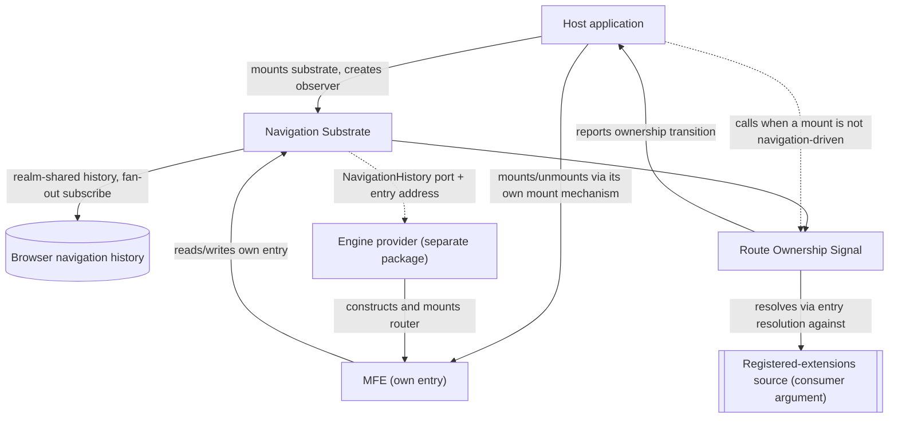

# Technical Design — Routing

- [ ] `p3` - **ID**: `cpt-frontx-routing-design-routing`

<!-- toc -->

- [1. Architecture Overview](#1-architecture-overview)
  - [1.1 Architectural Vision](#11-architectural-vision)
  - [1.2 Architecture Drivers](#12-architecture-drivers)
  - [1.3 Architecture Layers](#13-architecture-layers)
- [2. Principles & Constraints](#2-principles--constraints)
  - [2.1 Design Principles](#21-design-principles)
  - [2.2 Constraints](#22-constraints)
  - [2.3 Obligations On The Consuming Level](#23-obligations-on-the-consuming-level)
- [3. Technical Architecture](#3-technical-architecture)
  - [3.1 Domain Model](#31-domain-model)
  - [3.2 Component Model](#32-component-model)
  - [3.3 API Contracts](#33-api-contracts)
  - [3.4 Internal Dependencies](#34-internal-dependencies)
  - [3.5 External Dependencies](#35-external-dependencies)
  - [3.6 Interactions & Sequences](#36-interactions--sequences)
  - [3.7 Database schemas & tables](#37-database-schemas--tables)
- [4. Additional context](#4-additional-context)
  - [Worked Example: The Reference Link](#worked-example-the-reference-link)
  - [Worked Example: A Console Layout And Its URL](#worked-example-a-console-layout-and-its-url)
  - [Worked Example: Structural Reset](#worked-example-structural-reset)
- [5. Traceability](#5-traceability)

<!-- /toc -->

## 1. Architecture Overview

### 1.1 Architectural Vision

`@gears-frontx/routing` keeps an agnostic navigation core behind an opaque substrate port, with the concrete router engine supplied by a separately published provider package. The navigation substrate never depends on a concrete engine, and a separately published engine-provider package satisfies the substrate's own history contract; the ecosystem provides a default implementation of it.

Throughout this package's own artifacts, *navigation substrate* names the agnostic core component alone, described next; the published package `@gears-frontx/routing` is that core plus the Route Ownership Signal described after it. An engine provider is never part of this package — it is a distinct published member that depends on this one, never the reverse. (The root DESIGN and ADR 0002 use the term *navigation substrate* at package granularity, naming the whole published library — a broader use than this document's own; see root DESIGN §1.3.)

#### A tree of domains, resolved level by level

A composed application is a tree of extension domains, not a single flat placement. An extension mounted into a domain owns a zone, and that zone may itself contain further domains, so the tree nests to whatever depth the composed application actually has. A level is one domain identified by its own domain key. Route ownership resolution runs at every level independently, never once against the whole URL: a level's own resolution reads only the entries carrying its own domain key — the concrete value the enclosing level hands it the moment it begins to exist — and matches each such entry's own extension token against that domain's own registered routable extensions (`cpt-frontx-algo-routing-route-ownership-signal-entry-resolution`), naming the entry's route owner when a registered extension matches and naming none when none does. A domain's own registered extensions are never a global registry this package holds: they are a plain argument the domain's own consuming level supplies at observer creation, scoped to that one domain. This package holds no registry of levels either, and publishes no aggregated "the whole URL resolved" signal — resolving a deep URL is a wave through the tree, not one event, and a nested domain's own observer exists only once its enclosing extension has actually mounted (§3.6). An entry's own payload — every parameter beyond the fact of occupancy — is never part of what any level's own resolution matches: it is the private data of the one occupant that entry addresses, opaque to resolution and belonging entirely to that occupant and to whichever engine-provider package it depends on.

#### URL Grammar

`cpt-frontx-routing-adr-domain-occupancy-addressing-granularity` (ADR 0003) is the single normative statement of the grammar every domain in the tree is addressed by, at any depth, in any tree position, and at any occupant count; this subsection summarizes its shape and points to each of its rules by name, restating none of them in full. Why one uniform grammar rather than three separate mechanisms is ADR 0003's own Context: returning the pathname to the shell as its own private territory, while keeping every mounted extension's own parameters readable in place, in the query string, rather than nested inside a second layer of encoding.

A composed application's URL has the shape:

```
<shell-subroute> [ ? <entry> [ & <entry> ]* ] [ # <hash> ]
```

— for example, written on one line exactly as it appears in the address bar, the model reference link ADR 0003's own Confirmation checks this grammar against (example 7.1): `/en?screen=dashboard;orientation=left&sheet=tenant-details;tenantId=456&sheet=user-contacts;contactId=123;view=active&widgets=line-a;range=7d&widgets=line-b;range=30d&widgets=pie;metric=revenue`.

ADR 0003 states each of the following rules in full, under its own Decision Outcome — this summary names them, never restates them:

- **Tokens** — the `name`, `domain-key`, and `extension` productions, and how a root domain's own name, an extension token, and a nested domain's own composite key are each sourced and composed.
- **Entry** — the `domain-key "=" extension *( ";" param )` construct, and how a duplicate parameter name or a duplicate extension under one domain key is resolved.
- **Percent-encoding** — which characters this package escapes on write, and how decoding is applied on read.
- **Repetition and order** — how a domain with N occupants contributes N entries sharing that domain key, and how entry order is preserved on read and on write.
- **Control boundary** — which party writes which part of the raw URL, and that no party reads or edits another's own part of it (`cpt-frontx-routing-principle-control-boundary`).
- **Structural reset** — which entries a removed or changed parent entry also removes, and in which history write; triggering it is the consuming level's own obligation (§2.3, O7).
- **Zero entries — ADR 0003's own example 7.8:** every projected domain empty, the shell subroute stands alone, with no trailing `?`:

  ```
  /en
  ```

#### Route Ownership Signal

Route Ownership Signal publishes, rather than enforces, the relationship between the entries a domain reads and which route owner each one names. It exposes the navigation substrate's own entry-resolution primitive as its own public entry point, and lets a consumer create one observer per domain — passing that domain's own registered-extensions source as a plain argument, never an injected port, together with the domain key that level was handed — that reports every ownership-relevant transition at that domain as one *transition*: the ordered entry list currently read under that domain key, together with a diff against the previous resolution (added, removed, payload-changed, reordered, changed only in resolution status). It also provides one URL back-projection helper the consumer calls after a mount triggered by something other than navigation: a `push` or `replace` of that domain's own entries alone, composed from a five-operation delta — added, removed, payload-changed, replaced (an old extension token swapped for a new entry at that same position), and reordered (this domain's own entries taking a new order within the positions they already occupy) — removing the subtree keys of any entry the delta removes or replaces (structural reset, `cpt-frontx-routing-adr-domain-occupancy-addressing-granularity`) and copying every entry the delta does not name verbatim. The push/replace choice for that call is always the caller's (§4, "A back-projection reflection and its chosen history verb"). Resolving a deep URL is therefore a wave through the domain tree, not one event: each domain's own observer resolves and reports independently the moment that domain comes to exist, and this package holds no registry of domains and publishes no aggregated "the whole URL resolved" signal — it cannot, by construction, since it never sees the tree of domains a consumer's own mount mechanism assembles from its reports. Mounting and unmounting themselves, and the two-way agreement between the URL and what is actually mounted at every domain, are the consumer's own guarantee, built on top of this signal (`cpt-frontx-routing-principle-publishes-not-orchestrates`) — this package never orchestrates them, so it stays agnostic of whatever occupancy model the consumer's own mount mechanism uses.

#### Navigation Substrate

The Navigation Substrate is the framework-agnostic core: a single navigation history realm-shared between the host and every independently bundled microfrontend, one real subscription to the browser's history fanned out to every listener, and the URL grammar codec (parse and serialize, `cpt-frontx-algo-routing-navigation-substrate-grammar-parse`, `cpt-frontx-algo-routing-navigation-substrate-grammar-serialize`) together with the name-equality predicate and the domain-key-composition function every domain's own resolution and key-assignment build on. Entry resolution itself is not this component's own algorithm: it is Route Ownership Signal's own primitive (`cpt-frontx-algo-routing-route-ownership-signal-entry-resolution`), built on this codec and predicate rather than re-implementing either. That fan-out has two dispatch triggers rather than one: the browser's own `popstate` event, and the substrate's own `push`/`replace` call itself, which dispatches directly because neither call raises `popstate` on its own (`cpt-frontx-algo-routing-navigation-substrate-fanout-dispatch`). A `go` call is deliberately not a direct trigger — the browser raises `popstate` for it, so dispatching directly as well would deliver one navigation to every subscriber twice. Each dispatch round iterates a snapshot of the subscriber set taken when the round starts, re-checking each slot's own liveness immediately before invoking it, so a callback that unsubscribes mid-round is skipped rather than corrupting the iteration, and a callback that triggers a new navigation has that navigation dispatched as its own, later round rather than folded into the round already in progress (§4). A routing table is an opaque value to this core, exactly as an occupant's own parameter payload is opaque to every domain's own resolution — the substrate carries it but never inspects it. The substrate's own contract, `NavigationHistory` (`location`, `subscribe`, `push`, `replace`, `go`), is deliberately narrower than what any concrete engine's own history contract typically requires — the engine-provider port (`cpt-frontx-routing-fr-engine-provider-port`) states only what a provider **MUST** accept from the substrate and that it is responsible for producing a constructed, mounted router; it names no concrete engine, and this package derives nothing about how a provider bridges that gap.

The engine-provider port's input is: the shared history; the entry address this occupant was mounted at — its own domain key and extension — or the absence of one when the occupant runs standalone; and an opaque route tree. A provider may read and write only its own entry's own payload, never a sibling's or another domain's. The ecosystem's own default provider reserves the payload parameter `route` for the occupant's own internal route — a convention that provider adopts, not a rule this package imposes — with every other parameter left to that provider's own router as its search. A microfrontend served standalone, with no entry address at all, projects that same virtual location onto the page's own pathname and search instead, so the identical router code runs unmodified in either mode. How a provider actually builds either bridge is that provider's own DESIGN's concern, never this one's.

#### Channel boundary

The library owns exactly one of the ecosystem's three host–microfrontend communication channels. Addressed action dispatch — a command to a specific target, executed through an actions-chains mediator — and shared-property broadcast — declared-interest state distributed to whoever is listening — are both owned by the runtime that provides them; this library neither duplicates nor mediates either one. It owns the URL channel alone: what the address bar reads, and what a navigation does to it.

#### Visibility and zone boundaries

Visibility follows the same boundary, at every level of the domain tree. An occupant owns exactly one entry in the address this library governs — its own, and nothing else — not a sibling occupant's entry under the same domain key, and not any entry under a domain key it was never handed. The shell subroute is the shell's own private territory, never read or written by this package for occupancy. Leaving a zone happens through an imperative call against the shared navigation substrate with an absolute location, through an ordinary link whose `href` is itself an absolute location outside the zone, or through an addressed action to the host over the actions-chains channel — never through a route inside the microfrontend's own tree reaching an entry it does not own. A domain's own registered extensions are the namespace of whichever route owner occupies it: an extension carries its own route in its own registered declaration, not in this library's own contract, and that route is exactly what becomes the extension token of the entry its domain addresses it by; the enclosing level assigns the domain key that entry is composed under the moment it mounts that occupant — the outermost level's own domain keys come from the host, or from the deployment when that level is served on its own. A same-domain conflict — two route owners registering the identical extension token at the same domain — is caught when that domain's own registrations are made, not at navigation time (PRD §11). The check operates on *registrations*, comparing the normalized routes two distinct registrations carry, so it keeps two distinctly registered occupants of one domain from composing the identical entry and nothing more; it covers two mounts of the identical microfrontend entry exactly as it covers any other pair, since each mount is its own independently registered extension.

### 1.2 Architecture Drivers

#### Functional Drivers

The package's requirements are owned by its own [PRD](./PRD.md).

| Requirement | Design Response |
|-------------|------------------|
| `cpt-frontx-routing-fr-single-navigation-substrate` | The Navigation Substrate holds the shared history behind a well-known realm-global, fanning out one browser-history subscription to every subscriber (`cpt-frontx-component-routing-navigation-substrate`). |
| `cpt-frontx-routing-fr-engine-provider-port` | The Navigation Substrate exposes `NavigationHistory` as the sole contract a router engine reaches the shared history through, together with the entry address (domain key and extension, or its absence in standalone) and an opaque route tree; no component of this package hands that history to a concrete engine, and no concrete engine dependency exists anywhere in this package's own module graph (`cpt-frontx-component-routing-navigation-substrate`, `cpt-frontx-routing-nfr-agnostic-core`). A separately published provider package — the ecosystem's own default — implements the port. |
| `cpt-frontx-routing-fr-route-ownership-signal` | The Route Ownership Signal component exposes the entry-resolution primitive and an observable transition per domain — an ordered entry list plus a diff — plus a URL back-projection helper the consumer calls after a non-navigation-driven mount; the consumer's own mount mechanism does the actual mounting at every domain, and the two-way agreement between the URL and what is mounted is the consumer's own guarantee, built on this signal (`cpt-frontx-component-routing-screen-binding`, `cpt-frontx-routing-seq-deep-link-cold-mount`). |
| `cpt-frontx-routing-fr-imperative-navigation` | The Navigation Substrate exposes `push`/`replace`/`go`/`location`/`subscribe` directly, independent of any mounted router or component tree (`cpt-frontx-component-routing-navigation-substrate`). |
| `cpt-frontx-routing-fr-concurrent-occupant-projection` | Every domain projects each of its occupants into that occupant's own entry, sharing the domain's own domain key: a domain holding several occupants side by side contributes several entries through the identical grammar a domain holding one occupant uses, with no mode switch between the two (§4, Worked Example: The Reference Link). |
| `cpt-frontx-routing-fr-per-occupant-addressable-parameters` | Each occupant's own parameters live inside that occupant's own entry as matrix-style `;key=value` pairs — one encoding for every occupant of every domain — keeping two instances of the identical microfrontend entry independently addressable and independently back-projectable, never a namespace shared with a sibling occupant (§4, Worked Example: The Reference Link). |

#### NFR Allocation

| NFR ID | NFR Summary | Allocated To | Design Response | Verification Approach |
|--------|-------------|--------------|-----------------|------------------------|
| `cpt-frontx-routing-nfr-standalone` | No intra-ecosystem import; no call into the consumer at all | The published package | The manifest declares no intra-ecosystem dependency; route ownership reaches the package only through a consumer-supplied registered-extensions source passed as a plain argument, and mount execution never reaches the package at all — the package only publishes a signal the consumer's own mount mechanism acts on (`cpt-frontx-constraint-routing-no-intra-ecosystem-dependency`). | The boundary guards (`arch:edges`, `arch:deps`) hold the manifest and the import graph to the declared standalone property. |
| `cpt-frontx-routing-nfr-agnostic-core` | Package carries no router-engine or UI-framework dependency whatsoever | The whole published package | No module of this package imports any router engine or any UI-framework rendering primitive; every engine-specific dependency lives in a separately published engine-provider package instead (`cpt-frontx-constraint-routing-no-engine-leak`). | The boundary guards confirm this package's own import graph carries no engine or UI-framework edge at all. |

This member cites two root records that carry the scope it sits inside: `cpt-frontx-adr-core-package-boundaries` states that the core partition covers the UI-framework-agnostic subset and that a member bound to a concrete engine carries its own bounded concern, held by the separately published engine-provider package rather than by this one; `cpt-frontx-adr-extension-domain-occupancy` states that an occupied domain's own projection into the URL, where that domain projects at all, is the address bar's own reflection of the same mount mechanism that record governs, and that a navigation act reaches that mount mechanism rather than a second one running alongside it — its own prior deferral of concurrent-domain projection is amended alongside this record, crediting this member's own uniform entry grammar as the projection mechanism for every occupant count.

Four decisions narrow and consequential enough to record as this member's own ADRs govern the rest: `cpt-frontx-routing-adr-occupant-reference-boundary` fixes how the routing core names and carries occupant identity through resolution and reporting without depending on the concrete `mfes` `Extension` type — that identity's own lexical well-formedness rule is stated by `cpt-frontx-routing-adr-domain-occupancy-addressing-granularity`, the record that owns the grammar's `name` alphabet; `cpt-frontx-routing-adr-mount-trigger-ownership` fixes that actions-chains drives every post-boot mount while navigation drives only cold load and restoration, keeping the URL a reflection of mount state rather than a second driver of it.

`cpt-frontx-routing-adr-domain-occupancy-addressing-granularity` is the record behind the URL Grammar of §1.1, choosing the one uniform entry grammar over the alternative of three separate mechanisms — hierarchy as pathname continuation reserved to one privileged domain per zone, occupancy fan-out as a dedicated single-entry query-string key per domain, and a separate mode admitted only for a domain holding several occupants at once — with the pathname retired from this package's own occupancy resolution model entirely; `cpt-frontx-routing-adr-occupant-identity-stability` fixes that the extension token an entry carries is the extension's own normalized route-identity value — which concrete field on a registration supplies it is the `mfes` package's own contract, not a schema this package defines — chosen for stability across a redeploy over the type system's own versioned id. Which extension types are routable at all is, in turn, the runtime's own registration contract's decision, recorded only as an assumption in this package's own PRD, not as an ADR this package holds.

### 1.3 Architecture Layers

- [ ] `p3` - **ID**: `cpt-frontx-routing-tech-routing-stack`

The diagram below shows the pattern at one representative domain; the same shape recurs at every domain a composed application actually has (§1.1).



| Layer | Responsibility | Technology |
|-------|---------------|------------|
| Navigation substrate | Realm-shared navigation history, fan-out subscription, URL grammar codec, imperative navigation surface | TypeScript, framework-agnostic, no router-engine or UI-framework dependency |
| Route ownership signal | Exposes entry resolution as a public entry point, publishes an observable transition (ordered entry list plus diff) per domain, and provides a URL back-projection helper the consumer calls after a non-navigation-driven mount | TypeScript over a consumer-supplied registered-extensions source (plain argument, no port) |

The engine provider shown above is never part of this package; it is a distinct published member (the ecosystem provides a default) that depends on the navigation substrate's `NavigationHistory` contract and is substitutable by any conforming provider — the technology and component detail for that provider belongs entirely to its own DESIGN, not to this one.

## 2. Principles & Constraints

### 2.1 Design Principles

#### Single History Authority

- [ ] `p2` - **ID**: `cpt-frontx-routing-principle-single-history-authority`

Exactly one navigation-history instance answers for a realm; no unit — host or microfrontend — constructs its own. Every unit that needs to read or write navigation state reaches the one realm-shared instance instead, and every subscriber's fan-out traces back to the same single subscription against the browser's own history. This is what keeps independently bundled units from ever holding two divergent views of where the user currently is.

#### Publishes, Does Not Orchestrate

- [ ] `p2` - **ID**: `cpt-frontx-routing-principle-publishes-not-orchestrates`

This package publishes the fact that an entry a domain reads resolves to a declared route owner, and publishes when that fact changes; it does not reproduce, alongside that fact, any model of who is allowed to occupy a placement, how many occupants a placement may hold at once, or how a race between two competing mounts resolves — at any domain in the tree. Reconciling the URL with what is actually mounted belongs to whichever mount mechanism already holds the registry of route owners, the domains they occupy, and the authority to resolve a race between two mounts — for this ecosystem's own host, the `mfes` runtime (`cpt-frontx-adr-extension-domain-occupancy`). This is a narrower, package-specific consequence of the runtime's own UI-framework-agnosticism principle (`cpt-frontx-principle-agnostic-core`): that principle governs independence from a concrete UI framework and carries no view on domain occupancy one way or the other; this principle is what actually keeps this package from re-implementing a competing occupancy model of its own.

#### Control Boundary

- [ ] `p2` - **ID**: `cpt-frontx-routing-principle-control-boundary`

The package owns the URL's own syntax — the delimiters, the domain-key composition rule, and every structural part of an entry — plus the domain names and extension names that identify what occupies it; the shell and every extension own only their own payload: the shell its own subroute and, if it wishes, its own entries under domains it owns; an extension its own entry's own parameter names and values, through this package's API, never by touching the raw URL directly. No runtime — shell, extension, or engine provider — parses or edits another party's own part of the raw URL (§1.1, URL Grammar, Control boundary).

**ADRs**: `cpt-frontx-routing-adr-domain-occupancy-addressing-granularity`

### 2.2 Constraints

#### ROUTING-1 — No engine import in the navigation substrate

- [ ] `p2` - **ID**: `cpt-frontx-constraint-routing-no-engine-leak`

`@gears-frontx/routing` contains no import of a concrete router engine or its packages, anywhere in the package — not merely outside a designated internal component, but absent from the package's own manifest and import graph entirely. Consumers of the navigation substrate and of the route ownership signal interact only with the substrate's own `NavigationHistory` contract (`location`, `subscribe`, `push`, `replace`, `go`); a concrete router engine is never a dependency of this package under any circumstance. The role of "the one place a router engine may be imported" belongs to whichever separately published engine-provider package a microfrontend depends on — enforced there by that provider's own sole-engine-import constraint — never to this package.

**ADRs**: `cpt-frontx-adr-core-package-boundaries` — cited for the partition context this constraint sits outside of (that record's `More Information` states the core partition's scope excludes an engine-bound member like this one); it does not own this constraint, which this DESIGN defines and owns directly.

#### ROUTING-2 — No intra-ecosystem package dependency

- [ ] `p2` - **ID**: `cpt-frontx-constraint-routing-no-intra-ecosystem-dependency`

`@gears-frontx/routing` imports no other package in this ecosystem. Its coupling to whichever unit currently owns a domain's own entries is expressed only through a consumer-supplied registered-extensions source, passed as a plain argument; the execution of a mount is entirely the consumer's own responsibility, reached only through the observable signal this package publishes — never through an injected port, and never through a compile-time import of the runtime or any other ecosystem package that implements those concerns.

**ADRs**: `cpt-frontx-adr-core-package-boundaries` — cited for the partition context this constraint sits outside of; that record does not own this constraint, which this DESIGN defines and owns directly.

### 2.3 Obligations On The Consuming Level

This package publishes facts and never orchestrates (`cpt-frontx-routing-principle-publishes-not-orchestrates`), and it holds no registry — of domains, or of occupants — to check anything at rest against. Several invariants the address this package composes actually depends on are therefore obligations on whichever consuming level holds a domain, not guarantees this package makes. They are collected here as one normative list, because each would otherwise be discoverable only from whichever mechanism implies it. Each states the obligation and cites where the underlying mechanism or rule lives; none restates that mechanism.

- **O1 — Sibling domain-name uniqueness within one zone.** A consuming level **MUST** keep the locally-chosen names of the domains it projects within its own zone distinct from one another. This is that zone's own consuming level's responsibility alone — no other level can see those names, and this package never collects them — and it is one of the three purely local facts the grammar's own tree-wide uniqueness argument rests on (`cpt-frontx-routing-adr-domain-occupancy-addressing-granularity`, URL Grammar).
- **O2 — Domain-key composition through the package's own function.** A consuming level **MUST** compose the domain key it hands each nested domain by calling this package's own domain-key-composition function with the enclosing entry's own domain key, the enclosing entry's own extension, and the nested domain's own locally-chosen name, and **MUST NOT** hand down a shortened form restating only the enclosing entry's own bare extension (`cpt-frontx-routing-adr-domain-occupancy-addressing-granularity`, URL Grammar; §1.1, URL Grammar).
- **O3a — Extension-token lexical validity.** `cpt-frontx-routing-adr-domain-occupancy-addressing-granularity` requires this package itself to "run a validator for this lexical rule automatically, synchronously, inside every place this package's own code actually receives a consumer-supplied identity token as an argument: observer creation, ... the registered-extensions source's own change notification, ... the URL back-projection helper, ... and the domain-key-composition function's own extension-token input," and that "a malformed token at any of these input paths **MUST** be rejected synchronously with a clear error at that point." This is therefore a validated precondition this package's own code enforces synchronously at each of those input paths, not a trust-based obligation this package merely documents. That same record is explicit that this validation "runs on these input paths and nowhere else — **NEVER** on a value parsed out of the URL during resolution": a malformed extension token encountered while resolving an existing URL is instead dropped from the parsed result at parse time and reported to the host as a warning, exactly like any other malformed entry (§1.1, URL Grammar, "Repetition and order") — the domain it would have occupied simply has no entry at that position, never a thrown error. This is distinct from a lexically valid but stale extension token, which matches no live registration and resolves to "unresolved" instead — the fully specified outcome any entry whose own extension token matches no registered extension already gets (§1.1, URL Grammar).
- **O3b — Within-domain live/cross-mount uniqueness.** A consuming level **MUST** keep extension tokens distinct within one domain across every mount that is currently live — including two mounts of the identical microfrontend entry, each of which is its own distinct registration with its own independently declared route, so the registration-time same-declared-route conflict check separates them exactly as it separates any other pair (§1.1, Visibility and zone boundaries; PRD §11). This stays a consumer/registration-time obligation, in the same class as O1 and O2: this package holds no registry of domains or occupants to check it against at rest. This obligation also supplies the second of the three local facts the grammar's own uniqueness argument rests on — extension-token uniqueness within one domain.

  O1, O2, and O3b all require checking a candidate against a set of *other* live registrations or observers this package deliberately holds no registry of, so they stay documented obligations on the consuming level; O3a is pure input-argument validation with no registry dependency at all, so this package's own code can, and does, enforce it directly.
- **O4 — Observer release-and-recreate when a nested domain's own composite key changes.** A consuming level **MUST** release the observer holding a stale domain key and create its successor carrying the new value whenever the composite domain key it composed for a nested domain changes; a domain key is immutable for its observer's own lifetime and is never updated in place. The mechanism, the observable window this opens, and why that window's bound is the consuming level's rather than this package's are described in full by this DESIGN's own recorded failure mode "A domain key goes stale before its enclosing level re-creates it" (§4).
- **O5 — Back-projection after every non-navigation-driven mount.** A consuming level **MUST** call the URL back-projection helper after every mount or unmount it *originates* through a channel other than navigation. `cpt-frontx-routing-adr-mount-trigger-ownership` makes actions-chains the sole originating channel post-boot and navigation the restoring channel only, and that record's own consequence is that the helper is load-bearing for every such origination rather than an occasional convenience: an occupancy the address bar never reflected is an occupancy no later restoring navigation can replay.
- **O6 — Mounted-set reconciliation on a restoring navigation, routed through the originating channel.** A consuming level **MUST** reconcile its own mounted set against what a restoring navigation reports — a back/forward step, or any other navigation reaching a state a history entry already represents — and, where such a report describes a projected state no live consumer recognizes, **MUST** reach a mount only by re-resolving that state and re-dispatching it through the originating actions-chains channel, never by mounting directly off the observed signal (`cpt-frontx-routing-adr-mount-trigger-ownership`, Decision Outcome's residual case and Confirmation).
- **O7 — Structural reset on removing or changing a parent entry.** A consuming level that removes or changes an entry it owns, for any reason, **MUST** call the URL back-projection helper for that same change rather than leave the URL to a later, unrelated call: the helper's single history write already removes every subtree entry a removed or changed parent implies (§1.1, URL Grammar, Structural reset), but only when the level that owns the parent is the one that triggers it. A level that mutates its own mounted set without ever calling back-projection leaves a subtree's own entries stranded in the URL as inert keys, indistinguishable there from a domain whose own wave has not yet reached them (§4, "An entry with no live observer is inert").

## 3. Technical Architecture

### 3.1 Domain Model

The vocabulary this design builds on — Zone, Level, Shell subroute, Domain key, Entry, Payload, Extension token, Route Owner, and Occupant — is defined once, in [PRD §1.4, Glossary](../PRD.md#14-glossary); it is not restated here. The table below adds only the entities that are this design's own, not already product vocabulary.

| Entity | Definition | Representation |
|--------|------------|-----------------|
| Navigation History | The realm-shared, single navigation-history instance every unit reads and writes; exposes the substrate's own `NavigationHistory` contract — `location`, `subscribe`, `push`, `replace`, `go`. A separately published engine-provider package adapts this into whatever contract its own concrete engine expects; that adapted contract is not this package's concern. | Realm-global-backed singleton — `@gears-frontx/routing` |
| Ownership Resolution | The outcome of matching, for one domain key, every entry currently carrying that key against that domain's own registered extensions — naming the route owner an entry belongs to when its own extension token matches a registration, and naming none when it matches none (`cpt-frontx-algo-routing-route-ownership-signal-entry-resolution`); Route Ownership Signal's own primitive, built on the navigation substrate's grammar codec and name-equality predicate rather than re-implementing either. | Resolver output — `@gears-frontx/routing` |

### 3.2 Component Model

#### Navigation Substrate

- [ ] `p2` - **ID**: `cpt-frontx-component-routing-navigation-substrate`

Concrete artifact: `@gears-frontx/routing` (core entry).

##### Why this component exists

Independently bundled units in the same realm need one navigation history to agree on, not one each, and one grammar to read and write the query string through, not one each. The Navigation Substrate is the framework-agnostic core that holds that single history instance, fans out one browser-history subscription to every listener, owns the URL grammar codec, and exposes imperative navigation outside any UI tree.

##### Responsibility scope

- Owns the single, realm-shared navigation-history instance and its fan-out subscription.
- Owns the URL grammar codec — parse and serialize — and the name-equality predicate and domain-key-composition function published alongside it.
- Exposes `push`, `replace`, `go`, `location`, `subscribe` for use outside a mounted router.

##### Responsibility boundaries

- Carries no dependency on any router engine or UI framework whatsoever (`cpt-frontx-constraint-routing-no-engine-leak`, `cpt-frontx-routing-nfr-agnostic-core`).
- Treats a routing table as an opaque value it never inspects; route-tree shape belongs entirely to whichever engine-provider package and microfrontend build it.
- Reads no shell subroute segment as occupancy, and writes no shell subroute segment to reflect occupancy; the shell subroute is the shell's own private territory in this model (`cpt-frontx-routing-adr-domain-occupancy-addressing-granularity`).
- Does not perform mounting, unmounting, or resolve which route owner is currently mounted, and does not itself own entry resolution (`cpt-frontx-algo-routing-route-ownership-signal-entry-resolution`) — that primitive belongs to Route Ownership Signal, built on this component's own grammar codec and name-equality predicate; this component owns only the codec, the name-equality predicate, and the domain-key-composition function those resolutions and key assignments are built on.

##### Related components (by ID)

- `cpt-frontx-component-routing-screen-binding` (Route Ownership Signal) — subscribes to the substrate's fan-out to compute and publish ownership-change transitions.
- The port this component declares (`cpt-frontx-routing-fr-engine-provider-port`) — implemented by the engine-provider component of whichever separately published provider package satisfies it (named in §3.4); that component is an external consumer of this component's `NavigationHistory` contract, owned entirely by that provider package, not by this one.

#### Route Ownership Signal

- [ ] `p2` - **ID**: `cpt-frontx-component-routing-screen-binding`

Concrete artifact: `@gears-frontx/routing` (core entry).

##### Why this component exists

A consumer's own mount mechanism needs to know, from the URL alone, which declared route owner each entry under its own domain key belongs to and when that resolution changes — without this package holding any opinion about how mounting, unmounting, or occupancy cardinality actually work, and without a whole-URL registry this package would have to hold to answer that question for a nested domain. Route Ownership Signal is the component that exposes that resolution per domain, and publishes its changes as an observable transition, leaving mounting entirely to the consumer.

##### Responsibility scope

- Exposes the navigation substrate's own entry-resolution primitive as this package's own public entry point, without re-implementing the matching itself.
- Lets a consumer create one observer per domain, passing that domain's own registered-extensions source as a plain argument — never an injected port — together with the domain key that domain was handed; the observer resolves the entries currently carrying that domain key, and reports a transition (the ordered entry list plus a diff — added, removed, payload-changed, reordered, changed only in resolution status) on creation and on every subsequent ownership-relevant navigation at that domain.
- Provides a URL back-projection helper the consumer calls to reflect a mount that happened for a reason other than navigation back into the URL: a rewrite of that domain's own entries (verb chosen by the caller), removing the subtree entries of anything the delta removes or replaces and copying everything else verbatim, with the push/replace choice for the call left to the caller.

##### Responsibility boundaries

- Does not maintain a registry of route owners; the consumer supplies the current set of registered extensions itself, per domain, as a plain argument, not through an injected port.
- Does not execute a mount or an unmount itself, and does not resolve a race between two mounts competing for the same placement; both are the consumer's own mount mechanism's responsibility (§2.3, Obligations On The Consuming Level).
- Does not participate in the addressed-action or shared-property channels; it reads only the URL channel, and within it only the query string.
- Carries no notion of exclusive versus concurrent occupancy, and no state machine tracking which owner currently occupies a placement, at any domain; that occupancy model belongs entirely to whichever mount mechanism the consumer already runs (`cpt-frontx-routing-principle-publishes-not-orchestrates`).
- Holds no registry of domains, and publishes no signal asserting that a multi-domain address resolved end to end; each domain's own observer reports only that domain's own transition.
- Requires nothing from the consumer beyond the plain-argument registered-extensions source at observer creation, and no port at all; a consumer that never creates the observer at a given domain simply never participates in that domain's signal, with no misconfigured state to detect or diagnose.

##### Related components (by ID)

- `cpt-frontx-component-routing-navigation-substrate` — supplies the history, the grammar codec, and the entry-resolution primitive this component exposes and subscribes to.

### 3.3 API Contracts

- [ ] `p2` - **ID**: `cpt-frontx-routing-interface-package-entry`

- **Contracts**: the substrate's own `NavigationHistory` contract (`location`, `subscribe`, `push`, `replace`, `go`); the URL grammar codec (parse, serialize); the name-equality predicate a domain's own consumer uses for its own registration-time conflict check, and the extension-token lexical validator published alongside it; the domain-key-composition function; the consumer-supplied registered-extensions source, the per-domain observer's own construction shape, and the route ownership signal's transition shape; the engine-provider port a provider package must satisfy. Field-level shapes for the observer, the transition, and both helpers are owned by the FEATUREs this DESIGN cites by ID — `cpt-frontx-feature-routing-navigation-substrate` and `cpt-frontx-feature-routing-route-ownership-signal` — not restated here; the FEATUREs' own algorithms are `cpt-frontx-algo-routing-navigation-substrate-singleton-resolution`, `cpt-frontx-algo-routing-navigation-substrate-fanout-dispatch`, `cpt-frontx-algo-routing-navigation-substrate-grammar-parse`, `cpt-frontx-algo-routing-navigation-substrate-grammar-serialize`, `cpt-frontx-algo-routing-navigation-substrate-name-validity`, `cpt-frontx-algo-routing-navigation-substrate-domain-key-compose`, `cpt-frontx-algo-routing-route-ownership-signal-entry-resolution`, `cpt-frontx-algo-routing-route-ownership-signal-observe-change`, `cpt-frontx-algo-routing-route-ownership-signal-release`, and `cpt-frontx-algo-routing-route-ownership-signal-url-back-projection`. The engine-provider port's own normative field-level shape is owned by `cpt-frontx-feature-routing-navigation-substrate` §1.5, because this package's own component declares that port rather than merely calling it; a role summary citing that shape is stated immediately beneath the table below, and a conforming provider's own adaptation of it is a worked example the provider carries in its own package tree, not a second normative copy.
- **Technology**: TypeScript library API, single entry point — this package carries no separate engine-provider entry, because it ships no engine provider of its own at all.
- **Location**: Not authored yet — no source exists for this package. The entry (e.g. `src/index.ts`) carries the navigation substrate's and the route ownership signal's contracts only.

| Public surface | Purpose |
|----------------|---------|
| `NavigationHistory` contract | The shape the shared navigation history itself exposes: `location`, `subscribe(cb)`, `push`, `replace`, `go`. `location` carries `path`/`search`/`hash` plus the substrate's own `position` — the current entry's 0-based index, substrate-owned bookkeeping recorded in the browser's own per-entry state, never an engine's or an occupant's (`cpt-frontx-algo-routing-navigation-substrate-position-tracking`). The substrate's own notification payload is internal to this contract; adapting it into whatever shape a concrete engine's own `subscribe` callback expects is that engine-provider package's job, not this contract's. |
| `resolveNavigationHistory` / `HistoryAdapter` seam | `resolveNavigationHistory` is the one construction path for the realm-shared `NavigationHistory` singleton — see the `NavigationHistory` contract row above for what it returns. Its optional `createAdapter` parameter is a caller-supplied factory building a `HistoryAdapter` (`getLocation`, `pushState`, `replaceState`, `getState`, `go`, `onPop`, each reading or writing the browser's own per-entry state and navigation-history API) in place of the default `window`-backed one, consulted only on the first call in a realm — a later caller's own `createAdapter` is ignored once an instance already exists. A test or an SSR entry point is the only caller that ever passes its own; a conforming runtime consumer never does, and never constructs or reads a `HistoryAdapter` or its `AdapterLocation` location shape directly. |
| URL grammar codec | Parse and serialize the query string per §1.1's own grammar — an ordered entry list in, an ordered entry list out, with warnings for a duplicate parameter name or a duplicate extension under one domain key. Field-level shape owned by `cpt-frontx-feature-routing-navigation-substrate` (`cpt-frontx-algo-routing-navigation-substrate-grammar-parse`, `cpt-frontx-algo-routing-navigation-substrate-grammar-serialize`). |
| Name-equality predicate | Reports whether two candidate `name`-alphabet values are identical, character-by-character, using the same rule the entry-resolution primitive applies at match time; a domain's own consumer calls it at registration time to check two candidate extension tokens for a same-token conflict (PRD §11), rather than approximating the rule with a separate comparison of its own. Shares its own alphabet rule with `cpt-frontx-algo-routing-navigation-substrate-name-validity`. |
| `deriveExtensionToken` | The `name`-alphabet extension-token derivation half of the name-validity algorithm (`cpt-frontx-algo-routing-navigation-substrate-name-validity`, Extension-token derivation): turns an occupant's own normalized route-identity value (a field the `mfes` package's own contract declares) into its extension token, or reports "not routable" (`undefined`) rather than a sentinel string that could collide with a real token. |
| Domain-key-composition function | Composes a nested domain's own key from the enclosing entry's own domain key, the enclosing entry's own extension, and the nested domain's own locally-chosen name (§2.3, O2; `cpt-frontx-algo-routing-navigation-substrate-domain-key-compose`). |
| Extension-token lexical validator | Reports whether one extension-token value satisfies the `name`-alphabet rule `cpt-frontx-routing-adr-domain-occupancy-addressing-granularity` states normatively. Publishing it as a callable function is a convenience letting the glue layer check a token proactively, alongside the synchronous checks the observer and the URL back-projection helper are each specified to run at creation and at call time (§2.3, O3a). |
| Engine-provider port | The contract a provider package must satisfy to receive the shared history, the entry address, and the route tree, and to produce a constructed, mounted router; its normative field-level shape is owned by `cpt-frontx-feature-routing-navigation-substrate` §1.5, summarized immediately beneath this table. |
| `resolveEntries` | The entry-resolution primitive (`cpt-frontx-algo-routing-route-ownership-signal-entry-resolution`): given a domain key, the grammar codec's own parsed entry list, and that domain's own registered-extensions source, returns the ordered subsequence carrying that domain key, each entry paired with the route owner its extension resolves to, or "unresolved" when none matches. The primitive the observer's own creation and re-resolution steps call on every navigation; also specified as published directly for a consumer that needs a one-off resolution outside the observer's own subscription lifecycle. |
| Registered-extensions source | A plain argument (never an injected port) supplying the extension tokens the entry-resolution primitive matches against, scoped to one domain. Every token in this source is validated at observer creation, synchronously, against the extension-token lexical rule (§2.3, O3a). Field-level shape owned by `cpt-frontx-feature-routing-route-ownership-signal`. |
| `createRouteSignal(history)` | The factory contract for this package's own `history`-bound route ownership signal: given one `NavigationHistory` instance (the realm-shared singleton, or a caller's own test/SSR instance), specified to return `{ backProjectEntries, createObserver }`, both reading and writing exclusively through that instance — never the realm-shared singleton by default. A conforming consumer calls this once per `NavigationHistory` it holds and reuses the pair it returns. |
| `createRouteSignal(history).createObserver` | The observer constructor (`cpt-frontx-algo-routing-route-ownership-signal-observe-change`), bound to the `history` its enclosing `createRouteSignal` call was given. |
| `createRouteSignal(history).backProjectEntries` | The URL back-projection helper a consumer calls to reflect a mount not driven by navigation back into the URL: a rewrite of the calling domain's own entries (verb chosen by the caller), removing the subtree entries of anything a delta removes or replaces and copying everything else verbatim, with the caller choosing `push` or `replace` for the call itself (§1.1, URL Grammar; §2.3, O7) — specified to be issued against the identical `history` its enclosing `createRouteSignal` call was given. Takes an optional fourth `pageHash` parameter: given (including `''`), the single write carries that page hash, replacing whatever hash is currently in the URL; absent, the write preserves the current page hash verbatim — this is the one path a caller carries a page hash through, so an engine-provider package never has to run a parse/serialize/push sequence of its own alongside this helper just to change the hash. Field-level shape owned by `cpt-frontx-feature-routing-route-ownership-signal` (`cpt-frontx-algo-routing-route-ownership-signal-url-back-projection`). |
| Transition | The observable notification the route ownership signal delivers to a consumer-registered callback on creation and on every subsequent ownership-relevant navigation at one domain: the ordered entry list currently carrying that domain key, and a diff against the previous resolution (added, removed, payload-changed, reordered, changed only in resolution status). Mounting itself stays entirely the consumer's own responsibility; this package only signals. Field-level shape owned by `cpt-frontx-feature-routing-route-ownership-signal` (`cpt-frontx-algo-routing-route-ownership-signal-observe-change`). |
| `RoutingError` / `RoutingErrorCode` | The single runtime error type every synchronous validation throw in this package is specified to construct, discriminated by its `code` field (`invalid-domain-key`, `invalid-extension-token`, `invalid-name`, `duplicate-param-name`, `duplicate-extension`, `reordered-not-permutation`, `no-navigation-history-in-realm`) — one flat type rather than a subtype per code, since every variant carries only `code` plus whichever offending value(s) that code names, with no behaviour of its own. `no-navigation-history-in-realm` is specified to be thrown by `resolveNavigationHistory` itself, resolving with no adapter override in a realm with no `window` (an SSR render, most commonly), in place of a raw `ReferenceError`. |

**Engine-provider port — role summary.** The port's normative field-level shape — what a provider **MUST** accept (the realm-shared `NavigationHistory` instance, an entry address or its absence, an opaque route tree), the adaptation and subscription-lifecycle obligations on top of it (deriving every further member an engine's own history contract needs from those five alone, one `subscribe` per router with release on unmount, no compensating dispatch alongside `push`/`replace`/`go`), and what a provider **MUST** construct and return (one router, reading the already-current `location` at construction, confined to its own entry's own payload with no bare top-level key) — is owned in full by `cpt-frontx-feature-routing-navigation-substrate` §1.5 (Contract Shapes, Engine-provider port shape), not restated here. This DESIGN cites that shape as the port's single normative statement; a provider's own adaptation of it is a worked example the provider records in its own FEATURE, never a second normative copy.

### 3.4 Internal Dependencies

None. The package imports no other package in this ecosystem — the standalone property this member claims under the layer's membership rules (root DESIGN §1.3), held to the cross-member dependency policy of root DESIGN §3.4. Its coupling to route ownership is expressed through a consumer-supplied registered-extensions source passed as a plain argument, and its coupling to mount execution through the observable signal this package publishes — never through an injected port and never through a package import (`cpt-frontx-constraint-routing-no-intra-ecosystem-dependency`). A separately published engine-provider package — the default engine provider the ecosystem ships (§5, Traceability) — depends on this package; the dependency runs one way only, and this package never depends back on any engine-provider package.

**Dependency Rules** (per project conventions):
- No circular dependencies at the design level: no other ecosystem package depends on this package, and this package depends on none.
- No import of template territory.
- No UI-framework import, and no router-engine import, anywhere in this package.

### 3.5 External Dependencies

None. This package carries no external dependency on any router engine, UI framework, or other third-party library beyond the browser's own navigation-history API (PRD §3.1, §10). Every router-engine dependency lives entirely in a separately published engine-provider package's own external dependency list.

### 3.6 Interactions & Sequences

#### Deep Link Resolves Through A Multi-Domain Wave Of Entry Resolutions

- [ ] `p3` - **ID**: `cpt-frontx-routing-seq-deep-link-cold-mount`

**Use cases**: `cpt-frontx-routing-usecase-deep-link-to-microfrontend-screen`

**Actors**: `cpt-frontx-routing-actor-application-developer`

```mermaid
sequenceDiagram
    participant Browser
    participant Substrate as Navigation Substrate
    participant D0 as Route Ownership Signal (domain key "screen")
    participant Glue0 as Host's own mount mechanism
    participant D1 as Route Ownership Signal (domain key "screen.tenants.tabs")
    participant Glue1 as Tenants screen's own zone mount mechanism
    Note over Browser,D1: Cold load or reload — resolution at observer creation, no fan-out round involved
    Browser->>Substrate: cold load / reload (location already current)
    Host->>D0: create observer for each of its own root domains (e.g. domain key "screen")
    D0->>Substrate: read current location, parse entries via the grammar codec
    D0->>D0: resolve every entry whose domain key is "screen" against the screen domain's own registered extensions
    D0-->>Glue0: report initial transition (entries: [tenants]; diff: added tenants)
    Glue0->>Glue0: mount the Tenants screen, handing it that entry's own payload
    Note over Glue0,D1: The Tenants screen's own zone creates the observer for its nested tabs domain once it exists
    Glue0->>D1: create observer (domain key "screen.tenants.tabs", that domain's own registered extensions)
    D1->>Substrate: read current location, parse entries via the grammar codec
    D1->>D1: resolve every entry whose domain key is "screen.tenants.tabs" against that domain's own registered extensions
    D1-->>Glue1: report initial transition (entries: [contacts]; diff: added contacts)
    Glue1->>Glue1: mount contacts, handing it that entry's own payload
    Note over Browser,D1: Back/forward — one fan-out round notifies every already-existing observer
    Browser->>Substrate: back/forward step (location changes)
    Substrate->>D0: notify (fan-out)
    Substrate->>D1: notify (fan-out)
    D0->>D0: re-resolve every entry whose domain key is "screen"
    D0-->>Glue0: report its own diff, if ownership-relevant
    D1->>D1: re-resolve every entry whose domain key is "screen.tenants.tabs"
    D1-->>Glue1: report its own diff, if ownership-relevant
    Note over Glue0,Glue1: Each domain's own wave resolves independently, through the identical grammar; no participant here asserts the whole URL resolved together.
```

**Description**: The primary flow this package participates in, generalized past one domain. Every domain resolves the same way — its own domain key, its own registered extensions, the entries the current location happens to carry under that domain key — with no domain privileged over another. Route Ownership Signal reports that domain's own transition; everything after that — mounting, unmounting, and showing a fallback — is that domain's own consumer acting on the report, not this package's own orchestration. A freshly mounted microfrontend's router reads the already-current location from the shared history at start, so no blank screen appears between mount and first render, at any domain. A domain begins to exist only once its enclosing level's own consumer mounts the occupant whose zone contains it — which is also the moment that occupant's own domain key becomes available for composing the nested domain's own key; until then, the deeper domain's own observer does not yet exist, and no signal at the shallower domain distinguishes that absence from "no owner will ever match here."

### 3.7 Database schemas & tables

Not applicable. The package holds no database and no durable persistence; the shared navigation history lives in memory on the realm global for the lifetime of the page.

## 4. Additional context

The library's central design tension is keeping the navigation substrate agnostic of any router engine while still letting a consumer reach a ready-to-use default. It is resolved by separation of artifacts: the agnostic substrate and its default provider live in *separate published packages* — this package and a separately published engine-provider package — so it is the package boundary itself, not an intra-package constraint, that keeps the default provider's own router-engine dependency from ever reaching this package.

Recorded failure modes:

- **Deep link into a not-yet-mounted microfrontend, at any domain.** Mounting is asynchronous; the freshly mounted router reads the current location from the shared history at start, so no blank screen appears while mounting completes, at any domain in the tree. Reading the current location at start is an obligation on whichever engine-provider package constructs that router, not on this package.
- **Multiple independently bundled copies of this package.** Programmatic navigation changes the address through the browser's history API without emitting the event a separate history instance listens for, so a copy holding its own history observes nothing; without a single shared history, routers in different copies drift out of agreement with each other and with the URL. The realm-shared instance is what prevents this by construction. The realm-global well-known key carries the `NavigationHistory` contract's own version (`cpt-frontx-algo-routing-navigation-substrate-singleton-resolution`); a copy built against an incompatible contract version resolves under its own versioned key and constructs its own instance rather than silently capturing and reusing one it cannot actually satisfy. The version segment stays fixed at its initial value until the package is first published; from then on, any incompatible change to the `NavigationHistory` or `Location` contract must bump it, so that an older bundle sharing the realm resolves its own instance instead of adopting an incompatible one.
- **A navigation performed through the substrate's own `push`/`replace`.** Neither call relies on the browser's `popstate` event; the substrate's fan-out dispatch is triggered directly by the call itself instead, which is why the fan-out has two triggers rather than one (§1.1, Navigation Substrate; `cpt-frontx-algo-routing-navigation-substrate-fanout-dispatch`). A `go` call is excluded from that direct trigger for the opposite reason: the browser does raise `popstate` for it, so triggering directly as well would deliver one navigation to every subscriber twice.
- **Third-party code mutates the browser's history behind the substrate's back.** A page-level script calling the browser's history API directly, bypassing the shared instance, leaves the substrate's `location` stale and its fan-out silent for that change — no code path notifies the substrate a navigation happened. This is an environmental condition the library does not prevent (PRD §3.1), not a supported way to navigate.
- **Unsubscribing, or navigating, from inside a fan-out callback.** Each dispatch round iterates a snapshot of the subscriber set taken when the round starts, so a callback that unsubscribes mid-round does not corrupt the iteration; a callback that triggers a new navigation has that navigation dispatched as its own, later round rather than folded into the round already in progress (`cpt-frontx-algo-routing-navigation-substrate-fanout-dispatch`). The snapshot fixes which callbacks are eligible for the round, not that each one is actually delivered to: a callback released — through its own observer's release function (`cpt-frontx-algo-routing-route-ownership-signal-release`) or a direct unsubscribe — before the round's own iteration reaches its slot is skipped, never invoked, even though the snapshot already reserved that slot for it; an invocation the round already completed before the release is never undone.
- **A domain several steps deep has not yet reported.** Because this package holds no registry of domains, "no owner at a deep domain" and "the wave has not reached that domain yet" are indistinguishable at any shallower domain's own observer — the deeper domain's own observer exists, and reports, only once its enclosing level's consumer has mounted the occupant whose zone contains it. No aggregate "the whole URL resolved" signal exists to disambiguate the two, by construction: publishing one would require a registry of domains this package does not hold.
- **A domain key goes stale before its enclosing level re-creates it.** A domain key is fixed at its observer's own creation and is never updated in place (§2.3, O4); when the enclosing entry that a nested domain's own composite key was composed from changes, the enclosing level's own consumer releases the observer holding the stale key and creates a fresh one carrying the new value, rather than updating the running observer's own key. Because a fan-out round notifies subscribers in registration order, the same round that triggers the enclosing level's own re-render can reach a still-stale nested observer before that re-render has released and recreated it; in that window the stale observer finds no entry whose domain key is its own now-obsolete one, resolves honestly to "no owner," and reports the owner disappearing. This window's bound is the consuming level's own, not a guarantee this package makes (§2.3, O4).
- **A back-projection reflection and its chosen history verb.** The helper carries whichever history verb the caller chose rather than one this package fixes (§3.3, URL back-projection helper). A `push` adds a history entry, so one back step undoes exactly the delta that call projected, at the cost of truncating whatever forward portion of the stack the user could otherwise have stepped into. A `replace` creates no entry and leaves that forward portion intact, at the cost that the entry the user was previously on is overwritten and becomes unreachable by a back step. The caller picks the verb whose cost fits the transition it is reflecting — the open-with-`push`, close-with-`replace` asymmetry the worked examples below use is exactly that choice being made per transition, not a rule this package enforces on every call. A switch — the delta's own `replaced` operation, swapping one extension token for another at the same position — extends the same convention: it opens with `push`, exactly like opening any other newly added entry, so a back step returns to the entry it replaced.
- **An entry with no live observer is inert.** A domain key with no observer currently reading it is indistinguishable, at the URL, from a domain whose own wave has not yet reached it: neither an error nor a fallback state. It resolves correctly the moment a domain later comes to exist to read it, because every observer always reads the URL's current, live state rather than a value captured earlier.
- **An entry's own extension token matches no registration.** Reported to that domain's own observer as *unresolved*, not removed and not treated as an error; a host policy may choose to clean it up, but this package never removes an entry on its own account (§1.1, URL Grammar).
- **Stale bookmark entries survive a model or vocabulary change.** A bookmark created under an earlier registration set, or one carrying an extension token that has since been retired, resolves exactly as any other unresolved entry does — reported, left in place — with no special-cased staleness detection; this package cannot distinguish "stale" from "not yet registered."
- **A payload value carries `&`, `;`, or `=`.** Percent-encoded per §1.1's own table on write and decoded once on read; an occupant reading its own payload sees the original characters, and neighbouring entries are unaffected (§1.1, URL Grammar; Worked Example: The Reference Link, "search with an escaped value").
- **`URLSearchParams` is not a compatible codec.** It encodes `;` and `=` itself, so building this grammar's own codec on top of it would double-encode this grammar's own delimiters; the grammar codec this package publishes is its own parser and serializer, not an adapter over `URLSearchParams` (§1.1, URL Grammar).
- **A subtree leak if a consumer skips structural reset.** The back-projection helper removes a changed or removed entry's own subtree automatically, but only for the delta it is given (§1.1, URL Grammar, Structural reset); a consuming level that mutates its own mounted set without calling back-projection for that change leaves the subtree's own entries stranded as inert keys (§2.3, O7).
- **Two occupants under one domain key declare the identical extension token.** Caught at registration time by the same-token conflict check (PRD §11), never at resolution time; this package's own serializer additionally refuses to write a duplicate extension under one domain key, and its own parser keeps only the first occurrence and reports a warning if one nonetheless reaches it (§1.1, URL Grammar, Repetition and order).
- **A nested domain's own composite key changes.** Handled by release-and-recreate, not by updating the running observer's own key in place; see "A domain key goes stale before its enclosing level re-creates it," above, and §2.3, O4.
- **Standalone deployment of a single microfrontend.** An observer is not required — a standalone deployment is free to create one or not. When none is created, the route ownership signal simply is not used, and the microfrontend's own engine-provider package projects its virtual location onto the page's own pathname and search directly, with no entry address at all (§1.1, Navigation Substrate). Whatever engine-provider package a microfrontend depends on runs the same construction path either way; that provider's own DESIGN records the deployment obligations (server rewrite, independently configured asset base URL) this package does not carry.

### Worked Example: The Reference Link

The model task this design, and whatever implements it, are checked against for concurrent occupancy and per-occupant parameters (`cpt-frontx-routing-fr-concurrent-occupant-projection`, `cpt-frontx-routing-fr-per-occupant-addressable-parameters`): a `screen` domain holding one occupant with its own parameter, a `sheet` domain holding two occupants at once, one of them with two parameters, and a `widgets` domain holding three occupants at once, two of them separate instances of the identical microfrontend entry.

```
/en?screen=dashboard;orientation=left
   &sheet=tenant-details;tenantId=456
   &sheet=user-contacts;contactId=123;view=active
   &widgets=line-a;range=7d
   &widgets=line-b;range=30d
   &widgets=pie;metric=revenue
```

Written on one line, this is exactly the URL in the address bar; the line breaks are typographic.

**Entry ownership**:

| Entry | Domain | Extension | Payload |
|---|---|---|---|
| `screen=dashboard;orientation=left` | `screen` | `dashboard` | `orientation=left` |
| `sheet=tenant-details;tenantId=456` | `sheet` | `tenant-details` | `tenantId=456` |
| `sheet=user-contacts;contactId=123;view=active` | `sheet` | `user-contacts` | `contactId=123`, `view=active` |
| `widgets=line-a;range=7d` | `widgets` | `line-a` | `range=7d` |
| `widgets=line-b;range=30d` | `widgets` | `line-b` | `range=30d` |
| `widgets=pie;metric=revenue` | `widgets` | `pie` | `metric=revenue` |

`line-a` and `line-b` are two separate registrations of the identical microfrontend entry, each its own route owner under its own independently declared extension token (§2.3, O3b) — never one shared registration two mounts read from.

**Scenarios**:

| Scenario | Mechanism |
|---|---|
| Opening a fourth `widgets` occupant | One back-projection call adding the entry `widgets=line-c;range=1d`, with the verb `push`; every existing entry on `screen`, `sheet`, or `widgets` is untouched, because the call names only the added entry. |
| Closing the `user-contacts` occupant | One back-projection call removing the entry `sheet=user-contacts;contactId=123;view=active`, with the verb `replace`; `sheet=tenant-details;tenantId=456` and every other entry survive untouched. |
| A back step taken right after opening the fourth `widgets` occupant | The browser returns to the entry list with no `widgets=line-c` entry; the consumer holding the widgets domain unmounts `line-c` in response to that domain's own reported diff, not through any action of this library's own. |
| A deep link, or a reload, at the pictured URL | Every domain resolves independently and is fully restored: `screen` reads its own one entry, `sheet` its own two, `widgets` its own three, each against its own registered extensions, with no guarantee about which domain resolves first. |
| A bookmark carrying `widgets=chart-old`, an extension token no longer registered | Reported to the widgets domain's own observer as unresolved and left in place; removing it is a host policy this package does not take on its own (§1.1, URL Grammar; §4, "An entry's own extension token matches no registration"). |
| A payload value with an escaped `&`, `=`, and space, e.g. `sheet=search;q=a%26b%3Dc%20d` | The occupant reads `q` as `a&b=c d`; the neighbouring entries are untouched (§1.1, URL Grammar, Percent-encoding). |

An implementation **MUST** reproduce this example as one of its own acceptance scenarios.

### Worked Example: A Console Layout And Its URL

Requested by a reviewer as a concrete check for this design and for whatever implements it: a composed layout, the state a user has reached inside it, and the single URL that state resolves to and is recoverable from.

**The layout**: a console — the outermost level — projects a `screen` domain and a root `modal` domain, each holding one occupant at a time and each addressed identically, with neither privileged over the other. One occupant of the screen domain is a *Tenants* screen; a button inside its own zone opens a `tabs` domain nested inside that screen's own extension, one of whose occupants is a *Contacts* tab, and a further button inside it opens a create-contact modal that mounts in the console's own root `modal` domain, not in any domain nested inside the *Tenants* screen's own zone.

```
/en?screen=tenants;tenantId=ABC
   &screen.tenants.tabs=contacts
   &modal=create-contact
```

`screen.tenants.tabs` is composite because the tabs domain lives inside the `tenants` extension's zone. `modal` is bare because the console declared it at the root.

**Entry ownership**:

| Entry | Owner |
|---|---|
| `screen=tenants;tenantId=ABC` | The screen domain's sole resolved occupant, the *Tenants* screen; `screen` is the root domain key the console's own glue assigned, and `tenants` is the extension token that occupant registers as its own route owner. `tenantId=ABC` is that occupant's own payload, never matched by any domain's own resolution. |
| `screen.tenants.tabs=contacts` | The tabs domain's sole resolved occupant, the *Contacts* tab. The domain key `screen.tenants.tabs` was composed by the *Tenants* screen's own zone the moment that domain came to exist, from the enclosing entry's own domain key `screen`, that entry's own extension `tenants`, and the tabs domain's own locally-chosen name `tabs` (§2.3, O2) — never the shortened `tenants.tabs`. |
| `modal=create-contact` | The console's own root modal domain's occupant — `modal` is a bare root domain key, the console's own glue's own choice, with no ancestor to compose from; `create-contact` is that occupant's own extension token. It carries no payload of its own. |

**Scenarios**:

| Scenario | Mechanism |
|---|---|
| Opening the create-contact modal | One back-projection call adding the entry `modal=create-contact` under the root `modal` domain, with the verb `push`, so a subsequent back step undoes exactly this addition (§4, "A back-projection reflection and its chosen history verb"). |
| Closing the modal | One back-projection call removing the entry `modal=create-contact`, with the verb `replace`: nothing else in the URL changes, and closing creates no history entry a later back step would have to undo. |
| Switching the tabs domain from Contacts to General | One back-projection call for the `screen.tenants.tabs` domain, naming `contacts` replaced by the entry `{extension: general, params: []}` in the delta's replaced list, with the verb `push`, so the new entry lands at the same position the old one held. Because the helper replaces only the calling domain's own entries, `screen=tenants;tenantId=ABC` and `modal=create-contact` survive untouched without the calling code restating either one. |
| A back step taken right after opening the modal | The browser returns to the entry list with no `modal=create-contact` entry; the console's own glue unmounts the modal in response to the modal domain's own reported diff, not through any action of this library's own. |
| A deep link, or a reload, at the pictured URL | Every domain resolves independently and is fully restored, through the identical grammar: the screen domain reads its own `screen=` entry, the modal domain its own `modal=` entry, and the tabs domain — once it exists, which is once the *Tenants* screen has mounted and composed its own domain key — its own `screen.tenants.tabs=` entry. |

An implementation **MUST** reproduce this example as one of its own acceptance scenarios.

### Worked Example: Structural Reset

From the console layout above, the shell switches the screen to `settings`:

```
before: /en?screen=tenants;tenantId=ABC&screen.tenants.tabs=contacts&modal=create-contact
after:  /en?screen=settings&modal=create-contact
```

`screen.tenants.tabs` went with its parent; `modal` stayed, because it is the root's.

The consuming level that owns the `screen` domain calls the URL back-projection helper with `tenants` replaced by the entry `{extension: settings, params: []}` in the delta's replaced list, choosing `push` as the call's own verb (§2.3, O7; route-ownership-signal FEATURE §1.5, URL back-projection). The helper's own single history call swaps `screen=tenants;tenantId=ABC` for `screen=settings` at that same position — never appending it after `modal`'s own entry — and removes every entry whose own domain key begins with `screen.tenants.` — here, `screen.tenants.tabs=contacts` — because a nested domain cannot outlive the extension whose zone contains it (§1.1, URL Grammar, Structural reset). `modal=create-contact` is untouched: its own domain key, `modal`, does not begin with `screen.tenants.`, so the structural-reset rule never reaches it. Had the consuming level skipped the back-projection call for this change, `screen.tenants.tabs=contacts` would have survived as a stranded, inert entry — the failure mode §4 records as "A subtree leak if a consumer skips structural reset."

An implementation **MUST** reproduce this example as one of its own acceptance scenarios.

## 5. Traceability

- **Features**: [features/navigation-substrate/FEATURE.md](./features/navigation-substrate/FEATURE.md) (`cpt-frontx-feature-routing-navigation-substrate`), [features/route-ownership-signal/FEATURE.md](./features/route-ownership-signal/FEATURE.md) (`cpt-frontx-feature-routing-route-ownership-signal`)
- **ADRs**: [ADR/0001-occupant-reference-boundary.md](./ADR/0001-occupant-reference-boundary.md) (`cpt-frontx-routing-adr-occupant-reference-boundary`), [ADR/0002-mount-trigger-ownership.md](./ADR/0002-mount-trigger-ownership.md) (`cpt-frontx-routing-adr-mount-trigger-ownership`), [ADR/0003-domain-occupancy-addressing-granularity.md](./ADR/0003-domain-occupancy-addressing-granularity.md) (`cpt-frontx-routing-adr-domain-occupancy-addressing-granularity`), [ADR/0004-occupant-identity-stability.md](./ADR/0004-occupant-identity-stability.md) (`cpt-frontx-routing-adr-occupant-identity-stability`)
- **Root chain**: [PRD](../../../architecture/PRD.md), [DESIGN](../../../architecture/DESIGN.md) (`cpt-frontx-adr-core-package-boundaries`, `cpt-frontx-adr-extension-domain-occupancy`)
- **Engine-provider package**: [routing-tanstack PRD](../../routing-tanstack/architecture/PRD.md), [routing-tanstack DESIGN](../../routing-tanstack/architecture/DESIGN.md) — the ecosystem's default implementation of the engine-provider port this package declares; its own `engine-provider` FEATURE moved there under the package split recorded in `cpt-frontx-adr-core-package-boundaries`, keeping every one of its identifiers unchanged.

This package's requirements are owned by its own [PRD](./PRD.md), per the 3-layer model: each member explains its own requirements, and the root PRD describes the layers and the requirements binding every member equally.
