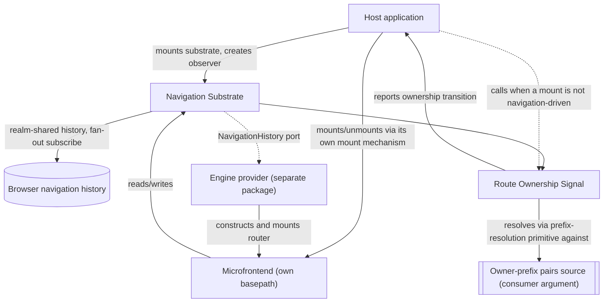

# Technical Design — Routing

- [ ] `p3` - **ID**: `cpt-frontx-routing-design-routing`

<!-- toc -->

- [1. Architecture Overview](#1-architecture-overview)
  - [1.1 Architectural Vision](#11-architectural-vision)
  - [1.2 Architecture Drivers](#12-architecture-drivers)
  - [1.3 Architecture Layers](#13-architecture-layers)
- [2. Principles & Constraints](#2-principles--constraints)
  - [2.1 Design Principles](#21-design-principles)
  - [2.2 Constraints](#22-constraints)
  - [2.3 Obligations On The Consuming Level](#23-obligations-on-the-consuming-level)
- [3. Technical Architecture](#3-technical-architecture)
  - [3.1 Domain Model](#31-domain-model)
  - [3.2 Component Model](#32-component-model)
  - [3.3 API Contracts](#33-api-contracts)
  - [3.4 Internal Dependencies](#34-internal-dependencies)
  - [3.5 External Dependencies](#35-external-dependencies)
  - [3.6 Interactions & Sequences](#36-interactions--sequences)
  - [3.7 Database schemas & tables](#37-database-schemas--tables)
- [4. Additional context](#4-additional-context)
  - [Worked Example: A Console Layout And Its URL](#worked-example-a-console-layout-and-its-url)
  - [Worked Example: Concurrent Occupancy And Same-Entry Instances](#worked-example-concurrent-occupancy-and-same-entry-instances)
- [5. Traceability](#5-traceability)

<!-- /toc -->

## 1. Architecture Overview

### 1.1 Architectural Vision

`@gears-frontx/routing` keeps an agnostic navigation core behind an opaque substrate port, with the concrete router engine supplied by a separately published provider package. The navigation substrate never depends on a concrete engine, and a separately published engine-provider package satisfies the substrate's own history contract; the ecosystem provides a default implementation of it.

Throughout this package's own artifacts, *navigation substrate* names the agnostic core component alone, described next; the published package `@gears-frontx/routing` is that core plus the Route Ownership Signal described after it. An engine provider is never part of this package — it is a distinct published member that depends on this one, never the reverse. (The root DESIGN and ADR 0002 use the term *navigation substrate* at package granularity, naming the whole published library — a broader use than this document's own; see root DESIGN §1.3.)

#### A tree of domains, resolved level by level

A composed application is a tree of extension domains, not a single flat placement. An extension mounted into a domain owns a zone, and that zone may itself contain further domains, so the tree nests to whatever depth the composed application actually has. Route ownership resolution runs at every one of those domains independently, never once against the whole URL: each domain is its own resolution level, and each level reads only the compound query-string keys whose own domain-path portion is exactly the domain key that level was handed — the concrete value the enclosing level hands it the moment it begins to exist — recognized by requiring a candidate key to begin with that value immediately followed by the boundary delimiter (`::`), never by matching an arbitrary leading substring ending in the path delimiter (`.`). Each such key's own occupant-identity segment is then resolved against that domain's own declared route-owner pairs by the one resolution primitive every level shares: both the identity segment and every declared prefix are normalized into their non-empty segment lists, the owner whose declared prefix is the longest segment-wise match names that key's route owner, and no owner is named at all when no declared prefix matches (§3.1, Route Ownership Resolution; §3.3, Prefix-equivalence predicate, which publishes that same segment-normalization and segment-equality rule for a consumer's own registration-time check). A compound key's own value is not part of what any level matches: it is the private parameter payload of the one occupant that key addresses, opaque to every level's own resolution and belonging entirely to that occupant and to whichever engine-provider package it depends on.

#### Uniform compound-key addressing

Every domain in the tree is addressed by the identical construct, at any depth, in any tree position, and at any occupant count (`cpt-frontx-routing-adr-domain-occupancy-addressing-granularity`). A breadth-first traversal of the domain tree produces exactly one compound query-string key — `{domain-path}::{occupant-identity}` — per occupant, in traversal order; a domain holding N occupants contributes N such keys sharing its own domain-path, and a domain holding one contributes one, with no special case distinguishing the two. Two delimiters carry that composition rather than one: the path delimiter (`.`) joins path segments to each other, and the boundary delimiter (`::`) marks the single transition from a key's own domain-path portion to its own occupant-identity portion, appearing exactly once in every compound key — never zero times and never twice — immediately before that final occupant-identity segment. The query string is therefore the only part of the URL this package reads or writes for occupancy: there is no privileged domain within a zone, no domain that continues a pathname, and no cap of one entry on any domain's own projection.

Hierarchy is expressed by traversal order and by domain-path composition alone. A root-level domain's own domain key is simply its own locally-chosen name, having no ancestor to compose from; a nested domain's own key is composed by its enclosing level from the enclosing occupant's own *full* address path — that occupant's own domain-path, joined by the path delimiter to that occupant's own occupant-identity, joined again by the path delimiter to the nested domain's own locally-chosen name — never a shortened form restating only the enclosing occupant's own bare occupant-identity one level down. That full-path composition is what keeps two sibling occupants' identically-named nested domains from colliding, and what makes the tree's shape legible in the address without any pathname segment carrying it. A level reads its own keys by requiring a candidate key to begin with exactly its own domain key immediately followed by the boundary delimiter, never by matching an arbitrary leading substring ending in the path delimiter — which is what rules out prefix shadowing structurally rather than by convention: because a descendant domain's own domain-path always extends its ancestor's by at least one further path-delimiter-joined segment, the character immediately following any ancestor's own domain-path inside a descendant's key is always the path delimiter and never the boundary delimiter, so an ancestor's own boundary-anchored match always fails against a descendant's key by construction, with no runtime tree lookup needed to rule it out.

Every occupant's own parameters nest inside that occupant's own compound key's value, as a percent-encoded `URLSearchParams`-shaped string — one encoding everywhere, chosen by nothing about the occupant's domain, its depth, or how many siblings it has. This is what keeps two occupants that name their own parameter identically, most plainly two instances of the identical microfrontend entry, from ever sharing a namespace in which one could overwrite the other (`cpt-frontx-routing-fr-per-occupant-addressable-parameters`).

The pathname is not part of this model at all. It is purely an application-level concern: an application remains free to put something cosmetic there, and to scope a mounted microfrontend's own router to a `basepath` within it, but this package's own resolution primitive never treats a pathname segment as a declared prefix and this package never writes the pathname to reflect occupancy. That is a real, deliberate loss of the readable pathname address the retracted model produced, accounted for where §4's first worked example lands. A domain that never projects into the URL at all simply stays runtime state this package takes no part in — projection is always an opt-in act of that domain's own consuming level, never a default this package imposes. A hash carries whatever the application chooses, ungoverned by anything in this model. How many occupants a domain may hold mounted at once is decided elsewhere and stays outside this mechanism's own scope (`cpt-frontx-adr-extension-domain-occupancy`, URL projection of domain occupancy); this mechanism only addresses whatever cardinality that decision admits.

#### Navigation Substrate

The Navigation Substrate is the framework-agnostic core: a single navigation history realm-shared between the host and every independently bundled microfrontend, one real subscription to the browser's history fanned out to every listener, and the resolution primitive every domain level's own observer invokes against the occupant-identity segment of each compound key carrying that level's own domain key. That fan-out has two dispatch triggers rather than one: the browser's own `popstate` event, and the substrate's own `push`/`replace` call itself, which dispatches directly because neither call raises `popstate` on its own. A `go` call is deliberately not a direct trigger — the browser raises `popstate` for it, so dispatching directly as well would deliver one navigation to every subscriber twice. Each dispatch round iterates a snapshot of the subscriber set taken when the round starts, re-checking each slot's own liveness immediately before invoking it, so a callback that unsubscribes mid-round is skipped rather than corrupting the iteration, and a callback that triggers a new navigation has that navigation dispatched as its own, later round rather than folded into the round already in progress (§4, recorded failure modes). A routing table is an opaque value to this core, exactly as an occupant's own parameter payload is opaque to every level's resolution above — the substrate carries it but never inspects it. The substrate's own contract, `NavigationHistory` (`location`, `subscribe`, `push`, `replace`, `go`), is deliberately narrower than what any concrete engine's own history contract typically requires — the engine-provider port (`cpt-frontx-routing-fr-engine-provider-port`) states only what a provider **MUST** accept from the substrate and that it is responsible for producing a constructed, mounted router; it names no concrete engine, and this package derives nothing about how a provider bridges that gap. How a provider actually builds that bridge is that provider's own DESIGN's concern, never this one's.

#### Route Ownership Signal

Route Ownership Signal publishes, rather than enforces, the relationship between a compound key a domain level reads and which route owner that key names. It exposes the navigation substrate's resolution primitive as its own public entry point, and lets a consumer create an observer per domain level — passing that domain's own owner-prefix pairs source as a plain argument, never an injected port, together with the domain key that level was handed — that reports every ownership-relevant transition at that level (an owner appearing, disappearing, changing, or its own parameter payload changing), and provides a URL back-projection helper the consumer calls after a mount triggered by something other than navigation, reflecting the mounted owner's own declared prefix back into the URL as that occupant's own compound key. That helper takes a *batch* of slot deltas in one call — each delta naming one compound key, all of them under a single domain path, and either fully replacing that key's value or removing the key — together with the history verb the caller chooses, `push` or `replace`. Batching is what makes an exclusive domain's occupant swap one atomic history entry rather than two, and what keeps a sibling key the batch does not name from having to be restated by the calling code to survive; the chosen verb carries a cost this package states rather than compensates for, accounted for in §4 ("A back-projection reflection and its chosen history verb"). Resolving a deep URL is therefore a wave through the domain tree, not one event: each level's own observer resolves and reports independently the moment that level comes to exist, and this package holds no registry of levels and publishes no aggregated "the whole address resolved" signal — it cannot, by construction, since it never sees the tree of levels a consumer's own mount mechanism assembles from its reports. Mounting and unmounting themselves, and the two-way agreement between the URL and what is actually mounted at every level, are the consumer's own guarantee, built on top of this signal (`cpt-frontx-routing-principle-publishes-not-orchestrates`) — this package never orchestrates them, so it stays agnostic of whatever occupancy model the consumer's own mount mechanism uses.

#### Channel boundary

The library owns exactly one of the ecosystem's three host–microfrontend communication channels. Addressed action dispatch — a command to a specific target, executed through an actions-chains mediator — and shared-property broadcast — declared-interest state distributed to whoever is listening — are both owned by the runtime that provides them; this library neither duplicates nor mediates either one. It owns the URL channel alone: what the address bar reads, and what a navigation does to it.

#### Visibility and zone boundaries

Visibility follows the same boundary, at every level of the domain tree. An occupant owns exactly one addressable slot in the address this library governs: its own compound key, and nothing else — not a sibling occupant's key under the same domain key, and not any key under a domain key it was never handed. Whatever pathname territory the application additionally scopes a mounted microfrontend's own router to is the application's own concern, which this library neither reads nor writes for occupancy. Leaving a zone happens through an imperative call against the shared navigation substrate with an absolute location, through an ordinary link whose `href` is itself an absolute location outside the zone, or through an addressed action to the host over the actions-chains channel — never through a route inside the microfrontend's own tree reaching a key it does not own. A domain's own declared prefix is the namespace of whichever route owner occupies it: an extension carries its own prefix in its own registered declaration, not in this library's own contract, and that prefix is exactly what becomes the occupant-identity segment of the compound key its domain addresses it by; the enclosing level assigns the domain key that compound key is composed from the moment it mounts that occupant — the outermost level's own domain keys come from the host, or from the deployment when that level is served on its own. A same-domain conflict — two route owners declaring the identical prefix at the same level — is caught when that domain's own registrations are made, not at navigation time (PRD §11). What that check actually guarantees is narrower than it first appears, and this design states the limit rather than glossing it: the check operates on *registrations*, comparing the declared prefixes two distinct registrations carry, so it keeps two distinctly registered occupants of one domain from composing the identical compound key and nothing more. It covers two mounts of the identical microfrontend entry exactly as it covers any other pair: an extension is an instance, and route is a property of that instance's own presentation, so two mounts of the identical entry are two separate extensions, each independently registering its own route owner with its own declared prefix — never one shared declaration two mounts read from. A same-declared-prefix collision between two such mounts is therefore caught by the same registration-time check (§2.3, O3b) that catches any other pair of route owners declaring the same prefix; there is no case here the check cannot see, and no separate mount-time discriminator for another package to invent.

### 1.2 Architecture Drivers

#### Functional Drivers

The package's requirements are owned by its own [PRD](./PRD.md).

| Requirement | Design Response |
|-------------|------------------|
| `cpt-frontx-routing-fr-single-navigation-substrate` | The Navigation Substrate holds the shared history behind a well-known realm-global, fanning out one browser-history subscription to every subscriber (`cpt-frontx-component-routing-navigation-substrate`). |
| `cpt-frontx-routing-fr-engine-provider-port` | The Navigation Substrate exposes `NavigationHistory` as the sole contract a router engine reaches the shared history through; no component of this package hands that history to a concrete engine, and no concrete engine dependency exists anywhere in this package's own module graph (`cpt-frontx-component-routing-navigation-substrate`, `cpt-frontx-routing-nfr-agnostic-core`). A separately published provider package — the ecosystem's own default — implements the port. |
| `cpt-frontx-routing-fr-route-ownership-signal` | The Route Ownership Signal component exposes the owner-resolution primitive and an observable owner-change signal created per domain level, plus a URL back-projection helper the consumer calls after a non-navigation-driven mount; the consumer's own mount mechanism does the actual mounting at every level, and the two-way agreement between the URL and what is mounted is the consumer's own guarantee, built on this signal (`cpt-frontx-component-routing-screen-binding`, `cpt-frontx-routing-seq-deep-link-cold-mount`). |
| `cpt-frontx-routing-fr-imperative-navigation` | The Navigation Substrate exposes `push`/`replace`/`go`/`location`/`subscribe` directly, independent of any mounted router or component tree (`cpt-frontx-component-routing-navigation-substrate`). |
| `cpt-frontx-routing-fr-concurrent-occupant-projection` | Every domain projects each of its occupants into that occupant's own compound key (`{domain-path}::{occupant-identity}`), composed breadth-first across the domain tree: a domain holding several occupants side by side contributes several keys sharing its own domain-path, through the identical mechanism a domain holding one occupant uses, with no mode switch between the two (§4, Worked Example: Concurrent Occupancy And Same-Entry Instances, mechanics 1–2). |
| `cpt-frontx-routing-fr-per-occupant-addressable-parameters` | Each occupant's own parameters nest inside that occupant's own compound-key value as a percent-encoded string — one encoding for every occupant of every domain — keeping two instances of the identical microfrontend entry independently addressable and back-projectable through a per-slot full-replace carried as one delta of a batched back-projection call, never a namespace shared with a sibling occupant (§4, Worked Example: Concurrent Occupancy And Same-Entry Instances, mechanics 3–4). |

#### NFR Allocation

| NFR ID | NFR Summary | Allocated To | Design Response | Verification Approach |
|--------|-------------|--------------|-----------------|------------------------|
| `cpt-frontx-routing-nfr-standalone` | No intra-ecosystem import; no call into the consumer at all | The published package | The manifest declares no intra-ecosystem dependency; route ownership reaches the package only through a consumer-supplied owner-prefix pairs source passed as a plain argument, and mount execution never reaches the package at all — the package only publishes a signal the consumer's own mount mechanism acts on (`cpt-frontx-constraint-routing-no-intra-ecosystem-dependency`). | The boundary guards (`arch:edges`, `arch:deps`) hold the manifest and the import graph to the declared standalone property. |
| `cpt-frontx-routing-nfr-agnostic-core` | Package carries no router-engine or UI-framework dependency whatsoever | The whole published package | No module of this package imports any router engine or any UI-framework rendering primitive; every engine-specific dependency lives in a separately published engine-provider package instead (`cpt-frontx-constraint-routing-no-engine-leak`). | The boundary guards confirm this package's own import graph carries no engine or UI-framework edge at all. |

This member records most of its decisions here rather than in a decision record of its own, and cites two existing records that carry the scope it sits inside: `cpt-frontx-adr-core-package-boundaries` states that the core partition covers the UI-framework-agnostic subset and that a member bound to a concrete engine carries its own bounded concern, held by the separately published engine-provider package rather than by this one; `cpt-frontx-adr-extension-domain-occupancy` states that an occupied domain's own projection into the URL, where that domain projects at all, is the address bar's own reflection of the same mount mechanism that record governs, and that a navigation act reaches that mount mechanism rather than a second one running alongside it. The concurrent-occupancy redesign work produced three decisions narrow and consequential enough to record as this member's own ADRs instead: `cpt-frontx-routing-adr-occupant-reference-boundary` fixes how the routing core names and carries occupant identity through resolution and reporting without depending on the concrete `mfes` `Extension` type; `cpt-frontx-routing-adr-mount-trigger-ownership` fixes that actions-chains drives every post-boot mount while navigation drives only cold load, keeping the URL a reflection of mount state rather than a second driver of it; `cpt-frontx-routing-adr-domain-occupancy-addressing-granularity` retracts three separate addressing mechanisms this document once carried — hierarchy as pathname continuation reserved to one privileged domain per zone, occupancy fan-out as a dedicated single-entry query-string key per domain, and a compound-key mode admitted only for a domain holding several occupants at once — and replaces all three with the one uniform breadth-first compound-key mechanism §1.1, §3.1, and both §4 worked examples now describe, with the pathname retired from this package's own occupancy resolution model entirely. Two further decisions, owned and recorded by the framework package rather than by this one, fix the concrete occupant identity the Occupant port §3.1 and §4 describe carries once bridged to an `mfes` `Extension`: `cpt-frontx-framework-adr-occupant-identity-stability` and `cpt-frontx-framework-adr-route-support-scope` (§4, Worked Example: Concurrent Occupancy And Same-Entry Instances).

### 1.3 Architecture Layers

- [ ] `p3` - **ID**: `cpt-frontx-routing-tech-routing-stack`

The diagram below shows the pattern at one representative domain level; the same shape recurs at every level a composed application actually has (§1.1).



| Layer | Responsibility | Technology |
|-------|---------------|------------|
| Navigation substrate | Realm-shared navigation history, fan-out subscription, `basepath` contract, imperative navigation surface | TypeScript, framework-agnostic, no router-engine or UI-framework dependency |
| Route ownership signal | Exposes the substrate's longest-matching-prefix primitive as a public entry point, publishes an observable signal of every ownership-relevant transition per domain level, and provides a URL back-projection helper the consumer calls after a non-navigation-driven mount, taking a batch of slot deltas under one domain path plus the caller's chosen history verb | TypeScript over a consumer-supplied owner-prefix pairs source (plain argument, no port) |

The engine provider shown above is never part of this package; it is a distinct published member (the ecosystem provides a default) that depends on the navigation substrate's `NavigationHistory` contract and is substitutable by any conforming provider — the technology and component detail for that provider belongs entirely to its own DESIGN, not to this one.

## 2. Principles & Constraints

### 2.1 Design Principles

#### Single History Authority

- [ ] `p2` - **ID**: `cpt-frontx-routing-principle-single-history-authority`

Exactly one navigation-history instance answers for a realm; no unit — host or microfrontend — constructs its own. Every unit that needs to read or write navigation state reaches the one realm-shared instance instead, and every subscriber's fan-out traces back to the same single subscription against the browser's own history. This is what keeps independently bundled units from ever holding two divergent views of where the user currently is.

#### Publishes, Does Not Orchestrate

- [ ] `p2` - **ID**: `cpt-frontx-routing-principle-publishes-not-orchestrates`

This package publishes the fact that a compound key a domain level reads resolves to a declared route owner, and publishes when that fact changes; it does not reproduce, alongside that fact, any model of who is allowed to occupy a placement, how many occupants a placement may hold at once, or how a race between two competing mounts resolves — at the outermost level or at any level nested beneath it. Reconciling the URL with what is actually mounted belongs to whichever mount mechanism already holds the registry of route owners, the domains they occupy, and the authority to resolve a race between two mounts — for this ecosystem's own host, the `mfes` runtime (`cpt-frontx-adr-extension-domain-occupancy`). This is a narrower, package-specific consequence of the runtime's own UI-framework-agnosticism principle (`cpt-frontx-principle-agnostic-core`): that principle governs independence from a concrete UI framework and carries no view on domain occupancy one way or the other; this principle is what actually keeps this package from re-implementing a competing occupancy model of its own.

### 2.2 Constraints

#### ROUTING-1 — No engine import in the navigation substrate

- [ ] `p2` - **ID**: `cpt-frontx-constraint-routing-no-engine-leak`

`@gears-frontx/routing` contains no import of a concrete router engine or its packages, anywhere in the package — not merely outside a designated internal component, but absent from the package's own manifest and import graph entirely. Consumers of the navigation substrate and of the route ownership signal interact only with the substrate's own `NavigationHistory` contract (`location`, `subscribe`, `push`, `replace`, `go`); a concrete router engine is never a dependency of this package under any circumstance. The role of "the one place a router engine may be imported" belongs to whichever separately published engine-provider package a microfrontend depends on — enforced there by that provider's own sole-engine-import constraint — never to this package.

**ADRs**: `cpt-frontx-adr-core-package-boundaries` — cited for the partition context this constraint sits outside of (that record's `More Information` states the core partition's scope excludes an engine-bound member like this one); it does not own this constraint, which this DESIGN defines and owns directly.

#### ROUTING-2 — No intra-ecosystem package dependency

- [ ] `p2` - **ID**: `cpt-frontx-constraint-routing-no-intra-ecosystem-dependency`

`@gears-frontx/routing` imports no other package in this ecosystem. Its coupling to whichever unit currently owns a URL prefix is expressed only through a consumer-supplied owner-prefix pairs source, passed as a plain argument; the execution of a mount is entirely the consumer's own responsibility, reached only through the observable signal this package publishes — never through an injected port, and never through a compile-time import of the runtime or any other ecosystem package that implements those concerns.

**ADRs**: `cpt-frontx-adr-core-package-boundaries` — cited for the partition context this constraint sits outside of; that record does not own this constraint, which this DESIGN defines and owns directly.

### 2.3 Obligations On The Consuming Level

This package publishes facts and never orchestrates (`cpt-frontx-routing-principle-publishes-not-orchestrates`), and it holds no registry — of levels, of domains, or of occupants — to check anything at rest against. Several invariants the address this package composes actually depends on are therefore obligations on whichever consuming level holds a domain, not guarantees this package makes. They are collected here as one normative list, because each would otherwise be discoverable only from whichever mechanism implies it. Each states the obligation and cites where the underlying mechanism or rule lives; none restates that mechanism.

- **O1 — Sibling domain-name uniqueness within one zone.** A consuming level **MUST** keep the locally-chosen names of the domains it projects within its own zone distinct from one another. This is that zone's own consuming level's responsibility alone — no other level can see those names, and this package never collects them — and it is one of the three purely local facts the key grammar's own tree-wide uniqueness argument rests on (`cpt-frontx-routing-adr-domain-occupancy-addressing-granularity`, Key Composition Grammar).
- **O2 — Domain-path composition from the full enclosing path.** A consuming level **MUST** compose the domain key it hands each nested domain from the enclosing occupant's own full address path — that occupant's own domain-path, that occupant's own occupant-identity, and the nested domain's own locally-chosen name, joined by the path delimiter — and **MUST NOT** hand down a shortened form restating only the enclosing occupant's own bare occupant-identity (`cpt-frontx-routing-adr-domain-occupancy-addressing-granularity`, Key Composition Grammar; §1.1, Uniform compound-key addressing).
- **O3a — Identity-token lexical validity.** `cpt-frontx-routing-adr-occupant-reference-boundary` requires this package itself to "run a validator for this lexical rule automatically, synchronously, inside the only two places this package's own code actually receives a consumer-supplied identity token as an argument: observer creation, where the declared identifier-to-prefix pairs source the consumer supplies carries each owner's own identity, and the URL back-projection helper, where each slot delta in a batch names a compound key carrying an identity segment," and that "a malformed token at either input path **MUST** be rejected synchronously with a clear error at that point — not merely documented as something the glue layer should have checked before calling in." This is therefore a validated precondition this package's own code enforces synchronously at those two input paths, not a trust-based obligation this package merely documents for the consuming level to keep. That same record is explicit that this validation "runs on those two input paths and nowhere else — **NEVER** on a value parsed out of the URL during resolution": a stale or malformed identity segment encountered while resolving an existing URL "**MUST** resolve to 'no owner'" instead — the same fully specified outcome any compound key whose occupant-identity segment matches no declared prefix already gets (§1.1, A tree of domains, resolved level by level) — never a thrown error.
- **O3b — Within-domain live/cross-mount uniqueness.** A consuming level **MUST** keep occupant-identity tokens distinct within one domain across every mount that is currently live — including two mounts of the identical microfrontend entry, each of which is its own distinct registration with its own independently declared prefix, so the registration-time same-declared-prefix conflict check separates them exactly as it separates any other pair (§1.1, Visibility and zone boundaries; PRD §11). This stays a consumer/registration-time obligation, in the same class as O1 and O2: this package holds no registry of domains, levels, or occupants to check it against at rest. This obligation is also what actually supplies the second of the three local facts the key grammar's own uniqueness argument rests on — occupant-identity uniqueness within one domain — which that argument credits to the registration-time check, including for two mounts of the identical entry (§1.1, Visibility and zone boundaries).

O1, O2, and O3b all require checking a candidate against a set of *other* live registrations or observers this package deliberately holds no registry of, so they stay documented obligations on the consuming level; O3a is pure input-argument validation with no registry dependency at all — checking one supplied token's own shape, never comparing it against anything else that is live — so this package's own code can, and does, enforce it directly.
- **O4 — Observer release-and-recreate when a domain's own domain key changes.** A consuming level **MUST** release the observer holding a stale domain key and create its successor carrying the new value whenever the domain key it composed for a nested domain changes; a domain key is immutable for its observer's own lifetime and is never updated in place. The mechanism, the observable window this opens, and why that window's bound is the consuming level's rather than this package's are described in full by this DESIGN's own recorded failure mode "A level's own domain key goes stale before its enclosing level re-creates it" (§4).
- **O5 — Back-projection after every non-navigation-driven mount.** A consuming level **MUST** call the URL back-projection helper after every mount or unmount it *originates* through a channel other than navigation. `cpt-frontx-routing-adr-mount-trigger-ownership` makes actions-chains the sole originating channel post-boot and navigation the restoring channel only, and that record's own consequence is that the helper is load-bearing for every such origination rather than an occasional convenience: an occupancy the address bar never reflected is an occupancy no later restoring navigation can replay.
- **O6 — Mounted-set reconciliation on a restoring navigation, routed through the originating channel.** A consuming level **MUST** reconcile its own mounted set against what a restoring navigation reports — a back/forward step, or any other navigation reaching a state a history entry already represents — and, where such a report describes a projected state no live consumer recognizes, **MUST** reach a mount only by re-resolving that state and re-dispatching it through the originating actions-chains channel, never by mounting directly off the observed signal (`cpt-frontx-routing-adr-mount-trigger-ownership`, Decision Outcome's residual case and Confirmation).

## 3. Technical Architecture

### 3.1 Domain Model

| Entity | Definition | Representation |
|--------|------------|-----------------|
| Navigation History | The realm-shared, single navigation-history instance every unit reads and writes; exposes the substrate's own `NavigationHistory` contract — `location`, `subscribe`, `push`, `replace`, `go`. A separately published engine-provider package adapts this into whatever contract its own concrete engine expects; that adapted contract is not this package's concern. | Realm-global-backed singleton — `@gears-frontx/routing` |
| Zone | The territory an extension owns once mounted into an extension domain; a zone may itself contain further extension domains, nesting the tree of levels this library resolves. Not this package's own artifact — the zone belongs to whichever runtime governs the domain (`cpt-frontx-adr-extension-domain-occupancy`); this package only resolves against it. | Structural concept, not a package-owned entity |
| Level | One extension domain's own position in the zone tree, and the point at which resolution and observation both run: a level's own domain key, its own declared route-owner pairs, and the set of compound keys currently carrying that domain key are all local to it, never shared with another level. | Resolved per domain — `@gears-frontx/routing` |
| Domain Key | The domain-path portion every one of a domain's own compound keys shares — what `cpt-frontx-routing-adr-domain-occupancy-addressing-granularity` names a *domain-path* — and the only addressing coordinate a level's own resolution and observation run against: assigned by the enclosing level the moment that domain begins to exist — a render-time value, never a declaration carried in a registration. The outermost level's own domain keys are the host's own choice, or the deployment's when that level is served on its own, and are simply those domains' own locally-chosen names; a nested domain's own key is composed by its enclosing level from the enclosing occupant's own full address path — that occupant's own domain-path, that occupant's own occupant-identity, and the nested domain's own locally-chosen name, joined by the path delimiter (`.`) — which is what expresses hierarchy now that no pathname segment does and what keeps two sibling occupants' identically-named nested domains from colliding (§2.3, O1–O2). A level reads its own keys by requiring a candidate key to begin with exactly its own domain key immediately followed by the boundary delimiter (`::`), never by matching an arbitrary leading substring ending in the path delimiter, so a hierarchy-carrying domain key that itself contains path delimiters can never shadow a descendant domain's own key. A domain key is fixed for the observer created with it and is never updated on a live observer — replacing it means releasing that observer and creating its successor with the new value (§2.3, O4; §4, "A level's own domain key goes stale before its enclosing level re-creates it"). | Consumer-supplied per domain, immutable per observer instance |
| Route Owner | The opaque identifier of whichever unit currently owns a declared prefix at one domain level, paired with that prefix; supplied by that level's own consumer as a plain argument to the route ownership signal's observer. Declares exactly one prefix — never more than one — for as long as its registration exists, and that prefix is what a compound key carries as its own occupant-identity segment. | Identifier/prefix pair, consumer-supplied |
| Occupant | The abstract identity-plus-opaque-parameter-bag the routing core resolves against, fixed by `cpt-frontx-routing-adr-occupant-reference-boundary` so that resolution never depends on the concrete `mfes` `Extension` type. Occupant is a superset of Route Owner, not a synonym or a different abstraction layer: the identity half of an Occupant is exactly the identifier a Route Owner pairs with its declared prefix, so every occupant a domain's resolution names is, for the resolution primitive's own purposes, a Route Owner of that domain — but an Occupant additionally carries the opaque parameter bag the primitive never inspects and never matches against, carried as its own compound key's value and independently addressable there whether it has siblings in its domain or not (§4, "Compound-key-per-occupant addressing"). The identity half is uninterpreted rather than opaque: this package never reads what it names, but it does require it to be lexically well-formed, because it becomes a literal substring of a key this package composes and parses (`cpt-frontx-routing-adr-occupant-reference-boundary`, Occupant Identity Lexical Rule; §2.3, O3a). A glue layer external to this package, never this package itself, maps a concrete `mfes` `Extension` registration into this shape. | Identity + opaque parameter bag — port, adapted by external glue, never a package-owned concrete type |
| Compound Key | The `{domain-path}::{occupant-identity}` addressing construct this package's one uniform mechanism composes per occupant, for every domain at every depth and every occupant count — a domain holding N occupants contributes N of them, sharing its own domain-path, and never an array, a repeated key, or a single entry shared between two occupants. The domain-path portion is the value the domain's own consuming level was handed; the boundary delimiter (`::`) appears exactly once, immediately before the final occupant-identity segment, which is the declared prefix that occupant registers as its own Route Owner. Two distinctly registered occupants of one domain therefore key against two different compound keys rather than colliding on one shared key; two mounts of the identical entry are no exception, since each mount is its own distinct registration with its own independently declared prefix, so per-domain uniqueness of currently-live identity tokens holds for them exactly as it does for any other pair of occupants (§2.3, O3b; §1.1, Visibility and zone boundaries; PRD §11). The key's own value carries that occupant's parameters as a percent-encoded string, never matched by any level's resolution. | Handed-down domain-path portion + boundary delimiter + resolution-derived occupant-identity segment, one query-string key per occupant |
| Basepath | The pathname prefix a mounted microfrontend's own router is scoped to; supplied by the application or the deployment that owns the pathname, and consumed by whichever engine-provider package constructs the microfrontend's router. Not a product of occupancy resolution: this package carries the contract but derives no value for it, because its own resolution reads no pathname segment at all (`cpt-frontx-routing-adr-domain-occupancy-addressing-granularity`). | String, provider input |
| Route Ownership Resolution | The outcome of matching the occupant-identity segment of one compound key whose own domain-path is exactly a level's own domain key — recognized boundary-anchored, never by an arbitrary leading substring — against that domain's own declared prefixes by longest segment-wise match, naming the route owner that key belongs to, or naming none when no declared prefix matches; exposed by this package as a thin entry point over the navigation substrate's own primitive, never re-implemented. | Resolver output — `@gears-frontx/routing` |

### 3.2 Component Model

#### Navigation Substrate

- [ ] `p2` - **ID**: `cpt-frontx-component-routing-navigation-substrate`

Concrete artifact: `@gears-frontx/routing` (core entry).

##### Why this component exists

Independently bundled units in the same realm need one navigation history to agree on, not one each. The Navigation Substrate is the framework-agnostic core that holds that single instance, fans out one browser-history subscription to every listener, and exposes imperative navigation outside any UI tree.

##### Responsibility scope

- Owns the single, realm-shared navigation-history instance and its fan-out subscription.
- Owns the `basepath` contract every scoped router is built against, as a contract alone — the value is the application's or the deployment's, never one this component derives from occupancy.
- Exposes `push`, `replace`, `go`, `location`, `subscribe` for use outside a mounted router.

##### Responsibility boundaries

- Carries no dependency on any router engine or UI framework whatsoever (`cpt-frontx-constraint-routing-no-engine-leak`, `cpt-frontx-routing-nfr-agnostic-core`).
- Treats a routing table as an opaque value it never inspects; route-tree shape belongs entirely to whichever engine-provider package and microfrontend build it.
- Reads no pathname segment as a declared prefix, and writes no pathname to reflect occupancy; the pathname is an application-level concern in this model (`cpt-frontx-routing-adr-domain-occupancy-addressing-granularity`).
- Does not perform mounting, unmounting, or resolve which route owner is currently mounted; it owns the longest-matching-prefix primitive that names a route owner for one compound key's own occupant-identity segment — normalizing that segment and every declared prefix into non-empty segment lists, naming the owner whose declared prefix is the longest segment-wise match, and naming none when no prefix matches (§1.1, A tree of domains, resolved level by level) — Route Ownership Signal exposes that primitive as its own public entry point at every level, and builds its observable signal on top of it, rather than re-implementing it.

##### Related components (by ID)

- `cpt-frontx-component-routing-screen-binding` (Route Ownership Signal) — subscribes to the substrate's fan-out to compute and publish ownership-change transitions.
- The port this component declares (`cpt-frontx-routing-fr-engine-provider-port`) — implemented by the engine-provider component of whichever separately published provider package satisfies it (named in §3.4); that component is an external consumer of this component's `NavigationHistory` contract, owned entirely by that provider package, not by this one.

#### Route Ownership Signal

- [ ] `p2` - **ID**: `cpt-frontx-component-routing-screen-binding`

Concrete artifact: `@gears-frontx/routing` (core entry).

##### Why this component exists

A consumer's own mount mechanism needs to know, from the URL alone, which declared route owner each compound key under its own domain path belongs to and when that resolution changes — without this package holding any opinion about how mounting, unmounting, or occupancy cardinality actually work, and without a whole-URL registry this package would have to hold to answer that question for a nested level. Route Ownership Signal is the component that exposes that resolution per level, and publishes its changes as an observable signal, leaving mounting entirely to the consumer.

##### Responsibility scope

- Exposes the navigation substrate's longest-matching-prefix primitive as this package's own public owner-resolution entry point, without re-implementing the matching itself.
- Lets a consumer create an observer per domain level, passing that domain's own owner-prefix pairs source as a plain argument — never an injected port — together with the domain key that level was handed; the observer resolves once per compound key whose own domain-path is exactly that domain key, and reports an ownership-change transition (appeared, disappeared, changed, or the resolved occupant's own parameter payload changed) on creation and on every subsequent ownership-relevant navigation at that level.
- Provides a URL back-projection helper the consumer calls to reflect a mount that happened for a reason other than navigation back into the URL, taking a batch of slot deltas — each naming one compound key, all of them under one domain path, and either fully replacing that key's value or removing the key — together with the history verb the caller chooses, `push` or `replace`, so that a swap of one exclusive domain's occupant lands as a single atomic history entry.

##### Responsibility boundaries

- Does not maintain a registry of route owners; the consumer supplies the current set of declared pairs itself, per domain level, as a plain argument, not through an injected port.
- Does not execute a mount or an unmount itself, and does not resolve a race between two mounts competing for the same placement; both are the consumer's own mount mechanism's responsibility (§2.3, Obligations On The Consuming Level).
- Does not participate in the addressed-action or shared-property channels; it reads only the URL channel, and within it only the query string.
- Carries no notion of exclusive versus concurrent occupancy, and no state machine tracking which owner currently occupies a placement, at any domain level; that occupancy model belongs entirely to whichever mount mechanism the consumer already runs (`cpt-frontx-routing-principle-publishes-not-orchestrates`). A compound key (§3.1, Compound Key) is nonetheless a per-occupant addressable slot this component's own back-projection helper can target, alone or alongside its siblings in one batched call (§3.3, URL back-projection helper) — that addressability does not mean this signal models occupancy cardinality itself; how many compound keys a domain holds at once, and when, stays the consumer's own mount mechanism's concern, and so does which deltas a batch carries.
- Holds no registry of domain levels, and publishes no signal asserting that a multi-level address resolved end to end; each level's own observer reports only that level's own transitions.
- Requires nothing from the consumer beyond the plain-argument owner-prefix pairs source at observer creation, and no port at all; a consumer that never creates the observer at a given level simply never participates in that level's signal, with no misconfigured state to detect or diagnose.

##### Related components (by ID)

- `cpt-frontx-component-routing-navigation-substrate` — supplies the history and the prefix-resolution primitive this component exposes and subscribes to.

### 3.3 API Contracts

- [ ] `p2` - **ID**: `cpt-frontx-routing-interface-package-entry`

- **Contracts**: the substrate's own `NavigationHistory` contract (`location`, `subscribe`, `push`, `replace`, `go`); the `basepath` contract; the prefix-equivalence predicate a domain's own consumer uses for its own registration-time conflict check, and the occupant-identity lexical validator published alongside it; the consumer-supplied owner-prefix pairs source, the per-level observer's own construction shape, and the route ownership signal's transition shape; the engine-provider port a provider package must satisfy — declared by this package's own component rather than by whichever package implements it, so its normative field-level shape is stated here in full, immediately beneath the table below, because it is the one contract in this section a separately published package conforms against rather than merely calls; a conforming provider's own adaptation of that shape is a worked example the provider carries in its own package tree, not a restatement of the normative contract. No specification layer sits beneath this DESIGN for any contract in this section: each one's own field-level form is fixed at implementation time against the contract description given here, never in a separate document.
- **Technology**: TypeScript library API, single entry point — this package carries no separate engine-provider entry, because it ships no engine provider of its own at all.
- **Location**: Not authored yet — no source exists for this package. The entry (e.g. `src/index.ts`) carries the navigation substrate's and the route ownership signal's contracts only.

| Public surface | Purpose |
|----------------|---------|
| `NavigationHistory` contract | The shape the shared navigation history itself exposes: `location`, `subscribe(cb)`, `push`, `replace`, `go`. The substrate's own notification payload is internal to this contract; adapting it into whatever shape a concrete engine's own `subscribe` callback expects is that engine-provider package's job, not this contract's. |
| `basepath` | The pathname prefix a scoped router is built against, supplied by the application or the deployment that owns the pathname. This package publishes the contract and never derives a value for it: occupancy resolution reads no pathname segment (`cpt-frontx-routing-adr-domain-occupancy-addressing-granularity`). |
| Prefix-equivalence predicate | Normalizes two declared prefixes into their non-empty segment lists and reports whether the lists are identical, using the same segment-normalization and segment-equality rule the owner-resolution primitive applies at match time; a domain's own consumer calls it at registration time to check two candidate declared prefixes for a same-prefix conflict (PRD §11), rather than approximating the rule with a separate comparison of its own. Its own field-level form is fixed at implementation time against the contract this row describes. |
| Occupant-identity lexical validator | Reports whether one occupant-identity value satisfies the lexical rule `cpt-frontx-routing-adr-occupant-reference-boundary` states normatively. This package's own code already calls this validator synchronously at observer creation and at the URL back-projection helper, rejecting a malformed identity with a clear error at either point (§2.3, O3a); publishing it as a callable function besides is a convenience letting the glue layer check an identity proactively, before ever calling either entry point, rather than the extent of the enforcement itself. Within-domain live/cross-mount uniqueness of an identity token is a separate invariant this validator does not check and this package cannot enforce, since it holds no registry of occupants to check it against — that stays the consuming level's own registration-time obligation (§2.3, O3b). |
| Engine-provider port | The contract a provider package must satisfy to receive the shared history and produce a constructed, mounted router; its normative field-level shape is stated immediately beneath this table, in this package's own tree, because this package declares the port — a conforming provider's own adaptation of it is a worked example that provider carries in its own package, not the normative contract itself. |
| Owner-prefix pairs source | A plain argument (never an injected port) supplying identifier-to-declared-prefix pairs the owner-resolution primitive matches against, scoped to one domain level; its own field-level form is fixed at implementation time against the contract this row describes. Every identity in this source is validated at observer creation, synchronously, against the Occupant Identity Lexical Rule (`cpt-frontx-routing-adr-occupant-reference-boundary`); a malformed identity is rejected with a clear, synchronously-thrown error at that point (§2.3, O3a). |
| Ownership-change transition | The observable notification the route ownership signal delivers to a consumer-registered callback on creation, when an owner resolves (appeared only — no report when none resolves), and on every subsequent ownership-relevant navigation at one domain level — appeared, disappeared, changed, or the resolved occupant's own parameter payload changed. Mounting itself stays entirely the consumer's own responsibility; this package only signals. Its own field-level form is fixed at implementation time against the contract this row describes. |
| URL back-projection helper | The helper a consumer calls to reflect a mount not driven by navigation back into the URL. One call carries a batch of slot deltas, every delta in the batch constrained to the same domain path, plus the history verb the caller chooses — `push` or `replace`. Each delta targets exactly one addressable slot: one compound key, whose entire value it replaces, or which it removes outright. Nothing the batch does not name is touched — not a sibling key under the same domain path, not a key under another domain path, not the pathname, not the hash (§4, Worked Example: Concurrent Occupancy And Same-Entry Instances, mechanic 4). Batching is what lets an exclusive domain's occupant swap — one key removed, another added — land as one atomic history entry rather than two, and is why no caller has to restate a sibling key to keep it alive. The verb is the caller's because the cost differs per transition, not per package (§4, "A back-projection reflection and its chosen history verb"). There is no second mode targeting a pathname segment, because a pathname segment is never an occupancy slot in this model. Every delta's own identity segment is validated synchronously against the Occupant Identity Lexical Rule (`cpt-frontx-routing-adr-occupant-reference-boundary`) before the call takes effect; a malformed identity in any delta is rejected with a clear, synchronously-thrown error, and rejection of one delta rejects the whole batched call rather than applying the rest (§2.3, O3a; §4, "Back-projection batch atomicity"). Its own field-level form is fixed at implementation time against the contract this row describes. |

**Engine-provider port — normative shape.** This is the one contract in this section a separately published package conforms *against* rather than calls, so its field-level shape is stated here in full rather than left to the conforming package to infer. Everything below is a requirement on the provider package; none of it is a capability this package gains.

*Inputs a provider **MUST** accept.*

- **The realm-shared `NavigationHistory` instance**, whose five members are the whole of what this package offers a provider: `location`, the current location, readable synchronously at any moment; `subscribe(cb)`, which registers one fan-out callback and returns the release that detaches it; `push` and `replace`, which change the location and dispatch the fan-out directly, because neither raises the browser's own `popstate`; and `go`, which steps the history relatively and reaches subscribers through the `popstate` the browser does raise for it (§1.1, Navigation Substrate). A provider **MUST** reach navigation state only through this instance — never by constructing a history of its own, and never by calling the browser's history API directly, either of which leaves the shared instance's `location` stale and its fan-out silent for that change (§4, "Third-party code mutates the browser's history behind the substrate's back").
- **A `basepath` string**, the pathname prefix its constructed router is scoped to: assigned by the enclosing level the moment it mounts the unit in a composed application, or supplied by the deployment's own configuration when that unit is served on its own, where the empty string is the legal value for a unit served at a root (§3.1, Basepath; §4, "Standalone deployment of a single microfrontend"). A provider **MUST** take it as a value it is handed and **MUST NOT** derive it — not from a domain key, not from a compound key, not from any resolution outcome — because this package publishes the contract and derives no value for it either (`cpt-frontx-routing-adr-domain-occupancy-addressing-granularity`).
- **A route tree**, opaque to this package at every point: this package carries no notion of its shape and never inspects it (§3.2, Navigation Substrate, Responsibility boundaries), so nothing about how a provider declares or nests routes inside it is constrained by this port.

*Adaptation obligations on the `NavigationHistory` contract.* Those five members are deliberately narrower than what a concrete engine's own history contract typically requires (§1.1, Navigation Substrate); closing that gap is entirely the provider's own work, and this port fixes only how it may be closed.

- Every further member a provider's own engine history contract requires **MUST** be derived from those five alone. A provider **MUST NOT** require `NavigationHistory` to widen for it; where a required member cannot be satisfied faithfully — most plainly any member expecting to intercept a navigation *before* it commits, which an after-commit fan-out cannot support — that degradation is recorded in the provider's own DESIGN, never compensated for here.
- The substrate's own notification payload is internal to this contract (see the `NavigationHistory` row above); translating it into whatever shape the provider's own engine's subscribe callback expects is the provider's own work, and this package derives nothing about that shape.
- A provider **MUST** register exactly one `subscribe` callback per router it constructs, and **MUST** invoke that subscription's own release when the unit owning that router unmounts, so a torn-down router's callback stops receiving the fan-out.
- A provider **MUST** originate every location change through `push`, `replace`, or `go` on the shared instance, and **MUST NOT** add a dispatch of its own alongside any of them: `push`/`replace` already dispatch directly and `go` already arrives through `popstate`, so a compensating dispatch delivers one navigation to every subscriber twice (§1.1, Navigation Substrate).

*The product a provider **MUST** construct and return.* One router per construction call — built from the route tree it was handed, over the history it adapted, scoped to the `basepath` it was handed — mounted into the component tree of the unit that depends on that provider, together with the teardown path that releases the subscription above. Two properties of that router belong to this port rather than to the provider's own discretion: it **MUST** read the already-current `location` at construction rather than starting from a blank route, so no blank frame appears between mount and first render at any domain level (§4, "Deep link into a not-yet-mounted microfrontend, at any domain level"; §3.6); and it **MUST** match only the pathname remainder beneath its own `basepath`, never reaching a path outside that prefix through its own routing table. Whether a provider exposes that construction as one call or several, and what UI-framework primitive it mounts with, is the provider's own DESIGN's concern.

*Per-slot targeting — what a provider's own navigation may write.* An occupant owns exactly one addressable slot in the address this package governs: its own compound key, and nothing else (§1.1, Visibility and zone boundaries). A router a provider constructs inherits that containment unchanged. Any URL state such a router writes durably **MUST** be confined to its own occupant's compound key — that key's own value, and no other key — or to the pathname beneath the `basepath` its router is scoped to, which the application owns and this package neither reads nor writes for occupancy. It **MUST NOT** write a sibling occupant's compound key under the same domain path, any key under another domain path, or a bare top-level query-string key of its own, since a bare key is exactly the flat namespace per-occupant addressing exists to eliminate (`cpt-frontx-routing-fr-per-occupant-addressable-parameters`; §4, Worked Example: Concurrent Occupancy And Same-Entry Instances, mechanic 3). The URL back-projection helper carries the identical containment on its own side — each delta names exactly one compound key and touches nothing else (see the URL back-projection helper row above) — so provider-originated state reaching the URL through a consumer's back-projection call is bounded to that one occupant's key by the same rule. Leaving that containment is always a deliberate act through a channel of its own, never a routing-table reach: an imperative call against the shared instance with an absolute location, an ordinary link whose `href` is itself an absolute location outside the zone, or an addressed action to the host over the actions-chains channel (§1.1, Visibility and zone boundaries; §1.1, Channel boundary). Which of the two permitted destinations a provider's own internal route state actually uses — its occupant's compound-key value, the pathname beneath its `basepath`, or nothing durable at all — is deliberately left open (§4, "An occupant's own internal routing inside its own zone"); the containment stated here holds whichever it turns out to be.

### 3.4 Internal Dependencies

None. The package imports no other package in this ecosystem — the standalone property this member claims under the layer's membership rules (root DESIGN §1.3), held to the cross-member dependency policy of root DESIGN §3.4. Its coupling to route ownership is expressed through a consumer-supplied owner-prefix pairs source passed as a plain argument, and its coupling to mount execution through the observable signal this package publishes — never through an injected port and never through a package import (`cpt-frontx-constraint-routing-no-intra-ecosystem-dependency`). A separately published engine-provider package (the ecosystem's own default, `@gears-frontx/routing-tanstack`) depends on this package; the dependency runs one way only, and this package never depends back on any engine-provider package.

**Dependency Rules** (per project conventions):
- No circular dependencies at the design level: no other ecosystem package depends on this package, and this package depends on none.
- No import of template territory.
- No UI-framework import, and no router-engine import, anywhere in this package.

### 3.5 External Dependencies

None. This package carries no external dependency on any router engine, UI framework, or other third-party library beyond the browser's own navigation-history API (PRD §3.1, §10). Every router-engine dependency lives entirely in a separately published engine-provider package's own external dependency list.

### 3.6 Interactions & Sequences

#### Deep Link Resolves Through A Multi-Level Wave Of Compound-Key Resolutions

- [ ] `p3` - **ID**: `cpt-frontx-routing-seq-deep-link-cold-mount`

**Use cases**: `cpt-frontx-routing-usecase-deep-link-to-microfrontend-screen`

**Actors**: `cpt-frontx-routing-actor-application-developer`

```mermaid
sequenceDiagram
    participant Browser
    participant Substrate as Navigation Substrate
    participant D0 as Route Ownership Signal (Level 0, domain key "screen")
    participant Glue0 as Level 0 consumer's own mount mechanism
    participant S0 as Route Ownership Signal (Level 0, domain key "modal")
    participant D1 as Route Ownership Signal (Level 1, domain key composed from Owner A's own full address path)
    participant Glue1 as Level 1 consumer's own mount mechanism
    Note over Browser,D1: Cold load or reload — resolution at observer creation, no fan-out round involved
    Browser->>Substrate: cold load / reload (location already current)
    Glue0->>D0: create observer (domain key "screen", that domain's own pairs)
    D0->>Substrate: read current location
    D0->>D0: resolve every key whose domain-path is "screen" against that domain's own pairs
    D0-->>Glue0: report initial transition (appeared: Owner A, keyed screen::<A's prefix>)
    Glue0->>Glue0: mount Owner A, handing it the value of its own compound key
    Glue0->>S0: create observer (domain key "modal", that domain's own pairs)
    S0->>Substrate: read current location
    S0->>S0: resolve every key whose domain-path is "modal" against that domain's own pairs
    S0-->>Glue0: report initial transition (appeared: Owner C — or no report when none resolves)
    Note over Glue0,D1: Owner A's own zone contains a further domain once A exists
    Glue0->>D1: create observer (domain key composed from Owner A's own full address path, that domain's own pairs)
    D1->>Substrate: read current location
    D1->>D1: resolve every key whose domain-path is its own against that domain's own pairs
    D1-->>Glue1: report initial transition (appeared: Owner B)
    Glue1->>Glue1: mount Owner B, handing it the value of its own compound key
    Note over Browser,D1: Back/forward — every already-existing observer is notified through one fan-out round
    Browser->>Substrate: back/forward step (location changes)
    Substrate->>D0: notify (fan-out)
    Substrate->>S0: notify (fan-out)
    Substrate->>D1: notify (fan-out)
    D0->>D0: re-resolve every key whose domain-path is "screen"
    D0-->>Glue0: report transition, if ownership-relevant
    S0->>S0: re-resolve every key whose domain-path is "modal"
    S0-->>Glue0: report transition, if ownership-relevant
    D1->>D1: re-resolve every key whose domain-path is its own
    D1-->>Glue1: report transition, if ownership-relevant
    Note over Glue0,Glue1: Every level's own wave resolves independently, through the identical construct; no participant here asserts the whole address resolved together.
```

**Description**: The primary flow this package participates in, generalized past one level. Every level resolves the same way — its own domain key, its own declared pairs, the compound keys the current location happens to carry under that domain-path — with no level privileged over another and no pathname segment involved anywhere in the resolution. Route Ownership Signal reports that level's own transitions; everything after that — mounting, unmounting, and showing a fallback — is that level's own consumer acting on the report, not this package's own orchestration. A freshly mounted microfrontend's router reads the already-current location from the shared history at start, so no blank screen appears between mount and first render, at any level. A level begins to exist only once its enclosing level's own consumer mounts the occupant whose zone contains it — which is also the moment that occupant's own full address path becomes available for composing the nested domain's own key; until then, the deeper level's own observer does not yet exist, and no signal at the shallower level distinguishes that absence from "no owner will ever match here."

### 3.7 Database schemas & tables

Not applicable. The package holds no database and no durable persistence; the shared navigation history lives in memory on the realm global for the lifetime of the page.

## 4. Additional context

The library's central design tension is keeping the navigation substrate agnostic of any router engine while still letting a consumer reach a ready-to-use default. It is resolved by separation of artifacts: the agnostic substrate and its default provider live in *separate published packages* — this package and a separately published engine-provider package — so it is the package boundary itself, not an intra-package constraint, that keeps the default provider's own router-engine dependency from ever reaching this package.

Recorded failure modes:

- **Deep link into a not-yet-mounted microfrontend, at any domain level.** Mounting is asynchronous; the freshly mounted router reads the current location from the shared history at start, so no blank screen appears while mounting completes, at the outermost level or at any level nested beneath it. Reading the current location at start is an obligation on whichever engine-provider package constructs that router, not on this package.
- **Multiple independently bundled copies of this package.** Programmatic navigation changes the address through the browser's history API without emitting the event a separate history instance listens for, so a copy holding its own history observes nothing; without a single shared history, routers in different copies drift out of agreement with each other and with the URL. The realm-shared instance is what prevents this by construction. Resolution of that instance runs through a single well-known realm-global key that carries the `NavigationHistory` contract's own version: whichever copy looks the key up first and finds it empty constructs the instance and publishes it under that key, and every later copy built against the same contract version finds and reuses it rather than constructing a second one. A copy built against an incompatible contract version looks up a different versioned key, so it constructs its own instance rather than silently capturing and reusing one it cannot actually satisfy — one instance per contract version, never one silently shared across incompatible versions.
- **A navigation performed through the substrate's own `push`/`replace`.** Neither call relies on the browser's `popstate` event; the substrate's fan-out dispatch is triggered directly by the call itself instead, which is why the fan-out has two triggers rather than one (§1.1, Navigation Substrate). A `go` call is excluded from that direct trigger for the opposite reason: the browser does raise `popstate` for it, so triggering directly as well would deliver one navigation to every subscriber twice.
- **Third-party code mutates the browser's history behind the substrate's back.** A page-level script calling the browser's history API directly, bypassing the shared instance, leaves the substrate's `location` stale and its fan-out silent for that change — no code path notifies the substrate a navigation happened. This is an environmental condition the library does not prevent (PRD §3.1), not a supported way to navigate.
- **Unsubscribing, or navigating, from inside a fan-out callback.** Each dispatch round iterates a snapshot of the subscriber set taken when the round starts, so a callback that unsubscribes mid-round does not corrupt the iteration; a callback that triggers a new navigation has that navigation dispatched as its own, later round rather than folded into the round already in progress (§1.1, Navigation Substrate). The snapshot fixes which callbacks are eligible for the round, not that each one is actually delivered to: the round re-checks each slot's own liveness immediately before invoking it, so a callback released — through its own observer's release function, which detaches that observer's subscription from the fan-out and returns having guaranteed no further transition will be reported for it, or through a direct unsubscribe — before the round's own iteration reaches its slot is skipped, never invoked, even though the snapshot already reserved that slot for it; an invocation the round already completed before the release is never undone. This is what an observer's own release guarantee — that no transition is reported after release, including one from a round already in progress — actually depends on: without this liveness check, a fan-out implementation that simply invoked its whole snapshot would deliver exactly the stale transition that guarantee forbids.
- **A compound key's own occupant-identity segment matches no declared prefix, at some domain level.** Composed: that level's own Route Ownership Signal reports "no owner" (or an owner disappearing) for that key, and the consumer holding that level shows its own fallback and mounts nothing for it — this package takes no fallback action itself, at any level. Standalone: the microfrontend's own engine-provider package resolves to its own not-found route inside its own route tree, because no route-ownership-signal observer participates at all. The user-visible outcome — a not-found screen — is the same in both modes, but the mechanism differs: one is a consumer-level fallback acting on the signal, the other is that provider's own routing result.
- **A domain level several steps deep has not yet reported.** Because this package holds no registry of levels, "no owner at a deep level" and "the wave has not reached that level yet" are indistinguishable at any shallower level's own observer — the deeper level's own observer exists, and reports, only once its enclosing level's consumer has mounted the occupant whose zone contains it. No aggregate "the address resolved" signal exists to disambiguate the two, by construction: publishing one would require a registry of levels this package does not hold.
- **A level's own domain key goes stale before its enclosing level re-creates it.** A level's own domain key is fixed at its observer's own creation and is never updated in place (§2.3, O4); when the enclosing level's own occupant that the nested key was composed from is replaced by a different occupant — or by a different instance of the same one, keyed differently — the enclosing level's own consumer releases the observer holding the stale domain key and creates a fresh one carrying the new value. It never updates the domain key of the observer already running, because a domain key is immutable by construction for the observer's own lifetime. Because a fan-out round notifies subscribers in registration order, the same round that triggers the enclosing level's own re-render can reach a still-stale nested observer before that re-render has released and recreated it. In that window, the stale observer finds no key whose domain-path is its own now-obsolete domain key, resolves honestly to "no owner," and reports the owner disappearing, and its own level's consumer may unmount an occupant the enclosing level is about to tear down anyway once it finishes recreating the nested observer. This window's bound is not a guarantee this package enforces: it is set by how quickly the enclosing level's own consumer completes its own release-and-recreate sequence (§2.3, O4) — typically within the same round that triggered the enclosing level's own re-render, but that timing belongs to the consumer, not to this package, which makes no promise about how long a stale observer may keep reporting. The window resolves itself the moment the recreated observer reports its own first resolution against the new domain key; the sequence it produces in the meantime — a disappearing report ahead of the enclosing level's own teardown — is observable and is an accepted cost of resolving each level independently rather than serializing the whole tree's resolution on one event.
- **A compound key outlives the domain that projected it.** A key with no observer currently reading it is inert, not an error and not a fallback state: it is indistinguishable, at the URL, from a domain whose own wave has not yet reached it. Because the back-projection helper only ever touches the compound keys its own batch of slot deltas names, every one of them under the single domain path that batch is constrained to, it never resets a key it was not asked about, so an orphaned key is not swept away as a side effect of some other level's reflection either; it persists until whichever consumer owns that domain removes it as part of unmounting its occupant. That is a direct consequence of retiring the pathname-mode helper whose reset-by-default rule used to clear the whole search (`cpt-frontx-routing-adr-domain-occupancy-addressing-granularity`), and it is accepted rather than compensated for: a key that does survive is resolved correctly if the domain that reads it later comes to exist, because every observer always reads the URL's current, live state rather than a value captured earlier.
- **Sibling domains, and sibling occupants of one domain, wave independently.** Two domains projected within the same zone, and two compound keys under the same domain path, are reported by independent resolutions with no ordering guarantee between them; a consumer that needs one to wait for another coordinates that itself, since no resolution knows the others exist.
- **A compound key an occupant was addressed by disappears from the URL, at some domain level.** Route Ownership Signal reports only the resolution of each key it currently reads — those whose domain-path is that level's own, each resolving to its own longest-match owner or to none; it holds no notion of how many previously mounted occupants a vanished key implies unmounting, at that level or at any level nested beneath it. Deciding that is the consumer's own mount mechanism's responsibility, using whatever occupancy model it already runs — the `mfes` runtime's cardinality matrix, for this ecosystem's own host (`cpt-frontx-adr-extension-domain-occupancy`; `cpt-frontx-routing-principle-publishes-not-orchestrates` is the canonical statement of this boundary).
- **A back-projection reflection and its chosen history verb.** The helper carries whichever history verb the caller chose rather than one this package fixes (§3.3, URL back-projection helper), and each verb has its own accepted cost, stated here rather than compensated for. A `push` adds a history entry, so one back step undoes exactly the batch of slot deltas that call projected — and it truncates whatever forward portion of the stack the user could otherwise have stepped into. A `replace` creates no entry and leaves that forward portion intact, at the cost that the entry the user was previously on is overwritten and becomes unreachable by a back step. The caller picks the verb whose cost fits the transition it is reflecting; the open-with-`push`, close-with-`replace` asymmetry the first worked example below uses is exactly that choice being made per transition — including for a navigation that leaves a zone altogether — not a rule this package enforces on every call.
- **Fan-out round isolation.** A subscriber's own identity-token validation runs synchronously inside observer creation and the back-projection helper (§2.3, O3a), never inside a fan-out dispatch round itself, but a subscriber's own transition-delivery callback can still throw or reject for reasons of its own during a round. A rejection from one subscriber's own slot during a dispatch round does not abort the round for any other subscriber: each subscriber's own transition delivery is independent, and a thrown or rejected slot must not starve any other subscriber of its own notification for that same round (§1.1, Navigation Substrate).
- **Back-projection batch atomicity.** The back-projection helper's own slot-delta batch — one call, multiple slots, all under one domain path (§3.3, URL back-projection helper) — validates every delta in the batch before mutating history at all. A batch carrying even one invalid delta mutates nothing: it never partially applies some deltas while rejecting others, and the caller sees the same synchronously-thrown error it would see from a single-delta call carrying that one invalid delta alone.
- **Standalone deployment of a single microfrontend.** An observer is not required — a standalone deployment is free to create one or not. When none is created, the route ownership signal simply is not used, and the `basepath` comes from the deployment rather than from an enclosing level — empty when served at a root, or the sub-path the deployment publishes under. Whatever engine-provider package a microfrontend depends on runs the same construction path either way; that provider's own DESIGN records the deployment obligations (server rewrite, independently configured asset base URL) this package does not carry.

### Worked Example: A Console Layout And Its URL

Requested by a reviewer as a concrete check for this design and for whatever implements it: a composed layout, the state a user has reached inside it, and the single URL that state resolves to and is recoverable from.

**The layout**: a console — the outermost level, level 0 — projects two domains: a *screen* domain and a *modal* domain, each holding one occupant at a time and each addressed identically, with neither privileged over the other. One occupant of the screen domain is a *Tenants* screen: a table of tenants whose row click opens a details panel belonging to the *Tenants* screen's own zone. That panel's own zone contains a further domain — a *tabs* domain — one of whose occupants is a *Contacts* tab; a button inside it opens a modal for creating a contact, and that modal mounts in the console's own modal domain at level 0, not in any domain nested inside the *Tenants* screen's own zone.

```
Level 0 — console shell zone (domain keys chosen by the console's own glue)
│
├── screen   [one occupant at a time; domain key "screen"]
│     └── occupant: Tenants screen (declared prefix "tenants") → screen::tenants
│           │        own param tenantId=ABC
│           │
│           └── Level 1 — the Tenants screen's own detail-panel zone
│                 │
│                 └── tabs   [one occupant at a time; domain key "screen.tenants.tabs"]
│                       └── occupant: Contacts tab (declared prefix "contacts") → screen.tenants.tabs::contacts
│                                     no own params
│
└── modal    [one occupant at a time; domain key "modal"]
      └── occupant: create-contact modal (declared prefix "create-contact") → modal::create-contact
                    no own params
```

**The state pictured**: the *Tenants* screen is open, its details panel is showing tenant `ABC`, the tabs domain's *Contacts* occupant is active, the create-contact modal is open, and the console's own navigation menu is expanded.

**The URL**: `?screen::tenants=tenantId%3DABC&modal::create-contact=&screen.tenants.tabs::contacts=`

The pathname is whatever the application chooses to put there — `/`, `/console`, anything cosmetic — and this library neither reads it nor writes it (§1.1, Uniform compound-key addressing). Stated plainly, because it is the visible price of the uniform model rather than an incidental detail: the pretty, readable address the retracted model produced for this same state, `/tenants/ABC/contacts?m=create-contact`, is gone. What replaces it is flatter, longer, less legible to a human reading the address bar, and less friendly to anything that expects meaning in a path. That cost was weighed and accepted in exchange for one addressing rule instead of three (`cpt-frontx-routing-adr-domain-occupancy-addressing-granularity`); it is not recovered anywhere else in this design.

**Key ownership**:

| Key | Owner |
|---|---|
| `screen::tenants` | The screen domain's winning occupant, the *Tenants* screen: `screen` is the domain key the console's own glue assigned that root-level domain — its own locally-chosen name, with no ancestor to compose from — `::` is the single boundary delimiter, and `tenants` is the declared prefix that occupant registers as its own Route Owner. |
| `screen::tenants`'s value, `tenantId%3DABC` | The *Tenants* screen's own parameter, nested inside its own compound key's value as a percent-encoded string, never matched by any level's resolution and consumed only inside that occupant's own zone (§1.1, A tree of domains, resolved level by level). |
| `screen.tenants.tabs::contacts` | The tabs domain's winning occupant, the *Contacts* tab. The domain key `screen.tenants.tabs` was composed by the *Tenants* screen's own detail panel the moment that domain came to exist, from the enclosing occupant's own full address path — the screen domain's own domain-path `screen`, that occupant's own occupant-identity `tenants`, and the tabs domain's own locally-chosen name `tabs`, joined by the path delimiter — never the shortened `tenants.tabs` the retracted model produced (§2.3, O2). That full path is how the address carries the fact that this domain is nested inside the *Tenants* screen's own zone, with no pathname segment expressing it. |
| `modal::create-contact` | The modal domain's occupant at level 0 — the domain key `modal` is the console's own glue's own choice for a root-level domain (§1.1, Uniform compound-key addressing), and `create-contact` is that occupant's own declared prefix. Its value is empty because this occupant carries no parameters of its own. |
| The expanded navigation menu | Never projected at all — ordinary runtime state (a shared property), outside this library's own concern (§1.1, Uniform compound-key addressing). |

**Scenarios**:

| Scenario | Mechanism |
|---|---|
| Opening the create-contact modal | One back-projection call carrying a single slot delta under the modal domain's own domain path — add `modal::create-contact=` — with the history verb `push`, so a subsequent back step undoes exactly this addition. This is the open-with-`push`, close-with-`replace` asymmetry at work (§4, "A back-projection reflection and its chosen history verb"). |
| Closing the modal | One back-projection call carrying a single slot delta — remove `modal::create-contact` — with the history verb `replace`: nothing else in the URL changes, and closing creates no history entry a later back step would have to undo. |
| Switching the tabs domain from Contacts to General | One back-projection call carrying a batch of two slot deltas, both under the tabs domain's own domain path `screen.tenants.tabs` — remove `screen.tenants.tabs::contacts`, add `screen.tenants.tabs::general` — with the history verb `push`. Because the helper applies deltas against the live search rather than replacing the whole search string, `screen::tenants=tenantId%3DABC` for the details panel and `modal::create-contact=` for the open modal survive untouched without the calling code restating either one, and the whole occupant swap of this exclusive domain lands as one atomic history entry a single back step undoes — not two entries, and no dropped sibling key (§3.3, URL back-projection helper). |
| A back step taken right after opening the modal | The browser returns to the history entry with no `modal::create-contact` key; the console's own glue unmounts the modal in response to the modal domain's own reported transition, not through any action of this library's own. |
| A deep link, or a reload, at the pictured URL | Every domain resolves independently and is fully restored, through the identical construct: the screen domain reads the keys beginning `screen::`, the modal domain those beginning `modal::`, and the tabs domain — once it exists, which is once the *Tenants* screen has mounted and composed its domain key — those beginning `screen.tenants.tabs::`. The screen domain's own boundary-anchored match never captures the tabs domain's key, because the character following `screen` in that key is the path delimiter rather than the boundary delimiter (§1.1, Uniform compound-key addressing). There is no guarantee about which mounts first (§4, "Sibling domains, and sibling occupants of one domain, wave independently"). |
| A `modal::` key naming no domain currently registered to read it | Inert — neither an error nor a fallback state; it resolves correctly the moment a domain later comes to exist to read that key, exactly as any orphaned compound key does (DESIGN §4, "A compound key outlives the domain that projected it"). |

This example is what this design, and whatever implements it, are checked against: level-by-level resolution through one uniform construct with an opaque per-occupant parameter payload sitting inside each key's own value, two sibling domains at one level and a third nested a level deeper all reflected in one address with none privileged, hierarchy legible from domain-path composition and breadth-first order alone, full recoverability of mounted state from the address alone — the expanded navigation menu excepted, since it is never projected — and the boundary between projected occupancy and ordinary runtime state that boundary implies. An implementation **MUST** reproduce this example as one of its own acceptance scenarios.

### Worked Example: Concurrent Occupancy And Same-Entry Instances

Requested by a reviewer as the concrete check for `cpt-frontx-routing-fr-concurrent-occupant-projection` and `cpt-frontx-routing-fr-per-occupant-addressable-parameters` (PRD §5.2): a domain tree where two separate domains each hold several occupants side by side at once, one of them two separate instances of the identical microfrontend entry naming its own parameter identically at both mounts. This subsection is the full mechanics for the scenario PRD §5.2 already describes at requirements altitude. Occupant identity itself — which field of a concrete `mfes` extension registration a route owner's identity is drawn from, and which extension types carry one at all — is decided outside this package, by the framework package's own `cpt-frontx-framework-adr-occupant-identity-stability` and `cpt-frontx-framework-adr-route-support-scope`; this worked example takes that identity as given and shows only how the routing core, resolving against the abstract Occupant port `cpt-frontx-routing-adr-occupant-reference-boundary` fixes, addresses several such identities projected into the same domain at once.

**The layout**: a tree of domains two levels deep, mixing single-occupant and multi-occupant domains that are nonetheless addressed identically:

```
Level 0 — shell zone (domain keys chosen by the host's own glue)
│
├── screen   [exclusive occupancy — one occupant at a time; domain key "screen"]
│     └── occupant: dashboard  → screen::dashboard        (own param orientation=left)
│           │
│           └── Level 1 — dashboard's own zone
│                 │
│                 └── widgets   [ConcurrentMountStrategy; domain key "screen.dashboard.widgets"]
│                       ├── occupant: line (instance a) → screen.dashboard.widgets::line-a  (own param range=7d)
│                       ├── occupant: line (instance b) → screen.dashboard.widgets::line-b  (own param range=30d)
│                       └── occupant: pie                → screen.dashboard.widgets::pie     (own param metric=revenue)
│
└── sheet    [ConcurrentMountStrategy; domain key "sheet"]
      ├── occupant: tenant-details → sheet::tenant-details  (own param tenantId=456)
      └── occupant: user-contacts  → sheet::user-contacts   (own param contactId=123)
```

`screen` and `sheet` are both domains projected within the shell zone at level 0; `widgets` is a domain nested one level deeper, inside the zone the `dashboard` occupant opens once mounted (§1.1, "A tree of domains, resolved level by level"). `widgets` and `sheet` are each governed by a `ConcurrentMountStrategy` (`cpt-frontx-adr-extension-domain-occupancy`) rather than the exclusive strategy `screen` uses, and `widgets` additionally holds two occupants that are both instances of the identical microfrontend entry (`line`), each with its own live parameter value — the case that would collide under a flat query string. The addressing does not distinguish any of that: `screen`, holding one occupant, contributes one compound key by exactly the rule that gives `widgets`, holding three, three of them.

**The state pictured**: `dashboard` is the screen domain's winning occupant, oriented left; inside its zone, the widgets domain concurrently mounts two `line` instances at two different ranges and one `pie` occupant; at level 0, the sheet domain concurrently mounts a tenant-details occupant and a user-contacts occupant, each with its own identifying parameter.

**Mechanics**:

1. **Compound-key-per-occupant addressing.** Every domain, whatever its occupancy strategy, projects each of its occupants into that occupant's own dedicated query-string key, composed as `{domain-path}::{occupant-identity}` — `screen::dashboard`, `sheet::tenant-details`, `sheet::user-contacts`, `screen.dashboard.widgets::line-a`, `screen.dashboard.widgets::line-b`, `screen.dashboard.widgets::pie` above — never an array, never a repeated key, and never one entry shared between two occupants. The domain-path portion is the value that domain's own consuming level was handed (`screen` and `sheet` from the host's own glue at level 0, each simply its own locally-chosen root name; `screen.dashboard.widgets` composed by the `dashboard` occupant's own zone from that occupant's own full address path — `screen`, `dashboard`, `widgets`, joined by the path delimiter, never the shortened `dashboard.widgets` the retracted model produced — which is what carries the nesting in the address, per §2.3, O2). The boundary delimiter `::` then appears exactly once, immediately before the occupant-identity segment: the distinct declared prefix each mount registers as its own route owner (PRD §11: "the same underlying extension mounted more than once ... is a distinct route owner at each mount, each with its own declared prefix"), which is why the two `line` instances above key against `line-a` and `line-b` rather than colliding on one shared `line` key — each instance is its own separately registered route owner with its own independently declared prefix, exactly like any other pair of occupants (§2.3, O3b; §1.1, Visibility and zone boundaries), never one route owner shared between two mounts. A domain with one occupant and a domain with several are not two cases: one contributes one key, the other contributes several under the same domain-path, through the same rule (`cpt-frontx-routing-adr-domain-occupancy-addressing-granularity`).
2. **Breadth-first tree composition.** The final URL is composed by a breadth-first traversal of the domain tree, matching the app's own layer-by-layer load order: level 0's own contribution — `screen`'s one compound key and both of `sheet`'s — is assembled before level 1's, whose own consuming level (the `dashboard` occupant's own zone) does not yet exist until level 0 has resolved and mounted it, and cannot compose its own domain key until then either. This governs assembly order only, not resolution semantics: each level still resolves independently against its own domain key and its own declared pairs, exactly as §1.1 and §3.6 already describe. Traversal order is also, together with domain-path composition, the whole of how hierarchy is expressed in the address — nothing nests inside anything else in the URL itself.
3. **Parameter namespacing.** Every occupant's own parameters nest inside its own compound key's value, as a percent-encoded `URLSearchParams`-shaped string, with no second encoding anywhere: `dashboard`'s own `orientation=left` becomes the value `orientation%3Dleft` of the key `screen::dashboard`, exactly as `pie`'s own `metric=revenue` becomes the value `metric%3Drevenue` of the key `screen.dashboard.widgets::pie`. No occupant's parameter is ever a bare top-level query-string key, which a sibling occupant's identically-named parameter would otherwise collide with, and none is ever appended to a path segment — the resolution primitive every level shares matches only a declared prefix's own segments, under its own segment-normalization and segment-equality rule, and inspects no key's value at all (§1.1, A tree of domains, resolved level by level; no change to that primitive is proposed or required here). Each occupant's own parameters therefore live entirely inside that occupant's own private slot, whether its domain holds one occupant or five.
4. **Back-projection semantics: batched per-slot deltas under one domain path.** The URL back-projection helper §1.1 already describes — the one a consumer calls after a mount not driven by navigation — takes a batch of slot deltas in one call, every delta in that batch constrained to the same domain path, plus the history verb the caller chooses. Each delta targets exactly one compound key and either fully replaces that key's entire value or removes the key outright; it never merges into whatever that key already held, and the call never touches a key the batch does not name. Back-projecting a changed `range` for `line`-instance-a is a one-delta batch replacing the whole value of `screen.dashboard.widgets::line-a` (e.g. from `range%3D7d` to `range%3D1d`), leaving `screen.dashboard.widgets::line-b`, `screen.dashboard.widgets::pie`, `screen::dashboard`, and both `sheet::*` keys untouched, because each compound key is its own slot; mounting a fourth widgets occupant is a one-delta batch adding a new key rather than folding a fourth entry into an existing one, for the same reason; and swapping the single occupant of an exclusive domain is a two-delta batch — remove the outgoing key, add the incoming one — which is what makes that swap one atomic history entry rather than two (§4, Worked Example: A Console Layout And Its URL, "Switching the tabs domain from Contacts to General"). This is `cpt-frontx-routing-adr-mount-trigger-ownership`'s post-boot reflection at work: every one of these back-projections happens after an actions-chains-originated mount, never as a driver of one, which is also why the verb belongs to the caller — the transition being reflected, not this package, decides whether a history entry should exist for it.

**The assembled URL**, per the mechanics above:

```
?screen::dashboard=orientation%3Dleft&sheet::tenant-details=tenantId%3D456&sheet::user-contacts=contactId%3D123&screen.dashboard.widgets::line-a=range%3D7d&screen.dashboard.widgets::line-b=range%3D30d&screen.dashboard.widgets::pie=metric%3Drevenue
```

As in the first worked example, the pathname carries nothing this library reads or writes. `screen`'s and `sheet`'s keys precede `screen.dashboard.widgets`'s three because both are level-0 domains and `widgets` is nested one level deeper (mechanic 2); within each domain, the order of its own compound keys carries no significance the domain's own consumer relies on.

**Addressing table**:

| Compound key | Owner | Own parameter |
|---|---|---|
| `screen::dashboard` | The screen domain's single occupant — addressed by the identical construct its concurrently occupied siblings use, with no privileged position and no pathname segment of its own. | `orientation=left` |
| `sheet::tenant-details` | The sheet domain's tenant-details occupant, concurrently mounted alongside user-contacts. | `tenantId=456` |
| `sheet::user-contacts` | The sheet domain's user-contacts occupant, concurrently mounted alongside tenant-details. | `contactId=123` |
| `screen.dashboard.widgets::line-a` | The widgets domain's first `line` instance — a distinct route owner from instance b, per its own registered declared prefix. | `range=7d` |
| `screen.dashboard.widgets::line-b` | The widgets domain's second `line` instance — the identical microfrontend entry as instance a, mounted as its own separate extension under its own independently declared prefix, distinct from instance a's by the ordinary registration-time conflict check (§2.3, O3b), never by sharing a registration with it. | `range=30d` |
| `screen.dashboard.widgets::pie` | The widgets domain's third, differently-typed occupant, concurrently mounted alongside both `line` instances. | `metric=revenue` |

**Scenarios**:

| Scenario | Mechanism |
|---|---|
| Widgets domain mounts a third `line` instance | Its own consumer's mount mechanism registers a third distinct route owner (e.g. `line-c`) and calls the back-projection helper with a one-delta batch adding the compound key `screen.dashboard.widgets::line-c`; every existing compound key on `widgets`, `screen`, or `sheet` is left untouched, because the batch names none of them (mechanic 4). |
| The `line`-instance-a occupant's own range control changes from 7d to 1d | A one-delta batch fully replacing `screen.dashboard.widgets::line-a`'s own value with the new percent-encoded string; every other key is untouched, because each compound key is its own slot, not a shared one (mechanic 4). |
| The dashboard occupant's own orientation changes from left to right | Exactly the same mechanism as the row above, with no difference for the fact that `screen` holds one occupant rather than three: a one-delta batch fully replaces `screen::dashboard`'s own value and touches nothing else (mechanic 4). Under the retracted model this parameter rode a bare top-level query key alongside a pathname segment and needed a rule of its own, separate from the one a concurrently occupied domain used; it no longer does. |
| The sheet domain's user-contacts occupant closes | The consumer's own mount mechanism unmounts it and calls the back-projection helper with a one-delta batch removing the `sheet::user-contacts` key alone; `sheet::tenant-details` and every other key are untouched. |
| A deep link, or a reload, at the assembled URL above | Each domain's own observer resolves independently against its own domain key — boundary-anchored, so the `screen` domain's own match never captures a `screen.dashboard.widgets::` key — and its own declared pairs, exactly as the single-occupant case already does (§3.6, `cpt-frontx-routing-seq-deep-link-cold-mount`); a domain's own observer resolves once per compound key it currently reads, with no ordering guarantee across compound keys or across domains — the same "no aggregate resolved" boundary the single-occupant case already carries (§4, "Sibling domains, and sibling occupants of one domain, wave independently") extends to every compound key within one domain, and across `screen`, `sheet`, and `widgets`, without this package introducing a stronger guarantee for the concurrent case than it already declines to make for the single-occupant one. |

This worked example is what this design's own concurrent-occupancy mechanics, and whatever implements them, are checked against: compound-key addressing that keeps two instances of the identical microfrontend entry independently addressable rather than colliding on a shared parameter name, one construct covering a single-occupant domain and a multi-occupant one with no mode switch between them, breadth-first assembly that orders two nested levels' own already-independent contributions into one URL, parameter namespacing that keeps every occupant's own parameters inside its own private slot under one encoding, and back-projection's batched, per-slot full-replace semantics under one domain path. An implementation of `cpt-frontx-routing-fr-concurrent-occupant-projection` and `cpt-frontx-routing-fr-per-occupant-addressable-parameters` **MUST** reproduce this example as one of its own acceptance scenarios, alongside the first worked example above.

PRD §11's own second open item — how the per-level observer/multiplicity model extends to several occupants sharing one domain at one level — is resolved by this design rather than left open: a level's own observer resolves once per compound key whose domain-path is exactly that level's own domain key, and reports each such resolution independently, which is the same rule whether that count is one or five (§3.2, Route Ownership Signal; §4, "Sibling domains, and sibling occupants of one domain, wave independently"). What genuinely remains open is tracked beyond this worked example:

- **Corrected — same-entry mounts are separate registrations, not a shared-registration gap** (PRD §11's corrected item, above). Two mounts of the identical microfrontend entry are two separate extensions, each independently declaring its own route via its own presentation; each mount is therefore its own distinct registration with its own independently declared prefix, so the registration-time same-declared-prefix conflict check (§2.3, O3b) separates them exactly as it separates any other pair of occupants. There is no mount-time discriminator to invent and no gap for the framework package, or any other package, to close.
- **An occupant's own internal routing inside its own zone.** With the pathname retired from this package's occupancy model, how a mounted occupant's own router expresses and persists its own internal route — inside the opaque parameter payload of its own compound key, beneath the application-owned `basepath` in the pathname, or not durably at all — is a separate and larger question about the engine-provider port and whichever provider satisfies it, not about this package's addressing mechanism. It is tracked separately and deliberately not resolved in this pass; nothing in this subsection requires a change to `@gears-frontx/routing-tanstack` for the concurrent-occupancy case.

## 5. Traceability

- **Features**: No FEATURE currently exists for this package (FEATURE is optional per `.cf-studio/config/artifacts.toml`'s Routing system).
- **Root chain**: [PRD](../../../architecture/PRD.md), [DESIGN](../../../architecture/DESIGN.md), [DECOMPOSITION](../../../architecture/DECOMPOSITION.md)
- **Engine-provider package**: [routing-tanstack PRD](../../routing-tanstack/architecture/PRD.md), [routing-tanstack DESIGN](../../routing-tanstack/architecture/DESIGN.md) — the ecosystem's default implementation of the engine-provider port this package declares. No FEATURE currently exists for that package either (same permanent scope decision as this one).

This package's requirements are owned by its own [PRD](./PRD.md), per the 3-layer model: each member explains its own requirements, and the root PRD describes the layers and the requirements binding every member equally.
