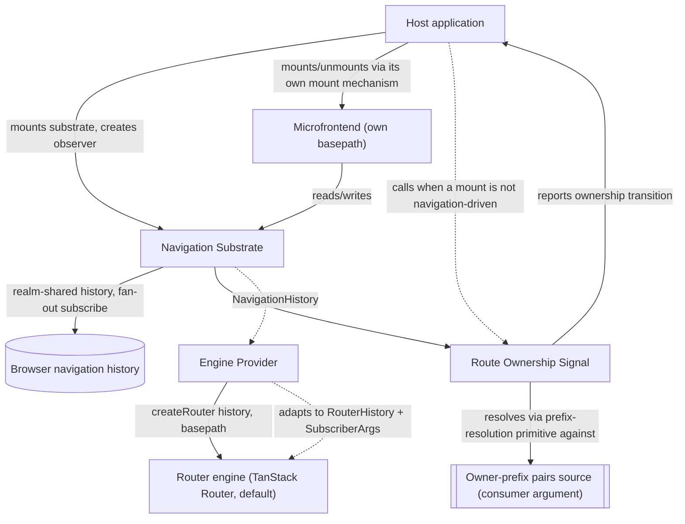
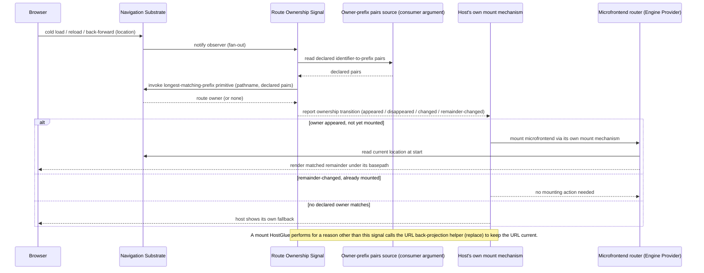

# Technical Design — Routing

- [ ] `p3` - **ID**: `cpt-frontx-routing-design-routing`

<!-- toc -->

- [1. Architecture Overview](#1-architecture-overview)
  - [1.1 Architectural Vision](#11-architectural-vision)
  - [1.2 Architecture Drivers](#12-architecture-drivers)
  - [1.3 Architecture Layers](#13-architecture-layers)
- [2. Principles & Constraints](#2-principles--constraints)
  - [2.1 Design Principles](#21-design-principles)
  - [2.2 Constraints](#22-constraints)
- [3. Technical Architecture](#3-technical-architecture)
  - [3.1 Domain Model](#31-domain-model)
  - [3.2 Component Model](#32-component-model)
  - [3.3 API Contracts](#33-api-contracts)
  - [3.4 Internal Dependencies](#34-internal-dependencies)
  - [3.5 External Dependencies](#35-external-dependencies)
  - [3.6 Interactions & Sequences](#36-interactions--sequences)
  - [3.7 Database schemas & tables](#37-database-schemas--tables)
- [4. Additional context](#4-additional-context)
- [5. Traceability](#5-traceability)

<!-- /toc -->

## 1. Architecture Overview

### 1.1 Architectural Vision

`@gears-frontx/routing` follows the same shape the ecosystem already uses to keep a core agnostic of a concrete external specification: an opaque substrate port with an injected, swappable concrete provider behind it — the pattern recorded for the runtime's type system in `cpt-frontx-adr-runtime-type-system-coupling` and `cpt-frontx-adr-default-type-substrate-provider`. Here the substrate is navigation rather than type validation, and the provider is a router engine rather than a type-definition specification, but the shape is the same: the navigation substrate never depends on a concrete engine, an injected engine provider satisfies the substrate's own history contract, and the default provider — the only one this package ships — binds that contract to TanStack Router.

Throughout this package's own artifacts, *navigation substrate* names the agnostic core component alone, described next; the published package `@gears-frontx/routing` is that core plus the Engine Provider and Route Ownership Signal described after it. (The root DESIGN and ADR 0002 use the same term at package granularity, naming the whole published library — a broader use than this document's own; see root DESIGN §1.3.)

Three components carry this. The Navigation Substrate is the framework-agnostic core: a single navigation history realm-shared between the host and every independently bundled microfrontend, one real subscription to the browser's history fanned out to every listener, and the `basepath` contract a scoped router is built against. That fan-out has two triggers, not one: a browser-history change reaching the one underlying subscription, and the substrate's own `push`/`replace` calls dispatching the same fan-out directly — because a call made through `pushState`/`replaceState` raises no `popstate` event, the browser-history subscription alone would never see a navigation the substrate performed itself. A `go` call is different: moving through history does raise `popstate`, but only asynchronously, so `go` is observed through the same underlying browser-history subscription as a back/forward step rather than dispatched directly at the call site. A routing table is an opaque value to this core, exactly as a type schema is opaque to the runtime it validates against — the substrate carries it but never inspects it. The substrate's own contract, `NavigationHistory` (`location`, `subscribe`, `push`, `replace`, `go`), is deliberately narrower than the `RouterHistory` contract a concrete engine expects. The Engine Provider is the swappable adapter that builds that difference — deriving `back`/`forward` from `go(-1)`/`go(1)`, adding `canGoBack`, `createHref`, `block`, `flush`, `destroy`, `notify`, `length`, and `subscribers`, and translating the `NavigationHistory` subscriber notification into the `SubscriberArgs` shape (`location`, `action`) `RouterHistory`'s `subscribe` callback expects — before calling `createRouter({ routeTree, history, basepath })`; replacing the adapter is scoped to one microfrontend's own route tree and search-parameter handling and reaches no further. Route Ownership Signal publishes, rather than enforces, the relationship between the URL and which route owner it names: it exposes the navigation substrate's longest-matching-prefix primitive as its own public entry point, lets a consumer create an observer — passing its own owner-prefix pairs source as a plain argument, never an injected port — that reports every ownership-relevant transition (an owner appearing, disappearing, changing, or its remainder changing), and provides a URL back-projection helper the consumer calls after a mount triggered by something other than navigation, reflecting the mounted owner's declared prefix back into the URL with a history `replace`, never a `push` — at the cost, examined in §4, of making the history entry the user was previously on unreachable by a back step. Mounting and unmounting themselves, and the two-way agreement between the URL and what is actually mounted, are the consumer's own guarantee, built on top of this signal (§3.2, Route Ownership Signal; PRD §11) — this package never orchestrates them, so it stays agnostic of whatever occupancy model the consumer's own mount mechanism uses (`cpt-frontx-principle-agnostic-core`).

The library owns exactly one of the ecosystem's three host–microfrontend communication channels. Addressed action dispatch — a command to a specific target, executed through an actions-chains mediator — and shared-property broadcast — declared-interest state distributed to whoever is listening — are both owned by the runtime that provides them; this library neither duplicates nor mediates either one. It owns the URL channel alone: what the address bar reads, and what a navigation does to it.

Visibility follows the same boundary. A microfrontend's own router owns only the subtree beneath its assigned `basepath`; nothing in its own routing table can navigate it outside that subtree. Leaving the subtree happens through an imperative call against the shared navigation substrate with an absolute path, through an ordinary link whose `href` is itself an absolute path outside the prefix, or through an addressed action to the host over the actions-chains channel — never through a route inside the microfrontend's own tree pointing outside its prefix. The prefix is the microfrontend's namespace: an extension declares it in its own manifest, and the host assigns that declared prefix to the microfrontend's router when it mounts it into a composed application. Prefix nesting is legal and resolved by longest match (§3.2, Route Ownership Signal); a prefix conflict — two route owners declaring the identical prefix — is caught when the host registers its route owners, not at navigation time.

### 1.2 Architecture Drivers

#### Functional Drivers

The package's requirements are owned by its own [PRD](./PRD.md).

| Requirement | Design Response |
|-------------|------------------|
| `cpt-frontx-routing-fr-single-navigation-substrate` | The Navigation Substrate holds the shared history behind a well-known realm-global, fanning out one browser-history subscription to every subscriber (`cpt-frontx-component-routing-navigation-substrate`). |
| `cpt-frontx-routing-fr-engine-provider-port` | The Engine Provider is the only component that hands the shared history to a concrete engine, satisfied by the default TanStack Router adapter and substitutable per microfrontend without reaching the substrate, the host, or a sibling (`cpt-frontx-component-routing-engine-provider`, `cpt-frontx-routing-principle-engine-behind-port`). |
| `cpt-frontx-routing-fr-scoped-navigation-zone` | A microfrontend's router is constructed with `basepath` equal to its declared prefix; its routing table matches only what lies beneath it, and leaving requires an imperative substrate call or an addressed action (`cpt-frontx-component-routing-screen-binding`). |
| `cpt-frontx-routing-fr-route-ownership-signal` | The Route Ownership Signal component exposes the owner-resolution primitive and an observable owner-change signal, plus a URL back-projection helper the consumer calls after a non-navigation-driven mount; the consumer's own mount mechanism does the actual mounting, and the two-way agreement between the URL and what is mounted is the consumer's own guarantee, built on this signal (`cpt-frontx-component-routing-screen-binding`, `cpt-frontx-routing-seq-deep-link-cold-mount`). |
| `cpt-frontx-routing-fr-standalone-deployment` | The Route Ownership Signal component requires no observer to exist; a standalone deployment simply never creates one, so it runs the substrate and the engine provider on the same code path with a deployment-supplied `basepath` and no signal participation (`cpt-frontx-component-routing-screen-binding`). |
| `cpt-frontx-routing-fr-imperative-navigation` | The Navigation Substrate exposes `push`/`replace`/`go`/`location`/`subscribe` directly, independent of any mounted router or component tree (`cpt-frontx-component-routing-navigation-substrate`). |
| `cpt-frontx-routing-fr-location-preserving-helpers` | The Engine Provider ships a redirect/navigation helper that carries the current location's search and hash onto a target path, generalized from index-route redirects to any consumer redirect (`cpt-frontx-component-routing-engine-provider`, `cpt-frontx-algo-routing-engine-provider-index-redirect`). |

#### NFR Allocation

| NFR ID | NFR Summary | Allocated To | Design Response | Verification Approach |
|--------|-------------|--------------|-----------------|------------------------|
| `cpt-frontx-routing-nfr-standalone` | No intra-ecosystem import; route-owner and mount coupling via injected ports | The published package | The manifest declares no intra-ecosystem dependency; route ownership and mount execution reach the package only through the host-injected provider and executor ports, never through an import of the runtime that manages them (`cpt-frontx-constraint-routing-no-intra-ecosystem-dependency`). | The boundary guards (`arch:edges`, `arch:deps`) hold the manifest and the import graph to the declared standalone property. |
| `cpt-frontx-routing-nfr-agnostic-core` | Navigation substrate carries no router-engine or UI-framework dependency | The Navigation Substrate component | The substrate's own module imports no router engine and no UI-framework rendering primitive; every engine-specific import lives in the Engine Provider component alone, behind the engine port (`cpt-frontx-constraint-routing-no-engine-leak`, `cpt-frontx-routing-principle-engine-behind-port`). | The boundary guards confirm the substrate module's import graph carries no engine or UI-framework edge. |

This member records its decisions here rather than in a decision record of its own. Two existing records were amended where this member changes their picture: `cpt-frontx-adr-core-package-boundaries` states that the core partition covers the UI-framework-agnostic subset and that a member bound to a concrete engine introduces its own bounded concern carrying the two constraints in §2.2; `cpt-frontx-adr-extension-domain-occupancy` states that domain occupancy gains a URL projection and that a navigation act enters the mount mechanism that record already governs. The port-and-provider pattern this design applies is the one accepted in `cpt-frontx-adr-runtime-type-system-coupling` and `cpt-frontx-adr-default-type-substrate-provider`, cited as precedent.

### 1.3 Architecture Layers

- [ ] `p3` - **ID**: `cpt-frontx-routing-tech-routing-stack`

| Layer | Responsibility | Technology |
|-------|---------------|------------|
| Navigation substrate | Realm-shared navigation history, fan-out subscription, `basepath` contract, imperative navigation surface | TypeScript, framework-agnostic, no router-engine or UI-framework dependency |
| Engine provider | Adapts the shared history to a concrete router engine via `createRouter({ routeTree, history, basepath })`; the only component permitted an engine import | TypeScript over `@tanstack/react-router` (React, the default's UI framework) and `@tanstack/history` (default); substitutable per microfrontend |
| Route ownership signal | Exposes the substrate's longest-matching-prefix primitive as a public entry point, publishes an observable signal of every ownership-relevant transition, and provides a URL back-projection helper the consumer calls after a non-navigation-driven mount | TypeScript over a consumer-supplied owner-prefix pairs source (plain argument, no port) |

## 2. Principles & Constraints

### 2.1 Design Principles

#### Single History Authority

- [ ] `p2` - **ID**: `cpt-frontx-routing-principle-single-history-authority`

Exactly one navigation-history instance answers for a realm; no unit — host or microfrontend — constructs its own. Every unit that needs to read or write navigation state reaches the one realm-shared instance instead, and every subscriber's fan-out traces back to the same single subscription against the browser's own history. This is what keeps independently bundled units from ever holding two divergent views of where the user currently is.

#### Engine Behind Port

- [ ] `p2` - **ID**: `cpt-frontx-routing-principle-engine-behind-port`

No component other than the engine provider itself ever imports a concrete router engine. The navigation substrate and the route ownership signal reach the shared history only through the substrate's own `NavigationHistory` contract — `location`, `subscribe`, `push`, `replace`, `go` — never through the engine-specific `RouterHistory` contract the Engine Provider builds on top of it. This is what lets a microfrontend swap its own engine provider without the substrate, the host, or a sibling microfrontend noticing that a swap occurred.

### 2.2 Constraints

#### ROUTING-1 — No engine leak beyond the engine provider

- [ ] `p2` - **ID**: `cpt-frontx-constraint-routing-no-engine-leak`

No component of `@gears-frontx/routing` other than the engine-provider component imports a concrete router engine or its packages directly — concretely, no module outside the engine-provider component imports `@tanstack/react-router` or `@tanstack/history`. Consumers of the navigation substrate and of the route ownership signal interact only with the substrate's own `NavigationHistory` contract (`location`, `subscribe`, `push`, `replace`, `go`); the engine-provider component is the sole, deliberate exception, and the only place `@tanstack/react-router` or `@tanstack/history` may be imported, so a mechanical import-graph guard can name exactly those two packages.

**ADRs**: `cpt-frontx-adr-core-package-boundaries` — cited for the partition context this constraint sits outside of (that record's `More Information` states the core partition's scope excludes an engine-bound member like this one); it does not own this constraint, which this DESIGN defines and owns directly.

#### ROUTING-2 — No intra-ecosystem package dependency

- [ ] `p2` - **ID**: `cpt-frontx-constraint-routing-no-intra-ecosystem-dependency`

`@gears-frontx/routing` imports no other package in this ecosystem. Its coupling to whichever unit currently owns a URL prefix is expressed only through a consumer-supplied owner-prefix pairs source, passed as a plain argument; the execution of a mount is entirely the consumer's own responsibility, reached only through the observable signal this package publishes — never through an injected port, and never through a compile-time import of the runtime or any other ecosystem package that implements those concerns.

**ADRs**: `cpt-frontx-adr-core-package-boundaries` — cited for the partition context this constraint sits outside of; that record does not own this constraint, which this DESIGN defines and owns directly.

## 3. Technical Architecture

### 3.1 Domain Model

| Entity | Definition | Representation |
|--------|------------|-----------------|
| Navigation History | The realm-shared, single navigation-history instance every unit reads and writes; exposes the substrate's own `NavigationHistory` contract — `location`, `subscribe`, `push`, `replace`, `go`. The Engine Provider adapts this into the concrete engine's `RouterHistory` contract (§3.2 Engine Provider); the two contracts are not the same shape. | Realm-global-backed singleton — `@gears-frontx/routing` |
| Route Owner | The opaque identifier of whichever unit currently owns a declared URL prefix, paired with that prefix; supplied by the host as a plain argument to the route ownership signal's observer. | Identifier/prefix pair, host-supplied |
| Basepath | The URL path segment prefix a mounted microfrontend's own router is scoped to; passed to `createRouter({ routeTree, history, basepath })`. | String, engine-provider input |
| Route Ownership Resolution | The outcome of matching a pathname against declared prefixes by longest match, naming the route owner that pathname belongs to; exposed by this package as a thin entry point over the navigation substrate's own primitive, never re-implemented. | Resolver output — `@gears-frontx/routing` |

### 3.2 Component Model

#### Navigation Substrate

- [ ] `p2` - **ID**: `cpt-frontx-component-routing-navigation-substrate`

Concrete artifact: `@gears-frontx/routing` (core entry).

##### Why this component exists

Independently bundled units in the same realm need one navigation history to agree on, not one each. The Navigation Substrate is the framework-agnostic core that holds that single instance, fans out one browser-history subscription to every listener, and exposes imperative navigation outside any UI tree.

##### Responsibility scope

- Owns the single, realm-shared navigation-history instance and its fan-out subscription.
- Owns the `basepath` contract every scoped router is built against.
- Exposes `push`, `replace`, `go`, `location`, `subscribe` for use outside a mounted router.

##### Responsibility boundaries

- Carries no dependency on a concrete router engine or UI framework (`cpt-frontx-constraint-routing-no-engine-leak`, `cpt-frontx-routing-nfr-agnostic-core`).
- Treats a routing table as an opaque value it never inspects; route-tree shape belongs entirely to the engine provider and the microfrontend that builds it.
- Does not perform mounting, unmounting, or resolve which route owner is currently mounted; it owns the longest-matching-prefix primitive that names a route owner for a pathname (`cpt-frontx-algo-routing-navigation-substrate-prefix-resolution`) — Route Ownership Signal exposes that primitive as its own public entry point and builds its observable signal on top of it, rather than re-implementing it.

##### Related components (by ID)

- `cpt-frontx-component-routing-engine-provider` — consumes the substrate's shared history as its `RouterHistory` input.
- `cpt-frontx-component-routing-screen-binding` (Route Ownership Signal) — subscribes to the substrate's fan-out to compute and publish ownership-change transitions.

#### Engine Provider

- [ ] `p2` - **ID**: `cpt-frontx-component-routing-engine-provider`

Concrete artifact: `@gears-frontx/routing` (engine-provider entry; default TanStack Router adapter).

##### Why this component exists

A router engine renders routes and matches search parameters, and engines evolve on their own cadence. The Engine Provider is the sole adapter that hands the substrate's shared history to a concrete engine, so the choice of engine is a per-microfrontend decision rather than a substrate-wide one.

##### Responsibility scope

- Adapts the substrate's `NavigationHistory` into the concrete engine's `RouterHistory` input — filling in the members `NavigationHistory` does not provide (`back`, `forward`, `canGoBack`, `createHref`, `block`, `flush`, `destroy`, `notify`, `length`, `subscribers`) and translating `NavigationHistory`'s own subscriber notification into the `SubscriberArgs` shape (`location`, `action`) the engine's `subscribe` callback expects — then calls `createRouter({ routeTree, history, basepath })` for the default provider.
- Owns the concrete engine dependency: `@tanstack/react-router` and `@tanstack/history` for the default provider.
- Unsubscribes the constructed router from the shared history when the microfrontend that owns it unmounts, so a torn-down router's callback stops receiving the fan-out.

##### Responsibility boundaries

- Is the only component permitted to import a concrete router engine (`cpt-frontx-constraint-routing-no-engine-leak`).
- Its replacement is scoped to one microfrontend's own route tree and search-parameter handling; it does not reach the substrate, the `basepath` contract, the host, or a sibling microfrontend (`cpt-frontx-routing-fr-engine-provider-port`).
- Does not resolve which route owner a URL belongs to; it only renders once a microfrontend using it is already mounted.

##### Related components (by ID)

- `cpt-frontx-component-routing-navigation-substrate` — supplies the `NavigationHistory` this component adapts into `RouterHistory`.

#### Route Ownership Signal

- [ ] `p2` - **ID**: `cpt-frontx-component-routing-screen-binding`

Concrete artifact: `@gears-frontx/routing` (screen-binding entry).

##### Why this component exists

A consumer's own mount mechanism needs to know, from the URL alone, which declared route owner a pathname belongs to and when that resolution changes — without this package holding any opinion about how mounting, unmounting, or occupancy cardinality actually work. Route Ownership Signal is the component that exposes that resolution and publishes its changes as an observable signal, leaving mounting entirely to the consumer.

##### Responsibility scope

- Exposes the navigation substrate's longest-matching-prefix primitive as this package's own public owner-resolution entry point, without re-implementing the matching itself.
- Lets a consumer create an observer, passing its own owner-prefix pairs source as a plain argument — never an injected port — that reports an ownership-change transition (appeared, disappeared, changed, or remainder-changed) on creation and on every subsequent ownership-relevant navigation.
- Provides a URL back-projection helper the consumer calls to reflect a mount that happened for a reason other than navigation back into the URL, using a history `replace`.

##### Responsibility boundaries

- Does not maintain a registry of route owners; the consumer supplies the current set of declared pairs itself, as a plain argument, not through an injected port.
- Does not execute a mount or an unmount itself, and does not resolve a race between two mounts competing for the same placement; both are the consumer's own mount mechanism's responsibility (`cpt-frontx-feature-routing-route-ownership-signal` §1.4, Binding obligation).
- Does not participate in the addressed-action or shared-property channels; it reads only the URL channel.
- Carries no notion of exclusive versus concurrent occupancy, and no state machine tracking which owner currently occupies a placement; that occupancy model belongs entirely to whichever mount mechanism the consumer already runs — for this ecosystem's own host, the `mfes` runtime's mount strategies and cardinality matrix (`cpt-frontx-adr-extension-domain-occupancy`) — per `cpt-frontx-principle-agnostic-core`.
- Requires no host-injected port at all; a consumer that never creates the observer simply never participates in this component's signal, with no misconfigured state to detect or diagnose.

##### Related components (by ID)

- `cpt-frontx-component-routing-navigation-substrate` — supplies the history and the prefix-resolution primitive this component exposes and subscribes to.

### 3.3 API Contracts

- [ ] `p2` - **ID**: `cpt-frontx-routing-interface-package-entry`

- **Contracts**: `createRouter`, `RouterProvider`, `useNavigate`, `useParams`, `useSearch`, `useRouterState`, `Link`, `Outlet`, `redirect`, `notFound`, a location-preserving navigation helper; the substrate's own `NavigationHistory` contract (`location`, `subscribe`, `push`, `replace`, `go`); the `RouterHistory` contract the Engine Provider adapts `NavigationHistory` into; the `basepath` contract; the consumer-supplied owner-prefix pairs source and the route ownership signal's transition shape (field-level shapes owned by the route-ownership-signal FEATURE); the engine-provider port a replacement provider must satisfy.
- **Technology**: TypeScript library API, with a dedicated engine-provider entry point separate from the core, so a consumer that needs only the navigation substrate need not import the default engine.
- **Location**: Two entry points, neither authored yet — no source exists for this package. The core entry (e.g. `src/index.ts`) carries the navigation substrate's and the route ownership signal's contracts. A separate engine-provider entry (e.g. `src/engine-provider/index.ts`) carries the default TanStack Router adapter's contract alone, so a consumer of the core entry is not forced to import the default engine transitively.

| Public surface | Purpose |
|----------------|---------|
| `createRouter({ routeTree, history, basepath })` | Builds the default engine's router instance bound to the shared history and scoped to a `basepath`. |
| `RouterProvider` | Mounts the built router into the microfrontend's own component tree. |
| `useNavigate`, `useParams`, `useSearch`, `useRouterState` | Component-tree hooks against the mounted router's state and navigation. |
| `Link`, `Outlet` | Declarative navigation and nested-route rendering components. |
| `redirect`, `notFound` | Route-resolution helpers for redirect and not-found outcomes. |
| Location-preserving navigation helper | Carries the current location's search and hash onto a target path for any consumer redirect or imperative navigation (`cpt-frontx-routing-fr-location-preserving-helpers`). |
| `NavigationHistory` contract | The shape the shared navigation history itself exposes: `location`, `subscribe(cb)`, `push`, `replace`, `go`. The substrate's own notification payload is internal to this contract; constructing the `SubscriberArgs` an engine's `subscribe` callback expects is the Engine Provider's job, not this contract's. |
| `RouterHistory` contract (engine-provider component only) | The engine's own history contract (`@tanstack/history`). The Engine Provider builds this from `NavigationHistory`, adding `back`, `forward`, `canGoBack`, `createHref`, `block`, `flush`, `destroy`, `notify`, `length`, `subscribers`, and translating the substrate's subscriber notification into the `SubscriberArgs` shape (`location`, `action`) this contract's `subscribe` callback expects. |
| `basepath` | The prefix contract a scoped router is built against. |
| Engine-provider port | The contract a replacement engine provider must satisfy to receive the shared history; field-level shape owned by the engine-provider FEATURE. |
| Owner-prefix pairs source | A plain argument (never an injected port) supplying identifier-to-declared-prefix pairs the owner-resolution primitive matches against; field-level shape owned by the route-ownership-signal FEATURE. |
| Ownership-change transition | The observable notification the route ownership signal delivers to a consumer-registered callback on creation and on every ownership-relevant navigation — appeared, disappeared, changed, or remainder-changed. Mounting itself stays entirely the consumer's own responsibility; this package only signals. Field-level shape owned by the route-ownership-signal FEATURE. |
| URL back-projection helper | The helper a consumer calls to reflect a mount not driven by navigation back into the URL via a history `replace`. Field-level shape owned by the route-ownership-signal FEATURE. |

### 3.4 Internal Dependencies

None. The package imports no other package in this ecosystem — the standalone property this member claims under the layer's membership rules (root DESIGN §1.3), held to the cross-member dependency policy of root DESIGN §3.4. Its coupling to route ownership and to mount execution is expressed through host-injected ports (`cpt-frontx-constraint-routing-no-intra-ecosystem-dependency`), not through a package import.

**Dependency Rules** (per project conventions):
- No circular dependencies at the design level: no other ecosystem package depends on this package, and this package depends on none.
- No import of template territory.
- The navigation substrate carries no UI-framework import; any UI-framework or engine import is confined to the engine-provider component.

### 3.5 External Dependencies

#### Router engine (default provider only)

| Dependency Module | Interface Used | Purpose |
|-------------------|-----------------|---------|
| `@tanstack/react-router` | `createRouter`, `RouterProvider`, `useNavigate`, `useParams`, `useSearch`, `useRouterState`, `Link`, `Outlet`, `redirect`, `notFound` | The default concrete router engine's React binding — the exact framework-specific package the default engine provider adapts `NavigationHistory` for. The default provider's UI framework is React; a provider bound to a different UI framework is a different, non-default provider this package does not ship. |
| `@tanstack/history` | `RouterHistory` contract | The framework-independent history contract the Engine Provider adapts the shared `NavigationHistory` into for the default engine provider. |

**Engine contract ownership**: the `RouterHistory` member list and the `SubscriberArgs` callback shape are the engine's own contract, not this package's. The Engine Provider adapts `NavigationHistory` to whatever that contract requires at the time it is built, and a change to it is a change to the provider alone — the navigation substrate, its `NavigationHistory` contract, and every consumer of it are unaffected, which is the isolation the engine port exists to give.

**Dependency Rules** (per project conventions):
- `@tanstack/react-router` and `@tanstack/history` are dependencies of the engine-provider component only; the navigation substrate's own module carries no import of either.
- The default engine provider is replaceable per microfrontend; a consumer supplying a different provider is not required to depend on TanStack Router at all.

### 3.6 Interactions & Sequences

#### Deep Link Resolves Through A Cold Mount

- [ ] `p3` - **ID**: `cpt-frontx-routing-seq-deep-link-cold-mount`

**Use cases**: `cpt-frontx-routing-usecase-deep-link-to-microfrontend-screen`

**Actors**: `cpt-frontx-routing-actor-application-developer`

**Description**: The primary flow this package participates in. Route Ownership Signal resolves the pathname and reports the transition; everything after that — mounting, unmounting, and showing a fallback — is the host's own mount mechanism acting on the report, not this package's own orchestration. A freshly mounted microfrontend's router reads the already-current location from the shared history at start, so no blank screen appears between mount and first render.

### 3.7 Database schemas & tables

Not applicable. The package holds no database and no durable persistence; the shared navigation history lives in memory on the realm global for the lifetime of the page.

## 4. Additional context

The library's central design tension is keeping the navigation substrate agnostic of any router engine while still shipping a ready-to-use default: the same tension the type-substrate port resolves for the runtime by keeping the concrete GTS dependency confined to `@gears-frontx/gts-plugin`. Here both the agnostic substrate and its default provider live in the same package, so the engine-behind-port constraint — not a separate package boundary — is what keeps the default provider's `@tanstack/react-router` dependency from reaching the substrate itself.

Recorded failure modes:

- **Deep link into a not-yet-mounted microfrontend.** Mounting is asynchronous; the freshly mounted router reads the current location from the shared history at start, so no blank screen appears while mounting completes.
- **Multiple independently bundled copies of this package.** Programmatic navigation changes the address through the browser's history API without emitting the event a separate history instance listens for, so a copy holding its own history observes nothing; without a single shared history, routers in different copies drift out of agreement with each other and with the URL. The realm-shared instance is what prevents this by construction. The realm-global well-known key carries the `NavigationHistory` contract's version (`cpt-frontx-algo-routing-navigation-substrate-singleton-resolution`); a copy built against an incompatible contract version resolves under its own versioned key and constructs its own instance rather than silently capturing and reusing one it cannot actually satisfy.
- **A navigation performed through the substrate's own `push`/`replace`.** This never relies on the browser's `popstate` event, which a same-instance `pushState`/`replaceState` call never raises — the substrate's fan-out dispatch is triggered directly by the call itself. The one underlying browser-history subscription exists to cover navigation the substrate did not itself perform, or performs but does not control the timing of: back/forward, a `go` call issued through this instance (a history move raises `popstate` only asynchronously, so dispatching `go` directly at the call site would notify subscribers before `location` reflects the browser's actual post-move state — `go` is therefore observed through this same subscription, exactly like back/forward, rather than dispatched directly), and any third-party call to the browser's own history API.
- **Third-party code mutates the browser's history behind the substrate's back.** A page-level script calling the browser's history API directly, bypassing the shared instance, leaves the substrate's `location` stale and its fan-out silent for that change — no code path notifies the substrate a navigation happened. This is an environmental condition the library does not prevent (PRD §3.1), not a supported way to navigate.
- **Unmounting a microfrontend without unsubscribing its router.** If the Engine Provider does not unsubscribe the constructed router from the shared history at teardown, the unmounted router's callback keeps receiving the fan-out for a component tree that no longer exists. The Engine Provider's teardown responsibility (§3.2, route-ownership-signal and engine-provider FEATUREs) is what prevents this.
- **Unsubscribing, or navigating, from inside a fan-out callback.** Each dispatch round iterates a snapshot of the subscriber set taken when the round starts, so a callback that unsubscribes mid-round does not corrupt the iteration; a callback that triggers a new navigation has that navigation dispatched as its own, later round rather than folded into the round already in progress (`cpt-frontx-algo-routing-navigation-substrate-fanout-dispatch`).
- **A path matches no declared prefix.** Composed: Route Ownership Signal reports "no owner" (or an owner disappearing), and the host's own mount mechanism shows its own fallback and mounts nothing — this package takes no fallback action itself. Standalone: the microfrontend's own engine resolves to its own `notFound` route inside its own route tree, because no route-ownership-signal observer participates at all. The user-visible outcome — a not-found screen — is the same in both modes, but the mechanism differs: one is a host-level fallback acting on the signal, the other is the engine's own routing result.
- **The URL moves outside a mounted owner's declared prefix, including under prefix nesting.** Route Ownership Signal reports only the single winning resolution — the longest-match owner, or none — for the current pathname; it holds no notion of how many previously mounted occupants that implies unmounting. Deciding that, including under legal nesting (an owner declared at `/a` and another at `/a/b`), is the consumer's own mount mechanism's responsibility, using whatever occupancy model it already runs — the `mfes` runtime's cardinality matrix, for this ecosystem's own host (`cpt-frontx-adr-extension-domain-occupancy`).
- **A `replace` reflection via the URL back-projection helper.** `replace` overwrites the history entry the user was previously on: that entry becomes unreachable by a back step, and any sub-path deeper than the reflected owner's prefix that entry held is discarded with it. This is the accepted cost of treating the URL as authoritative — not an oversight — because the alternative, `push`, would let a mount the user did not navigate to create an entry the user has to step back through (`cpt-frontx-algo-routing-route-ownership-signal-url-back-projection`).
- **A redirect from an index route, or any other consumer redirect.** The location-preserving navigation helper (`cpt-frontx-routing-fr-location-preserving-helpers`) carries the current location's search and hash onto the target path, so they survive rather than being dropped; the helper is reusable by any consumer redirect, not knowledge specific to one application's index route.
- **Standalone deployment of a single microfrontend.** With no observer created, the route ownership signal simply is not used, and the `basepath` comes from the deployment rather than from a host — empty when served at a root, or the sub-path the deployment publishes under. The substrate and the engine provider run unchanged. Two obligations fall on the deployment rather than on this package: its server must answer every path beneath the `basepath` with the entry document, or a deep link fails before this library runs; and the asset base URL of the build is configured independently of the router's `basepath`, since neither derives from the other.

## 5. Traceability

- **Features**: [features/navigation-substrate/FEATURE.md](./features/navigation-substrate/FEATURE.md) (`cpt-frontx-feature-routing-navigation-substrate`), [features/route-ownership-signal/FEATURE.md](./features/route-ownership-signal/FEATURE.md) (`cpt-frontx-feature-routing-route-ownership-signal`), [features/engine-provider/FEATURE.md](./features/engine-provider/FEATURE.md) (`cpt-frontx-feature-routing-engine-provider`)
- **Root chain**: [PRD](../../../architecture/PRD.md), [DESIGN](../../../architecture/DESIGN.md), [DECOMPOSITION](../../../architecture/DECOMPOSITION.md)

This package's requirements are owned by its own [PRD](./PRD.md), per the 3-layer model: each member explains its own requirements, and the root PRD describes the layers and the requirements binding every member equally.
