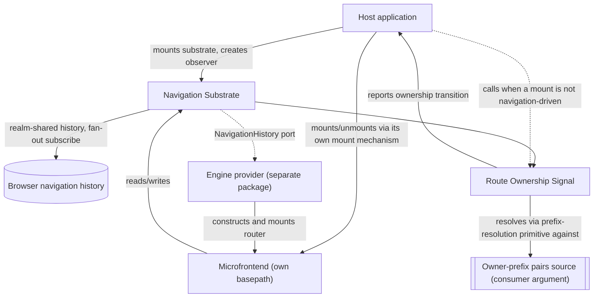
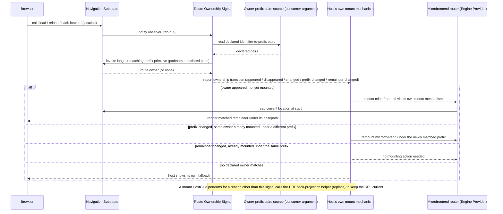

# Technical Design — Routing

- [ ] `p3` - **ID**: `cpt-frontx-routing-design-routing`

<!-- toc -->

- [1. Architecture Overview](#1-architecture-overview)
  - [1.1 Architectural Vision](#11-architectural-vision)
  - [1.2 Architecture Drivers](#12-architecture-drivers)
  - [1.3 Architecture Layers](#13-architecture-layers)
- [2. Principles & Constraints](#2-principles--constraints)
  - [2.1 Design Principles](#21-design-principles)
  - [2.2 Constraints](#22-constraints)
- [3. Technical Architecture](#3-technical-architecture)
  - [3.1 Domain Model](#31-domain-model)
  - [3.2 Component Model](#32-component-model)
  - [3.3 API Contracts](#33-api-contracts)
  - [3.4 Internal Dependencies](#34-internal-dependencies)
  - [3.5 External Dependencies](#35-external-dependencies)
  - [3.6 Interactions & Sequences](#36-interactions--sequences)
  - [3.7 Database schemas & tables](#37-database-schemas--tables)
- [4. Additional context](#4-additional-context)
- [5. Traceability](#5-traceability)

<!-- /toc -->

## 1. Architecture Overview

### 1.1 Architectural Vision

`@gears-frontx/routing` keeps an agnostic navigation core behind an opaque substrate port, with the concrete router engine supplied by a separately published provider package. The navigation substrate never depends on a concrete engine, and a separately published engine-provider package satisfies the substrate's own history contract; the ecosystem provides a default implementation of it.

Throughout this package's own artifacts, *navigation substrate* names the agnostic core component alone, described next; the published package `@gears-frontx/routing` is that core plus the Route Ownership Signal described after it. An engine provider is never part of this package — it is a distinct published member that depends on this one, never the reverse. (The root DESIGN and ADR 0002 use the term *navigation substrate* at package granularity, naming the whole published library — a broader use than this document's own; see root DESIGN §1.3.)

Two components carry this. The Navigation Substrate is the framework-agnostic core: a single navigation history realm-shared between the host and every independently bundled microfrontend, one real subscription to the browser's history fanned out to every listener, and the `basepath` contract a scoped router is built against. That fan-out has two triggers, not one: a browser-history change reaching the one underlying subscription, and the substrate's own `push`/`replace` calls dispatching the same fan-out directly — because a call made through `pushState`/`replaceState` raises no `popstate` event, the browser-history subscription alone would never see a navigation the substrate performed itself. A `go` call is different: moving through history does raise `popstate`, but only asynchronously, so `go` is observed through the same underlying browser-history subscription as a back/forward step rather than dispatched directly at the call site. A routing table is an opaque value to this core, exactly as a type schema is opaque to the runtime it validates against — the substrate carries it but never inspects it. The substrate's own contract, `NavigationHistory` (`location`, `subscribe`, `push`, `replace`, `go`), is deliberately narrower than what any concrete engine's own history contract typically requires — the engine-provider port (`cpt-frontx-routing-fr-engine-provider-port`) states only what a provider **MUST** accept from the substrate and that it is responsible for producing a constructed, mounted router; it names no concrete engine, and this package derives nothing about how a provider bridges that gap. How a provider actually builds that bridge — which members it must derive beyond the substrate's five, and how it adapts the substrate's own subscriber notification into whatever shape its own engine expects — is that provider's own DESIGN's concern, never this one's. Route Ownership Signal publishes, rather than enforces, the relationship between the URL and which route owner it names: it exposes the navigation substrate's longest-matching-prefix primitive as its own public entry point, lets a consumer create an observer — passing its own owner-prefix pairs source as a plain argument, never an injected port — that reports every ownership-relevant transition (an owner appearing, disappearing, changing, or its remainder changing), and provides a URL back-projection helper the consumer calls after a mount triggered by something other than navigation, reflecting the mounted owner's declared prefix back into the URL with a history `replace`, never a `push` — at the cost, examined in §4, of making the history entry the user was previously on unreachable by a back step. Mounting and unmounting themselves, and the two-way agreement between the URL and what is actually mounted, are the consumer's own guarantee, built on top of this signal (§3.2, Route Ownership Signal; PRD §11) — this package never orchestrates them, so it stays agnostic of whatever occupancy model the consumer's own mount mechanism uses (`cpt-frontx-routing-principle-publishes-not-orchestrates`).

The library owns exactly one of the ecosystem's three host–microfrontend communication channels. Addressed action dispatch — a command to a specific target, executed through an actions-chains mediator — and shared-property broadcast — declared-interest state distributed to whoever is listening — are both owned by the runtime that provides them; this library neither duplicates nor mediates either one. It owns the URL channel alone: what the address bar reads, and what a navigation does to it.

Visibility follows the same boundary. A microfrontend's own router owns only the subtree beneath its assigned `basepath`; nothing in its own routing table can navigate it outside that subtree. Leaving the subtree happens through an imperative call against the shared navigation substrate with an absolute path, through an ordinary link whose `href` is itself an absolute path outside the prefix, or through an addressed action to the host over the actions-chains channel — never through a route inside the microfrontend's own tree pointing outside its prefix. The prefix is the microfrontend's namespace: an extension declares it in its own manifest, and the host assigns that declared prefix to the microfrontend's router when it mounts it into a composed application. Prefix nesting is legal and resolved by longest match (§3.2, Route Ownership Signal); a prefix conflict — two route owners declaring the identical prefix — is caught when the host registers its route owners, not at navigation time.

### 1.2 Architecture Drivers

#### Functional Drivers

The package's requirements are owned by its own [PRD](./PRD.md).

| Requirement | Design Response |
|-------------|------------------|
| `cpt-frontx-routing-fr-single-navigation-substrate` | The Navigation Substrate holds the shared history behind a well-known realm-global, fanning out one browser-history subscription to every subscriber (`cpt-frontx-component-routing-navigation-substrate`). |
| `cpt-frontx-routing-fr-engine-provider-port` | The Navigation Substrate exposes `NavigationHistory` as the sole contract a router engine reaches the shared history through; no component of this package hands that history to a concrete engine, and no concrete engine dependency exists anywhere in this package's own module graph (`cpt-frontx-component-routing-navigation-substrate`, `cpt-frontx-routing-nfr-agnostic-core`). A separately published provider package — the ecosystem's own default — implements the port. |
| `cpt-frontx-routing-fr-route-ownership-signal` | The Route Ownership Signal component exposes the owner-resolution primitive and an observable owner-change signal, plus a URL back-projection helper the consumer calls after a non-navigation-driven mount; the consumer's own mount mechanism does the actual mounting, and the two-way agreement between the URL and what is mounted is the consumer's own guarantee, built on this signal (`cpt-frontx-component-routing-screen-binding`, `cpt-frontx-routing-seq-deep-link-cold-mount`). |
| `cpt-frontx-routing-fr-imperative-navigation` | The Navigation Substrate exposes `push`/`replace`/`go`/`location`/`subscribe` directly, independent of any mounted router or component tree (`cpt-frontx-component-routing-navigation-substrate`). |

#### NFR Allocation

| NFR ID | NFR Summary | Allocated To | Design Response | Verification Approach |
|--------|-------------|--------------|-----------------|------------------------|
| `cpt-frontx-routing-nfr-standalone` | No intra-ecosystem import; no call into the consumer at all | The published package | The manifest declares no intra-ecosystem dependency; route ownership reaches the package only through a consumer-supplied owner-prefix pairs source passed as a plain argument, and mount execution never reaches the package at all — the package only publishes a signal the consumer's own mount mechanism acts on (`cpt-frontx-constraint-routing-no-intra-ecosystem-dependency`). | The boundary guards (`arch:edges`, `arch:deps`) hold the manifest and the import graph to the declared standalone property. |
| `cpt-frontx-routing-nfr-agnostic-core` | Package carries no router-engine or UI-framework dependency whatsoever | The whole published package | No module of this package imports any router engine or any UI-framework rendering primitive; every engine-specific dependency lives in a separately published engine-provider package instead (`cpt-frontx-constraint-routing-no-engine-leak`). | The boundary guards confirm this package's own import graph carries no engine or UI-framework edge at all. |

This member records its decisions here rather than in a decision record of its own. Two existing records were amended where this member changes their picture: `cpt-frontx-adr-core-package-boundaries` states that the core partition covers the UI-framework-agnostic subset and that a member bound to a concrete engine introduces its own bounded concern, now carried by the separately published engine-provider package rather than by this one; `cpt-frontx-adr-extension-domain-occupancy` states that domain occupancy gains a URL projection and that a navigation act enters the mount mechanism that record already governs.

### 1.3 Architecture Layers

- [ ] `p3` - **ID**: `cpt-frontx-routing-tech-routing-stack`

| Layer | Responsibility | Technology |
|-------|---------------|------------|
| Navigation substrate | Realm-shared navigation history, fan-out subscription, `basepath` contract, imperative navigation surface | TypeScript, framework-agnostic, no router-engine or UI-framework dependency |
| Route ownership signal | Exposes the substrate's longest-matching-prefix primitive as a public entry point, publishes an observable signal of every ownership-relevant transition, and provides a URL back-projection helper the consumer calls after a non-navigation-driven mount | TypeScript over a consumer-supplied owner-prefix pairs source (plain argument, no port) |

The engine provider shown above is never part of this package; it is a distinct published member (the ecosystem provides a default) that depends on the navigation substrate's `NavigationHistory` contract and is substitutable by any conforming provider — the technology and component detail for that provider belongs entirely to its own DESIGN, not to this one.

## 2. Principles & Constraints

### 2.1 Design Principles

#### Single History Authority

- [ ] `p2` - **ID**: `cpt-frontx-routing-principle-single-history-authority`

Exactly one navigation-history instance answers for a realm; no unit — host or microfrontend — constructs its own. Every unit that needs to read or write navigation state reaches the one realm-shared instance instead, and every subscriber's fan-out traces back to the same single subscription against the browser's own history. This is what keeps independently bundled units from ever holding two divergent views of where the user currently is.

#### Publishes, Does Not Orchestrate

- [ ] `p2` - **ID**: `cpt-frontx-routing-principle-publishes-not-orchestrates`

This package publishes the fact that a URL resolves to a declared route owner, and publishes when that fact changes; it does not reproduce, alongside that fact, any model of who is allowed to occupy a placement, how many occupants a placement may hold at once, or how a race between two competing mounts resolves. Reconciling the URL with what is actually mounted belongs to whichever mount mechanism already holds the registry of route owners, the domains they occupy, and the authority to resolve a race between two mounts — for this ecosystem's own host, the `mfes` runtime (`cpt-frontx-adr-extension-domain-occupancy`). This is a narrower, package-specific consequence of the runtime's own UI-framework-agnosticism principle (`cpt-frontx-principle-agnostic-core`): that principle governs independence from a concrete UI framework and carries no view on domain occupancy one way or the other; this principle is what actually keeps this package from re-implementing a competing occupancy model of its own.

### 2.2 Constraints

#### ROUTING-1 — No engine import in the navigation substrate

- [ ] `p2` - **ID**: `cpt-frontx-constraint-routing-no-engine-leak`

`@gears-frontx/routing` contains no import of a concrete router engine or its packages, anywhere in the package — not merely outside a designated internal component, but absent from the package's own manifest and import graph entirely. Consumers of the navigation substrate and of the route ownership signal interact only with the substrate's own `NavigationHistory` contract (`location`, `subscribe`, `push`, `replace`, `go`); a concrete router engine is never a dependency of this package under any circumstance. The role of "the one place a router engine may be imported" belongs to whichever separately published engine-provider package a microfrontend depends on — enforced there by that provider's own sole-engine-import constraint — never to this package.

**ADRs**: `cpt-frontx-adr-core-package-boundaries` — cited for the partition context this constraint sits outside of (that record's `More Information` states the core partition's scope excludes an engine-bound member like this one); it does not own this constraint, which this DESIGN defines and owns directly.

#### ROUTING-2 — No intra-ecosystem package dependency

- [ ] `p2` - **ID**: `cpt-frontx-constraint-routing-no-intra-ecosystem-dependency`

`@gears-frontx/routing` imports no other package in this ecosystem. Its coupling to whichever unit currently owns a URL prefix is expressed only through a consumer-supplied owner-prefix pairs source, passed as a plain argument; the execution of a mount is entirely the consumer's own responsibility, reached only through the observable signal this package publishes — never through an injected port, and never through a compile-time import of the runtime or any other ecosystem package that implements those concerns.

**ADRs**: `cpt-frontx-adr-core-package-boundaries` — cited for the partition context this constraint sits outside of; that record does not own this constraint, which this DESIGN defines and owns directly.

## 3. Technical Architecture

### 3.1 Domain Model

| Entity | Definition | Representation |
|--------|------------|-----------------|
| Navigation History | The realm-shared, single navigation-history instance every unit reads and writes; exposes the substrate's own `NavigationHistory` contract — `location`, `subscribe`, `push`, `replace`, `go`. A separately published engine-provider package adapts this into whatever contract its own concrete engine expects; that adapted contract is not this package's concern. | Realm-global-backed singleton — `@gears-frontx/routing` |
| Route Owner | The opaque identifier of whichever unit currently owns a declared URL prefix, paired with that prefix; supplied by the host as a plain argument to the route ownership signal's observer. | Identifier/prefix pair, host-supplied |
| Basepath | The URL path segment prefix a mounted microfrontend's own router is scoped to; assigned by the host or supplied by the deployment, and consumed by whichever engine-provider package constructs the microfrontend's router. | String, provider input |
| Route Ownership Resolution | The outcome of matching a pathname against declared prefixes by longest match, naming the route owner that pathname belongs to; exposed by this package as a thin entry point over the navigation substrate's own primitive, never re-implemented. | Resolver output — `@gears-frontx/routing` |

### 3.2 Component Model

#### Navigation Substrate

- [ ] `p2` - **ID**: `cpt-frontx-component-routing-navigation-substrate`

Concrete artifact: `@gears-frontx/routing` (core entry).

##### Why this component exists

Independently bundled units in the same realm need one navigation history to agree on, not one each. The Navigation Substrate is the framework-agnostic core that holds that single instance, fans out one browser-history subscription to every listener, and exposes imperative navigation outside any UI tree.

##### Responsibility scope

- Owns the single, realm-shared navigation-history instance and its fan-out subscription.
- Owns the `basepath` contract every scoped router is built against.
- Exposes `push`, `replace`, `go`, `location`, `subscribe` for use outside a mounted router.

##### Responsibility boundaries

- Carries no dependency on any router engine or UI framework whatsoever (`cpt-frontx-constraint-routing-no-engine-leak`, `cpt-frontx-routing-nfr-agnostic-core`).
- Treats a routing table as an opaque value it never inspects; route-tree shape belongs entirely to whichever engine-provider package and microfrontend build it.
- Does not perform mounting, unmounting, or resolve which route owner is currently mounted; it owns the longest-matching-prefix primitive that names a route owner for a pathname (`cpt-frontx-algo-routing-navigation-substrate-prefix-resolution`) — Route Ownership Signal exposes that primitive as its own public entry point and builds its observable signal on top of it, rather than re-implementing it.

##### Related components (by ID)

- `cpt-frontx-component-routing-screen-binding` (Route Ownership Signal) — subscribes to the substrate's fan-out to compute and publish ownership-change transitions.
- `cpt-frontx-component-routing-engine-provider` — an external consumer of this component's `NavigationHistory` contract, owned by a separately published engine-provider package (the ecosystem's own default), not by this package.

#### Route Ownership Signal

- [ ] `p2` - **ID**: `cpt-frontx-component-routing-screen-binding`

Concrete artifact: `@gears-frontx/routing` (core entry).

##### Why this component exists

A consumer's own mount mechanism needs to know, from the URL alone, which declared route owner a pathname belongs to and when that resolution changes — without this package holding any opinion about how mounting, unmounting, or occupancy cardinality actually work. Route Ownership Signal is the component that exposes that resolution and publishes its changes as an observable signal, leaving mounting entirely to the consumer.

##### Responsibility scope

- Exposes the navigation substrate's longest-matching-prefix primitive as this package's own public owner-resolution entry point, without re-implementing the matching itself.
- Lets a consumer create an observer, passing its own owner-prefix pairs source as a plain argument — never an injected port — that reports an ownership-change transition (appeared, disappeared, changed, prefix-changed, or remainder-changed) on creation and on every subsequent ownership-relevant navigation.
- Provides a URL back-projection helper the consumer calls to reflect a mount that happened for a reason other than navigation back into the URL, using a history `replace`.

##### Responsibility boundaries

- Does not maintain a registry of route owners; the consumer supplies the current set of declared pairs itself, as a plain argument, not through an injected port.
- Does not execute a mount or an unmount itself, and does not resolve a race between two mounts competing for the same placement; both are the consumer's own mount mechanism's responsibility (`cpt-frontx-feature-routing-route-ownership-signal` §1.4, Binding obligation).
- Does not participate in the addressed-action or shared-property channels; it reads only the URL channel.
- Carries no notion of exclusive versus concurrent occupancy, and no state machine tracking which owner currently occupies a placement; that occupancy model belongs entirely to whichever mount mechanism the consumer already runs — for this ecosystem's own host, the `mfes` runtime's mount strategies and cardinality matrix (`cpt-frontx-adr-extension-domain-occupancy`) — per `cpt-frontx-routing-principle-publishes-not-orchestrates`.
- Requires nothing from the consumer beyond the plain-argument owner-prefix pairs source at observer creation, and no port at all; a consumer that never creates the observer simply never participates in this component's signal, with no misconfigured state to detect or diagnose.

##### Related components (by ID)

- `cpt-frontx-component-routing-navigation-substrate` — supplies the history and the prefix-resolution primitive this component exposes and subscribes to.

### 3.3 API Contracts

- [ ] `p2` - **ID**: `cpt-frontx-routing-interface-package-entry`

- **Contracts**: the substrate's own `NavigationHistory` contract (`location`, `subscribe`, `push`, `replace`, `go`); the `basepath` contract; the consumer-supplied owner-prefix pairs source and the route ownership signal's transition shape (field-level shapes owned by the route-ownership-signal FEATURE); the engine-provider port a provider package must satisfy — its concrete shape is stated abstractly here and owned in full by the engine-provider FEATURE that defines it (now published in the provider's own package tree).
- **Technology**: TypeScript library API, single entry point — this package carries no separate engine-provider entry, because it ships no engine provider of its own at all.
- **Location**: Not authored yet — no source exists for this package. The entry (e.g. `src/index.ts`) carries the navigation substrate's and the route ownership signal's contracts only.

| Public surface | Purpose |
|----------------|---------|
| `NavigationHistory` contract | The shape the shared navigation history itself exposes: `location`, `subscribe(cb)`, `push`, `replace`, `go`. The substrate's own notification payload is internal to this contract; adapting it into whatever shape a concrete engine's own `subscribe` callback expects is that engine-provider package's job, not this contract's. |
| `basepath` | The prefix contract a scoped router is built against. |
| Engine-provider port | The contract a provider package must satisfy to receive the shared history and produce a constructed, mounted router; field-level shape owned by the engine-provider FEATURE (published in the provider's own package). |
| Owner-prefix pairs source | A plain argument (never an injected port) supplying identifier-to-declared-prefix pairs the owner-resolution primitive matches against; field-level shape owned by the route-ownership-signal FEATURE. |
| Ownership-change transition | The observable notification the route ownership signal delivers to a consumer-registered callback on creation and on every ownership-relevant navigation — appeared, disappeared, changed, prefix-changed, or remainder-changed. Mounting itself stays entirely the consumer's own responsibility; this package only signals. Field-level shape owned by the route-ownership-signal FEATURE. |
| URL back-projection helper | The helper a consumer calls to reflect a mount not driven by navigation back into the URL via a history `replace`. Field-level shape owned by the route-ownership-signal FEATURE. |

### 3.4 Internal Dependencies

None. The package imports no other package in this ecosystem — the standalone property this member claims under the layer's membership rules (root DESIGN §1.3), held to the cross-member dependency policy of root DESIGN §3.4. Its coupling to route ownership is expressed through a consumer-supplied owner-prefix pairs source passed as a plain argument, and its coupling to mount execution through the observable signal this package publishes — never through an injected port and never through a package import (`cpt-frontx-constraint-routing-no-intra-ecosystem-dependency`). A separately published engine-provider package (the ecosystem's own default, `@gears-frontx/routing-tanstack`) depends on this package; the dependency runs one way only, and this package never depends back on any engine-provider package.

**Dependency Rules** (per project conventions):
- No circular dependencies at the design level: no other ecosystem package depends on this package, and this package depends on none.
- No import of template territory.
- No UI-framework import, and no router-engine import, anywhere in this package.

### 3.5 External Dependencies

None. This package carries no external dependency on any router engine, UI framework, or other third-party library beyond the browser's own navigation-history API (PRD §3.1, §10). Every router-engine dependency lives entirely in a separately published engine-provider package's own external dependency list.

### 3.6 Interactions & Sequences

#### Deep Link Resolves Through A Cold Mount

- [ ] `p3` - **ID**: `cpt-frontx-routing-seq-deep-link-cold-mount`

**Use cases**: `cpt-frontx-routing-usecase-deep-link-to-microfrontend-screen`

**Actors**: `cpt-frontx-routing-actor-application-developer`

**Description**: The primary flow this package participates in. Route Ownership Signal resolves the pathname and reports the transition; everything after that — mounting, unmounting, and showing a fallback — is the host's own mount mechanism acting on the report, not this package's own orchestration. A freshly mounted microfrontend's router reads the already-current location from the shared history at start, so no blank screen appears between mount and first render.

### 3.7 Database schemas & tables

Not applicable. The package holds no database and no durable persistence; the shared navigation history lives in memory on the realm global for the lifetime of the page.

## 4. Additional context

The library's central design tension is keeping the navigation substrate agnostic of any router engine while still letting a consumer reach a ready-to-use default. It is resolved by separation of artifacts: the agnostic substrate and its default provider live in *separate published packages* — this package and a separately published engine-provider package — so it is the package boundary itself, not an intra-package constraint, that keeps the default provider's own router-engine dependency from ever reaching this package.

Recorded failure modes:

- **Deep link into a not-yet-mounted microfrontend.** Mounting is asynchronous; the freshly mounted router reads the current location from the shared history at start, so no blank screen appears while mounting completes. Reading the current location at start is an obligation on whichever engine-provider package constructs that router, not on this package.
- **Multiple independently bundled copies of this package.** Programmatic navigation changes the address through the browser's history API without emitting the event a separate history instance listens for, so a copy holding its own history observes nothing; without a single shared history, routers in different copies drift out of agreement with each other and with the URL. The realm-shared instance is what prevents this by construction. The realm-global well-known key carries the `NavigationHistory` contract's version (`cpt-frontx-algo-routing-navigation-substrate-singleton-resolution`); a copy built against an incompatible contract version resolves under its own versioned key and constructs its own instance rather than silently capturing and reusing one it cannot actually satisfy.
- **A navigation performed through the substrate's own `push`/`replace`.** This never relies on the browser's `popstate` event, which a same-instance `pushState`/`replaceState` call never raises — the substrate's fan-out dispatch is triggered directly by the call itself. The one underlying browser-history subscription exists to cover navigation the substrate did not itself perform, or performs but does not control the timing of: back/forward, a `go` call issued through this instance (a history move raises `popstate` only asynchronously, so dispatching `go` directly at the call site would notify subscribers before `location` reflects the browser's actual post-move state — `go` is therefore observed through this same subscription, exactly like back/forward, rather than dispatched directly), and any third-party call to the browser's own history API.
- **Third-party code mutates the browser's history behind the substrate's back.** A page-level script calling the browser's history API directly, bypassing the shared instance, leaves the substrate's `location` stale and its fan-out silent for that change — no code path notifies the substrate a navigation happened. This is an environmental condition the library does not prevent (PRD §3.1), not a supported way to navigate.
- **Unsubscribing, or navigating, from inside a fan-out callback.** Each dispatch round iterates a snapshot of the subscriber set taken when the round starts, so a callback that unsubscribes mid-round does not corrupt the iteration; a callback that triggers a new navigation has that navigation dispatched as its own, later round rather than folded into the round already in progress (`cpt-frontx-algo-routing-navigation-substrate-fanout-dispatch`).
- **A path matches no declared prefix.** Composed: Route Ownership Signal reports "no owner" (or an owner disappearing), and the host's own mount mechanism shows its own fallback and mounts nothing — this package takes no fallback action itself. Standalone: the microfrontend's own engine-provider package resolves to its own not-found route inside its own route tree, because no route-ownership-signal observer participates at all. The user-visible outcome — a not-found screen — is the same in both modes, but the mechanism differs: one is a host-level fallback acting on the signal, the other is that provider's own routing result.
- **The URL moves outside a mounted owner's declared prefix, including under prefix nesting.** Route Ownership Signal reports only the single winning resolution — the longest-match owner, or none — for the current pathname; it holds no notion of how many previously mounted occupants that implies unmounting. Deciding that, including under legal nesting (an owner declared at `/a` and another at `/a/b`), is the consumer's own mount mechanism's responsibility, using whatever occupancy model it already runs — the `mfes` runtime's cardinality matrix, for this ecosystem's own host (`cpt-frontx-adr-extension-domain-occupancy`).
- **A `replace` reflection via the URL back-projection helper.** `replace` overwrites the history entry the user was previously on: that entry becomes unreachable by a back step, and any sub-path deeper than the reflected owner's prefix that entry held is discarded with it. `replace`, unlike `push`, does not truncate the forward portion of the history stack after a back step the user has already taken — that is the property this choice trades for the entry-overwrite cost, not a claim that no navigation in flight is ever affected. This is the accepted cost of treating the URL as authoritative — not an oversight — because the alternative, `push`, would let a mount the user did not navigate to create an entry the user has to step back through (`cpt-frontx-algo-routing-route-ownership-signal-url-back-projection`).
- **Standalone deployment of a single microfrontend.** An observer is not required — a standalone deployment is free to create one or not. When none is created, the route ownership signal simply is not used, and the `basepath` comes from the deployment rather than from a host — empty when served at a root, or the sub-path the deployment publishes under. Whatever engine-provider package a microfrontend depends on runs the same construction path either way; that provider's own DESIGN records the deployment obligations (server rewrite, independently configured asset base URL) this package does not carry.

## 5. Traceability

- **Features**: [features/navigation-substrate/FEATURE.md](./features/navigation-substrate/FEATURE.md) (`cpt-frontx-feature-routing-navigation-substrate`), [features/route-ownership-signal/FEATURE.md](./features/route-ownership-signal/FEATURE.md) (`cpt-frontx-feature-routing-route-ownership-signal`)
- **Root chain**: [PRD](../../../architecture/PRD.md), [DESIGN](../../../architecture/DESIGN.md), [DECOMPOSITION](../../../architecture/DECOMPOSITION.md)
- **Engine-provider package**: [routing-tanstack PRD](../../routing-tanstack/architecture/PRD.md), [routing-tanstack DESIGN](../../routing-tanstack/architecture/DESIGN.md) — the ecosystem's default implementation of the engine-provider port this package declares; its own `engine-provider` FEATURE moved there under the package split recorded in `cpt-frontx-adr-core-package-boundaries`, keeping every one of its identifiers unchanged.

This package's requirements are owned by its own [PRD](./PRD.md), per the 3-layer model: each member explains its own requirements, and the root PRD describes the layers and the requirements binding every member equally.
