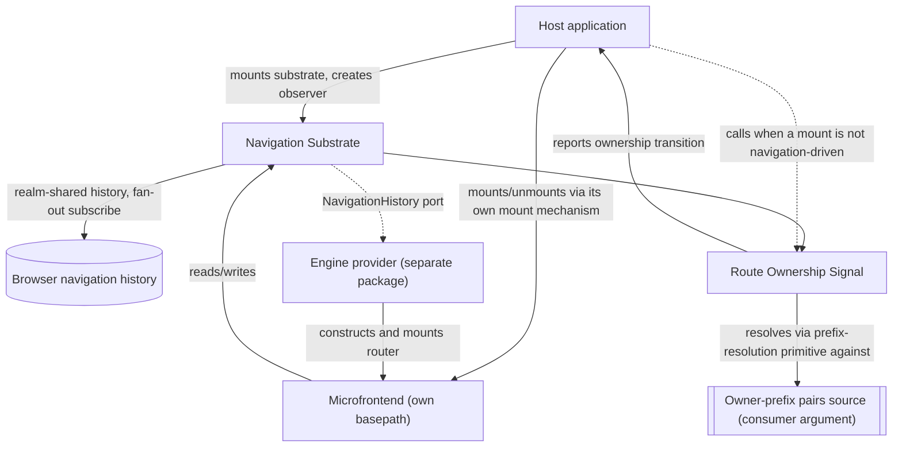

# Technical Design — Routing

- [ ] `p3` - **ID**: `cpt-frontx-routing-design-routing`

<!-- toc -->

- [1. Architecture Overview](#1-architecture-overview)
  - [1.1 Architectural Vision](#11-architectural-vision)
  - [1.2 Architecture Drivers](#12-architecture-drivers)
  - [1.3 Architecture Layers](#13-architecture-layers)
- [2. Principles & Constraints](#2-principles--constraints)
  - [2.1 Design Principles](#21-design-principles)
  - [2.2 Constraints](#22-constraints)
- [3. Technical Architecture](#3-technical-architecture)
  - [3.1 Domain Model](#31-domain-model)
  - [3.2 Component Model](#32-component-model)
  - [3.3 API Contracts](#33-api-contracts)
  - [3.4 Internal Dependencies](#34-internal-dependencies)
  - [3.5 External Dependencies](#35-external-dependencies)
  - [3.6 Interactions & Sequences](#36-interactions--sequences)
  - [3.7 Database schemas & tables](#37-database-schemas--tables)
- [4. Additional context](#4-additional-context)
  - [Worked Example: A Console Layout And Its URL](#worked-example-a-console-layout-and-its-url)
- [5. Traceability](#5-traceability)

<!-- /toc -->

## 1. Architecture Overview

### 1.1 Architectural Vision

`@gears-frontx/routing` keeps an agnostic navigation core behind an opaque substrate port, with the concrete router engine supplied by a separately published provider package. The navigation substrate never depends on a concrete engine, and a separately published engine-provider package satisfies the substrate's own history contract; the ecosystem provides a default implementation of it.

Throughout this package's own artifacts, *navigation substrate* names the agnostic core component alone, described next; the published package `@gears-frontx/routing` is that core plus the Route Ownership Signal described after it. An engine provider is never part of this package — it is a distinct published member that depends on this one, never the reverse. (The root DESIGN and ADR 0002 use the term *navigation substrate* at package granularity, naming the whole published library — a broader use than this document's own; see root DESIGN §1.3.)

#### A tree of domains, resolved level by level

A composed application is a tree of extension domains, not a single flat placement. An extension mounted into a domain owns a zone, and that zone may itself contain further domains, so the tree nests to whatever depth the composed application actually has. Route ownership resolution runs at every one of those domains independently, never once against the whole URL: each domain is its own resolution level, and each level resolves only the local remainder of the URL beneath its own base — the concrete value the enclosing level hands it the moment it begins to exist — against that domain's own declared route-owner pairs, using the one resolution primitive every level shares (`cpt-frontx-algo-routing-navigation-substrate-prefix-resolution`). A portion of that remainder that is not itself a declared prefix — a parametric value a domain's own winning occupant consumes inside its own zone, such as an identifier — is never itself a level; it stays opaque to every level's own resolution and belongs entirely to whichever engine-provider package that occupant depends on.

#### Navigation Substrate

The Navigation Substrate is the framework-agnostic core: a single navigation history realm-shared between the host and every independently bundled microfrontend, one real subscription to the browser's history fanned out to every listener, and the resolution primitive every domain level's own observer invokes against its own local remainder. That fan-out has two dispatch triggers rather than one, so that the substrate's own `push`/`replace` calls reach every subscriber even though neither raises the browser's `popstate` event on its own; the full rationale for both triggers, and for why a `go` call is observed differently from the two, is owned by the navigation-substrate FEATURE's own dispatch algorithm (`cpt-frontx-algo-routing-navigation-substrate-fanout-dispatch`), not repeated here. A routing table is an opaque value to this core, exactly as a domain's own parametric remainder is opaque to every level's resolution above — the substrate carries it but never inspects it. The substrate's own contract, `NavigationHistory` (`location`, `subscribe`, `push`, `replace`, `go`), is deliberately narrower than what any concrete engine's own history contract typically requires — the engine-provider port (`cpt-frontx-routing-fr-engine-provider-port`) states only what a provider **MUST** accept from the substrate and that it is responsible for producing a constructed, mounted router; it names no concrete engine, and this package derives nothing about how a provider bridges that gap. How a provider actually builds that bridge is that provider's own DESIGN's concern, never this one's.

#### Route Ownership Signal

Route Ownership Signal publishes, rather than enforces, the relationship between a domain level's own local URL remainder and which route owner it names. It exposes the navigation substrate's resolution primitive as its own public entry point, and lets a consumer create an observer per domain level and per axis — passing that domain's own owner-prefix pairs source as a plain argument, never an injected port, together with the base within its own carrier that level was handed (the pathname, for an axial level, or a named query-string key's own current value, for a parallel one) — that reports every ownership-relevant transition at that level (an owner appearing, disappearing, changing, or its remainder changing), and provides a URL back-projection helper the consumer calls after a mount triggered by something other than navigation, reflecting the mounted owner's own declared prefix back into the URL — at a cost this package accepts and whose full accounting belongs to the route-ownership-signal FEATURE's own back-projection algorithms (`cpt-frontx-algo-routing-route-ownership-signal-url-back-projection`), not repeated here. Resolving a deep URL is therefore a wave through the domain tree, not one event: each level's own observer resolves and reports independently the moment that level comes to exist, and this package holds no registry of levels and publishes no aggregated "the whole path resolved" signal — it cannot, by construction, since it never sees the tree of levels a consumer's own mount mechanism assembles from its reports. Mounting and unmounting themselves, and the two-way agreement between the URL and what is actually mounted at every level, are the consumer's own guarantee, built on top of this signal (`cpt-frontx-routing-principle-publishes-not-orchestrates`) — this package never orchestrates them, so it stays agnostic of whatever occupancy model the consumer's own mount mechanism uses.

#### Axes within a zone

Within one zone, at most one domain is axial: its own resolved route owner continues that zone's own carrier — the pathname, for a zone living on the main axis, or the value of whichever parallel-axis key the zone itself lives inside, for a zone nested inside one — and a zone nests no more than one axial domain, because a second would make that carrier branch. Every other domain a zone projects into the URL at all is a parallel axis instead: it occupies its own dedicated query-string key, carrying the local path of at most one occupant at a time — the key's own entry is present while the domain holds its one occupant and absent while it holds none. This release's own projection carries no more than that one entry: a domain whose own occupancy strategy holds several occupants side by side is not projected by this rule at all in this release, deferred until a first real consumer of a concurrently-occupied projected domain needs it (`cpt-frontx-adr-extension-domain-occupancy`, URL projection of domain occupancy). The same per-level resolution primitive runs against a parallel axis's own local path exactly as it runs beneath an axial domain's own base, including further nesting inside one axis entry's own value — a level nested inside a parallel axis's own occupant resolves against a base that is itself a position inside that key's own value, exactly as a level nested inside an axial domain's own occupant resolves against a base that is a position inside the pathname (§3.1, Domain Model — Carrier and Base). A domain that never projects into the URL at all simply stays runtime state this package takes no part in — projection is always an opt-in act of that domain's own consuming level, never a default this package imposes. A hash is never itself an axis; it carries whatever the application chooses, ungoverned by any axis rule.

#### Channel boundary

The library owns exactly one of the ecosystem's three host–microfrontend communication channels. Addressed action dispatch — a command to a specific target, executed through an actions-chains mediator — and shared-property broadcast — declared-interest state distributed to whoever is listening — are both owned by the runtime that provides them; this library neither duplicates nor mediates either one. It owns the URL channel alone: what the address bar reads, and what a navigation does to it.

#### Visibility and zone boundaries

Visibility follows the same boundary, at every level of the domain tree. A microfrontend's own router owns only the subtree beneath its own base; nothing in its own routing table can navigate it outside that subtree. Leaving it happens through an imperative call against the shared navigation substrate with an absolute path, through an ordinary link whose `href` is itself an absolute path outside the zone, or through an addressed action to the host over the actions-chains channel — never through a route inside the microfrontend's own tree pointing outside its own base. A domain's own declared prefix is the namespace of whichever route owner occupies it: an extension carries its own prefix in its own registered declaration, not in this library's own contract, and the enclosing level assigns its own base to that occupant's zone the moment it mounts it — the outermost level's own base comes from the host, or from the deployment when that level is served on its own. A same-domain conflict — two route owners declaring the identical prefix at the same level — is caught when that domain's own registrations are made, not at navigation time (PRD §11).

### 1.2 Architecture Drivers

#### Functional Drivers

The package's requirements are owned by its own [PRD](./PRD.md).

| Requirement | Design Response |
|-------------|------------------|
| `cpt-frontx-routing-fr-single-navigation-substrate` | The Navigation Substrate holds the shared history behind a well-known realm-global, fanning out one browser-history subscription to every subscriber (`cpt-frontx-component-routing-navigation-substrate`). |
| `cpt-frontx-routing-fr-engine-provider-port` | The Navigation Substrate exposes `NavigationHistory` as the sole contract a router engine reaches the shared history through; no component of this package hands that history to a concrete engine, and no concrete engine dependency exists anywhere in this package's own module graph (`cpt-frontx-component-routing-navigation-substrate`, `cpt-frontx-routing-nfr-agnostic-core`). A separately published provider package — the ecosystem's own default — implements the port. |
| `cpt-frontx-routing-fr-route-ownership-signal` | The Route Ownership Signal component exposes the owner-resolution primitive and an observable owner-change signal created per domain level and per axis, plus a URL back-projection helper for either axis kind the consumer calls after a non-navigation-driven mount; the consumer's own mount mechanism does the actual mounting at every level, and the two-way agreement between the URL and what is mounted is the consumer's own guarantee, built on this signal (`cpt-frontx-component-routing-screen-binding`, `cpt-frontx-routing-seq-deep-link-cold-mount`). |
| `cpt-frontx-routing-fr-imperative-navigation` | The Navigation Substrate exposes `push`/`replace`/`go`/`location`/`subscribe` directly, independent of any mounted router or component tree (`cpt-frontx-component-routing-navigation-substrate`). |

#### NFR Allocation

| NFR ID | NFR Summary | Allocated To | Design Response | Verification Approach |
|--------|-------------|--------------|-----------------|------------------------|
| `cpt-frontx-routing-nfr-standalone` | No intra-ecosystem import; no call into the consumer at all | The published package | The manifest declares no intra-ecosystem dependency; route ownership reaches the package only through a consumer-supplied owner-prefix pairs source passed as a plain argument, and mount execution never reaches the package at all — the package only publishes a signal the consumer's own mount mechanism acts on (`cpt-frontx-constraint-routing-no-intra-ecosystem-dependency`). | The boundary guards (`arch:edges`, `arch:deps`) hold the manifest and the import graph to the declared standalone property. |
| `cpt-frontx-routing-nfr-agnostic-core` | Package carries no router-engine or UI-framework dependency whatsoever | The whole published package | No module of this package imports any router engine or any UI-framework rendering primitive; every engine-specific dependency lives in a separately published engine-provider package instead (`cpt-frontx-constraint-routing-no-engine-leak`). | The boundary guards confirm this package's own import graph carries no engine or UI-framework edge at all. |

This member records its decisions here rather than in a decision record of its own. Two existing records carry the scope this member sits inside: `cpt-frontx-adr-core-package-boundaries` states that the core partition covers the UI-framework-agnostic subset and that a member bound to a concrete engine carries its own bounded concern, held by the separately published engine-provider package rather than by this one; `cpt-frontx-adr-extension-domain-occupancy` states that an occupied domain's own axis, where that domain projects one, is the address bar's own reflection of the same mount mechanism that record governs, and that a navigation act reaches that mount mechanism rather than a second one running alongside it.

### 1.3 Architecture Layers

- [ ] `p3` - **ID**: `cpt-frontx-routing-tech-routing-stack`

The diagram below shows the pattern at one representative domain level; the same shape recurs at every level and axis a composed application actually has (§1.1).



| Layer | Responsibility | Technology |
|-------|---------------|------------|
| Navigation substrate | Realm-shared navigation history, fan-out subscription, `basepath` contract, imperative navigation surface | TypeScript, framework-agnostic, no router-engine or UI-framework dependency |
| Route ownership signal | Exposes the substrate's longest-matching-prefix primitive as a public entry point, publishes an observable signal of every ownership-relevant transition per domain level and per axis, and provides a URL back-projection helper the consumer calls after a non-navigation-driven mount | TypeScript over a consumer-supplied owner-prefix pairs source (plain argument, no port) |

The engine provider shown above is never part of this package; it is a distinct published member (the ecosystem provides a default) that depends on the navigation substrate's `NavigationHistory` contract and is substitutable by any conforming provider — the technology and component detail for that provider belongs entirely to its own DESIGN, not to this one.

## 2. Principles & Constraints

### 2.1 Design Principles

#### Single History Authority

- [ ] `p2` - **ID**: `cpt-frontx-routing-principle-single-history-authority`

Exactly one navigation-history instance answers for a realm; no unit — host or microfrontend — constructs its own. Every unit that needs to read or write navigation state reaches the one realm-shared instance instead, and every subscriber's fan-out traces back to the same single subscription against the browser's own history. This is what keeps independently bundled units from ever holding two divergent views of where the user currently is.

#### Publishes, Does Not Orchestrate

- [ ] `p2` - **ID**: `cpt-frontx-routing-principle-publishes-not-orchestrates`

This package publishes the fact that a domain level's own local URL remainder resolves to a declared route owner, and publishes when that fact changes; it does not reproduce, alongside that fact, any model of who is allowed to occupy a placement, how many occupants a placement may hold at once, or how a race between two competing mounts resolves — at the outermost level or at any level nested beneath it. Reconciling the URL with what is actually mounted belongs to whichever mount mechanism already holds the registry of route owners, the domains they occupy, and the authority to resolve a race between two mounts — for this ecosystem's own host, the `mfes` runtime (`cpt-frontx-adr-extension-domain-occupancy`). This is a narrower, package-specific consequence of the runtime's own UI-framework-agnosticism principle (`cpt-frontx-principle-agnostic-core`): that principle governs independence from a concrete UI framework and carries no view on domain occupancy one way or the other; this principle is what actually keeps this package from re-implementing a competing occupancy model of its own.

### 2.2 Constraints

#### ROUTING-1 — No engine import in the navigation substrate

- [ ] `p2` - **ID**: `cpt-frontx-constraint-routing-no-engine-leak`

`@gears-frontx/routing` contains no import of a concrete router engine or its packages, anywhere in the package — not merely outside a designated internal component, but absent from the package's own manifest and import graph entirely. Consumers of the navigation substrate and of the route ownership signal interact only with the substrate's own `NavigationHistory` contract (`location`, `subscribe`, `push`, `replace`, `go`); a concrete router engine is never a dependency of this package under any circumstance. The role of "the one place a router engine may be imported" belongs to whichever separately published engine-provider package a microfrontend depends on — enforced there by that provider's own sole-engine-import constraint — never to this package.

**ADRs**: `cpt-frontx-adr-core-package-boundaries` — cited for the partition context this constraint sits outside of (that record's `More Information` states the core partition's scope excludes an engine-bound member like this one); it does not own this constraint, which this DESIGN defines and owns directly.

#### ROUTING-2 — No intra-ecosystem package dependency

- [ ] `p2` - **ID**: `cpt-frontx-constraint-routing-no-intra-ecosystem-dependency`

`@gears-frontx/routing` imports no other package in this ecosystem. Its coupling to whichever unit currently owns a URL prefix is expressed only through a consumer-supplied owner-prefix pairs source, passed as a plain argument; the execution of a mount is entirely the consumer's own responsibility, reached only through the observable signal this package publishes — never through an injected port, and never through a compile-time import of the runtime or any other ecosystem package that implements those concerns.

**ADRs**: `cpt-frontx-adr-core-package-boundaries` — cited for the partition context this constraint sits outside of; that record does not own this constraint, which this DESIGN defines and owns directly.

## 3. Technical Architecture

### 3.1 Domain Model

| Entity | Definition | Representation |
|--------|------------|-----------------|
| Navigation History | The realm-shared, single navigation-history instance every unit reads and writes; exposes the substrate's own `NavigationHistory` contract — `location`, `subscribe`, `push`, `replace`, `go`. A separately published engine-provider package adapts this into whatever contract its own concrete engine expects; that adapted contract is not this package's concern. | Realm-global-backed singleton — `@gears-frontx/routing` |
| Zone | The territory an extension owns once mounted into an extension domain; a zone may itself contain further extension domains, nesting the tree of levels this library resolves. Not this package's own artifact — the zone belongs to whichever runtime governs the domain (`cpt-frontx-adr-extension-domain-occupancy`); this package only resolves against it. | Structural concept, not a package-owned entity |
| Level | One extension domain's own position in the zone tree, and the point at which resolution and observation both run: a level's own carrier, its own base within that carrier, its own declared route-owner pairs, and its own axis (or axes) are all local to it, never shared with another level. | Resolved per domain — `@gears-frontx/routing` |
| Carrier | The local path a level's own base and resolution both live inside: the pathname, for a level whose own zone continues the main axis, or a named parallel-axis key's own current entry value, for a level whose own zone lives inside that key's value instead. The owner-resolution primitive and the observer treat either kind of carrier identically once handed a carrier and a base within it — neither carries a notion of which kind it was given. | Consumer-selected per level (the pathname, or a named query-string key) |
| Base | The concrete value, within a level's own carrier, that a level's own resolution runs relative to, supplied to it by the enclosing level the moment it begins to exist — a render-time value, never a declaration carried in a registration. For a level whose own carrier is the pathname, the base is a prefix of the pathname; for a level whose own carrier is a parallel-axis key's own entry value, the base is a prefix of that value, and an empty base names the value's own root. Only the outermost level's base is an absolute prefix of the browser's own location; every nested level's base is itself a value the level above it produced, within whichever carrier that level lives in. A base is fixed for the observer created with it and is never updated on a live observer — replacing it means releasing that observer and creating its successor with the new value (§4, "A level's own base goes stale before its enclosing level re-creates it"; route-ownership-signal FEATURE §1.4, Binding obligation). | Consumer-supplied per level, immutable per observer instance |
| Axis | A domain's own projection strategy into the URL: axial, continuing its own zone's carrier (at most one per zone), or parallel, occupying a dedicated query-string key that carries at most one entry — present while the domain holds an occupant, absent while it holds none. Projecting a domain whose own occupancy strategy holds several occupants at once is deferred until a first real consumer needs it (`cpt-frontx-adr-extension-domain-occupancy`). | Consumer-assigned per domain, opt-in |
| Route Owner | The opaque identifier of whichever unit currently owns a declared prefix at one domain level, paired with that prefix; supplied by that level's own consumer as a plain argument to the route ownership signal's observer. Declares exactly one prefix — never more than one — for as long as its registration exists. | Identifier/prefix pair, consumer-supplied |
| Basepath | The URL path segment prefix a mounted microfrontend's own router is scoped to; assigned by the enclosing level or supplied by the deployment, and consumed by whichever engine-provider package constructs the microfrontend's router. | String, provider input |
| Route Ownership Resolution | The outcome of matching a domain level's own local remainder against that domain's own declared prefixes by longest match, naming the route owner that remainder belongs to; exposed by this package as a thin entry point over the navigation substrate's own primitive, never re-implemented. | Resolver output — `@gears-frontx/routing` |

### 3.2 Component Model

#### Navigation Substrate

- [ ] `p2` - **ID**: `cpt-frontx-component-routing-navigation-substrate`

Concrete artifact: `@gears-frontx/routing` (core entry).

##### Why this component exists

Independently bundled units in the same realm need one navigation history to agree on, not one each. The Navigation Substrate is the framework-agnostic core that holds that single instance, fans out one browser-history subscription to every listener, and exposes imperative navigation outside any UI tree.

##### Responsibility scope

- Owns the single, realm-shared navigation-history instance and its fan-out subscription.
- Owns the `basepath` contract every scoped router is built against.
- Exposes `push`, `replace`, `go`, `location`, `subscribe` for use outside a mounted router.

##### Responsibility boundaries

- Carries no dependency on any router engine or UI framework whatsoever (`cpt-frontx-constraint-routing-no-engine-leak`, `cpt-frontx-routing-nfr-agnostic-core`).
- Treats a routing table as an opaque value it never inspects; route-tree shape belongs entirely to whichever engine-provider package and microfrontend build it.
- Does not perform mounting, unmounting, or resolve which route owner is currently mounted; it owns the longest-matching-prefix primitive that names a route owner for a domain level's own local remainder (`cpt-frontx-algo-routing-navigation-substrate-prefix-resolution`) — Route Ownership Signal exposes that primitive as its own public entry point at every level and axis, and builds its observable signal on top of it, rather than re-implementing it.

##### Related components (by ID)

- `cpt-frontx-component-routing-screen-binding` (Route Ownership Signal) — subscribes to the substrate's fan-out to compute and publish ownership-change transitions.
- The engine-provider component of whichever provider package implements the port (the ecosystem's own default lives at `packages/routing-tanstack`) — an external consumer of this component's `NavigationHistory` contract, owned entirely by that provider package, not by this one.

#### Route Ownership Signal

- [ ] `p2` - **ID**: `cpt-frontx-component-routing-screen-binding`

Concrete artifact: `@gears-frontx/routing` (core entry).

##### Why this component exists

A consumer's own mount mechanism needs to know, from the URL alone, which declared route owner a domain level's own local remainder belongs to and when that resolution changes — without this package holding any opinion about how mounting, unmounting, or occupancy cardinality actually work, and without a whole-URL registry this package would have to hold to answer that question for a nested level. Route Ownership Signal is the component that exposes that resolution per level and per axis, and publishes its changes as an observable signal, leaving mounting entirely to the consumer.

##### Responsibility scope

- Exposes the navigation substrate's longest-matching-prefix primitive as this package's own public owner-resolution entry point, without re-implementing the matching itself.
- Lets a consumer create an observer per domain level and per axis, passing that domain's own owner-prefix pairs source as a plain argument — never an injected port — together with the base within its own carrier that level was handed (the pathname, for an axial level, or a named query-string key's own current value, for a parallel one); the observer reports an ownership-change transition (appeared, disappeared, changed, or remainder-changed) on creation and on every subsequent ownership-relevant navigation at that level.
- Provides a URL back-projection helper the consumer calls to reflect a mount that happened for a reason other than navigation back into the URL, using a history `replace` scoped to the projecting axis.

##### Responsibility boundaries

- Does not maintain a registry of route owners; the consumer supplies the current set of declared pairs itself, per domain level, as a plain argument, not through an injected port.
- Does not execute a mount or an unmount itself, and does not resolve a race between two mounts competing for the same placement; both are the consumer's own mount mechanism's responsibility (`cpt-frontx-feature-routing-route-ownership-signal` §1.4, Binding obligation).
- Does not participate in the addressed-action or shared-property channels; it reads only the URL channel.
- Carries no notion of exclusive versus concurrent occupancy, and no state machine tracking which owner currently occupies a placement, at any domain level; that occupancy model belongs entirely to whichever mount mechanism the consumer already runs (`cpt-frontx-routing-principle-publishes-not-orchestrates`).
- Holds no registry of domain levels, and publishes no signal asserting that a multi-level path resolved end to end; each level's own observer reports only that level's own transition.
- Requires nothing from the consumer beyond the plain-argument owner-prefix pairs source at observer creation, and no port at all; a consumer that never creates the observer at a given level simply never participates in that level's signal, with no misconfigured state to detect or diagnose.

##### Related components (by ID)

- `cpt-frontx-component-routing-navigation-substrate` — supplies the history and the prefix-resolution primitive this component exposes and subscribes to.

### 3.3 API Contracts

- [ ] `p2` - **ID**: `cpt-frontx-routing-interface-package-entry`

- **Contracts**: the substrate's own `NavigationHistory` contract (`location`, `subscribe`, `push`, `replace`, `go`); the `basepath` contract; the prefix-equivalence predicate a domain's own consumer uses for its own registration-time conflict check; the consumer-supplied owner-prefix pairs source, the per-level/per-axis observer's own construction shape, and the route ownership signal's transition shape (field-level shapes owned by the route-ownership-signal FEATURE); the engine-provider port a provider package must satisfy — its normative field-level shape lives here, in the navigation-substrate FEATURE's own §1.5, because the port is declared by this package's own component, not by whichever package implements it; a conforming provider's own adaptation of that shape is a worked example the provider carries in its own package tree, not a restatement of the normative contract.
- **Technology**: TypeScript library API, single entry point — this package carries no separate engine-provider entry, because it ships no engine provider of its own at all.
- **Location**: Not authored yet — no source exists for this package. The entry (e.g. `src/index.ts`) carries the navigation substrate's and the route ownership signal's contracts only.

| Public surface | Purpose |
|----------------|---------|
| `NavigationHistory` contract | The shape the shared navigation history itself exposes: `location`, `subscribe(cb)`, `push`, `replace`, `go`. The substrate's own notification payload is internal to this contract; adapting it into whatever shape a concrete engine's own `subscribe` callback expects is that engine-provider package's job, not this contract's. |
| `basepath` | The prefix contract a scoped router is built against. |
| Prefix-equivalence predicate | Normalizes two declared prefixes into their non-empty segment lists and reports whether the lists are identical, using the same segment-normalization and segment-equality rule the owner-resolution primitive applies at match time; a domain's own consumer calls it at registration time to check two candidate declared prefixes for a same-prefix conflict (PRD §11), rather than approximating the rule with a separate comparison of its own. Field-level shape owned by the navigation-substrate FEATURE. |
| Engine-provider port | The contract a provider package must satisfy to receive the shared history and produce a constructed, mounted router; normative field-level shape owned by the navigation-substrate FEATURE's own §1.5, published in this package's own tree — a conforming provider's own adaptation of it is a worked example that provider carries in its own package, not the normative contract itself. |
| Owner-prefix pairs source | A plain argument (never an injected port) supplying identifier-to-declared-prefix pairs the owner-resolution primitive matches against, scoped to one domain level; field-level shape owned by the route-ownership-signal FEATURE. |
| Ownership-change transition | The observable notification the route ownership signal delivers to a consumer-registered callback on creation and on every ownership-relevant navigation at one domain level — appeared, disappeared, changed, or remainder-changed. Mounting itself stays entirely the consumer's own responsibility; this package only signals. Field-level shape owned by the route-ownership-signal FEATURE. |
| URL back-projection helper | The helper a consumer calls to reflect a mount not driven by navigation back into the URL — replacing the local path beneath a level's own base within its own carrier, whether that carrier is the pathname or a parallel axis's own query-string key entry, leaving the rest of the carrier, every other key, and (by default) the hash and the search untouched or reset per the axis's own rule. Field-level shape owned by the route-ownership-signal FEATURE. |

### 3.4 Internal Dependencies

None. The package imports no other package in this ecosystem — the standalone property this member claims under the layer's membership rules (root DESIGN §1.3), held to the cross-member dependency policy of root DESIGN §3.4. Its coupling to route ownership is expressed through a consumer-supplied owner-prefix pairs source passed as a plain argument, and its coupling to mount execution through the observable signal this package publishes — never through an injected port and never through a package import (`cpt-frontx-constraint-routing-no-intra-ecosystem-dependency`). A separately published engine-provider package (the ecosystem's own default, `@gears-frontx/routing-tanstack`) depends on this package; the dependency runs one way only, and this package never depends back on any engine-provider package.

**Dependency Rules** (per project conventions):
- No circular dependencies at the design level: no other ecosystem package depends on this package, and this package depends on none.
- No import of template territory.
- No UI-framework import, and no router-engine import, anywhere in this package.

### 3.5 External Dependencies

None. This package carries no external dependency on any router engine, UI framework, or other third-party library beyond the browser's own navigation-history API (PRD §3.1, §10). Every router-engine dependency lives entirely in a separately published engine-provider package's own external dependency list.

### 3.6 Interactions & Sequences

#### Deep Link Resolves Through A Multi-Level Wave, Across Two Axes

- [ ] `p3` - **ID**: `cpt-frontx-routing-seq-deep-link-cold-mount`

**Use cases**: `cpt-frontx-routing-usecase-deep-link-to-microfrontend-screen`

**Actors**: `cpt-frontx-routing-actor-application-developer`

```mermaid
sequenceDiagram
    participant Browser
    participant Substrate as Navigation Substrate
    participant L0 as Route Ownership Signal (Level 0, axial)
    participant Glue0 as Level 0 consumer's own mount mechanism
    participant L1 as Route Ownership Signal (Level 1, axial)
    participant Glue1 as Level 1 consumer's own mount mechanism
    participant Ax as Route Ownership Signal (Level 0, parallel axis)
    Note over Browser,Ax: Cold load or reload — resolution at observer creation, no fan-out round involved
    Browser->>Substrate: cold load / reload (location already current)
    Glue0->>L0: create observer (base = outermost, Level 0's own pairs)
    L0->>Substrate: read current location
    L0->>L0: resolve local remainder beneath Level 0's own base against Level 0's own pairs
    L0-->>Glue0: report initial transition (appeared: Owner A)
    Glue0->>Glue0: mount Owner A under its own resolved prefix as its base
    Glue0->>Ax: create observer (named query-string key, Level 0's own parallel-axis pairs)
    Ax->>Substrate: read current location
    Ax->>Ax: resolve the named query-string key's own entries against Level 0's own parallel-axis pairs
    Ax-->>Glue0: report initial transition for the parallel axis (appeared: Owner C, or none)
    Note over Glue0,L1: Owner A's own zone contains a further domain once A exists
    Glue0->>L1: create observer (base = A's own resolved prefix, that domain's own pairs)
    L1->>Substrate: read current location
    L1->>L1: resolve local remainder beneath its own base against that domain's own pairs
    L1-->>Glue1: report initial transition (appeared: Owner B)
    Glue1->>Glue1: mount Owner B under its own resolved prefix as its base
    Note over Browser,Ax: Back/forward — every already-existing observer is notified through one fan-out round
    Browser->>Substrate: back/forward step (location changes)
    Substrate->>L0: notify (fan-out)
    Substrate->>L1: notify (fan-out)
    Substrate->>Ax: notify (fan-out)
    L0->>L0: resolve local remainder beneath Level 0's own base against Level 0's own pairs
    L0-->>Glue0: report transition, if ownership-relevant
    L1->>L1: resolve local remainder beneath its own base against that domain's own pairs
    L1-->>Glue1: report transition, if ownership-relevant
    Ax->>Ax: resolve the named query-string key's own entries against Level 0's own parallel-axis pairs
    Ax-->>Glue0: report transition for the parallel axis, if ownership-relevant
    Note over Glue0,Glue1: Each level's and each axis's own wave resolves independently, in both branches; no participant here asserts the whole path resolved together.
```

**Description**: The primary flow this package participates in, generalized past one level. Route Ownership Signal resolves a domain level's own local remainder and reports that level's own transition; everything after that — mounting, unmounting, and showing a fallback — is that level's own consumer acting on the report, not this package's own orchestration. A freshly mounted microfrontend's router reads the already-current location from the shared history at start, so no blank screen appears between mount and first render, at any level. A level begins to exist only once its enclosing level's own consumer mounts the owner whose zone contains it; until then, the deeper level's own observer does not yet exist, and no signal at the shallower level distinguishes that absence from "no owner will ever match here."

### 3.7 Database schemas & tables

Not applicable. The package holds no database and no durable persistence; the shared navigation history lives in memory on the realm global for the lifetime of the page.

## 4. Additional context

The library's central design tension is keeping the navigation substrate agnostic of any router engine while still letting a consumer reach a ready-to-use default. It is resolved by separation of artifacts: the agnostic substrate and its default provider live in *separate published packages* — this package and a separately published engine-provider package — so it is the package boundary itself, not an intra-package constraint, that keeps the default provider's own router-engine dependency from ever reaching this package.

Recorded failure modes:

- **Deep link into a not-yet-mounted microfrontend, at any domain level.** Mounting is asynchronous; the freshly mounted router reads the current location from the shared history at start, so no blank screen appears while mounting completes, at the outermost level or at any level nested beneath it. Reading the current location at start is an obligation on whichever engine-provider package constructs that router, not on this package.
- **Multiple independently bundled copies of this package.** Programmatic navigation changes the address through the browser's history API without emitting the event a separate history instance listens for, so a copy holding its own history observes nothing; without a single shared history, routers in different copies drift out of agreement with each other and with the URL. The realm-shared instance is what prevents this by construction. The realm-global well-known key carries the `NavigationHistory` contract's version (`cpt-frontx-algo-routing-navigation-substrate-singleton-resolution`); a copy built against an incompatible contract version resolves under its own versioned key and constructs its own instance rather than silently capturing and reusing one it cannot actually satisfy.
- **A navigation performed through the substrate's own `push`/`replace`.** Neither call relies on the browser's `popstate` event; the substrate's fan-out dispatch is triggered directly by the call itself instead. The reasoning for both dispatch triggers, and for why `go` is excluded from the direct one, is owned in full by the navigation-substrate FEATURE's own dispatch algorithm (`cpt-frontx-algo-routing-navigation-substrate-fanout-dispatch`), not repeated here.
- **Third-party code mutates the browser's history behind the substrate's back.** A page-level script calling the browser's history API directly, bypassing the shared instance, leaves the substrate's `location` stale and its fan-out silent for that change — no code path notifies the substrate a navigation happened. This is an environmental condition the library does not prevent (PRD §3.1), not a supported way to navigate.
- **Unsubscribing, or navigating, from inside a fan-out callback.** Each dispatch round iterates a snapshot of the subscriber set taken when the round starts, so a callback that unsubscribes mid-round does not corrupt the iteration; a callback that triggers a new navigation has that navigation dispatched as its own, later round rather than folded into the round already in progress (`cpt-frontx-algo-routing-navigation-substrate-fanout-dispatch`).
- **A path matches no declared prefix, at some domain level.** Composed: that level's own Route Ownership Signal reports "no owner" (or an owner disappearing), and the consumer holding that level shows its own fallback and mounts nothing beneath it — this package takes no fallback action itself, at any level. Standalone: the microfrontend's own engine-provider package resolves to its own not-found route inside its own route tree, because no route-ownership-signal observer participates at all. The user-visible outcome — a not-found screen — is the same in both modes, but the mechanism differs: one is a consumer-level fallback acting on the signal, the other is that provider's own routing result.
- **A domain level several steps deep has not yet reported.** Because this package holds no registry of levels, "no owner at a deep level" and "the wave has not reached that level yet" are indistinguishable at any shallower level's own observer — the deeper level's own observer exists, and reports, only once its enclosing level's consumer has mounted the owner whose zone contains it. No aggregate "the path resolved" signal exists to disambiguate the two, by construction: publishing one would require a registry of levels this package does not hold.
- **A level's own base goes stale before its enclosing level re-creates it.** A level's own base is fixed at its observer's own creation and is never updated in place (route-ownership-signal FEATURE §1.4, Binding obligation); when the enclosing level's own engine re-matches a parametric segment the base was built from to a different value, the enclosing level's own consumer releases the observer holding the stale base and creates a fresh one carrying the new base — it never updates the base of the observer already running, because a base is immutable by construction for the observer's own lifetime. Because a fan-out round notifies subscribers in registration order, the same round that triggers the enclosing level's own re-render can reach a still-stale nested observer before that re-render has released and recreated it. In that window, the stale observer resolves its own now-non-prefix base honestly to "no owner" and reports the owner disappearing, and its own level's consumer may unmount an occupant the enclosing level is about to tear down anyway once it finishes recreating the nested observer. This window is bounded to one round and resolves itself the moment the recreated observer reports its own first resolution against the new base; the sequence it produces — a disappearing report ahead of the enclosing level's own teardown — is observable and is an accepted cost of resolving each level independently rather than serializing the whole tree's resolution on one event.
- **A parallel axis's own query-string key outlives the domain that projected it.** A key with no observer currently reading it is inert, not an error and not a fallback state: it is indistinguishable, at the URL, from a domain whose own wave has not yet reached it. Because the axial back-projection helper resets a projected key by default rather than carrying it forward (§4, replace-cost accounting below; full rule owned by the route-ownership-signal FEATURE), an orphaned key is the exception rather than the common case; a key that does survive is resolved correctly if the domain that reads it later comes to exist, because every observer always reads the URL's current, live state rather than a value captured earlier.
- **Two axes within the same zone wave independently.** An axial domain's own transition and a parallel domain's own transition, both projected within the same zone, are reported by two independent observers with no ordering guarantee between them; a consumer that needs one to wait for the other coordinates that itself, since neither observer knows the other exists.
- **The URL moves outside a mounted owner's declared prefix, at some domain level.** Route Ownership Signal reports only the single winning resolution — the longest-match owner, or none — for that level's own local remainder; it holds no notion of how many previously mounted occupants that implies unmounting, at that level or at any level nested beneath it. Deciding that is the consumer's own mount mechanism's responsibility, using whatever occupancy model it already runs — the `mfes` runtime's cardinality matrix, for this ecosystem's own host (`cpt-frontx-adr-extension-domain-occupancy`; `cpt-frontx-routing-principle-publishes-not-orchestrates` is the canonical statement of this boundary).
- **A `replace` reflection via the URL back-projection helper.** The accepted cost of treating the URL as authoritative — the entry the user was previously on becomes unreachable by a back step — is owned in full by the route-ownership-signal FEATURE's own back-projection algorithms (`cpt-frontx-algo-routing-route-ownership-signal-url-back-projection`, `cpt-frontx-algo-routing-route-ownership-signal-parallel-axis-back-projection`), not repeated here.
- **Standalone deployment of a single microfrontend.** An observer is not required — a standalone deployment is free to create one or not. When none is created, the route ownership signal simply is not used, and the `basepath` comes from the deployment rather than from an enclosing level — empty when served at a root, or the sub-path the deployment publishes under. Whatever engine-provider package a microfrontend depends on runs the same construction path either way; that provider's own DESIGN records the deployment obligations (server rewrite, independently configured asset base URL) this package does not carry.

### Worked Example: A Console Layout And Its URL

Requested by a reviewer as a concrete check for this design and for whatever implements it: a composed layout, the state a user has reached inside it, and the single URL that state resolves to and is recoverable from.

**The layout**: a console — the outermost level, level 0 — projects two domains: an axial *screen* domain, continuing the pathname, and a parallel *modal* domain, occupying its own query-string key. One occupant of the screen domain is a *Tenants* screen: a table of tenants whose row click opens a details panel belonging to the *Tenants* screen's own zone. That panel's own zone contains a further domain — an axial *tabs* domain — one of whose occupants is a *Contacts* tab; a button inside it opens a modal for creating a contact, and that modal mounts in the console's own modal domain at level 0, not in any domain nested inside the *Tenants* screen's own zone.

**The state pictured**: the *Tenants* screen is open, its details panel is showing tenant `ABC`, the tabs domain's *Contacts* occupant is active, the create-contact modal is open, and the console's own navigation menu is expanded.

**The URL**: `/tenants/ABC/contacts?m=create-contact`

**Segment ownership**:

| Segment | Owner |
|---|---|
| `/` | The outermost level's own base — level 0, the console's own root. |
| `tenants` | The declared prefix of the axial screen domain's winning occupant, the *Tenants* screen. |
| `ABC` | A parametric value the *Tenants* screen's own engine-provider package consumes inside its own zone — not itself a level, opaque to every level's own resolution (§1.1, A tree of domains, resolved level by level). |
| `contacts` | The declared prefix of the tabs domain's winning occupant, the *Contacts* tab; the base `/tenants/ABC` was handed to the tabs domain by the *Tenants* screen's own detail panel the moment that domain came to exist. |
| `?m=create-contact` | The parallel axis the console's own modal domain projects at level 0 — the key `m` is the console's own glue's own choice (§1.1, Axes within a zone); `create-contact` is the local path of that axis's own occupant. |
| The expanded navigation menu | Never projected at all — ordinary runtime state (a shared property), outside this library's own concern (§1.1, Axes within a zone). |

**Scenarios**:

| Scenario | Mechanism |
|---|---|
| Opening the create-contact modal | A `push` of the current location with the `m=create-contact` entry added to its search — the open-with-`push`, close-with-`replace` asymmetry the route-ownership-signal FEATURE's Binding obligation names, so a subsequent back step undoes exactly this addition. |
| Closing the modal | A `replace` of the modal domain's own key alone: `m` is removed, nothing else in the URL changes, and closing creates no history entry a later back step would have to undo. |
| Switching the tabs domain from Contacts to General | A `push` of `/tenants/ABC/general`, built by whatever code renders the tab switch. The search resets because `push` takes a full location string and the navigating code assembled one carrying no search — reset is a consequence of the signature, not a mechanism — so the create-contact modal closes; carrying it across would have meant explicitly assembling the current search into the pushed string. The details panel survives untouched: its state rides the parametric `ABC` segment, which the new pathname still carries. |
| A back step taken right after opening the modal | The browser returns to the history entry with no `m` key; the console's own glue unmounts the modal in response to the modal domain's own reported transition, not through any action of this library's own. |
| A deep link, or a reload, at the pictured URL | Both axes resolve independently and are fully restored: the screen domain's own wave (`tenants`, then — after the Tenants screen's own engine consumes `ABC` — `contacts`) and the modal domain's own wave (`m=create-contact`) each resolve on their own, with no guarantee about which mounts first (§1.1, Axes within a zone: "Two axes within the same zone wave independently"). |
| A `?m=` key naming no domain currently registered to read it | Inert — neither an error nor a fallback state; it resolves correctly the moment a domain later comes to exist to read that key, exactly as any orphaned parallel-axis key does (DESIGN §4, "A parallel axis's own query-string key outlives the domain that projected it"). |

This example is what this design, and whatever implements it, are checked against: level-by-level resolution with an opaque parametric segment sitting between two resolved levels, two independently waving axes reflected in one address, full recoverability of mounted state from the address alone — the expanded navigation menu excepted, since it is never projected — and the boundary between projected occupancy and ordinary runtime state that boundary implies. An implementation **MUST** reproduce this example as one of its own acceptance scenarios.

## 5. Traceability

- **Features**: [features/navigation-substrate/FEATURE.md](./features/navigation-substrate/FEATURE.md) (`cpt-frontx-feature-routing-navigation-substrate`), [features/route-ownership-signal/FEATURE.md](./features/route-ownership-signal/FEATURE.md) (`cpt-frontx-feature-routing-route-ownership-signal`)
- **Root chain**: [PRD](../../../architecture/PRD.md), [DESIGN](../../../architecture/DESIGN.md), [DECOMPOSITION](../../../architecture/DECOMPOSITION.md)
- **Engine-provider package**: [routing-tanstack PRD](../../routing-tanstack/architecture/PRD.md), [routing-tanstack DESIGN](../../routing-tanstack/architecture/DESIGN.md) — the ecosystem's default implementation of the engine-provider port this package declares; its own `engine-provider` FEATURE moved there under the package split recorded in `cpt-frontx-adr-core-package-boundaries`, keeping every one of its identifiers unchanged.

This package's requirements are owned by its own [PRD](./PRD.md), per the 3-layer model: each member explains its own requirements, and the root PRD describes the layers and the requirements binding every member equally.
