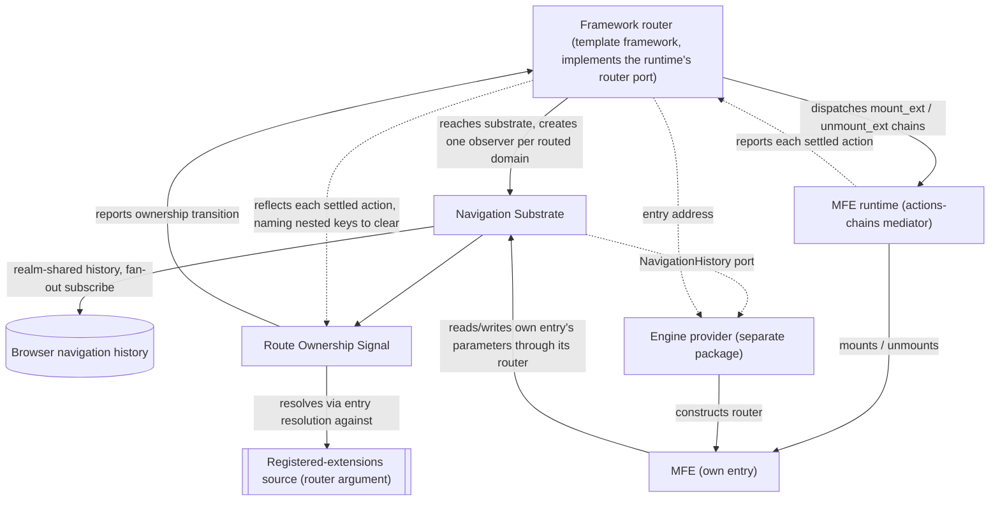
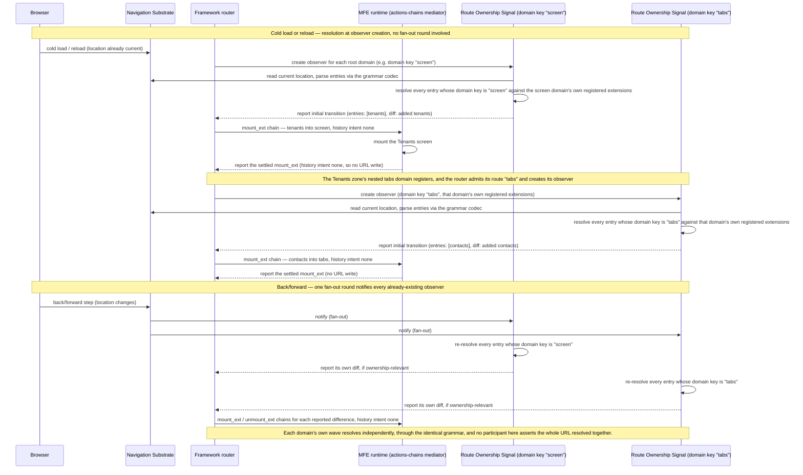

# Technical Design — Routing

- [ ] `p3` - **ID**: `cpt-frontx-routing-design-routing`

<!-- toc -->

- [1. Architecture Overview](#1-architecture-overview)
  - [1.1 Architectural Vision](#11-architectural-vision)
  - [1.2 Architecture Drivers](#12-architecture-drivers)
  - [1.3 Architecture Layers](#13-architecture-layers)
- [2. Principles & Constraints](#2-principles--constraints)
  - [2.1 Design Principles](#21-design-principles)
  - [2.2 Constraints](#22-constraints)
  - [2.3 Obligations On The Framework Router](#23-obligations-on-the-framework-router)
- [3. Technical Architecture](#3-technical-architecture)
  - [3.1 Domain Model](#31-domain-model)
  - [3.2 Component Model](#32-component-model)
  - [3.3 API Contracts](#33-api-contracts)
  - [3.4 Internal Dependencies](#34-internal-dependencies)
  - [3.5 External Dependencies](#35-external-dependencies)
  - [3.6 Interactions & Sequences](#36-interactions--sequences)
  - [3.7 Database schemas & tables](#37-database-schemas--tables)
- [4. Additional context](#4-additional-context)
  - [Worked Example: The Reference Link](#worked-example-the-reference-link)
  - [Worked Example: A Console Layout And Its URL](#worked-example-a-console-layout-and-its-url)
  - [Worked Example: Structural Reset](#worked-example-structural-reset)
- [5. Traceability](#5-traceability)

<!-- /toc -->

## 1. Architecture Overview

### 1.1 Architectural Vision

`@gears-frontx/routing` keeps an agnostic navigation core behind an opaque substrate port, with the concrete router engine supplied by a separately published provider package. The navigation substrate never depends on a concrete engine, and a separately published engine-provider package satisfies the substrate's own history contract; the ecosystem provides a default implementation of it.

Throughout this package's own artifacts, *navigation substrate* names the agnostic core component alone, described next; the published package `@gears-frontx/routing` is that core plus the Route Ownership Signal described after it. An engine provider is never part of this package — it is a distinct published member that depends on this one, never the reverse. (The root DESIGN and ADR 0002 use the term *navigation substrate* at package granularity, naming the whole published library — a broader use than this document's own; see root DESIGN §1.3.)

#### A tree of domains, resolved level by level

A composed application is a tree of extension domains, not a single flat placement. An extension mounted into a domain owns a zone, and that zone may itself contain further domains, so the tree nests to whatever depth the composed application actually has. A level is one domain identified by its own domain key. Route ownership resolution runs at every level independently, never once against the whole URL: a level's own resolution reads only the entries carrying its own domain key — the domain's own declared route, a single `name` at any depth, unique among the routed domains live in the page — and matches each such entry's own extension token against that domain's own registered routable extensions (`cpt-frontx-algo-routing-route-ownership-signal-entry-resolution`), naming the entry's route owner when a registered extension matches and naming none when none does. A domain's own registered extensions are never a global registry this package holds: they are a plain argument the framework router supplies at observer creation, scoped to that one domain. This package holds no registry of levels either, and publishes no aggregated "the whole URL resolved" signal — resolving a deep URL is a wave through the tree, not one event, and a nested domain's own observer exists only once its enclosing extension has actually mounted (§3.6). An entry's own payload — every parameter beyond the fact of occupancy — is never part of what any level's own resolution matches: it is the private data of the one occupant that entry addresses, opaque to resolution and belonging entirely to that occupant and to whichever engine-provider package it depends on.

#### URL Grammar

`cpt-frontx-routing-adr-domain-occupancy-addressing-granularity` (ADR 0003) is the single normative statement of the grammar every domain in the tree is addressed by, at any depth, in any tree position, and at any occupant count; this subsection summarizes its shape and points to each of its rules by name, restating none of them in full. Why one uniform grammar rather than three separate mechanisms is ADR 0003's own Context: returning the pathname to the shell as its own private territory, while keeping every mounted extension's own parameters readable in place, in the query string, rather than nested inside a second layer of encoding.

A composed application's URL has the shape:

```
<shell-subroute> [ ? <entry> [ & <entry> ]* ] [ # <hash> ]
```

— for example, written on one line exactly as it appears in the address bar, the model reference link ADR 0003's own Confirmation checks this grammar against (example 7.1): `/en?screen=dashboard;orientation=left&sheet=tenant-details;tenantId=456&sheet=user-contacts;contactId=123;view=active&widgets=line-a;range=7d&widgets=line-b;range=30d&widgets=pie;metric=revenue`.

ADR 0003 states each of the following rules in full, under its own Decision Outcome — this summary names them, never restates them:

- **Tokens** — the `name`, `domain-key`, and `extension` productions — a domain key is a single `name`, the domain's own declared route, at any depth — and how a domain's route and an extension token are each sourced and checked when their registrations are made.
- **Entry** — the `domain-key "=" extension *( ";" param )` construct, and how a duplicate parameter name or a duplicate extension under one domain key is resolved.
- **Percent-encoding** — which characters this package escapes on write, and how decoding is applied on read.
- **Repetition and order** — how a domain with N occupants contributes N entries sharing that domain key, how entry order is preserved on read and on write, and how a query segment this package cannot make an entry out of at all is kept as a foreign segment rather than discarded — never this package's own business to interpret or erase.
- **Shell subroute validation on write** — `serializeGrammar` rejects, rather than silently corrupts, a shell subroute containing a grammar delimiter it was never meant to carry.
- **Control boundary** — which party writes which part of the raw URL, that whether an entry exists changes only as a byproduct of action execution, and that no party reads or edits another's own part of it (`cpt-frontx-routing-principle-control-boundary`).
- **Structural reset** — which entries a removed or replaced parent entry also removes — those under the nested domain keys the framework router supplies, never inferred from a key's shape — and that they leave in the parent's own history write (§2.3, O7).
- **Zero entries — ADR 0003's own example 7.8:** every projected domain empty, the shell subroute stands alone, with no trailing `?`:

  ```
  /en
  ```

#### Route Ownership Signal

Route Ownership Signal publishes, rather than enforces, the relationship between the entries a domain reads and which route owner each one names. It owns the entry-resolution primitive, which its observers run internally, and lets the framework router create one observer per domain — passing that domain's own registered-extensions source as a plain argument, never an injected port, together with that domain's own key — that reports every ownership-relevant transition at that domain as one *transition*: the ordered entry list currently read under that domain key, together with a diff against the previous resolution (added, removed, payload-changed, reordered, changed only in resolution status). It also provides one URL back-projection helper the framework router calls to reflect each settled mount or unmount: a `push` or `replace` of that domain's own entries alone, built from a five-operation delta — added, removed, payload-changed, replaced (an old extension token swapped for a new entry at that same position), and reordered (this domain's own entries taking a new order within the positions they already occupy) — together with the exact nested domain keys the caller names as leaving with a removed or replaced entry, whose entries it removes in the same write (structural reset, `cpt-frontx-routing-adr-domain-occupancy-addressing-granularity`), copying every other entry verbatim. The push/replace choice for that call is always the caller's (§4, "A back-projection reflection and its chosen history verb"). Resolving a deep URL is therefore a wave through the domain tree, not one event: each domain's own observer resolves and reports independently the moment that domain comes to exist, and this package holds no registry of domains and publishes no aggregated "the whole URL resolved" signal — it cannot, by construction, since it never sees the tree of domains the framework router assembles from its reports. Mounting and unmounting themselves, and the two-way agreement between the URL and what is actually mounted at every domain, are the framework router's own guarantee, built on top of this signal (`cpt-frontx-routing-principle-publishes-not-orchestrates`) — this package never orchestrates them, so it stays agnostic of whatever occupancy model the runtime uses.

#### The framework router

In a composed FrontX application this package's consumer, for every routed domain, is the framework router: the router the template framework provides to implement the runtime's router port (`cpt-frontx-adr-extension-routing-port`). It is template territory, outside this package; the dependency runs from the framework router to this package and to the engine-provider package, never the reverse. The split between the two is the whole of this design's control model. This package — the engine-agnostic navigation substrate and the Route Ownership Signal built on it — publishes facts and never mounts. The framework router orchestrates, and does so only by dispatching `mount_ext` and `unmount_ext` actions through the runtime's actions-chains mediator, never by mounting directly. Its part, stated as obligations in §2.3:

- **Admission** — when the runtime presents a routed domain's or extension's registration, it checks the domain's route and the extension's token with this package's name-validity and name-equality predicates, and rejects a domain route already held by another routed domain live in the page.
- **Observation** — it creates one observer per routed domain, root or nested, and releases a nested domain's observer as part of the teardown of the occupant whose zone contains it.
- **Addressing** — it supplies each occupant its entry address, from the occupant value it computes at mount.
- **URL to mounts** — it turns every difference between what a domain's entries say and what is mounted there into action chains.
- **Mounts to URL** — it reflects each settled action the runtime reports through the back-projection helper, naming the nested domain keys that leave with a removed or replaced occupant.

#### Navigation Substrate

The Navigation Substrate is the framework-agnostic core: a single navigation history realm-shared between the host and every independently bundled microfrontend, one real subscription to the browser's history fanned out to every listener, and the URL grammar codec (parse and serialize, `cpt-frontx-algo-routing-navigation-substrate-grammar-parse`, `cpt-frontx-algo-routing-navigation-substrate-grammar-serialize`) together with the name-validity and name-equality predicates every domain's own resolution and the framework router's registration-time checks build on. Entry resolution itself is not this component's own algorithm: it is Route Ownership Signal's own primitive (`cpt-frontx-algo-routing-route-ownership-signal-entry-resolution`), built on this codec and predicate rather than re-implementing either. That fan-out has two dispatch triggers rather than one: the browser's own `popstate` event, and the substrate's own `push`/`replace` call itself, which dispatches directly because neither call raises `popstate` on its own (`cpt-frontx-algo-routing-navigation-substrate-fanout-dispatch`). A `go` call is deliberately not a direct trigger — the browser raises `popstate` for it, so dispatching directly as well would deliver one navigation to every subscriber twice. Each dispatch round iterates a snapshot of the subscriber set taken when the round starts, re-checking each slot's own liveness immediately before invoking it, so a callback that unsubscribes mid-round is skipped rather than corrupting the iteration, and a callback that triggers a new navigation has that navigation dispatched as its own, later round rather than folded into the round already in progress (§4). A routing table is an opaque value to this core, exactly as an occupant's own parameter payload is opaque to every domain's own resolution — the substrate carries it but never inspects it. The substrate's own contract, `NavigationHistory` (`location`, `subscribe`, `push`, `replace`, `go`), is deliberately narrower than what any concrete engine's own history contract typically requires — the engine-provider port (`cpt-frontx-routing-fr-engine-provider-port`) states only what a provider **MUST** accept from the substrate and that it is responsible for producing a constructed router, which is then rendered for that occupant; it names no concrete engine, and this package derives nothing about how a provider bridges that gap.

The engine-provider port's input is: the shared history; the entry address the framework router supplies for this occupant at mount — its own domain key and extension — or the absence of one when the occupant runs standalone; and an opaque route tree. A provider may read and write only its own entry's own payload, never a sibling's or another domain's. The ecosystem's own default provider reserves the payload parameter `route` for the occupant's own internal route — a convention that provider adopts, not a rule this package imposes — with every other parameter left to that provider's own router as its search. A microfrontend served standalone, with no entry address at all, projects that same virtual location onto the page's own pathname and search instead, so the identical router code runs unmodified in either mode. How a provider actually builds either bridge is that provider's own DESIGN's concern, never this one's.

#### Channel boundary

The library owns exactly one of the ecosystem's three host–microfrontend communication channels. Addressed action dispatch — a command to a specific target, executed through an actions-chains mediator — and shared-property broadcast — declared-interest state distributed to whoever is listening — are both owned by the runtime that provides them; this library neither duplicates nor mediates either one. It owns the URL channel alone: what the address bar reads, and what a navigation does to it.

#### Visibility and zone boundaries

Visibility follows the same boundary, at every level of the domain tree. An occupant owns exactly one entry in the address this library governs — its own, and nothing else — not a sibling occupant's entry under the same domain key, and not any entry under a domain key it was never handed. The shell subroute is the shell's own private territory, never read or written by this package for occupancy. Leaving a zone happens through an imperative call against the shared navigation substrate with an absolute location, through an ordinary link whose `href` is itself an absolute location outside the zone, or through an addressed action to the host over the actions-chains channel — never through a route inside the microfrontend's own tree reaching an entry it does not own. A domain's own registered extensions are the namespace of whichever route owner occupies it: an extension carries its own route in its own registered declaration, not in this library's own contract, and that route is exactly what becomes the extension token of the entry its domain addresses it by. The domain key that entry sits under is the domain's own declared route, and the framework router supplies the pair as the occupant's entry address the moment that occupant mounts; a microfrontend served on its own has no entry address at all. A same-domain conflict — two route owners registering the identical extension token at the same domain — is caught by the framework router when the runtime presents the registration, not at navigation time (PRD §11). The check operates on *registrations*, comparing the normalized routes two distinct registrations carry, so it keeps two distinctly registered occupants of one domain from addressing the identical entry and nothing more; it covers two mounts of the identical microfrontend entry exactly as it covers any other pair, since each mount is its own independently registered extension. The same router rejects a routed domain whose route another routed domain live in the page already holds (§2.3, O1), so no two live domains ever share a domain key.

### 1.2 Architecture Drivers

#### Functional Drivers

The package's requirements are owned by its own [PRD](./PRD.md).

| Requirement | Design Response |
|-------------|------------------|
| `cpt-frontx-routing-fr-single-navigation-substrate` | The Navigation Substrate holds the shared history behind a well-known realm-global, fanning out one browser-history subscription to every subscriber (`cpt-frontx-component-routing-navigation-substrate`). |
| `cpt-frontx-routing-fr-engine-provider-port` | The Navigation Substrate exposes `NavigationHistory` as the sole contract a router engine reaches the shared history through, together with the entry address (domain key and extension, supplied by the framework router, or its absence in standalone) and an opaque route tree; no component of this package hands that history to a concrete engine, and no concrete engine dependency exists anywhere in this package's own module graph (`cpt-frontx-component-routing-navigation-substrate`, `cpt-frontx-routing-nfr-agnostic-core`). A separately published provider package — the ecosystem's own default — implements the port. |
| `cpt-frontx-routing-fr-route-ownership-signal` | The Route Ownership Signal component publishes an observable transition per domain — an ordered entry list plus a diff, resolved by its internal entry-resolution primitive — plus a URL back-projection helper the framework router calls to reflect each settled mount or unmount; the framework router reaches every mount and unmount only through `mount_ext` and `unmount_ext` action chains, and the two-way agreement between the URL and what is mounted is its own guarantee, built on this signal (`cpt-frontx-component-routing-route-ownership-signal`, `cpt-frontx-routing-seq-deep-link-cold-mount`, §2.3). |
| `cpt-frontx-routing-fr-imperative-navigation` | The Navigation Substrate exposes `push`/`replace`/`go`/`location`/`subscribe` directly, independent of any mounted router or component tree (`cpt-frontx-component-routing-navigation-substrate`). |
| `cpt-frontx-routing-fr-concurrent-occupant-projection` | Every domain projects each of its occupants into that occupant's own entry, sharing the domain's own domain key: a domain holding several occupants side by side contributes several entries through the identical grammar a domain holding one occupant uses, with no mode switch between the two (§4, Worked Example: The Reference Link). |
| `cpt-frontx-routing-fr-per-occupant-addressable-parameters` | Each occupant's own parameters live inside that occupant's own entry as matrix-style `;key=value` pairs — one encoding for every occupant of every domain — keeping two instances of the identical microfrontend entry independently addressable and independently back-projectable, never a namespace shared with a sibling occupant (§4, Worked Example: The Reference Link). |

#### NFR Allocation

| NFR ID | NFR Summary | Allocated To | Design Response | Verification Approach |
|--------|-------------|--------------|-----------------|------------------------|
| `cpt-frontx-routing-nfr-standalone` | No intra-ecosystem import; no call into the consumer at all | The published package | The manifest declares no intra-ecosystem dependency; route ownership reaches the package only through a registered-extensions source the framework router passes as a plain argument, and mount execution never reaches the package at all — the package only publishes a signal the framework router acts on by dispatching actions (`cpt-frontx-constraint-routing-no-intra-ecosystem-dependency`). | The boundary guards (`arch:edges`, `arch:deps`) hold the manifest and the import graph to the declared standalone property. |
| `cpt-frontx-routing-nfr-agnostic-core` | Package carries no router-engine or UI-framework dependency whatsoever | The whole published package | No module of this package imports any router engine or any UI-framework rendering primitive; every engine-specific dependency lives in a separately published engine-provider package instead (`cpt-frontx-constraint-routing-no-engine-leak`). | The boundary guards confirm this package's own import graph carries no engine or UI-framework edge at all. |

This member cites three root records that carry the scope it sits inside: `cpt-frontx-adr-core-package-boundaries` states that the core partition covers the UI-framework-agnostic subset and that a member bound to a concrete engine carries its own bounded concern, held by the separately published engine-provider package rather than by this one; `cpt-frontx-adr-extension-domain-occupancy` states that an occupied domain's own projection into the URL, where that domain projects at all, is the address bar's own reflection of the same mount mechanism that record governs, that every mount and unmount — a cold load and a restoration included — reaches a domain only as an executed `mount_ext` or `unmount_ext`, with restoration chains carrying the history intent `none`, and it credits this member's own uniform entry grammar as the projection mechanism for every occupant count; `cpt-frontx-adr-extension-routing-port` names the framework router as the consumer of this package for every routed domain, the owner of agreement between the URL and the mounts in both directions, and the party that admits routed registrations.

Four decisions narrow and consequential enough to record as this member's own ADRs govern the rest: `cpt-frontx-routing-adr-occupant-reference-boundary` fixes how the routing core names and carries occupant identity through resolution and reporting without depending on the concrete `mfes` `Extension` type — that identity's own lexical well-formedness rule is stated by `cpt-frontx-routing-adr-domain-occupancy-addressing-granularity`, the record that owns the grammar's `name` alphabet; `cpt-frontx-routing-adr-mount-trigger-ownership` fixes this package's own surface under that root rule as three publication acts — resolution at observer creation, a transition report, and the URL back-projection helper — with nothing the framework router can wire as an instruction to mount, keeping the URL a reflection of mount state rather than a second driver of it.

`cpt-frontx-routing-adr-domain-occupancy-addressing-granularity` is the record behind the URL Grammar of §1.1, choosing the one uniform entry grammar over the alternative of three separate mechanisms — hierarchy as pathname continuation reserved to one privileged domain per zone, occupancy fan-out as a dedicated single-entry query-string key per domain, and a separate mode admitted only for a domain holding several occupants at once — with the pathname outside this package's own occupancy resolution model entirely, every domain keyed by its own declared route, and the framework router the only party whose orchestration changes which entries exist; `cpt-frontx-routing-adr-occupant-identity-stability` fixes that the extension token an entry carries is the extension's own normalized route-identity value — which concrete field on a registration supplies it is the `mfes` package's own contract, not a schema this package defines — chosen for stability across a redeploy over the type system's own versioned id. Which extension types are routable at all is, in turn, the runtime's own registration contract's decision, recorded only as an assumption in this package's own PRD, not as an ADR this package holds.

### 1.3 Architecture Layers

- [ ] `p3` - **ID**: `cpt-frontx-routing-tech-routing-stack`

The diagram below shows the pattern at one representative domain; the same shape recurs at every domain a composed application actually has (§1.1).


```mermaid
graph TD
    Router["Framework router (template framework, implements the runtime's router port)"] -->|reaches substrate, creates one observer per routed domain| Substrate[Navigation Substrate]
    MFE["MFE (own entry)"] -->|reads/writes own entry's parameters through its router| Substrate
    Substrate -->|realm-shared history, fan-out subscribe| History[("Browser navigation history")]
    Substrate --> Signal[Route Ownership Signal]
    Signal -->|resolves via entry resolution against| Pairs[["Registered-extensions source (router argument)"]]
    Signal -->|reports ownership transition| Router
    Router -->|dispatches mount_ext / unmount_ext chains| Runtime["MFE runtime (actions-chains mediator)"]
    Runtime -->|mounts / unmounts| MFE
    Runtime -.->|reports each settled action| Router
    Router -.->|reflects each settled action, naming nested keys to clear| Signal
    Provider["Engine provider (separate package)"] -->|constructs router| MFE
    Substrate -.->|NavigationHistory port| Provider
    Router -.->|entry address| Provider
```

| Layer | Responsibility | Technology |
|-------|---------------|------------|
| Navigation substrate | Realm-shared navigation history, fan-out subscription, URL grammar codec, imperative navigation surface | TypeScript, framework-agnostic, no router-engine or UI-framework dependency |
| Route ownership signal | Publishes an observable transition (ordered entry list plus diff) per domain, resolved by its internal entry-resolution primitive, and provides a URL back-projection helper the framework router calls to reflect each settled mount or unmount | TypeScript over a registered-extensions source the framework router supplies (plain argument, no port) |

The engine provider, the framework router, and the MFE runtime shown above are never part of this package. The engine provider is a distinct published member (the ecosystem provides a default) that depends on the navigation substrate's `NavigationHistory` contract and is substitutable by any conforming provider — the technology and component detail for that provider belongs entirely to its own DESIGN, not to this one. The framework router is template territory that depends on this package; the runtime depends on neither this package nor the engine provider (`cpt-frontx-adr-extension-routing-port`).

## 2. Principles & Constraints

### 2.1 Design Principles

#### Single History Authority

- [ ] `p2` - **ID**: `cpt-frontx-routing-principle-single-history-authority`

Exactly one navigation-history instance answers for a realm; no unit — host or microfrontend — constructs its own. Every unit that needs to read or write navigation state reaches the one realm-shared instance instead, and every subscriber's fan-out traces back to the same single subscription against the browser's own history. This is what keeps independently bundled units from ever holding two divergent views of where the user currently is.

#### Publishes, Does Not Orchestrate

- [ ] `p2` - **ID**: `cpt-frontx-routing-principle-publishes-not-orchestrates`

This package publishes the fact that an entry a domain reads resolves to a declared route owner, and publishes when that fact changes; it does not reproduce, alongside that fact, any model of who is allowed to occupy a placement, how many occupants a placement may hold at once, or how a race between two competing mounts resolves — at any domain in the tree. Keeping the URL in agreement with what is actually mounted belongs to the framework router, which reaches the mounts only by dispatching `mount_ext` and `unmount_ext` actions; the registry of route owners, the domains they occupy, and the authority to resolve a race between two mounts stay with the `mfes` runtime that executes those actions (`cpt-frontx-adr-extension-domain-occupancy`, `cpt-frontx-adr-extension-routing-port`). This is a narrower, package-specific consequence of the runtime's own UI-framework-agnosticism principle (`cpt-frontx-principle-agnostic-core`): that principle governs independence from a concrete UI framework and carries no view on domain occupancy one way or the other; this principle is what actually keeps this package from re-implementing a competing occupancy model of its own.

**ADRs**: `cpt-frontx-routing-adr-mount-trigger-ownership`, `cpt-frontx-adr-extension-routing-port`

#### Control Boundary

- [ ] `p2` - **ID**: `cpt-frontx-routing-principle-control-boundary`

The package owns the URL's own syntax — the delimiters and every structural part of an entry, including each `domain-key=extension` prefix it writes from the fact of occupancy. Whether an entry exists at all, for any domain, is written by no shell, occupant, or host: it changes only as a byproduct of an executed `mount_ext` or `unmount_ext`, which the framework router reflects through this package's back-projection helper. The shell writes only its own subroute — the pathname segment; an occupant reads and writes only its own entry's own parameter names and values, through the framework router's scoped navigation API. Every such write is a navigation through the framework router's scoped navigation API, never a direct touch of the browser history, the location, or the raw URL. No runtime — shell, extension, host, or engine provider — parses or edits another party's own part of the raw URL (§1.1, URL Grammar, Control boundary).

**ADRs**: `cpt-frontx-routing-adr-domain-occupancy-addressing-granularity`, `cpt-frontx-adr-extension-routing-port`

### 2.2 Constraints

#### ROUTING-1 — No engine import in the navigation substrate

- [x] `p2` - **ID**: `cpt-frontx-constraint-routing-no-engine-leak`

`@gears-frontx/routing` contains no import of a concrete router engine or its packages, anywhere in the package — not merely outside a designated internal component, but absent from the package's own manifest and import graph entirely. Consumers of the navigation substrate and of the route ownership signal interact only with the substrate's own `NavigationHistory` contract (`location`, `subscribe`, `push`, `replace`, `go`); a concrete router engine is never a dependency of this package under any circumstance. The role of "the one place a router engine may be imported" belongs to whichever separately published engine-provider package a microfrontend depends on — enforced there by that provider's own sole-engine-import constraint — never to this package.

**ADRs**: `cpt-frontx-adr-core-package-boundaries` — cited for the partition context this constraint sits outside of (that record's `More Information` states the core partition's scope excludes an engine-bound member like this one); it does not own this constraint, which this DESIGN defines and owns directly.

#### ROUTING-2 — No intra-ecosystem package dependency

- [x] `p2` - **ID**: `cpt-frontx-constraint-routing-no-intra-ecosystem-dependency`

`@gears-frontx/routing` imports no other package in this ecosystem. Its coupling to whichever unit currently owns a domain's own entries is expressed only through a registered-extensions source its consumer — the framework router — passes as a plain argument; the execution of a mount lies entirely outside this package, reached only by the framework router acting on the observable signal this package publishes — never through an injected port, and never through a compile-time import of the runtime or any other ecosystem package that implements those concerns.

**ADRs**: `cpt-frontx-adr-core-package-boundaries` — cited for the partition context this constraint sits outside of; that record does not own this constraint, which this DESIGN defines and owns directly.

### 2.3 Obligations On The Framework Router

This package publishes facts and never orchestrates (`cpt-frontx-routing-principle-publishes-not-orchestrates`), and it holds no registry — of domains, or of occupants — to check anything at rest against. The invariants the address depends on beyond what this package validates at its own input paths are therefore obligations on the framework router that implements the runtime's router port (`cpt-frontx-adr-extension-routing-port`), not guarantees this package makes. They are collected here as one normative list, because each would otherwise be discoverable only from whichever mechanism implies it. Each states the obligation and cites where the underlying rule lives; none restates that rule.

- **O1 — Domain-route uniqueness among the live routed domains.** When the runtime presents a routed domain's registration, the framework router **MUST** check the domain's declared route against the `name` alphabet with this package's name-validity predicate, and **MUST** reject it when another routed domain live in the page already holds an equal route under this package's name-equality predicate; admission precedes the domain's durable registration, so a rejected domain is never partly admitted, and unregistering the domain or disposing its registry releases the route it held (`cpt-frontx-routing-adr-domain-occupancy-addressing-granularity`, URL Grammar, Tokens; `cpt-frontx-adr-extension-routing-port`). A host MFE that must be live twice is given two distinct domain instances, each declaring its own route.
- **O3a — Extension-token lexical validity.** This package itself validates every extension token its caller supplies, synchronously, at each input path where its own code receives one — observer creation, the registered-extensions source's own change notification, and the URL back-projection helper — and rejects a malformed token there with a clear error (`cpt-frontx-routing-adr-domain-occupancy-addressing-granularity`, Occupant Identity Lexical Rule). This is a validated precondition this package's own code enforces, not a trust-based obligation it merely documents. The framework router, in turn, derives each extension's token when the runtime presents the extension's registration, with this package's token-derivation and name-validity primitives; a registration whose value does not reduce to a valid `name`, or that supplies none, is not routable and is never projected. That same record is explicit that validation runs on those input paths and nowhere else — never on a value parsed out of the URL during resolution: a malformed extension token encountered while resolving an existing URL is dropped from the parsed result at parse time and reported to the host as a warning, exactly like any other malformed entry (§1.1, URL Grammar, "Repetition and order") — the domain it would have occupied simply has no entry at that position, never a thrown error. This is distinct from a lexically valid but stale extension token, which matches no live registration and resolves to "unresolved" instead — the fully specified outcome any entry whose own extension token matches no registered extension already gets (§1.1, URL Grammar).
- **O3b — Within-domain extension-token uniqueness.** The framework router **MUST** keep extension tokens distinct within one domain across every registration of that domain, checking each candidate when the runtime presents its registration with this package's name-equality predicate — including two mounts of the identical microfrontend entry, each of which is its own distinct registration with its own independently declared route, so the check separates them exactly as it separates any other pair (§1.1, Visibility and zone boundaries; PRD §11).

  O1 and O3b compare a candidate against other live registrations this package deliberately holds no registry of, so they are the framework router's checks, made with this package's predicates; O3a is pure input-argument validation with no registry dependency at all, so this package's own code can, and does, enforce it directly.
- **O5 — Reflection of every settled action.** The framework router **MUST** reflect into the URL each `mount_ext` or `unmount_ext` execution the runtime reports as settled in a routed domain, through the URL back-projection helper, as one history write per settled action whose verb follows the history intent that action carried; an action carrying the intent `none` produces no write. One report covers one execution — an Optional displacement, an Exclusive eviction, or a nested host teardown inside it is not reported separately — so the framework router derives the domain's resulting occupancy from the action and the domain's own cardinality (`cpt-frontx-adr-extension-routing-port`, Reporting settled actions). Reflection is load-bearing rather than an occasional convenience: an occupancy the address bar never carried is one no later restoring navigation can restore (`cpt-frontx-adr-extension-domain-occupancy`; `cpt-frontx-routing-adr-mount-trigger-ownership`).
- **O6 — Every URL-driven change becomes an action chain.** The framework router **MUST** turn every difference between what a domain's entries say and what is mounted there — at a cold load, a reload, a back or forward step, or an address no history entry produced — into `mount_ext` and `unmount_ext` action chains sent through the runtime's actions-chains mediator, and **MUST NOT** mount, unmount, or reconcile directly off an observed transition. A restoring navigation is translated into chains carrying the history intent `none`, so their execution changes the mounts without a new history write. An Exclusive domain has no public `unmount_ext`: its occupant leaves through a replacing `mount_ext`, through teardown of an ancestor caused by that ancestor's action, or through terminal disposal (`cpt-frontx-adr-extension-domain-occupancy`; `cpt-frontx-adr-extension-routing-port`, Mounting and the history intent, URL ownership; `cpt-frontx-routing-adr-mount-trigger-ownership`).
- **O7 — Structural reset with the exact nested domain keys.** When a settled action removes or replaces an extension whose zone hosts routed domains, the framework router **MUST** pass to the back-projection call reflecting that action the exact domain keys of the routed domains it knows, from its own orchestration, to be nested in the departing extension's zone, so their entries leave in the parent action's single history write; nested keys are never inferred from a key's shape or from a lexical prefix, and the nested releases — part of the parent action's own execution — write and report nothing of their own. The same teardown releases those nested domains' observers. Unregistering an extension or a domain, and terminal disposal of a registry, are resource cleanup, not actions: they trigger no structural reset and no history write, and an entry they leave behind is reported unresolved or stays inert (§1.1, URL Grammar, Structural reset; `cpt-frontx-adr-extension-routing-port`, URL ownership, Unregistration and disposal; §4, "An entry with no live observer is inert").

## 3. Technical Architecture

### 3.1 Domain Model

The vocabulary this design builds on — Framework router, Zone, Level, Shell subroute, Domain key, Entry, Entry address, Payload, Extension token, Route Owner, and Occupant — is defined once, in [PRD §1.4, Glossary](../PRD.md#14-glossary); it is not restated here. The table below adds only the entities that are this design's own, not already product vocabulary.

| Entity | Definition | Representation |
|--------|------------|-----------------|
| Navigation History | The realm-shared, single navigation-history instance every unit reads and writes; exposes the substrate's own `NavigationHistory` contract — `location`, `subscribe`, `push`, `replace`, `go`. A separately published engine-provider package adapts this into whatever contract its own concrete engine expects; that adapted contract is not this package's concern. | Realm-global-backed singleton — `@gears-frontx/routing` |
| Ownership Resolution | The outcome of matching, for one domain key, every entry currently carrying that key against that domain's own registered extensions — naming the route owner an entry belongs to when its own extension token matches a registration, and naming none when it matches none (`cpt-frontx-algo-routing-route-ownership-signal-entry-resolution`); Route Ownership Signal's own primitive, built on the navigation substrate's grammar codec and name-equality predicate rather than re-implementing either. | Resolver output — `@gears-frontx/routing` |

### 3.2 Component Model

#### Navigation Substrate

- [x] `p2` - **ID**: `cpt-frontx-component-routing-navigation-substrate`

Concrete artifact: `@gears-frontx/routing` (core entry).

##### Why this component exists

Independently bundled units in the same realm need one navigation history to agree on, not one each, and one grammar to read and write the query string through, not one each. The Navigation Substrate is the framework-agnostic core that holds that single history instance, fans out one browser-history subscription to every listener, owns the URL grammar codec, and exposes imperative navigation outside any UI tree.

##### Responsibility scope

- Owns the single, realm-shared navigation-history instance and its fan-out subscription.
- Owns the URL grammar codec — parse and serialize — and the name-validity predicate, name-equality predicate, and extension-token derivation published alongside it, which the framework router applies at registration.
- Exposes `push`, `replace`, `go`, `location`, `subscribe` for use outside a mounted router.

##### Responsibility boundaries

- Carries no dependency on any router engine or UI framework whatsoever (`cpt-frontx-constraint-routing-no-engine-leak`, `cpt-frontx-routing-nfr-agnostic-core`).
- Treats a routing table as an opaque value it never inspects; route-tree shape belongs entirely to whichever engine-provider package and microfrontend build it.
- Reads no shell subroute segment as occupancy, and writes no shell subroute segment to reflect occupancy; the shell subroute is the shell's own private territory in this model (`cpt-frontx-routing-adr-domain-occupancy-addressing-granularity`).
- Does not perform mounting, unmounting, or resolve which route owner is currently mounted, and does not itself own entry resolution (`cpt-frontx-algo-routing-route-ownership-signal-entry-resolution`) — that primitive belongs to Route Ownership Signal, built on this component's own grammar codec and name-equality predicate; this component owns only the codec and the name predicates those resolutions and the framework router's registration-time checks are built on.
- Admits no registration and keeps no record of which routes or tokens are live; those checks are the framework router's, made with this component's predicates (§2.3, O1, O3b).

##### Related components (by ID)

- `cpt-frontx-component-routing-route-ownership-signal` (Route Ownership Signal) — subscribes to the substrate's fan-out to compute and publish ownership-change transitions.
- The port this component declares (`cpt-frontx-routing-fr-engine-provider-port`) — implemented by the engine-provider component of whichever separately published provider package satisfies it (named in §3.4); that component is an external consumer of this component's `NavigationHistory` contract, owned entirely by that provider package, not by this one.

#### Route Ownership Signal

- [x] `p2` - **ID**: `cpt-frontx-component-routing-route-ownership-signal`

Concrete artifact: `@gears-frontx/routing` (core entry).

##### Why this component exists

The framework router needs to know, from the URL alone, which declared route owner each entry under a domain's own key belongs to and when that resolution changes — without this package holding any opinion about how mounting, unmounting, or occupancy cardinality actually work, and without a whole-URL registry this package would have to hold to answer that question for a nested domain. Route Ownership Signal is the component that resolves the entries per domain and publishes their changes as an observable transition, leaving mounting entirely to the framework router and the runtime.

##### Responsibility scope

- Owns the entry-resolution primitive, built on the navigation substrate's codec and name-equality predicate without re-implementing either, and runs it inside its observers; the primitive is internal, not a public entry point.
- Lets the framework router create one observer per domain, passing that domain's own registered-extensions source as a plain argument — never an injected port — together with that domain's own key; the observer resolves the entries currently carrying that domain key, and reports a transition (the ordered entry list plus a diff — added, removed, payload-changed, reordered, changed only in resolution status) on creation and on every subsequent ownership-relevant navigation at that domain.
- Provides a URL back-projection helper the framework router calls to reflect each settled mount or unmount into the URL: a rewrite of that domain's own entries (verb chosen by the caller), removing in the same write every entry under the nested domain keys the caller names as leaving with a removed or replaced entry, and copying everything else verbatim.

##### Responsibility boundaries

- Does not maintain a registry of route owners; the framework router supplies the current set of registered extensions, per domain, as a plain argument, not through an injected port.
- Does not execute a mount or an unmount itself, and does not resolve a race between two mounts competing for the same placement; the framework router reaches mounts only through action chains, and the runtime executes them and resolves races (§2.3, Obligations On The Framework Router).
- Does not decide which domains are nested in a departing extension's zone; the caller supplies those keys, and nothing is inferred from a key's shape.
- Does not participate in the addressed-action or shared-property channels; it reads only the URL channel, and within it only the query string.
- Carries no notion of exclusive versus concurrent occupancy, and no state machine tracking which owner currently occupies a placement, at any domain; that occupancy model belongs entirely to the runtime (`cpt-frontx-routing-principle-publishes-not-orchestrates`).
- Holds no registry of domains, and publishes no signal asserting that a multi-domain address resolved end to end; each domain's own observer reports only that domain's own transition.
- Requires nothing from the framework router beyond the plain-argument registered-extensions source at observer creation, and no port at all; a domain the framework router never creates an observer for simply never participates in the signal, with no misconfigured state to detect or diagnose.

##### Related components (by ID)

- `cpt-frontx-component-routing-navigation-substrate` — supplies the history, the grammar codec, and the name predicates this component's entry resolution is built on and subscribes to.

### 3.3 API Contracts

- [x] `p2` - **ID**: `cpt-frontx-routing-interface-package-entry`

- **Contracts**: the substrate's own `NavigationHistory` contract (`location`, `subscribe`, `push`, `replace`, `go`); the URL grammar codec (parse, serialize); the name-equality predicate the framework router uses for its registration-time checks, and the name-validity predicate and extension-token derivation published alongside it; the registered-extensions source the framework router supplies, the per-domain observer's own construction shape, and the route ownership signal's transition shape; the engine-provider port a provider package must satisfy. Field-level shapes for the observer, the transition, and both helpers are owned by the FEATUREs this DESIGN cites by ID — `cpt-frontx-feature-routing-navigation-substrate` and `cpt-frontx-feature-routing-route-ownership-signal` — not restated here; the FEATUREs' own algorithms are `cpt-frontx-algo-routing-navigation-substrate-singleton-resolution`, `cpt-frontx-algo-routing-navigation-substrate-fanout-dispatch`, `cpt-frontx-algo-routing-navigation-substrate-grammar-parse`, `cpt-frontx-algo-routing-navigation-substrate-grammar-serialize`, `cpt-frontx-algo-routing-navigation-substrate-name-validity`, `cpt-frontx-algo-routing-route-ownership-signal-entry-resolution`, `cpt-frontx-algo-routing-route-ownership-signal-observe-change`, `cpt-frontx-algo-routing-route-ownership-signal-release`, and `cpt-frontx-algo-routing-route-ownership-signal-url-back-projection`. The engine-provider port's own normative field-level shape is owned by `cpt-frontx-feature-routing-navigation-substrate` §1.5, because this package's own component declares that port rather than merely calling it; a role summary citing that shape is stated immediately beneath the table below, and a conforming provider's own adaptation of it is a worked example the provider carries in its own package tree, not a second normative copy.
- **Technology**: TypeScript library API, single entry point — this package carries no separate engine-provider entry, because it ships no engine provider of its own at all.
- **Location**: `src/index.ts` — the entry point, carrying the navigation substrate's and the route ownership signal's contracts, grouped by the FEATURE section that specifies each export (see that file's own header comment).
- **Surface scope**: the package publishes only what the framework router and an engine-provider package actually consume — the rows below. Helpers used solely to implement those rows, the entry-resolution primitive among them, stay internal, and no export is kept for compatibility alone (`cpt-frontx-adr-extension-routing-port`, What stays out of this record).

| Public surface | Purpose |
|----------------|---------|
| `NavigationHistory` contract | The shape the shared navigation history itself exposes: `location`, `subscribe(cb)`, `push`, `replace`, `go`. `location` carries `path`/`search`/`hash` plus the substrate's own `position` — the current entry's 0-based index, substrate-owned bookkeeping recorded in the browser's own per-entry state, never an engine's or an occupant's (`cpt-frontx-algo-routing-navigation-substrate-position-tracking`). The substrate's own notification payload is internal to this contract; adapting it into whatever shape a concrete engine's own `subscribe` callback expects is that engine-provider package's job, not this contract's. |
| `resolveNavigationHistory` / `HistoryAdapter` seam | `resolveNavigationHistory` is the one public construction path for the realm-shared `NavigationHistory` singleton — see the `NavigationHistory` contract row above for what it returns. Its optional `createAdapter` parameter is the `HistoryAdapter` seam FEATURE §3 names: a caller-supplied factory building a `HistoryAdapter` (`getLocation`, `pushState`, `replaceState`, `getState`, `go`, `onPop`, each reading or writing the browser's own per-entry state and navigation-history API) in place of the default `window`-backed one, consulted only on the first call in a realm — a later caller's own `createAdapter` is ignored once an instance already exists. A test or an SSR entry point is the only caller that ever passes its own; the framework router never does, and never constructs or reads a `HistoryAdapter` or its `AdapterLocation` location shape directly — both types are public only because they sit in this public parameter's own signature, not because a consumer is meant to reach for them. |
| URL grammar codec | Parse and serialize the query string per §1.1's own grammar — an ordered entry list in, an ordered entry list out, with warnings for a duplicate parameter name or a duplicate extension under one domain key, and with an ordered foreign-segments list carrying every query segment this codec cannot make an entry out of, verbatim, in both directions. `serializeGrammar` also rejects a shell subroute carrying `?`, `#`, or `&`, and a foreign segment carrying `&` or `#`. Field-level shape owned by `cpt-frontx-feature-routing-navigation-substrate` (`cpt-frontx-algo-routing-navigation-substrate-grammar-parse`, `cpt-frontx-algo-routing-navigation-substrate-grammar-serialize`). |
| Name-equality predicate | Reports whether two candidate `name`-alphabet values are identical, character-by-character, using the same rule the entry-resolution primitive applies at match time; the framework router calls it at registration time to check two candidate extension tokens of one domain for a same-token conflict (§2.3, O3b; PRD §11) and two candidate domain routes for a collision among the routed domains live in the page (§2.3, O1), rather than approximating the rule with a separate comparison of its own. Shares its own alphabet rule with `cpt-frontx-algo-routing-navigation-substrate-name-validity`. |
| `deriveExtensionToken` | The `name`-alphabet extension-token derivation half of the name-validity algorithm (`cpt-frontx-algo-routing-navigation-substrate-name-validity`, Extension-token derivation): turns an occupant's own normalized route-identity value (a field the `mfes` package's own contract declares) into its extension token, or reports "not routable" (`undefined`) rather than a sentinel string that could collide with a real token. |
| Name-validity predicate | Reports whether one value satisfies the `name`-alphabet rule `cpt-frontx-routing-adr-domain-occupancy-addressing-granularity` states normatively, for an extension token and a domain route alike. This package's own code calls it synchronously at observer creation, at the registered-extensions source's own change notification, and at the URL back-projection helper, rejecting a malformed token with a clear error at each point (§2.3, O3a); the framework router applies it at registration to each domain route and extension token it admits (§2.3, O1, O3a). |
| Engine-provider port | The contract a provider package must satisfy to receive the shared history, the entry address, and the route tree, and to produce a constructed router, which is then rendered for that occupant; its normative field-level shape is owned by `cpt-frontx-feature-routing-navigation-substrate` §1.5, summarized immediately beneath this table. |
| Registered-extensions source | A plain argument (never an injected port), supplied by the framework router, carrying the extension tokens the entry-resolution primitive matches against, scoped to one domain. Every token in this source is validated at observer creation, synchronously, against the extension-token lexical rule (§2.3, O3a). Field-level shape owned by `cpt-frontx-feature-routing-route-ownership-signal`. |
| `createRouteSignal(history)` | The factory constructing this package's own `history`-bound route ownership signal: given one `NavigationHistory` instance (the realm-shared singleton, or a caller's own test/SSR instance), returns `{ backProjectEntries, createObserver }`, both reading and writing exclusively through that instance — never the realm-shared singleton by default, and with no free, singleton-defaulting export of either function in this package's public surface. The framework router calls this once per `NavigationHistory` it holds and reuses the pair it returns. |
| `createRouteSignal(history).createObserver` | The observer constructor (`cpt-frontx-algo-routing-route-ownership-signal-observe-change`), bound to the `history` its enclosing `createRouteSignal` call was given. |
| `createRouteSignal(history).backProjectEntries` | The URL back-projection helper the framework router calls to reflect each settled mount or unmount into the URL: a rewrite of the calling domain's own entries (verb chosen by the caller), whose delta also carries the exact nested domain keys leaving with a removed or replaced entry, removing the entries under those keys in the same write and copying everything else verbatim, with the caller choosing `push` or `replace` for the call itself (§1.1, URL Grammar; §2.3, O5, O7) — issued against the identical `history` its enclosing `createRouteSignal` call was given. Takes an optional `pageHash` parameter: given (including `''`), the single write carries that page hash, replacing whatever hash is currently in the URL; absent, the write preserves the current page hash verbatim — this is the one path a caller carries a page hash through, so an engine-provider package never has to run a parse/serialize/push sequence of its own alongside this helper just to change the hash. Field-level shape owned by `cpt-frontx-feature-routing-route-ownership-signal` (`cpt-frontx-algo-routing-route-ownership-signal-url-back-projection`). |
| Transition | The observable notification the route ownership signal delivers to a callback the framework router registers, on creation and on every subsequent ownership-relevant navigation at one domain: the ordered entry list currently carrying that domain key, and a diff against the previous resolution (added, removed, payload-changed, reordered, changed only in resolution status). Mounting itself stays entirely with the framework router and the runtime; this package only signals. Field-level shape owned by `cpt-frontx-feature-routing-route-ownership-signal` (`cpt-frontx-algo-routing-route-ownership-signal-observe-change`). |
| `RoutingError` / `RoutingErrorCode` | The single runtime error class every synchronous validation throw in this package constructs, discriminated by its `code` field (`invalid-shell-subroute`, `invalid-foreign-segment`, `invalid-domain-key`, `invalid-extension-token`, `invalid-param-name`, `duplicate-param-name`, `duplicate-extension`, `reordered-not-permutation`, `replaced-old-extension-absent`, `no-navigation-history-in-realm`, `reentrant-round-limit-exceeded`) — one flat class rather than a subclass per code, since every variant carries only `code` plus whichever offending value(s) that code names, with no behaviour of its own. `invalid-shell-subroute` is thrown by grammar serialize when the given shell subroute contains `?`, `#`, or `&`; `invalid-foreign-segment` is thrown by grammar serialize when a given foreign segment contains `&` or `#`; `invalid-param-name` is thrown by grammar serialize when a given entry carries a param whose own name is the empty string — `param-name` requires at least one character, unlike `param-value`, which the identical grammar production allows empty. `no-navigation-history-in-realm` is thrown by `resolveNavigationHistory` itself, resolving with no adapter override in a realm with no `window` (an SSR render, most commonly), in place of a raw `ReferenceError`. |

**Engine-provider port — role summary.** The port's normative field-level shape — what a provider **MUST** accept (the realm-shared `NavigationHistory` instance, an entry address or its absence, an opaque route tree), the adaptation and subscription-lifecycle obligations on top of it (deriving every further member an engine's own history contract needs from those five alone, one `subscribe` per router with release on unmount, no compensating dispatch alongside `push`/`replace`/`go`), and what a provider **MUST** construct and return (one router, reading the already-current `location` at construction, confined to its own entry's own payload with no bare top-level key) — is owned in full by `cpt-frontx-feature-routing-navigation-substrate` §1.5 (Contract Shapes, Engine-provider port shape), not restated here. This DESIGN cites that shape as the port's single normative statement; a provider's own adaptation of it is a worked example the provider records in its own FEATURE, never a second normative copy.

### 3.4 Internal Dependencies

None. The package imports no other package in this ecosystem — the standalone property this member claims under the layer's membership rules (root DESIGN §1.3), held to the cross-member dependency policy of root DESIGN §3.4. Its coupling to route ownership is expressed through a registered-extensions source the framework router passes as a plain argument, and its coupling to mount execution through the observable signal this package publishes — never through an injected port and never through a package import (`cpt-frontx-constraint-routing-no-intra-ecosystem-dependency`). A separately published engine-provider package — the default engine provider the ecosystem ships (§5, Traceability) — depends on this package, and so does the framework router, which is template territory; each dependency runs one way only, and this package never depends back on either.

**Dependency Rules** (per project conventions):
- No circular dependencies at the design level: every edge touching this package runs inbound only — a separately published engine-provider package and the framework router depend on it — and this package depends on no package in this ecosystem, that provider included, and on no template code.
- No import of template territory.
- No UI-framework import, and no router-engine import, anywhere in this package.

### 3.5 External Dependencies

None. This package carries no external dependency on any router engine, UI framework, or other third-party library beyond the browser's own navigation-history API (PRD §3.1, §10). Every router-engine dependency lives entirely in a separately published engine-provider package's own external dependency list.

### 3.6 Interactions & Sequences

#### Deep Link Resolves Through A Multi-Domain Wave Of Entry Resolutions

- [ ] `p3` - **ID**: `cpt-frontx-routing-seq-deep-link-cold-mount`

**Use cases**: `cpt-frontx-routing-usecase-deep-link-to-microfrontend-screen`

**Actors**: `cpt-frontx-routing-actor-framework-router`, `cpt-frontx-routing-actor-application-developer`


```mermaid
sequenceDiagram
    participant Browser
    participant Substrate as Navigation Substrate
    participant Router as Framework router
    participant Runtime as MFE runtime (actions-chains mediator)
    participant D0 as Route Ownership Signal (domain key "screen")
    participant D1 as Route Ownership Signal (domain key "tabs")
    Note over Browser,D1: Cold load or reload — resolution at observer creation, no fan-out round involved
    Browser->>Substrate: cold load / reload (location already current)
    Router->>D0: create observer for each root domain (e.g. domain key "screen")
    D0->>Substrate: read current location, parse entries via the grammar codec
    D0->>D0: resolve every entry whose domain key is "screen" against the screen domain's own registered extensions
    D0-->>Router: report initial transition (entries: [tenants], diff: added tenants)
    Router->>Runtime: mount_ext chain — tenants into screen, history intent none
    Runtime->>Runtime: mount the Tenants screen
    Runtime-->>Router: report the settled mount_ext (history intent none, so no URL write)
    Note over Router,D1: The Tenants zone's nested tabs domain registers, and the router admits its route "tabs" and creates its observer
    Router->>D1: create observer (domain key "tabs", that domain's own registered extensions)
    D1->>Substrate: read current location, parse entries via the grammar codec
    D1->>D1: resolve every entry whose domain key is "tabs" against that domain's own registered extensions
    D1-->>Router: report initial transition (entries: [contacts], diff: added contacts)
    Router->>Runtime: mount_ext chain — contacts into tabs, history intent none
    Runtime-->>Router: report the settled mount_ext (no URL write)
    Note over Browser,D1: Back/forward — one fan-out round notifies every already-existing observer
    Browser->>Substrate: back/forward step (location changes)
    Substrate->>D0: notify (fan-out)
    Substrate->>D1: notify (fan-out)
    D0->>D0: re-resolve every entry whose domain key is "screen"
    D0-->>Router: report its own diff, if ownership-relevant
    D1->>D1: re-resolve every entry whose domain key is "tabs"
    D1-->>Router: report its own diff, if ownership-relevant
    Router->>Runtime: mount_ext / unmount_ext chains for each reported difference, history intent none
    Note over Router,D1: Each domain's own wave resolves independently, through the identical grammar, and no participant here asserts the whole URL resolved together.
```

**Description**: The primary flow this package participates in, generalized past one domain. Every domain resolves the same way — its own domain key, its own registered extensions, the entries the current location happens to carry under that domain key — with no domain privileged over another. Route Ownership Signal reports that domain's own transition to the framework router; everything after that — the `mount_ext` and `unmount_ext` chains, their execution by the runtime, and the reflection of each settled action — is the framework router and the runtime acting on the report, not this package's own orchestration. Every chain in this sequence restores a state the URL already carries, so each carries the history intent `none` and its settled report writes nothing (§2.3, O5, O6). A freshly mounted microfrontend's router reads the already-current location from the shared history at start, so no blank screen appears between mount and first render, at any domain. A nested domain begins to exist only once the occupant whose zone contains it has mounted; until then, the deeper domain's own observer does not yet exist, and no signal at the shallower domain distinguishes that absence from "no owner will ever match here."

### 3.7 Database schemas & tables

Not applicable. The package holds no database and no durable persistence; the shared navigation history lives in memory on the realm global for the lifetime of the page.

## 4. Additional context

The library's central design tension is keeping the navigation substrate agnostic of any router engine while still letting a consumer reach a ready-to-use default. It is resolved by separation of artifacts: the agnostic substrate and its default provider live in *separate published packages* — this package and a separately published engine-provider package — so it is the package boundary itself, not an intra-package constraint, that keeps the default provider's own router-engine dependency from ever reaching this package.

Recorded failure modes:

- **Deep link into a not-yet-mounted microfrontend, at any domain.** Mounting is asynchronous; the freshly mounted router reads the current location from the shared history at start, so no blank screen appears while mounting completes, at any domain in the tree. Reading the current location at start is an obligation on whichever engine-provider package constructs that router, not on this package.
- **Multiple independently bundled copies of this package.** Programmatic navigation changes the address through the browser's history API without emitting the event a separate history instance listens for, so a copy holding its own history observes nothing; without a single shared history, routers in different copies drift out of agreement with each other and with the URL. The realm-shared instance is what prevents this by construction. The realm-global well-known key carries the `NavigationHistory` contract's own version (`cpt-frontx-algo-routing-navigation-substrate-singleton-resolution`); a copy built against an incompatible contract version resolves under its own versioned key and constructs its own instance rather than silently capturing and reusing one it cannot actually satisfy. The version segment stays fixed at its initial value until the package is first published; from then on, any incompatible change to the `NavigationHistory` or `Location` contract must bump it, so that an older bundle sharing the realm resolves its own instance instead of adopting an incompatible one.
- **A navigation performed through the substrate's own `push`/`replace`.** Neither call relies on the browser's `popstate` event; the substrate's fan-out dispatch is triggered directly by the call itself instead, which is why the fan-out has two triggers rather than one (§1.1, Navigation Substrate; `cpt-frontx-algo-routing-navigation-substrate-fanout-dispatch`). A `go` call is excluded from that direct trigger for the opposite reason: the browser does raise `popstate` for it, so triggering directly as well would deliver one navigation to every subscriber twice.
- **Third-party code mutates the browser's history behind the substrate's back.** A page-level script calling the browser's history API directly, bypassing the shared instance, leaves the substrate's `location` stale and its fan-out silent for that change — no code path notifies the substrate a navigation happened. This is an environmental condition the library does not prevent (PRD §3.1), not a supported way to navigate.
- **Unsubscribing, or navigating, from inside a fan-out callback.** Each dispatch round iterates a snapshot of the subscriber set taken when the round starts, so a callback that unsubscribes mid-round does not corrupt the iteration; a callback that triggers a new navigation has that navigation dispatched as its own, later round rather than folded into the round already in progress (`cpt-frontx-algo-routing-navigation-substrate-fanout-dispatch`). The snapshot fixes which callbacks are eligible for the round, not that each one is actually delivered to: a callback released — through its own observer's release function (`cpt-frontx-algo-routing-route-ownership-signal-release`) or a direct unsubscribe — before the round's own iteration reaches its slot is skipped, never invoked, even though the snapshot already reserved that slot for it; an invocation the round already completed before the release is never undone.
- **A domain several steps deep has not yet reported.** Because this package holds no registry of domains, "no owner at a deep domain" and "the wave has not reached that domain yet" are indistinguishable at any shallower domain's own observer — the deeper domain's own observer exists, and reports, only once the occupant whose zone contains it has mounted and the framework router has created that observer. No aggregate "the whole URL resolved" signal exists to disambiguate the two, by construction: publishing one would require a registry of domains this package does not hold.
- **A back-projection reflection and its chosen history verb.** The helper carries whichever history verb the caller chose rather than one this package fixes (§3.3, URL back-projection helper); the caller, the framework router, follows the history intent of the settled action it reflects, and writes nothing for an action carrying `none` (§2.3, O5). A `push` adds a history entry, so one back step undoes exactly the delta that call projected, at the cost of truncating whatever forward portion of the stack the user could otherwise have stepped into. A `replace` creates no entry and leaves that forward portion intact, at the cost that the entry the user was on before the write is overwritten and becomes unreachable by a back step. The caller picks the verb whose cost fits the transition it is reflecting — the open-with-`push`, close-with-`replace` asymmetry the worked examples below use is exactly that choice being made per transition, not a rule this package enforces on every call. A switch — the delta's own `replaced` operation, swapping one extension token for another at the same position — extends the same convention: it opens with `push`, exactly like opening any other newly added entry, so a back step returns to the entry it replaced.
- **An entry with no live observer is inert.** A domain key with no observer currently reading it is indistinguishable, at the URL, from a domain whose own wave has not yet reached it: neither an error nor a fallback state. It resolves correctly the moment a domain later comes to exist to read it, because every observer always reads the URL's current, live state rather than a value captured earlier.
- **An entry's own extension token matches no registration.** Reported to that domain's own observer as *unresolved*, not removed and not treated as an error; a host policy may choose to clean it up, but this package never removes an entry on its own account (§1.1, URL Grammar).
- **Stale bookmark entries survive a model or vocabulary change.** A bookmark created under a different registration set, or one carrying an extension token that matches no current registration, resolves exactly as any other unresolved entry does — reported, left in place — with no special-cased staleness detection; this package cannot distinguish "stale" from "not yet registered."
- **A payload value carries `&`, `;`, or `=`.** Percent-encoded per §1.1's own table on write and decoded once on read; an occupant reading its own payload sees the original characters, and neighbouring entries are unaffected (§1.1, URL Grammar; Worked Example: The Reference Link, "search with an escaped value").
- **`URLSearchParams` is not a compatible codec.** It encodes `;` and `=` itself, so building this grammar's own codec on top of it would double-encode this grammar's own delimiters; the grammar codec this package publishes is its own parser and serializer, not an adapter over `URLSearchParams` (§1.1, URL Grammar).
- **Teardown that is not an action leaves nested entries behind.** Structural reset runs only for a settled action that removes or replaces a parent extension, with the nested domain keys the framework router supplies (§1.1, URL Grammar, Structural reset; §2.3, O7). Unregistering an extension or a domain, and terminal disposal of a registry, are resource cleanup: they write nothing, so an entry they leave behind stays in the URL — reported unresolved while its domain lives, inert once it does not — until a later action changes it.
- **A domain route collides with another routed domain live in the page.** The framework router rejects the later registration at admission, before the runtime registers it durably (§2.3, O1); two live instances of the same host MFE therefore need two distinct domain instances, each declaring its own route.
- **Two occupants under one domain key declare the identical extension token.** Caught at registration time by the framework router's same-token conflict check (§2.3, O3b; PRD §11), never at resolution time; this package's own serializer additionally refuses to write a duplicate extension under one domain key, and its own parser keeps only the first occurrence and reports a warning if one nonetheless reaches it (§1.1, URL Grammar, Repetition and order).
- **Standalone deployment of a single microfrontend.** An observer is not required — a standalone deployment is free to create one or not. When none is created, the route ownership signal simply is not used, and the microfrontend's own engine-provider package projects its virtual location onto the page's own pathname and search directly, with no entry address at all (§1.1, Navigation Substrate). Whatever engine-provider package a microfrontend depends on runs the same construction path either way; that provider's own DESIGN records the deployment obligations (server rewrite, independently configured asset base URL) this package does not carry.

### Worked Example: The Reference Link

The model task this design, and whatever implements it, are checked against for concurrent occupancy and per-occupant parameters (`cpt-frontx-routing-fr-concurrent-occupant-projection`, `cpt-frontx-routing-fr-per-occupant-addressable-parameters`): a `screen` domain holding one occupant with its own parameter, a `sheet` domain holding two occupants at once, one of them with two parameters, and a `widgets` domain holding three occupants at once, two of them separate instances of the identical microfrontend entry.

```
/en?screen=dashboard;orientation=left
   &sheet=tenant-details;tenantId=456
   &sheet=user-contacts;contactId=123;view=active
   &widgets=line-a;range=7d
   &widgets=line-b;range=30d
   &widgets=pie;metric=revenue
```

Written on one line, this is exactly the URL in the address bar; the line breaks are typographic.

**Entry ownership**:

| Entry | Domain | Extension | Payload |
|---|---|---|---|
| `screen=dashboard;orientation=left` | `screen` | `dashboard` | `orientation=left` |
| `sheet=tenant-details;tenantId=456` | `sheet` | `tenant-details` | `tenantId=456` |
| `sheet=user-contacts;contactId=123;view=active` | `sheet` | `user-contacts` | `contactId=123`, `view=active` |
| `widgets=line-a;range=7d` | `widgets` | `line-a` | `range=7d` |
| `widgets=line-b;range=30d` | `widgets` | `line-b` | `range=30d` |
| `widgets=pie;metric=revenue` | `widgets` | `pie` | `metric=revenue` |

`line-a` and `line-b` are two separate registrations of the identical microfrontend entry, each its own route owner under its own independently declared extension token (§2.3, O3b) — never one shared registration two mounts read from.

**Scenarios**:

| Scenario | Mechanism |
|---|---|
| Opening a fourth `widgets` occupant | A settled `mount_ext` of `line-c` into `widgets`, carrying the history intent `push`, which the framework router reflects as one back-projection call adding the entry `widgets=line-c;range=1d`, with the verb `push`; every existing entry on `screen`, `sheet`, or `widgets` is untouched, because the call names only the added entry. |
| Closing the `user-contacts` occupant | A settled `unmount_ext` of `user-contacts` from `sheet`, carrying the history intent `replace`, which the framework router reflects as one back-projection call removing the entry `sheet=user-contacts;contactId=123;view=active`, with the verb `replace`; `sheet=tenant-details;tenantId=456` and every other entry survive untouched. |
| A back step taken right after opening the fourth `widgets` occupant | The browser returns to the entry list with no `widgets=line-c` entry; the framework router turns the widgets domain's own reported diff into an `unmount_ext` chain for `line-c` carrying the history intent `none`, so the runtime unmounts it and nothing writes the URL again — not through any action of this library's own. |
| A deep link, or a reload, at the pictured URL | Every domain resolves independently and is fully restored through `mount_ext` chains carrying the history intent `none`: `screen` reads its own one entry, `sheet` its own two, `widgets` its own three, each against its own registered extensions, with no guarantee about which domain resolves first. |
| A bookmark carrying `widgets=chart-old`, an extension token that matches no current registration | Reported to the widgets domain's own observer as unresolved and left in place; removing it is a host policy this package does not take on its own (§1.1, URL Grammar; §4, "An entry's own extension token matches no registration"). |
| A payload value with an escaped `&`, `=`, and space, e.g. `sheet=search;q=a%26b%3Dc%20d` | The occupant reads `q` as `a&b=c d`; the neighbouring entries are untouched (§1.1, URL Grammar, Percent-encoding). |

An implementation **MUST** reproduce this example as one of its own acceptance scenarios.

### Worked Example: A Console Layout And Its URL

This example serves as a concrete check for this design and for whatever implements it, because it exercises a composed layout, the state a user has reached inside it, and the single URL that state resolves to and is recoverable from.

**The layout**: a console — the outermost level — projects a `screen` domain and a root `modal` domain, each holding one occupant at a time and each addressed identically, with neither privileged over the other. One occupant of the screen domain is a *Tenants* screen; a button inside its own zone opens a `tabs` domain nested inside that screen's own extension, one of whose occupants is a *Contacts* tab, and a further button inside it opens a create-contact modal that mounts in the console's own root `modal` domain, not in any domain nested inside the *Tenants* screen's own zone.

```
/en?screen=tenants;tenantId=ABC
   &tabs=contacts
   &modal=create-contact
```

`tabs` is the route the `tenants` extension's own zone declares for its nested tabs domain; it carries no reference to `screen` or to `tenants`, because a domain key never restates an ancestor. `modal` is the console's own root domain, declared at the console's own top level. Both routes are unique among the domains live in the page at this moment, which is all uniqueness requires.

**Entry ownership**:

| Entry | Owner |
|---|---|
| `screen=tenants;tenantId=ABC` | The screen domain's sole resolved occupant, the *Tenants* screen; `screen` is the route the console declared for that root domain, and `tenants` is the extension token that occupant registers as its own route owner. `tenantId=ABC` is that occupant's own payload, never matched by any domain's own resolution. |
| `tabs=contacts` | The tabs domain's sole resolved occupant, the *Contacts* tab. `tabs` is the route the tabs domain declares at its registration, inside the *Tenants* screen's own zone; the framework router admitted it because no other routed domain live in the page holds it (§2.3, O1). |
| `modal=create-contact` | The console's own root modal domain's occupant — `modal` is the route the console declared for that root domain; `create-contact` is that occupant's own extension token. It carries no payload of its own. |

**Scenarios**:

| Scenario | Mechanism |
|---|---|
| Opening the create-contact modal | A settled `mount_ext` of `create-contact` into `modal`, carrying the history intent `push`, which the framework router reflects as one back-projection call adding the entry `modal=create-contact` under the root `modal` domain, with the verb `push`, so a subsequent back step undoes exactly this addition (§4, "A back-projection reflection and its chosen history verb"). |
| Closing the modal | A settled `unmount_ext` of `create-contact`, carrying the history intent `replace`, which the framework router reflects as one back-projection call removing the entry `modal=create-contact`, with the verb `replace`: nothing else in the URL changes, and closing creates no history entry a later back step would have to undo. |
| Switching the tabs domain from Contacts to General | A settled `mount_ext` of `general` into `tabs`, carrying the history intent `push` and replacing `contacts`, which the framework router reflects as one back-projection call for the `tabs` domain naming `general`, with no parameters, as the replacement for `contacts`, with the verb `push`, so the new entry lands at the same position the old one held. Because the helper replaces only the calling domain's own entries, `screen=tenants;tenantId=ABC` and `modal=create-contact` survive untouched without the calling code restating either one. |
| A back step taken right after opening the modal | The browser returns to the entry list with no `modal=create-contact` entry; the framework router turns the modal domain's own reported diff into an `unmount_ext` chain carrying the history intent `none`, so the runtime unmounts the modal and nothing writes the URL again — not through any action of this library's own. |
| A deep link, or a reload, at the pictured URL | Every domain resolves independently and is fully restored, through the identical grammar and through `mount_ext` chains carrying the history intent `none`: the screen domain reads its own `screen=` entry, the modal domain its own `modal=` entry, and the tabs domain — once it exists, which is once the *Tenants* screen has mounted and its tabs domain has registered — its own `tabs=` entry. |

An implementation **MUST** reproduce this example as one of its own acceptance scenarios.

### Worked Example: Structural Reset

From the console layout above, the shell switches the screen to `settings`:

```
before: /en?screen=tenants;tenantId=ABC&tabs=contacts&modal=create-contact
after:  /en?screen=settings&modal=create-contact
```

`tabs` leaves with the `tenants` extension whose zone contained it; `modal` stays, because it is the root's own domain, untouched by the `screen` entry's change.

The switch is a `mount_ext` of `settings` into the `screen` domain, carrying the history intent `push`. Executing it replaces `tenants`, and tearing down the `tenants` extension releases the occupant and the observer of its nested `tabs` domain as part of that same action, with no separate action, write, or report of their own. The runtime reports the one settled action; the framework router reflects it with one back-projection call for the `screen` domain, naming `settings`, with no parameters, as the replacement for `tenants`, and naming `tabs` — which it knows, from its own orchestration, to be nested in the departing `tenants` extension's zone — as the nested domain key to clear, choosing `push` as the call's own verb (§2.3, O5, O7; route-ownership-signal FEATURE §1.5, URL back-projection). The helper's own single history write swaps `screen=tenants;tenantId=ABC` for `screen=settings` at that same position — never appending it after `modal`'s own entry — and removes `tabs=contacts`, because a nested domain cannot outlive the extension whose zone contains it (§1.1, URL Grammar, Structural reset). `modal=create-contact` is untouched: `modal` is not among the nested domain keys the framework router named, and nothing is inferred from any key's shape. The back button returns to the before-state.

An implementation **MUST** reproduce this example as one of its own acceptance scenarios.

## 5. Traceability

- **Features**: [features/navigation-substrate/FEATURE.md](./features/navigation-substrate/FEATURE.md) (`cpt-frontx-feature-routing-navigation-substrate`), [features/route-ownership-signal/FEATURE.md](./features/route-ownership-signal/FEATURE.md) (`cpt-frontx-feature-routing-route-ownership-signal`)
- **ADRs**: [ADR/0001-occupant-reference-boundary.md](./ADR/0001-occupant-reference-boundary.md) (`cpt-frontx-routing-adr-occupant-reference-boundary`), [ADR/0002-mount-trigger-ownership.md](./ADR/0002-mount-trigger-ownership.md) (`cpt-frontx-routing-adr-mount-trigger-ownership`), [ADR/0003-domain-occupancy-addressing-granularity.md](./ADR/0003-domain-occupancy-addressing-granularity.md) (`cpt-frontx-routing-adr-domain-occupancy-addressing-granularity`), [ADR/0004-occupant-identity-stability.md](./ADR/0004-occupant-identity-stability.md) (`cpt-frontx-routing-adr-occupant-identity-stability`)
- **Root chain**: [PRD](../../../architecture/PRD.md), [DESIGN](../../../architecture/DESIGN.md) (`cpt-frontx-adr-core-package-boundaries`, `cpt-frontx-adr-extension-domain-occupancy`, `cpt-frontx-adr-extension-routing-port`)
- **Engine-provider package**: [routing-tanstack PRD](../../routing-tanstack/architecture/PRD.md), [routing-tanstack DESIGN](../../routing-tanstack/architecture/DESIGN.md) — the ecosystem's default implementation of the engine-provider port this package declares; its own `engine-provider` FEATURE lives in that package's tree, under the package split `cpt-frontx-adr-core-package-boundaries` records.

This package's requirements are owned by its own [PRD](./PRD.md), per the 3-layer model: each member explains its own requirements, and the root PRD describes the layers and the requirements binding every member equally.
