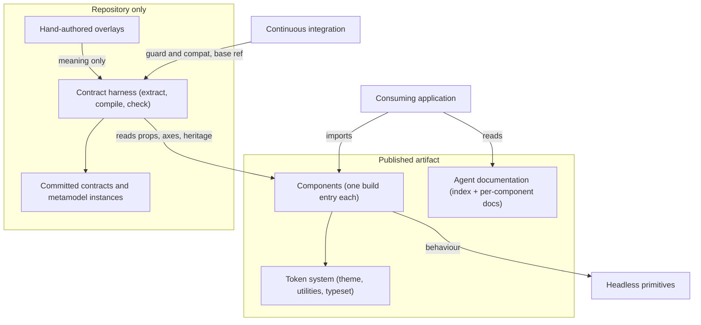
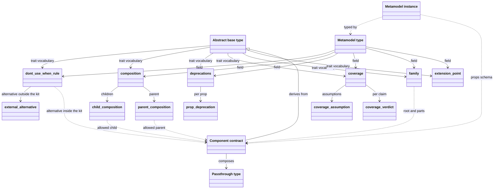

# Technical Design - UI Kit

- [ ] `p3` - **ID**: `cpt-frontx-ui-kit-design-component-base`

<!-- toc -->

- [1. Architecture Overview](#1-architecture-overview)
  - [1.1 Architectural Vision](#11-architectural-vision)
  - [1.2 Architecture Drivers](#12-architecture-drivers)
  - [1.3 Architecture Layers](#13-architecture-layers)
- [2. Principles & Constraints](#2-principles--constraints)
  - [2.1 Design Principles](#21-design-principles)
  - [2.2 Constraints](#22-constraints)
- [3. Technical Architecture](#3-technical-architecture)
  - [3.1 Domain Model](#31-domain-model)
  - [3.2 Component Model](#32-component-model)
  - [3.3 API Contracts](#33-api-contracts)
  - [3.4 Internal Dependencies](#34-internal-dependencies)
  - [3.5 External Dependencies](#35-external-dependencies)
  - [3.6 Interactions & Sequences](#36-interactions--sequences)
  - [3.7 Database schemas & tables](#37-database-schemas--tables)
- [4. Additional context](#4-additional-context)
- [5. Traceability](#5-traceability)

<!-- /toc -->

## 1. Architecture Overview

### 1.1 Architectural Vision

The package is two things built on one component surface. It is a published React component library: behaviour taken from headless primitives, appearance expressed only through a semantic token vocabulary, one build entry per component so a consumer pays for what it imports, and documentation carried inside the artifact so a reader in a consuming project reads the version that project resolved. And it is the ecosystem's first attempt at making a component library's knowledge checkable rather than reviewable: for a component that has been described, a compiled contract states the component's meaning next to the prop facts read out of its own TypeScript.

The shape of the second half follows from one decision. The code is the owner of every fact the code can state - the exported components, their variant axes and defaults, the props they declare, the surface they inherit - and the hand-authored overlay owns only meaning: what the component is for, where it is the wrong choice, what may compose into it, what must never be done with it. The compiler joins the two and refuses an overlay that reaches into the machine's half. Everything downstream exists to keep that join honest: a conformance suite per described component, a freshness comparison that fails a change whose committed artifacts no longer equal a fresh compile, a compatibility comparison against the change's base reference that refuses a narrowing of a described surface unless the contract major moved, and a guard scoped to the components the change touches so coverage can grow without a kit-wide gate anyone would switch off.

The package is a full member of the published-libraries layer that is deliberately not *core*: it is committed to React, which is exactly what the layer's two independent properties exist to permit ([root DESIGN §1.3](../../../architecture/DESIGN.md#13-architecture-layers)).

### 1.2 Architecture Drivers

#### Functional Drivers

| Requirement | Design Response |
|-------------|------------------|
| `cpt-frontx-ui-kit-fr-component-set` | `cpt-frontx-ui-kit-component-package-build` emits one library entry per component's public barrel plus a package barrel, and the export map publishes the barrel, the per-component subpath and the three stylesheets while blocking every internal path. |
| `cpt-frontx-ui-kit-fr-token-styling` | `cpt-frontx-ui-kit-component-token-system` owns the whole appearance vocabulary; component stylesheets are CSS Modules that may consume only that vocabulary, and the seam is asserted rather than trusted (UIKIT-2). |
| `cpt-frontx-ui-kit-fr-theme-selection` | The token system defines the light values on the root and redefines them under both the preference query and the explicit theme attribute, so both selection paths resolve the same values. |
| `cpt-frontx-ui-kit-fr-client-boundary` | The build re-applies the client directive to the emitted chunk of every source module that declared one, deriving the classification from the source rather than from a maintained list. |
| `cpt-frontx-ui-kit-fr-agent-documentation` | `cpt-frontx-ui-kit-component-agent-documentation` keeps a usage document beside each component and copies them into the published artifact at build, with the index shipped at the package root. |
| `cpt-frontx-ui-kit-fr-consumer-acceptance` | `cpt-frontx-ui-kit-component-consumer-acceptance` packs the artifact and installs it into clean projects per bundler and module-resolution mode, probing for class names taken from the just-built artifact rather than hardcoded. |
| `cpt-frontx-ui-kit-fr-component-contract` | `cpt-frontx-ui-kit-component-contract-harness` compiles a described component's overlay together with facts read from its TypeScript into a props schema and a metamodel instance. |
| `cpt-frontx-ui-kit-fr-contract-single-fact-owner` | The compiler rejects an overlay carrying a machine-owned field, an unknown field, or a reference to a prop the component does not declare (UIKIT-1). |
| `cpt-frontx-ui-kit-fr-contract-freshness` | The harness's freshness comparison is reached from two directions: a per-component conformance suite in the unit run, and the guard in the continuous-integration run. |
| `cpt-frontx-ui-kit-fr-contract-compatibility` | The harness compares a contract against the same contract at the change's base reference across three signals - the type system's own verdict, the declared-prop diff and the inherited-surface diff - and accepts an incompatible result only when the contract major moved. |
| `cpt-frontx-ui-kit-fr-contract-incremental-coverage` | The guard's scope is the change's own file set widened to every covered component when the shared tooling itself changed; the coverage report is a report and never an exit code (`cpt-frontx-ui-kit-principle-scoped-enforcement`). |

#### NFR Allocation

| NFR ID | NFR Summary | Allocated To | Design Response | Verification Approach |
|--------|-------------|--------------|-----------------|----------------------|
| `cpt-frontx-ui-kit-nfr-selective-cost` | A consumer pays only for what it imports | `cpt-frontx-ui-kit-component-package-build` | One build entry per component, per-entry style emission, side effects declared for stylesheets only, and shared code split into chunks rather than inlined into every entry. | The consumer acceptance run asserts both directions on a real consumer build: the imported component's style rules present, every other component's absent. |
| `cpt-frontx-ui-kit-nfr-gate-adoptability` | Enforcement scoped to the change | `cpt-frontx-ui-kit-component-contract-harness` | The guard evaluates only the components the change touches; coverage is an opt-in allowlist and the coverage report never sets an exit code. | The harness's own unit suites fix the guard's verdicts and the coverage report's non-blocking behaviour. |
| `cpt-frontx-ui-kit-nfr-standalone-verification` | Package-local verification | The package | Test and build configuration live in the package, including the contract tooling's own suites; nothing reaches into template territory. | The dependency-edge and boundary guards hold the package to its declared edges. |
| `cpt-frontx-nfr-evolvability` | Versioned releases without lockstep upgrades | The published package | The package publishes on its own version line with React as a peer range, and a substantive change to its shipping sources requires a version bump before it can merge. | The ecosystem version-policy and version-bump checks. |

**ADR coverage references:**

- `cpt-frontx-adr-ai-tooling-framework-packaging` - establishes the kit mechanism this package is the second adopter of, and the reserved resource prefix its own kit is to carry. The kit itself is decided and unbuilt.
- `cpt-frontx-adr-default-type-substrate-provider` - fixes the concrete type-definition specification the contract harness names its identifiers in and takes one of its three compatibility signals from. The dependency is on the specification's own build-time library, taken as a development dependency by the harness; nothing here reaches the runtime provider or the port it implements, and no published artifact carries it.

### 1.3 Architecture Layers

- [x] `p3` - **ID**: `cpt-frontx-ui-kit-tech-kit-stack`



| Layer | Responsibility | Technology |
|-------|---------------|------------|
| Component surface | The exported components, their styles, their public entry points and the export map | React over TypeScript; headless primitives for behaviour; CSS Modules for styling; a variant-authoring library for the axes |
| Appearance vocabulary | The tokens every component's styling consumes, and the theme selection over them | Plain CSS custom properties in three global stylesheets |
| Package build | One entry per component, per-entry style emission, client-directive preservation, declaration emission and documentation copying | Library-mode bundler with a package-local build plugin |
| Agent documentation | A usage document per component and the index that lists them, shipped inside the artifact | Markdown, copied into the artifact at build |
| Contract harness | Fact extraction, contract compilation, conformance, freshness, compatibility, guard and coverage | TypeScript run directly; the TypeScript compiler API for extraction; JSON Schema 2020-12 for the compiled surface; the ecosystem's type-definition specification for identifiers and the compatibility verdict |

## 2. Principles & Constraints

### 2.1 Design Principles

#### The code owns every fact the code can state

- [x] `p2` - **ID**: `cpt-frontx-ui-kit-principle-code-is-the-fact-owner`

A component's exports, variant axes, defaults, declared props and inherited surface are read out of its TypeScript, never transcribed. The hand-authored half of a contract carries meaning and nothing else. This is what keeps the cost of describing a component proportional to the meaning being added, and it is why a contract cannot quietly disagree with the component: there is only one writable statement of each fact.

The alternative - authoring the surface and generating the code from it - was considered and not taken. It would move every component author onto a new authoring path to solve a problem the compatibility comparison solves directly, and it would make the description normative for components whose surface the kit does not own.

#### Appearance is a vocabulary, not a set of values

- [x] `p2` - **ID**: `cpt-frontx-ui-kit-principle-styling-through-tokens`

Every appearance decision a component makes is expressed as a reference to a token the kit defines. A component stylesheet that introduces a colour or an off-scale metric has taken a decision away from the consumer, because rebranding then requires editing the kit rather than overriding it. The seam is one-directional: components consume the vocabulary, and the vocabulary knows nothing about any component.

#### Enforcement is scoped to the change, never to the kit

- [x] `p2` - **ID**: `cpt-frontx-ui-kit-principle-scoped-enforcement`

Contract checks apply to the components a change touches and to the components explicitly opted in. Kit-wide completeness is reported and never enforced. A gate that fails on everything not yet described would start almost entirely red on a kit of this size, and a gate in that state is switched off rather than satisfied. Scoping enforcement to the change makes coverage a by-product of ordinary work instead of a campaign.

### 2.2 Constraints

#### UIKIT-1 - An overlay states meaning only

- [x] `p2` - **ID**: `cpt-frontx-ui-kit-constraint-overlay-meaning-only`

The hand-authored overlay may not restate a fact the compiler reads from the code, may not carry a field the overlay vocabulary does not define, and may not reference a prop the component does not declare. Each of the three is refused by name at compile time. This is the enforcement of `cpt-frontx-ui-kit-principle-code-is-the-fact-owner`.

#### UIKIT-2 - Component styling consumes only the kit's vocabulary

- [x] `p2` - **ID**: `cpt-frontx-ui-kit-constraint-token-seam`

A component stylesheet may consume only variables the token system defines, plus the variables the underlying primitive supplies at runtime for positioning and animation. It may not declare a raw colour or an off-scale metric. The rule is asserted over the stylesheets themselves rather than left to review.

#### UIKIT-3 - A standalone published-libraries member that is not core

- [x] `p2` - **ID**: `cpt-frontx-ui-kit-constraint-ui-committed-member`

The package is a member of the published-libraries layer holding one of that layer's two independent properties and not the other. It is not *core*, because it is committed to a UI framework. It is *standalone*, because standalone means declaring no intra-ecosystem package dependency, and the package declares none - the libraries it wraps are all external. Reading "not core" as "neither property" is exactly the conflation the root design keeps the two apart to prevent ([root DESIGN §1.3](../../../architecture/DESIGN.md#13-architecture-layers)); a UI-committed library that depends on no other member is precisely the case that separation admits. No ecosystem contract is permitted to privilege this package over another library in the same role.

#### UIKIT-4 - Contract artifacts are repository artifacts

- [ ] `p2` - **ID**: `cpt-frontx-ui-kit-constraint-contracts-repository-only`

Contracts, metamodel instances, overlays and the harness that produces them stay inside the repository and outside the published artifact. Nothing a consumer installs depends on them, and nothing in them may become load-bearing for a consumer while that holds. Lifting this is `cpt-frontx-ui-kit-fr-contract-distribution`, which is not built; until it is, a check against a contract can run here and not in a consuming project.

## 3. Technical Architecture

### 3.1 Domain Model

| Entity | Definition | Representation |
|--------|------------|----------------|
| Component | One exported React component together with its stylesheet, its usage document, its unit suite and its public entry point. | A directory under the component root; one build entry per public barrel |
| Token | A named appearance value the kit defines once for every component to consume. | A CSS custom property on the theme's root and theme blocks |
| Overlay | The hand-authored half of a contract: meaning, composition rules, invariants, anti-patterns, examples and coverage claims. | A YAML document beside the component, one per described export |
| Extraction | The machine-owned half: the exported components of a file with their variant axes, defaults, declared props, inherited props and resolved passthrough origin. | An in-memory result of reading the component's TypeScript through the compiler API |
| Contract | The compiled join of an overlay and an extraction: a closed props schema carrying the component's meaning in two extension blocks. | A JSON Schema 2020-12 document committed beside the component |
| Metamodel instance | The same meaning as a standalone typed record, naming the contract as its props schema. | A JSON document committed beside the component |
| Abstract base type | The root every component contract derives from: it declares no props and states which concepts a contract's validator-read block carries. | A JSON Schema 2020-12 document under the harness, with its own type identifier |
| Metamodel type | The type every metamodel instance is an instance of: the shape of a contract as a standalone record. | A JSON Schema 2020-12 document under the harness, with its own type identifier |
| Passthrough type | The surface a component inherits from the primitive it wraps, shared by every component that inherits from the same origin. | A generated JSON Schema document under the harness, keyed by origin |
| Vocabulary type | One concept the overlay states, defined once and referenced by everything that carries it - one type per concept the metamodel references, currently twelve. | A JSON Schema 2020-12 document under the harness, one per concept, each with its own type identifier |
| Coverage allowlist | The set of components opted into contract enforcement. | A committed list of component directory names |

#### Contract type relationships

The abstract base type states which concepts a contract's validator-read block carries; each concept is a type of its own, and the metamodel type reaches the same concepts through the same identifiers. A reference to another component is that component's own derived contract identifier: a component IS the type derived from the base, so nothing else stands in for it.

Two kinds of edge, and the diagram distinguishes them: a **solid** arrow means the source embeds an instance of the target, by reference to its identifier from inside the schema; a **dashed** arrow means the source holds the target's identifier as a value, annotated with what that identifier must resolve to. Inheritance keeps its own arrow.

An identifier held as a value names a SPECIFIC contract major. When a component's contract major moves, every reference to it moves with it: a reference to a component that ships a contract must equal that contract's current props-schema identifier exactly, and a reference to a component that ships none may only name major 1. Those identifiers are resolved by each component's conformance suite - against the component directory, and against the contract identifier where a contract exists - not by the type registry: the type system's own reference validator does not follow a reference into another type, and most referenced components ship no contract yet, so the directory is what says the kit ships that component at all.

Three overlay fields are not vocabulary types and stay inline in the metamodel: `invariants`, `anti_patterns` and `examples` are documentation no validator reads, so there is nothing for another type to enforce or for anything else to reference.



| Type | References | Cardinality | Owner of the fact |
|------|------------|-------------|-------------------|
| Component contract | the abstract base type, the passthrough type for its origin | one base, zero or one passthrough | the compiler builds it; the extraction owns the prop facts, the overlay author the meaning |
| Metamodel instance | the metamodel type, the component contract | exactly one of each | the compiler |
| Abstract base type | each of the six field-level vocabulary types | one each | the trait schema builder |
| Metamodel type | the same six vocabulary types | one each | the metamodel builder |
| Passthrough type | nothing; component contracts reference it | one type referenced by one or more contracts | the compiler builds it; the extractor owns which props are inherited and which are mandatory |
| dont_use_when_rule | a component contract, or an external alternative | exactly one of the two per rule | the overlay author |
| external_alternative | nothing | zero or one per rule | the overlay author |
| composition | a child composition, a parent composition | one child, zero or one parent | the overlay author |
| child_composition | component contracts | one or more kinds, each a reference or a content kind; `icons_via` names one of the component's own props | the overlay author, prop name checked against the extraction |
| parent_composition | component contracts | one or more | the overlay author |
| deprecations | prop deprecations | zero or more, keyed by prop name | the overlay author |
| prop_deprecation | nothing; `replacement` names one of the component's own props | exactly one per deprecated prop | the overlay author, prop name checked against the extraction |
| coverage | coverage assumptions, coverage verdicts | zero or more of each; the one open type, so a claim name the kit adds validates without a schema change | the overlay author |
| coverage_assumption | nothing | zero or more per contract | the overlay author |
| coverage_verdict | nothing | one per coverage claim | the overlay author |
| family | component contracts | one root; a root names one or more parts, a part names none | the overlay author, resolved by the conformance suite |
| extension_point | nothing | zero or more per contract | the overlay author |

### 3.2 Component Model

#### Component Surface

- [x] `p2` - **ID**: `cpt-frontx-ui-kit-component-component-surface`

Concrete artifact: the component directories and the package barrel of `@gears-frontx/ui-kit`.

##### Why this component exists

A consuming application needs components whose behaviour it does not have to implement and whose appearance it can rebrand. This is that surface: each component takes its interaction behaviour and accessibility from a headless primitive, declares its own variant axes and props, and carries its styling in a module scoped to itself.

##### Responsibility scope

- Exports one React component per component directory, behind that directory's public entry point and the package barrel.
- Declares each component's variant axes and defaults in the code, which is what makes them machine-readable.
- Redeclares the props the kit narrows or adds, leaving everything else to the primitive's own surface.
- Carries the client-boundary directive in the source of exactly those components that call a hook in their own render body.

##### Responsibility boundaries

- Owns no appearance value: every one is a reference to the token system (UIKIT-2).
- Owns no interaction mechanics that the primitive it wraps already provides.
- Owns no application domain content and no data access.
- Does not decide how it is bundled or published; that is the package build's responsibility.

##### Related components (by ID)

- `cpt-frontx-ui-kit-component-token-system` - supplies the entire appearance vocabulary these components consume.
- `cpt-frontx-ui-kit-component-package-build` - turns each public entry point into a published entry.
- `cpt-frontx-ui-kit-component-contract-harness` - reads these components' TypeScript as the machine-owned half of a contract.

#### Token System

- [x] `p2` - **ID**: `cpt-frontx-ui-kit-component-token-system`

Concrete artifact: the package's three global stylesheets and the seam guard over them.

##### Why this component exists

Rebranding must be an override, not a fork. That requires exactly one place where an appearance value is decided, and a rule that components reference it rather than restating it.

##### Responsibility scope

- Defines the radius, spacing, control-metric, elevation, colour and type-ramp vocabulary as custom properties.
- Defines both themes: the light values on the root, redefined under the viewer's preference and under an explicit theme declaration, so a document or any subtree can be pinned.
- Ships as global stylesheets an application imports once, separate from the per-component style emission.

##### Responsibility boundaries

- Knows nothing about any component: the dependency runs one way only.
- Does not own component layout or component-local structural CSS; those live in the component's own module and consume this vocabulary.
- Does not ship font files; it names families and leaves their delivery to the consuming application.

##### Related components (by ID)

- `cpt-frontx-ui-kit-component-component-surface` - the sole consumer of this vocabulary.

#### Package Build

- [x] `p2` - **ID**: `cpt-frontx-ui-kit-component-package-build`

Concrete artifact: the package's library build configuration and its build plugin.

##### Why this component exists

Nearly every property a consumer depends on is decided at build time and invisible in the source: whether a component's styles are emitted as their own artifact, whether the client directive survives bundling, whether the declaration files resolve under a consumer's module resolution, and whether importing one component pulls in the rest.

##### Responsibility scope

- Emits one library entry per component public entry point plus the package barrel, with shared code split into chunks rather than duplicated.
- Emits each entry's styles as their own artifact and marks stylesheets as the package's only side effects, so a bundler that honours the declaration can drop the rest.
- Re-applies the client-boundary directive to the emitted chunk of every source module that declared one, deriving the set from the source rather than from a maintained list.
- Emits declarations and the flat re-export shims that make the per-component subpath resolve under both module-resolution modes.
- Copies the global stylesheets and the per-component usage documents into the published artifact.

##### Responsibility boundaries

- Decides nothing about a component's behaviour or appearance.
- Publishes no contract artifact and no harness source (UIKIT-4).
- Does not verify its own output; that is the consumer acceptance component's responsibility, and deliberately so, because a build cannot observe the properties that only fail at a consumer.

##### Related components (by ID)

- `cpt-frontx-ui-kit-component-component-surface` - supplies the entry points.
- `cpt-frontx-ui-kit-component-agent-documentation` - supplies the documents this build copies into the artifact.
- `cpt-frontx-ui-kit-component-consumer-acceptance` - checks this component's output from outside.

#### Agent Documentation

- [x] `p2` - **ID**: `cpt-frontx-ui-kit-component-agent-documentation`

Concrete artifact: the per-component usage documents, the index at the package root, and the guard that holds them to the component set.

##### Why this component exists

An agent writing application code reads what the project installed. Documentation that lives anywhere else describes a version the project may not have, and the reader cannot tell.

##### Responsibility scope

- Keeps one usage document per component beside that component, and ships a copy of each inside the published artifact.
- Ships an index at the package root naming every component's document path together with the rules that apply across the kit.
- Holds the set to the component set: every exported component has a document, is named in the index, and has the values of its stylesheet's styling axes named in its document.

##### Responsibility boundaries

- Carries prose, not a checkable contract. What a tool can verify lives in the contract harness's artifacts, not here.
- The documents are authored, not generated; the build copies them and adds nothing.
- Does not describe composition above a single component.

##### Related components (by ID)

- `cpt-frontx-ui-kit-component-package-build` - copies these documents into the published artifact.
- `cpt-frontx-ui-kit-component-contract-harness` - the checkable description of the same components, for the described subset.

#### Contract Harness

- [x] `p2` - **ID**: `cpt-frontx-ui-kit-component-contract-harness`

Concrete artifact: the contract tooling under the package's `scripts/contracts/` directory, together with the compiled artifacts committed beside each described component.

##### Why this component exists

Prose describing a component can only be reviewed. This component produces a description a tool can act on, and then keeps that description honest: nothing else in the package can tell whether a description has fallen behind the code it describes, or whether a change narrowed a surface a consumer depends on.

##### Responsibility scope

- Reads a component's TypeScript for its exported components, variant axes and defaults, declared props, inherited props and the origin of the surface it inherits.
- Validates the hand-authored overlay against the overlay vocabulary and refuses one that reaches into the machine's half (UIKIT-1).
- Compiles the two into a closed props schema and a metamodel instance, and maintains one shared type per inherited-surface origin.
- Constructs the identifiers the contracts are named in, following the type-definition specification's segment grammar.
- Routes each meaning field either to the block a validator reads or to the block that is prose, and derives the validator-read half's schema from the same definitions the metamodel uses, by reference to the vocabulary type that owns each concept (see 3.1).
- Writes the schemas that belong to no single component - the abstract base type, the metamodel, the vocabulary types - from their builders, so the identifier grammar has one source and a stale committed copy is a comparison failure rather than a silent divergence.
- Supplies the per-component conformance suite that fails when a committed artifact no longer equals a fresh compile.
- Decides compatibility against a base reference and requires a contract major move for an incompatible difference.
- Decides which components a change must be held to, and reports kit-wide coverage without failing on it.

##### Responsibility boundaries

- Never edits a component: the code is the fact owner, and a disagreement is reported, not repaired (`cpt-frontx-ui-kit-principle-code-is-the-fact-owner`).
- Produces nothing a consumer installs (UIKIT-4).
- Does not decide when it runs. The base reference and the invocation come from outside the package, so the same tool serves a local run and a continuous-integration run without knowing which it is in.
- Owns no meaning of its own: every semantic statement in a contract came from an overlay a person wrote.

##### Related components (by ID)

- `cpt-frontx-ui-kit-component-component-surface` - the subject it reads and the code it holds the contracts to.
- `cpt-frontx-ui-kit-component-agent-documentation` - the prose description of the same components; the two are independent and neither generates the other.

#### Consumer Acceptance

- [x] `p2` - **ID**: `cpt-frontx-ui-kit-component-consumer-acceptance`

Concrete artifact: the package's consumer verification script and the clean projects it builds.

##### Why this component exists

The properties a consumer depends on most - that styles survive, that unimported components cost nothing, that types resolve - are decided by the interaction between this package's manifest and a consumer's bundler. None of them can be observed from inside this package's own build.

##### Responsibility scope

- Packs the artifact and installs it into clean projects, one per bundler and module-resolution mode a consumer may use.
- Asserts both directions on each: the imported component's code and styles present, every other component's absent, using probes taken from the just-built artifact rather than hardcoded.
- Asserts that the artifact carries the documentation index and the per-component documents.
- Asserts the client-boundary classification against the built artifact, and fails on a component the classification does not mention.

##### Responsibility boundaries

- Reports on this package only; it is not a test of the bundlers, which is why their versions are pinned.
- Does not run in the unit lane: it packs and installs, and belongs in a slower one.
- Checks the published artifact, not the source.

##### Related components (by ID)

- `cpt-frontx-ui-kit-component-package-build` - the component whose output this one accepts or rejects.

### 3.3 API Contracts

- [x] `p2` - **ID**: `cpt-frontx-ui-kit-interface-package-entry`

- **Contracts**: `cpt-frontx-ui-kit-interface-component-package`, `cpt-frontx-ui-kit-interface-agent-documentation`
- **Technology**: ECMAScript-module package with TypeScript declarations; CSS Modules per component; global stylesheets as separate exports
- **Location**: [src/index.ts](../src/index.ts)

| Public surface | Purpose |
|----------------|---------|
| Package barrel | Every exported component, for a consumer that prefers one import site. |
| Per-component subpath | One component and its styles, for a consumer minimizing what it takes. |
| Global stylesheets | The token vocabulary, the utility layer and the type ramp, imported once by an application. |
| Documentation index and per-component documents | The agent-facing description, read from the install. |

Two path shapes are deliberately not public: the internal component module layout, which is blocked in the export map so it stays free to change, and the contract artifacts, which are not in the published artifact at all (UIKIT-4).

### 3.4 Internal Dependencies

The package declares no dependency on another ecosystem package, which is what makes it standalone (UIKIT-3). Every library it does depend on is external; being committed to a UI framework costs it the core property, not the standalone one.

What the package may depend on, and which members may depend on it, is not yet settled by an accepted decision. Until one lands, that policy is enforced by the repository's interim dependency-cruiser rules, which hold the package isolated in both directions: no existing ecosystem package may acquire a dependency on it, and it may acquire none of its own. Those rules are deliberately untraced - there is no decision for them to cite yet - and they remain the enforcement of this boundary until there is.

**Dependency Rules** (per project conventions):
- No import of template territory
- No dependency on another ecosystem package's implementation
- The contract harness imports from the package's own sources only through the TypeScript compiler API, so it reads components without linking them

### 3.5 External Dependencies

#### Headless component primitives

| Dependency Module | Interface Used | Purpose |
|-------------------|----------------|---------|
| Primitive component libraries | Component props and behaviour of unstyled primitives | Supply interaction behaviour and accessibility so the kit owns appearance and composition only. Their prop surface is what a component's inherited surface is derived from. |

**Dependency Rules** (per project conventions):
- Behaviour comes from a primitive; a component does not reimplement interaction mechanics the primitive provides
- A primitive's appearance decisions are overridden through the token vocabulary, never adopted

#### Component capability libraries

| Dependency Module | Interface Used | Purpose |
|-------------------|----------------|---------|
| Data-grid library | Table model, column definitions, row selection, pagination | Supplies the data-table component's model layer, which is why that component's props carry type parameters the contract compiler can only record as slots. |
| Charting library | Chart primitives | Supplies the chart component's rendering. |
| Command-palette library | Filterable command list | Supplies the command component's matching and keyboard model. |
| Date libraries | Calendar rendering and date arithmetic | Supply the calendar and date-picker components. |
| Carousel library | Carousel engine | Supplies the carousel component. |
| Resizable-panels library | Panel group and drag handles | Supplies the resizable component. |
| Icon set | Icon components | The kit's icon vocabulary, referenced by components that render icons. |
| Secondary primitive library | Headless behaviour for two components | Supplies the behaviour of the two components not built on the main primitive family. Their inherited surface resolves no origin the contract compiler recognizes, which is why they are outside contract coverage today. |

**Dependency Rules** (per project conventions):
- Each of these belongs to the component that needs it; none becomes a kit-wide concern, and none is re-exported
- A component's appearance stays on the token vocabulary regardless of what its capability library ships (UIKIT-2)
- `cpt-frontx-ui-kit-nfr-selective-cost` is about what reaches a consumer's *bundle*, not what reaches its install graph: these are runtime dependencies of the package and are installed whether or not the components needing them are imported. Keeping them out of an unimporting consumer's build is the per-entry emission the package build is responsible for.

#### Variant authoring

| Dependency Module | Interface Used | Purpose |
|-------------------|----------------|---------|
| Variant-authoring library | Variant declaration and the type it derives | Declares each component's axes and defaults in the code, which is what lets the contract compiler read them rather than have them transcribed. |

**Dependency Rules** (per project conventions):
- Axes are declared through this library so they stay machine-readable; a component that hides its axes behind an indirection the compiler cannot follow is a component to change

#### Type-definition specification and schema validation

| Dependency Module | Interface Used | Purpose |
|-------------------|----------------|---------|
| Type-definition specification | Identifier grammar, entity validation, backward-compatibility comparison | Names the contracts, validates a contract's validator-read block against the base type's trait schema, and contributes one of the three compatibility signals. |
| JSON Schema validator | Draft 2020-12 validation | Validates an overlay against the overlay vocabulary and an assembled artifact against the metamodel before anything is written. |
| TypeScript compiler API | Program, type checker, declaration resolution | Reads a component's exports, axes, props and heritage by resolved symbol identity rather than by written name. |

**Dependency Rules** (per project conventions):
- These three are used by the contract harness only and reach no published artifact (UIKIT-4)

### 3.6 Interactions & Sequences

#### Describing a component and guarding a change to it

- [x] `p3` - **ID**: `cpt-frontx-ui-kit-seq-contract-compile-and-guard`

**Use cases**: `cpt-frontx-ui-kit-usecase-describe-and-change-component`

**Actors**: `cpt-frontx-ui-kit-actor-kit-developer`, `cpt-frontx-ui-kit-actor-continuous-integration`

```mermaid
sequenceDiagram
    participant Dev as Kit developer
    participant CLI as Contract compiler
    participant TS as TypeScript program
    participant FS as Committed artifacts
    participant CI as Continuous integration
    Dev->>CLI: compile the component's contracts
    CLI->>TS: read exports, axes, defaults, props, heritage
    TS-->>CLI: extraction (or an unresolvable-axis failure)
    CLI->>CLI: validate the overlay; refuse a machine-owned or unknown field
    alt inherited surface with no resolvable origin
        CLI-->>Dev: refuse, naming the inherited props it cannot declare
    else
        CLI->>FS: write the contract, the instance and the shared passthrough type
        CLI-->>Dev: the written paths
    end
    Dev->>CI: submit the change
    CI->>CLI: guard against the base reference
    CLI->>FS: recompile each in-scope component and compare
    CLI-->>CI: stale or missing artifacts, or clear
    CI->>CLI: compatibility against the base reference
    CLI->>FS: read each contract here and at the base reference
    CLI-->>CI: compatible, incompatible with the major moved, or refused
```

**Description**: The two halves of the harness meet the same artifacts from opposite directions. Compilation is a developer action that writes; guarding and compatibility are continuous-integration actions that only read and compare. The failure that matters most is the quiet one in the middle: a component changed without recompiling. It is caught twice - by the component's conformance suite in the unit run, and by the guard in the continuous-integration run - because those two runs fail for different people at different moments.

### 3.7 Database schemas & tables

Not applicable. The package holds no database and no persistence. Its schemas are JSON Schema documents committed in the repository and read from disk.

## 4. Additional context

Two facts about the current state are worth stating so they are not read as design intent. Contract coverage is a small opt-in subset of the component set, by the design in `cpt-frontx-ui-kit-principle-scoped-enforcement`, and the number is expected to grow with ordinary work rather than through a campaign. And the compiler resolves an inherited surface for two families of origin - a plain DOM element, and the primitive family most of the kit is built on. A component built on another primitive family resolves no origin and is refused rather than described with an invented surface; extending that is design work on the origin resolver, not configuration.

The package is also the second adopter of the Constructor Studio kit mechanism, reserving its own resource prefix so its resources cannot collide with the AI tooling framework's (`cpt-frontx-adr-ai-tooling-framework-packaging`). That kit is decided and unbuilt; this design describes no part of it as existing.

Two decisions inside the knowledge layer are open, and both get more expensive the longer coverage grows:

- **The vendor namespace the contract identifiers are built on.** A shorter form and a form carrying a design segment were both proposed and neither was settled. The identifier construction keeps the namespace in a single constant precisely so the change stays a one-line edit, but every committed contract, instance and generated inherited-surface type carries the namespace in its own identifier, so the cost of changing it is proportional to the described set. Trigger: settle it before coverage grows past the pilot components.
- **Whether a type-system runtime is expected to act on the meaning fields, or only to validate and store them.** Today the split between the block a validator reads and the block that is prose assumes the latter. If the answer becomes the former, the prose fields move into the validator-read block and the prose block folds away. The routing map is the single edit point for that move, which is why the split is expressed as a map rather than as two hand-maintained lists. Trigger: the answer to that question in the type-substrate decision.

## 5. Traceability

- **PRD**: [PRD.md](./PRD.md)
- **ADRs**: [root ADR/](../../../architecture/ADR/) - this package owns no ADR of its own; the decisions it answers to are `cpt-frontx-adr-ai-tooling-framework-packaging` and `cpt-frontx-adr-default-type-substrate-provider`, both root-owned.
- **Features**: [features/](./features/)
- **Root chain**: [PRD](../../../architecture/PRD.md), [DESIGN](../../../architecture/DESIGN.md), [DECOMPOSITION](../../../architecture/DECOMPOSITION.md)

This package's requirements are owned by its own [PRD](./PRD.md), per the 3-layer model: each member explains its own requirements, and the root PRD describes the layers and the requirements binding every member equally.
